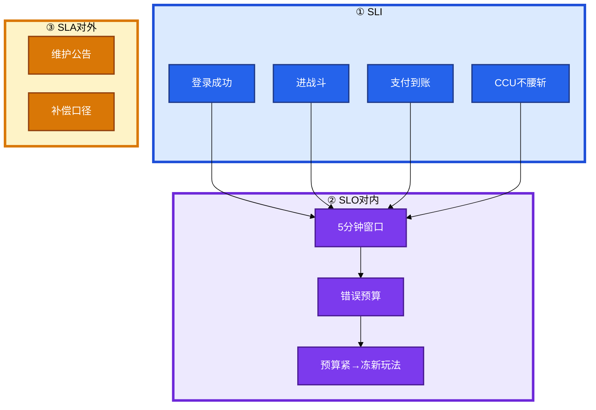
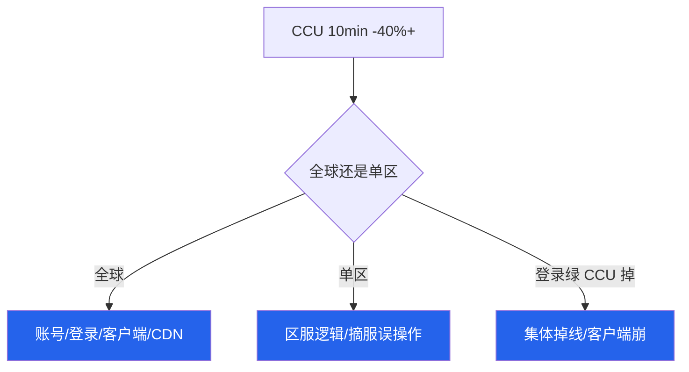

# 游戏 SRE 稳定性


开服 10 分钟登录成功率 90%。月底有人甩网关 HTTP 99.9%，说没破 SLO。活动整点还有人要发战斗热更。**SLI 量玩家废了什么，SLO 对内刹车，SLA 对外承诺，三张表分开。**

**本章主线（稳定性就按这三步想）：**

1. **量对**：登录 5min 窗口、进战斗、结算、支付、CCU——不用网关 200 代替。
2. **变更纪律**：活动整点禁无关变更；可扩登录、可扳降级开关；战斗热更/合服/强更叠窗 = 事故套餐。
3. **指挥**：唯一指挥官；先说哪条 SLI 破了，再止血；破 SLO 升 P0 与 SLA 赔不赔分开说。

**读完你能：** 订登录/战斗/支付分条 SLI；讲清 SLO vs SLA；CCU 腰斩怎么分；事故指挥五步；写一条登录 SLO 告警规则。

## 本章目录

- [1. 基本概念](#1-基本概念)
- [2. 架构图](#2-架构图)
- [3. 原理](#3-原理)
- [4. 落地](#4-落地)
- [5. 核心配置](#5-核心配置)
- [6. 命令与操作](#6-命令与操作)
- [7. 生产排障](#7-生产排障)
- [8. 必会 · 常考](#8-必会--常考)
- [合上书](#合上书问自己)

**本章不讲：** 主机 HA 理论 → [01-26](../../01-基础底座/26-高可用与容灾/)；监控底座 → [01-22](../../01-基础底座/22-监控与告警/)；摘流 → [01](../01-游戏服务器架构/)、[03](../03-热更新与版本发布/)；回档 → [07](../07-玩家数据备份与回档/)。

---

## 1. 基本概念

Web 可用性 = 请求成功占比。游戏玩家废的是：登不上、进不了战斗、结算错、钱扣了道具没有、CCU 无故腰斩。

**值班里什么时候碰到：**

| 场景 | 谁说什么 | 你的第一刀 |
|------|----------|------------|
| 开服 10min | 「月历 99.9% 没破啊」 | 5min SLI 已破 → P0 |
| 活动整点 | 「顺便热更战斗」 | 拒绝叠窗 |
| 登录绿 | 「应该没事吧」 | 查进战斗 SLI |
| CCU 掉 40% | 「CPU 不高啊」 | 环比/分服，不是绝对值 |

| 词 | 是什么 | 游戏里对谁说 |
|----|--------|--------------|
| **SLI** | 怎么量 | 5min 登录成功率、进战斗、支付、CCU |
| **SLO** | 内部目标 | 破了升 P0、吃错误预算 |
| **SLA** | 对外契约 | 维护公告、补偿、合服除外项 |

```
SLI = 尺子（量玩家废了什么）
SLO = 内部红线（破了 P0 + 吃预算）
SLA = 对外合同（维护/补偿/除外）

破 SLO ≠ 自动破 SLA
没破 SLA ≠ 可以不升 P0
```

> **记住：** 开服 10 分钟登录 90%，5 分钟 SLI 已破 = P0。月历网关 99.9% 救不了这次。

**面试怎么说**：「网关 99.9% 不能当游戏 SLO。我先说哪条 SLI 破了——登录、进战斗、支付、CCU 分开量、分开告警。」

---

## 2. 架构图



**读图三句话：**

1. 先说哪条 SLI 破了，再决定摘登录还是摘房间——不要同时改三处。
2. SLO 破了升 P0；SLA 破了才谈公告补偿——不要混成一句 99.9%。
3. 结算错时可用性板可以全绿，仍是 P0。

**事故指挥信息流：**


---

## 3. 原理

### 3.1 SLI：玩家废了什么

**一句话：** 网关 200 只量 HTTP 通不通；玩家废的是登录、战斗、钱、CCU——每条 SLI 独立量、独立告警。

**打个比方**：网关 200 像「门能推开」——**门开了里面空货架（空响应）、收银台坏了（结算错），玩家照样废**。

**现场走一遍**（开服 10min，登录成功率 90%）：

1. 查 5min 窗口 SLI：

```bash
curl -s 'http://prom:9090/api/v1/query?query=sum(rate(login_success_total[5m]))/sum(rate(login_attempt_total[5m]))'
```

2. 屏幕：`0.902` → **< 99.5% 目标**。
3. 月历网关 HTTP 99.9% 仍绿——探活 200、空响应也算成功。
4. 定级：**5min SLO 已破 → P0**；是否触发 SLA 补偿另算。
5. 止血：扩登录/排队/目录（04），不是先看 CPU。

| SLI | 定义 | 为什么独立 |
|-----|------|------------|
| 登录成功率 | 鉴权到大厅成功 / 尝试登录 | 开服/版本日主指标 |
| 进战斗成功率 | 有 ticket 后进房间成功 | 登录好、战斗进不去是另一类 |
| 操作 P95 | 核心操作回包延迟 | 卡顿流失，不是 5xx |
| 结算正确率 | 战斗结果与背包一致 | 经济错仍是 P0 |
| 支付到账率 | 扣款到道具到账 | 资损 |
| CCU 完整性 | 相对预测/同时段不腰斩 | 全服静默故障哨兵 |

**面试怎么说**：「结算错但 HTTP 全绿仍是 P0。CCU 看环比/同时段，不看绝对值。30 天月平均掩盖开服 10 分钟事故。」

### 3.2 SLO vs SLA

**一句话：** SLO 破了是工程失败；SLA 是法务/运营对外承诺——两张表不要混。

**打个比方**：SLO 像内部 KPI 红线；SLA 像合同赔偿条款——**内部 KPI 爆了必须升 P0，赔不赔玩家看合同另说**。

**现场走一遍**（开服事故后，运营问「要不要发补偿」）：

1. 工程确认：登录 5min SLI 90% 持续 12min → SLO 破 → P0 已升。
2. SLA 合同：计划外不可用 >30min 触发补偿券——本次 12min，**可能不触发 SLA 补偿**。
3. 但 P0 响应、复盘、动作项 **不因 SLA 未触发而降级**。
4. 对外口径：运营填影响范围/资产/ETA；补偿对照 SLA，不是工程师拍脑袋。
5. 禁止：把 SLO 数字（99.5%）印进 SLA = 法务绑架值班。

| | SLO | SLA |
|--|-----|-----|
| 对谁 | 工程/值班 | 玩家/渠道/法务 |
| 破了做什么 | P0、吃预算、冻变更 | 公告、补偿、对账 |
| 窗口 | 5min 滑动为主 | 合同约定的统计周期 |

**面试怎么说**：「SLO 和 SLA 不是一回事。破 SLO 一定升 P0；破 SLA 才谈公告补偿。没破 SLA 不等于可以不升 P0。」

### 3.3 错误预算

**一句话：** 故障消耗预算；计划内维护另本账；预算打光冻新玩法，不冻安全修复和回滚。

**打个比方**：错误预算像本月事故额度——**合服停服是计划内请假，不占额度；额度用尽停新活动，不停消防演练（回滚）**。

**现场走一遍**（活动周，预算已紧，策划要上新玩法）：

1. 本月已消耗 38/43 失败片（登录 99.5%/5min）。
2. 新玩法上线 = 非必要变更 → **拒绝，冻新玩法**。
3. 但安全修复、回滚、登录扩容 → **仍允许**。
4. 合服窗口停服 → **计划内另本账**，不扣故障预算。
5. 活动周提高观察密度，不提高随便发版权。

| 统计 | 数值 |
|------|------|
| 月 5min 片数 | ~8640 |
| 允许失败片 | ~43 |
| 一次开服 10min @90% | 消耗 2 片，但**必须 P0** |

**面试怎么说**：「预算紧了连回滚都冻是错的。合服停服不扣错误预算。预算打光还上新玩法要拒绝。」

### 3.4 登录 SLO vs 战斗 SLO

**一句话：** 登录无状态可扩；战斗有状态不能 HPA 迁房间——两条 SLI 破了，止血完全不同。

**打个比方**：登录 SLI 破了像门口排长队——**加窗口（扩登录）有效**；战斗 SLI 破了像球赛中途换裁判——**加人没用，要暂停或降级**。

**现场走一遍**（活动整点，登录 98% 绿，进战斗失败率 20%）：

1. 登录 SLI 正常 → 不要扩 Gate 当万能药。
2. 进战斗 SLI 破 → 查房间/Tick/是否在滚战斗。
3. 有人要「顺便热更战斗」→ **拒绝**；活动整点 ±30min 禁无关变更。
4. 仍允许：登录扩容、已演练降级开关（03 回执齐）、回滚（要广播）。
5. 禁止：合服 + 战斗热更 + 强更叠窗；周五晚发战斗/协议。

| 破了哪条 | 扩什么 | 变更 |
|----------|--------|------|
| 登录 | 无状态登录/排队 | 活动中可以扩 |
| 进战斗 | 不能 HPA 迁已开房间 | 活动整点禁战斗热更 |
| 结算/支付 | 不扩机器能好 | 冻写、对账 |
| CCU 腰斩 | 先分全球 vs 单区 | 先停变更 |

**面试怎么说**：「用登录成功率判断战斗是错的。活动中可以扩登录，不能发战斗热更。变更冻结活动整点 ±30min。」

---

## 4. 落地

| 项 | 选 | 不选 |
|----|----|------|
| 主 SLI | 登录 5min、进战斗、支付、CCU | 网关 200、探活 200 |
| 窗口 | 5 分钟滑动 | 只用 30 天 |
| 预算 | 故障 vs 计划内分账 | 合服扣故障预算 |
| 告警 | 按服、按玩法路由 | 所有 P2 同一电话 |
| 看板 | 登录/战斗/支付/CCU/变更 | 只有基础设施 CPU |

看板最小集：

| 看板 | 看什么 |
|------|--------|
| 登录 5min | 按渠道、按版本、按大区 |
| 战斗 | 进房成功率 + Tick P95 按 server_id |
| 支付 | 按渠道成功率 + 发货延迟 |
| CCU | 分服 vs 预测 / 同时段环比 |
| 变更 | 最近配置/CDN/渠道/战斗热更 |

落地顺序：

1. 和业务定六条 SLI 定义（分子分母写清）
2. 监控/agent 能按 server_id、channel、region 打标签
3. 5min 窗口告警 + 按玩法路由 oncall
4. 变更窗口写进发布规范（活动整点 ±30min）
5. 事故指挥模板 + 演练日历

---

## 5. 核心配置

### 5.1 告警规则示例

**一句话：** 告警按 SLI 写，带 server_id/channel 标签路由；不要用月平均掩盖开服。

Prometheus 风格（登录 5min 成功率）：

```yaml
groups:
  - name: game-slo
    rules:
      - alert: LoginSLOBurn
        expr: |
          (
            sum(rate(login_success_total[5m]))
            /
            sum(rate(login_attempt_total[5m]))
          ) < 0.995
        for: 2m
        labels:
          severity: P0
          sli: login
        annotations:
          summary: "登录 5min 成功率 < 99.5%"

      - alert: CCUCollapse
        expr: |
          (
            sum(game_ccu) /
            sum(game_ccu_predicted offset 7d)
          ) < 0.6
        for: 10m
        labels:
          severity: P0
          sli: ccu
        annotations:
          summary: "CCU 10min 掉 40%+ 且无维护"
```

| 项 | 生产怎么用 | 改错会怎样 |
|----|------------|------------|
| 登录窗口 | **5min** 滑动，目标 **99.5%** | 月平均掩盖开服 |
| CCU 阈值 | **10min 掉 40%+** 且无维护 | 凌晨误报 / 漏报 |
| 维护静默 | 按集群/大区，不全集群 | 单服维护误静默全球 |
| SLO 数字 | 内部文档 | 印进 SLA = 法务绑架值班 |
| 告警路由 | 登录/战斗/支付分群 | P2 和 P0 同一电话 |
| 变更冻结 | 活动整点 ±30min | 叠窗事故 |

CCU：**10 分钟掉 40%+** 且无维护 = P0 候选。

---

## 6. 命令与操作

### 6.1 现场口述顺序

**一句话：** 先 SLI 和范围，再一件止血，最后对外口径——不要同时改三处。

1. 哪条 SLI、哪个窗口、破没破 SLO
2. 范围：全球 / 单区 / 单渠道 / 单 server_id
3. 正在做的一件止血
4. 对外四句：影响服、能否进、钱和道具、ETA
5. 补偿对照 SLA，运营出数字

### 6.2 值班速查命令

```bash
curl -s 'http://prom:9090/api/v1/query?query=sum(rate(login_success_total[5m]))/sum(rate(login_attempt_total[5m]))'
curl -s 'http://prom:9090/api/v1/query?query=sum(game_ccu)/sum(game_ccu offset 7d)'
curl -s 'http://prom:9090/api/v1/query?query=rate(battle_join_success_total{server_id="s1001"}[5m])'
```

典型 CCU 腰斩排查输出（口述模板）：

```text
SLI: CCU 完整性
窗口: 10min 相对预测 -45%
范围: 单区 APAC-S1（全球其他区正常）
SLO: 已破 → P0 候选
止血: 停该区变更，查目录/摘服误操作
```

### 6.3 变更窗口

活动整点前后 30min 禁无关变更。仍允许：登录扩容、已演练降级、回滚（要广播）。

禁止：合服 + 战斗热更 + 强更叠窗；周五晚发战斗/协议。

### 6.4 事故指挥

| 级 | 例子 | 响应 |
|----|------|------|
| P0 | 全渠道登录失败；支付不到账；数据错；CCU 腰斩 | 立即 |
| P1 | 单大服不可玩；合服大面积找不到角色 | 15min |
| P2 | 排行、跨服、非主线 | 值班 |
| P3 | 文案、个别机型 | 工单 |

唯一指挥官五步：发现 → 确认范围/SLI → 广播 → 止血 → 口径给运营 → 复盘。

P0 即使「最近没发版」，仍先看变更（配置、CDN、渠道）。

**对外口径模板（运营填数）：**

```text
【影响范围】XX 区 / XX 渠道
【能否进入】可以登录 / 暂不可进战斗
【资产安全】道具/充值数据完整 / 正在对账
【预计恢复】ETA XX:XX（指挥官给）
```

### 6.5 演练

值得演：摘服、排队降速/宕机、DB 切换+经济校验、回档镜像、CDN 指针回退、登录丢一半副本。

**不在生产演**：随机杀战斗进程；对生产主库写压测；无公告全服踢人。

### 6.6 复盘

多两栏：对玩家说了什么、经济是否对平。动作项要能关——「加强责任心」= 没写。

| 复盘栏 | 写什么 |
|--------|--------|
| 时间线 | 发现→确认→止血→恢复 |
| SLI | 哪条、何时破、持续多久 |
| 根因 | 技术 + 变更 + 流程 |
| 玩家口径 | 公告/补偿说了什么 |
| 经济 | 是否对平、有无资损 |
| 动作项 | 负责人+截止日期 |

---

## 7. 生产排障

| 现象 | 先做 | 别做 |
|------|------|------|
| 开服 10min 登录 90%，月历仍 99.9% | P0；5min SLI | 「没破 SLO」 |
| 测试服写乱生产库一台 | P0 | 「就一台 P2」 |
| 活动整点要热更战斗 | 拒绝；可扩登录 | 同一分钟两件高危 |
| CCU 腰斩、CPU 不高 | 环比+分服 | 对绝对值 |
| 预算打光还上新玩法 | 冻新玩法 | 冻安全修复 |
| 公告写「数据完整」实际没对平 | 第二次事故 | 先承诺再核对 |
| 登录绿、战斗进不去 | 查进战斗 SLI | 扩 Gate |
| 支付渠道单挂 | 地区 P0 + 对账 | 关全球登录 |

CCU 腰斩分叉：



| 分叉 | 典型根因 |
|------|----------|
| 全球一起掉 | 账号 region、全球 CDN、客户端崩溃 |
| 单区掉 | 逻辑服、目录误摘、单区热更 |
| 登录绿 CCU 掉 | 静默踢线、战斗服集体重启 |

---

## 8. 必会 · 常考

| 说法 | 对错 | 口径 |
|------|:----:|------|
| 网关 99.9% 能当游戏 SLO | 错 | 玩家废的是登录/战斗/钱 |
| 开服 10min 90% 月平均没破不用 P0 | 错 | 5min 窗口已破 |
| SLO 和 SLA 是一回事 | 错 | 对内 vs 对外 |
| 合服停服扣错误预算 | 错 | 计划内另本账 |
| 预算紧了连回滚都冻 | 错 | 冻新玩法不冻回滚 |
| 用登录成功率判断战斗 | 错 | 两条独立 SLI |
| 活动中不能扩登录 | 错 | 无状态可以且常常必须 |
| CCU 看绝对值 | 错 | 环比/同时段 |
| 生产随机杀战斗做混沌 | 错 | 随机判负 |
| 有 Pager 就等于 oncall | 错 | 登不上堡垒=没有 |
| 结算错但 HTTP 全绿不是 P0 | 错 | 经济 P0 |
| 破 SLO 一定破 SLA | 错 | 分开说 |

数字：登录 **5 分钟**窗口；目标 **99.5%** ≈ 月 **43** 失败片；CCU **10 分钟掉 40%+** = P0 候选；P1 **15 分钟**；活动整点冻结 **±30min**。

易混：SLI vs SLO vs SLA；登录 vs 战斗 SLI；CCU 绝对值 vs 环比；错误预算 vs 计划内维护；P0 升级 vs SLA 补偿。

---

## 合上书，问自己

1. 六条 SLI？为什么网关 200 不能代替？
2. SLO 和 SLA 各对谁说？开服 10min 90% 破哪个？
3. 错误预算怎么处理合服？预算打光还能发新玩法吗？
4. 活动整点能扩什么、不能发什么？
5. P0 怎么定级？唯一指挥官五步？
6. 演练演什么、生产绝不演什么？
7. CCU 腰斩怎么分全球 vs 单区？

七题能口述，这一章就过了。下一章：[出海与多区域](../10-出海与多区域/)。
