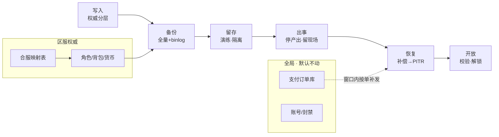
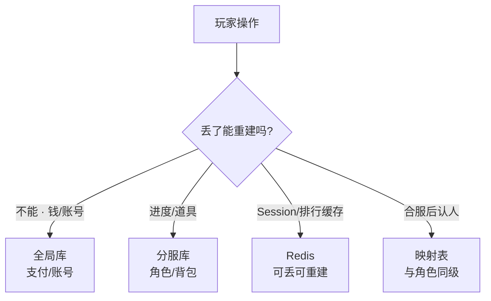
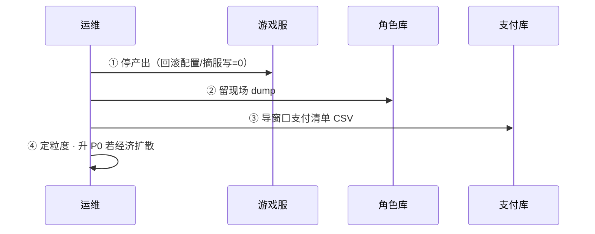
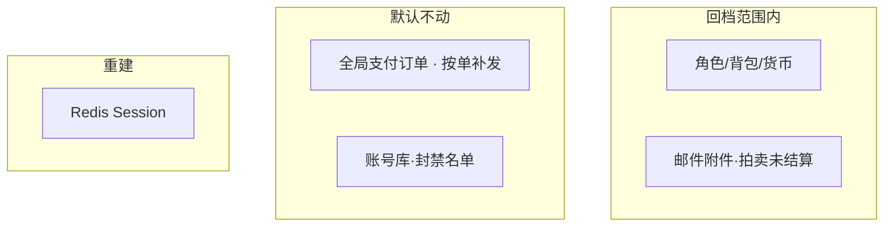
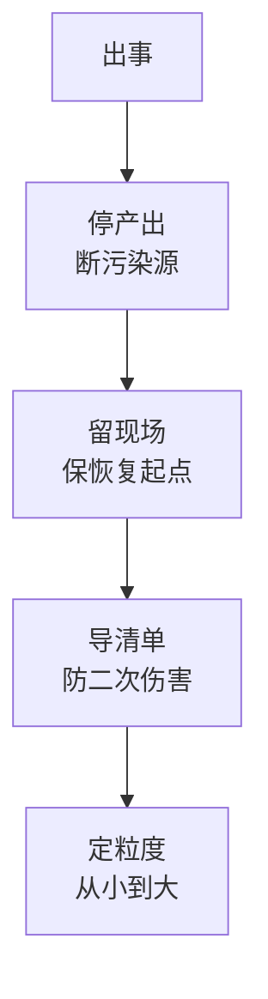
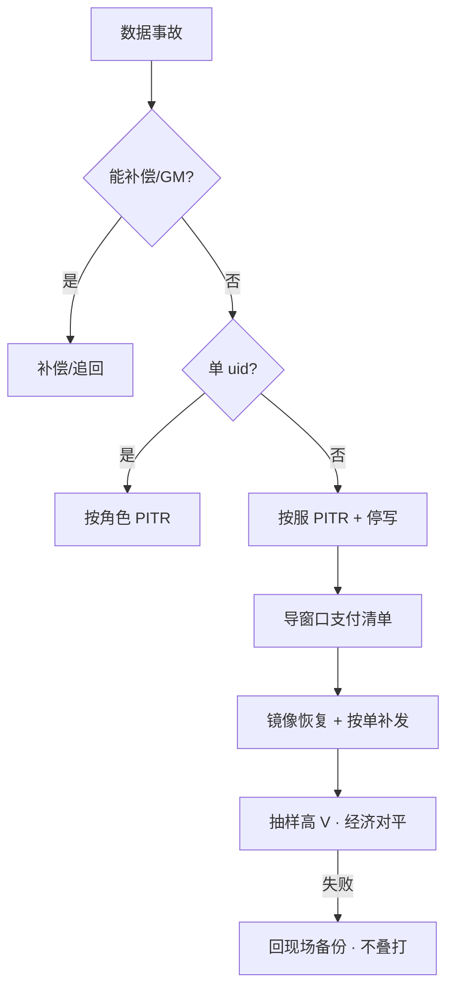
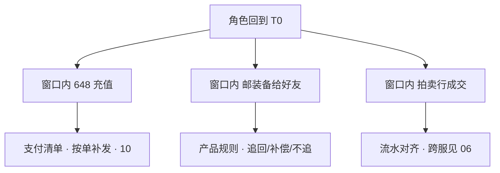
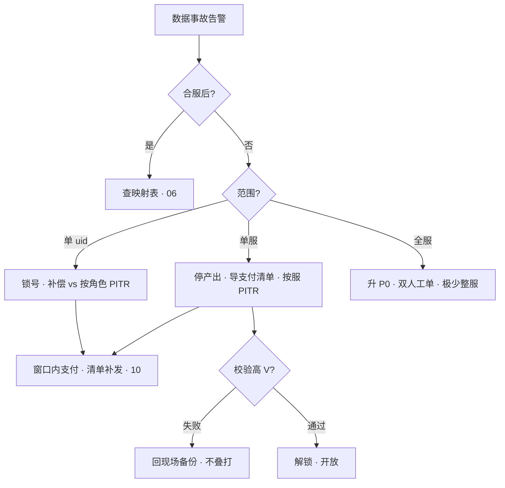

# 玩家数据备份与回档

> 活动掉落多写了一个零。群里有人说「整服回今早的快照」，另有人已经打开主库准备 `UPDATE` 货币——玩家 14:30 刚充了 648。
> **本章回答**：一条玩家数据从写入到备份到出事到恢复，每段权威在哪、RPO 怎么定、回档粒度怎么选、二次伤害怎么防。
> **不讲**：MySQL 机制与 xtrabackup 细节 → [02-01 MySQL](../../02-中间件与数据库/01-MySQL/)；合服步骤 → [06](../06-开服合服/)；停产出与摘服 → [05](../05-热更新与版本发布/)；事故定级 → [13](../13-游戏SRE稳定性/)；支付对账补发 → [10](../10-充值支付链路保障/)。

**标记**：🎯重点 · 🔥难点 · ⭐常考 · 🔧实操

---

## 一、一张图：玩家数据保护的一生

> 🎯 **一句话**：玩家数据像一条命——**写入**时分层落权威，**备份**时全量+binlog 不断链，**出事**先停产出留现场，**恢复**能补偿就不改历史。



**读图**：从左到右是**时间线**——写入在前、备份在中、出事与恢复在后；不要跳过「停产出」直接 PITR。支付库和角色库备份策略分开——误回订单库可能重复发货（链 [10](../10-充值支付链路保障/)）。映射表单独落盘，与角色同级备份；云盘快照是整机保险，不是玩家级回档按钮。

```text
能小范围就不整服；能补偿就不改历史；能走 GM 就不碰主库。
出事三板斧：停产出 → 留现场 → 导支付清单。
```

---

## 二、写入：权威在哪张库 ⭐

> 🎯 **一句话**：**账号/支付**近实时权威；**角色** 5～15 min 可接受丢；**Redis/聊天**可重建——写入时分清，备份时才不会混。

玩家每次操作最终要落到某张表。运维第一问：**丢了这份数据，玩家看见什么、资损多大？** 答案决定 **RPO（Recovery Point Objective，可接受丢失的数据量）**，不是「全库一个 cron」。



**读图**：写入路径按**资损**分叉——支付丢单 = P0；Redis Session 丢了重登即可；合服后找号走映射，不是 `LIKE` 角色名。**RPO 不是 DBA 一个人定的**——需要和产品对齐「每个数据层丢了，玩家体验到什么、会不会流失、会不会资损」，然后才落地到备份策略。

| 数据层 | 写入权威 | 典型 RPO | 丢了玩家看见 |
|--------|----------|----------|--------------|
| 账号、支付 | 全局库 | 接近 0 | 丢单、登错号 |
| 角色、背包、货币 | 分服库 | 5～15 min | 进度回到过去 |
| Redis 热状态 | 可丢 | 允许丢 | 重登、排行刷新 |
| 合服映射 | 独立表 | 与角色同级 | 号没了 |

> 💡 **打个比方**：写入像分保险柜——**收银台（支付）每笔落账，仓库（角色）允许丢几分钟快照，便签（Redis）丢了能重写**。

> 🔍 **现场**：有人提议「Redis AOF 够用了，角色库少备」🔧

```bash
mysql -e "SHOW BINARY LOGS;" | tail -5
redis-cli INFO persistence | grep -E 'aof_enabled|rdb_last'
# binlog 连续 · aof_enabled:1  ← AOF 不能替代 MySQL 权威
```

> ⚠️ **别混**：**Redis 热状态** ≠ **角色权威**——回档以 MySQL + binlog 为准；只回 Redis 或只回 MySQL 都会脏。**延迟从库**能扛「删错几小时后发现」；普通从库会把误操作立刻复制过去。

> 📝 **面试**：「Redis 能当回档权威吗？」——「不能。Session/排行可重建；钱和背包以 DB 为准，备份策略跟着分层走。」

### 合服写入：只认映射表

合服后 `uid` 变了，所有写入、GM、回档查询走 `old(server_id, uid) → new_id`。**禁止** `UPDATE region='us'` 换区——那是小型迁移作业（链 [06](../06-开服合服/)）。

```sql
-- 错误：按角色名撞
-- SELECT * FROM role WHERE name LIKE '%龙之%';

-- 正确：映射表
SELECT new_uid, new_server_id FROM merge_map
WHERE old_server_id = 's101' AND old_uid = 8829341;
```

---

## 三、备份：全量 + binlog 连续链 🔥⭐

> 🎯 **一句话**：每日全量是**存档点**，binlog 是**连续录像**——断链 = 只能退到最近全量，RPO 变一天。


**读图**：备份有效性的唯一证明是 **restore 演练**，不是 cron 文件在不在。支付库与角色库**分开桶、分开策略**。如果支付和角色混在同一个 dump 文件里，回档时要么一起回（可能误伤支付），要么手工拆（容易漏表）。分桶不是多花一份钱，是给回档操作留出选择空间。

> 💡 **打个比方**：全量像存档点——每天凌晨打一个；binlog 像行车记录仪——从存档点开始连续录像。录像断了，只能退到上一个存档点重新来。

**现场走一遍**（binlog 保留 3 天，误操作 5 天前才发现）：

1. `SHOW BINARY LOGS` —— 最早只剩 3 天内。
2. 5 天前的误操作 → **无法 PITR（Point-in-Time Recovery，按时间点恢复）到生效前**，只能全量 + 人工补偿。
3. 角色库 binlog 保留应 ≥ 7～14 天（按变更频率与合规定）。
4. 备份 cron 在 ≠ 备份有效——**季度 restore** 才证明链可用。
5. oncall 不能整库下到笔记本——桶与生产账号分离。

> 🔍 **现场**：怀疑 binlog 断链 🔧

```bash
mysql -e "SHOW BINARY LOGS;"
mysql -e "SHOW MASTER STATUS\G"
# 若 File 不递增或中间缺号 → 存储/复制事故，先修链再谈 PITR
```

MySQL 配置要点（细节见 [02-01 MySQL](../../02-中间件与数据库/01-MySQL/)）：

```ini
binlog_format = ROW
sync_binlog = 1
expire_logs_days = 14    # 按磁盘与业务定，支付链 often 更长
```

> ⚠️ **别混**：**云盘快照** = 整机级保险，粒度整盘，会把订单、配置、不相关服务一起回——不是「按 uid 回档」按钮。云存储与快照机制见 [03-云上存储与数据库](../../06-云平台/03-云上存储与数据库/)。

> 📝 **面试**：「没 restore 过的 cron 算不算有备份？」——「不算。binlog 断段是存储事故，不是单玩家脚本能修。」

---

## 四、留存：演练、权限与 RTO

> 🎯 **一句话**：备份文件在桶里不等于能恢复——**季度演练**记下真实 RTO；权限隔离防止备份泄露 = 全服数据泄露。

落地检查清单：

```text
① 和业务定四层 RPO（账号/支付/角色/Redis）
② binlog 保留天数写进变更规范
③ 回档 Runbook：停产出 → 留现场 → 导清单 → 定粒度 → PITR → 校验
④ 合服映射表单独备份 + 高权限
⑤ 季度 restore 进日历 · 抽样高 V 对账
```

备份合格的标准：全量**日备 + 保留 30 天**；binlog 连续、ROW、保留够长；支付与角色策略分开；桶级加密 + 传输 TLS。不合格的反面：只有周备、binlog 3 天过期、从没 restore 过、oncall 整库下笔记本、同桶同策略、明文备份。一句话判据——**备份文件在桶里不证明能恢复，restore 过才证明**。

权限隔离和备份策略同样重要。oncall 的 AK/SK 只能读自己负责的服，不能整库下到笔记本。备份桶与生产账号分离——否则一旦 oncall 凭证泄露，整服数据打包走人。映射表的备份权限应高于角色库——映射丢了比角色丢了更难恢复，因为映射是人工维护的关联关系，不能从 binlog 重放。

| 粒度 | 典型 RTO | 前置条件 |
|------|----------|----------|
| 补偿/GM | 分钟级 | 锁号、工单 |
| 按角色 PITR | 1～2 小时 | 镜像演练 |
| 按服 PITR | 小时级 | 摘服、双人工单 |
| 全服 | 半天+ | 极少用，升 P0 |

> 📝 **面试**：「验收备份合格的标准？」——「restore 过、抽样高 V 经济对平、写下 RTO 耗时。**没演练 = 没有备份。**」

---

## 五、出事：停产出、留现场、导清单 ⭐🔥

> 🎯 **一句话**：事故发现后**先停错误配置继续写坏数据**，留现场备份，导出回档窗口内的支付成功单——这三步是恢复的前置，不是可选项。



**读图**：顺序不能反——**出事先 PITR 再停产出** = 叠打污染。位点选**配置生效前最近一致点**，不是「今晚 0 点 dump」。

> 💡 **打个比方**：出事像厨房着火——先关煤气阀（停产出），再拍照留证（留现场），最后清点抢救了什么（导清单）。先救火再拍照 = 现场全毁。

**现场走一遍**（掉落 0.02→0.2，14:00 生效，15:00 发现）：

```text
全量 02:00    误操作 14:00    发现 15:00
                  |
         PITR 停在 13:59:59
         14:00 后写入 → 支付清单补发
```

1. **停产出**：回滚错误配置 / 摘服写 QPS=0（链 [05](../05-热更新与版本发布/)）。
2. **留现场** 🔧：

```bash
mysqldump --single-transaction --master-data=2 \
  game_s123 > /backup/pre_rollback_$(date +%Y%m%d_%H%M%S).sql
# 大库用 xtrabackup，见 02-01
```

3. **导支付清单**：

```sql
SELECT order_id, uid, server_id, amount, channel, paid_at
FROM pay_orders
WHERE status = 'success'
  AND paid_at BETWEEN '2026-09-01 14:00:00' AND '2026-09-01 15:00:00'
  AND server_id = 's123';
```

4. **定粒度**：经济已扩散拍卖/全服 → 按服 PITR；单 uid 误操作 → 按角色 PITR。
5. 外挂刷货：先冻号取证，**默认不是整服回档**。

> ⚠️ **别混**：**只回 MySQL 不处理支付清单** = 二次伤害（钱扣了道具没了）。**生产交互式 `UPDATE` 货币** = 不合格。

### 回档范围：动什么、不动什么



**读图**：回档只动角色库快照内的东西。支付订单不在回档范围——按单补发；账号封禁名单不动——回档不等于解封；Redis 丢了重建。

> 📝 **面试**：「14:30 充了 648，14:00 配错要回档怎么处理？」——「角色回到 13:59；648 靠**支付清单补发**，不是让玩家重充；P2P 邮装备要产品规则防二次伤害。」

### 收束：出事凭什么不死人



**读图**：前三步是恢复的前置——断污染（停产出）、保起点（留现场 dump）、防二次伤害（导支付清单）。粒度从小到大：能补偿就不改历史。

**可背清单**：停产出 → 留现场 → 导清单 → 定粒度 → 镜像演练 → PITR → 校验 → 开放。

> ⚠️ **别混**：这套流程**不保证**零数据丢失——它保证的是「不因为恢复操作造成第二次事故」。PITR 本身会丢窗口内合法写入，靠补偿补回。

> 📝 **面试**：记忆分组法——**断（停产出）、保（留现场）、防（导清单）、选（定粒度）** 四步口诀。

---

## 六、恢复：补偿 → 按角色 → 按服 ⭐🔥

> 🎯 **一句话**：恢复粒度**从小到大**；校验失败回到「回档前现场」备份，**不要再试更早位点叠打**。

**决策树**（定粒度第一刀）：



**读图**：能补偿就不改历史；经济已扩散到拍卖/全服时单号 PITR 不够；校验失败**回现场**不是**再往前两小时**。

| 粒度 | 何时用 | 不要用 |
|------|--------|--------|
| 补偿/GM | 能加回、能追回 | 手改字段当小回档 |
| 按角色 | 单 uid 误操作 | 经济已扩散到拍卖/全服 |
| 按服 | 掉落配错、库级写坏 | 随便今晚 dump |

### 按角色 PITR 口述顺序 🔧

```text
锁号 → 留现场 → 导出该 uid 窗口支付/P2P → 镜像演练 → PITR → 按单补发 → 抽样校验 → 解锁
```

### 按服 PITR 口述顺序 🔧

```text
目录摘服 → 踢线 → 停支付 → 留现场 → 导全服支付清单 → 双人工单 → 镜像演练 → PITR → 校验 → 开放
```

两套口述顺序的区别在**前置动作**——按角色只需锁号，按服要摘服踢线停支付。但后续步骤的骨架一样：留现场 → 导清单 → 镜像演练 → PITR → 校验 → 开放。记住骨架，往前往后插前置动作即可。

**现场走一遍**（整服 PITR，校验高 V 背包对不上）：

1. 按服 PITR 到 13:59 → 抽样 10 个高 V，3 个货币对不上。
2. **错误**：再往前 PITR 到 10:00 ——叠打，可能丢更多合法写入。10:00 到 13:59 之间的合法充值、合法交易全部丢失，受害玩家范围反而扩大。
3. **正确**：从「回档前现场」备份恢复 → 重新评估位点或改补偿方案。先回到出事前的状态（留现场 dump），再决定是改位点、改粒度还是改补偿——这才是安全路径。

> 🔍 **现场**：生产禁止

```bash
# 禁止 — 裸改货币
# mysql -e "UPDATE backpack SET gold=gold-1000 WHERE uid=..."
```

> ⚠️ **别混**：**回档** vs **补偿**——补偿不改历史时间线；PITR 是改历史，必须走审批。**校验失败叠打更早位点** = 二次事故。

> 📝 **面试**：「外挂刷货要不要整服回档？」——「先冻号取证、追流水；默认按账号处理，不是整服 PITR。」

---

## 七、二次伤害：P2P、拍卖与窗口内交易 🔥

> 🎯 **一句话**：回档只还原**角色库快照**，窗口内 **P2P 邮装备、拍卖成交、跨服发奖** 不会自动逆操作——必须产品规则 + 支付清单，否则「钱扣了道具没了」「装备还在好友身上」。



**读图**：角色回到 T0 后，三条窗口内事件各自需要不同善后。支付靠清单补发；P2P 靠产品规则；拍卖靠流水对齐。

> 💡 **打个比方**：PITR 像把整栋楼倒回昨天早上——但昨天从楼里寄出去的快递不会自动飞回来，得一个个去追。

**现场走一遍**（14:00 配错掉落，14:30 充 648，14:40 邮传说装备给好友，15:00 决定按服 PITR 到 13:59）：

1. 角色回到 13:59 → 648 道具消失，银行可能已扣 → **导支付清单补发**，不是让玩家重充。
2. 好友背包仍有装备 → P2P **无法物理逆操作** → 产品定：追回 / GM 扣回 / 补偿受害方 / 公告。
3. 拍卖行若 14:20 成交 → 买家/卖家两侧经济都要对平 → 抽样高 V + 拍卖流水。
4. 跨服发奖若有流水 → 和本服回档窗口对齐（链 [06](../06-开服合服/)）。
5. 工单必写：**窗口内交易清单** + 处理策略，不是「回完服就开放」。开放前要逐项确认：支付清单已补发、P2P 已按规则处理、拍卖流水已对齐、跨服发奖已协调。缺一项就开放 = 留一颗雷给明天。

> ⚠️ **别混**：PITR 回的是**角色库快照**，不是「整个世界回到 T0」。窗口内所有跨玩家交互——P2P、拍卖、公会仓库——都不会被 PITR 逆操作。这些必须靠产品规则和人工对账，不能指望数据库恢复来解决。

| 窗口内事件 | 回档后症状 | 处理 |
|------------|------------|------|
| 支付 success | 钱扣了道具没了 | 支付清单补发 |
| P2P 邮件 | 发件人回了、收件人仍有 | 产品规则 |
| 拍卖成交 | 买卖家余额不一致 | 流水 + 抽样 |
| 公会仓库 | 多人侧不一致 | 往往升 P0 |

> ⚠️ **别混**：**补偿**（加回道具）≠ **改历史**（PITR）——P2P 场景常要补偿 + 规则并行，不是单选。

> 📝 **面试**：「回档后好友还拿着你的装备怎么办？」——「PITR 不逆 P2P；事前工单写规则，事后追回或补偿，抽样高 V 对平。」

### 延迟从库：误操作的「后悔药」 🔥

> 🎯 **一句话**：**延迟从库（delayed replica）** 故意落后主库 N 小时——发现误操作后先 **STOP SLAVE**，从延迟点导出，而不是立刻 PITR 整服。

```text
主库 14:00 误 UPDATE 扩散
延迟从库仍停在 13:00 → STOP SLAVE → 从从库导出正确行 → 或 promote 做细粒度恢复
普通从库：误操作秒级复制 → 没有后悔窗口
```

> 💡 **打个比方**：延迟从库像故意慢两小时的监控回放——主库闯了红灯，从库还没走到路口，STOP SLAVE 就是按下暂停键。

普通从库误操作秒级复制、没有后悔窗口，适合读扩展。延迟从库落后 N 小时，适合人为误操作。binlog PITR 精确到分钟级位点，适合配置生效点精确回。三种手段层层递进：延迟从库是缓冲，binlog 是精确恢复，不是二选一。实际值班中，延迟从库争取到的时间窗口用来做镜像演练和导支付清单——不是直接 promote 从库就完事。

> 🔍 **现场**：确认延迟从库 lag 🔧

```sql
SHOW SLAVE STATUS\G
-- Seconds_Behind_Master: 7200  ← 仍落后 2h 时误操作可能尚未复制
```

> 📝 **面试**：「有延迟从库还要 binlog 吗？」——「要；精确位点、按 uid 粒度仍靠 PITR，延迟从库是缓冲不是替代。」

---

## 八、合服后：只认映射表 ⭐

> 🎯 **一句话**：合服前后备份不是同一套主键；找号、回档、GM **全部**走 `old(server_id, uid) → new_id` 映射。

合服后 `uid` 变了，但玩家的历史备份还在老 `uid` 下。回档查询不是去角色表直接捞——先查映射表拿到新 `uid`，再在新服角色表里操作。备份链里的映射表也要单独 restore，否则找不到老 `uid` 对应的新记录。

**现场走一遍**（合服后玩家说号没了）：

1. 客服 `SELECT * FROM role WHERE name LIKE '%龙之%'` → 多条或无结果。
2. 正确：查映射表 + 目录跳转（链 [06](../06-开服合服/)）。
3. 映射丢了 = **停修**，从备份链恢复映射——不是继续改库。
4. 禁止 `UPDATE region='us'` ——换区 = 小型合服迁移（链 [02](../02-登录排队与选服/)）。
5. 跨法域换区默认拒绝，除非产品+法务书面允许。

```bash
mysql -e "SELECT old_server_id, old_uid, new_uid, new_server_id \
  FROM merge_map WHERE old_uid=8829341 LIMIT 5;"
```

> 📝 **面试**：「合服后回档怎么找 uid？」——「映射表 + 备份链里映射单独 restore；埋点追历史要带 old_uid 字段（链 [11](../11-游戏日志与埋点链路/)）。」

---

## 九、作战：数据事故定责

> 🎯 **一句话**：先问「单号 / 单服 / 全服 / 合服后」，再定粒度；**拒绝裸改**；经济扩散升 P0。

### 决策树



**读图**：左支合服先排除映射问题；单服路径必导支付清单；校验失败只能回现场。

| 现象 | 先做 | 别做 |
|------|------|------|
| 单号错发 | 锁号、补偿或按角色 PITR | 整服回 0 点 dump |
| 掉落配错两小时 | 停产出、摘服、导支付清单 | 不导清单就整服回 |
| 校验高 V 对不上 | 回现场备份 | 再往前叠打 |
| 合服后找不到号 | 映射表 | 角色名 LIKE |
| binlog 缺 20 分钟 | 灾备到断点，支付对账 | 单玩家脚本补 |
| 「我 SQL 比较熟」 | 拒绝裸改 | 交互式 UPDATE |
| 回档后「钱扣了没道具」 | 按清单补发 | 让玩家重充 |

### 60 秒剧本 🔧

> 🔍 **现场**：接到「数据错了要回档」，60 秒走完再动手。

```text
0–10s  确认范围：单号 / 单服 / 全服；合服后先查映射
10–30s 停产出（配置回滚 / 摘服写=0）
30–45s 留现场 dump + 导窗口支付清单
45–60s 定粒度：补偿 vs 按角色 vs 按服；升 P0 若经济扩散
```

前 10 秒是最关键的——范围判断错误，后面全走错路。合服后的号纠纷误判为单服回档，会把无关玩家卷进来。不确定时先按更大范围停产出，再缩小确认。

> 📝 **面试**：「数据事故怎么定责？」——「先问合服后还是合服前，再问单号/单服/全服，最后问经济扩散没——三问定粒度。」

---

## 十、收口

### 命令速查 🔧

```bash
# binlog 是否连续
mysql -e "SHOW BINARY LOGS;" | tail -5
mysql -e "SHOW MASTER STATUS\G"

# 回档前留现场
mysqldump --single-transaction --master-data=2 \
  game_s123 > /backup/pre_rollback_$(date +%Y%m%d_%H%M%S).sql

# 导出窗口支付清单
mysql -e "SELECT order_id,uid,amount,paid_at FROM pay_orders \
  WHERE status='success' AND server_id='s123' \
  AND paid_at BETWEEN '2026-09-01 14:00:00' AND '2026-09-01 15:00:00';"

# 合服映射
mysql -e "SELECT * FROM merge_map WHERE old_uid=8829341 LIMIT 5;"
```

### 面试锚点

| 问 | 30 秒答 |
|----|---------|
| RPO 怎么分层？ | 支付近零、角色 5～15 min、Redis 可丢；不要一套 dump。 |
| Redis 能当权威吗？ | 不能；回档以 MySQL+binlog 为准。 |
| 出事三板斧？ | 停产出、留现场、导支付清单。 |
| PITR 位点怎么选？ | 配置生效前最近一致点，不是 0 点 dump。 |
| 补偿 vs 按角色 vs 按服？ | 从小到大；经济扩散不用单号 PITR。 |
| 校验失败怎么办？ | 回现场备份，不叠打更早位点。 |
| 二次伤害是什么？ | 只回角色不回支付清单；玩家钱扣了道具没了。 |
| 合服后找号？ | 只认映射表，禁止 LIKE 角色名。 |
| 云盘快照能回档吗？ | 整机级，不是玩家级；会误伤订单库。 |
| 没 restore 算备份吗？ | 不算；季度演练是验收标准。 |

### 易错一句话对照

- 一套 dump 打支付+角色 → RPO 分层、策略分开
- Redis AOF 少备角色库 → 权威在 DB
- 云盘快照=玩家回档 → 粒度整盘
- 回角色时订单库一起回 → 可能重复发货
- 校验失败再往前两小时 → 回现场不叠打
- 合服后按角色名撞 → 只认映射表
- 生产 UPDATE 货币 → 裸改不合格
- 没演练但文件在=有备份 → 没 restore=没有
- 外挂刷货默认整服回档 → 先冻号取证
- 出事先 PITR 再停产出 → 先停再恢复

### 数字墙

> 角色 RPO **5～15 min** · 支付 RPO 接近 **0** · 单服 RTO **小时级** · binlog 保留 **≥7 天**（支付 often **≥14 天**）· restore 演练 **季度** · 回档审批 **双人** · 映射表备份 **与角色同级** · PITR 位点 **生效前 1 秒** · 延迟从库 **7200s 常见** · 全量 **日备+30 天保留** · 外挂默认 **冻号非整服** · 云盘快照 **整机非 uid** · 二次伤害 **清单未导**

### 回档工单模板（口述要点）🔧

```text
【范围】server_id / uid 列表 / 全服
【事故】配置 ID · 生效时间 · 发现时间
【位点】PITR 目标时间 · binlog file+pos
【窗口交易】支付清单 CSV 路径 · P2P/拍卖规则
【审批】运维×2 · 运营 · 值班长
【校验】高 V 抽样 N 个 · 经济对平标准
【回滚】现场备份路径 · 失败则 STOP
```

### 值班场景速查 ⭐

有人喊「整服回 0 点 dump」——先停产出、定粒度，不是整服回零点（五节）。有人喊「这号金币多了」——锁号、判断补偿还是按角色（六节）。有人喊「合服后号没了」——映射表，不是角色名 LIKE（八节）。有人喊「我 SQL 比较熟」——拒绝裸改（六节）。有人喊「钱扣了道具没了」——导支付清单按单补发（五·七节）。有人喊「binlog 只有 3 天」——RPO 变长，改补偿方案（三节）。

---

## 合上书

- [ ] **默画**主图：写入 → 备份 → 留存 → 出事 → 恢复 → 开放；标支付库「按单补发」、映射表「与角色同级」。
- [ ] 口述 **四层 RPO**（账号/支付/角色/Redis）各丢什么、玩家看见什么。
- [ ] **出事三板斧**顺序；PITR 位点怎么选（不是 0 点 dump）。
- [ ] **补偿 / 按角色 / 按服** 各何时用；经济扩散为什么不能单号 PITR。
- [ ] 窗口内 **648** 和 **邮给好友的装备** 分别怎么处理。
- [ ] **校验失败**为什么不能叠打更早位点。
- [ ] **合服后**找不到号走哪条链路；为什么禁止 `UPDATE region`。
- [ ] **裸改库**为什么不合格；二次伤害典型症状。
- [ ] **binlog 断链**时 RPO 变成什么；云盘快照 vs PITR。
- [ ] **外挂刷货**为什么不默认整服回档。
- [ ] **延迟从库** vs 普通从库在误操作场景的差异；何时 STOP SLAVE。
- [ ] **xtrabackup** 大库留现场 vs mysqldump 选型口述（细节在 02-01）。

下一章：[充值支付链路保障](../10-充值支付链路保障/)。MySQL 机制：[02-01 MySQL](../../02-中间件与数据库/01-MySQL/)。
