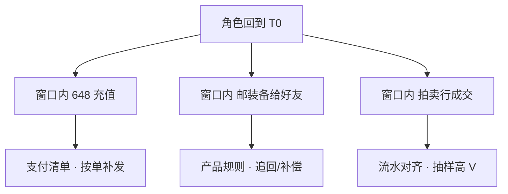

# 09｜玩家数据备份与回档 · 练习题

开始做题前，先给大家一个小建议：合上知识点，对着**第一节的主图**，把「玩家数据保护的一生」——写入→备份→出事→恢复——口述一遍。能顺下来，下面这些题你会发现大半都会了；卡壳的地方，就是你该回去重读的那一节。

做题的方式也建议改一下：每道题**先看标题和场景，自己口述一遍答案，再往下看「完整解答」对答案**。直接看解答，容易产生「我会了」的错觉——能讲出来才是真的会。

| 标记 | 含义 |
|------|------|
| **核心** | 不懂整章就没建立起来 |
| **必会** | 值班和面试都要能讲 |
| **常用** | 线上会反复碰到 |
| **常考** | 白板和追问的高频口径 |

题目的顺序也是有意排的：Q1～Q5 先钉权威、备份链与出事三板斧；Q6～Q10 讲补偿梯度、合服映射与裸改；Q11～Q14 收尾到从库、快照与 60 秒剧本。

## 本题目录

- [Q1 RPO 分层与 Redis 权威](#q1)
- [Q2 写入权威分层与合服映射](#q2)
- [Q3 binlog 连续链与 restore 验收](#q3)
- [Q4 出事三板斧与 PITR 位点](#q4)
- [Q5 二次伤害与支付清单](#q5)
- [Q6 补偿 vs 按角色 vs 按服](#q6)
- [Q7 校验失败不叠打](#q7)
- [Q8 合服映射表](#q8)
- [Q9 P2P 与拍卖窗口](#q9)
- [Q10 裸改库与外挂](#q10)
- [Q11 延迟从库](#q11)
- [Q12 云盘快照 vs PITR](#q12)
- [Q13 60 秒数据事故剧本](#q13)
- [Q14 restore 季度演练](#q14)
- [合上书](#合上书)

---

## Q1

**★★★★★｜游戏的 RPO 为什么不能套一个数？Redis AOF 能当角色备份吗？**

**覆盖**：核心 · 必会 · 常考 ｜ **对应**：知识点 [二、写入：权威在哪张库](知识点.md)

### 场景

有人用「全库每日 dump、RPO 24h」套所有表。支付投诉丢单，聊天备份把角色恢复拖到四个小时。另一边说 Redis 开了 AOF，角色库可以少备。

先自己试试：不看下面，先口述一遍你的答案，再往下对。

### 完整解答

> 🎯 **一句话**：RPO/RTO **按层定**——支付近零、角色 5～15 min、Redis 可丢；**Redis 不是权威**。

| 数据 | RPO | 丢了玩家看见 |
|------|-----|--------------|
| 账号/支付 | 接近 0 | 丢单 = 资损 |
| 角色/背包 | 5～15 min | 进度回到过去 |
| Redis/聊天 | 可丢 | 重登/记录没了 |

权威在 DB。备份必须季度 restore；云盘快照是整机级，不是 uid 级回档。

> 📝 **面试**：「Redis 能少备角色库吗？」——「不能。AOF 管 Session；背包以 MySQL+binlog 为准。」

### 再追问

**只回 Redis 不回 MySQL？**——假恢复，经济全脏。**只回 MySQL 不导支付清单？**——二次伤害（Q5）。

---

## Q2

权威分层的展开——合服映射也挂在这。

**★★★★★｜写入时分几层？合服后写入走什么？**

**覆盖**：核心 · 必会 ｜ **对应**：知识点 [二、写入：权威在哪张库](知识点.md)

### 场景

合服后开发用 `UPDATE region='us'` 给玩家换区。DBA 说「角色名 unique，查 LIKE 就行」。

先自己试试：不看下面，先口述一遍你的答案，再往下对。

### 完整解答

> 🎯 **一句话**：**账号/支付/角色/Redis/映射** 五层；合服后**只认映射表**，换区是迁移不是改字段。

```text
支付/账号 → 全局库 · RPO≈0
角色/背包 → 分服库 · RPO 5～15min
Redis     → 可重建
映射表    → 与角色同级备份
```

> ⚠️ **别混**：分服 ≠ 分库；换区 ≠ `UPDATE region`。

### 再追问

**延迟从库干什么？**——误操作后悔窗口（Q11），不是普通读扩展。

---

## Q3

备份链与 restore 验收。

**★★★★★｜binlog 断 20 分钟意味着什么？没 restore 过的 cron 算不算备份？**

**覆盖**：核心 · 必会 · 常考 ｜ **对应**：知识点 [三、备份：全量 + binlog 连续链](知识点.md)

### 场景

`SHOW BINARY LOGS` 中间缺号。运维说「反正有昨晚全量」。季度演练从未做过。

先自己试试：不看下面，先口述一遍你的答案，再往下对。

### 完整解答

> 🎯 **一句话**：断链 = RPO 退到**最近全量**；**没 restore = 没有备份**。

binlog 保留应 ≥7～14 天；支付链 often 更长。ROW 格式 + `sync_binlog=1`。支付/角色**分开桶**。

```bash
mysql -e "SHOW BINARY LOGS;"
mysql -e "SHOW MASTER STATUS\G"
# File 不递增或中间缺号 → 先修链再谈 PITR
```

> 📝 **面试**：「怎么验收备份？」——「按服+按角色各 restore 一次，记下 RTO。」

### 再追问

**binlog 只留 3 天、5 天前误操作才发现？**——无法 PITR，只能全量+补偿。

---

## Q4

出事三板斧——停产出先于回档。

**★★★★★｜数据事故发现后前三步是什么？顺序能反吗？**

**覆盖**：核心 · 必会 · 🔧 ｜ **对应**：知识点 [五、出事：停产出、留现场、导清单](知识点.md)

### 场景

掉落 0.02→0.2，14:00 生效，15:00 发现。有人要「先 PITR 到 0 点 dump 再停服」。

先自己试试：不看下面，先口述一遍你的答案，再往下对。

### 完整解答

> 🎯 **一句话**：**停产出 → 留现场 dump → 导窗口支付清单**；顺序不能反。

PITR 位点选 **13:59:59**（生效前），不是 0 点。停产出 = 回滚配置/摘服写=0（链 [05](../05-热更新与版本发布/)）。

```bash
mysqldump --single-transaction --master-data=2 \
  game_s123 > /backup/pre_rollback_$(date +%Y%m%d_%H%M%S).sql
# 大库用 xtrabackup，见 02-01
```

> ⚠️ **别混**：出事先 PITR = 继续污染 + 叠打风险。

### 再追问

**外挂刷货要不要立刻整服回档？**——先冻号取证（Q10）。

---

## Q5

和 Q4 配套——二次伤害与支付清单。

**★★★★★｜回档后玩家说「钱扣了 648 道具没了」根因是什么？**

**覆盖**：核心 · 必会 · 常考 ｜ **对应**：知识点 [七、二次伤害：P2P、拍卖与窗口内交易](知识点.md)

### 场景

整服 PITR 完成，开放后支付投诉爆发。复盘发现没人导出 14:00～15:00 支付清单。

先自己试试：不看下面，先口述一遍你的答案，再往下对。

### 完整解答

> 🎯 **一句话**：**二次伤害**——只回角色库、未按单补发；648 靠**支付清单**补，不是让玩家重充。

回档范围：动角色/背包；**不动**全局订单库（误回可能重复发货，链 [10](../10-充值支付链路保障/)）。窗口内 P2P 邮装备、拍卖成交同理不会自动逆操作——靠产品规则 + 流水对齐。

> ⚠️ **别混**：补偿（加回道具）≠ 改历史（PITR）；P2P 场景常要两者并行，不是单选。

### 再追问

**误回订单库会怎样？**——可能重复发货，比不补发更糟。

---

## Q6

恢复梯度：补偿→按角色→按服。

**★★★★★｜补偿、按角色 PITR、按服 PITR 各何时用？**

**覆盖**：核心 · 必会 · 常考 ｜ **对应**：知识点 [六、恢复：补偿 → 按角色 → 按服](知识点.md)

### 场景

单 uid GM 多发了神器，但同一神器已在拍卖行成交扩散全服。有人建议「锁号 UPDATE 减 1000 金币」。

先自己试试：不看下面，先口述一遍你的答案，再往下对。

### 完整解答

> 🎯 **一句话**：**能补偿就不改历史**；经济已扩散 → **按服 PITR**，不是单号 UPDATE。

| 粒度 | 何时用 | 不要用 |
|------|--------|--------|
| 补偿/GM | 能加回、能追回 | 手改字段当小回档 |
| 按角色 | 单 uid、未扩散 | 经济已扩散到拍卖/全服 |
| 按服 | 配错掉落、库级写坏 | 随便今晚 dump |

> 📝 **面试**：口诀——能小不大，能补偿不 PITR。

### 再追问

**手改字段和按角色 PITR 区别？**——裸改无审计、无位点；PITR 有工单和校验。

---

## Q7

校验失败不叠打——Q6 的门禁。

**★★★★★｜校验高 V 对不上，能不能再往前 PITR 两小时？**

**覆盖**：必会 · 常考 ｜ **对应**：知识点 [六、恢复：补偿 → 按角色 → 按服](知识点.md)

### 场景

按服 PITR 到 13:59，抽样 10 高 V 有 3 个货币对不上。值班长说「那再回 11:00 试试」。

先自己试试：不看下面，先口述一遍你的答案，再往下对。

### 完整解答

> 🎯 **一句话**：**回「回档前现场」备份**，不叠打更早位点——叠打可能丢更多合法写入。

正确：从 `pre_rollback` dump 恢复 → 重新评估位点或改补偿方案。

> ⚠️ **别混**：校验失败 ≠ 位点不够早；可能是 P2P/拍卖未处理（Q9）。

### 再追问

**现场备份没做就 PITR 了？**——更高风险；仍不要叠打，改补偿方案。

---

## Q8

合服后只认映射表。

**★★★★★｜合服后玩家说号没了，你怎么查？**

**覆盖**：必会 · 常用 ｜ **对应**：知识点 [八、合服后：只认映射表](知识点.md)

### 场景

客服 `SELECT * FROM role WHERE name LIKE '%龙之%'` 无结果。要封「丢号」补偿。

先自己试试：不看下面，先口述一遍你的答案，再往下对。

### 完整解答

> 🎯 **一句话**：**映射表** `old(server_id,uid)→new_id` + 目录跳转；禁止 LIKE 角色名。

```bash
mysql -e "SELECT old_server_id, old_uid, new_uid, new_server_id \
  FROM merge_map WHERE old_uid=8829341 LIMIT 5;"
```

映射丢失 = 停修，从备份链恢复映射——不是继续改库。禁止 `UPDATE region='us'` 换区，那是小型迁移（链 [06](../06-开服合服/)）。

### 再追问

**埋点追合服前历史？**——old_uid 字段或映射 join（链 [11](../11-游戏日志与埋点链路/)）。

---

## Q9

就是二次伤害里的 P2P/拍卖。

**★★★★★｜回档窗口内玩家邮装备给好友，回服后怎么处理？**

**覆盖**：常用 · 常考 ｜ **对应**：知识点 [七、二次伤害：P2P、拍卖与窗口内交易](知识点.md)

### 场景

14:40 邮传说装备给好友，15:00 PITR 到 13:59。发件人装备回来了，好友背包仍有。

先自己试试：不看下面，先口述一遍你的答案，再往下对。

### 完整解答

> 🎯 **一句话**：PITR **不逆 P2P**——产品规则：追回/GM 扣回/补偿受害方；工单必写策略。



拍卖成交同理：买卖家两侧经济对平 + 抽样高 V。

### 再追问

**能靠 SQL 从好友背包 DELETE 吗？**——要走 GM/审计流程，不是值班裸改。

---

## Q10

开头那个裸 UPDATE 现场。

**★★★★★｜「我 SQL 比较熟，UPDATE 一下金币」为什么不合格？外挂刷货默认整服回档吗？**

**覆盖**：必会 · 常考 ｜ **对应**：知识点 [六、恢复：补偿 → 按角色 → 按服](知识点.md) · [九、作战：数据事故定责](知识点.md)

### 场景

单号纠纷，DBA 打开 mysql 客户端。另一起外挂刷货，运营要「今晚全服回 dump」。

先自己试试：不看下面，先口述一遍你的答案，再往下对。

### 完整解答

> 🎯 **一句话**：生产 **UPDATE 货币** = 无审计、无对账、可能扩散；外挂 **先冻号取证**，默认不整服。

```bash
# 禁止 — 裸改货币
# mysql -e "UPDATE backpack SET gold=gold-1000 WHERE uid=..."
```

> 📝 **面试**：能走 GM/工单就不碰主库。

### 再追问

**GM 工具和裸改 SQL 区别？**——GM 有审计日志（链 [11](../11-游戏日志与埋点链路/)）。

---

## Q11

延迟从库能不能当回档源。

**★★★★★｜延迟从库和普通从库在误操作场景差在哪？**

**覆盖**：常考 · 🔥 ｜ **对应**：知识点 [七、二次伤害：P2P、拍卖与窗口内交易](知识点.md)

### 场景

14:00 误 UPDATE 扩散，14:30 发现。普通从库已同步；延迟从库仍落后 2h。

先自己试试：不看下面，先口述一遍你的答案，再往下对。

### 完整解答

> 🎯 **一句话**：延迟从库 = **后悔药**——`STOP SLAVE` 从延迟点导出；普通从库误操作秒级复制。

```sql
SHOW SLAVE STATUS\G
-- Seconds_Behind_Master: 7200  ← 仍落后 2h 时误操作可能尚未复制
```

普通从库适合读扩展，误操作秒级复制没有后悔窗口。延迟从库落后 N 小时，适合人为误操作。binlog PITR 精确到分钟级位点，适合配置生效点精确回。三种手段层层递进。

### 再追问

**有延迟从库还要 binlog 吗？**——要；精确位点、按 uid 粒度仍靠 PITR。

---

## Q12

云盘快照 ≠ PITR。

**★★★★★｜云盘快照能当玩家回档按钮吗？和 PITR 差在哪？**

**覆盖**：必会 · 常考 ｜ **对应**：知识点 [三、备份：全量 + binlog 连续链](知识点.md)

### 场景

有人提议「ECS 快照回滚 10 分钟前，比 binlog 快」。

先自己试试：不看下面，先口述一遍你的答案，再往下对。

### 完整解答

> 🎯 **一句话**：快照 = **整机级**——订单库、配置、无关服务一起回；不是 uid 粒度，误伤支付。

PITR = 按库/按服/按时间点到分钟；玩家级 often 按角色导出+导入。云存储与快照机制见 [03-云上存储与数据库](../../06-云平台/03-云上存储与数据库/)。

### 再追问

**快照何时有用？**——机器级灾难、快速拉起；不是日常回档工具。

---

## Q13

把前面收成 60 秒剧本。

**★★★★★｜60 秒：接到「数据错了要回档」你怎么走？**

**覆盖**：核心 · 必会 · 🔧 ｜ **对应**：知识点 [九、作战：数据事故定责](知识点.md)

### 场景

活动配错，群里已有人打开 mysqldump 和 UPDATE 窗口。

先自己试试：不看下面，先口述一遍你的答案，再往下对。

### 完整解答

> 🎯 **一句话**：**范围 → 停产出 → 现场+清单 → 定粒度**；阻止裸改。

```text
0–10s  单号/单服/全服 · 合服先映射
10–30s 停产出
30–45s 现场 dump + 支付清单
45–60s 补偿 vs PITR · 经济扩散升 P0
```

### 再追问

**全服和单服决策谁拍板？**——双人工单 + 值班长；运维提供 RPO/RTO 选项。

---

## Q14

和 Q3 呼应——季度 restore 演练。

**★★★★☆｜「备份文件在磁盘上」为什么不算有备份？季度 restore 验收看什么？**

**覆盖**：必会 · 常用 ｜ **对应**：知识点 [三、备份：全量 + binlog 连续链](知识点.md)

### 场景

合服前负责人说「昨晚全备在 OSS」。旁路 restore 从没跑过。T-0  restore 到测试实例，`mysql` 起不来，binlog 链断在 03:00。

先自己试试：不看下面，先口述一遍你的答案，再往下对。

### 完整解答

> 🎯 **一句话**：**从没 restore 过的备份不算备份**——季度旁路 restore + 三道校验 SQL；binlog **连续链**到当前，断链 RPO 变长。

验收清单：

```text
① 旁路实例 restore 全备 + 追 binlog 到目标位点
② 跑校验 SQL（行数/checksum/支付条数）与备份前快照对账
③ 记录 RTO（restore 耗时）写入 Runbook
④ binlog 索引连续：mysqlbinlog --start-datetime 查无断档
```

```bash
mysqlbinlog --read-from-remote-host --host=backup-src --start-datetime='2026-08-02 00:00:00' binlog.000123 | tail
# ERROR: binlog truncated at 03:00   ← 链断，PITR 只能回到 03:00
```

文件在 OSS ≠ 能恢复——加密钥过期、表结构变更、半拉文件都会让 restore 失败。合服/大活动前必须 **restore 演练过的那一份位点** 与 formal 跑同脚本。

> 📝 **面试**：「没演练 = 没备份。」binlog 保留支付 often **≥14 天**，角色 **≥7 天**。

### 再追问

**restore 通过就能上线吗？**——还要 dry-run 映射/孤儿外键（链 [06](../06-开服合服/) 合服演练）。

---

## 合上书

学到这里，先别急着翻下一章。合上书，试试下面这几件事能不能做到——能做到，这章才算真的听懂了。卡住的那一条，就回到对应的小节再听一遍：

- [ ] **默画**主图：写入→备份→出事→恢复；支付库「按单补发」。
- [ ] 口述 **四层 RPO** 与 Redis 非权威。
- [ ] **出事三板斧**与 PITR 位点选择。
- [ ] **补偿/按角色/按服** 决策树。
- [ ] **二次伤害**与支付清单。
- [ ] **P2P/拍卖** 窗口为什么不能只靠 PITR。
- [ ] **校验失败**不叠打；回现场备份。
- [ ] **合服映射**；禁止 LIKE 角色名。
- [ ] **裸改**不合格；外挂不默认整服。
- [ ] **延迟从库** vs 普通从库。
- [ ] **云盘快照** vs PITR。
- [ ] **60 秒剧本**四步。
- [ ] **季度 restore**：旁路验收、binlog 连续链、没演练不算备份（Q14）。
