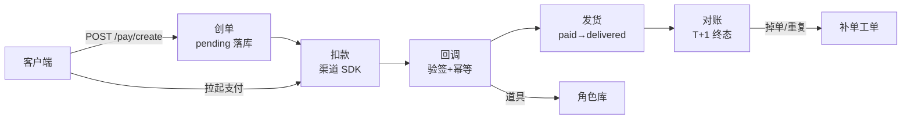
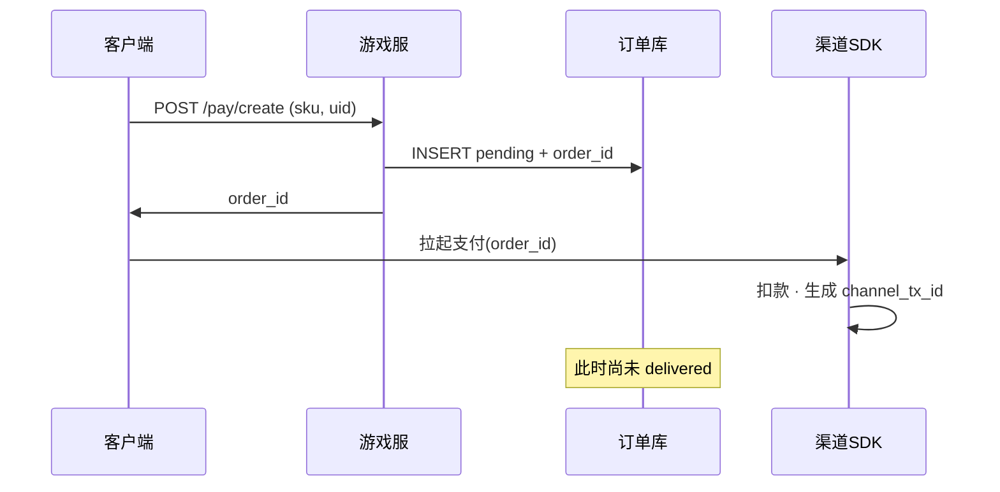
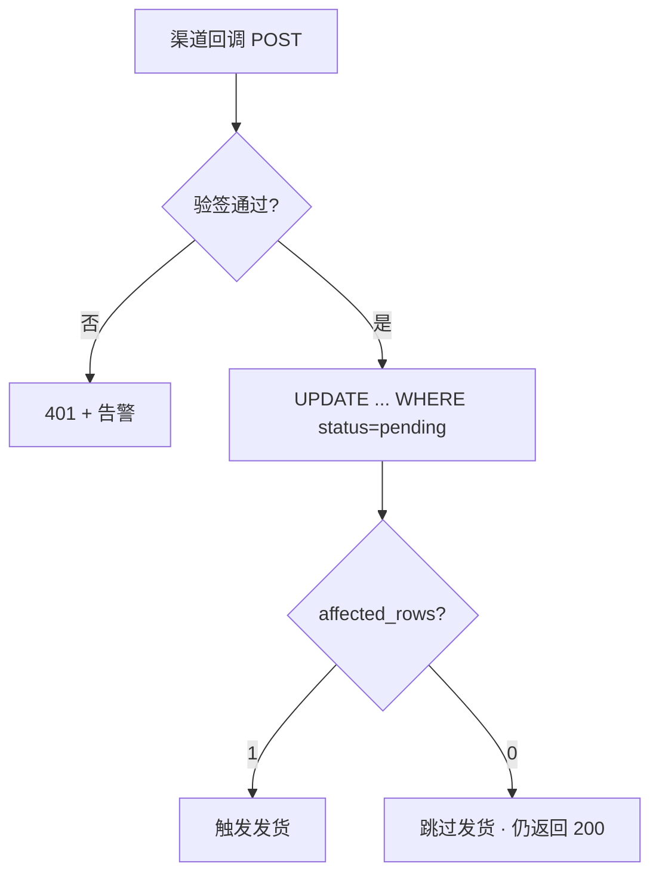
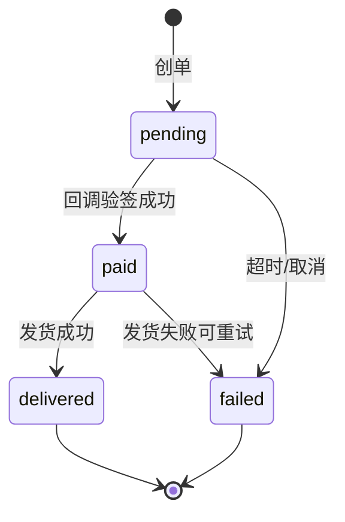
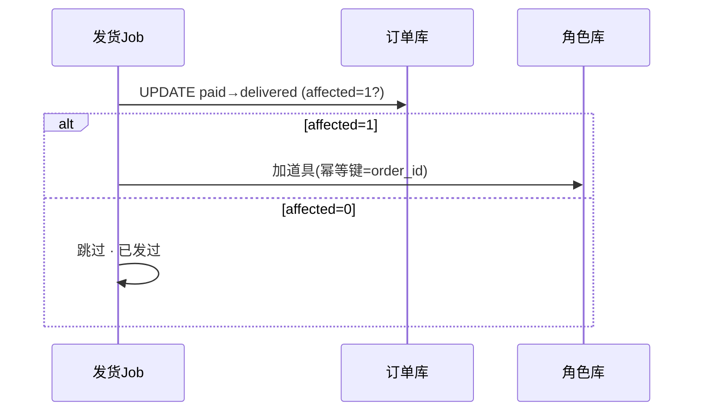
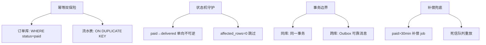
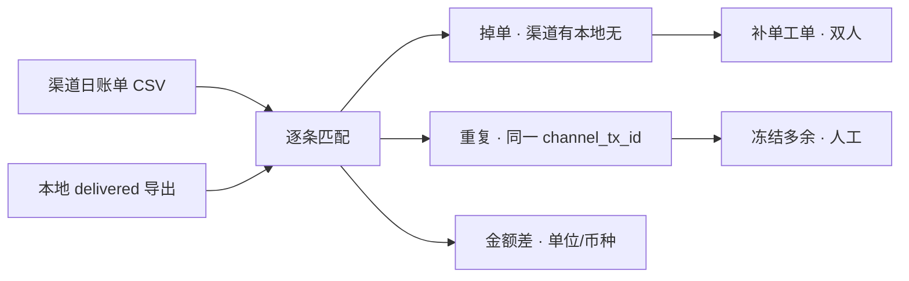
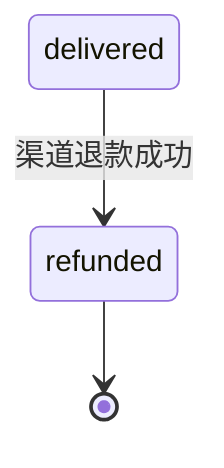
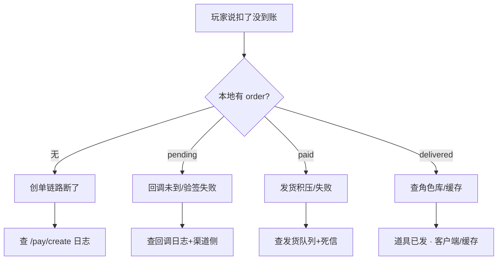

# 充值支付链路保障

> 玩家充了 648，银行扣了款，游戏里没到账。群里渠道说「回调发了」，开发说「我们没收到」——运营要人工补发，DBA 已经 `UPDATE` 背包加道具。
> **本章回答**：一笔充值从创单到回调到发货到对账到补偿，每段唯一真相在哪、幂等键是什么、掉单/重复怎么防、为什么不能裸改背包。
> **不讲**：MySQL 事务机制 → [02-01 MySQL](../../02-中间件与数据库/01-MySQL/)；玩家回档 → [09](../09-玩家数据备份与回档/)；登录鉴权 → [02](../02-登录排队与选服/)；支付 SLO 定级 → [13](../13-游戏SRE稳定性/)。

**标记**：🎯重点 · 🔥难点 · ⭐常考 · 🔧实操

---

## 一、一张图：充值订单的一生

> 🎯 **一句话**：充值不是「客户端扣钱就发货」——创单在你侧落 pending，扣款在渠道侧，到账靠回调+发货，对账是终态校验。



**读图**：从左到右是时间线——创单在渠道扣款之前，两段要分开查（渠道说发了 ≠ 你收到了）。回调网关必须验签 + 幂等，重复回调是常态不是异常。对账是订单生命的终态，玩家截图不是对账依据。

```text
渠道说发了回调 ≠ 你收到了。
玩家截图 ≠ 对账依据。
补单走工单，不 UPDATE 背包。
```

---

## 二、下单：服务端先生成 order_id

> 🎯 **一句话**：客户端/渠道只引用你发的 `order_id`；创单时落 `pending`，背包不动——防止「扣了没单」和「有单没扣」对不上。



**读图**：没拿号（order_id）就上菜（发货），后面对账永远对不齐。`order_id` 在游戏服生成，渠道侧生成 `channel_tx_id`，两个 ID 贯穿全链路。

**关键字段**：`order_id`（游戏服生成，全链路主键）、`channel_tx_id`（渠道生成，对账防重复）、`idempotency_key`（游戏服生成，创单/发货幂等）。三个字段各归一方，缺哪个哪段断。**双键唯一索引** = `(order_id, channel_tx_id)`，保证同一渠道交易不会产生两条本地订单。

**现场走一遍**（开发说「客户端直写背包，回调只是确认」）：

1. 玩家点 648 → 应调 `POST /pay/create` → 返回 `order_id=G20260901001`。
2. 订单库：`status=pending, amount=648, uid=xxx`。
3. 客户端拿 `order_id` 调渠道 SDK → 渠道侧生成 `channel_tx_id`。
4. 若跳过创单直接发货 → 回调来了对不上单、掉单无法补。
5. 幂等键：`order_id` + `channel_tx_id` 双键唯一索引，防止同一笔渠道扣款产生重复订单。

> 🔍 **现场**：查创单是否落库 🔧

```sql
SELECT order_id, uid, amount, status, created_at
FROM pay_orders
WHERE uid = 8829341
ORDER BY created_at DESC LIMIT 5;
-- order_id    | uid     | amount | status   | created_at
-- G20260901001 | 8829341 | 648    | pending  | 2026-09-01 10:23:01  ← 有单，等回调
-- G20260831234 | 8829341 | 328    | delivered| 2026-08-31 18:00:00  ← 上单已发货
```

> ⚠️ **别混**：**pending** = 等渠道回调；**渠道侧成功** ≠ **游戏侧 delivered**——中间态要单独监控。渠道说「扣款成功了」时，你侧可能还在 `pending`。

> 📝 **面试**：「创单为什么在渠道扣款前？」——「服务端先落 pending + order_id，全链路有主键；客户端直改背包是架构事故，不是补单技巧。」

---

## 三、回调：验签 + 幂等 + 重复也 200

> 🎯 **一句话**：渠道回调可能重复、乱序、延迟——验签通过后只更新一次状态，重复回调返回 200 但不二次发货。⭐



**读图**：从上到下是回调处理流水线。验签是第一道门——伪造回调直接 401。幂等 UPDATE 是第二道门——`WHERE status=pending` 保证只有第一次回调能改状态，后面的 affected_rows=0 跳过发货。但所有通过验签的回调都返回 200，否则渠道侧会无限重试。

> 💡 **打个比方**：回调幂等就像快递签收——同一个运单号来 5 次快递员，你只签收一次（发货），后面 4 次都说「已签收」让他走（返回 200），但每次都得开门说一声，不能不开门（返回 4xx）让他以为没人一直来敲。

**现场走一遍**（同一 `channel_tx_id` 回调来了 5 次，玩家收到 5 份 648 道具）：

1. 查订单：`SELECT * FROM pay_orders WHERE channel_tx_id='CH123'` → 已有 `status=delivered`。
2. 根因：回调处理没做幂等——每次 `UPDATE status=paid` 都触发发货，没有 `WHERE status=pending` 条件保护。
3. 正确做法：幂等 UPDATE 只改 pending 状态的订单，affected_rows=0 就跳过。

```sql
UPDATE pay_orders
SET status = 'paid', channel_tx_id = ?, paid_at = NOW()
WHERE order_id = ? AND status = 'pending';
-- affected_rows = 0 → 已处理，跳过发货
```

4. 重复回调仍返回 HTTP 200 + `{code:0}`——否则渠道会无限重试，重试不是你叫他停就能停的。
5. 验签失败 → 401 + 告警，不更新状态——伪造回调发不了货。

> 🔍 **现场**：查回调是否到达 🔧

```bash
grep 'CH123456' /var/log/pay-callback/access.log | tail -5
# 2026-09-01 10:25:03 POST /pay/callback/ 200  ← 第1次，发货
# 2026-09-01 10:25:15 POST /pay/callback/ 200  ← 第2次，幂等跳过
# 2026-09-01 10:25:28 POST /pay/callback/ 401  ← 验签失败，告警
# 有 200 但 DB 仍 pending → 验签失败或 UPDATE 条件不对
```

**回调网关 nginx 限流**（防风暴打垮服务，不是关回调入口）：

```nginx
limit_req_zone $binary_remote_addr zone=pay_cb:10m rate=100r/s;
location /pay/callback/ {
    limit_req zone=pay_cb burst=200 nodelay;
    proxy_pass http://pay-callback-backend;
}
```

限流的目的：渠道回调高峰（如大促开服）可能短时间涌来大量请求，限流保护后端不被打挂。但如果回调被限流丢弃了，渠道会重试——所以限流阈值要设得够高，不能因为限流导致正常回调丢失。

> ⚠️ **别混**：重复回调要拒绝返回 → 错；应 **200 + 幂等跳过**。回调风暴 → 验签+幂等+限流，不是关回调入口。关了入口 = 渠道以为你挂了，所有回调变掉单。

> 📝 **面试**：「回调三板斧？」——「验签、幂等 UPDATE（pending 才改）、重复也 200。发货和改状态要在同一事务或可靠消息里。」

---

## 四、发货：一次且仅一次

> 🎯 **一句话**：`paid → delivered` 是资损点——发货接口必须幂等，失败可重试，成功不可逆。⭐🔥



**读图**：`delivered` 是终态；从 `paid` 到 `delivered` 要有幂等发货 job，不能 GM 批量 `UPDATE` 背包。`pending → paid` 由回调驱动，`paid → delivered` 由发货 job 驱动——两段驱动者不同，监控也要分开。

| 状态 | 含义 | 下一步 |
|------|------|--------|
| pending | 等渠道回调 | 超时变 failed |
| paid | 扣款确认 | 等发货 |
| delivered | 道具到账 | 终态 |
| failed | 取消/失败 | 终态 |

**现场走一遍**（发货队列积压 10 万，玩家投诉扣款 2 小时不到账）：

1. 监控：回调成功 `paid` 10 万，发货 `delivered` 只有 3 万——差距 7 万。
2. 队列 consumer 挂了 / DB 锁等待——不是「回调没收到」。回调日志里 200 全绿。
3. 止血：扩 consumer、查死信队列、按 `paid_at` 优先发货（越早的越先补）。
4. 禁止：批量 `UPDATE backpack` 补发——绕开状态机无法对账，且可能重复发货。
5. 恢复后：对 `paid` 超过 30min 未 `delivered` 的订单跑补偿 job。

> 🔍 **现场**：查中间态积压 🔧

```sql
SELECT status, COUNT(*) AS cnt
FROM pay_orders
WHERE created_at > NOW() - INTERVAL 24 HOUR
GROUP BY status;
-- status    cnt
-- pending   1247
-- paid      8934   ← paid 积压，查发货队列
-- delivered 982341
-- failed    892

SELECT COUNT(*) FROM pay_orders
WHERE status = 'paid' AND paid_at < NOW() - INTERVAL 30 MINUTE;
-- 8934  ← 超 30min 未发货，P1 告警
```

> ⚠️ **别混**：**paid 积压** vs **掉单**——积压是发货链路慢（本地 paid 涨、发货 lag 高）；掉单是渠道有、本地无 delivered（T+1 对账发现）。积压查发货队列，掉单查回调链路和渠道账单。

> 📝 **面试**：「扣款不到账第一刀？」——「查 order 状态：pending 查回调，paid 查发货队列，delivered 查角色库/缓存。」

> 📝 **面试**：「paid 积压和掉单怎么分？」——「积压：本地 paid 涨、发货 lag 高；掉单：T+1 渠道有、本地无 delivered。」

### 发货幂等：同一 order_id 只发一次 🔥

发货服务必须认 **order_id** 幂等——即使 job 重试、consumer 重复消费，背包只加一次。双保险：订单库条件 UPDATE + 流水表唯一索引。

```sql
-- 第一保险：订单库条件 UPDATE（只有 paid 状态才能改成 delivered）
UPDATE pay_orders SET status = 'delivered', delivered_at = NOW()
WHERE order_id = ? AND status = 'paid';
-- affected_rows=0 → 已 delivered 或状态不对，禁止再次加道具

-- 第二保险：流水表唯一索引（即使订单库被绕过，流水表兜底）
INSERT INTO deliver_log (order_id, uid, sku, delivered_at)
VALUES (?, ?, ?, NOW())
ON DUPLICATE KEY UPDATE order_id=order_id;  -- 重复插入不报错
```



**读图**：发货 job 先改订单态（affected=1 才发道具），订单态和道具发放构成双保险——即使角色库加道具重复，订单库也不会重复 delivered。job 崩溃重启后重新消费同一消息，affected_rows=0 直接跳过。

> ⚠️ **别混**：**GM 补道具**和**状态机补发**——GM 无 order 关联无法对账；掉单必须挂 order_id/channel_tx_id。GM 补发应仍走专用补单接口留痕，不能裸改背包。

### 事务边界：跨库怎么办 🔥

> 💡 **打个比方**：跨库发货就像跨行转账——你不能直接从 A 银行扣钱往 B 银行塞，得走中间通道（Outbox），两边各自记账，中间断了能补。

理想路径：**同一 DB 事务**内 `paid` + 写 `deliver_log` + 调发货 stored proc。但订单库和角色库通常不在同一个 DB——跨库用**可靠消息（Outbox）**：回调只改订单态 + 写 Outbox 表，发货 job 消费 Outbox 消息调角色库。消费端仍要 order_id 幂等。

```text
反模式：回调线程直接 HTTP 调游戏服加道具 · 无 order 状态 → 对账永远补不齐
正解：回调只改订单态 · 发货 job 读 paid 队列 · 角色库认 order_id 幂等
```

> 📝 **面试**：「发货和改状态要不要一起？」——「要；至少同一事务或 Outbox，否则 paid 有了道具没有，对账时本地 paid 但角色库无道具。」

### 收束：发货凭什么「一次且仅一次」



**读图**：发货可靠靠四层。第一层幂等双保险——订单库条件 UPDATE + 流水表唯一索引，两层任一拦住重复。第二层状态机守护——`paid→delivered` 单向不可逆，delivered 后再收到回调不会回退。第三层事务边界——同库用事务、跨库用 Outbox，保证状态变更和发货指令原子性。第四层补偿兜底——定时 job 扫 paid 超时 + 死信队列重放，保证最终一致。

> ⚠️ **别混**：这套机制保证**不重复发货**，但**不保证**实时到账——`paid→delivered` 有延迟窗口，监控要看 P95 延迟，不能只看成功数。

> 📝 **面试**：「发货怎么保证只发一次？」——「四层：订单库条件 UPDATE + 流水表唯一索引 + 状态机单向 + 补偿 job 兜底。跨库走 Outbox。」

---

## 五、对账：T+1 终态校验

> 🎯 **一句话**：对账是订单生命的终态校验——掉单、多单、金额差都要清单化处理；补单走工单留痕。⭐



**读图**：不能凭玩家截图入账，要以渠道账单和本地终态逐条匹配。三类差异各有处置——掉单走工单、重复冻结核实、金额差查配置。

> 💡 **打个比方**：对账就像月底对银行流水——银行账单和你的记账 App 逐条比，少的补上、多的查清、金额对不上查币种。你不能凭记忆说「我花过这笔」就入账，玩家截图也一样。

**现场走一遍**（T+1 对账差 300 单，运营说「玩家群炸了」）：

1. 拉渠道日账单 CSV + 本地 `status=delivered` 导出。
2. 分类：
   - **掉单**：渠道有 `CH456`，本地无 success → 补单工单（查 pending/paid 中间态，确认是回调没到还是发货失败）
   - **重复**：本地两条 success 同一 `channel_tx_id` → 冻结多余道具、人工核实根因
   - **金额差**：648 vs 6.48 → 单位/币种配置错误（分 vs 元、CNY vs USD）
3. 补单：运营工单 + 双人审批 + 写 `补发原因` 字段——不是 DBA UPDATE。
4. 对账不平 > 阈值 → 升 P0（链 [13](../13-游戏SRE稳定性/)），即使登录 SLI 全绿。
5. 回档场景（链 [09](../09-玩家数据备份与回档/)）：只回角色库，支付库按清单补发——误回订单库可能重复发货。

> 🔍 **现场**：对账脚本 🔧

```bash
mysql -e "SELECT order_id,channel_tx_id,amount,paid_at FROM pay_orders \
  WHERE status='delivered' AND DATE(paid_at)='2026-09-01'" > local.csv
comm -23 <(sort channel.csv) <(sort local.csv) > missing_in_local.txt
# missing_in_local.txt 里每行就是一笔掉单
wc -l missing_in_local.txt
# 300  ← 差 300 单
```

**补单工单必填**：

```text
order_id / channel_tx_id
玩家 uid + server_id
渠道截图 + 渠道侧查询结果
补发原因：掉单 / 重复冻结后补 / 人工核实
审批人 × 2
```

> 📝 **面试**：「T+1 对账分哪三类差异？」——「掉单、重复、金额差。补单走工单+双人，不以截图为准。对账不平 > 阈值是 P0，即使登录 SLI 全绿。」

---

## 六、补偿：掉单补拉 + 退款 + 回档 + 渠道差异

> 🎯 **一句话**：订单 delivered 不是终点——渠道退款、回档、单渠道挂了都要补偿；补偿必须挂 order_id，走工单留痕。

### 掉单补拉 API

部分渠道提供**订单查询 API**——503 恢复后 batch 拉取本地 pending/paid 的订单，确认渠道侧状态。补拉只是辅助手段，**不能替代 T+1 对账**——补拉只覆盖「你知道丢了」的单，对账能发现「你不知道丢了」的单。

### 退款与拒付（chargeback）⭐

`delivered` 后渠道退款/拒付仍可能发生——要有 `refunded` 终态和道具追回/封禁策略，不是「发货就完事」。



**读图**：`refunded` 是 `delivered` 之后的终态，不是回退到 pending——已发的道具不会自动消失，需要产品规则决定追回方式。

退款场景运维动作：渠道通知退款 → 更新订单 `refunded` + 告警；道具已消耗 → 产品规则（扣回/封禁/记坏账）；对账发现重复退款 → 冻结账号 + 人工。**退款回调同样要验签 + 幂等**——重复退款通知不能扣两次道具。

> 📝 **面试**：「delivered 后退款怎么办？」——「订单转 refunded 终态 + 告警；道具追回走产品规则（扣回/封禁/坏账）；退款回调也要验签幂等。」

### 回档与支付库 🔥

角色库回档时**支付库不动**——按窗口内支付清单补发道具。误回订单库 → 状态回退 → 补偿 job 重复发货。

```text
正解：角色库 PITR → 支付库不动 → 按清单补发道具（更新 deliver_log）
反模式：订单库一起回 → delivered 变 paid → 补偿 job 重复发货
```

链 [09](../09-玩家数据备份与回档/)：出事必导清单——回档前先把支付清单导出来，回档后按清单补发，不回订单库。

> ⚠️ **别混**：回档只回角色库；**误回订单库会重复发货**——delivered 退回 paid，补偿 job 以为没发货又发一次。

### 渠道差异 ⭐

| 渠道 | 回调特点 | 运维注意 |
|------|----------|----------|
| App Store | 服务器通知 + 收据验证 | 沙盒/生产密钥分离 |
| Google Play | RTDN 订阅通知 + API 拉取 | 延迟可达分钟级 |
| 国内 SDK | 同步 POST 为主 | IP 白名单 + 验签 |
| 网页支付 | 跳转 + 异步回调 | pending 超时更长 |

**掉单补拉**差异：App Store 可凭收据重新验证；Google Play 有 RTDN 但延迟可达分钟级；国内 SDK 多为同步 POST，掉单靠 T+1 对账兜底。

### sandbox 密钥误上生产 🔥

App Store / Google sandbox 收据打到生产验签 → 全失败或全成功假象：

```text
变更检查：渠道密钥环境标签 · 发版 diff 含 pay config
事故症状：某渠道 success_rate 骤降 · 验签 401 涨
第一刀：比对生产/沙盒 bundle id · 密钥 rotate 记录
```

> 🔍 **现场**：发版后第一小时监控 🔧

```bash
# 发版后看各渠道验签成功率
grep 'pay/callback' /var/log/nginx/access.log | awk '{print $9}' | sort | uniq -c
# 200  5234  ← 正常
# 401   892  ← 验签失败飙升，查密钥配置
```

### 创单防刷与限流 🔧

```text
同一 uid 1 分钟内 pending 订单 >N → 限流
同一 device_id 异常创单 → 验证码（链 [02](../02-登录排队与选服/)）
渠道 sandbox 密钥误上生产 → 变更检查清单
```

### 监控与告警 🔧

```text
pay_success_rate{channel}     < 95% 5min → P0
paid_undelivered_count        > 100 且 paid_at>10min → P1
reconcile_diff_daily          > 阈值 → P0
callback_4xx_rate             涨 → 验签/攻击
pending_age_p99               > 45min → 渠道或创单异常
```

Prometheus 查询示例：

```promql
sum(rate(pay_orders_total{status="paid"}[5m]))
  / sum(rate(pay_orders_total{status="pending"}[5m]))
count(pay_orders{status="paid", delivered_at=""}) > 0
```

> ⚠️ **别混**：**埋点**能证明玩家点了充值按钮，不能代替订单对账——埋点是行为追踪，订单是资金凭证（链 [11](../11-游戏日志与埋点链路/)）。玩家说「我点了充值」，埋点证实了点击，但不代表创单成功。

> 📝 **面试**：「回档时支付库怎么处理？」——「不动。按清单补发，误回订单库会重复发货（链 [09](../09-玩家数据备份与回档/)）。」

---

## 七、作战：掉单/重复/渠道挂定责

> 🎯 **一句话**：玩家说「扣了没到账」——沿状态机分叉；禁止 UPDATE 背包；paid 积压查发货不是查回调。

### 决策树



**读图**：无 order = 创单断（查 /pay/create 日志）；pending = 回调没到或验签失败（查回调日志）；paid = 发货积压（查队列和死信）；delivered = 已到账（查角色库或客户端缓存同步）。四条叉各自查不同子系统，不要一上来就查回调。

### 现象 · 先做 · 别做

| 现象 | 先做 | 别做 |
|------|------|------|
| 扣款不到账 | 查 order 状态 + 渠道侧 | UPDATE 背包 |
| 回调风暴 | 验签 + 幂等 + 限流 | 关回调入口 |
| paid 积压 | 发货队列/consumer | 以为回调没收到 |
| 同一单重复发货 | 查 channel_tx_id 唯一 | 只删多余道具不查根因 |
| 单渠道 503 | 地区提示 + 对账预备 | 关全球登录 |
| 对账差 300 单 | 分类掉单/重复/金额 | 批量 GM 补 |
| 回档后重复发货 | 支付库不动+清单补发 | 回订单库（链 [09](../09-玩家数据备份与回档/)） |

### 60 秒剧本 🔧

```text
0–10s  要 order_id 或 channel_tx_id + uid；查本地 status
10–30s pending → 回调日志/验签；paid → 发货队列 lag
30–45s 渠道侧查询（不等截图）；中间态计数是否批量
45–60s 定责：创单/回调/发货/客户端；补单走工单不 UPDATE
```

### 案例复盘

```text
案例 A · 重复发货：回调无幂等 → 同一 channel_tx_id 发货 5 次
  止血：冻结账号 · 查 channel_tx_id 唯一 · 修 UPDATE WHERE pending
案例 B · paid 积压：consumer OOM → 10 万 paid 未 delivered
  止血：扩 consumer · 死信重放 · 禁止 UPDATE 背包
案例 C · 回档重复：误回订单库 → 648 发两次
  止血：支付库不动 · 清单补发（链 [09](../09-玩家数据备份与回档/)）
```

### 值班场景速查 ⭐

| 谁喊什么 | 第一刀 | 对应节 |
|----------|--------|--------|
| 「银行扣了没到账」 | 查 order status | 二～四 |
| 「回调发了你们没收到」 | 回调日志+验签 | 三 |
| 「paid 积压 10 万」 | 发货队列 | 四 |
| 「对账差 300 单」 | 掉单/重复/金额 | 五 |
| 「截图都有了补发吧」 | 工单+双人 | 五 |
| 「iOS 503」 | 地区 P0 · 不关 Gate | 六 |
| 「回档后重复发货」 | 支付库不动 | 链 [09](../09-玩家数据备份与回档/) |

### 支付 SLI 与登录 SLI 分开 ⭐

```text
pay_success_rate 破 → P0 即使 login 全绿
login_fail 涨 + pay 绿 → 别关 Gate 修支付
对账 diff > N → P0（资损）· 与 SLI 独立
```

> ⚠️ **别混**：**支付挂** vs **登录挂**——SLI 分开；单渠道挂不是关全球。iOS 503 时 Android 正常，关 Gate 会把正常渠道也断了，扩大事故。

> 📝 **面试**：「单渠道 503 为什么不关登录？」——「支付 SLI 和登录 SLI 分开；iOS 挂 Android 正常，关 Gate 扩大事故。」

---

## 八、收口

### 命令速查 🔧

```sql
-- 查单号全链路
SELECT order_id, uid, amount, status, channel_tx_id,
       created_at, paid_at, delivered_at
FROM pay_orders WHERE order_id = 'G20260901001';

SELECT * FROM pay_orders WHERE channel_tx_id = 'CH123456';

-- 中间态积压
SELECT status, COUNT(*) FROM pay_orders
WHERE created_at > NOW() - INTERVAL 24 HOUR GROUP BY status;

SELECT COUNT(*) FROM pay_orders
WHERE status = 'paid' AND paid_at < NOW() - INTERVAL 30 MINUTE;
```

```bash
grep 'order_id=G20260901001' /var/log/pay-callback/access.log | tail -3
```

### 面试锚点

| 问 | 30 秒答 |
|----|---------|
| 充值订单一生哪几段？ | 创单→扣款→回调→发货→对账。 |
| 创单为什么在扣款前？ | 服务端 pending+order_id 全链路主键。 |
| 回调为什么要幂等？ | 重复/乱序/延迟是常态；200+跳过二次发货。 |
| paid 积压 vs 掉单？ | 积压=发货慢；掉单=对账时渠道有本地无。 |
| 为什么不能 UPDATE 背包？ | 绕状态机，无法对账，重复发货风险。 |
| 玩家截图能补单吗？ | 不能；T+1 对账+工单+双人。 |
| 单渠道 503 怎么办？ | 地区 P0+提示；不关全球登录。 |
| 回档时支付库？ | 不动；按清单补发（链 [09](../09-玩家数据备份与回档/)）。 |
| 重复回调返回什么？ | 200+幂等跳过，不是 4xx。 |
| 发货怎么保证只发一次？ | 四层：条件 UPDATE+流水唯一+状态机+补偿 job。 |

### 易错一句话对照

- 渠道说发了=收到了 → 查本地日志
- 重复回调拒绝返回 → 200+幂等跳过
- 玩家截图补单依据 → 对账+工单
- 客户端直写背包更快 → 无法对账
- 支付挂=关全球登录 → SLI 分开
- 对账不平明天再说 → 资损 P0
- UPDATE 背包补单 → 绕状态机
- 回档时订单库一起回 → 可能重复发货
- pending 永久不算掉单 → 超时+对账
- paid 积压=回调没到 → 查发货队列

### 数字墙

> pending 超时 **30～60 min** · paid 积压告警 **>10 min** · 对账 **T+1** · 支付 SLI 窗口 **5min** · 补单 **双人审批** · 幂等双键 **order_id + channel_tx_id** · 回调限流 **100r/s** · 发货补偿 **paid>30min** · 渠道 503 掉单窗口 **按持续时间估 T+1**

### 落地顺序

```text
1. 订单状态机 + 双键唯一（order_id, channel_tx_id）
2. 回调网关验签 + 幂等模板
3. 发货 job + 死信 + 补偿 cron
4. T+1 对账脚本 + 差异分类
5. 补单工单流 + 监控告警（支付 SLI）
```

---

## 合上书

- [ ] 1. **默画**主图：创单 → 扣款 → 回调 → 发货 → 对账，标出 order_id/channel_tx_id 在哪段生成。
- [ ] 2. **默画**订单状态机：pending/paid/delivered/failed/refunded 各转换条件与方向。
- [ ] 3. 创单为什么在渠道扣款前；双键幂等 `(order_id, channel_tx_id)` 是什么。
- [ ] 4. **回调三板斧**：验签、幂等 UPDATE（WHERE status=pending）、重复也 200。
- [ ] 5. **paid 积压**和**掉单**怎么分；各查什么子系统。
- [ ] 6. 发货幂等四层：条件 UPDATE + 流水唯一 + 状态机单向 + 补偿 job。
- [ ] 7. **T+1 对账**三类差异（掉单/重复/金额差）；补单工单必填项。
- [ ] 8. 为什么**禁止 UPDATE 背包**；GM 补道具和状态机补发的区别。
- [ ] 9. **单渠道 503**为什么不关全球登录；支付 SLI 与登录 SLI 分开。
- [ ] 10. **回档时支付库**怎么处理；误回订单库会怎样（链 [09](../09-玩家数据备份与回档/)）。

---

下一章：[游戏日志与埋点链路](../11-游戏日志与埋点链路/)。回档：[09](../09-玩家数据备份与回档/)。
