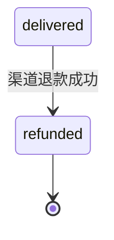

# 10｜充值支付链路保障 · 练习题

开始做题前，先给大家一个小建议：合上知识点，对着**第一节的主图**，把「充值订单的一生」——创单→扣款→回调→发货→对账→补偿——口述一遍。能顺下来，下面这些题你会发现大半都会了；卡壳的地方，就是你该回去重读的那一节。

做题的方式也建议改一下：每道题**先看标题和场景，自己口述一遍答案，再往下看「完整解答」对答案**。直接看解答，容易产生「我会了」的错觉——能讲出来才是真的会。

| 标记 | 含义 |
|------|------|
| **核心** | 不懂整章就没建立起来 |
| **必会** | 值班和面试都要能讲 |
| **常用** | 线上会反复碰到 |
| **常考** | 白板和追问的高频口径 |

题目的顺序也是有意排的：Q1～Q5 先钉创单、状态机与回调；Q6～Q10 讲发货、对账与禁止裸改；Q11～Q14 收尾到退款、60 秒与监控。

## 本题目录

- [Q1 创单为什么在扣款前](#q1)
- [Q2 订单状态机](#q2)
- [Q3 回调验签与幂等](#q3)
- [Q4 重复回调与重复发货](#q4)
- [Q5 paid 积压 vs 掉单](#q5)
- [Q6 发货一次且仅一次](#q6)
- [Q7 T+1 对账三类差异](#q7)
- [Q8 禁止 UPDATE 背包](#q8)
- [Q9 单渠道 503](#q9)
- [Q10 回档与支付库](#q10)
- [Q11 退款 chargeback](#q11)
- [Q12 60 秒掉单排查](#q12)
- [Q13 支付监控与补偿 job](#q13)
- [Q14 对账 P0 与登录 SLI](#q14)
- [合上书](#合上书)

---

## Q1

**★★★★★｜创单为什么在渠道扣款之前？客户端直写背包行不行？**

**覆盖**：核心 · 必会 · 常考 ｜ **对应**：知识点 [二、下单：服务端先生成 order_id](知识点.md)

### 场景

开发说「点 648 直接调背包接口，回调只是确认，上线快」。

先自己试试：不看下面，先口述一遍你的答案，再往下对。

### 完整解答

> 🎯 **一句话**：服务端先 `POST /pay/create` 落 **pending + order_id**；背包不动——否则对账永远对不齐。

创单在渠道扣款前的原因：服务端先生成 `order_id` 并落 `pending` 状态，全链路有主键。客户端拿 `order_id` 去调渠道 SDK，渠道侧生成 `channel_tx_id`。双键唯一索引 `(order_id, channel_tx_id)` 保证同一笔渠道扣款不会产生两条本地订单。

客户端直写背包的问题：没有 `order_id` 关联，回调来了对不上单，掉单无法补，对账永远对不齐。这不是「上线快」的捷径，是架构事故。

> 📝 **面试**：没 order_id 的道具 = 架构事故，不是补单技巧。

### 再追问

**pending 超时怎么办？**——30～60min 后转 `failed`，防永久 pending 堆积。超时后若渠道回调才到，走对账补单流程，不直接改状态。

---

## Q2

创单之后的状态机全景。

**★★★★★｜画出 pending/paid/delivered/failed 并说出各段运维查什么。**

**覆盖**：核心 · 必会 ｜ **对应**：知识点 [四、发货：一次且仅一次](知识点.md)

### 场景

玩家投诉「扣了没到账」。本地 order 状态各异，运营要你 30 秒内定方向。

先自己试试：不看下面，先口述一遍你的答案，再往下对。

### 完整解答

> 🎯 **一句话**：**pending** 查回调；**paid** 查发货；**delivered** 查客户端/缓存；**failed** 终态。

```text
pending → paid（回调验签成功）
paid   → delivered（发货 job）
pending → failed（超时 30～60min）
paid   → failed（发货失败可重试）
delivered → 终态 · 仅可转 refunded
```

各状态查什么：pending 查回调日志和验签；paid 查发货队列 lag 和死信；delivered 查角色库和客户端缓存同步；failed 查是超时还是发货失败。

### 再追问

**delivered 后还能变吗？**——仅 `refunded`（渠道退款，见 Q11）。不能回退到 pending 或 paid。

---

## Q3

回调验签与幂等——钱链核心。

**★★★★★｜回调为什么要验签 + 幂等 UPDATE + 重复也返回 200？**

**覆盖**：核心 · 必会 · 常考 ｜ **对应**：知识点 [三、回调：验签 + 幂等 + 重复也 200](知识点.md)

### 场景

验签失败仍返回 200「避免渠道重试」。重复回调返回 409「告诉渠道已处理」。

先自己试试：不看下面，先口述一遍你的答案，再往下对。

### 完整解答

> 🎯 **一句话**：验签失败 **401+告警**；幂等 `WHERE status=pending`；重复 **200+跳过发货**——否则渠道无限重试。

验签是第一道门：伪造回调直接 401 + 告警，不更新状态。幂等 UPDATE 是第二道门：只有 `status=pending` 的订单才能改成 `paid`，affected_rows=0 就跳过发货。重复回调返回 200 是因为渠道侧不看你 body 内容，只看 HTTP 状态码——返回 4xx 会触发无限重试。

```sql
UPDATE pay_orders SET status='paid', channel_tx_id=?, paid_at=NOW()
WHERE order_id=? AND status='pending';
-- affected_rows=0 → 跳过发货，仍返回 200
```

> ⚠️ **别混**：验签失败返回 200 → 错，应 401+告警；重复回调返回 4xx → 错，应 200+幂等跳过。两种 200 含义不同：验签通过且已处理 = 200（第一次发货），验签通过但已处理 = 200（跳过），验签失败 = 401。

### 再追问

**回调风暴怎么办？**——验签+幂等+nginx 限流（`limit_req zone=pay_cb burst=200`），不关回调入口。关了入口 = 渠道以为你挂了，所有回调变掉单。

---

## Q4

就是 Q3 的重复回调版。

**★★★★★｜同一 channel_tx_id 回调 5 次，玩家收到 5 份道具，根因？**

**覆盖**：必会 · 常考 ｜ **对应**：知识点 [三、回调：验签 + 幂等 + 重复也 200](知识点.md) · [四、发货：一次且仅一次](知识点.md)

### 场景

复盘：每次回调都触发发货，未检查 affected_rows。玩家账号多出 4 份 648 道具。

先自己试试：不看下面，先口述一遍你的答案，再往下对。

### 完整解答

> 🎯 **一句话**：回调层和发货层都缺 **order_id 幂等**——重复回调不应二次 `paid→delivered`。

根因：回调 UPDATE 没有 `WHERE status=pending` 条件，每次回调都把状态改成 paid 并触发发货。发货层也没有幂等保护，重复执行就重复加道具。

修复：两层都要做幂等。回调层用条件 UPDATE（`WHERE status=pending`），发货层用 `WHERE status=paid` + 流水表 `ON DUPLICATE KEY`。即使 job 重试、consumer 重复消费，背包只加一次。

> 📝 **面试**：只删多余道具不查根因 → 还会发生。止血先冻结账号，再修幂等逻辑。

### 再追问

**只删多余道具不查根因行不行？**——不行，幂等漏洞还在，下次还会重复发货。必须修 UPDATE WHERE 条件 + 加流水表唯一索引。

---

## Q5

paid 积压 vs 掉单怎么分。

**★★★★★｜paid 10 万、delivered 3 万，和 T+1 掉单是一回事吗？**

**覆盖**：核心 · 必会 · 常考 ｜ **对应**：知识点 [四、发货：一次且仅一次](知识点.md) · [五、对账：T+1 终态校验](知识点.md)

### 场景

运营说「肯定是渠道没回调」。DBA 查渠道说都 success。回调日志里 200 全绿。

先自己试试：不看下面，先口述一遍你的答案，再往下对。

### 完整解答

> 🎯 **一句话**：**paid 积压** = 发货队列/consumer 慢；**掉单** = T+1 渠道有、本地无 delivered。

paid 积压的特特征：本地 `paid` 数量涨、`delivered` lag 高、回调日志全 200（回调收到了）。掉单的特征：T+1 对账时渠道账单有 `channel_tx_id`，本地无对应 `delivered` 记录。两者查的子系统不同——积压查发货队列，掉单查回调链路。

```sql
SELECT COUNT(*) FROM pay_orders
WHERE status='paid' AND paid_at < NOW()-INTERVAL 30 MINUTE;
-- 8934  ← 积压 7 万，查 consumer 是不是挂了
```

> ⚠️ **别混**：积压是「你知道有单没发」，掉单是「你不知道有单丢了」。积压查发货队列，掉单靠 T+1 对账发现。

### 再追问

**怎么止血 paid 积压？**——扩 consumer、查死信队列重放、按 `paid_at` 优先发货（越早的越先补）。禁止 UPDATE 背包批量补发。

---

## Q6

发货一次且仅一次。

**★★★★★｜发货为什么要「一次且仅一次」？事务/Outbox 怎么口述？**

**覆盖**：必会 · 🔥 ｜ **对应**：知识点 [四、发货：一次且仅一次](知识点.md)

### 场景

回调线程直接 HTTP 调游戏服加道具，不写 deliver_log。跨库没有事务保护。

先自己试试：不看下面，先口述一遍你的答案，再往下对。

### 完整解答

> 🎯 **一句话**：`paid→delivered` 是资损点——**同一 order_id 只发一次**；跨库用 Outbox，消费端仍幂等。

发货幂等四层：订单库条件 UPDATE（`WHERE status=paid`）、流水表唯一索引（`ON DUPLICATE KEY`）、状态机单向不可逆、补偿 job 兜底。跨库不能直接 HTTP 调角色库——用 Outbox 可靠消息：回调只改订单态 + 写 Outbox 表，发货 job 消费消息调角色库。

```text
反模式：回调线程直接 HTTP 调游戏服加道具 · 无 order 状态
正解：回调只改订单态 · 发货 job 读 paid 队列 · 角色库认 order_id 幂等
```

> 📝 **面试**：发货和改状态要一起——至少同一事务或 Outbox，否则 paid 有了道具没有，对账时本地 paid 但角色库无道具。

### 再追问

**发货失败可重试吗？**——可以，靠 `paid` 状态 + 幂等。失败后状态仍是 paid，补偿 job 重试发货，affected_rows 判断是否已发过。

---

## Q7

T+1 对账三类差异。

**★★★★★｜T+1 对账差 300 单，怎么分类处理？**

**覆盖**：核心 · 必会 · 常考 ｜ **对应**：知识点 [五、对账：T+1 终态校验](知识点.md)

### 场景

运营要「按截图批量 GM 补 300 人」，说「玩家群炸了等不了」。

先自己试试：不看下面，先口述一遍你的答案，再往下对。

### 完整解答

> 🎯 **一句话**：**掉单**（渠道有本地无）、**重复**（同 channel_tx_id 两条）、**金额差**（单位/币种）——补单走**工单+双人**。

```bash
comm -23 <(sort channel.csv) <(sort local.csv) > missing.txt
wc -l missing.txt
# 300  ← 掉单 300 笔
```

三类差异各有处置：掉单查 pending/paid 中间态确认是回调没到还是发货失败，走补单工单；重复冻结多余道具、人工核实根因；金额差查单位配置（分 vs 元）和币种（CNY vs USD）。

补单工单必填：order_id/channel_tx_id、uid+server_id、渠道截图+查询结果、补发原因、审批人 ×2。

> ⚠️ **别混**：对账不平 > 阈值 = P0，即使登录 SLI 全绿。资损不等明天。

### 再追问

**掉单补拉 API 能替代对账吗？**——不能，只能辅助。补拉只覆盖「你知道丢了」的单，T+1 对账能发现「你不知道丢了」的单。

---

## Q8

开头那个裸改背包现场。

**★★★★★｜为什么禁止 UPDATE 背包补单？和 GM 补道具有什么区别？**

**覆盖**：必会 · 常考 ｜ **对应**：知识点 [五、对账：T+1 终态校验](知识点.md) · [七、作战：掉单/重复/渠道挂定责](知识点.md)

### 场景

DBA 执行：`UPDATE backpack SET diamond=diamond+6480 WHERE uid=...`，说「最快」。

先自己试试：不看下面，先口述一遍你的答案，再往下对。

### 完整解答

> 🎯 **一句话**：绕开状态机 → **无法对账、无审计、重复发货风险**。

UPDATE 背包的问题：没有 order_id 关联，对账时这笔加钻在订单库里找不到对应记录；没有状态机流转，无法区分是正常发货还是补发；没有审批留痕，出问题无法追责。

GM 补道具的区别：GM 补发应仍走专用补单接口，挂 order_id/channel_tx_id，写补发原因字段，留审批记录。不是裸改背包表。

补单工单流程：运营提交工单 → 填 order_id/channel_tx_id + 渠道截图 + 补发原因 → 双人审批 → 系统更新订单态或专用补发表 → 不裸改背包。

### 再追问

**GM 就不能直接改背包吗？**——GM 工具应走专用补单接口留痕，不能裸改背包表。留痕 = 有 order 关联 + 有审批记录 + 有补发原因。

---

## Q9

单渠道 503 怎么止血。

**★★★★★｜iOS 渠道 503、Android 正常，关不关全球登录？**

**覆盖**：必会 · 常用 ｜ **对应**：知识点 [六、补偿：掉单补拉 + 退款 + 回档 + 渠道差异](知识点.md) · [七、作战：掉单/重复/渠道挂定责](知识点.md)

### 场景

值班提议「支付挂了先关 Gate 修支付」，iOS 玩家全部充值失败。

先自己试试：不看下面，先口述一遍你的答案，再往下对。

### 完整解答

> 🎯 **一句话**：**地区 P0** + 客户端提示「iOS 支付维护中」+ T+1 掉单预备；**不关 Gate**——支付 SLI 与登录 SLI 分开。

不关登录的原因：支付 SLI 和登录 SLI 是两条独立的可用性指标。iOS 渠道 503 时 Android 正常，关 Gate 会把正常渠道也断了，扩大事故范围。关 Gate 修支付 = 用登录故障换支付故障。

止血步骤：客户端提示 iOS 支付维护中；开备用渠道（如有）；预估掉单窗口（503 持续 2h → T+1 对账预备掉单清单）；恢复后跑 pending/paid 补偿 job + 渠道补拉。

> ⚠️ **别混**：支付挂 ≠ 登录挂。`pay_success_rate` 破 → P0 即使 `login` 全绿；`login_fail` 涨 + `pay` 绿 → 别关 Gate 修支付。

### 再追问

**503 持续 2h 运维做什么？**——记录掉单窗口、预备 T+1 对账清单、503 恢复后跑中间态补偿 job + 渠道补拉 API（如可用）。

---

## Q10

回档碰上支付库怎么处理。

**★★★★★｜角色库回档时支付库怎么处理？误回订单库会怎样？**

**覆盖**：必会 · 常考 ｜ **对应**：知识点 [六、补偿：掉单补拉 + 退款 + 回档 + 渠道差异](知识点.md) · 链 [09](../09-玩家数据备份与回档/)

### 场景

整服 PITR 后有人把订单库也回滚了「保持一致」。

先自己试试：不看下面，先口述一遍你的答案，再往下对。

### 完整解答

> 🎯 **一句话**：**支付库不动** + 按窗口内**支付清单补发**道具；误回订单库 → **重复发货**。

正解流程：角色库 PITR 回档 → 支付库不动 → 导出回档窗口内的支付清单（`status=delivered` 的订单）→ 按清单补发道具到回档后的角色库 → 更新 deliver_log。

误回订单库的后果：`delivered` 状态回退到 `paid` 或 `pending`，补偿 job 以为没发货又发一次 → 重复发货。链 [09](../09-玩家数据备份与回档/)：出事必导清单——回档前先导支付清单。

> ⚠️ **别混**：回档只回角色库；**误回订单库会重复发货**——delivered 退回 paid，补偿 job 重复触发。

### 再追问

**清单补发走什么流程？**——运营工单 + 双人审批，仍更新订单/发货态或专用补发表，不裸改背包。

---

## Q11

退款与 chargeback。

**★★★★★｜delivered 后渠道退款（chargeback）运维做什么？**

**覆盖**：常用 · 常考 ｜ **对应**：知识点 [六、补偿：掉单补拉 + 退款 + 回档 + 渠道差异](知识点.md)

### 场景

渠道通知退款成功，游戏内道具已消耗，玩家在群里说「我退了你还封我？」

先自己试试：不看下面，先口述一遍你的答案，再往下对。

### 完整解答

> 🎯 **一句话**：订单 → **refunded** 终态 + 告警；道具追回/封禁/坏账走**产品规则**；退款回调也要验签幂等。

退款处理流程：渠道通知退款 → 更新订单 `refunded` 终态 + 触发告警 → 查道具是否已消耗 → 产品规则决定追回方式（扣回/封禁/记坏账）。退款回调（chargeback notification）同样要验签 + 幂等——重复退款通知不能扣两次道具。



`refunded` 是 `delivered` 之后的终态，不是回退到 pending——已发道具不会自动消失，需要产品规则决定追回。

### 再追问

**重复退款通知？**——幂等，不能扣两次道具。退款回调也要条件 UPDATE + 流水表唯一索引。

---

## Q12

把掉单排查收成 60 秒。

**★★★★★｜60 秒：玩家说扣了 648 没到账，群里已有截图，运营 @ DBA UPDATE。**

**覆盖**：核心 · 必会 · 🔧 ｜ **对应**：知识点 [七、作战：掉单/重复/渠道挂定责](知识点.md)

### 场景

群里已有截图，运营 @ DBA 说「先补上吧」。你作为值班 SRE 要在 60 秒内定方向并阻止裸改。

先自己试试：不看下面，先口述一遍你的答案，再往下对。

### 完整解答

> 🎯 **一句话**：**order_id → status 分叉**；阻止裸改背包；补单走工单不 UPDATE。

```text
0–10s  要 order_id 或 channel_tx_id + uid；查本地 status
10–30s pending → 回调日志/验签；paid → 发货队列 lag
30–45s 渠道侧查询（不等截图）；中间态计数是否批量
45–60s 定责：创单/回调/发货/客户端；补单走工单不 UPDATE
```

决策树：无 order → 创单断（查 /pay/create 日志）；pending → 回调没到或验签失败（查回调日志）；paid → 发货积压（查队列和死信）；delivered → 已到账（查角色库或客户端缓存）。

阻止裸改的话术：「UPDATE 背包绕状态机，无法对账、可能重复发货。先查 status 定方向，补单走工单+双人审批。」

### 再追问

**delivered 但客户端没显示？**——缓存/背包 sync 问题，不是支付问题。让客户端重新拉背包数据，或查角色库是否已写入。

---

## Q13

支付监控与补偿 job。

**★★★★☆｜支付链路监控要盯哪几条？`paid` 超 30 分钟补偿 job 干什么？**

**覆盖**：必会 · 常用 ｜ **对应**：知识点 [七、作战：掉单/重复/渠道挂定责](知识点.md) · [合上书清单](知识点.md)

### 场景

没人盯 `paid` 积压，玩家凌晨掉单，早上才从客服群发现。补偿 job 和 T+1 对账职责重叠，有人把补偿当对账替代品。

先自己试试：不看下面，先口述一遍你的答案，再往下对。

### 完整解答

> 🎯 **一句话**：盯 **pending 超时、paid 积压 >10min、发货失败率、渠道回调 5xx**；补偿 job 处理**已知中间态**，**不能替代 T+1 对账**。

| 告警 | 含义 | 动作 |
|------|------|------|
| `pending` > 30～60min | 回调未到或验签失败 | 查回调日志 / 渠道状态 |
| `paid` lag > 10min | 发货队列积压 | 扩 consumer、查死信 |
| `paid` > 30min 未 delivered | 中间态悬挂 | **补偿 job** 按 `paid_at` 优先重试发货 |
| 回调 5xx 率升 | 渠道或验签服务问题 | 地区 P0，不关全球 Gate |
| T+1 diff > N | 资损 | **P0**，即使登录 SLI 全绿 |

补偿 job：只处理本地已有 `order_id` 且 `status=paid` 的单，幂等发货；发现渠道有、本地无的掉单仍靠 **T+1 对账**。503 持续期间记录掉单窗口，恢复后跑中间态 job + 渠道补拉 API（辅助，不替代对账）。

> ⚠️ **别混**：补偿 job = 你知道「paid 没发」；对账 = 发现「你不知道丢了」的单。

### 再追问

**pending 永久堆积？**——超时转 `failed`，避免僵尸 pending；后续渠道回调走对账补单工单。

---

## Q14

对账 P0 与登录 SLI 别混。

**★★★★★｜登录 SLI 全绿、T+1 对账差 50 单，算 P0 吗？和登录事故怎么分责？**

**覆盖**：核心 · 必会 · 常考 ｜ **对应**：知识点 [五、对账：T+1 终态校验](知识点.md) · [支付 SLI](知识点.md)

### 场景

凌晨 iOS 渠道短时故障，白天登录成功率 99.9%。T+1 脚本跑出 50 笔掉单，运营说「玩家没吵，先观察」。

先自己试试：不看下面，先口述一遍你的答案，再往下对。

### 完整解答

> 🎯 **一句话**：**支付 SLI 与登录 SLI 分开**——对账 diff 超阈值 = **资损 P0**，与 Gate 绿勾无关；单渠道 503 **不关全球登录**。

```text
登录 SLI 绿     → 玩家能进游戏
支付对账不平    → 已扣款未入账 / 重复入账风险
二者独立        → 资损不等明天
```

处置：立即升 P0 支付 war room → 分类 50 单（掉单/重复/金额差）→ 补单 **工单+双人**，禁止 UPDATE 背包 → 查 iOS 503 窗口与中间态清单 → 渠道补拉 API 辅助，仍以 T+1 为准。

> 📝 **面试**：「单渠道 503 为什么不关登录？」——支付挂 ≠ 登录挂；关 Gate 扩大事故（Q9）。

> ⚠️ **别混**：玩家截图不能当补单依据——工单 + 渠道查询结果 + 双人审批。

### 再追问

**阈值多少算 P0？**——按公司资损线（如单日 diff > N 笔或金额 > X）写进 Runbook，不靠值班主观判断。

---

## 合上书

学到这里，先别急着翻下一章。合上书，试试下面这几件事能不能做到——能做到，这章才算真的听懂了。卡住的那一条，就回到对应的小节再听一遍：

- [ ] 1. **默画**主图：创单 → 扣款 → 回调 → 发货 → 对账，标出 order_id/channel_tx_id 在哪段生成。
- [ ] 2. **默画**订单状态机：pending/paid/delivered/failed/refunded 各转换条件。
- [ ] 3. 创单为什么在渠道扣款前；双键幂等是什么。
- [ ] 4. **回调三板斧**：验签、幂等 UPDATE、重复也 200。
- [ ] 5. **paid 积压**和**掉单**怎么分；各查什么。
- [ ] 6. 发货幂等四层：条件 UPDATE + 流水唯一 + 状态机 + 补偿 job。
- [ ] 7. **T+1 对账**三类差异；补单工单必填项。
- [ ] 8. 为什么**禁止 UPDATE 背包**；GM 补道具和状态机补发的区别。
- [ ] 9. **单渠道 503**为什么不关全球登录；支付 SLI 与登录 SLI 分开。
- [ ] 10. **回档时支付库**怎么处理（链 [09](../09-玩家数据备份与回档/)）。
- [ ] 11. **支付监控**：pending/paid 积压、补偿 job vs 对账（Q13）。
- [ ] 12. **对账 P0** 与登录 SLI 分开（Q14）。
