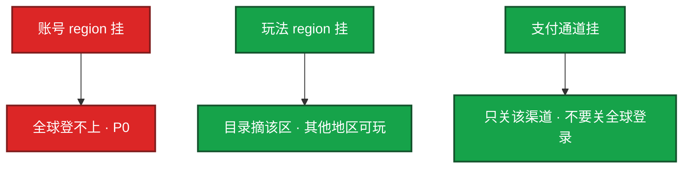

# 10｜出海与多区域 · 练习题

先对照 [知识点](知识点.md) **本章主线** 自己口述，再对答案。每题标了覆盖范围。有出海经历才主动展开。主机双活理论在 02-20，游戏数据面几乎不这么干。

| 标记 | 含义 |
|------|------|
| **核心** | 不懂整章就没建立起来 |
| **必会** | 值班和面试都要能讲 |
| **常用** | 线上会反复碰到 |
| **常考** | 白板和追问的高频口径 |

## 本题目录

- [Q1 跨洋延迟 / 就近房间](#q1)
- [Q2 账号全局 / 换区](#q2)
- [Q3 数据驻留 / 合规](#q3)
- [Q4 切流量](#q4)
- [Q5 AWS 先画约束](#q5)
- [Q6 时区 / NTP](#q6)
- [Q7 没做过怎么答](#q7)
- [Q8 支付地区 P0](#q8)
- [Q9 角色库为什么不双活](#q9)
- [Q10 GM 权限 / 拨测](#q10)
- [合上书](#合上书)

---

## Q1

**★★★★★｜跨洋 200ms，专线或加带宽能消掉吗？实时玩法怎么架构？**

**覆盖**：核心 · 必会 · 常考
**对应**：知识点 §3.1

### 场景

产品要「全球同服」。有人说上专线就能把美西打日服变成 20ms。另一边只把 Gate 放到美西，逻辑仍在东京。

### 完整解答

**一句话**：跨洋延迟物理消不掉，实时对战必须就近房间，就近 Gate 救不了 Tick。

消不掉，物理下限。专线稳的是丢包和抖动，不是光速。同城 10～30ms，跨大陆 150～250ms+。实时对战必须就近开房间、就近匹配。只把 Gate 放近、逻辑仍在远端，战斗 RTT 几乎不降。

回合制可以单 region 全球连。运维能做 Gate 就近、peering、分地区拨测；做不到让美东打日服「和本地一样」。拨测分协议（HTTPS vs TCP / UDP），点放在真实玩家网。匹配按 region / 延迟档。跨 region 同房间不要当运维承诺。

### 再追问

就近 Gate 一点用没有吗？——改善握手和大厅轻操作，对 Tick 同步帮助有限。别把它卖成「全球同服无延迟」。

---

## Q2

**★★★★★｜账号全局、角色分区，换区为什么是迁移作业？账号挂了呢？**

**覆盖**：核心 · 必会 · 常考
**对应**：知识点 §3.4

### 场景

玩家要「把欧区号转到美西」。有人准备 UPDATE `region='us'`。另一边账号 region 挂了，有人说玩法已经散开，目录还能进。

### 完整解答

**一句话**：账号全局角色落 region，换区是小型合服迁移，账号挂是全球 P0。

角色和经济落在 region / 区服。换区 = 小型合服：停写、备份、校验、映射。不是改一个字段。失败恢复两份备份，禁止改字段再试一次。

全局服务 SLO 更严，靠自己的多 AZ，不是靠玩法散开。目录降级救不了「账号已经死了」。支付通道按地区，不要全球登录跟着关。

### 再追问

双活写同一角色库呢？——游戏有状态 + 经济，几乎不这么干。主流是 region 独立，坏了维护，其他 region 的号仍可玩。主机双活理论见 02-20，不要直接套到角色库。

---

## Q3

**★★★★★｜出海合规运维要守哪几条？「数据在 S3」够不够？数据驻留是什么？**

**覆盖**：核心 · 必会 · 常考
**对应**：知识点 §3.2

### 场景

日志采集指到国外 SaaS。备份桶开了跨 region 复制。被问数据在哪，回答「在 S3」。欧区 PII 出现在国内账号账单导出里。

### 完整解答

**一句话**：合规按发行地数据驻留，答在 S3 不够要说账号 region 和有无复制。

数据驻留：角色库、日志、行为分析能不能出发行地。原则按发行地，不是按你机房在哪。生产默认数据不出域、最小权限、审计。

还要守：日志不出境乱送；支付留存在当地规则下、发货在可审计区域；年龄 / 实名按地区开关；热更也可能要过审。细节跟法务。

答「数据在 S3」不够，要说 **哪个账号、哪个 region、有没有跨账号 / 跨 region 复制**。复制一开，PII 可能出发行地。客服能不能下整包玩家数据、GM 写权限是否按 region 切开，也要说得清。

云账号按发行主体拆。不要一个 Administrator 打全球。

### 再追问

S3 跨 region 复制开了没注意？——可能把 PII 复制出发行地。开复制前合规评估，这是真实翻车点。聊天送给境外大模型同样是合规事故。

---

## Q4

**★★★★☆｜切 region 流量你切 DNS 还是切目录？要防什么？**

**覆盖**：必会 · 常用 · 常考
**对应**：知识点 §6.2

### 场景

某 region 扛不住，有人改 DNS 把玩家指到另一个 region。目标侧版本旧、CDN 没预热，`min_client_version` 刚全球抬过。

### 完整解答

**一句话**：切流量听目录不听写死 IP，目标 region 先预热版本一致再切。

客户端应听目录而不是写死 IP。目标侧版本、容量、CDN 指针先就绪。切到未预热 region = 登录 + 更新双事故。灰度按 region + uid，不要全球同时抬 min。

对：目录改指向 → 目标已预热、版本一致、容量够。错：只改 DNS → 远距回源 + 版本不匹配 + 强更堵门。资源指针按 region 独立发布，见第 06 章。

### 再追问

DNS 切完登录通了、更新全失败？——目标 region 没有独立源 / 没预热。先回目录，不要再抬 min。

---

## Q5

**★★★★☆｜AWS 和国内云在这题里你真正要会什么？**

**覆盖**：必会 · 常考
**对应**：知识点 §4

### 场景

被要求「画一下 AWS 出海架构」，开始报一串服务名：EKS、NLB、S3、Shield……没提延迟和数据驻留。

### 完整解答

**一句话**：先画游戏约束再填云产品，翻车点是 AK/复制/连接跟踪/quota 不是报服务名。

先画游戏约束，再填 VPC / IAM / EKS / S3 / 高防对应物。会翻车的是：AK 进镜像、备份全球复制、安全组 / 连接跟踪、GPU / 节点 quota、oncall 不在当地时区。报一串服务名不讲延迟和数据边界是证书答题。

先：有状态、分服、目录、跨洋 RTT、数据不出域。再：对应到哪家云的哪类产品。

### 再追问

控制面托管了还要不要懂？——要懂影响面。和 K8s 托管同一逻辑：你 ssh 不进 etcd，事故仍是你的玩家。

---

## Q6

**★★★★☆｜活动整点用哪个时区？合服用哪个窗口？**

**覆盖**：必会 · 常用
**对应**：知识点 §6.5

### 场景

用北京时间 05:00 cron 给美西合服。美西还在晚上黄金时段。活动开关一份配置打全球。

### 完整解答

**一句话**：活动合服用发行当地时区，多 region 配置按时区拆不要一份 cron 打全球。

发行当地。用北京时间给美西合服会在人家黄金时段停写。多 region 活动配置按时区拆，不要一份 cron 打全球。当地低峰合服；活动整点用当地 tz。

### 再追问

token 过期、活动「已开但进不去」先看什么？——先看 NTP / 时钟偏移，再看代码。跨 region 对账先看时间。见 02-19。

---

## Q7

**★★★☆☆｜没做过真出海，被问多 region 怎么答？**

**覆盖**：常考
**对应**：知识点 §4.1

### 场景

简历只写国内多 AZ。对方追问「你们美东挂了怎么切」。

### 完整解答

**一句话**：没做过就讲国内多 AZ 和方案边界，标明未执刀不编 region 故障故事。

讲国内多 AZ、分服隔离、账号全局和区服数据的差别，标明未执刀过跨境合规和真跨洋延迟。给方案边界：跨洋消不掉、角色不双活写、目录可摘 region。不编 region 故障故事。

### 再追问

国内三 AZ 算不算多 region？——不算真出海。同城 / 同大陆延迟和合规都不是一回事。可以说清「多 AZ 保的是机房，跨洋保不了 RTT」。

---

## Q8

**★★★☆☆｜出海支付失败为什么是地区 P0？能不能扩 Gate 救？**

**覆盖**：必会 · 常用
**对应**：知识点 §6.6

### 场景

某地区渠道发货失败。登录正常。有人扩 Gate，有人准备关全球登录。沙箱前一天是通的。

### 完整解答

**一句话**：地区支付失败是地区 P0，扩 Gate 没用，不要关全球登录。

支付失败是地区 P0，不是登录问题，扩 Gate 没用。不要关全球登录。每条渠道单独成功率和发货延迟。沙箱通了、正式包证书 / 回调 URL 错，是上线日经典事故——变更单要有正式环境回调验签。发货必须在可审计的区域完成。订单留存按当地规则。

### 再追问

玩家重复点支付怎么办？——渠道侧可能已扣款。对账补发，不要让玩家「再点一次试试」。和游戏内回档的二次伤害是同一类。

---

## Q9

**★★★☆☆｜为什么游戏不做多 region 角色库双活？主机不是有主主吗？**

**覆盖**：核心 · 常考
**对应**：知识点 §3.4

### 场景

对照 02-20 的主主图，有人要把角色库做成跨洋 active-active，「挂一个 region 玩家无感」。

### 完整解答

**一句话**：角色库不跨洋双活写，region 独立坏了维护，主机 HA 不套到有状态经济。

主机主主解决的是无状态或可冲突合并的存储。角色库有会话、经济、回档位点。跨洋双写会：延迟里冲突、同一道具发两次、回档不知道以哪边为准、合规上数据已出境。

主机 HA（02-20）：同城 VIP / 多数派，防的是机器。游戏角色：region 独立，坏了维护，其它 region 的号仍可玩，不要跨洋双活写。账号 / 登录这类全局无状态可以多 AZ，甚至多 region 只读。角色写路径不套主主。

### 再追问

只读副本放到远 region 行不行？——排行、展示可以。写背包、扣费、结算不行。只读延迟也要进 SLA，免得玩家看见「旧背包」。写路径必须落在角色所在 region。

---

## Q10

**★★★☆☆｜GM / 客服跨 region 权限怎么拆？拨测点放哪？**

**覆盖**：常用 · 常考
**对应**：知识点 §6.7

### 场景

美西值班拿着全球写权限改欧区背包。拨测全从国内办公网出，看板显示全球 RTT 很好。

### 完整解答

**一句话**：GM 写权限按 region 切，拨测分地区分协议放真实玩家网。

GM 写权限按 region 切开。美西值班不该对欧区角色库有写。跨 region 查询走只读 + 审计。这是合规也是误操作半径——回档和裸改的风险面被权限放大。

拨测分地区、分协议，点放在真实玩家网，不放在办公网。加速器会让「地区」失真（第 08 章）。

### 再追问

应急时能不能临时开全球写？——当变更：过期时间、审计、双人。不要把「临时」留成默认策略。

---

## 合上书

- [ ] 能说明跨洋延迟消不掉；实时玩法必须就近房间，就近 Gate 救不了 Tick
- [ ] 能画出账号全局、角色落 region；换区是迁移；账号挂是全球 P0
- [ ] 能把数据驻留讲到账号 + region + 有无复制，而不是「在 S3」
- [ ] 能说切流量先目录、目标先预热；国内预热完不等于海外可切
- [ ] 能用当地时区做活动 / 合服；地区支付失败不扩 Gate
- [ ] 能先讲约束再填云产品名；没做过就标明未执刀，不编故障故事
