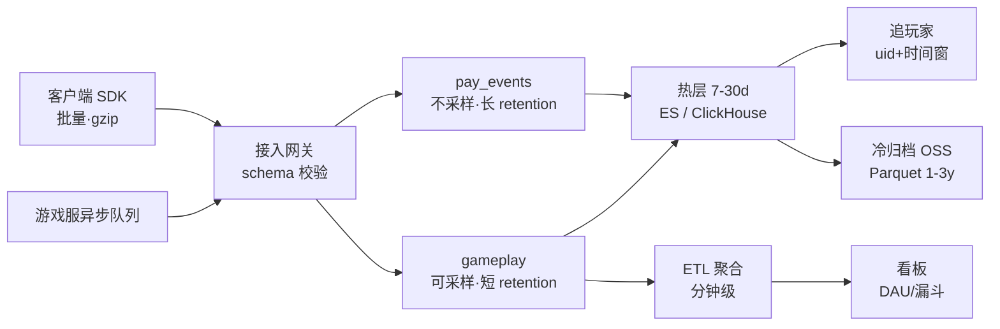
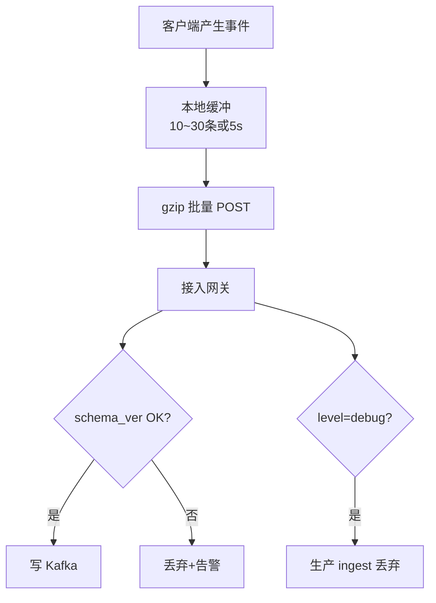
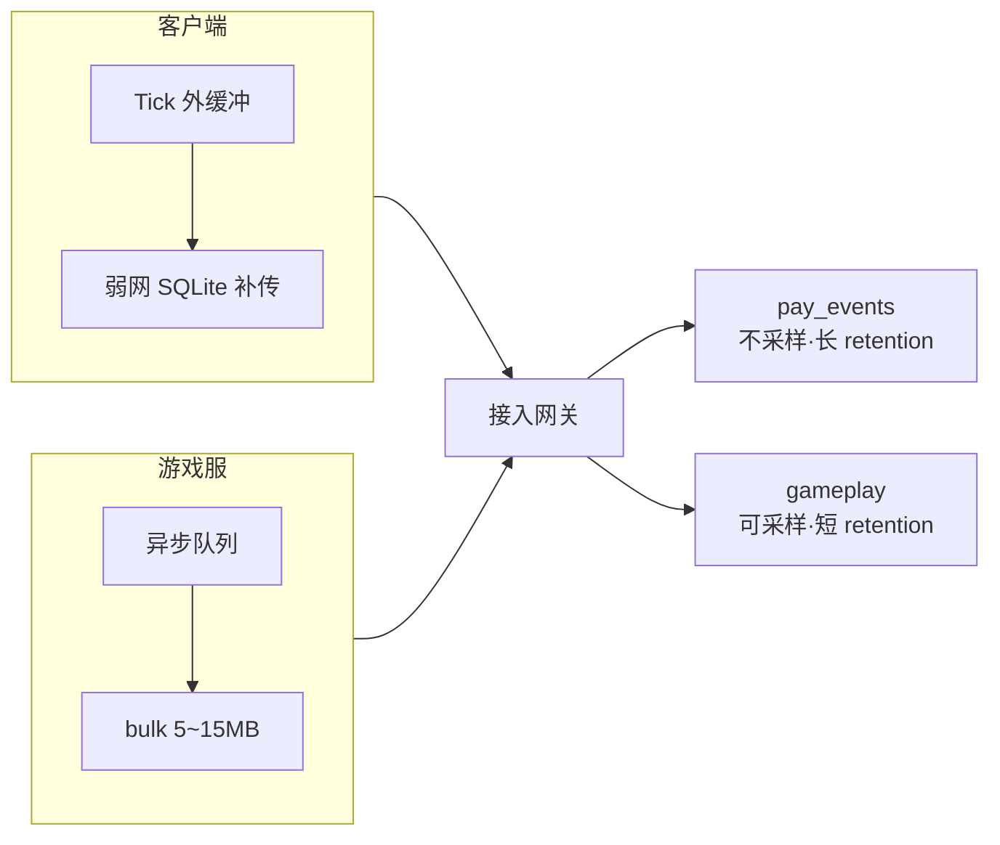
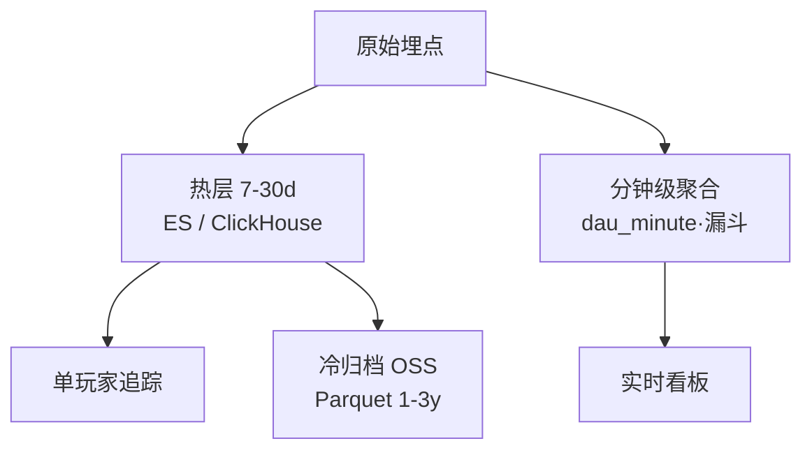
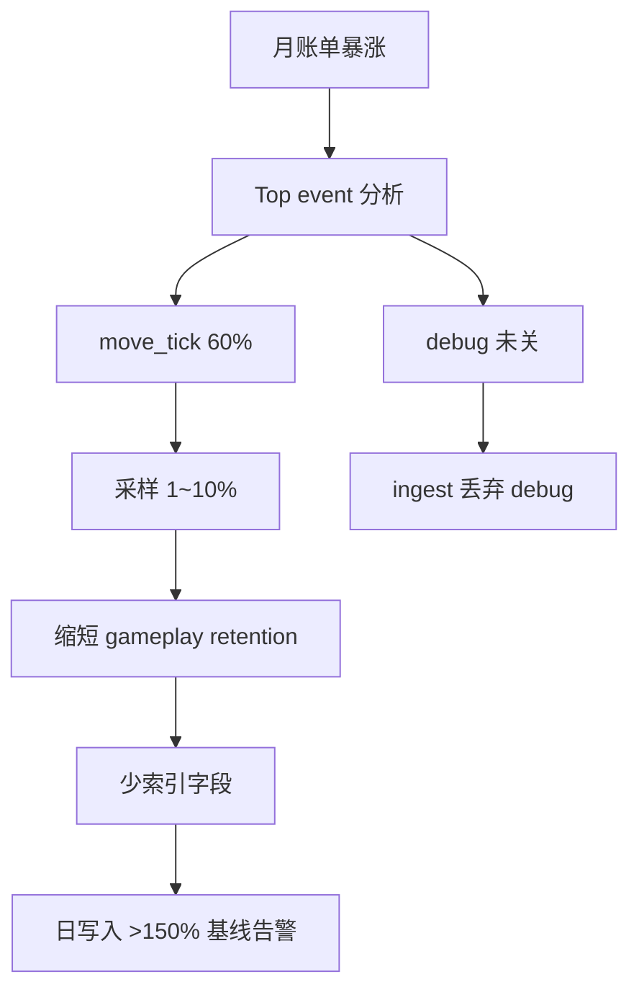
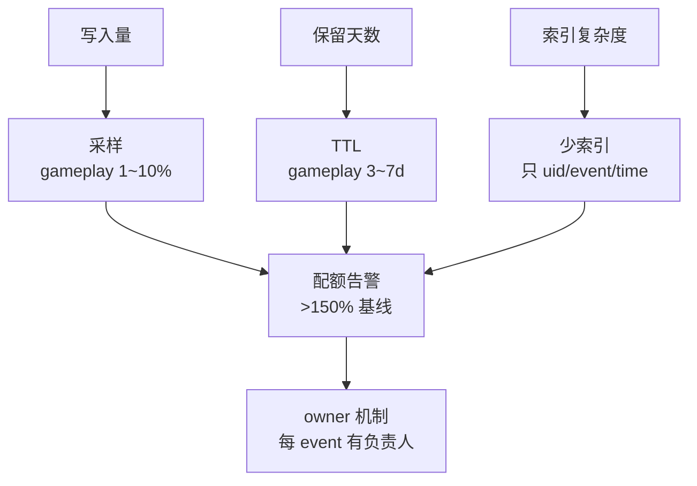
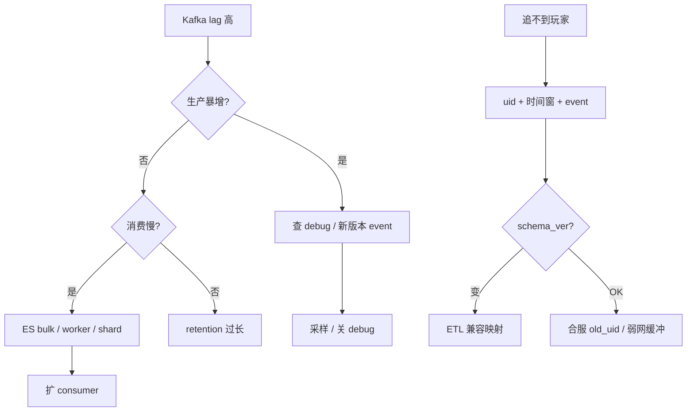

# 游戏日志与埋点链路

> 大家好，欢迎来到这次分享。开讲之前，先带大家回到一个现场：
> 运营问「这个玩家 14:32 有没有点过充值按钮」，ES 里查不到——客户端把 `uid` 改成了 `userId`，ETL 全 drop；同时有人把全量 debug 打进 Kafka，账单一个月翻三倍。
> 这一章讲完，你会知道当时「uid 改成 userId」和「全量 debug 进 Kafka」各自错在哪，以及追玩家和跑看板为什么必须分路。
> **本章回答的问题**：一条埋点从产生到查询（埋点 → 采集 → 存储 → 查询 → 告警），每段格式 / 采样 / retention 怎么约束，追玩家和跑看板为什么走不同路，成本怎么控。
> **本章不讲**：通用 ELK 底座 → [01-23 日志运维](../../01-基础底座/23-日志运维/)；监控告警体系 → [01-22](../../01-基础底座/22-监控与告警/)；可观测 SLO → [13](../13-游戏SRE稳定性/)；支付对账 → [10](../10-充值支付链路保障/)。

**标记**：🎯重点 · 🔥难点 · ⭐常考 · 🔧实操

**怎么听这场分享**：先把第一节「埋点日志的一生」看熟——上报→采集→入库→查询→成本；第二到第六节顺着这条线走，第七节专门讲开头那个查不到充值点击的现场怎么定责。每一节讲完会提示对应练习题，趁热打铁。

---

## 一、一张图：埋点日志的一生

> 🎯 **一句话**：一条埋点从 SDK 批量上报，经 Kafka 分 topic 传输，入热层供追玩家 / 入聚合表供看板，最后靠采样和 TTL 控成本。



**读图**：从左到右是时间线——SDK 批量上报，服务端异步写，**不能阻塞 Tick**。Kafka 是传输中枢，积压看 **consumer lag** 不是看磁盘。热层追玩家、聚合跑看板，两路不能混；冷层只供法务/审计批查。监控告警照的是 **lag + 配额**两段——lag 高报积压，日写入超基线报成本异常。

三种日志别混：**埋点**（点击、关卡、漏斗）热 7～30 天 + 冷归档，gameplay 可采样；**业务日志**（发货失败、回调异常）30～90 天一般不采样；**审计日志**（GM 操作、权限变更）≥1 年，**不可采样**。追玩家 = `uid + 时间窗 + event`；实时看板走聚合表，不走原始全表扫；支付 / 安全 / 审计事件不采样。这一条决定了后面的采样策略、retention 和查询路径——记不住这条，后面每一步都会踩坑。

```text
追玩家 = uid + 时间窗 + event
实时看板走聚合，不走原始全表扫
支付 / 安全 / 审计事件不采样
```


好，主图装进脑子了。接下来从「上报」开始——schema 与必带字段。

本节对应练习题 Q1、Q2。

---

## 二、上报：schema 与必带字段

> 🎯 **一句话**：每条埋点必须带 `uid / server_id / event / client_time / trace_id / schema_ver`——少一个，ETL 就可能 silently drop。



**读图**：没写收件人（uid）和日期（time），到了 ES 也查不到；`schema_ver` 不匹配 = ETL 路由失败 = 静默丢弃；debug 日志在 ingest 层拦截，不进热路径。

> 💡 **打个比方**：schema_ver 就像快递单格式——旧版填「收件人」，新版改成「姓名」，分拣机还认旧字段，新单直接丢掉。版本号让 ETL 知道该按哪套规则分拣。

必带字段六条，一条不能少：`uid`（追玩家）、`server_id`（分服过滤）、`event`（事件类型）、`client_time`（客户端时间，防时钟漂移）、`trace_id`（串联一次会话）、`schema_ver`（ETL 路由）。

**schema 变更流程**：客户端发版改字段名 / 加字段时，必须同步升 `schema_ver`（如 v1 → v2），ETL 侧加兼容映射规则（`v2.userId → uid`），过渡期双版本并存。发版前 1h vs 后 1h 对比 event 计数——暴跌 = schema 不兼容。合服发版额外要求：埋点起双写 `new_uid` + `old_uid`，映射表入库。

> 💡 **打个比方**：schema_ver 就像快递单格式——旧版填「收件人」，新版改成「姓名」，分拣机还认旧字段，新单直接丢掉。版本号让 ETL 知道该按哪套规则分拣。

**现场走一遍**（运营查不到玩家点击充值按钮）：

1. 查 ES：`uid:12345 AND event:pay_click AND @timestamp:[14:30 TO 14:35]` → 0 条。
2. 客户端新版本把字段改成 `userId`——ETL 仍认 `uid`，全 drop。
3. 正确做法：schema 版本升 `v2` + 兼容映射；发版前对账 event 计数。
4. 合服后：埋点带 `new_uid` + 可选 `old_uid / old_server_id` 便于追历史（链 [06](../06-开服合服/)）。
5. 支付是否成功 → 转订单库（链 [10](../10-充值支付链路保障/)），**不以埋点为准**。
6. 上报 URL 走独立域名 / CDN——不要和战斗 UDP 混端口（链 [12](../12-游戏网络与对抗/)）。
7. `trace_id` 由客户端生成（UUID），贯穿一次会话所有事件——追一个登录到充值的完整链路靠它串联。
8. `level` 字段区分生产与调试：`level=info` 进 Kafka，`level=debug` 在 ingest 层丢弃。

> 🔍 **现场**：发版后 event 计数暴跌

```bash
curl -s 'http://es:9200/game-events-2026.09.01/_search' -H 'Content-Type: application/json' -d '{
  "size": 0,
  "aggs": { "by_event": { "terms": { "field": "event.keyword", "size": 20 } } }
}'
```

```text
"buckets": [
  { "key": "move_tick", "doc_count": 89234120 },
  { "key": "pay_click", "doc_count": 0 }        ← 从 2万 → 0，schema 字段改名未兼容
]
```

> ⚠️ **别混**：**埋点**能证明「点了按钮」；**订单库**才能证明「扣款成功」——运营问「有没有充值」要分清楚是问行为还是问钱。

> 📝 **面试**：「埋点必带什么？」——「uid / event / client_time / server_id / trace_id / schema_ver。发版前对 event 计数；debug 不进生产。」


上报讲完。大家想想：字段改名只是客户端小事吗？很多人会答「改个名而已」——⭐ 这是高频错答，ETL 会全 drop。

本节对应练习题 Q2。

---

## 三、采集传输：批量、背压与 Kafka

🔥 Tick 内同步上报 = 战斗卡帧。记住：SDK 批量 gzip，服务端异步队列，背压时先丢可采样事件护支付 topic。

> 🎯 **一句话**：客户端 10～30 条或 5s 批量 gzip；服务端异步写队列——Tick 里同步 HTTP = 战斗卡顿；Kafka 积压先看 lag 不是看磁盘。



**读图**：分 topic 分 retention——支付 topic 不采样、retention 更长。客户端弱网走本地缓冲补传，服务端走异步队列批量推送，两条路都不阻塞游戏主循环。

客户端批量策略：攒够 10～30 条或 5s 触发一次 gzip POST，弱网时写本地 SQLite / 文件，恢复后按 `seq` 顺序补传。服务端走异步队列 bulk 5～15MB，不进 Tick 主循环。两类事件走不同可靠级别：**支付 / 安全**走可靠通道（不丢、不采样、指数退避到成功）；**gameplay** 非关键可丢可采。

> 💡 **打个比方**：Kafka topic 分 retention 就像快递分通道——易碎品（支付事件）单独包装、单独留底；普通件（gameplay）可以抽检、定期清理。混一个通道就没法单独治理。

**现场走一遍**（版本日后战斗 P95 飙高，代码 diff 只有「加了埋点」）：

1. 战斗 Tick 内同步 `HttpPost(track)` → 每帧阻塞 2ms。
2. 改异步队列 + 批量 → P95 恢复。
3. 弱网：本地 SQLite / 文件缓冲，恢复网络后补传——带 `seq` 防重。
4. 失败重试指数退避；超过 N 次丢弃**非关键**埋点，支付 / 安全走可靠通道。

**现场走一遍**（Kafka 磁盘 85%，告警连续 3 天）：

1. `kafka-consumer-groups --describe` → `game-track` lag **1200 万**。
2. 根因：ES 写入变慢（shard 过多）+ 某版本 debug 埋点暴增 10 倍。
3. 止血：关 debug 采样；扩 ES bulk worker；临时提高非关键 topic 采样率。
4. retention 从 7 天砍到 1 天 → 运营「昨天行为查不到」——**砍 retention 要先通知**。

> 🔍 **现场**：查 Kafka 积压

```bash
kafka-consumer-groups.sh --bootstrap-server kafka:9092 \
  --group etl-gameplay --describe
```

```text
TOPIC          PARTITION  CURRENT-OFFSET  LOG-END-OFFSET  LAG
gameplay       0          8923412         10123412        1200000  ← 消费跟不上
pay_events     0          2341            2345            4        ← 正常
```

Kafka topic 配置示例：

```properties
# pay_events — 不采样、长保留
retention.ms=7776000000
min.insync.replicas=2

# gameplay — 可采样、短保留
retention.ms=259200000
```

**Kafka 积压诊断三步**：第一步看 `consumer-groups --describe` 的 LAG 列，区分是哪个 topic 积压；第二步查 top event 聚合，判断是生产暴增（新版本 debug / 高频 event 变多）还是消费慢（ES shard 过多 / bulk worker 不够）；第三步对症——生产暴增则采样 / 关 debug，消费慢则扩 consumer / 优化 ES 写入。pay_events lag 高优先扩 consumer，不采样。

> ⚠️ **别混**：**Kafka 磁盘满** ≠ **生产太多**——先看 lag；可能是 consumer 慢或 retention 过长。盲目砍 retention 会让运营查不到昨天数据。

> 📝 **面试**：「为什么 Tick 内不能同步上报？」——「每帧 HTTP 阻塞 = 性能事故。必须异步批量；支付事件走可靠通道。」


采集讲完。Tick 内同步上报会卡战斗——下一节入库：热层查玩家，聚合跑看板。

本节对应练习题 Q3、Q4。

---

## 四、入库：热层查玩家，聚合跑看板

⭐ 这是面试必考。运营要的 DAU 看板，能不能直接扫热层明细？很多人会答「能，数据都在」——错了。看板走聚合表，追玩家才走热层 uid+时间窗。

> 🎯 **一句话**：热层（ES / ClickHouse）保留 7～30 天原始埋点供追玩家；DAU / 漏斗走 ETL 分钟级聚合表——看板不全表扫原始。



**读图**：原始埋点同时走两条路——热层存最近 7～30 天原始供追玩家，ETL 聚合表存分钟级统计供看板。超过热层窗口的历史走冷层 OSS Parquet 批查。

> 💡 **打个比方**：热层是期刊架（查具体哪篇文章），聚合表是目录索引（查这个月发了多少篇）。追玩家去期刊架翻原文，看 DAU 去目录查统计——拿目录翻原文又慢又漏。

**现场走一遍**（实时 DAU 看板比 T+1 数仓差 20%）：

1. 看板 SQL 直接 `SELECT COUNT(DISTINCT uid) FROM raw_events`——ES 全表扫慢且不准。
2. 正确：ETL 写 `dau_minute` 聚合表；看板查聚合。
3. 追玩家：`uid + @timestamp range + event`——热层 7 天内秒级。
4. 超过 7 天 → 冷层 OSS Parquet + Presto / Spark 批查——分钟级延迟可接受。
5. 合服 uid 变更：查 `old_uid` 字段或映射表 join。

ES ILM（Index Lifecycle Management）策略示例：

```json
{
  "policy": {
    "phases": {
      "hot": { "actions": { "rollover": { "max_size": "50gb", "max_age": "1d" } } },
      "warm": { "min_age": "3d", "actions": { "shrink": { "number_of_shards": 1 } } },
      "delete": { "min_age": "7d" }
    }
  }
}
```

hot 阶段 rollover 满足 max_size 50GB 或 max_age 1d 之一就滚动建新 index；warm 阶段 3 天后 shrink 到 1 shard 省资源；delete 阶段 7 天后直接删——gameplay 适用此策略。**审计 index 单独 policy，不配 delete 阶段**。

> 🔍 **现场**：追一个玩家（ES）

```bash
curl -s 'http://es:9200/game-events-*/_search' -H 'Content-Type: application/json' -d '{
  "query": {
    "bool": {
      "must": [
        { "term": { "uid": "12345" } },
        { "range": { "@timestamp": { "gte": "2026-09-01T14:30:00", "lte": "2026-09-01T15:00:00" } } }
      ]
    }
  },
  "sort": [{ "@timestamp": "asc" }],
  "size": 500
}'
```

```text
# ← 返回该玩家 14:30-15:00 所有埋点事件，按时间排序
# ← 0 条 → 查 schema_ver / 合服 uid / 弱网缓冲
```

> ⚠️ **别混**：**client_time**（客户端时间）vs **@timestamp**（服务端入库时间）——客户端时钟漂移时用 server ingest 时间做 SLA；追玩家两者都要看，时间窗放宽 ±10min。

> 📝 **面试**：「追玩家和 DAU 看板各查哪？」——「追玩家：热层 uid+时间窗+event。看板：ETL 聚合表，不全表扫原始。」


入库讲完。记住口诀：**追玩家走热层，看板走聚合，别用明细硬算 DAU**。

本节对应练习题 Q5、Q6、Q7。

---

## 五、查询：追玩家 vs 看板 vs 合规

> 🎯 **一句话**：运营问「14:32 有没有点充值」——热层查 event；支付成功与否转订单库；审计 / GM 走独立索引、≥1 年。

**口述 Runbook**（运营要「这个玩家有没有点充值」）：

```text
1. 确认 uid + server_id + 时间窗（客户端/服务器时间）
2. 查热层：event=pay_click OR pay_open
3. 无结果 → 查 schema 版本 / 是否合服 uid 变更
4. 仍无 → 查客户端是否弱网缓冲未上报
5. 支付是否成功 → 转订单库（链 10），不以埋点为准
```

| 查询类型 | 数据源 | 延迟 | 禁止 |
|----------|--------|------|------|
| 单玩家行为 | 热层原始 | 秒级 | 全 cluster 扫 |
| DAU / 漏斗 | 聚合表 | 分钟级 | raw 全表 COUNT |
| GM / 审计 | 审计索引 | 秒级 | 采样 / 7 天删 |
| >30 天历史 | 冷层 Parquet | 分钟～小时 | 热层扩容 |

> 🔍 **现场**：event 计数异常（debug 暴增）

```text
"move_tick": 89234120,
"pay_click": 2341,
"debug_dump": 9823412   ← 新版本 debug 没关
```

**漏斗与留存分析边界** ⭐：注册漏斗走聚合表，付费漏斗走聚合 + 订单库交叉——不以埋点定资损。留存 D1/D7 走数仓 T+1，单玩家轨迹走热层 raw。实时看板写「今日 DAU」、财务写「T+1 对账」——**两个数允许差**，但要文档化口径，不能各查各的。付费漏斗的关键节点（点击→下单→支付→到账）必须和订单库终态对齐，埋点只负责行为侧，钱侧以订单 `delivered` 为准。

**弱网 client_time 漂移** 🔧 🔥：客户端时钟快 10 分钟时，按 client_time 追玩家会 miss——时间窗放宽 ±10min，并以 server `@timestamp` 交叉验证。弱网补传带 `seq` 可能导致事件**晚到**，运营给的「14:32」可能是 client_time 而非 ingest time。追行为序看 client_time 排序 + server ingest 校验，SLA / 延迟看板看 server @timestamp；时钟漂移 >5min 告警，ETL 可修正。这是追玩家最常见的「查不到」原因之一。

> 📝 **面试**：「埋点能代替订单对账吗？」——「不能。埋点证明行为；钱以订单库 `delivered` 终态 + T+1 对账为准。」


查询讲完。成本怎么控——采样、TTL、配额。

本节对应练习题 Q8、Q9。

---

## 六、成本治理：采样、TTL、配额 🔥

大家想想：日志是不是「越多越好、永久留着」？很多人会答「是，以后能查」——错了。🔥 大白话：**pay 事件不采样、长留；gameplay 可采样、短 TTL；debug 有配额**——三类混一个 topic 就会把账单打穿。

> 🎯 **一句话**：日志成本 = 写入量 × 保留天数 × 索引复杂度——非关键 gameplay 可采样 10%，支付 / 安全 / 审计**不采样**。



**读图**：成本治理从 top event 分析入手——找到最占量的事件，再决定是采样、关 debug 还是缩 retention。最后建配额告警，从被动救火变成主动发现。

成本公式三因子：**写入量**（每秒 / 每天写入条数 × 平均大小）× **保留天数**（retention）× **索引复杂度**（索引字段数 × 副本数）。三个因子任一翻倍，成本就翻倍。控成本就是从这三因子里砍——采样减写入量、TTL 减保留天数、少索引减索引复杂度。

**现场走一遍**（ES 月账单从 5 万涨到 15 万）：

1. Top event：`move_tick` 占 60%——每帧上报。
2. 改采样：move 10% + 服务端聚合后再上报。
3. retention：gameplay 7→3 天；audit 保持 365 天。
4. 索引：只索引 `uid / event / server_id / time`；大 JSON 放 `_source` 不索引。
5. 设配额告警：日写入 > 基线 150% → 自动提采样 + 通知 oncall。

| 事件类 | 采样 | retention |
|--------|------|-----------|
| 支付 / 安全 | 100% | ≥90 天 |
| 审计 / GM | 100% | ≥365 天 |
| 漏斗关键 | 100% | 30 天 |
| gameplay 高频 | 1～10% | 3～7 天 |

> ⚠️ **别混**：**关日志治卡顿** vs **降采样控成本**——战斗卡顿时查 Tick 内同步埋点（改异步），不是关所有日志；成本暴涨时砍 move_tick 采样，不动 pay 和 audit。

> 📝 **面试**：「成本治理三板斧？」——「采样、TTL、少索引。先砍 move_tick，不动支付和审计。」

### ES vs ClickHouse：热层选型 ⭐

| 维度 | Elasticsearch | ClickHouse |
|------|---------------|------------|
| 追玩家单 uid | 强（倒排索引） | 强（主键 + 时间） |
| 聚合 DAU / 漏斗 | 贵、慢 | 便宜、快 |
| 全文 / GM 搜 | 强 | 弱 |
| 成本 | 索引重 | 列存省 |

**常见拆法**：gameplay 高频 → ClickHouse 聚合 + 采样 raw；审计 / 安全 → ES 或独立集群；**支付事件** → 独立 topic + 长 retention，进对账旁路而非替代订单库。

ClickHouse 适合聚合查询的原因：列存引擎只读需要的列，`COUNT(DISTINCT uid)` 在 CH 上比 ES 快一个量级且省内存。ES 的倒排索引对全文检索（GM 搜操作记录）强，但聚合要扫描所有 shard 做汇总，贵且慢。gameplay 每天十亿条 raw 全量进 ES 索引 = 成本灾难——进 CH 列存或先 ETL 聚合再入库。

### 合规与隐私 🔥

埋点不带明文手机号 / 身份证——最小必要原则，只采行为数据不采 PII（个人身份信息）。审计 ≥1 年留存；玩家删号请求走法务流程，不是运维直接删 S3——删号后热层可清，冷层归档走法务审批。出海日志落区（链 [15](../15-出海与多区域/)），欧盟用户数据不能落国内。日志展示 uid 哈希 / 尾号脱敏，内部看板不展示明文。

> ⚠️ **别混**：**删日志降成本** vs **删审计违法**——审计索引单独 bucket，禁止 ILM delete。删 gameplay index 可以，删 audit index 不行。删号请求 ≠ 运维删日志——走法务流程。

### Filebeat 与 SDK 分工 🔧

游戏服**业务日志**（发货失败、回调异常）走 filebeat → Kafka，和**客户端埋点**分 topic——混一起 ETL 规则打架。

```text
/var/log/game/pay-callback.log  → topic: biz_pay
/var/log/game/battle.log        → topic: biz_battle（可采样）
客户端 SDK                        → topic: gameplay / pay_events
Nginx access log                 → topic: nginx_access（非埋点，链 23）
```

禁止战斗 Tick 写 filebeat——必须走异步队列。

### 埋点字典与发版对账 🔧 ⭐

发版 Runbook 必含：

```text
□ schema_ver 变更说明
□ 新旧 event 计数对比（发版前 1h vs 后 1h）
□ debug 开关关闭
□ 支付 event 100% 采样确认
□ Kafka topic retention 未误改
```

owner 机制：每个 `event` 有负责人——成本暴涨时先找 owner 而不是关集群。owner 负责确认该 event 是否必要、采样率是否合理、字段是否冗余。新增 event 必须在埋点字典登记，否则 ingest 拒绝写入。埋点字典应含：event 名、schema 定义、owner、采样率、retention、变更记录。

### 冷层与合规留存 🔧

```text
热层 7～30d：追玩家 · ES / ClickHouse
冷层 OSS Parquet 1～3y：法务 / 审计批查 · Presto / Spark
删号请求：走法务 · 不是运维直接删 S3
出海：日志落区（链 15）
```

砍 gameplay retention 需运营 + 数据审批后执行 ILM；删 audit index 禁止，独立 bucket；导出玩家轨迹走客服工单，uid + 时间窗查询。冷层 Parquet 按 `date` 分区，批查走 Presto / Spark 扫指定分区，不全量扫描。审计冷层和 gameplay 冷层分 OSS bucket——合规要求审计留存不可被 ILM 自动清理。

### 冷层与合规留存 🔧

```text
热层 7～30d：追玩家 · ES / ClickHouse
冷层 OSS Parquet 1～3y：法务 / 审计批查 · Presto / Spark
删号请求：走法务 · 不是运维直接删 S3
出海：日志落区（链 15）
```

砍 gameplay retention 需运营 + 数据审批后执行 ILM；删 audit index 禁止，独立 bucket；导出玩家轨迹走客服工单，uid + 时间窗查询。

### 收束：埋点链路凭什么控住成本



**读图**：成本治理三轴——采样控写入量、TTL 控保留天数、少索引控索引开销。三轴收束到配额告警 + owner 机制，从被动救火变成主动发现。

> ⚠️ **别混**：控成本 ≠ 删审计——采样和 TTL 只管 gameplay，支付 / 审计 / 安全 100% 不动。

> 📝 **面试**：「日志打爆成本，先砍谁？」——「move_tick 采样；不动 pay / audit；看 top event 再动 retention。记忆分组：采样 → TTL → 少索引 → 配额 → owner。」

**落地顺序**：从零搭埋点链路按以下五步，跳步会留坑——

```text
1. 埋点字典（event 列表 + schema + owner）  ← 没字典 = 无法治理
2. SDK 批量异步 + 服务端队列               ← 没异步 = Tick 卡顿
3. Kafka 分 topic + ETL + 热冷分层        ← 没分层 = 成本爆炸
4. 追玩家 Runbook（uid + 时间窗）          ← 没 Runbook = 全 cluster 扫
5. 成本配额 + 采样策略评审（季度）          ← 没配额 = 被动救火
```

选型对错一览：

- 埋点选 schema 版本 + 必带字段，不选客户端随意 JSON。
- 上报送异步批量 gzip，不选 Tick 内同步 HTTP。
- 传输选分 topic + 分 retention，不选一个 topic 全塞。
- 查询选热层追玩家 + 聚合看板，不选看板全表扫原始。
- 成本选采样 + TTL + 配额告警，不选磁盘满才砍。
- 合规选审计不采样 ≥1 年，不选审计也 7 天删。


现在再看群里「全量 debug 进 Kafka」，你知道账单为什么翻三倍了。

本节对应练习题 Q8、Q12。

---

## 七、作战：追不到 / 积压 / 成本爆定责

> 🎯 **一句话**：追不到先查 uid + 时间窗 + schema；Kafka 积压先看 lag；DAU 不对查 ETL 延迟不是加 ES 节点。

### 决策树



**读图**：左树治积压（先分生产暴增 vs 消费慢），右树治追不到（先查 schema 再查合服 / 弱网）。两棵树的共同前提是先拿 uid + 时间窗 + event。

| 现象 | 先做 | 别做 |
|------|------|------|
| 追不到玩家 | uid + 时间窗 + event | 全 cluster 扫 |
| Kafka 磁盘 85% | lag + top event | 盲目扩 retention |
| DAU 看板差 20% | ETL 延迟 / 聚合 | 加 ES 节点 |
| 战斗卡顿 | 查 Tick 内同步埋点 | 关所有日志 |
| 成本翻三倍 | top event + 采样 | 删审计日志 |
| 合服后查不到 | old_uid / 映射 | 只查 new uid |
| 弱网丢埋点 | 客户端缓冲 seq | 认为没发生 |

### 60 秒剧本 🔧

```text
0–10s  问清：追玩家 vs 看板 vs 成本；要 uid+时间窗+event
10–30s 热层 ES 查询；无结果查 schema_ver / 合服映射
30–45s 若全局 lag：consumer-groups --describe + top event 聚合
45–60s 定责：schema / 缓冲 / ETL / retention；支付问题转订单库（10）
```

### 值班场景速查 ⭐

- 「14:32 有没有点充值」→ uid + 时间窗 + event 查热层（五）
- 「Kafka 磁盘 85%」→ consumer lag（三）
- 「DAU 差 20%」→ ETL 聚合延迟（四）
- 「战斗卡了加了埋点」→ Tick 同步上报（三）
- 「ES 账单翻三倍」→ top event + 采样（六）
- 「合服后查不到历史」→ old_uid / 映射（二）
- 「能证明充成功吗」→ 转订单库 10（二）


定责剧本齐了。收口把命令、面试口径和数字墙收齐。

本节对应练习题 Q10、Q11、Q13、Q14。

---

## 八、收口

### 命令速查 🔧

```bash
# 追玩家
curl -s 'http://es:9200/game-events-*/_search' -H 'Content-Type: application/json' -d '{
  "query": {"bool": {"must": [
    {"term": {"uid": "12345"}},
    {"range": {"@timestamp": {"gte": "2026-09-01T14:30:00", "lte": "2026-09-01T15:00:00"}}}
  ]}},
  "sort": [{"@timestamp": "asc"}], "size": 500
}'

# Kafka lag
kafka-consumer-groups.sh --bootstrap-server kafka:9092 \
  --group etl-gameplay --describe

# event 计数 Top
curl -s 'http://es:9200/game-events-2026.09.01/_search' -H 'Content-Type: application/json' -d '{
  "size": 0,
  "aggs": {"by_event": {"terms": {"field": "event.keyword", "size": 20}}}
}'
```

### 面试锚点

遮住右列自问自答，卡壳的行回去重读对应小节——能讲出来才算会，看着答案点头不算。

| 问 | 30 秒答 |
|----|---------|
| 埋点一生哪几段？ | 上报 → 采集 → 传输 → 入库 → 查询 → 成本。 |
| 必带字段？ | uid / server_id / event / client_time / trace_id / schema_ver。 |
| Tick 内能同步上报吗？ | 不能；异步批量，否则 P95 飙。 |
| Kafka 积压先看什么？ | consumer lag，不是磁盘。 |
| 追玩家怎么查？ | 热层 uid + 时间窗 + event。 |
| 看板 DAU 怎么查？ | ETL 聚合表，不全表扫 raw。 |
| 哪些不能采样？ | 支付、安全、审计、GM。 |
| 埋点 vs 订单？ | 埋点证行为；钱以订单库为准。 |
| 成本三板斧？ | 采样、TTL、少索引。 |
| debug 进生产？ | ingest 丢弃；发版前对 event 计数。 |
| ES vs ClickHouse？ | CH 擅聚合省成本；ES 擅检索 / 审计。 |
| 审计日志能 7 天删？ | 不能，≥1 年、不采样、独立 bucket。 |

### 易错一句话对照

- 追玩家全表扫 ES → uid + 时间窗
- 看板直接查原始 → 走聚合表
- Tick 内同步上报 → 异步批量
- 支付埋点可以采样 → 100% 不采样
- Kafka 磁盘满 = 生产太多 → 先看 lag
- retention 随便砍 → 先通知运营
- 埋点能代替对账 → 订单库为准
- debug 进生产 → ingest 丢弃
- 审计日志 7 天删 → ≥1 年
- 关日志治卡顿 → 查 Tick 同步上报
- 客户端时钟准 → client_time 漂移 ±10min
- 业务日志和埋点一个 topic → 分 topic

### 数字墙

> 热层 **7～30 天** · gameplay 采样 **1～10%** · 批量 **5～30 条或 5s** · audit **≥365 天** · 成本告警 **>150% 基线** · bulk **5～15 MB/5s** · pay topic retention **≥90 天** · gameplay retention **3～7 天** · ETL 聚合 **分钟级** · 弱网缓冲 **seq 防重** · 时钟漂移告警 **>5min**

---

## 合上书

学到这里，先别急着翻下一章。合上书，试试下面这几件事能不能做到——能做到，这章才算真的听懂了。卡住的那一条，就回到对应的小节再听一遍：

- [ ] **默画**主图：上报 → 采集 → Kafka → 入库 → 查询 / 成本，标出热层和聚合表两路分叉。
- [ ] 三种日志（埋点 / 业务 / 审计）的**保留与采样**差异。
- [ ] **必带字段**六条；schema_ver 变更为什么要版本号。
- [ ] 为什么 **Tick 内不能同步上报**；弱网缓冲怎么做（SQLite + seq）。
- [ ] **Kafka lag** vs **磁盘满**；分 topic 怎么分 retention。
- [ ] **追玩家** vs **DAU 看板**各查哪层；为什么不能混。
- [ ] **成本治理三板斧**；哪些事件不能采样。
- [ ] 运营问「有没有点充值」**五步 Runbook**；和订单库的关系。
- [ ] **合服后 uid 变了**怎么追历史（old_uid / 映射表）。
- [ ] **debug 暴增**怎么认、怎么止血。
- [ ] **砍 retention** 为什么要先通知运营。
- [ ] **ES vs ClickHouse** 怎么拆；审计为什么不能 7 天删。

全部打勾之后，给自己出一个终极测试：找一位同事，十分钟讲清本章开头那个现场——错在哪、正确第一刀是什么。讲得下来，这章才算过关。
