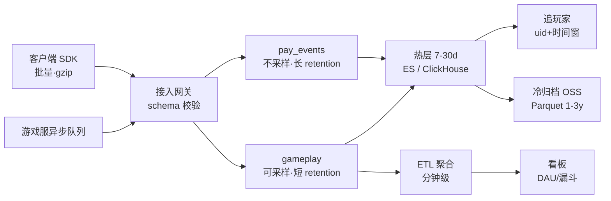
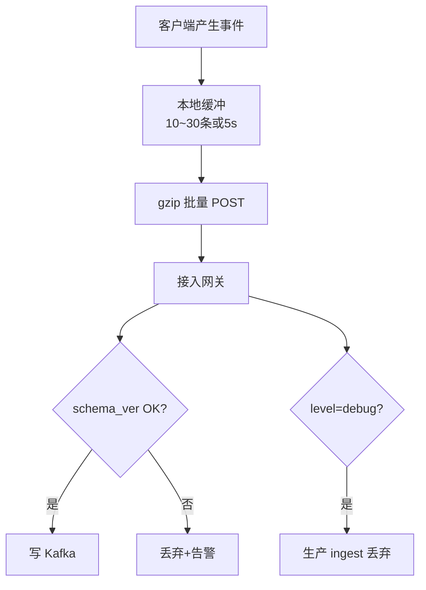
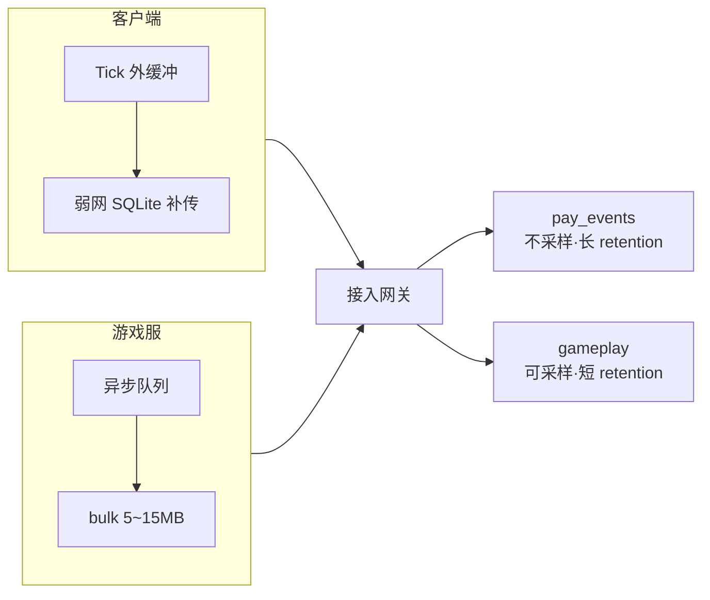
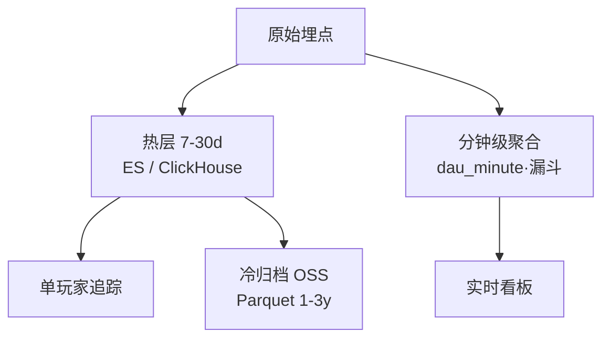
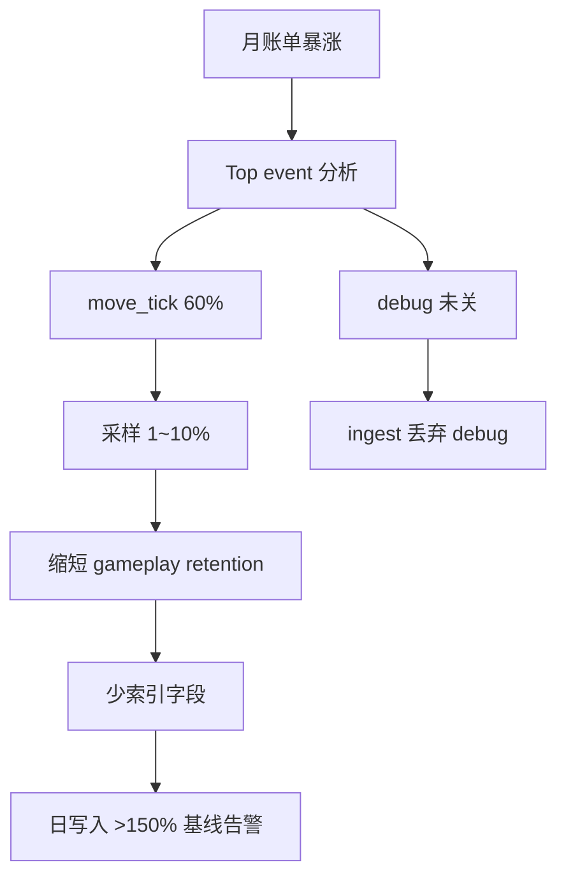
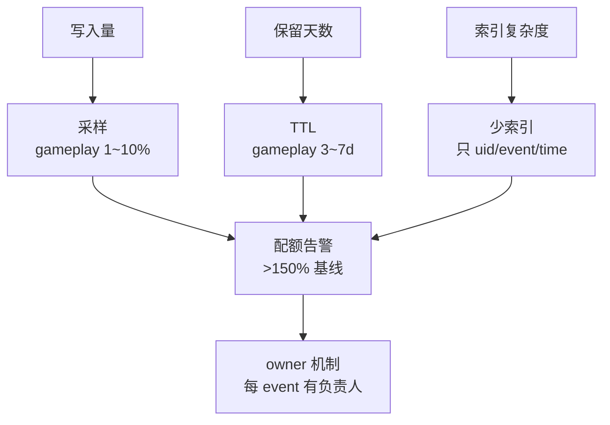
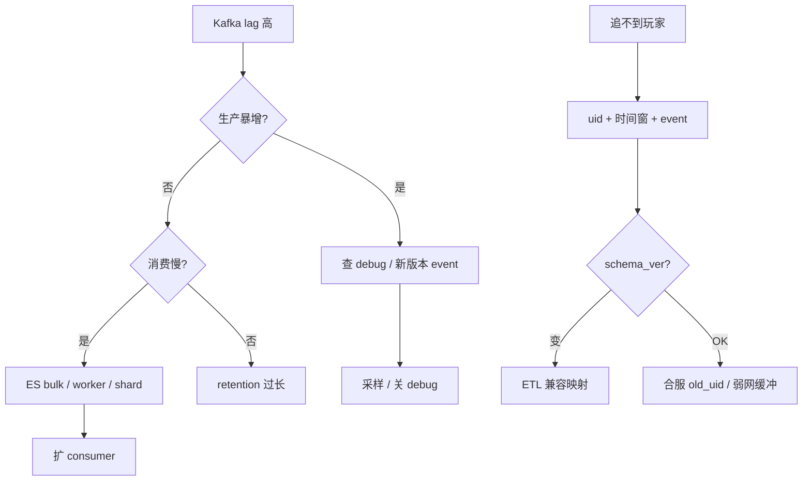

# 游戏日志与埋点链路

> 运营问「这个玩家 14:32 有没有点过充值按钮」，ES 里 0 条——客户端把 `uid` 改成了 `userId`，ETL 全 drop；同时有人把全量 debug 打进 Kafka，账单一个月翻三倍。
> **本章回答**：一条埋点从产生到查询（上报 → 采集 → 入库 → 查询 → 成本），每段格式 / 采样 / retention 怎么约束，追玩家和跑看板为什么分路。
> **不讲**：通用 ELK 底座 → [01-23](../../01-基础底座/23-日志运维/)；监控告警 → [01-22](../../01-基础底座/22-监控与告警/)；可观测 SLO → [13](../13-游戏SRE稳定性/)；支付对账 → [10](../10-充值支付链路保障/)。

**标记**：🎯重点 · 🔥难点 · ⭐常考 · 🔧实操

---

## 一、一张图：埋点日志的一生

> 🎯 **一句话**：SDK 批量上报 → Kafka 分 topic → 热层追玩家 / 聚合跑看板；采样与 TTL 控成本。



- 📖 **读图**
  - 🛤️ 左→右是时间线：SDK / 服异步写，**不能阻塞 Tick**；Kafka 是中枢，积压看 **consumer lag** 不是磁盘
  - 🔀 热层追玩家、聚合跑看板，两路不能混；冷层只供法务/审计批查；监控照 **lag + 配额**

- 🗂️ **三种日志别混**
  - **埋点**（点击、关卡、漏斗）：热 7～30 天 + 冷归档，gameplay 可采样
  - **业务日志**（发货失败、回调异常）：30～90 天，一般不采样
  - **审计日志**（GM、权限变更）：≥1 年，**不可采样**

```text
追玩家 = uid + 时间窗 + event
实时看板走聚合，不走原始全表扫
支付 / 安全 / 审计事件不采样
```

主图装进脑子了。从「上报」开始——schema 与必带字段。

本节对应练习题 Q1、Q14。

---

## 二、上报：schema 与必带字段

> 🎯 **一句话**：每条必须带 `uid / server_id / event / client_time / trace_id / schema_ver`——少一个，ETL 就可能 silently drop。



- 📖 **读图**
  - 没 uid / time → ES 也查不到；`schema_ver` 不匹配 = ETL 静默丢弃
  - `level=debug` 在 ingest 拦截，不进热路径

> 💡 **打个比方**：`schema_ver` 像快递单格式——旧版「收件人」、新版改「姓名」，分拣机还认旧字段，新单直接丢掉。版本号告诉 ETL 按哪套规则分拣。

### 📮 必带字段六条 🎯⭐

- `uid`：追玩家主键
- `server_id`：分服过滤
- `event`：事件类型
- `client_time`：客户端时间（防时钟漂移，见五节）
- `trace_id`：一次会话串联（客户端 UUID）
- `schema_ver`：ETL 路由键

#### ❓ 为什么改个字段名还要升 schema_ver？

- 「改个名而已」是高频错答：ETL 仍认 `uid`，客户端改成 `userId` → **全 drop**，运营查充值点击 = 0 条
- 正确：升 `v1 → v2` + 兼容映射（`v2.userId → uid`），过渡期双版本并存
- 发版前 1h vs 后 1h 对 **event 计数**——暴跌 = schema 不兼容
- 合服额外：双写 `new_uid` + `old_uid`，映射表入库（链 [06](../06-开服合服/)）

### 🔧 现场：发版后 event 计数暴跌

```bash
curl -s 'http://es:9200/game-events-2026.09.01/_search' -H 'Content-Type: application/json' -d '{
  "size": 0,
  "aggs": { "by_event": { "terms": { "field": "event.keyword", "size": 20 } } }
}'
```

```text
"buckets": [
  { "key": "move_tick", "doc_count": 89234120 },
  { "key": "pay_click", "doc_count": 0 }        # ← 从 2万 → 0，字段改名未兼容
]
```

- 🚶 **定责走一遍**
  1. ES：`uid:12345 AND event:pay_click AND @timestamp:[14:30 TO 14:35]` → 0 条
  2. 查 schema：字段改名未升 ver / 无映射 → ETL drop
  3. 修：升 ver + 兼容；发版对账 event 计数
  4. 支付是否成功 → 转订单库（链 [10](../10-充值支付链路保障/)），**不以埋点为准**
  5. 上报 URL 走独立域名 / CDN，勿与战斗 UDP 混端口（链 [12](../12-游戏网络与对抗/)）

> ⚠️ **别混**：**埋点**证「点了按钮」；**订单库**证「扣款成功」——运营问「有没有充值」要分清行为还是钱。

> 📝 **面试**：「埋点必带什么？」——「uid / event / client_time / server_id / trace_id / schema_ver。发版前对 event 计数；debug 不进生产。」

本节对应练习题 Q2、Q9、Q10。

---

## 三、采集传输：批量、背压与 Kafka

> 🎯 **一句话**：客户端 10～30 条或 5s 批量 gzip；服务端异步队列——Tick 里同步 HTTP = 战斗卡顿；积压先看 lag。



- 📖 **读图**
  - 分 topic 分 retention：支付不采样、更长留；gameplay 可采可砍
  - 弱网本地缓冲补传、服异步 bulk——两条路都不进游戏主循环

#### ❓ 为什么 Tick 内不能同步上报？

- 🔥 每帧 `HttpPost(track)` 阻塞 2ms → 战斗 P95 飙高；diff 可能「只加了埋点」
- ✅ Tick 外缓冲 + 异步队列；弱网写 SQLite / 文件，恢复后按 `seq` 补传防重
- 可靠级别不同：**支付 / 安全**不丢不采样、指数退避到成功；**gameplay** 非关键可丢可采

> 💡 **打个比方**：Kafka topic 分 retention 像快递分通道——易碎品（支付）单独留底；普通件（gameplay）可抽检、定期清。混一个通道就没法单独治理。

### 🔍 现场：Kafka 积压

```bash
kafka-consumer-groups.sh --bootstrap-server kafka:9092 \
  --group etl-gameplay --describe
```

```text
TOPIC          PARTITION  CURRENT-OFFSET  LOG-END-OFFSET  LAG
gameplay       0          8923412         10123412        1200000  # ← 消费跟不上
pay_events     0          2341            2345            4        # ← 正常
```

- 🧭 **积压诊断三步**
  1. `--describe` 看 LAG，分清哪个 topic
  2. top event 聚合：生产暴增（debug / 高频 event）还是消费慢（ES shard / bulk worker）
  3. 对症：暴增 → 采样 / 关 debug；消费慢 → 扩 consumer / 优化写入；`pay_events` lag 优先扩，不采样

```properties
# pay_events — 不采样、长保留
retention.ms=7776000000
min.insync.replicas=2

# gameplay — 可采样、短保留
retention.ms=259200000
```

> ⚠️ **别混**：**Kafka 磁盘满** ≠ **生产太多**——先看 lag；可能是 consumer 慢或 retention 过长。盲目砍 retention 会让运营查不到昨天数据。

> 📝 **面试**：「为什么 Tick 内不能同步上报？」——「每帧 HTTP 阻塞 = 性能事故。必须异步批量；支付走可靠通道。」

本节对应练习题 Q3、Q4、Q5、Q12。

---

## 四、入库：热层查玩家，聚合跑看板

> 🎯 **一句话**：热层留 7～30 天原始供追玩家；DAU / 漏斗走 ETL 分钟级聚合——看板不全表扫 raw。



- 📖 **读图**：原始同时走两路——热层存近期原文，聚合表存分钟统计；超窗口走冷层 Parquet 批查。

> 💡 **打个比方**：热层是期刊架（翻某篇文章），聚合是目录（查这个月发了多少篇）。追玩家去期刊架，看 DAU 去目录——拿目录翻原文又慢又漏。

#### ❓ 为什么看板不能直接扫热层明细？⭐

- 「数据都在，COUNT 一下就行」——错。全表扫慢且不准（近似 DISTINCT、超时、打垮集群）
- ✅ ETL 写 `dau_minute`；看板查聚合；追玩家才用 `uid + @timestamp + event`
- 超热层窗口 → OSS Parquet + Presto / Spark，分钟级延迟可接受
- 合服后查 `old_uid` 或映射表 join

### 🔑 ES ILM（gameplay）🔧

```json
{
  "policy": {
    "phases": {
      "hot": { "actions": { "rollover": { "max_size": "50gb", "max_age": "1d" } } },
      "warm": { "min_age": "3d", "actions": { "shrink": { "number_of_shards": 1 } } },
      "delete": { "min_age": "7d" }
    }
  }
}
```

- hot：50GB 或 1d 滚动；warm：3d 后 shrink；delete：7d 删——**审计 index 单独 policy，不配 delete**

### 🔍 现场：追一个玩家

```bash
curl -s 'http://es:9200/game-events-*/_search' -H 'Content-Type: application/json' -d '{
  "query": {
    "bool": {
      "must": [
        { "term": { "uid": "12345" } },
        { "range": { "@timestamp": { "gte": "2026-09-01T14:30:00", "lte": "2026-09-01T15:00:00" } } }
      ]
    }
  },
  "sort": [{ "@timestamp": "asc" }],
  "size": 500
}'
```

```text
# ← 返回该玩家时间窗内事件，按时间排序
# ← 0 条 → 查 schema_ver / 合服 uid / 弱网缓冲
```

> ⚠️ **别混**：**client_time**（客户端）vs **@timestamp**（服务端入库）——SLA 用 ingest 时间；追玩家两者都看，窗放宽 ±10min。

> 📝 **面试**：「追玩家和 DAU 各查哪？」——「追玩家：热层 uid+时间窗+event。看板：ETL 聚合表，不全表扫 raw。」

口诀：**追玩家走热层，看板走聚合，别用明细硬算 DAU**。

本节对应练习题 Q7。

---

## 五、查询：追玩家 vs 看板 vs 合规

> 🎯 **一句话**：运营问「14:32 有没有点充值」——热层查 event；钱转订单库；审计 / GM 独立索引、≥1 年。

### 📋 口述 Runbook 🔧

```text
1. 确认 uid + server_id + 时间窗（客户端/服务器时间）
2. 查热层：event=pay_click OR pay_open
3. 无结果 → schema_ver / 合服 uid
4. 仍无 → 弱网缓冲未上报
5. 支付是否成功 → 转订单库（链 10），不以埋点为准
```

| 查询类型 | 数据源 | 延迟 | 禁止 |
|----------|--------|------|------|
| 单玩家行为 | 热层原始 | 秒级 | 全 cluster 扫 |
| DAU / 漏斗 | 聚合表 | 分钟级 | raw 全表 COUNT |
| GM / 审计 | 审计索引 | 秒级 | 采样 / 7 天删 |
| >30 天历史 | 冷层 Parquet | 分钟～小时 | 热层扩容 |

#### ❓ 为什么 client_time 追玩家会 miss？🔥

- 客户端时钟快 10 分钟 → 按 client_time 精确对齐会 miss
- 弱网补传带 `seq` → 事件**晚到**；运营口中的「14:32」可能是 client_time 不是 ingest
- ✅ 时间窗 ±10min；行为序看 client_time + server `@timestamp` 交叉；SLA / 延迟看板只用 server 时间
- 时钟漂移 >5min 告警；ETL 可修正

- 📊 **漏斗边界** ⭐
  - 注册漏斗 → 聚合表；付费漏斗 → 聚合 + 订单库交叉，**不以埋点定资损**
  - 留存 D1/D7 → 数仓 T+1；单玩家轨迹 → 热层 raw
  - 「今日 DAU」与「T+1 对账」允许差，口径文档化；钱侧以订单 `delivered` 为准

> 🔍 **现场**：event 计数异常（debug 暴增）

```text
"move_tick": 89234120,
"pay_click": 2341,
"debug_dump": 9823412   # ← 新版本 debug 没关
```

> 📝 **面试**：「埋点能代替订单对账吗？」——「不能。埋点证行为；钱以订单库 `delivered` + T+1 为准。」

本节对应练习题 Q6。

---

## 六、成本治理：采样、TTL、配额 🔥

> 🎯 **一句话**：成本 = 写入量 × 保留天数 × 索引复杂度——gameplay 可采 1～10%；支付 / 安全 / 审计**不采样**。



- 📖 **读图**：先找占量事件 → 采样 / 关 debug / 缩 TTL → 配额告警变主动发现。

#### ❓ 为什么 pay / audit 不能采样？

- 「日志越多越好、永久留着」会把账单打穿；但反过来「一律采样」会毁对账与合规
- 支付 / 安全 / 审计 / 漏斗关键节点：**100%**；高频 gameplay（如 `move_tick`）才砍 1～10%
- 控成本砍三因子：采样减写入、TTL 减天数、少索引减复杂度——**不动 pay / audit**

| 事件类 | 采样 | retention |
|--------|------|-----------|
| 支付 / 安全 | 100% | ≥90 天 |
| 审计 / GM | 100% | ≥365 天 |
| 漏斗关键 | 100% | 30 天 |
| gameplay 高频 | 1～10% | 3～7 天 |

- 🚶 **账单从 5 万涨到 15 万**
  1. Top：`move_tick` 占 60%
  2. move 采 10% + 服侧聚合后再报
  3. gameplay retention 7→3 天；audit 保持 365
  4. 只索引 `uid / event / server_id / time`；大 JSON 放 `_source`
  5. 日写入 > 基线 150% → 提采样 + 通知 oncall

### ⚖️ ES vs ClickHouse ⭐

| 维度 | Elasticsearch | ClickHouse |
|------|---------------|------------|
| 追玩家单 uid | 强（倒排） | 强（主键 + 时间） |
| 聚合 DAU / 漏斗 | 贵、慢 | 便宜、快 |
| 全文 / GM 搜 | 强 | 弱 |
| 成本 | 索引重 | 列存省 |

- 常见拆法：gameplay 高频 → CH 聚合 + 采样 raw；审计 / 安全 → ES；支付 → 独立 topic + 长 retention，**旁路对账，不替代订单库**

### 🔒 合规与隐私 🔥

- 不带明文手机号 / 身份证——最小必要，只采行为不采 PII
- 审计 ≥1 年；删号走法务，不是运维直接删 S3
- 出海落区（链 [15](../15-出海与多区域/)）；看板 uid 哈希 / 尾号脱敏

> ⚠️ **别混**：**删日志降成本** vs **删审计违法**——审计独立 bucket，禁止 ILM delete。删号 ≠ 运维删日志。

### 🔧 Filebeat 与 SDK 分工

- 游戏服**业务日志**走 filebeat → Kafka；**客户端埋点**分 topic——混一起 ETL 打架
- 禁止战斗 Tick 写 filebeat——异步队列

```text
/var/log/game/pay-callback.log  → topic: biz_pay
/var/log/game/battle.log        → topic: biz_battle（可采样）
客户端 SDK                        → topic: gameplay / pay_events
Nginx access log                 → topic: nginx_access（非埋点，链 01-23）
```

### 📘 埋点字典与发版对账 ⭐

```text
□ schema_ver 变更说明
□ 新旧 event 计数（发版前 1h vs 后 1h）
□ debug 开关关闭
□ 支付 event 100% 采样
□ Kafka retention 未误改
```

- 每个 `event` 有 **owner**；新增必须进字典（名 / schema / owner / 采样 / retention），否则 ingest 拒绝

### ❄️ 冷层与合规留存

```text
热层 7～30d：追玩家 · ES / ClickHouse
冷层 OSS Parquet 1～3y：法务 / 审计批查 · Presto / Spark
删号：走法务 · 非运维直接删 S3
出海：日志落区（链 15）
```

- 砍 gameplay retention 需运营 + 数据审批；审计冷层与 gameplay 分 bucket；导出轨迹走客服工单

### 收束：埋点链路凭什么控住成本



- 📖 **读图**：采样 / TTL / 少索引三轴 → 配额 + owner，从救火变主动。

```text
落地五步（跳步留坑）：
1. 埋点字典（event + schema + owner）
2. SDK 批量异步 + 服队列
3. Kafka 分 topic + ETL + 热冷分层
4. 追玩家 Runbook（uid + 时间窗）
5. 成本配额 + 采样策略评审（季度）
```

> ⚠️ **别混**：控成本 ≠ 删审计——采样和 TTL 只管 gameplay；支付 / 审计 / 安全 100% 不动。另：**关日志治卡顿** vs **降采样控成本**——卡顿查 Tick 同步埋点，不是关全站日志。

> 📝 **面试**：「日志打爆成本，先砍谁？」——「move_tick 采样；不动 pay / audit；top event 再动 retention。记忆：采样 → TTL → 少索引 → 配额 → owner。」

本节对应练习题 Q8、Q11。

---

## 七、作战：追不到 / 积压 / 成本爆定责

> 🎯 **一句话**：追不到先查 uid + 时间窗 + schema；积压先看 lag；DAU 不对查 ETL 延迟，不是加 ES 节点。



- 📖 **读图**：左树治积压（生产暴增 vs 消费慢）；右树治追不到（schema → 合服 / 弱网）。共同前提：uid + 时间窗 + event。

| 现象 | 先做 | 别做 |
|------|------|------|
| 追不到玩家 | uid + 时间窗 + event | 全 cluster 扫 |
| Kafka 磁盘 85% | lag + top event | 盲目砍 / 扩 retention |
| DAU 看板差 20% | ETL 延迟 / 聚合 | 加 ES 节点 |
| 战斗卡顿 | 查 Tick 内同步埋点 | 关所有日志 |
| 成本翻三倍 | top event + 采样 | 删审计日志 |
| 合服后查不到 | old_uid / 映射 | 只查 new uid |
| 弱网丢埋点 | 客户端缓冲 seq | 认为没发生 |

### 60 秒剧本 🔧

```text
0–10s  问清：追玩家 vs 看板 vs 成本；要 uid+时间窗+event
10–30s 热层 ES；无结果查 schema_ver / 合服映射
30–45s 全局 lag：consumer-groups --describe + top event
45–60s 定责：schema / 缓冲 / ETL / retention；支付转订单库（10）
```

### 值班场景速查 ⭐

- 「14:32 有没有点充值」→ 热层 uid + 时间窗 + event（五）
- 「Kafka 磁盘 85%」→ consumer lag（三）
- 「DAU 差 20%」→ ETL 聚合延迟（四）
- 「战斗卡了加了埋点」→ Tick 同步上报（三）
- 「ES 账单翻三倍」→ top event + 采样（六）
- 「合服后查不到历史」→ old_uid（二）
- 「能证明充成功吗」→ 订单库 10（二）

本节对应练习题 Q13。

---

## 八、收口

### 命令速查 🔧

```bash
# 追玩家
curl -s 'http://es:9200/game-events-*/_search' -H 'Content-Type: application/json' -d '{
  "query": {"bool": {"must": [
    {"term": {"uid": "12345"}},
    {"range": {"@timestamp": {"gte": "2026-09-01T14:30:00", "lte": "2026-09-01T15:00:00"}}}
  ]}},
  "sort": [{"@timestamp": "asc"}], "size": 500
}'

# Kafka lag
kafka-consumer-groups.sh --bootstrap-server kafka:9092 \
  --group etl-gameplay --describe

# event 计数 Top
curl -s 'http://es:9200/game-events-2026.09.01/_search' -H 'Content-Type: application/json' -d '{
  "size": 0,
  "aggs": {"by_event": {"terms": {"field": "event.keyword", "size": 20}}}
}'
```

### 面试锚点

遮住右列自问自答；能讲出来才算会。

| 问 | 30 秒答 |
|----|---------|
| 埋点一生哪几段？ | 上报 → 采集 → 传输 → 入库 → 查询 → 成本。 |
| 必带字段？ | uid / server_id / event / client_time / trace_id / schema_ver。 |
| Tick 内能同步上报吗？ | 不能；异步批量，否则 P95 飙。 |
| Kafka 积压先看什么？ | consumer lag，不是磁盘。 |
| 追玩家怎么查？ | 热层 uid + 时间窗 + event。 |
| 看板 DAU 怎么查？ | ETL 聚合表，不全表扫 raw。 |
| 哪些不能采样？ | 支付、安全、审计、GM。 |
| 埋点 vs 订单？ | 埋点证行为；钱以订单库为准。 |
| 成本三板斧？ | 采样、TTL、少索引。 |
| debug 进生产？ | ingest 丢弃；发版前对 event 计数。 |
| ES vs ClickHouse？ | CH 擅聚合省成本；ES 擅检索 / 审计。 |
| 审计日志能 7 天删？ | 不能，≥1 年、不采样、独立 bucket。 |

### 易错一句话对照

- 追玩家全表扫 ES → uid + 时间窗
- 看板直接查原始 → 走聚合表
- Tick 内同步上报 → 异步批量
- 支付埋点可以采样 → 100% 不采样
- Kafka 磁盘满 = 生产太多 → 先看 lag
- retention 随便砍 → 先通知运营
- 埋点能代替对账 → 订单库为准
- debug 进生产 → ingest 丢弃
- 审计日志 7 天删 → ≥1 年
- 关日志治卡顿 → 查 Tick 同步上报
- 客户端时钟准 → client_time 漂移 ±10min
- 业务日志和埋点一个 topic → 分 topic

### 数字墙

> 热层 **7～30 天** · gameplay 采样 **1～10%** · 批量 **10～30 条或 5s** · audit **≥365 天** · 成本告警 **>150% 基线** · bulk **5～15 MB** · pay retention **≥90 天** · gameplay retention **3～7 天** · ETL 聚合 **分钟级** · 弱网缓冲 **seq 防重** · 时钟漂移告警 **>5min**

---

## 合上书

卡住的那一条，回到对应小节再听一遍：

- [ ] **默画**主图：上报 → 采集 → Kafka → 入库 → 查询 / 成本，标出热层和聚合表两路分叉
- [ ] 三种日志（埋点 / 业务 / 审计）的保留与采样差异
- [ ] **必带字段**六条；为什么改字段名要升 `schema_ver`
- [ ] 为什么 **Tick 内不能同步上报**；弱网缓冲怎么做（SQLite + seq）
- [ ] **Kafka lag** vs **磁盘满**；分 topic 怎么分 retention
- [ ] **追玩家** vs **DAU 看板**各查哪层；为什么不能混
- [ ] **成本治理三板斧**；哪些事件不能采样
- [ ] 运营问「有没有点充值」**五步 Runbook**；和订单库的关系
- [ ] **合服后 uid 变了**怎么追历史（old_uid / 映射表）
- [ ] **debug 暴增**怎么认、怎么止血
- [ ] **砍 retention** 为什么要先通知运营
- [ ] **ES vs ClickHouse** 怎么拆；审计为什么不能 7 天删

终极测试：十分钟讲清开篇现场——错在哪、正确第一刀是什么。讲得下来，这章才算过关。
