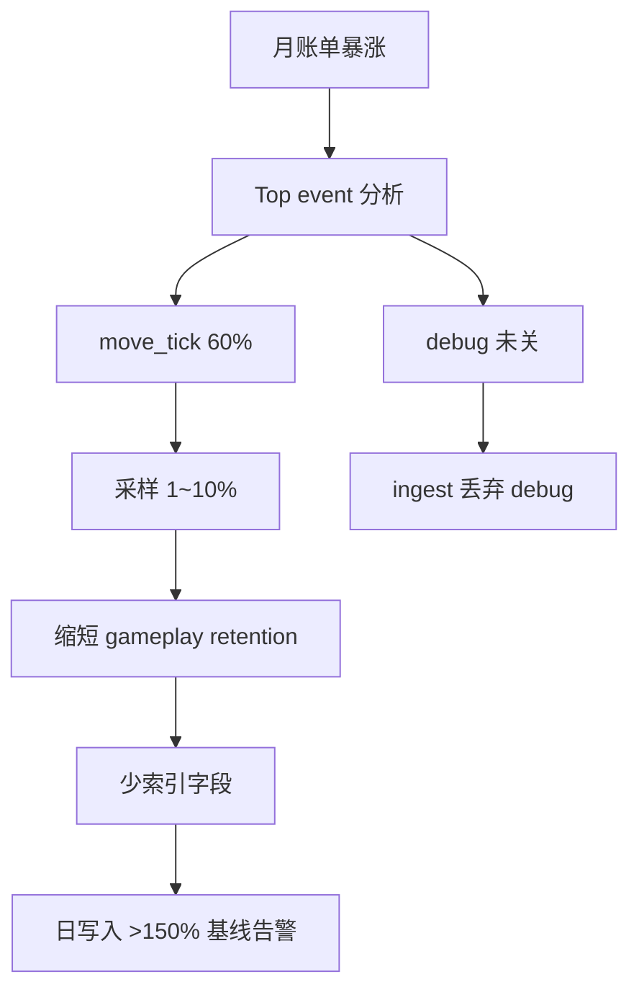
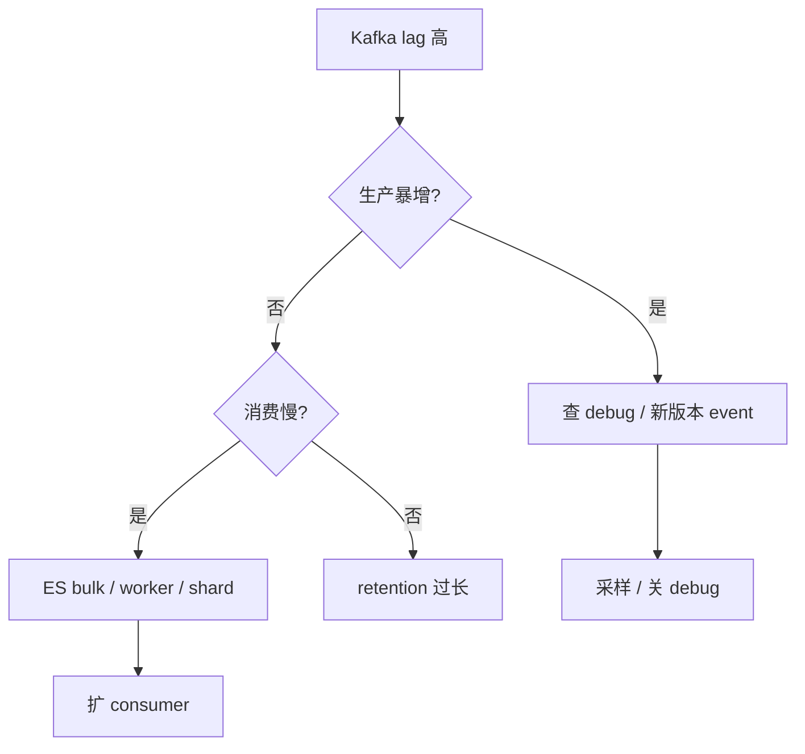
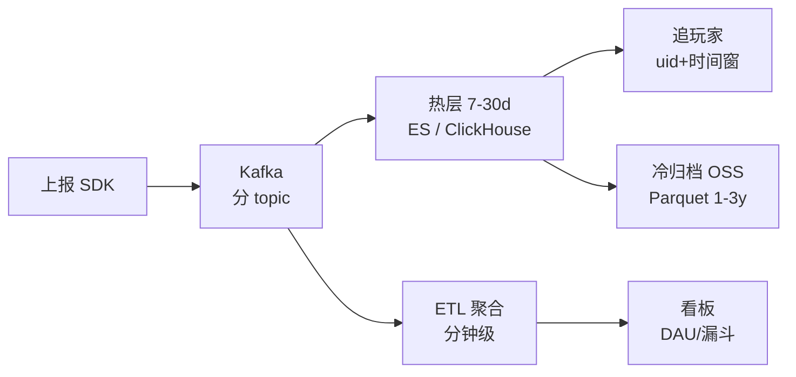

# 11｜游戏日志与埋点链路 · 练习题

开始做题前，先给大家一个小建议：合上知识点，对着**第一节的主图**，把「埋点日志的一生」——上报→Kafka→热层/聚合→追玩家/看板——口述一遍。能顺下来，下面这些题你会发现大半都会了；卡壳的地方，就是你该回去重读的那一节。

做题的方式也建议改一下：每道题**先看标题和场景，自己口述一遍答案，再往下看「完整解答」对答案**。直接看解答，容易产生「我会了」的错觉——能讲出来才是真的会。

| 标记 | 含义 |
|------|------|
| **核心** | 不懂整章就没建立起来 |
| **必会** | 值班和面试都要能讲 |
| **常用** | 线上会反复碰到 |
| **常考** | 白板和追问的高频口径 |

题目的顺序也是有意排的：Q1～Q5 先钉三类日志与采集；Q6～Q10 讲查询、成本与订单库边界；Q11～Q14 收尾到审计、debug 暴增与白板。

## 本题目录

- [Q1 三种日志别混](#q1)
- [Q2 必带字段与 schema](#q2)
- [Q3 Tick 内不能同步上报](#q3)
- [Q4 Kafka lag vs 磁盘](#q4)
- [Q5 分 topic 与 retention](#q5)
- [Q6 追玩家怎么查](#q6)
- [Q7 看板 DAU 为什么不对](#q7)
- [Q8 成本治理三板斧](#q8)
- [Q9 埋点 vs 订单库](#q9)
- [Q10 合服后追历史](#q10)
- [Q11 审计日志能删吗](#q11)
- [Q12 debug 暴增](#q12)
- [Q13 60 秒日志积压](#q13)
- [Q14 白板综合题](#q14)
- [合上书](#合上书)

---

## Q1

**★★★★★｜埋点、业务日志、审计日志差在哪？**

**覆盖**：核心 · 必会 ｜ **对应**：知识点 [一、一张图：埋点日志的一生](知识点.md)

### 场景

成本砍减，有人提议「审计也采样 10%、保留 7 天」。

先自己试试：不看下面，先口述一遍你的答案，再往下对。

### 完整解答

> 🎯 **一句话**：**埋点**（点击 / 漏斗 / 关卡）热 7～30 天可采样；**业务日志**（发货失败 / 回调异常）30～90 天一般不采样；**审计**（GM / 权限变更）≥1 年**不采样**。

| 类型 | 采样 | retention |
|------|------|-----------|
| gameplay 埋点 | 1～10% | 3～7d |
| 支付 / 安全 | 100% | ≥90d |
| 审计 / GM | 100% | ≥365d |

> ⚠️ **别混**：业务日志（filebeat → Kafka）和客户端埋点（SDK → Kafka）走不同 topic，混一起 ETL 规则打架。

> 📝 **面试**：「三种日志各保留多久？」——「埋点 7～30d 可采样；业务 30～90d 一般不采样；审计 ≥1 年不采样。」

### 再追问

**业务日志和埋点能一个 topic 吗？**——不能，ETL 规则打架，应分 topic（biz_pay / biz_battle vs gameplay / pay_events）。

---

## Q2

schema 与必带字段——改名即事故。

**★★★★★｜发版后 pay_click 从 2 万变 0，为什么？**

**覆盖**：核心 · 必会 · 常考 ｜ **对应**：知识点 [二、上报：schema 与必带字段](知识点.md)

### 场景

客户端把 `uid` 改成 `userId`，ETL 未更新。

先自己试试：不看下面，先口述一遍你的答案，再往下对。

### 完整解答

> 🎯 **一句话**：**schema_ver** 变更要兼容映射；发版前对 **event 计数**；必带 uid / event / client_time / server_id / trace_id / schema_ver。

客户端字段改名后 ETL 仍认旧字段 → 静默丢弃（silently drop），不报错但数据没了。正确做法：升 schema_ver 到 v2 + ETL 兼容映射；发版 Runbook 含新旧 event 计数对比（发版前 1h vs 后 1h）。

> 🔍 **现场**：查 event 计数

```bash
curl -s 'http://es:9200/game-events-2026.09.01/_search' -H 'Content-Type: application/json' -d '{
  "size": 0,
  "aggs": {"by_event": {"terms": {"field": "event.keyword", "size": 20}}}
}'
```

```text
"pay_click": 0      ← 从 2万 → 0，schema 字段改名未兼容
```

> ⚠️ **别混**：silently drop 比报错更坑——报错会立刻发现，静默丢可能好几天没人知道。要对账计数。

> 📝 **面试**：「埋点必带什么？为什么 schema 要版本号？」——「六字段：uid / event / client_time / server_id / trace_id / schema_ver。版本号让 ETL 知道按哪套规则路由，不匹配就静默丢弃。」

### 再追问

**client_time 和 @timestamp 以谁为准？**——追行为序看 client_time 排序 + server ingest 校验；SLA / 延迟看板看 server @timestamp。时钟漂移 >5min 告警。

---

## Q3

Tick 内不能同步上报。

**★★★★★｜版本日战斗 P95 飙高，diff 只有「加了埋点」，根因？**

**覆盖**：必会 · 常用 · 🔧 ｜ **对应**：知识点 [三、采集传输：批量、背压与 Kafka](知识点.md)

### 场景

战斗 Tick 内 `HttpPost(track)` 每帧阻塞 2ms。

先自己试试：不看下面，先口述一遍你的答案，再往下对。

### 完整解答

> 🎯 **一句话**：**Tick 内同步 HTTP** = 性能事故；改**异步队列 + 批量 gzip**（5～30 条或 5s）。

客户端 10～30 条或 5s 批量 gzip POST，服务端走异步队列 bulk 5～15MB。支付 / 安全事件走可靠通道不采样，非关键埋点失败重试指数退避，超过 N 次可丢弃。

> 💡 **打个比方**：Tick 里同步上报就像每帧都停下手里的活去寄快递——一帧 2ms，60 帧就是 120ms 延迟，玩家手感直接卡。改成攒一批下班一起寄，就不卡了。

> 📝 **面试**：「为什么 Tick 内不能同步上报？」——「每帧 HTTP 阻塞 = 性能事故。必须异步批量；支付事件走可靠通道。」

### 再追问

**弱网丢埋点怎么办？**——客户端 SQLite / 文件缓冲，恢复网络后补传，带 `seq` 防重。不要认为弱网时玩家「没发生」行为。

---

## Q4

Kafka lag vs 磁盘怎么分。

**★★★★★｜Kafka 磁盘 85%，先看什么？**

**覆盖**：核心 · 必会 ｜ **对应**：知识点 [三、采集传输：批量、背压与 Kafka](知识点.md)

### 场景

运维要「把 retention 从 7 天砍 1 天」立刻止血。

先自己试试：不看下面，先口述一遍你的答案，再往下对。

### 完整解答

> 🎯 **一句话**：先看 **consumer lag**——lag 高 = 消费慢或生产暴增；不是盲目砍 retention（要先通知运营）。

```bash
kafka-consumer-groups.sh --bootstrap-server kafka:9092 \
  --group etl-gameplay --describe
```

```text
TOPIC          PARTITION  CURRENT-OFFSET  LOG-END-OFFSET  LAG
gameplay       0          8923412         10123412        1200000  ← 消费跟不上
pay_events     0          2341            2345            4        ← 正常
```

> 💡 **打个比方**：Kafka 磁盘满就像仓库堆满货——不是生产太多，是收货台（consumer）处理不过来。看 lag 就是看收货台排了多少单。

> ⚠️ **别混**：**Kafka 磁盘满** ≠ **生产太多**——可能是 consumer 慢（ES shard 过多）或 retention 过长。盲目砍 retention 会让运营查不到昨天数据。

### 再追问

**lag 低但磁盘高？**——retention 过长或副本多；分 topic 治理，gameplay 缩 retention，pay 不动。

---

## Q5

分 topic 与 retention。

**★★★★★｜pay_events 和 gameplay 为什么要分 topic？**

**覆盖**：必会 · 常考 ｜ **对应**：知识点 [三、采集传输：批量、背压与 Kafka](知识点.md)

### 场景

一个 topic 全塞，成本砍 retention 后运营「昨天 pay_click 查不到」。

先自己试试：不看下面，先口述一遍你的答案，再往下对。

### 完整解答

> 🎯 **一句话**：**pay_events** 不采样、长 retention；**gameplay** 可采样、短 retention——混一起无法单独治理。

```properties
# pay_events — 不采样、长保留
retention.ms=7776000000
min.insync.replicas=2

# gameplay — 可采样、短保留
retention.ms=259200000
```

> 📝 **面试**：「分 topic 怎么分？」——「pay_events 不采样长保留；gameplay 可采样短保留；业务日志（filebeat）单独 topic。Nginx access log 也独立 topic。」

### 再追问

**支付埋点能采样吗？**——不能，100%。支付事件走独立 topic + 长 retention，进对账旁路而非替代订单库。

---

## Q6

追玩家走热层。

**★★★★★｜运营问「14:32 有没有点充值按钮」，你怎么答？**

**覆盖**：核心 · 必会 · 🔧 ｜ **对应**：知识点 [五、查询：追玩家 vs 看板 vs 合规](知识点.md)

### 场景

有人要「全 cluster 扫 pay 关键字」。

先自己试试：不看下面，先口述一遍你的答案，再往下对。

### 完整解答

> 🎯 **一句话**：**uid + server_id + 时间窗 + event=pay_click/pay_open** 查热层；无结果查 schema / 合服 / 弱网缓冲；支付成功与否 → **订单库**（链 [10](../10-充值支付链路保障/)），不以埋点为准。

口述 Runbook 五步：

```text
1. 确认 uid + server_id + 时间窗
2. 查热层：event=pay_click OR pay_open
3. 无结果 → 查 schema_ver / 合服 uid 变更
4. 仍无 → 查弱网缓冲未上报
5. 支付是否成功 → 转订单库，不以埋点为准
```

```bash
# ES: uid + @timestamp range + event
curl -s 'http://es:9200/game-events-*/_search' -H 'Content-Type: application/json' -d '{
  "query": {"bool": {"must": [
    {"term": {"uid": "12345"}},
    {"range": {"@timestamp": {"gte": "2026-09-01T14:30:00", "lte": "2026-09-01T15:00:00"}}}
  ]}},
  "sort": [{"@timestamp": "asc"}], "size": 500
}'
```

> ⚠️ **别混**：追玩家走热层原始（秒级），看板走聚合表（分钟级），>30 天走冷层 Parquet——不要全 cluster 扫。

### 再追问

**热层查不到、事件 8 天前？**——冷层 OSS Parquet + Presto / Spark 批查。弱网补传可能导致事件晚到，时间窗放宽 ±10min。

---

## Q7

看板 DAU 为什么不能扫明细。

**★★★★★｜实时 DAU 比 T+1 数仓低 20%，加 ES 节点对吗？**

**覆盖**：必会 · 常考 ｜ **对应**：知识点 [四、入库：热层查玩家，聚合跑看板](知识点.md)

### 场景

看板 SQL `SELECT COUNT(DISTINCT uid) FROM raw_events` 扫原始。

先自己试试：不看下面，先口述一遍你的答案，再往下对。

### 完整解答

> 🎯 **一句话**：看板应查 **ETL 聚合表**（`dau_minute`）；raw 全表扫慢且不准——先查 **ETL 延迟**，不是加节点。

> 💡 **打个比方**：热层是期刊架（查具体哪篇文章），聚合表是目录索引（查这个月发了多少篇）。拿目录翻原文又慢又漏——看 DAU 去目录查统计，追玩家去期刊架翻原文，两路分开。

追玩家查热层 raw（uid + 时间窗 + event，秒级）；看板查 ETL 聚合表（分钟级）。实时看板写「今日 DAU」、财务写「T+1 对账」——两个数允许差，但要文档化口径。

> ⚠️ **别混**：实时 DAU 和 T+1 对账数差是正常的（口径不同），但不文档化就是事故。

### 再追问

**两个 DAU 允许差吗？**——允许，但口径要文档化（实时 vs T+1）。不要加 ES 节点解决 ETL 延迟问题。

---

## Q8

成本治理三板斧。

**★★★★★｜ES 月账单 5 万→15 万，三板斧是什么？**

**覆盖**：必会 · 常用 ｜ **对应**：知识点 [六、成本治理：采样、TTL、配额](知识点.md)

### 场景

top event：`move_tick` 占 60%，每帧上报。

先自己试试：不看下面，先口述一遍你的答案，再往下对。

### 完整解答

> 🎯 **一句话**：**采样**（move 1～10%）、**TTL**（gameplay 缩短 7→3d）、**少索引**（只索引 uid / event / time）——不动支付 / 审计。



日写入 >150% 基线 → 自动提采样 + 通知 oncall。owner 机制：每个 event 有负责人，成本暴涨时先找 owner 而不是关集群。

> 📝 **面试**：「成本治理三板斧？」——「采样、TTL、少索引。先砍 move_tick，不动 pay / audit。记忆分组：采样 → TTL → 少索引 → 配额 → owner。」

### 再追问

**战斗卡顿能关所有日志吗？**——查 Tick 内同步上报改异步，不是关所有日志。审计日志不能关。

---

## Q9

埋点 vs 订单库——别混权威。

**★★★★★｜埋点能证明玩家充成功吗？**

**覆盖**：必会 · 常考 ｜ **对应**：知识点 [二、上报：schema 与必带字段](知识点.md) · 链 [10](../10-充值支付链路保障/)

### 场景

运营说「埋点有 pay_success，不用查订单」。

先自己试试：不看下面，先口述一遍你的答案，再往下对。

### 完整解答

> 🎯 **一句话**：埋点证**行为**；**钱**以订单库 `delivered` 终态 + T+1 对账为准。

客户端伪造 / 丢单 / 发货积压都会导致埋点与订单不一致。`pay_success` 埋点辅助排查但不替代对账。

> ⚠️ **别混**：**埋点**能证明「点了按钮 / 发了请求」；**订单库**才能证明「扣款成功 / 货发出去」——运营问「有没有充值」要分清楚是问行为还是问钱。

> 📝 **面试**：「埋点能代替订单对账吗？」——「不能。埋点证明行为；钱以订单库 `delivered` 终态 + T+1 对账为准。」

### 再追问

**pay_success 埋点还要 100% 吗？**——要，辅助排查，不替代对账。支付事件不采样、长 retention。

---

## Q10

合服后追历史靠映射。

**★★★★★｜合服后 uid 变了，怎么追 30 天前行为？**

**覆盖**：常用 ｜ **对应**：知识点 [二、上报：schema 与必带字段](知识点.md) · 链 [06](../06-开服合服/)

### 场景

只查 new_uid，热层 0 条。

先自己试试：不看下面，先口述一遍你的答案，再往下对。

### 完整解答

> 🎯 **一句话**：埋点带 **old_uid / old_server_id** 或 join **映射表**；发版规范应合服起双写。

合服后新埋点写 `new_uid` + 可选 `old_uid / old_server_id`，追历史时查 old_uid 字段或 join 映射表。时间窗放宽 ±10min（弱网补传可能晚到）。

> ⚠️ **别混**：只查 new_uid 查不到历史——合服前的埋点带的是 old_uid。

### 再追问

**映射表丢了？**——停修，从备份恢复。合服发版必须含 uid 映射校验。

---

## Q11

审计日志能不能删。

**★★★★★｜审计日志 ILM delete 7 天合规吗？**

**覆盖**：必会 · 常考 ｜ **对应**：知识点 [六、成本治理：采样、TTL、配额](知识点.md)

### 场景

ILM 统一 7 天 delete 所有 index。

先自己试试：不看下面，先口述一遍你的答案，再往下对。

### 完整解答

> 🎯 **一句话**：**审计 ≥1 年、不采样**——独立 index / bucket，禁止与 gameplay 同 ILM。

GM 操作、权限变更必须可追溯。审计索引单独 bucket，禁止 ILM delete。埋点不带明文身份证 / 手机号（最小必要），展示 uid 哈希 / 尾号脱敏。

> ⚠️ **别混**：**删日志降成本** vs **删审计违法**——删 gameplay index 可以，删 audit index 不行。出海日志还要考虑落区（链 [15](../15-出海与多区域/)）。

> 📝 **面试**：「审计日志能 7 天删吗？」——「不能，≥1 年、不采样、独立 bucket。删号请求走法务，不是运维直接删 S3。」

### 再追问

**脱敏要求？**——埋点不带明文身份证 / 手机号；展示 uid 尾号。跨境日志落区。

---

## Q12

开头那个 debug 暴增现场。

**★★★★★｜event 聚合里 debug_dump 900 万，怎么办？**

**覆盖**：常用 · 🔧 ｜ **对应**：知识点 [三、采集传输：批量、背压与 Kafka](知识点.md)

### 场景

新版本 debug 开关默认 on。

先自己试试：不看下面，先口述一遍你的答案，再往下对。

### 完整解答

> 🎯 **一句话**：ingest **丢弃 level=debug** + 发版 hotfix 关开关 + 临时提 gameplay 采样——不是删 pay topic。

```text
"move_tick": 89234120,
"pay_click": 2341,
"debug_dump": 9823412   ← 新版本 debug 没关
```

发版 Runbook 必含 event 计数对比（发版前 1h vs 后 1h）和 debug 开关确认。

> 📝 **面试**：「debug 暴增怎么止血？」——「ingest 丢弃 level=debug + hotfix 关开关 + 提 gameplay 采样。不动 pay topic。」

### 再追问

**已进 ES 的 debug 能删 index 吗？**——可以删 gameplay index；别误删 audit。debug 不进生产热路径是第一道防线。

---

## Q13

60 秒日志积压定责。

**★★★★★｜60 秒：Kafka lag 1200 万 + 磁盘 85%。**

**覆盖**：核心 · 必会 · 🔧 ｜ **对应**：知识点 [七、作战：追不到 / 积压 / 成本爆定责](知识点.md)

### 场景

有人要立刻扩 3 倍 ES 集群。

先自己试试：不看下面，先口述一遍你的答案，再往下对。

### 完整解答

> 🎯 **一句话**：**lag → top event → 消费慢还是生产暴增**；debug / 暴增则采样；消费慢则 bulk / shard / consumer。

```text
0–10s  consumer-groups --describe        ← 看 lag 分到哪个 topic
10–30s ES top event 聚合               ← 找暴增 event
30–45s 是否新版本 debug 开关没关        ← 生产暴增查发版 diff
45–60s 止血：采样 / 扩 worker           ← 勿先砍 pay retention
```



> ⚠️ **别混**：不要先扩 ES 集群——先分清生产暴增还是消费慢，再对症下药。

### 再追问

**pay_events lag 也 1200 万？**——优先扩 consumer，支付不采样。gameplay 可以临时提采样，pay 不行。

---

## Q14

白板把前面串起来。

**★★★★★｜白板：画埋点一生 + 热冷分层 + 两路查询。**

**覆盖**：核心 · 常考 ｜ **对应**：知识点 [一、一张图：埋点日志的一生](知识点.md)

### 场景

终面：「日志成本翻倍你怎么查？」

先自己试试：不看下面，先口述一遍你的答案，再往下对。

### 完整解答

> 🎯 **一句话**：**SDK 批量 → Kafka 分 topic → 热层 raw / 聚合看板 → 采样 + TTL 控成本**。



> 📝 **面试**：支付 / 审计不采样；埋点不替订单。ES 擅检索 / 审计，ClickHouse 擅聚合省成本。成本三板斧：采样 → TTL → 少索引。

### 再追问

**ES vs ClickHouse 怎么拆？**——ClickHouse 擅聚合省成本（gameplay 高频）；ES 擅检索 / 审计（全文搜、GM 操作）。支付事件走独立 topic + 长 retention，进对账旁路。

---

## 合上书

学到这里，先别急着翻下一章。合上书，试试下面这几件事能不能做到——能做到，这章才算真的听懂了。卡住的那一条，就回到对应的小节再听一遍：

- [ ] **默画**主图：上报 → 采集 → Kafka → 入库 → 查询 / 成本，标出热层和聚合表两路分叉。
- [ ] 三种日志（埋点 / 业务 / 审计）的**保留与采样**差异。
- [ ] **必带字段**六条；schema_ver 变更为什么要版本号。
- [ ] 为什么 **Tick 内不能同步上报**；弱网缓冲怎么做（SQLite + seq）。
- [ ] **Kafka lag** vs **磁盘满**；分 topic 怎么分 retention。
- [ ] **追玩家** vs **DAU 看板**各查哪层；为什么不能混。
- [ ] **成本治理三板斧**；哪些事件不能采样。
- [ ] 运营问「有没有点充值」**五步 Runbook**；和订单库的关系。
- [ ] **合服后 uid 变了**怎么追历史（old_uid / 映射表）。
- [ ] **debug 暴增**怎么认、怎么止血。
- [ ] **砍 retention** 为什么要先通知运营。
- [ ] **ES vs ClickHouse** 怎么拆；审计为什么不能 7 天删。
