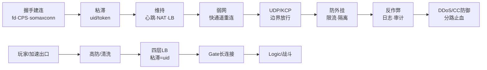
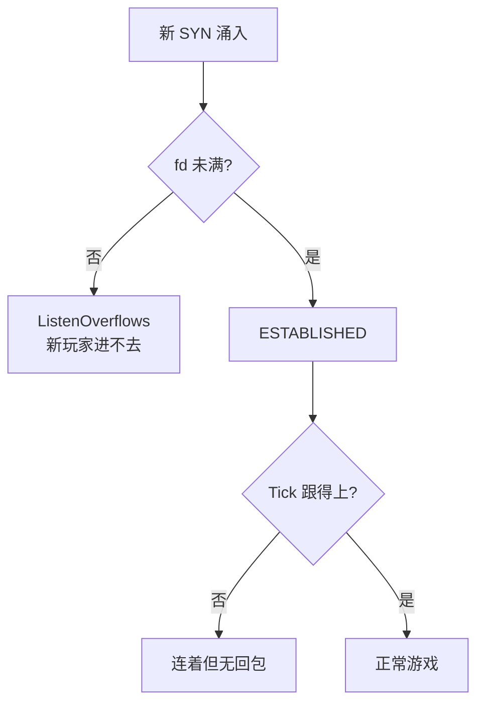
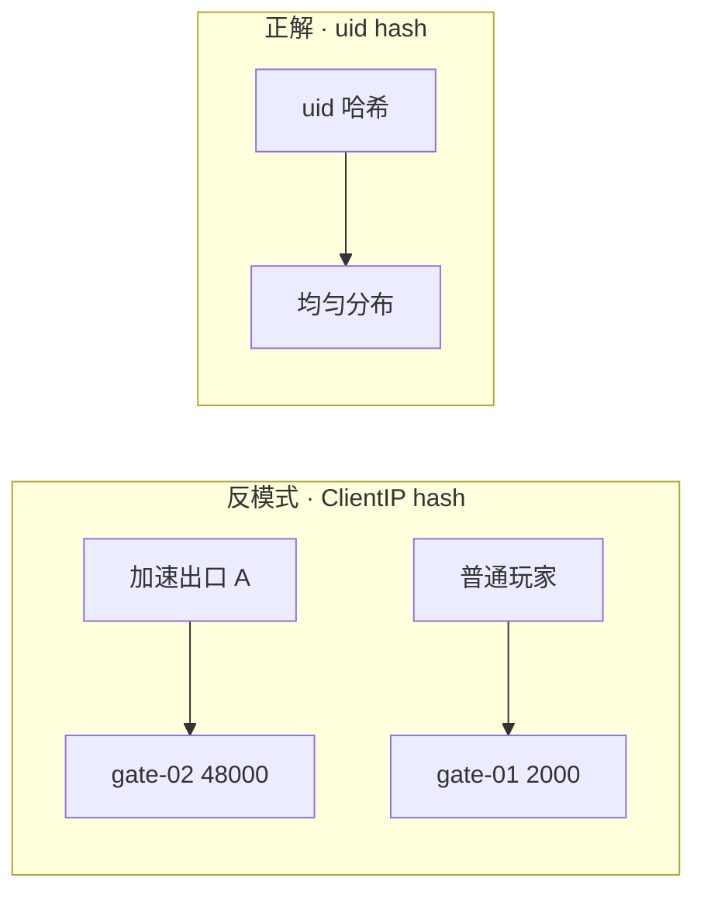
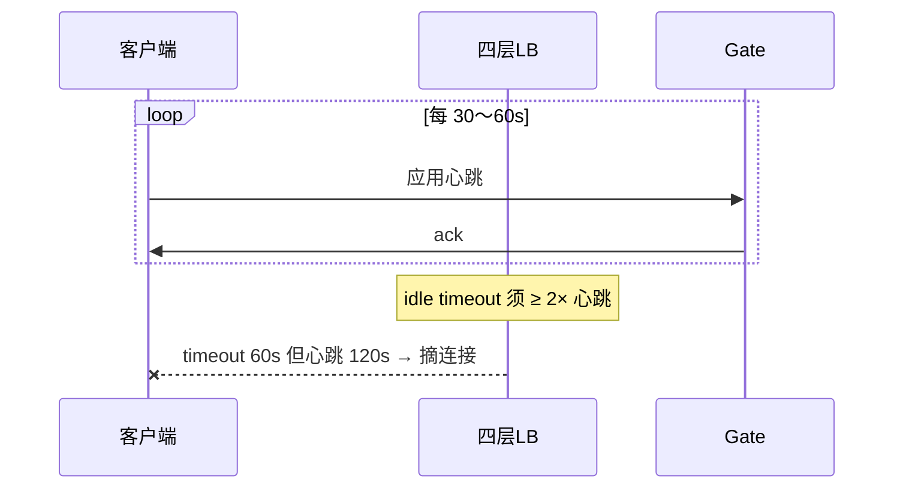
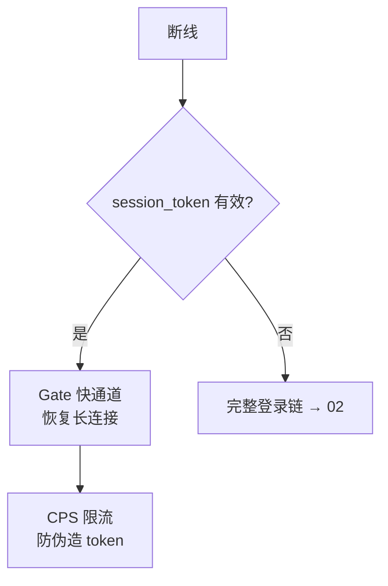
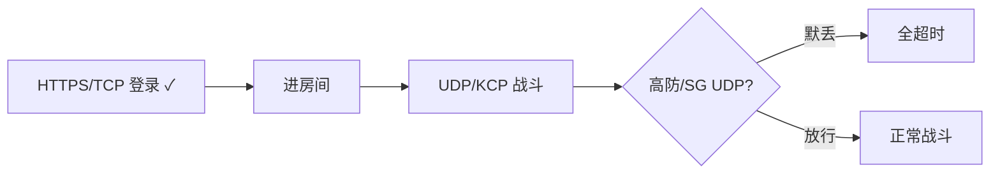
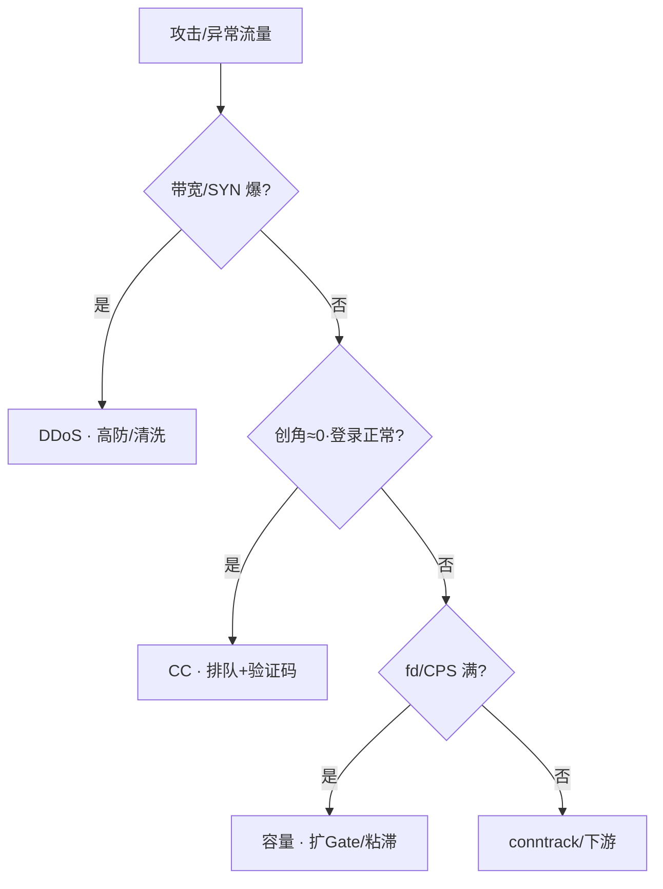
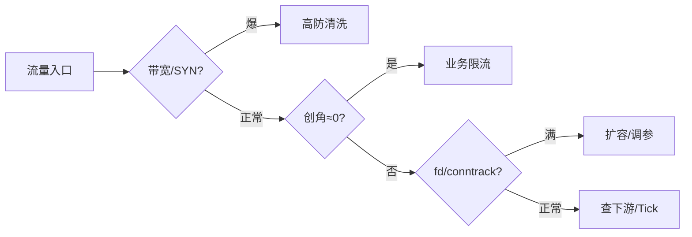
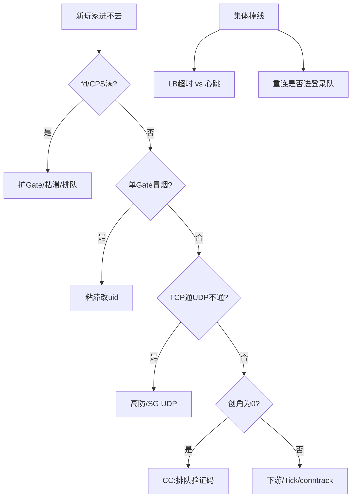

# 游戏网络与对抗

> 大家好，欢迎来到这次分享。开讲之前，先带大家回到一个现场：
> 开服只有一台 Gate 冒烟，其余空转。带宽才 20%，新玩家进不去——有人要加网卡，另有人要把加速器出口 IP 当爬虫封掉。TCP 登录通了，UDP 战斗全超时。
> 这一章讲完，你会知道当时「加网卡」和「封加速器出口」各自错在哪，以及 DDoS 与 CC 为什么必须分路止血。
> **本章回答的问题**：一次网络对抗从握手进来到防御打出去——长连接扛住开服、粘滞跟 uid、心跳对齐 LB、弱网走快通道、防外挂限流隔离、反作弊留证据、DDoS 和 CC 为什么止血不同。
> **本章不讲**：TCP/UDP 握手与内核参数 → [13-TCP与UDP](../../01-基础底座/13-TCP与UDP/)；Socket/fd/队列 → [12-网络栈与Socket](../../01-基础底座/12-网络栈与Socket/)；抓包手法 → [16-网络排障与抓包](../../01-基础底座/16-网络排障与抓包/)；登录排队 → [02](../02-登录排队与选服/)。

**标记**：🎯重点 · 🔥难点 · ⭐常考 · 🔧实操

**怎么听这场分享**：先把第一节「一次网络对抗的一生」看熟——握手→粘滞→维持→弱网→UDP→防外挂→反作弊→防御；第二到第九节顺着这条线走，第十节专门讲开头那个开服进不去现场怎么定责。每一节讲完会提示对应练习题，趁热打铁。

---

## 一、一张图：一次网络对抗的一生

> 🎯 **一句话**：游戏对抗从**握手建连**到**防御止血**——建连看 fd/CPS，粘滞跟 uid，维持对齐心跳，弱网走快通道，UDP 边界放行，防外挂限流隔离，反作弊留证据，DDoS 和 CC 分路止血。



**读图**：从左到右是**时间线**——建连卡在 fd/CPS，维持卡在心跳/LB，对抗卡在边界策略。下半条链是玩家入口物理路径：高防→LB→Gate→Logic。**GM/DB/K8s API 零公网**；游戏公网只留玩家入口和 CDN。


好，主图装进脑子了。接下来从「握手」开始——长连接与 CPS。

本节对应练习题 Q1、Q14。

---

## 二、握手：长连接与 CPS ⭐

> 🎯 **一句话**：开服 **CPS**（connections per second）比存量 **CCU**（concurrent users）更容易先炸；**fd 满**是新连接失败，**Tick 满**是连着无回包——带宽空着不代表还能接客。



**读图**：两种「满」现象不同——fd 满扩 Gate/粘滞；Tick 满查战斗逻辑/CPU，不是加网卡。**fd（file descriptor）** = 进程里指向已打开连接的小整数，每个 ESTABLISHED 连接占一个。

> 🔍 **现场**：开服 5 分钟，带宽 20%，新玩家进不去 🔧

```bash
ls /proc/<gate_pid>/fd | wc -l
cat /proc/<gate_pid>/limits | grep 'open files'
ss -lnt | grep ':9000'
nstat -az | grep -iE 'ListenOverflows|ListenDrops'
```

典型输出：

```text
48102
Max open files            65535                65535                files   # ← fd 接近上限
ListenOverflows: 12847                                              # ← 全连接队列溢出
```

fd 48000+/65535，`ListenOverflows` 涨 → **新 SYN 排队或丢弃**。带宽 20% 空闲 → 带宽剩余 ≠ 还能加连接。止血：扩 Gate、改粘滞 uid、开排队（链 [02](../02-登录排队与选服/)），**不是加网卡**。

> ⚠️ **别混**：**3 万 CCU** 可能被 **2000 CPS** 打穿——开服报两个数：稳态连接 + CPS。

卡点顺序（从近到远）：**fd → 每连接内存 → Tick → somaxconn/SYN → PPS → 下游慢**（内核队列细节见 [12-网络栈与Socket](../../01-基础底座/12-网络栈与Socket/)）。

### somaxconn 与 SYN 队列 🔥

fd 未满但 `ListenOverflows` 涨——可能是 **somaxconn/backlog** 太小或 **SYN flood**，不是单纯扩 Gate：

```bash
sysctl net.core.somaxconn net.ipv4.tcp_max_syn_backlog
ss -lnt | grep ':9000'
```

```text
net.core.somaxconn = 4096
net.ipv4.tcp_max_syn_backlog = 8192
```

`somaxconn` 是内核全连接队列上限；`tcp_max_syn_backlog` 是半连接队列上限。Gate 进程 `listen(fd, backlog)` 实际取 `min(backlog, somaxconn)`——somaxconn 太小，进程 backlog 再大也没用（半连接/全连接队列见 [12-网络栈与Socket](../../01-基础底座/12-网络栈与Socket/)）。

### ethtool 与 PPS 上限 🔧

fd 未满、带宽有余、仍大量 `ListenDrops`——查**网卡 drop/PPS** 与小包风暴：

```bash
ethtool -S eth0 | grep -iE 'drop|discard|error|miss'
```

```text
rx_missed_errors: 0          # ← 0 正常
rx_dropped: 0
tx_dropped: 0
```

`rx_missed_errors` 涨 → PPS/软中断瓶颈，不是加带宽能解决（软中断 CPU 侧见 [06](../../06-云平台/)）。

### Gate 容量规划 ⭐

```text
单进程 fd 上限（ulimit · 语言 runtime）
× Gate 副本数
= 理论最大 CCU（再 ×0.7 留 CPS 余量）
开服 CPS 峰值 often 20× 稳态登录 QPS
```

**C++/Go** 单进程 3～6 万连接（看 buffer）；**Java** 2～4 万（堆 + 直内存）；**默认 ulimit 1024** 必改，否则假容量。开服 CPS 峰值常达稳态登录 QPS 的 20 倍——预扩在压测里算，不是开服当天临时加。

### 收束：长连接凭什么扛住开服洪峰


**读图**：从进程内到进程外，六层从近到远——fd 是进程内槽位，CPS 是每秒新增，somaxconn 是内核队列，PPS 是网卡硬限，粘滞决定分布均匀度，排队是最后兜底。任何一层短板都会让「带宽有余但进不去」。

> ⚠️ **别混**：这个清单保证的是**入口容量**，不保证**单连接质量**——retrans/rtt/ZeroWindow 是 [13-TCP与UDP](../../01-基础底座/13-TCP与UDP/) 的域。

> 📝 **面试**：「fd 满和 Tick 满怎么分？」——「fd 满 = 新连接失败，`ListenOverflows` 涨；Tick 满 = 老连接连着但无回包，查 CPU/战斗逻辑。止血完全不同。」


握手讲完。粘滞跟谁？跟源 IP 还是 uid？

本节对应练习题 Q1、Q2。

---

## 三、粘滞：跟 uid，不跟源 IP ⭐

大家想想：加速器下上千人一个出口 IP，按 IP 粘滞会怎样？🔥 全挤到一台 Gate——这就是为什么必须跟 uid/token。

> 🎯 **一句话**：四层 hash **源 IP** → 单 Gate 冒烟；修复在应用层 **uid/token** 绑定——封加速器出口 IP = 误杀真玩家。

> 💡 **打个比方**：加速器像高速公路收费站——万个玩家从同一个收费口（出口 IP）出来。按车牌（源 IP）分流 = 所有车挤一条车道；按身份证（uid）分流 = 均匀散开。



**读图**：左图是病——加速器把万人汇成一个出口 IP，hash 后全落一台 Gate。右图是药——按 uid 而非源 IP 做一致性 hash，分布均匀。

> 🔍 **现场**：开服三台 Gate，只有 gate-02 连接 4.8 万，其余 2000 🔧

```bash
ss -nt state established '( sport = :9000 )' | awk '{print $4}' | \
  cut -d: -f1 | sort | uniq -c | sort -rn
```

```text
  48102 10.20.30.40          # ← 加速器出口 IP，单点汇聚
   2001 10.20.30.41          # ← 普通玩家分散
```

单 IP 段占绝大多数 → 查粘滞/LB 配置。LB `sessionAffinity: ClientIP` 是反模式。

LB 粘滞修复（uid hash）：

```nginx
upstream gate_backend {
    hash $cookie_session_uid consistent;
    server gate-01:9000;
    server gate-02:9000;
    server gate-03:9000;
}
```

和加速厂商要出口 IP 段做**高防单独阈值**，不是按 IP 封死——封了 = 误杀真玩家。

> ⚠️ **别混**：粘滞跟 uid 解决的是**分布不均**，不是**安全防御**——加速器 IP 不是攻击源。

> 📝 **面试**：「粘滞按源 IP 最稳？」——「错。加速器万人一出口；开服报 CPS 和 CCU 两个数，粘滞跟 uid。」


粘滞讲完。记住口诀：**跟 uid/token，不跟加速器出口 IP**。下一节心跳与 LB 超时对齐。

本节对应练习题 Q3。

---

## 四、维持：心跳、NAT 与 LB 超时 ⭐

> 🎯 **一句话**：心跳间隔、NAT 超时、LB idle timeout **三者要对齐**——LB 超时 < 心跳 = 集体断线 + 重连风暴。

> 💡 **打个比方**：LB 像地铁闸机——你每隔 120 秒刷一次卡（心跳），但闸机 60 秒没看到你就当你走了，把你踢出去。你得让刷卡频率高于闸机的耐心。



**读图**：心跳从客户端直发 Gate，LB 只做四层转发——但 LB 有自己的 idle timeout。LB timeout < 心跳间隔 → LB 主动摘连接 → 客户端重连 → 全进登录队。

> 🔍 **现场**：无攻击，14:00 集体掉线，14:05 登录队列爆 🔧

```bash
grep 'connection reset by peer' /var/log/gate.log | wc -l
grep -r 'idle_timeout' /etc/lb/
```

```text
12847                          # ← 大量 reset
idle_timeout 60s                # ← 从 900s 改成了 60s
```

LB idle timeout 从 900s 改成 60s，心跳 120s → 60s 无数据 LB 摘连接 → 重连风暴。修复：**LB timeout ≥ 2× 心跳**，或心跳 ≤ timeout/2。重连风暴期间开快通道（见五节），不是关验证码。

| 参数 | 典型值 | 改错会怎样 |
|------|--------|------------|
| 心跳 | 30～60s | 1s 打爆 CPU |
| NAT | 30～60s | 移动网易断 |
| LB idle | ≥ 2× 心跳 | 集体断线 |
| tcp_keepalive | 7200s | 不能当游戏心跳（链 [13-TCP与UDP](../../01-基础底座/13-TCP与UDP/)） |

> ⚠️ **别混**：**keepalive 7200s**（TCP 层保活）vs **游戏心跳 30～60s**（应用层）vs **NAT ~5min**（运营商）——三档不同，不能互相替代。

> 📝 **面试**：「集体掉线先查什么？」——「LB 超时变更、心跳对齐；不是先切高防。」


维持讲完。弱网怎么走快通道重连？

本节对应练习题 Q4、Q5。

---

## 五、弱网：重连快通道

> 🎯 **一句话**：已有 session/token 的断线重连走 **Gate 快通道**，不进登录排队——否则弱网抖动 = 登录队爆炸。



**读图**：断线后先判 token——有效走快通道直接恢复长连接，过期才走完整登录链。快通道也要限 CPS，防伪造 token 打 Gate。

> 🔍 **现场**：晚高峰 4G 抖动，CCU 稳定但登录 QPS 3 倍 🔧

```bash
grep 'reconnect' /var/log/gate.log | grep -c 'login_http'
grep 'reconnect' /var/log/gate.log | grep -c 'fast_path'
```

```text
15234                          # ← 大量重连走了登录 HTTP
   87                          # ← 快通道几乎没用
```

大量 `reconnect` 被路由到登录 HTTP → 排队 5min → 玩家体感「掉线后登回去要排队」→ 流失。正确：Gate 认 `session_token` → 直接恢复长连接；仅 token 过期才走完整登录。

> ⚠️ **别混**：**CCU 稳、登录 QPS 爆** = 重连路由错了，不是开服洪峰——开服洪峰 CCU 也在涨。

> 📝 **面试**：「弱网重连为什么不进登录队？」——「有 token 走侧门；全进队 = 弱网制造登录事故。」

### 与登录排队章节协作（链 [02](../02-登录排队与选服/)）

```text
开服 CPS 打满 → 02 排队 + 本章扩 Gate/粘滞
CC 创角≈0 → 02 验证码 · 不按 IP 封加速
弱网重连风暴 → 本章快通道 · 02 登录队仅收 token 过期
集体掉线 → 先查本章 LB/心跳 · 再查 02 是否误扩队列
```

02 管**登录 HTTP 排队深度、ticket/选服、验证码服务**；本章管**Gate 长连接 fd/CPS、LB 粘滞/高防/conntrack、UDP 边界放行**。

### 弱网与 [13-TCP与UDP](../../01-基础底座/13-TCP与UDP/) 协作边界 ⭐

| 玩家体感 | 本章第一刀 | 13 章补 |
|----------|------------|---------|
| 进不去 | fd/CPS/粘滞 | — |
| 打着高 ping | UDP 通路 | rtt 距离型 |
| 切网掉线 | 快通道/token | 四元组死 |
| 小包卡 200ms | — | Nagle/延迟 ACK |
| ZeroWindow | — | 对端 read |

> 📝 **面试**：「网络问题先问进不去还是打着卡——进不去本章，打着卡 often 13。」


弱网讲完。大家想想：TCP 登录通了，UDP 战斗一定通吗？很多人会答「通」——⭐ 这是高频错答。

本节对应练习题 Q5。

---

## 六、UDP/KCP：TCP 通 ≠ UDP 通 ⭐

⭐ 这是面试必考。登录 TCP 探活全绿，战斗 UDP 全超时——边界 ACL / 安全组往往只放了 TCP。

> 🎯 **一句话**：KCP 在用户态可靠，防火墙上仍是 **UDP**；TCP 通 UDP 不通先看 **高防/SG**——不要先杀战斗进程。

> 💡 **打个比方**：KCP 像你自己包快递加保价——保价是你的服务，但快递走的还是公路（UDP）。收费站（防火墙）只看公路，不看你的保价标签。



**读图**：登录走 HTTPS/TCP 通了，进房间切 UDP/KCP——但高防/安全组策略升级后 UDP 未显式放行 → 默丢 → 全超时。

> 🔍 **现场**：玩家登录正常，进房间全超时 🔧

```bash
nc -u battle.internal 9001 -c 1     # 内网
nc -u battle.public 9001 -c 1        # 公网
```

```text
1 byte received          # ← 内网通
timeout                  # ← 公网超时
```

内网通、公网超时 → 边界问题。抓包（链 [16-网络排障与抓包](../../01-基础底座/16-网络排障与抓包/)）：SYN 出了，UDP 9001 无回包 → 查高防/SG。

**不要先杀战斗进程**——有状态战斗进程杀了 = 随机判负（链 [01](../01-游戏服务器架构/)）。

> 🔍 **现场**：新高防 VIP 上线检查清单 🔧

```text
□ HTTPS 443 探活
□ TCP Gate 长连接端口
□ UDP 战斗/KCP 端口
□ 清洗后登录成功率（不看厂商绿勾 alone）
```

> ⚠️ **别混**：KCP 的「可靠」是**用户态**重传，不是 TCP 的内核重传——防火墙只看 IP/端口/协议号，不看用户态逻辑。

> 📝 **面试**：「KCP 在防火墙上是什么？」——「仍是 UDP；可靠是用户态，不能按 TCP 配防火墙。」


UDP 讲完。防外挂限流隔离，和反作弊留证据是两件事。

本节对应练习题 Q6、Q7。

---

## 七、防外挂：限流、隔离与熔断

> 🎯 **一句话**：外挂流量和业务流量同路——运维做**限流、验证码、隔离熔断**；不在 Gate 随意 drop。

限流三层（从外到内）：


**读图**：边缘挡大流量洪水，排队器挡过量请求进服，应用层挡单账号异常——三层各管一段，缺一层就漏。

**可做**：按行为特征限 CPS；可疑 uid 进验证码；隔离服熔断；日志留存交安全（链 [11](../11-游戏日志与埋点链路/)）。

**不可做**：Gate 随意 drop 某协议号——无法审计、错杀真玩家无法追溯。改战斗数值「制裁」不是运维的事，且破坏数据一致性。无审计封 IP 段——加速器出口 IP 后面是真玩家。

### 公网面与零信任 🔧

```text
玩家入口：Gate · CDN · 目录 · 支付回调（渠道 IP 白名单）
零公网：MySQL · Redis · GM 后台 · K8s API · Prometheus · Jenkins
管理面：跳板 + VPN / 堡垒机 · GM 双因素
```

公网面越小，攻击面越小。**支付回调**单独 WAF 限流——渠道 IP 白名单。GM 后台被刷而登录仍绿 = 管理面暴露，不是登录问题。

> 📝 **面试**：「防外挂运维做什么？」——「限流三层 + 验证码 + 隔离熔断 + 缩公网面；不在 Gate drop——无法审计错杀。」


防外挂讲完。反作弊日志不可 drop。

本节对应练习题 Q8。

---

## 八、反作弊：日志、审计与不可 drop

> 🎯 **一句话**：反作弊靠**证据链**——Gate drop 无法审计、改数值无法回溯；运维只做限流和日志留存，封号交安全。

> ⚠️ **别混**：**防外挂**是网络层措施（限流/隔离/验证码/缩公网面）；**反作弊**是证据层措施（日志/审计/封号流程）。同一路流量，不同处理阶段。

**可做**：留存操作日志、行为埋点交安全团队（链 [11](../11-游戏日志与埋点链路/)）；可疑 uid 进验证码；隔离服观察。

**不可做**：

- **Gate 随意 drop 某协议号**——无法审计，错杀真玩家无法追溯。正确做法是限流 + 日志留存，让安全团队判定封号。
- **改战斗数值「制裁」**——这不是运维的事，且破坏数据一致性，回滚困难。
- **无审计封 IP 段**——加速器出口 IP 后面是真玩家；要封先和厂商要出口段做高防单独阈值。

> 📝 **面试**：「开发让运维 drop 某协议号制裁外挂？」——「不可。Gate drop 无法审计错杀；做限流 + 验证码 + 日志留存交安全。」


反作弊讲完。🔥 最难的一刀：DDoS 和 CC 止血为什么不同？

本节对应练习题 Q8。

---

## 九、DDoS vs CC：止血不同 🔥

🔥 大白话：**DDoS 洗流量（高防/清洗），CC 限业务（验证码/排队/封画像）**——带宽才 20% 也可能是 CC，加网卡救不了。

> 🎯 **一句话**：**DDoS** 打入口带宽/SYN；**CC** 打业务登录/创角/下载——都切高防是错的，CC 走排队/验证码/按账号限流。

> 💡 **打个比方**：DDoS 像堵大门——几千人挤在门口进不去，你请保安（高防）在门口分流。CC 像冒充顾客——人不多但每人疯狂点单（创角/登录），后厨（业务）忙死，保安看不出异常。



**读图**：从上到下是**分叉决策**——先看带宽/SYN 是否爆（DDoS），再看创角是否≈0（CC），最后看 fd/CPS（容量）。每条分支止血完全不同。

> 🔍 **现场**：高防绿勾，创角成功率≈0，无投放 🔧

```bash
sar -n DEV 1 3 | grep eth0          # 带宽
grep -c 'login' /var/log/gate.log   # 登录 QPS
grep -c 'create_role' /var/log/gate.log  # 创角 QPS
```

```text
11:30:01  eth0  125.43  890.21  0.00  0.00   # ← 带宽正常
15234                                         # ← 登录正常
    0                                         # ← 创角为 0
```

带宽正常、高防面板「攻击已清洗」、登录 QPS 正常、创角 QPS 为 0、验证码服务 503 → 这是 **CC 登录/创角**，不是 DDoS。止血：排队（链 [02](../02-登录排队与选服/)）、验证码只拦创角、按账号限流。清洗误伤：看**清洗后登录成功率**，不看厂商绿勾。

| 类型 | 打什么 | 动作 |
|------|--------|------|
| 带宽/SYN/UDP flood | 入口带宽、高防 | 切高防、清洗 |
| 连接耗尽 | Gate fd、LB | 限 CPS、扩 Gate |
| CC 登录 | 账号、验证码 | 排队、按账号限 |
| CC 下载 | CDN 源站 | 回源指针（链 [08](../08-CDN与资源更新/)） |

### conntrack 表满：像 DDoS 的新连接失败 🔥

**conntrack**（connection tracking）= Linux 内核跟踪每条连接状态的表。表满时新连接失败，现象像 DDoS，但带宽正常、高防无告警。

```bash
cat /proc/sys/net/netfilter/nf_conntrack_count
cat /proc/sys/net/netfilter/nf_conntrack_max
dmesg | grep -i conntrack
```

```text
262136                          # ← count
262144                          # ← max，count 接近 max
nf_conntrack: table full, dropping packet
```

count 接近 max → 新 SYN 被丢。止血：提 max、减超时、扩表（conntrack 与 iptables 深排障见 [17](../../01-基础底座/17-iptables与conntrack/)）。

| 现象 | conntrack 满 | 真 DDoS |
|------|--------------|---------|
| 带宽 | 可能正常 | 常打满 |
| 高防 | 无告警 | 有攻击 |
| 老连接 | 可能正常 | 全受影响 |
| 止血 | 提 max / 减超时 | 清洗 |

> ⚠️ **别混**：**高防无告警 + 新连接失败** → 先查 conntrack 和 fd，不是只加清洗带宽。

### 开服洪峰 vs 攻击 ⭐

| 特征 | 开服洪峰 | CC / DDoS |
|------|----------|-----------|
| 时间 | 开服/活动 | 随机/持续 |
| 创角 | 高但成功 | 创角≈0 或 fd 满 |
| 带宽 | 可能不高 | SYN/UDP flood 高 |
| 动作 | 预扩 Gate、排队 | 限流/清洗/验证码 |

开服洪峰：创角成功率正常，只是 CPS/fd 高——预扩 Gate + [02](../02-登录排队与选服/) 排队 + 粘滞 uid。CC：创角≈0 无投放——排队 + 验证码 + 按账号限。

### 收束：防御凭什么止血不同



**读图**：防御分两条路——**基础设施路**（DDoS：高防清洗、扩 Gate）和**业务逻辑路**（CC：排队、验证码、按账号限）。两条路止血工具完全不同，切错了方向会加剧问题。

> 📝 **面试**：「DDoS 和 CC 都切高防？」——「错。DDoS 打带宽/SYN 切高防；CC 打业务走排队/验证码/按账号限流。看清洗后登录成功率，不看厂商绿勾。」


现在再看群里「加网卡 / 封加速器」，你知道该怎么拦住他了。

本节对应练习题 Q9、Q10、Q11。

---

## 十、作战：进不去 / 掉线 / UDP 超时定责

> 🎯 **一句话**：**fd/CPS → 每 Gate 分布 → 心跳/LB → TCP vs UDP → 高防/CC/conntrack → 重连路由**——六刀定责。

### 决策树



**读图**：上半树是「进不去」定责（fd → 粘滞 → UDP → CC → 下游），下半树是「掉线」定责（LB 超时 → 重连路由）。

### 现象 · 先做 · 别做

| 现象 | 先做 | 别做 |
|------|------|------|
| 带宽 20%、新玩家进不去 | fd/CPS/队列 | 加网卡 |
| 一台 Gate 冒烟 | 加速器、改粘滞 uid | 按单 IP 封死 |
| TCP 通、UDP 全超时 | 高防/SG UDP；抓包 | 先杀战斗进程 |
| 创角≈0、无投放 | CC：排队+验证码 | 关验证码当开服正常 |
| 高防无告警、新连接失败 | conntrack | 只加清洗带宽 |
| 集体掉线+登录队爆 | LB 超时/心跳 | 先切高防 |
| CCU 稳、登录 QPS 3 倍 | 重连路由/快通道 | 扩登录到极限 |
| GM 公网被刷、登录仍绿 | 收管理面 | 用登录成功率判后台 |

### 60 秒剧本 🔧

```text
0–10s  问清：新玩家 vs 老玩家掉线 vs 战斗 UDP；查 incident 变更（LB/高防）
10–30s fd/CPS/ListenOverflows；ss 按 Gate 分布
30–45s 心跳/LB timeout；TCP vs UDP 边界探活
45–60s 定责：容量/粘滞/维持/边界/重连；同步勿误杀加速 IP
```

### 切高防变更 Runbook 🔧

```text
变更前：三条探活基线 · CPS/CCU 截图
变更中：DNS/VIP 切换 · 盯登录成功率
变更后 15min：UDP 战斗抽检 · 重连 QPS · conntrack
回滚条件：登录成功率跌 >20% 或 UDP 全超时
沟通：玩家公告「若无法进入请切换网络」仅作兜底
```


定责剧本齐了。收口把命令、面试口径和数字墙收齐。

本节对应练习题 Q12、Q13。

---

## 十一、收口

### 命令速查 🔧

```bash
ls /proc/<gate_pid>/fd | wc -l                              # fd 占用
cat /proc/<gate_pid>/limits | grep 'open files'             # fd 上限
ss -lnt | grep ':9000'                                      # Listen 队列
nstat -az | grep -iE 'ListenOverflows|ListenDrops'          # 队列溢出
ss -nt state established '( sport = :9000 )' | awk '{print $4}' | cut -d: -f1 | sort | uniq -c | sort -rn  # Gate 分布
ethtool -S eth0 | grep -iE 'drop|discard|error|miss'        # 网卡丢包
cat /proc/sys/net/netfilter/nf_conntrack_count             # conntrack 占用
cat /proc/sys/net/netfilter/nf_conntrack_max                # conntrack 上限
sysctl net.core.somaxconn net.ipv4.tcp_max_syn_backlog      # 队列参数
```

### 面试锚点

遮住右列自问自答，卡壳的行回去重读对应小节——能讲出来才算会，看着答案点头不算。

| 问 | 30 秒答 |
|----|---------|
| 游戏网络对抗哪几段？ | 握手→粘滞→维持→弱网→UDP→防外挂→反作弊→DDoS/CC。 |
| 容量报哪两个数？ | 稳态连接 + CPS；带宽剩余不够。 |
| fd 满 vs Tick 满？ | 新连接失败 vs 连着无回包。 |
| 粘滞为什么跟 uid？ | 加速器万人一出口 IP。 |
| 心跳/LB/NAT 怎么对齐？ | LB idle ≥ 2× 心跳。 |
| 弱网重连为什么不排队？ | 有 token 走快通道。 |
| UDP 超时先查什么？ | 高防/SG UDP 放行，不重启战斗。 |
| DDoS vs CC？ | 带宽/SYN vs 创角/登录；CC 不切高防 alone。 |
| 防外挂运维做什么？ | 限流、验证码、隔离、缩公网面；不 Gate drop。 |
| 反作弊和防外挂区别？ | 防外挂网络层限流；反作弊证据层审计。 |
| conntrack 满怎么认？ | 高防无告警 + 新连接失败；提 max/减超时。 |
| 新高防 VIP 验什么？ | HTTPS/TCP/UDP 三条分别探。 |

### 易错一句话对照

- 带宽有余量能加连接 → 报稳态+CPS，带宽剩余≠能接客
- 粘滞按源 IP 最稳 → 加速器汇聚，改 uid hash
- KCP 按 TCP 配防火墙 → 底层 UDP，必须显式放行
- TCP 通 UDP 就通 → 高防常默丢 UDP
- UDP 超时先重启战斗 → 有状态判负，先查边界
- DDoS 和 CC 都切高防 → CC 走业务限流
- 运维 Gate drop 外挂 → 无法审计，做限流+日志
- 心跳 1 秒更稳 → 打爆 CPU
- 弱网重进登录队正常 → 开快通道
- LB 超时<心跳没问题 → 集体断线
- 高防绿勾=安全 → 看清洗后登录成功率
- conntrack 满=DDoS → 无攻击，提 max

### 数字墙

> Gate 舒适区 **2～5 万**连接 · 心跳 **30～60s** · NAT **30～60s** · LB idle **≥2×心跳** · **3 万 CCU** 可被 **2000 CPS** 打穿 · keepalive **7200s** 不能当游戏心跳 · ulimit 默认 **1024** 必改 · 快重连 CPS 也要限 · conntrack 满像 DDoS · 新高防 **三条探活** · somaxconn 默认 **4096** · 开服 CPS 峰值 **20×** 稳态登录 QPS · Gate 容量 ×0.7 留余量

---

## 合上书

学到这里，先别急着翻下一章。合上书，试试下面这几件事能不能做到——能做到，这章才算真的听懂了。卡住的那一条，就回到对应的小节再听一遍：

- [ ] **默画**主图：握手→粘滞→维持→弱网→UDP→防外挂→反作弊→DDoS/CC；玩家入口物理链路（高防→LB→Gate→Logic）。
- [ ] **fd 满**和 **Tick 满**各是什么现象、各怎么止血。
- [ ] **CPS** 和 **CCU** 为什么开服要两个数一起报。
- [ ] **加速器**怎样把开服打到一台 Gate；粘滞怎么从 ClientIP 改 uid hash。
- [ ] **心跳、NAT、LB idle** 为什么要对齐；集体掉线第一刀。
- [ ] **弱网重连快通道**是什么；为什么 CCU 稳登录 QPS 还能爆。
- [ ] **KCP 在防火墙上是什么**；UDP 超时排查顺序。
- [ ] **DDoS、CC、conntrack、开服洪峰** 怎么分。
- [ ] **防外挂**和**反作弊**各做什么、不做什么。
- [ ] **新高防 VIP** 三条探活清单；切高防回滚条件。
- [ ] **conntrack 满** 怎么认、怎么止血。
- [ ] **GM/DB 零公网** 和玩家入口分离。

---

全部打勾之后，给自己出一个终极测试：找一位同事，十分钟讲清本章开头那个现场——错在哪、正确第一刀是什么。讲得下来，这章才算过关。

下一章：[游戏 SRE 稳定性](../13-游戏SRE稳定性/)。TCP 细节：[13-TCP与UDP](../../01-基础底座/13-TCP与UDP/)。
