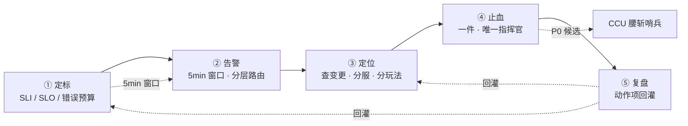
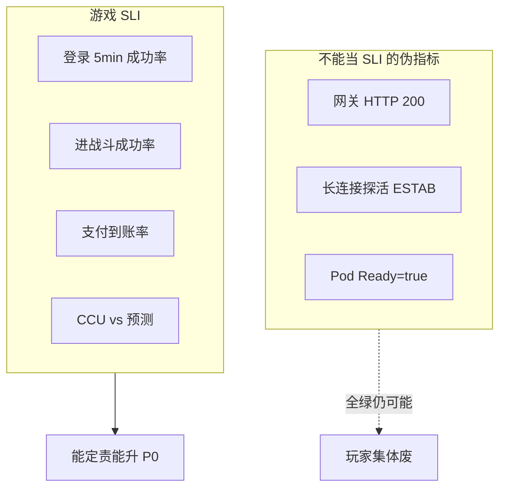
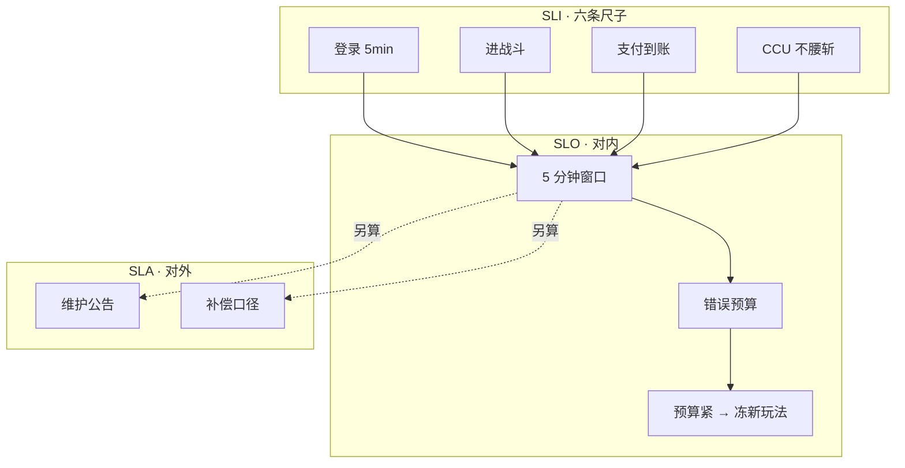
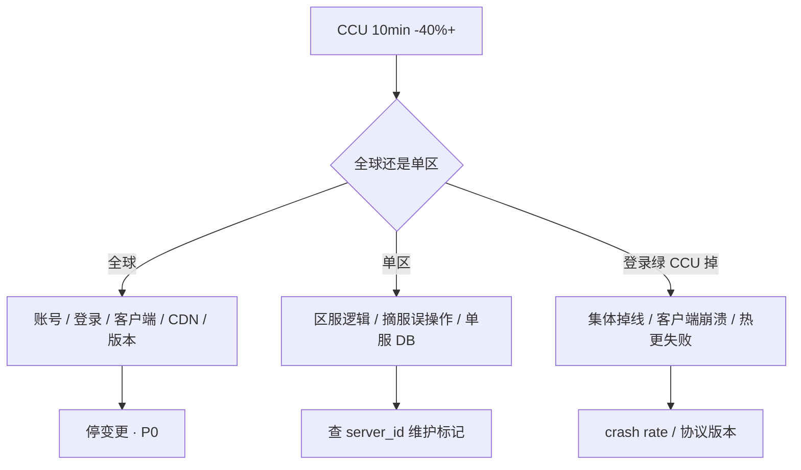

# 游戏 SRE 稳定性

> 开服 10 分钟登录成功率 90%，月底有人甩网关 99.9% 说没破 SLO。CCU 10 分钟腰斩 CPU 全绿——三个人同时切主、回指针、重启逻辑服，没人知道哪件有效。
> **本章回答**：一次故障从 SLO 定标到复盘回灌，每一步会坏什么、值班第一刀是什么。
> **不讲**：主机 HA 理论 → [01-33](../../01-基础底座/33-高可用与容灾/)；监控底座 → [01-22](../../01-基础底座/22-监控与告警/)；摘流发布 → [01](../01-游戏服务器架构/)、[05](../05-热更新与版本发布/)；回档 → [09](../09-玩家数据备份与回档/)。

**标记**：🎯重点 · 🔥难点 · ⭐常考 · 🔧实操

---

## 一、一张图：一次故障的一生

> 🎯 **一句话**：稳定性不是装监控就完——先量对（SLO），再守变更，练过预案，事故里只做练过的事；复盘动作项必须回灌定标和变更规范。



**读图**：主线是一条故障从定标到复盘的完整路径——定标在前（SLI 量错、SLO 设线、错误预算管变更），告警挂在 5 分钟 SLI 窗口上不是月平均，定位先查变更不先看 CPU，止血只做一件且唯一指挥官，复盘动作项要能验收并回灌 SLO 阈值和变更冻结规范。CCU 腰斩是独立哨兵——CPU 不高、网关全绿也可能全球静默故障。

> 📝 **面试**：「游戏 SRE 和 Web SRE 最大差别？」——「SLI 量玩家废什么（登录/战斗/钱/CCU），不是 HTTP 200；变更纪律（活动禁战斗热更）；有状态（演练不随机杀战斗）。」

---

## 二、定标：玩家废了什么

> 🎯 **一句话**：**SLI（Service Level Indicator）** 量玩家废了什么；**SLO（Service Level Objective）** 是对内刹车线；**SLA（Service Level Agreement）** 是对外合同——三张表分开，不要混成一句 99.9%。

Web 可用性 = 请求成功占比。游戏玩家废的是：登不上、进不了战斗、结算错、钱扣了道具没有、CCU 无故腰斩。网关 200 像「门能推开」——门开了里面空货架（空响应）、收银台坏了（结算错），玩家照样废。

### 六条游戏 SLI ⭐🔥

每条独立量、独立告警、独立 oncall 路由：

| SLI | 分子 / 分母 | 为什么独立 |
|-----|-------------|------------|
| 登录成功率 | 鉴权到大厅成功 / 尝试登录 | 开服、版本日主指标 |
| 进战斗成功率 | 有 ticket 后进房间成功 / 尝试进房 | 登录绿、战斗进不去是另一类 |
| 操作 P95 | 核心操作回包延迟 | 卡顿流失，不是 5xx |
| 结算正确率 | 战斗结果与背包一致 | 经济错仍是 P0 |
| 支付到账率 | 扣款到道具到账 | 资损 |
| CCU 完整性 | 相对预测 / 同时段不腰斩 | 全服静默故障哨兵 |



**读图**：左边三个指标在渠道鉴权挂、排队满、战斗空 room、客户端崩溃时仍可能全绿；右边六条才是「玩家体验」。破 SLO ≠ 自动破 SLA；没破 SLA ≠ 可以不升 P0。

> 💡 **打个比方**：网关 200 是「门能推开」，但玩家要的是「货架有货、收银台能结账」——六条 SLI 量的才是玩家体验。

> ⚠️ **别混**：SLI / SLO / SLA 三词——SLI 是指标，SLO 是内部目标，SLA 是对外承诺。开服 10 分钟登录 90%，5 分钟 SLI 已破 = P0，月历网关 99.9% 救不了。

### SLO vs SLA 与错误预算 ⭐🔥

SLO 破了升 P0、吃预算；SLA 破了才谈公告补偿；**错误预算（Error Budget）** 是本月还能「浪费」多少失败窗口——预算打光冻新玩法，不冻回滚和安全修复。

| | SLO | SLA |
|--|-----|-----|
| 对谁 | 工程 / 值班 | 玩家 / 渠道 / 法务 |
| 破了做什么 | P0、吃预算、冻变更 | 公告、补偿、对账 |
| 窗口 | 5min 滑动为主 | 合同约定的统计周期 |
| 典型指标 | 登录 5min 99.5% | 计划外不可用 >30min 补偿 |

错误预算计算：

```text
月 5min 片数 ≈ 8640（30 天 × 24h × 12 片/h）
目标 99.5% → 允许失败片 ≈ 43
一次开服 10min @90% → 消耗约 2 片，但必须 P0
```

预算三板斧：**故障扣、计划内不扣、打光冻新不冻回滚**。合服窗口停服是计划内维护，单独记账，不扣故障预算——把合服算进故障预算，团队会作假关维护窗。

> 🔍 **现场**：开服 10min 登录 90%

```bash
# 登录 5min 成功率
curl -s 'http://prom:9090/api/v1/query?query=sum(rate(login_success_total[5m]))/sum(rate(login_attempt_total[5m]))' \
  | jq -r '.data.result[0].value[1]'
# 0.902   ← 低于 99.5% 目标，5min SLO 已破 → P0

# 同时看网关——可能仍绿
curl -s 'http://prom:9090/api/v1/query?query=sum(rate(gateway_http_2xx[5m]))/sum(rate(gateway_http_total[5m]))' \
  | jq -r '.data.result[0].value[1]'
# 0.999   ← 探活 200、空响应也算成功，不能当登录 SLI
```

### 变更纪律：活动整点与有状态发布 ⭐

活动整点 ±30min 硬冻结无关变更。**无状态**（登录、目录、排队）可以 HPA、可以活动中扩；**有状态**（战斗 room、合服、回档）必须摘流、停写、等存量。登录、战斗、支付三条 SLI 破了止血完全不同——登录无状态可扩；战斗有状态不能 HPA 迁已开 room；支付不扩机器能好，冻写、对账。

| 组件 | 状态模型 | 活动中能否变更 | 发布策略 |
|------|----------|----------------|----------|
| 目录 / 版本服 | 无状态 | 可（谨慎） | 滚动 + 降级旧列表 |
| 登录 / Gate | 长连接 session | **可扩** | 摘流四步 |
| 大厅 / 匹配 | 队列有状态 | 可扩副本 | 滚动 |
| 战斗 | room 钉内存 | **禁热更** | 摘流 → 等 room 空 |
| MySQL 主库 | 权威账本 | 禁 DDL 尖刺 | 低峰 / online DDL |
| Redis 主 | 热状态 | 禁无演练切主 | 演练 + 对账 |
| CDN 指针 | 无状态 | 可回退 | 分区指针独立 |

硬冻结：活动整点 ±30min 发无关变更（战斗脚本热更、未预发配置）；周五晚发战斗 / 协议；合服 + 战斗热更 + 强更叠做。仍允许：登录 / 目录无状态扩容、已演练降级开关（回执齐）、回滚（要广播，避免双人反向操作）。

> 💡 **打个比方**：活动整点像手术进行中——可以多加护士（扩登录），不能顺便换器官（热更战斗）。

> 📝 **面试**：「活动中可以扩登录，不能发战斗热更。变更冻结活动整点 ±30min。」

### 收束：定标凭什么管住稳定性 ⭐🔥

定标管住稳定性的三件武器：**量（SLI）→ 刹（SLO + 错误预算）→ 赔（SLA）**。



**读图**：先说哪条 SLI 破了，再决定摘登录还是摘 room——不要同时改三处。SLO 破了升 P0；SLA 破了才谈公告补偿。预算紧冻新玩法，不冻回滚和安全修复。

> ⚠️ **别混**：预算打光**冻新玩法，不冻回滚和安全修复**；合服停服**不扣**故障预算。扩 Gate 救不了空 room 不足——登录无状态可扩，战斗有状态不能 HPA 迁已开 room。CCU 腰斩先分全球 vs 单区，不是先扩机器。

---

## 三、告警：分层监控与路由

> 🎯 **一句话**：游戏监控要分层到各跳 / 玩法 / CCU，必有登录 5min 成功率——网关成功率不能代替；告警按服、按玩法路由，维护静默按集群 / 大区。

### 监控分层 🔧

```text
L0 机器：CPU / mem / disk / fd / 网络
L1 中间件：MySQL threads / Redis ops / Kafka lag
L2 接入各跳：目录 / 排队 / 鉴权 / Gate 连接 / session
L3 玩法：match_queue / empty_rooms / fighting_rooms / tick_delay
L4 业务：CCU by server_id / 经济产出 / 支付漏斗
L5 客户端：crash rate / ANR / 热更失败率
```

Dashboard 分行：全局（CCU · login_qps · queue_depth · gate_estab_sum）→ 分服（CCU by server_id · mysql_threads by shard）→ 战斗（empty_rooms · fighting_rooms · match_queue_depth）→ SLO（login_5m · battle_join_5m · pay_deliver_5m · ccu_vs_predict）。

**RED 方法论**（见 [21-USE与RED](../../01-基础底座/21-性能方法论-USE与RED/)）：Rate 登录/玩法 API、Errors 漏斗、Duration P99——比「CPU 不高」更能解释玩家卡顿。

> 🔍 **现场**：网关成功率 99.99%，渠道鉴权挂了，登录成功率已经掉

```bash
curl -s 'http://prom:9090/api/v1/query?query=sum(rate(login_success_total[5m]))/sum(rate(login_attempt_total[5m]))' \
  | jq -r '.data.result[0].value[1]'
# 0.82   ← 登录 SLI 已破

curl -s 'http://prom:9090/api/v1/query?query=sum(rate(gateway_http_2xx[5m]))/sum(rate(gateway_http_total[5m]))' \
  | jq -r '.data.result[0].value[1]'
# 0.9999 ← 网关仍绿，告警没响因为只订了网关
```

长连接健康检查恒 200；登录失败发生在渠道或排队，网关这一跳仍然 200。

### 高基数与 server_id ⭐

`server_id` 是必需维度——腰斩和产出异常经常是单服，全局聚合会漏。但不要 `server_id × 全量接口`——Prometheus 先死，SLO 看板空白。做法：保留 server_id 按服聚合 CCU / 产出；接口只留核心 + recording rule；原始指标采样，SLI 用 recording 聚合。

> ⚠️ **别混**：丢掉 server_id 只留全局 = 单服异常漏报；每个 debug 接口都当标签 = Prometheus 爆。

### 叫醒标准与维护静默 🔧

**叫醒**（写进 SLO 路由）：支付、数据错、多服登录、CCU 腰斩、安全。**不叫醒**：单渠道文案、已降级的排行、已知渠道故障且有公告。维护静默按**集群 / 大区 / server_id**，不全集群——单服维护误静默全球 = 漏报。

> 📝 **面试**：「半夜 P2 排行挂了要不要电话？」——「不叫醒，工单；支付不到账、CCU 腰斩、登录多服失败——叫醒。」

### 告警规则与 PromQL 🔧

SLO 告警用 **5min 滑动窗口 + for 2m**，CCU 用预测/环比：

```yaml
groups:
  - name: game-slo
    rules:
      - alert: LoginSLOBurn
        expr: |
          sum(rate(login_success_total[5m]))
          /
          sum(rate(login_attempt_total[5m])) < 0.995
        for: 2m
        labels:
          severity: P0
          sli: login
        annotations:
          summary: "登录 5min SLI < 99.5%"

      - alert: BattleJoinSLOBurn
        expr: |
          sum(rate(battle_join_success_total[5m]))
          /
          sum(rate(battle_join_attempt_total[5m])) < 0.98
        for: 3m
        labels:
          severity: P0
          sli: battle_join

      - alert: PayDeliverSLOBurn
        expr: |
          sum(rate(pay_deliver_success_total[5m]))
          /
          sum(rate(pay_paid_total[5m])) < 0.999
        for: 2m
        labels:
          severity: P0
          sli: pay

      - alert: CCUCollapse
        expr: |
          sum(game_ccu)
          /
          sum(game_ccu_predicted offset 7d) < 0.6
        for: 10m
        labels:
          severity: P0
          sli: ccu
```

> 🔍 **现场**：验证 CCU 告警是否误报（凌晨低谷）

```bash
# 当前 CCU vs 7 天前同时段
curl -s 'http://prom:9090/api/v1/query?query=sum(game_ccu)/sum(game_ccu offset 7d)' \
  | jq -r '.data.result[0].value[1]'
# 0.55   ← 相对同时段腰斩，不是绝对值低

# 单服产出异常（高基数用 recording rule）
curl -s 'http://prom:9090/api/v1/query?query=sum by(server_id)(rate(item_drop_total[5m]))' \
  | jq '.data.result[] | select(.value[1]|tonumber > 10000)'
```

维护窗口：Alertmanager `inhibit_rules` 按 `cluster` / `region` / `server_id` 静默，不要 `match_re: .*` 全静默。

---

## 四、定位：查变更与 CCU 腰斩

> 🎯 **一句话**：定位先查变更（含配置、CDN、渠道），不先看 CPU；CCU 腰斩对预测/环比不对绝对值，分全球 vs 单区 vs 登录绿 CCU 掉三种叉。

### 查变更 🔥

P0 即使「最近没发版」，仍先看变更：**配置中心、CDN 指针、云侧、渠道、灰度开关、证书、DNS**——很多事故是「没发版但改了配置」。

> 📝 **面试**：「最近没发版为什么还查变更？」——「配置、CDN、渠道、灰度、证书、DNS 都是变更。」

变更单最小字段：变更 ID / 类型 / 影响范围（server_id / region / 全球）、观察指标（login_5m / battle_join / ccu / pay_deliver）、回滚步骤（具体命令或 pipeline id）、超时（N 分钟 SLI 恶化则自动回滚）、负责人 + 复核人。

**双人反向操作**经典事故：A 回滚 CDN 指针，B 同时 push 新配置——玩家版本分裂，登录漏斗出现「能进不能打」。

> 💡 **打个比方**：变更像开车——同时踩油门和刹车，不是保守，是不知道车往哪走。

> ⚠️ **别混**：扩 Gate 救不了空 room 不足；回滚 CDN 指针和回滚战斗是两件变更，要指定唯一指挥官顺序。

> 🔍 **现场**：确认是否在变更窗口内

```bash
# 最近 30min 有无 battle 发布
kubectl rollout history deploy/battle-prod | tail -3
kubectl get events --sort-by='.lastTimestamp' | grep -i battle | tail -5

# 变更冻结日历
curl -s 'http://change-calendar.internal/api/frozen?window=activity_peak' | jq '.frozen_until'
# "2025-09-01T20:30:00+08:00"   ← 仍在冻结窗
```

### CCU 腰斩与静默故障 ⭐🔥



**读图**：CCU 对预测或环比不对绝对值——凌晨低谷用同时段基线。全球腰斩查账号/登录/客户端/CDN/版本；单区查区服逻辑和摘服误操作；登录绿但 CCU 掉 = 集体掉线或客户端崩溃，不是登录问题。

检查单 🔧：

```text
□ 是否有维护 / 摘服 / 目录误指
□ 登录各跳 5min 成功率
□ Gate 连接数 vs session 活跃数（假在线）
□ 战斗 Tick / empty_rooms
□ 客户端 crash rate / 热更失败
□ 支付是否同时掉（排除「人都走了所以充值少」）
```

> 🔍 **现场**

```bash
curl -s 'http://prom:9090/api/v1/query?query=sum(game_ccu)/sum(game_ccu offset 7d)' | jq -r '.data.result[0].value[1]'
# 0.58

curl -s 'http://prom:9090/api/v1/query?query=sum(rate(client_crash_total[5m]))' | jq -r '.data.result[0].value[1]'
# 850   ← 客户端崩溃尖刺，CPU 可能仍不高
```

---

## 五、止血：定级、指挥与预案

> 🎯 **一句话**：事故里唯一指挥官，先说哪条 SLI 破了再一件止血；止血只做练过的事——摘服、排队宕机、主从切换 + 经济校验、CDN 指针回退。

### 定级 ⭐

| 级 | 例子 | 响应 |
|----|------|------|
| P0 | 全渠道登录失败；支付不到账；数据错；CCU 腰斩 | 立即 |
| P1 | 单大服不可玩；合服大面积找不到角色 | 15min |
| P2 | 排行、跨服、非主线 | 值班 |
| P3 | 文案、个别机型 | 工单 |

看**核心循环和钱**，不看机器台数。测试服写乱生产库一台也是 P0。

### 唯一指挥官五步 🔧


1. 哪条 SLI、哪个窗口、破没破 SLO
2. 范围：全球 / 单区 / 单渠道 / 单 server_id
3. 正在做的一件止血
4. 对外四句：影响服、能否进、钱和道具、ETA
5. 补偿对照 SLA，运营出数字

**对外口径模板**（运营填数）：

```text
【影响范围】XX 区 / XX 渠道 / server_id 列表
【能否进入】可以登录 / 暂不可进战斗 / 暂不可登录
【资产安全】道具 / 充值数据完整 / 正在对账
【预计恢复】ETA XX:XX（指挥官给，可更新）
```

> ⚠️ **别混**：有 Pager 不等于 oncall——登不上堡垒 = 没有 oncall。三个人同时动手 = 不知道哪件有效。**止血阶段禁止顺便优化**。

### 预案与演练 ⭐🔥

演练是为了事故里**只做练过的事**。生产绝不随机杀战斗——有状态 = 随机判负。

| 演练项 | 验收什么 | 频率 |
|--------|----------|------|
| 摘服 | 目录摘掉、玩家踢线、无脏写 | 季度 |
| 排队降速 / 宕机 | 停进、公告、恢复后 CPS | 季度 |
| DB 主从切换 | 背包 / 订单对得上，不只读查询通 | 半年 |
| 镜像回档 | 范围锁、支付清单、校验失败回现场 | 半年 |
| CDN 指针回退 | 分区指针、海外源独立 | 季度 |
| 登录丢一半副本 | 无状态扩、粘滞跟 uid | 季度 |
| 降级开关 | 关玩法 / 限匹配 / 停产出 | 活动前 |

不在生产演：随机杀战斗进程、对生产主库写压测、无公告全服踢人、说不清隔离方式就硬杀 Pod 的「混沌工程」。

> ⚠️ **别混**：预案演练 ≠ 混沌工程——答不出隔离方式，就说预案演练，不要硬蹭「混沌」。主机切主见 [01-33](../../01-基础底座/33-高可用与容灾/)；这里要的是切完背包和订单对得上。

### 摘服与主从切换剧本 🔧

摘服演练：

```text
① 目录标记 server_id=s1001 maintenance=true
② Gate 踢线协议广播（或等心跳超时）
③ 确认该服无新 login / 无新 room
④ 观察其他服 CCU / SLI 不受影响
⑤ 恢复：maintenance=false，观察 login_5m 恢复
```

排队宕机演练：

```text
① 排队服务停新 ticket 发放
② 客户端展示「排队暂停，请稍后再试」
③ 已在队玩家：冻结位置 or 清空（产品定）
④ 恢复后 CPS（每秒放行）逐步拉升，盯 login_5m
```

主从切换 + 经济校验 🔥（Redis 主挂，从延迟 30 秒）：

1. 切主前：记录 `master_offset`、抽样 100 uid 背包 JSON。
2. 切主后：对比背包、支付单 `status=delivered` 无重复。
3. 延迟窗口内写入：以 **MySQL 为准**对齐 Redis，不要让玩家在脏缓存上充值。
4. 对外：「正在对齐数据」，不要撒谎「数据完整无丢失」。

```bash
# 切换后抽样对账
mysql -e "SELECT role_id, item_id, qty FROM bag WHERE role_id IN (1001,1002,1003) ORDER BY role_id, item_id;"
redis-cli -h redis.prod MGET bag:1001 bag:1002 bag:1003
# 不一致 → 以 MySQL 回填，标记对账任务
```

> ⚠️ **别混**：SLA 补偿由运营对照条款，技术只提供事实时间线。延迟窗口里的支付单以**支付库**为准补发或标记，不要猜。

> 📝 **面试**：「演摘服和主从 + 经济校验；不演随机杀战斗。切完要对账，不只读查询通。」

---

## 六、复盘：动作项回灌

> 🎯 **一句话**：复盘多两栏——**对玩家说了什么**、**经济是否对平**；动作项要能关——「加强责任心」= 没写。

复盘六栏：时间线（发现 → 确认 → 止血 → 恢复，UTC + 本地）、SLI（哪条、何时破、持续多久）、根因（技术 + 变更 + 流程，5 Whys 一层）、玩家口径（公告 / 补偿说了什么）、经济（是否对平、有无资损、对账方法）、动作项（负责人 + 截止日期 + 验收标准）。

动作项回灌示例：

```text
❌ 「加强变更意识」
✅ 「活动整点 ±30min 战斗热更 CI 硬拦截，@张三，2025-09-15，验收：误触发 pipeline 失败」

❌ 「优化监控」
✅ 「登录 SLI recording rule + P0 路由，@李四，2025-09-10，验收：渠道鉴权故障 2min 内告警」
```

> 📝 **面试**：「复盘最重要的是什么？」——「动作项可验收、回灌 SLO/变更；经济对平栏不能空。」

---

## 七、作战：稳定性事故定责

> 🎯 **一句话**：先 SLI 和范围，再一件止血，最后对外口径——不要同时改三处。

| 现象 | 先做 | 别做 |
|------|------|------|
| 开服 10min 登录 90%，月历仍 99.9% | P0；5min SLI | 「没破 SLO」 |
| 测试服写乱生产库一台 | P0 | 「就一台 P2」 |
| 活动整点要热更战斗 | 拒绝；可扩登录 | 同一分钟两件高危 |
| CCU 腰斩、CPU 不高 | 环比 + 分服 | 对绝对值 |
| 预算打光还上新玩法 | 冻新玩法 | 冻安全修复 |
| 登录绿、战斗进不去 | 查进战斗 SLI | 扩 Gate |
| 支付渠道单挂 | 地区 P0 + 对账 | 关全球登录 |
| 三个人同时切主回滚 | 指定唯一指挥官 | 继续并行操作 |

**60 秒剧本** 🔧：

```text
0–10s   哪条 SLI？5min 窗口破没破？全球还是单区？
10–30s  停变更；确认唯一指挥官；广播「正在处理」
30–45s  一件止血：扩登录 / 摘服 / 回滚 / 切主
45–60s  对外四句模板给运营；补偿是否触发 SLA 另算
```

> 🔍 **现场**：一键 SLI 巡检

```bash
echo "=== login 5m ===" && \
  curl -s 'http://prom:9090/api/v1/query?query=sum(rate(login_success_total[5m]))/sum(rate(login_attempt_total[5m]))' \
  | jq -r '.data.result[0].value[1]'
echo "=== battle join 5m ===" && \
  curl -s 'http://prom:9090/api/v1/query?query=sum(rate(battle_join_success_total[5m]))/sum(rate(battle_join_attempt_total[5m]))' \
  | jq -r '.data.result[0].value[1]'
echo "=== ccu vs 7d ===" && \
  curl -s 'http://prom:9090/api/v1/query?query=sum(game_ccu)/sum(game_ccu offset 7d)' \
  | jq -r '.data.result[0].value[1]'
```

---

## 八、收口

### 命令速查 🔧

```bash
# 登录 5min SLI
curl -s 'http://prom:9090/api/v1/query?query=sum(rate(login_success_total[5m]))/sum(rate(login_attempt_total[5m]))'

# CCU 同时段环比
curl -s 'http://prom:9090/api/v1/query?query=sum(game_ccu)/sum(game_ccu offset 7d)'

# 单服进战斗
curl -s 'http://prom:9090/api/v1/query?query=rate(battle_join_success_total{server_id="s1001"}[5m])'

# 最近 battle 发布
kubectl rollout history deploy/battle-prod | tail -5
```

### 面试锚点 ⭐

| 问 | 30 秒答 |
|----|---------|
| 游戏 SLO 为什么不能套 Web 月平均？ | 玩家废登录/战斗/钱；5min 窗口；开服 10min 90% 必 P0 |
| SLO 和 SLA？ | 对内刹车 vs 对外合同；破 SLO 升 P0，破 SLA 才谈补偿 |
| 错误预算？ | 故障扣、计划内不扣、打光冻新不冻回滚 |
| 活动整点能扩什么？ | 扩无状态登录；禁战斗热更 |
| P0 怎么定？ | 核心循环 + 钱；唯一指挥官五步 |
| 演练演什么？ | 摘服/主从+经济校验；不演随机杀战斗 |
| CCU 腰斩？ | 10min 掉 40%+ 对预测；分全球/单区 |
| 网关 200 能当 SLI 吗？ | 不能；渠道/排队/空响应仍 200 |
| 最近没发版查什么？ | 配置、CDN、渠道、灰度、证书 |
| 叫醒标准？ | 支付、数据、多服登录、CCU 腰斩 |

### 易错一句话对照

- 网关 99.9% 能当游戏 SLO → **错**，玩家废的是登录/战斗/钱
- 开服 10min 90% 月平均没破不用 P0 → **错**，5min 窗口已破
- SLO 和 SLA 是一回事 → **错**，对内 vs 对外
- 合服停服扣错误预算 → **错**，计划内另本账
- 预算紧了连回滚都冻 → **错**，冻新玩法不冻回滚
- 用登录成功率判断战斗 → **错**，两条独立 SLI
- CCU 看绝对值 → **错**，环比/同时段
- 生产随机杀战斗做混沌 → **错**，随机判负
- 破 SLO 一定破 SLA → **错**，分开说
- 扩 Gate 救进不了战斗 → **错**，查 battle SLI / empty_rooms
- 三个人同时止血 → **错**，唯一指挥官一件
- 丢弃 server_id 降基数 → **错**，单服异常会漏

### 数字墙

> 登录 **5 分钟**窗口；目标 **99.5%** ≈ 月 **43** 失败片；CCU **10 分钟掉 40%+** = P0 候选；P1 **15 分钟**响应；活动整点冻结 **±30min**；审计级复盘动作项 **7 天内**出草案。

---

## 合上书

- [ ] **默画**一次故障的一生：定标 → 告警 → 定位 → 止血 → 复盘，复盘如何回灌定标和变更？
- [ ] 六条 SLI？为什么网关 200 不能代替？
- [ ] SLO 和 SLA 各对谁说？开服 10min 90% 破哪个？
- [ ] 错误预算怎么处理合服？预算打光还能发新玩法吗？
- [ ] 监控分几层？高基数怎么处理 server_id？
- [ ] 活动整点能扩什么、不能发什么？有状态 vs 无状态变更矩阵？
- [ ] 变更单要写什么？双人反向操作为什么危险？最近没发版查什么？
- [ ] P0 怎么定级？唯一指挥官五步？
- [ ] 演练演什么、生产绝不演什么？主从切换看什么业务校验？
- [ ] CCU 腰斩怎么分全球 vs 单区 vs 登录绿 CCU 掉？

十题能口述，这一章就过了。下一章：[GM 工具与运营支撑](../14-GM工具与运营支撑/)。
