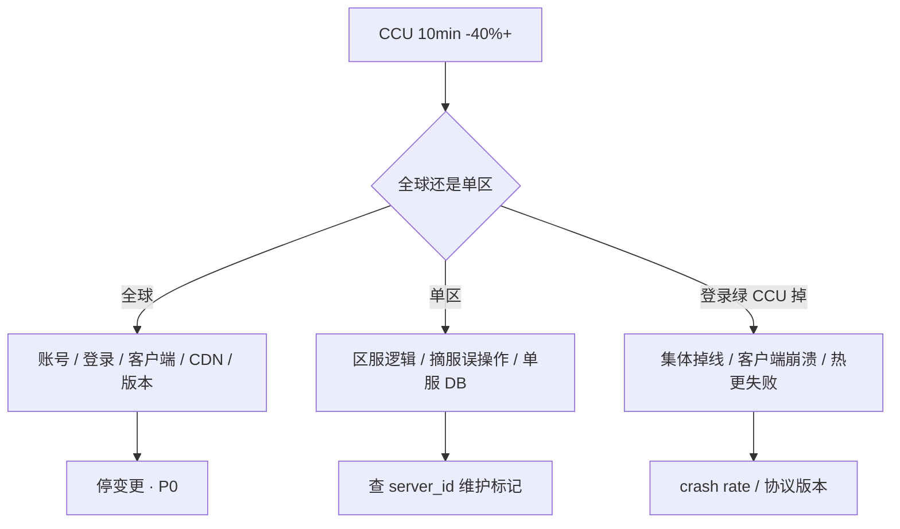

# 13｜游戏 SRE 稳定性 · 练习题

开始做题前，先给大家一个小建议：合上知识点，对着**第一节的主图**，把「一次故障的一生」——SLO→告警→定位→止血→复盘回灌——口述一遍。能顺下来，下面这些题你会发现大半都会了；卡壳的地方，就是你该回去重读的那一节。

做题的方式也建议改一下：每道题**先看标题和场景，自己口述一遍答案，再往下看「完整解答」对答案**。直接看解答，容易产生「我会了」的错觉——能讲出来才是真的会。

| 标记 | 含义 |
|------|------|
| **核心** | 不懂整章就没建立起来 |
| **必会** | 值班和面试都要能讲 |
| **常用** | 线上会反复碰到 |
| **常考** | 白板和追问的高频口径 |

题目的顺序也是有意排的：Q1～Q5 先钉 SLO、错误预算与变更；Q6～Q10 讲监控、叫醒与腰斩；Q11～Q14 收尾到定级、演练与白板。

## 本题目录

- [Q1 游戏 SLO / 登录 vs 战斗](#q1)
- [Q2 SLO vs SLA](#q2)
- [Q3 错误预算](#q3)
- [Q4 变更窗口](#q4)
- [Q5 有状态 vs 无状态变更](#q5)
- [Q6 监控分层与网关 200](#q6)
- [Q7 高基数 server_id](#q7)
- [Q8 叫醒标准](#q8)
- [Q9 CCU 腰斩](#q9)
- [Q10 变更单与双人操作](#q10)
- [Q11 P0 定级与指挥](#q11)
- [Q12 演练边界](#q12)
- [Q13 Redis 主挂口径](#q13)
- [Q14 稳定性白板综合题](#q14)
- [合上书](#合上书)

---

## Q1

**★★★★★｜游戏 SLO 为什么不能套 Web 月度可用性？登录和战斗为什么要分开？**

**覆盖**：核心 · 必会 · 常考 ｜ **对应**：知识点 [二、定标：玩家废了什么](知识点.md)

### 场景

开服 10 分钟登录成功率 90%。月历网关 200 仍 > 99.9%。有人说没破 SLO，不用升 P0。长连接探活全绿，玩家已经集体进不了战斗。

先自己试试：不看下面，先口述一遍你的答案，再往下对。

### 完整解答

> 🎯 **一句话**：游戏 SLO 用 5 分钟 SLI 窗口，登录和战斗分开订，网关 200 不能代替登录 SLO。

玩家废的是登录、进战斗、结算正确、支付到账、CCU 不腰斩。网关 200 和长连接探活会全绿——渠道鉴权挂、排队满、空响应、客户端崩溃时网关这一跳仍然 200。开服 10 分钟登不上按月一平均仍可能 > 99.9%，但 5 分钟窗口已破 = P0。

登录和战斗必须分开：登录挂 = 进不了门，扩无状态；战斗挂 = 在线的人不可玩，有状态，不能按登录成功率判断。结算错误时可用性板仍绿，仍是 P0。

> 📝 **面试**：「网关 99.9% 不能当游戏 SLO。我先说哪条 SLI 破了——登录、进战斗、支付、CCU 分开量、分开告警。」

### 再追问

Error Budget 怎么处理开服维护？——单独记账。把合服窗口算进故障预算，后面全月不能发版，团队会作假关窗。

---

## Q2

SLO vs SLA——别混。

**★★★★★｜SLO 和 SLA 在游戏里差在哪？合同写了 99.9% 你怎么值班？**

**覆盖**：核心 · 必会 · 常考 ｜ **对应**：知识点 [二、定标：玩家废了什么](知识点.md)

### 场景

合同写「可用性 99.9%」。开服 10 分钟登不上。运营问要不要按 SLA 赔。有人用月底网关平均证明「没违约，也没破 SLO」。

先自己试试：不看下面，先口述一遍你的答案，再往下对。

### 完整解答

> 🎯 **一句话**：SLO 对内刹车升 P0，SLA 对外写维护补偿条款，值班不看月平均网关。

**SLO** 是内部目标：5 分钟登录 / 支付 SLI 破了就升 P0、吃错误预算。**SLA** 是对外契约：维护怎么公告、超时怎么补、合服窗口是否除外、支付不到账的处理时限。

游戏很少真按日历 99.9% 赔付。值班口径仍是 5 分钟 SLI 破了就 P0。赔偿走运营和法务对照 SLA 条款，不在事故群里用月平均顶。禁止把 SLO 数字（99.5%）印进 SLA = 法务绑架值班。

> ⚠️ **别混**：破 SLO ≠ 自动破 SLA；没破 SLA ≠ 可以不升 P0。

### 再追问

渠道支付失败算破登录 SLO 吗？——不算同一条。支付是独立 SLI / 地区 P0。不要扩 Gate 去「完成支付 SLA」。

---

## Q3

错误预算怎么花。

**★★★★★｜错误预算吃紧了，还能发新玩法吗？合服停服扣不扣预算？**

**覆盖**：核心 · 必会 · 常考 ｜ **对应**：知识点 [二、定标：玩家废了什么](知识点.md)

### 场景

本月错误预算已消耗 38/43 片。产品要晚上线新玩法。同时下周有合服停服窗口。有人主张「合服也算故障，所以预算已经花光不能发版了」。

先自己试试：不看下面，先口述一遍你的答案，再往下对。

### 完整解答

> 🎯 **一句话**：预算吃紧冻新玩法，不冻回滚和安全修复；合服计划内另本账，不扣故障预算。

月 5min 片数 ≈ 8640，目标 99.5% → 允许失败片 ≈ 43。一次开服 10min @90% 消耗约 2 片，但必须 P0。

预算打光：拒绝非必要变更（新玩法、未预发配置）。仍允许：安全修复、回滚、登录扩容。合服停服是**计划内维护**，单独记账，不扣故障错误预算——把合服算进故障预算会导致团队作假关维护窗。

> 📝 **面试**：背三板斧——故障扣、计划内不扣、打光冻新不冻回滚。

### 再追问

开服 10min 90% 消耗 2 片还要 P0 吗？——要。预算和定级是两条线；SLO 破必 P0。

---

## Q4

变更窗口与错误预算。

**★★★★★｜哪些变更窗口你硬冻结？活动中登录集群能不能扩？**

**覆盖**：必会 · 常用 · 常考 ｜ **对应**：知识点 [二、定标：玩家废了什么](知识点.md)

### 场景

活动整点前 20 分钟，有人要热更战斗脚本「顺手修个 bug」。同时登录开始排队，有人不敢扩，怕动生产。

先自己试试：不看下面，先口述一遍你的答案，再往下对。

### 完整解答

> 🎯 **一句话**：活动整点前后 ±30min 冻无关变更，登录无状态扩容允许，战斗脚本热更禁止。

硬冻结：活动整点 ±30min 发无关变更；周五夜发战斗 / 协议；合服 / 强更 / 回档叠做；未预发的脚本热更。允许：登录 / 目录无状态扩容；已演练降级开关；回滚（要广播，避免双人反向操作）。

> 💡 **打个比方**：手术进行中可以加护士（扩登录），不能换器官（热更战斗）。

### 再追问

活动中登录集群能不能扩？——能，而且常常必须。扩的是无状态。不要在同一分钟热更战斗脚本。

---

## Q5

有状态 vs 无状态变更。

**★★★★☆｜有状态和无状态组件，活动中分别能做什么变更？**

**覆盖**：必会 · 常用 ｜ **对应**：知识点 [二、定标：玩家废了什么](知识点.md)

### 场景

活动整点，登录 SLI 98% 绿，进战斗失败率 20%。有人要扩 Gate，有人要热更战斗，有人要扩战斗 Pod。

先自己试试：不看下面，先口述一遍你的答案，再往下对。

### 完整解答

> 🎯 **一句话**：登录绿、战斗破 → 查 battle SLI，禁战斗热更，可扩登录；扩战斗只加空 room 不救已开对局。

| 组件 | 活动中 |
|------|--------|
| 登录 / 排队 / 目录 | 可扩 |
| 战斗 | 禁热更；HPA 只加空 room |
| Gate | 可扩（session 策略要就绪） |
| MySQL DDL | 禁 |
| CDN 指针 | 谨慎，要分区 |

进战斗 SLI 破：查 room / Tick / 是否在滚战斗。扩 Gate 当万能药 = 错。登录无状态可扩，战斗有状态不能 HPA 迁已开 room，支付不扩机器能好需冻写对账。

### 再追问

同一分钟既扩登录又热更战斗？——禁止。无法定责哪件有效。

---

## Q6

监控分层与网关 200。

**★★★★☆｜游戏监控分层和必须有的游戏告警？为什么不用网关成功率代替登录 SLO？**

**覆盖**：必会 · 常用 ｜ **对应**：知识点 [三、告警：分层监控与路由](知识点.md)

### 场景

网关成功率 99.99%。渠道鉴权挂了，登录成功率已经掉。告警没响，因为只订了网关。

先自己试试：不看下面，先口述一遍你的答案，再往下对。

### 完整解答

> 🎯 **一句话**：监控分层到各跳/玩法/CCU，必有登录 5 分钟成功率，网关成功率不能代替。

分层：L0 机器 / L1 中间件 / L2 接入各跳 / L3 玩法 / L4 业务 CCU 与经济 / L5 客户端崩溃。必有：登录 5min、CCU 腰斩、支付、单服产出数量级。RED 方法论（Rate/Errors/Duration）比「CPU 不高」更能解释玩家卡顿，日志排障见 [11](../11-游戏日志与埋点链路/)。

长连接健康检查恒 200；登录失败发生在渠道或排队，网关这一跳仍然 200。

> 🔍 **现场**

```bash
curl -s 'http://prom:9090/api/v1/query?query=sum(rate(login_success_total[5m]))/sum(rate(login_attempt_total[5m]))' \
  | jq -r '.data.result[0].value[1]'
# 0.82   ← 登录 SLI 已破

curl -s 'http://prom:9090/api/v1/query?query=sum(rate(gateway_http_2xx[5m]))/sum(rate(gateway_http_total[5m]))' \
  | jq -r '.data.result[0].value[1]'
# 0.9999 ← 网关仍绿，告警没响因为只订了网关
```

### 再追问

为什么不用网关成功率代替登录 SLO？——失败发生在渠道 / 排队 / 票据，网关这一跳仍然 200。

---

## Q7

高基数 server_id 坑。

**★★★☆☆｜高基数的 `server_id × 接口` 怎么收？**

**覆盖**：常用 ｜ **对应**：知识点 [三、告警：分层监控与路由](知识点.md)

### 场景

每个接口每个服都当标签。Prometheus 先死，游戏 SLO 看板空白。

先自己试试：不看下面，先口述一遍你的答案，再往下对。

### 完整解答

> 🎯 **一句话**：server_id 必需但别 × 全量接口，用 recording rule 聚合控高基数别删维度。

`server_id` 是必需维度——腰斩和产出异常经常是单服，全局聚合会漏。做法：保留 server_id 按服聚合 CCU / 产出；接口只留核心 + recording rule；原始指标采样，SLI 用 recording 聚合。

> ⚠️ **别混**：丢掉 server_id 只留全局 = 单服异常漏报；每个 debug 接口都当标签 = Prometheus 爆。

### 再追问

能不能丢掉 `server_id` 只留全局？——不能。腰斩和产出异常经常是单服。

---

## Q8

叫醒标准。

**★★★☆☆｜半夜叫醒的标准是什么？P2 排行挂了叫醒吗？**

**覆盖**：必会 · 常考 ｜ **对应**：知识点 [三、告警：分层监控与路由](知识点.md)

### 场景

P2 排行榜挂了，电话把人叫醒。另一边登录 SLI 99.2% 持续 3 分钟，没人打电话。

先自己试试：不看下面，先口述一遍你的答案，再往下对。

### 完整解答

> 🎯 **一句话**：叫醒标准写进 SLO 路由——支付、数据、多服登录、CCU 腰斩叫醒；排行不叫醒。

叫醒：支付、数据错、多服登录 SLI 破、CCU 腰斩、安全。不叫醒：单渠道文案、已降级排行、已知渠道故障且有公告。

登录 99.2% 持续 3min 若 for 规则是 2m 且目标 99.5% = 应叫醒。排行 P2 工单即可。维护静默按 cluster / region / server_id，不全集群静默——单服维护误静默全球 = 漏报。

### 再追问

维护静默怎么设？——按 cluster / region / server_id，不全集群静默。

---

## Q9

开头那个 CCU 腰斩现场。

**★★★★☆｜CCU 10 分钟腰斩，你的检查单？会不会是凌晨低谷？**

**覆盖**：必会 · 常用 ｜ **对应**：知识点 [四、定位：查变更与 CCU 腰斩](知识点.md)

### 场景

CCU 10 分钟掉 45%，无维护公告。CPU 并不高。有人拿绝对值说「现在本来人就少」。登录 SLI 仍 99%。

先自己试试：不看下面，先口述一遍你的答案，再往下对。

### 完整解答

> 🎯 **一句话**：CCU 10 分钟腰斩对预测/环比必叫醒，分全球还是单区；登录绿 CCU 掉查客户端崩溃。



对预测或环比、对同时段历史，不要对绝对值。维护窗要静默对应服，不是静默集群。

检查：维护 / 摘服；登录各跳；Gate 连接 vs session；战斗 Tick；**client crash rate**；支付是否同时掉。登录绿 CCU 掉 = 集体掉线 / 客户端崩溃 / 热更失败，不是登录问题。

> 🔍 **现场**

```bash
curl -s 'http://prom:9090/api/v1/query?query=sum(game_ccu)/sum(game_ccu offset 7d)' | jq -r '.data.result[0].value[1]'
# 0.58

curl -s 'http://prom:9090/api/v1/query?query=sum(rate(client_crash_total[5m]))' | jq -r '.data.result[0].value[1]'
# 850   ← 客户端崩溃尖刺，CPU 可能仍不高
```

### 再追问

误报呢？——告警规则要带同时段基线 offset 7d。

---

## Q10

变更单与双人操作。

**★★★★☆｜变更单要写什么？双人反向操作为什么危险？最近没发版查什么？**

**覆盖**：必会 · 常用 ｜ **对应**：知识点 [四、定位：查变更与 CCU 腰斩](知识点.md)

### 场景

P0 事故，说「最近没发版」。A 在回滚 CDN 指针，B 同时 push 了新配置。玩家版本分裂，登录漏斗出现「能进不能打」。

先自己试试：不看下面，先口述一遍你的答案，再往下对。

### 完整解答

> 🎯 **一句话**：变更单写观察指标 + 回滚方案 + 超时自动回；双人反向操作 = 比没变更更糟；没发版也查配置/CDN/渠道。

变更单最小字段：变更 ID / 类型 / 影响范围、观察指标（login_5m / battle_join / ccu / pay_deliver）、回滚步骤（具体命令或 pipeline id）、超时（N 分钟 SLI 恶化则自动回滚）、负责人 + 复核人。

双人反向操作：A 回滚 CDN 指针，B 同时 push 新配置——玩家版本分裂。变更像开车——同时踩油门和刹车，不是保守，是不知道车往哪走。

P0 即使「最近没发版」仍先看变更：配置中心、CDN 指针、云侧、渠道、灰度开关、证书、DNS——很多事故是「没发版但改了配置」。

> 📝 **面试**：「最近没发版为什么还查变更？」——「配置、CDN、渠道、灰度、证书、DNS 都是变更。」

### 再追问

回滚 CDN 指针和回滚战斗能同时做吗？——不能。是两件变更，要指定唯一指挥官顺序。

---

## Q11

P0 定级与唯一指挥。

**★★★★★｜P0 怎么定级？处理顺序是什么？最近没发版呢？**

**覆盖**：核心 · 必会 · 常考 ｜ **对应**：知识点 [五、止血：定级、指挥与预案](知识点.md)

### 场景

测试服配置指到生产库，一台机器把订单写乱了。有人说「就一台，算 P2」。板上登录还是绿的。三个人同时动手：切主、回指针、重启逻辑服。

先自己试试：不看下面，先口述一遍你的答案，再往下对。

### 完整解答

> 🎯 **一句话**：P0 看核心循环和钱不看台数，唯一指挥官五步，止血不做顺便优化。

数据 / 资损、全渠道登录、CCU 腰斩、支付不到账是 P0。看核心循环和钱，不看机器台数。测试服切错生产库也是 P0。

唯一指挥官五步：确认 SLI + 范围 → 广播 → 一件止血 → 口径给运营 → 复盘。对外四句模板：影响服、能否进、钱和道具、ETA。补偿对照 SLA，运营出数字。止血阶段禁止顺便优化。

> ⚠️ **别混**：有 Pager 不等于 oncall——登不上堡垒 = 没有 oncall。三个人同时动手 = 不知道哪件有效。

### 再追问

没有唯一指挥官时？——三件叠在一起无法知道哪件有效。先指定指挥官再动手。

---

## Q12

演练边界。

**★★★★☆｜演练演什么、生产上绝不演什么？主从切换看什么业务校验？**

**覆盖**：必会 · 常用 ｜ **对应**：知识点 [五、止血：定级、指挥与预案](知识点.md)

### 场景

有人要在生产随机杀战斗进程「做混沌」。简历写了混沌工程，但说不清杀了什么。

先自己试试：不看下面，先口述一遍你的答案，再往下对。

### 完整解答

> 🎯 **一句话**：演练摘服/排队/主从+经济校验/指针回退，不演随机杀战斗和生产主库写。

演：摘服、排队降速 / 宕机停进、主从切换 + 经济校验、镜像回档、CDN 指针回退、登录掉一半副本。不演：随机杀战斗进程、生产主库写压测、无公告全员踢人。

> 📝 **面试**：切完背包和订单对得上，不只是只读查询通。答不出隔离就说预案演练，不硬蹭混沌。

### 再追问

主从切换演练看什么业务校验？——延迟是否可接受、切换后背包和订单是否对得上。抽样 100 uid 背包前后一致、支付单 `status=delivered` 无重复。

---

## Q13

Redis 主挂口径。

**★★★★☆｜开服 Redis 主挂了、从有延迟，对内对外怎么说？**

**覆盖**：必会 · 常用 · 常考 ｜ **对应**：知识点 [五、止血：定级、指挥与预案](知识点.md)

### 场景

开服 Redis 主挂，从延迟 30 秒。有人让玩家「再点一次充值」。对外准备发「数据完整无丢失」。

先自己试试：不看下面，先口述一遍你的答案，再往下对。

### 完整解答

> 🎯 **一句话**：Redis 主挂以 DB 为准对齐，对外诚实说正在对齐，别让玩家在脏缓存上充值。

对内：切主、核对延迟窗口内写入，以 MySQL 为准对齐 Redis。切主前记录 `master_offset`、抽样 100 uid 背包 JSON；切主后对比背包、支付单无重复。对外：能玩先恢复登录。数据展示异常要诚实：「正在对齐」，不要撒谎「数据完整」。

```bash
# 切换后抽样对账
mysql -e "SELECT role_id, item_id, qty FROM bag WHERE role_id IN (1001,1002,1003) ORDER BY role_id, item_id;"
redis-cli -h redis.prod MGET bag:1001 bag:1002 bag:1003
# 不一致 → 以 MySQL 回填，标记对账任务
```

> ⚠️ **别混**：SLA 补偿由运营对照条款，技术只提供事实时间线。延迟窗口里的支付单以支付库为准补发或标记，不要猜。

### 再追问

延迟窗口里的写入怎么处理？——对账，不要猜。支付单以支付库为准补发或标记。

---

## Q14

稳定性白板综合题。

**★★★★★｜稳定性白板综合题：从定标到事故画一生**

**覆盖**：核心 · 常考 ｜ **对应**：知识点 [一、一张图：一次故障的一生](知识点.md) 全章

### 场景

面试官白板：「你们游戏 SRE 怎么做稳定性？和 Web 有什么不同？」

先自己试试：不看下面，先口述一遍你的答案，再往下对。

### 完整解答

> 🎯 **一句话**：默画一生：定标（六 SLI / 5min / 预算）→ 告警（分层路由）→ 定位（查变更）→ 止血（唯一指挥官）→ 复盘（动作项回灌）。

**定标**：六 SLI 独立告警；5min 窗口；SLO/SLA 分开；错误预算三板斧（故障扣、计划内不扣、打光冻新不冻回滚）。变更纪律：活动 ±30min 冻无关，可扩无状态，有状态摘流。

**告警**：分层到各跳/玩法/CCU；必有登录 5min；叫醒支付/数据/CCU 腰斩。**定位**：先查变更（含配置/CDN/渠道）；CCU 腰斩对环比分全球/单区。**止血**：P0 看核心循环+钱；唯一指挥官一件；摘服/主从+经济校验。**复盘**：动作项可验收回灌 SLO/变更；经济对平栏不能空。

> 📝 **面试**：最后补一句——「网关 200 不是游戏 SLO；有状态战斗不能抄 Web 滚动发布。」

### 再追问

没做过游戏 SRE 怎么答？——讲 SLI 差异 + 变更纪律 + 有状态发布，用 Web 对比，不编造 CCU 故事。

---

## 合上书

学到这里，先别急着翻下一章。合上书，试试下面这几件事能不能做到——能做到，这章才算真的听懂了。卡住的那一条，就回到对应的小节再听一遍：

- [ ] 能默画一次故障的一生：定标 → 告警 → 定位 → 止血 → 复盘
- [ ] 能说出六条游戏 SLI，以及为什么网关 200 不能代替
- [ ] 能分清 SLO（对内）和 SLA（对外），开服 10 分钟 90% 必升 P0
- [ ] 能把错误预算和计划内维护分账；预算紧冻新玩法不冻回滚
- [ ] 能冻结活动整点 ±30min 无关变更，同时敢扩无状态登录
- [ ] 能讲有状态 vs 无状态变更矩阵
- [ ] 能写变更单最小字段，说清双人反向操作为什么危险，最近没发版查什么
- [ ] 能用核心循环和钱定 P0，唯一指挥官五步，止血不做顺便优化
- [ ] 能处理 CCU 腰斩、演练边界、Redis 主挂对外口径、叫醒标准
- [ ] 能口述 60 秒定责剧本
