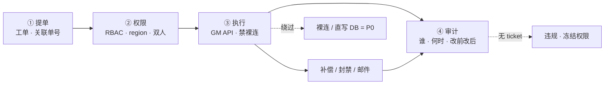
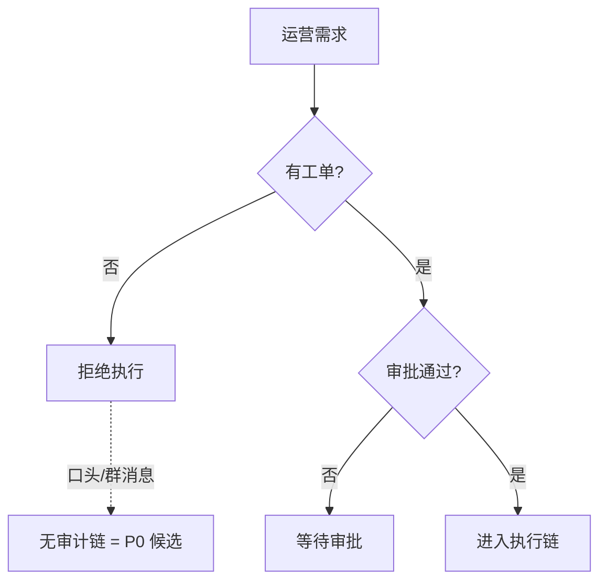
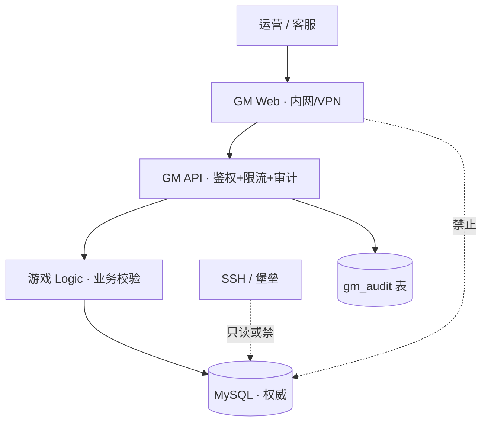
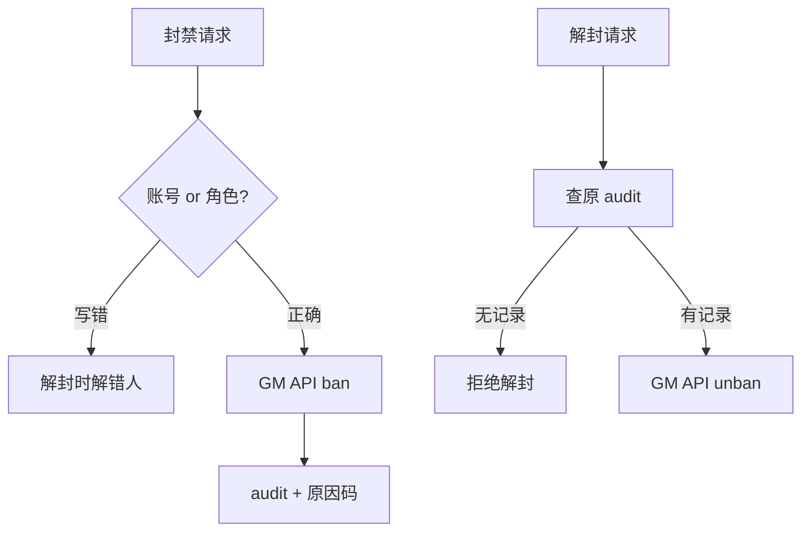
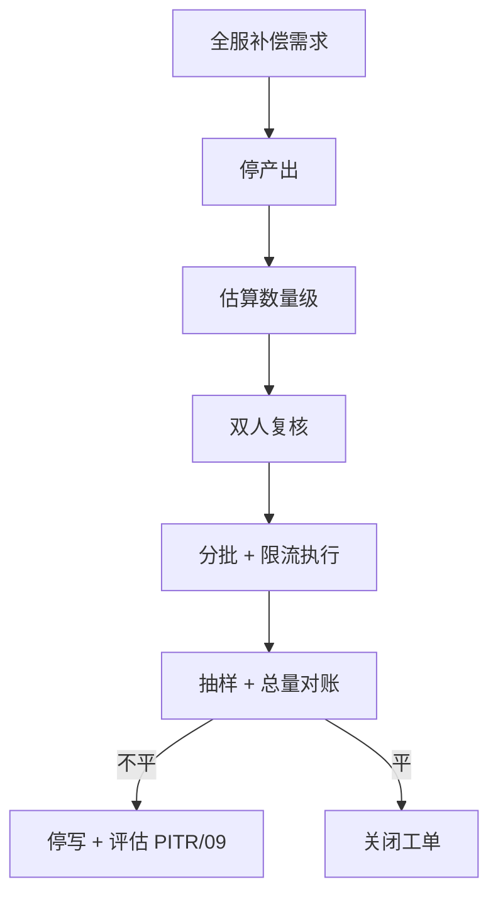
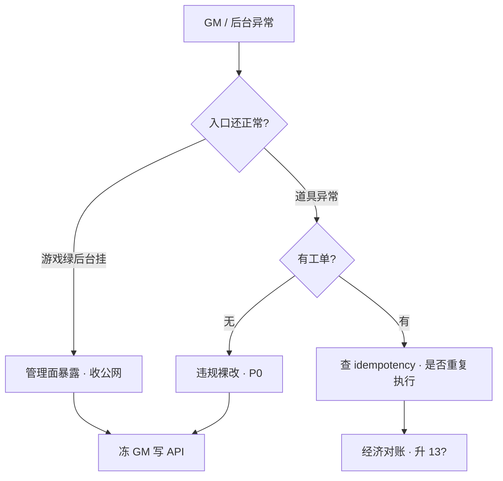

# GM 工具与运营支撑

> 运营群喊「给 uid 12345 补 648 钻」，策划已经 SSH 上生产准备 `UPDATE`；GM 后台为「方便回家改邮件」开了公网，当晚被刷——游戏入口还绿。客服连点两次补偿，玩家到账 1296。
> **本章回答**：一次 GM 操作从提单 → 审批 → 权限 → 执行 → 审计 → 回滚会经历什么，每段什么会坏、值班第一刀是什么。
> **不讲**：堡垒机机制 → [01-28](../../01-基础底座/28-堡垒机与跳板机/)；回档粒度 → [09](../09-玩家数据备份与回档/)；SLO 定级 → [13](../13-游戏SRE稳定性/)；出海 GM 按 region → [15](../15-出海与多区域/)。

**标记**：🎯重点 · 🔥难点 · ⭐常考 · 🔧实操

---

## 一、一张图：GM 操作的一生

> 🎯 **一句话**：GM 不是「有个网页就能改库」——提单、权限、执行、审计四步缺一不可；补偿和封禁都要留痕、可对账。



- 📖 **读图**
  - 🛤️ 主线是**一次操作的一生**，不是「GM 后台有哪些菜单」
  - 🔐 **权限在执行之前**——没有审批的 execute = 裸连
  - 🧾 补偿/封禁/邮件都回到审计；审计无 `ticket_id` = 违规裸改

> 📝 **面试**：「GM 运维和 DBA 差别？」——「GM 改**玩家经济**，必须工单 + API + 幂等 + 审计；DBA 改**结构**，也要变更单，路径不同。」

本节对应练习题 Q1、Q9。

---

## 二、提单：工单是唯一入口 ⭐

> 🎯 **一句话**：生产写操作只从**工单**进——口头、群消息、私聊、电话都不算；工单要有 uid、服、道具、数量、原因、审批链。

- 🚨 **五种场景，第一刀一样：有工单吗？没有不执行**
  - 活动配错全服补钻 → 工单 + 范围锁 + 停产出
  - 单号误封要解封 → 先查审计再走解封
  - 充值不到账 → 先对支付库，不是 GM 凭空造单（[10](../10-充值支付链路保障/)）
  - 策划想 SSH「就改一行」→ 拒绝，走 GM API
  - 大主播直播催单 → 加急审批，**不能跳过**审批

- 🎫 **工单最小字段**
  - `uid` / 角色名 + `server_id`（禁止只写昵称）
  - 操作类型：补偿 / 封禁 / 解封 / 邮件 / 删物品 / 改活动
  - 道具 ID + 数量 / 封禁时长 + 原因码
  - 关联单号：支付订单号 / 客诉单号 / 活动 ID
  - 申请人 + 审批人（高风险双人）
  - 期望执行时间 + 是否可分批



- 📖 **读图**：绕过工单的 execute 没有审计链——出了资损无法追责，本身就是事故。

> 💡 **打个比方**：工单像处方——**没有处方就给药，出了事药房（审计）对不上账**。

> ⚠️ **别混**：**加急** ≠ **跳过**——直播压力、大主播、值班经理口头批准都要进工单留痕。

> 📝 **面试**：「口头需求执不执行？」——「不执行。再急也要工单 + 审批 + 关联单号。」

本节对应练习题 Q11。

---

## 三、审批：工单类型与审批链 ⭐

> 🎯 **一句话**：不同操作类型走不同审批链——单号补偿、全服补偿、永久封禁、删物品、回档级门槛逐级升高。

| 操作类型 | 审批链 | 典型 SLA |
|----------|--------|----------|
| 单号补偿（有上限） | 客服 → 运营主管 | 30min |
| 充值不到账补发 | 客服 → 对支付库 → 运营 | 15min |
| 全服 / 单服批量 | 运营 → 主管 + 运维双人 | 2h+ |
| 临时封禁 | 客服 / 安全 | 即时 |
| 永久封禁 | 安全 + 主管双人 | 4h |
| 解封 | 查原 audit → 主管 | 1h |
| 全服邮件 | 运营 + 主管双人 | 活动前 |
| 删物品 / 回档级 | 主管 + 运维 + 研发 | 变更级 |

- 🎬 **现场走一遍**（充值不到账，客服 @ 你）
  1. 要求客服建单，关联 `order_id`
  2. **只读**查支付库，结果贴回工单（[10](../10-充值支付链路保障/)）
  3. 审批通过后走 GM API——**不在群里说「已补」**，等 API 返回 + 审计写入
  4. 禁止让玩家「再点一次充值」——可能二次扣款

> 🔍 **现场**：查未发货订单 🔧

```bash
mysql -e "SELECT order_id, uid, status, paid_at, deliver_at FROM pay_orders \
  WHERE status='paid' AND deliver_at IS NULL ORDER BY paid_at DESC LIMIT 20;"
# 找对应 order_id 贴回工单  ← 对账依据是库，不是玩家截图
```

> 📝 **面试**：「补偿为什么要关联支付单？」——「GM 不能凭空造经济；幂等键绑 `order_id` 防重复发货。」

本节对应练习题 Q3。

---

## 四、权限：RBAC 与三套分离 ⭐🔥

> 🎯 **一句话**：**RBAC（Role-Based Access Control）** + 最小权限 + 按 `region` / `server_id` 切开——GM 后台、堡垒机、DB 三套权限不要混成一张「超级管理员」。

| 角色 | 能做 | 不能做 |
|------|------|--------|
| 客服只读 | 查角色、订单、登录 | 写背包、封禁 |
| 客服标准 | 单号补偿（有日上限） | 全服补偿、改数值表 |
| 运营标准 | 单号补偿、定向邮件 | 全服补偿、裸连 DB |
| 运营主管 | 批量补偿（需双人） | 永久封、删物品无复核 |
| 运维 | 执行已审批工单、紧急封禁 | 无工单改经济 |
| 研发 | 只读 + 测试环境写 | 生产 GM 超级权限 |
| 安全 | 封禁 / 解封（有审计） | 补偿（除非审批） |

- 🔐 **权限三件套（分开管理）**
  - ① GM Web/API 角色
  - ② 堡垒机 / SSH 组
  - ③ DB 账号（生产只读或禁直连）

> ⚠️ **别混**：**GM 权限** vs **堡垒机权限** vs **DB 账号**——临时开「只放我的 IP」会忘关，走堡垒 + **过期策略**（≤24h 自动回收）。

> 📝 **面试**：「新人客服要和管理员一样权限方便值班？」——「拒绝。最小权限；临时提权要过期 + 审计 + 双人。」

本节对应练习题 Q1。

---

## 五、权限：GM 不写库架构 🔥⭐

> 🎯 **一句话**：GM Web 只调 **GM API**；Logic 做业务校验；**禁止** Web 或人直连 DB——架构红线，不是「方便不方便」。



- 📖 **读图**
  - 🛣️ 所有写路径经过 **Logic 业务校验**（道具存在、数量上限、状态机、封禁态）
  - 🧾 **审计在 API 层统一写**——格式一致
  - 🚨 Web 直连 DB = 绕过校验 + 幂等 + 标准审计

- ✅ **Logic 校验清单**（补偿）
  - uid 存在且 `server_id` 匹配
  - 订单 `status=paid` 且 `deliver_at IS NULL`
  - 补偿数量 ≤ SKU 上限
  - 账号未封禁 / 未锁号
  - `idempotency_key` 未执行过

#### ❓ 为什么 GM 不能直连 DB？

- ❌ **直连**：无校验、无幂等、无标准审计 → 资损无法追责
- ✅ **API → Logic**：业务规则 + 幂等 + 审计格式统一
- 🧪 **测试环境也要走同一 API**——「测试脚本」复制到生产 = P0
- 🏦 Logic 像银行柜员：**GM Web 是排队机，不能直接打开金库改账本**

> 📝 **面试**：「GM 为什么不能直连 DB？」——「无校验、无幂等、无标准审计；Logic 是权威入口。」

本节对应练习题 Q3。

---

## 六、权限：双人复核与临时权限 🔥

> 🎯 **一句话**：高风险操作必须双人——第二人不是「点同意」，要核对 uid 范围、数量级、是否关联支付单；临时全球写权限 = 变更，必须过期。

- 👥 **双人复核清单**
  - 全服 / 单服批量补偿
  - 永久封禁 / 大规模解封
  - 删除道具 / 回档级操作
  - 修改活动配置产出
  - 临时开跨 region 写权限

- 🎬 **现场走一遍**（永久封 500 个外挂号，一人点完提交）
  1. 拒绝单人提交——第二人核对 uid 列表来源（外挂证据 ID）
  2. 核对数量级：500 条 vs 预期 500 条，不是「大约五百」
  3. 执行后抽样 10 条查 audit `before_json` / `after_json`
  4. 误封要有**批量解封预案**（同样双人）

- ⏳ **临时权限模板**
  - 申请人 / 复核人 / 权限范围（`region` / `server_id`）
  - 过期时间（必填，≤24h）
  - 关联工单号 + 回收确认人

> ⚠️ **别混**：**美西 oncall 不该写欧区角色库**——见 [15](../15-出海与多区域/)。临时全球写是应急，不是默认策略。

```bash
# GM 后台应只在内网/VPN 可达
curl -s -o /dev/null -w '%{http_code}\n' --connect-timeout 3 https://gm.example.com/health
# 000 或 timeout = 正常（公网不可达）
# 200 = 事故，管理面暴露  ← 游戏绿 ≠ 后台安全
```

本节对应练习题 Q2。

---

## 七、执行：补偿流程六步 🔧⭐🔥

> 🎯 **一句话**：补偿走 **GM API**，带幂等键和上限；关联支付库，不是 `UPDATE` 货币字段；执行后查支付库 + 审计表。

### 单号补偿六步

- 🎬 **现场走一遍**（充值不到账，运营要补 648 钻）
  1. 查支付库：订单 `PAY-20250901-xxx` = 已扣款、发货失败
  2. 工单关联该订单号；审批通过
  3. GM API 调用：

```json
POST /api/v1/compensate
{
  "order_id": "PAY-20250901-xxx",
  "uid": 12345,
  "server_id": "s1001",
  "item_id": "diamond",
  "qty": 648,
  "idempotency_key": "PAY-20250901-xxx",
  "ticket_id": "TK-20250901-001"
}
```

  4. Logic 校验：订单未发过货、uid 匹配、数量不超过 SKU
  5. 写背包 + 写审计表；返回 `execution_id`
  6. 客服回访确认到账；**禁止**让玩家「再点一次充值」

```bash
mysql -e "SELECT order_id, status, deliver_at FROM pay_orders WHERE order_id='PAY-20250901-xxx';"
# status=delivered, deliver_at 非空  ← 订单已发货

mysql -e "SELECT operator, action, idempotency_key, ts FROM gm_audit WHERE idempotency_key='PAY-20250901-xxx';"
# operator, before_json, after_json 齐全  ← 审计可追溯
```

> ⚠️ **别混**：**补偿** vs **回档** vs **GM 改数**——能补偿就不改历史；要回档走 [09](../09-玩家数据备份与回档/) 四件套。

本节对应练习题 Q5。

---

## 八、执行：封禁、解封与邮件 ⭐

> 🎯 **一句话**：封禁走 GM API + 原因码 + 审计；设备/IP 封走安全系统；解封必须查原 audit；全服邮件 = 高风险。

### 封禁 / 解封

- 🔒 **封禁要点**
  - 临时：GM API + 原因码 + 到期时间，到期自动解，写审计
  - 永久：双人复核，关联外挂证据 ID
  - 设备 / IP 封走安全系统，不在 Gate drop——见 [12](../12-游戏网络与对抗/)
  - **账号维度**还是**角色维度**要写清——解错维度 = 第二次事故



- 📖 **读图**：封禁先确认维度，再走 API + 审计；解封先查原 audit，无记录拒绝——防「解错人」。

#### ❓ 为什么封禁不能在 Gate drop？

- ❌ **Gate drop**：最快，但**无法审计**、无法对客诉、误伤无法追责
- ✅ **GM / 安全系统**：原因码 + 维度 + 到期 + audit
- 🧷 解封必须查原封禁 audit——无记录解封 = 违规
- 🧭 维度写错（账号封成角色）→ 解封时解错人

> ⚠️ **别混**：**Gate drop** ≠ **封禁**——前者是网络层私刑，后者是可追责的账号动作。

### 邮件 / 道具发放

- 带**模板 ID**，禁止自由 SQL 拼内容
- 全服邮件 = 高风险：双人 + 限流 + 可回滚方案
- 活动前测服走**同一 API** 验一遍
- 附件道具走 Logic 校验，不是直接 `INSERT`

> 📝 **面试**：「封禁能在 Gate 按包长 drop 吗？」——「不能。无审计、误伤无法追责；走安全系统。」

本节对应练习题 Q12。

---

## 九、执行：幂等、上限与限流 🔥⭐

> 🎯 **一句话**：**idempotency_key** 绑订单 / 工单号防重复执行；单号 / 单服 / 单日补偿有上限；全服操作要分批 + 限流。

### 幂等

```text
idempotency_key 来源：
- 补偿：pay order_id
- 邮件：ticket_id + template_id
- 封禁：ticket_id + uid + action

重复请求 → 返回同一 execution_id，不二次写背包
```

#### ❓ 为什么客服连点两次不该变成 1296？

- ❌ **无幂等**：两次 HTTP 成功 → 背包写两次 → 1296
- ✅ **同 key 第二次**：返回同一 `execution_id`，`status=duplicate`，不写背包
- 🔑 key 绑 `order_id` / `ticket_id`，不是绑「按钮点击次数」
- 🏦 像银行转账流水号——**同一流水号打两次，第二次只查回执**

```bash
mysql -e "SELECT execution_id, ts, result FROM gm_audit WHERE idempotency_key='PAY-20250901-xxx' ORDER BY ts;"
# 应只有一条有效写；第二条 status=duplicate  ← 幂等生效
```

### 上限与限流

- 单号补偿按 SKU / 日累计设上限，超限升级主管审批
- 单服批量按 CCU 比例估算，分批 + 限流执行
- 全服必须双人 + 停产出
- API 层 QPS 限流保护 Logic，排队不压垮游戏服务

本节对应练习题 Q7。

---

## 十、审计：四问与字段 ⭐🔥

> 🎯 **一句话**：**审计（audit）** 要回答四个问题：谁、何时、对哪个 uid、改前改后是什么——缺一项等于没审计。

```text
audit_id, operator, approver, action, target_uid, server_id
before_snapshot (JSON), after_snapshot (JSON)
ticket_id, order_id, idempotency_key, execution_id
ts, client_ip, region, result (success/duplicate/fail)
```

| 问题 | 字段 |
|------|------|
| 谁 | operator + approver |
| 何时 | ts |
| 对哪个 uid | target_uid + server_id |
| 改前改后 | before_snapshot + after_snapshot |

> 🔍 **现场**：事故后查「谁改的」 🔧

```bash
mysql -e "SELECT operator, action, target_uid, ts, ticket_id, \
  JSON_EXTRACT(before_snapshot,'$.diamond') AS before_d, \
  JSON_EXTRACT(after_snapshot,'$.diamond') AS after_d \
  FROM gm_audit WHERE target_uid=12345 ORDER BY ts DESC LIMIT 20;"
# 找到无 ticket_id 的行 = 违规操作，P0 候选  ← 审计第一刀
```

- 📦 **保留策略**：至少与客诉 / 支付争议周期对齐（常 **≥180 天**）；出海 region 数据不出域，见 [15](../15-出海与多区域/)

> ⚠️ **别混**：**日志** vs **审计**——日志可以采样丢弃；审计是合规和资损证据，**不可关、不可采样**。

本节对应练习题 Q7。

---

## 十一、审计：与日志的区别 🔥

> 🎯 **一句话**：日志用于排障和观测，可采样、可短保留；审计用于追责和对账，全量、长保留、不可篡改。

| | 应用日志 | GM 审计 |
|--|----------|---------|
| 目的 | 排障、性能 | 追责、合规、资损 |
| 采样 | 可以 | **不可以** |
| 保留 | 7～30 天常见 | ≥180 天 |
| 内容 | 可能无 before/after | 必须有快照 |
| 篡改 | 轮转覆盖 | append-only / 异地备份 |

- 🌍 **出海**：欧区 audit 不能打到国内 SaaS 日志平台——**审计存储也要按 region 驻留**

#### ❓ 为什么审计不能采样？

- 🧾 审计是**资损证据**——采样丢一行 = 那笔改账对不上
- 🔍 日志可以丢 1% 不影响排障趋势；审计缺一行就缺一笔追责链
- 🧷 无 `ticket_id` 的行本身就是违规信号——采样会把它「冲掉」
- 📦 长保留（≥180 天）对齐客诉 / 支付争议周期，不是「日志多放几天」

> 📝 **面试**：「审计和日志有什么区别？」——「审计不可采样、要改前改后、长保留；日志可采样排障。」

本节对应练习题 Q4。

---

## 十二、回滚：全服补偿门禁与对账 ⭐🔧

> 🎯 **一句话**：全服补偿前**停产出**、双人复核、估数量级、分批限流、执行后对账——没锁账就发，发完永远对不平。

- 🎬 **现场走一遍**（活动配错掉落，运营要「全服补 100 钻」）
  1. **停产出**（[03](../03-活动高峰与压测/)）——否则边补边产，永远对不平
  2. 评估影响 uid 范围：全服 vs 参与活动的子集
  3. 双人复核 + 数量级估算：`100 钻 × CCU 50万 = 5000 万钻`
  4. 分批执行 + 限流（如每批 1 万 uid），盯经济监控
  5. 对账：抽样 100 uid + 总量级 vs 预期



- 📖 **读图**：停产出是第一前提；对不平走 PITR / [09](../09-玩家数据备份与回档/) 回档，不是「再补一轮」。

> 💡 **打个比方**：全服补偿像发年终奖——**没锁账（停产出）就发，发完永远对不上**。

> 🔍 **现场**：对账抽样

```bash
curl -s 'http://prom:9090/api/v1/query?query=sum(game_diamond_total)' | jq -r '.data.result[0].value[1]'
# 对比补偿前 baseline + 预期增量  ← 差值应≈补偿总量
```

本节对应练习题 Q8。

---

## 十三、回滚：与回档边界 ⭐

> 🎯 **一句话**：能补偿就不改历史；单号锁号对冲；整服经济崩走 [09](../09-玩家数据备份与回档/)——GM 批量扣不是「简易回档」。

- 🧭 **怎么选**
  - 单号多发道具 → 锁号 + GM 扣回或补偿对冲
  - 配错活动产出 → 停产出 + 补偿或按角色 PITR
  - 整服经济崩 → 走 09 回档四件套，不是 GM 批量扣
  - 充值不到账 → GM 补偿关联 `order_id`
  - GM 公网被刷 → 冻写 + 审计 + 评估回档范围
- 🚨 **对不平怎么办**：**不要**「再补一轮找平」——停写、查范围、评估按角色 PITR 或 GM 对冲

> 📝 **面试**：「GM 补偿和回档怎么选？」——「能补偿不改历史；整服崩走 09；批量扣回不是回档。」

### 收束：GM 执行凭什么可控

```text
① 入口：工单 + 审批（口头不算）
② 通道：GM API → Logic 校验（禁裸连 / 禁 Web 写库）
③ 幂等：idempotency_key 绑订单 / 工单号
④ 上限：单号 / 单服 / 单日补偿上限
⑤ 审计：谁、何时、改前改后、关联单号
⑥ 对账：执行后查支付库 + 审计表 + 经济大盘
```

- 📖 **读图**
  - ①② 入口控制（工单和通道）
  - ③④ 执行控制（防重复和防超量）
  - ⑤⑥ 事后控制（留痕和核对）——前三件执行前拦，后三件执行后验

> ⚠️ **别混**：六件套保证**可追溯、可对账**，**不保证**「操作本身正确」——发错道具、封错人仍可能发生，靠 Logic 校验和双人复核在执行前拦。

> 📝 **面试**：「GM 执行怎么保证可控？」——「六件套：工单、API、幂等、上限、审计、对账；少一个就有 P0 候选。」

本节对应练习题 Q6、Q10。

---

## 十四、作战：GM 事故定责 🔧⭐

> 🎯 **一句话**：先查审计和工单，再查经济对账，最后才查「是不是被黑了」；游戏绿不等于后台安全。



- 📖 **读图**：先分「管理面暴露 vs 道具异常」；道具异常先查工单，再查幂等；管理面暴露直接冻写 API。

| 现象 | 先做 | 别做 |
|------|------|------|
| GM 公网被刷 | 收管理面；查 audit | 用登录成功率判后台 |
| 无工单大量发货 | 冻结 GM 写；查 operator | 继续「补完再说」 |
| 补偿重复到账 | 查 idempotency_key | 让玩家「别声张」 |
| 策划 SSH 改库 | P0；评估回档范围 | 「就一行」继续改 |
| 全服补偿后对不平 | 停产出；抽样对账 | 再补一轮「找平」 |
| 临时开全球写权限 | 立即回收；查 audit | 留成默认策略 |
| 直播催单无工单 | 拒绝；加急建单 | 口头先发了 |

### 60 秒剧本 🔧

```text
0–10s   GM 写是否还在发生？先冻写 API（不是关游戏登录）
10–30s  查 gm_audit 最近 50 条；有无 ticket_id
30–45s  锁涉及 uid / 服；对支付库和经济大盘
45–60s  升 13 定级；运营口径「正在核对资产」
```

> 🔍 **现场** 🔧

```bash
mysql -e "SELECT operator, action, target_uid, ts, ticket_id FROM gm_audit ORDER BY ts DESC LIMIT 50;"
mysql -e "SELECT order_id, status, uid FROM pay_orders WHERE status='paid' AND deliver_at IS NULL LIMIT 100;"
curl -s -H "Authorization: Bearer $GM_TOKEN" https://gm.internal/api/v1/health
# 只在内网/VPN；公网 curl 通 = 事故  ← 管理面暴露
```

本节对应练习题 Q13、Q14。

---

## 十五、收口

### 命令速查 🔧

```bash
# 最近 GM 操作
mysql -e "SELECT operator, action, target_uid, ts, ticket_id FROM gm_audit ORDER BY ts DESC LIMIT 50;"

# 未发货订单
mysql -e "SELECT order_id, status, uid FROM pay_orders WHERE status='paid' AND deliver_at IS NULL LIMIT 100;"

# 无工单违规操作
mysql -e "SELECT * FROM gm_audit WHERE ticket_id IS NULL OR ticket_id='' ORDER BY ts DESC LIMIT 20;"

# GM 公网可达性（办公网应失败）
curl -s -o /dev/null -w '%{http_code}\n' --connect-timeout 3 https://gm.public.example.com/
```

### 面试锚点 ⭐

| 问 | 30 秒答 |
|----|---------|
| GM 为什么不能直连 DB？ | 无校验、无幂等、无审计；Logic 是权威入口 |
| 补偿流程？ | 工单 → 审批 → 关联支付单 → API 幂等 → 审计 → 对账 |
| 双人复核哪些？ | 全服补偿、永久封、删物品、回档级 |
| GM 公网暴露？ | 管理面 CC 入口；游戏绿不等于后台安全 |
| 全服补偿前？ | 停产出、双人、估数量级、分批限流 |
| 和回档边界？ | 能补偿不改历史；整服经济崩走 09 |
| 审计四问？ | 谁、何时、哪个 uid、改前改后 |
| 口头需求？ | 不执行；加急也要工单留痕 |
| 出海 GM？ | 写权限按 region 切；audit 不出域 |
| 幂等键？ | 绑 order_id / ticket_id；重复不二次写 |

### 易错一句话对照

- 口头需求可以快改 → **错**，无工单不执行
- GM Web 能直连 MySQL 方便 → **错**，必须走 API + Logic
- 补偿就是 UPDATE 货币 → **错**，关联支付单 + 幂等
- 封禁在 Gate drop 最快 → **错**，见 12，Gate 私刑无法审计
- 临时开公网只放策划 IP → **错**，走堡垒 + 过期
- 全服补偿不用停产出 → **错**，边产边补对不平
- 审计可以采样 → **错**，审计不可关
- 解封不用查原记录 → **错**，查 audit 再解
- 直播压力可跳过审批 → **错**，加急不能跳过
- 测试环境可直连 DB → **错**，同 API 路径
- 对不平再补一轮 → **错**，停写评估 PITR
- 客服重复点会发两次 → **错**，幂等应 duplicate

### 数字墙

> 审计保留常 **≥180 天**；全服补偿前 **必停产出**；高风险操作 **双人复核**；GM 后台 **零公网**；临时提权 **≤24h** 过期；单号补偿日上限按 **SKU** 定。

---

## 合上书

对着第一节主图口述一遍，卡住就回对应小节。开头那个现场——SSH UPDATE、开公网、连点变 1296——各自错在哪，现在该能说清了。

- [ ] **默画主图**：提单 → 权限 → 执行 → 审计，标出绕过路径和违规出口（→ Q1 · Q9）
- [ ] 工单最少要哪些字段？口头 / 直播催单执不执行？（→ Q11）
- [ ] GM 为什么不能直连 DB？写路径是什么？（→ Q3）
- [ ] 哪些操作要双人复核？临时权限要什么字段？（→ Q2）
- [ ] 补偿六步？为什么要 `idempotency_key`？（→ Q5 · Q7）
- [ ] 封禁能在 Gate drop 吗？解封要注意什么？（→ Q12）
- [ ] 审计四问？和日志有什么区别？（→ Q4 · Q7）
- [ ] 全服补偿前五步？对不平怎么办？（→ Q8）
- [ ] GM 公网被刷、游戏入口还绿，说明什么？（→ Q13）
- [ ] GM 补偿和回档怎么选？可控六件套是哪些？（→ Q6 · Q10 · Q14）

下一章：[出海与多区域](../15-出海与多区域/)。
