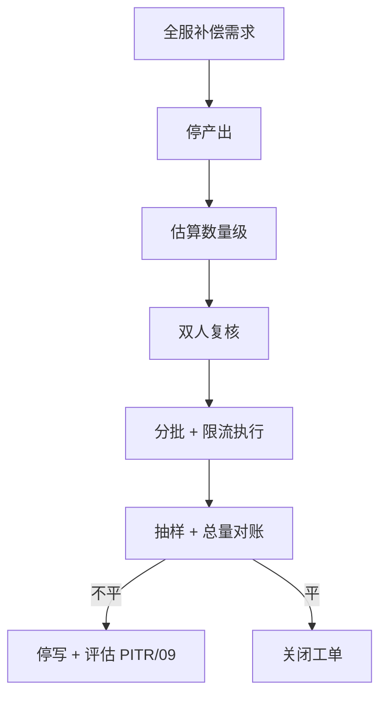

# 14｜GM 工具与运营支撑 · 练习题

先合上知识点，对着 **一节的主图** 把「GM 操作的一生」口述一遍（提单 → 权限 → 执行 → 审计 → 回滚），再来做题。

| 标记 | 含义 |
|------|------|
| **核心** | 不懂整章就没建立起来 |
| **必会** | 值班和面试都要能讲 |
| **常用** | 线上会反复碰到 |
| **常考** | 白板和追问的高频口径 |

## 本题目录

- [Q1 GM 为什么不能直连 DB](#q1)
- [Q2 补偿流程与幂等](#q2)
- [Q3 权限与双人复核](#q3)
- [Q4 全服补偿门禁](#q4)
- [Q5 封禁与解封](#q5)
- [Q6 GM 公网暴露](#q6)
- [Q7 审计四问](#q7)
- [Q8 与回档边界](#q8)
- [Q9 运营口头需求](#q9)
- [Q10 出海 GM 权限](#q10)
- [Q11 工单审批链](#q11)
- [Q12 幂等与重复执行](#q12)
- [Q13 60 秒 GM 事故定责](#q13)
- [Q14 GM 白板综合题](#q14)
- [合上书](#合上书)

---

## Q1

**★★★★★｜GM 工具为什么不能直连 production MySQL？正确写路径是什么？**

**覆盖**：核心 · 必会 · 常考 ｜ **对应**：知识点 [五、权限：GM 不写库架构](知识点.md)

### 场景

策划说「GM 后台连库改一行最快，API 还要走审批」。简历写了「维护 GM 系统」，但说不清数据怎么流到 Logic。

### 完整解答

> 🎯 **一句话**：GM 走 Web → API → Logic 校验 → DB，禁止 Web 或人裸连库。

直连 DB 没有业务校验（道具上限、状态机）、没有幂等、没有标准审计——出了资损无法追责。正确路径：运营工单 → GM Web（内网）→ GM API（鉴权 + 限流 + 审计）→ 游戏 Logic 做校验 → 写 MySQL。审计在 API 层统一写，Logic 只负责业务。

> 📝 **面试**：「GM 不是网页连库。Logic 是权威入口，审计在 API 层统一写。」

### 再追问

测试环境可以直连吗？——测试环境也要走同一 API，否则「测试脚本」复制到生产就是 P0。

---

## Q2

**★★★★★｜充值不到账，补偿流程怎么走？为什么要 idempotency_key？**

**覆盖**：核心 · 必会 · 常考 ｜ **对应**：知识点 [七、执行：补偿流程六步](知识点.md)

### 场景

玩家扣款成功、道具没到。客服在群里 @ 你「补 648 钻」。有人让玩家「再点一次充值试试」。完整链路见 [10](../10-充值支付链路保障/)。

### 完整解答

> 🎯 **一句话**：补偿关联支付单、走 GM API 幂等执行、禁止让玩家重复支付。

1. 查支付库：订单已扣款、发货失败。
2. 工单关联 order_id；审批通过。
3. GM API：`compensate(..., idempotency_key=order_id)`。
4. Logic 校验未发货、uid 匹配；写背包 + 审计。
5. 禁止「再点一次充值」——可能二次扣款。

```bash
mysql -e "SELECT order_id, status, deliver_at FROM pay_orders WHERE order_id='PAY-20250901-xxx';"
# status=delivered, deliver_at 非空 ← 订单已发货

mysql -e "SELECT operator, action, idempotency_key, ts FROM gm_audit WHERE idempotency_key='PAY-20250901-xxx';"
# operator, before_json, after_json 齐全 ← 审计可追溯
```

> ⚠️ **别混**：补偿不是 UPDATE 货币字段；不能凭空造支付单。

### 再追问

客服重复点了两次执行？——idempotency_key 相同，第二次应返回 duplicate，不重复发货。

---

## Q3

**★★★★★｜GM 权限怎么拆？哪些操作要双人复核？**

**覆盖**：核心 · 必会 · 常考 ｜ **对应**：知识点 [四、权限：RBAC 与三套分离](知识点.md)

### 场景

新人客服要有「和生产运维一样的 GM 权限」方便值班。晚上要永久封 500 个外挂号，一个人点完提交。

### 完整解答

> 🎯 **一句话**：RBAC 最小权限按角色切，高风险双人复核，三套权限（GM/堡垒/DB）不混。

客服只读；标准补偿有上限；全服补偿、永久封禁、删物品、回档级操作要双人。第二人核对 uid 范围、数量级、关联单号，不是盲点同意。权限三件套分开管理：GM Web/API 角色、堡垒机/SSH 组、DB 账号——临时开「只放我的 IP」会忘关，走堡垒 + 过期策略（24h 自动回收）。

> 📝 **面试**：「临时开超级管理员是 P0 候选。美西值班不该写欧区库，见 15。」

### 再追问

应急能不能临时开全球写？——当变更：过期时间、审计、双人；不要留成默认。

---

## Q4

**★★★★☆｜活动配错掉落，全服补偿前要做什么？**

**覆盖**：必会 · 常用 ｜ **对应**：知识点 [十二、回滚：全服补偿门禁与对账](知识点.md)

### 场景

活动多写了一个零，运营要「全服补 100 钻」。有人说「先发，对账以后再说」。活动还在进行中。

### 完整解答

> 🎯 **一句话**：全服补偿前停产出、双人复核、估数量级、分批限流、执行后对账。

不停产出边补边产，永远对不平。100 钻 × CCU 要先估算。分批 + 限流，盯经济监控。抽样 uid + 总量级校验。



> 💡 **打个比方**：没锁账就发年终奖，发完永远对不上。

### 再追问

对不平怎么办？——不要「再补一轮找平」；停写、查范围、评估按角色 PITR 或 GM 对冲，见 09。

---

## Q5

**★★★★☆｜封禁和解封要注意什么？能在 Gate drop 吗？**

**覆盖**：必会 · 常用 ｜ **对应**：知识点 [八、执行：封禁、解封与邮件](知识点.md)

### 场景

同一加速出口数千新设备创角。有人要在 Gate 按包长 drop。另有人要解封主播号，但查不到原封禁记录。

### 完整解答

> 🎯 **一句话**：封禁走 GM API + 原因码 + 审计，解封查原记录，Gate drop 无法审计。

临时 / 永久封禁写审计；永久封要双人。设备 / IP 封走安全系统，不在 Gate 私刑 drop（见 12）。解封必须查原 audit，无记录解封 = 违规。封禁是账号维度还是角色维度要写清——解错维度是第二次事故。

> ⚠️ **别混**：Gate drop 最快但无法审计、无法对客诉。

### 再追问

封账号还是封角色？——写清维度；解错维度是第二次事故。

---

## Q6

**★★★★☆｜GM 后台开公网「方便回家改邮件」，当晚被刷，游戏入口还正常，说明什么？**

**覆盖**：必会 · 常用 ｜ **对应**：知识点 [十四、作战：GM 事故定责](知识点.md)

### 场景

GM 后台公网可访问。游戏登录成功率 99%。运营说「玩家没事，后台刷一下而已」。

### 完整解答

> 🎯 **一句话**：管理面暴露是独立事故；游戏绿不等于后台安全，登录成功率不能判后台。

GM、K8s API、DB 是 CC 和被黑捷径。必须内网 + VPN / 堡垒。管理面被打时玩家入口可以仍是绿的。公网只留玩家入口和 CDN，见 12。

> 📝 **面试**：「登录成功率判断 GM 后台安全 = 方向错了；管理面是独立 CC 入口。」

### 再追问

先关 GM 还是先看审计？——同时：冻 GM 写 API + 查 audit 最近操作，评估经济影响。

---

## Q7

**★★★★☆｜审计要回答哪四个问题？和日志有什么区别？**

**覆盖**：必会 · 常考 ｜ **对应**：知识点 [十、审计：四问与字段](知识点.md)

### 场景

事故后查「谁给 uid 12345 发了 10 万钻」。gm_audit 只有 operator 和 ts，没有改前改后。

### 完整解答

> 🎯 **一句话**：审计四问：谁、何时、对哪个 uid、改前改后；不可采样丢弃，区别于日志。

| 问题 | 字段 |
|------|------|
| 谁 | operator + approver |
| 何时 | ts |
| 对哪个 uid | target_uid + server_id |
| 改前改后 | before_snapshot + after_snapshot |

缺 before/after 等于无法证明资损范围。审计保留 ≥ 客诉周期（常 180 天）。日志可采样；审计是合规和资损证据。

> ⚠️ **别混**：日志可以采样丢弃；审计不可关、不可采样。

### 再追问

无 ticket_id 的行说明什么？——违规裸改，P0 候选，立即冻结该 operator 权限。

---

## Q8

**★★★☆☆｜GM 补偿和回档怎么选？**

**覆盖**：常用 · 常考 ｜ **对应**：知识点 [十三、回滚：与回档边界](知识点.md)

### 场景

单号多了 1000 钻 vs 整服活动产出翻倍。有人提议「GM 批量扣回」。

### 完整解答

> 🎯 **一句话**：能补偿不改历史；单号锁号对冲；整服经济崩走 09 回档不是 GM 批量扣。

单号：锁号 + GM 扣回或补偿对冲。配错活动：停产出 + 补偿或按角色 PITR。整服崩：回档四件套，禁止 GM 批量扣当「简易回档」——批量扣没有快照、没有审计格式、没有 PITR 粒度。对不平不要「再补一轮找平」；停写、查范围、评估按角色 PITR 或 GM 对冲。

> 📝 **面试**：「GM 补偿和回档怎么选？——能补偿不改历史；整服崩走 09；批量扣回不是回档。」

### 再追问

扣回和补偿哪个优先？——能明确多发的，扣回；影响范围不清的，先停写再定粒度。

---

## Q9

**★★★☆☆｜运营在群里 @ 你「快给 uid 补发」，执不执行？**

**覆盖**：必会 · 常考 ｜ **对应**：知识点 [二、提单：工单是唯一入口](知识点.md)

### 场景

大主播直播，客服在群里喊「快补，粉丝看着呢」。工单系统还没建单。值班经理电话里说「先发了再说」。

### 完整解答

> 🎯 **一句话**：口头 / 群消息 / 电话不执行；再急也要工单 + 审批 + 关联单号。

没有工单就没有审计链，出了事无法追责。可以加急审批，不能跳过审批。直播压力不是裸改理由。值班经理口头批准也要进工单留痕——口头不留痕等于没批。

> ⚠️ **别混**：加急 ≠ 跳过——加急是缩短审批 SLA，不是跳过审批链。

### 再追问

加急审批 SLA 怎么定？——单号补偿 15～30min，全服仍要双人。

---

## Q10

**★★★☆☆｜出海 GM 写权限怎么切？**

**覆盖**：常用 · 常考 ｜ **对应**：知识点 [六、权限：双人复核与临时权限](知识点.md)

### 场景

美西 oncall 拿着全球写权限改欧区背包。拨测从国内办公网出，看板显示全球正常。

### 完整解答

> 🎯 **一句话**：GM 写权限按 region 切，跨 region 只读 + 审计，拨测放玩家网。

美西值班不该对欧区角色库有写。跨 region 查询走只读 + 审计。临时全球写要过期 + 双人。合规也是误操作半径控制。见 15 数据驻留。

### 再追问

欧区 audit 能不能打到国内 SaaS？——默认不出域，审计存储也要按 region。

---

## Q11

**★★★★☆｜不同 GM 操作类型的审批链有什么区别？**

**覆盖**：必会 · 常用 ｜ **对应**：知识点 [三、审批：工单类型与审批链](知识点.md)

### 场景

客服想发全服邮件「活动延期通知」，走了单号补偿的审批链，主管一人通过就发了。

### 完整解答

> 🎯 **一句话**：全服邮件 / 批量补偿 / 永久封禁 / 删物品审批链逐级升高，不能走单号补偿捷径。

| 操作 | 审批 |
|------|------|
| 单号补偿 | 客服 → 主管 |
| 全服邮件 | 运营 + 主管双人 |
| 永久封禁 | 安全 + 主管双人 |
| 删物品 | 主管 + 运维 + 研发 |

全服邮件带附件道具 = 经济风险，要双人 + 模板 ID + 测服验证。

### 再追问

紧急永久封 500 人能否单人？——不能。可加快审批，不能跳过第二人核对 uid 列表。

---

## Q12

**★★★☆☆｜幂等键怎么设计？API 限流和上限怎么配合？**

**覆盖**：常用 ｜ **对应**：知识点 [九、执行：幂等、上限与限流](知识点.md)

### 场景

同一 order_id 被两个客服分别建了两张工单，几乎同时点执行。GM API 没有 idempotency_key。

### 完整解答

> 🎯 **一句话**：idempotency_key 绑 order_id / ticket_id，重复请求返回 duplicate 不二次写。

```text
idempotency_key 来源：
- 补偿：pay order_id
- 邮件：ticket_id + template_id
- 封禁：ticket_id + uid + action
```

API 层先查 audit 是否已存在 key。两个工单同一 order_id = 应只有第一次成功，第二次 duplicate；若发了两次 = 幂等缺失 P0。上限：单号日累计、单服批量、API QPS 限流保护 Logic。

> 💡 **打个比方**：幂等像银行转账流水号——同一流水号打两次，第二次只是查回执。

### 再追问

两个不同 ticket_id 同一 order_id？——order_id 仍作幂等键，第二 ticket 应被拒绝并提示已处理。

---

## Q13

**★★★★☆｜60 秒 GM 事故定责剧本**

**覆盖**：必会 · 常用 ｜ **对应**：知识点 [十四、作战：GM 事故定责](知识点.md)

### 场景

凌晨 audit 告警：过去 10 分钟 500 条无 ticket_id 的发货记录。游戏登录 99%。运营问「要不要关游戏」。

### 完整解答

> 🎯 **一句话**：先冻 GM 写 API（不关登录），查 audit 找 operator，锁涉及 uid，对账升 13。

```text
0–10s  冻 GM 写 API；写是否仍在继续
10–30s SELECT audit 最近 50 条无 ticket_id；锁 operator 权限
30–45s 抽样 uid 背包 + 支付库 + 经济大盘
45–60s P0 资损候选；运营口径「正在核对资产」；评估 09 回档范围
```

```bash
mysql -e "SELECT operator, action, target_uid, ts, ticket_id FROM gm_audit ORDER BY ts DESC LIMIT 50;"
mysql -e "SELECT order_id, status, uid FROM pay_orders WHERE status='paid' AND deliver_at IS NULL LIMIT 100;"
curl -s -H "Authorization: Bearer $GM_TOKEN" https://gm.internal/api/v1/health
# 只在内网/VPN；公网 curl 通 = 事故 ← 管理面暴露
```

> ⚠️ **别混**：关游戏登录不能阻止 GM 写（若攻击者仍有 API token）。

### 再追问

发现是策划 SSH 改库？——同样 P0；SSH 权限回收；audit 可能不完整，靠 DB binlog + 09 评估。

---

## Q14

**★★★★★｜GM 白板综合题：画操作一生**

**覆盖**：核心 · 常考 ｜ **对应**：知识点 [一、一张图：GM 操作的一生](知识点.md) 全章

### 场景

面试官：「GM 运维怎么做？为什么不能直连 DB？全服补偿要注意什么？」

### 完整解答

> 🎯 **一句话**：默画：提单 → 权限 → 执行 → 审计 → 回滚；六件套：工单、API、幂等、上限、审计、对账。

**提单**：口头不执行；uid+server_id+关联单号。

**权限**：RBAC；GM/堡垒/DB 三套；双人复核高风险；零公网。

**执行**：Web→API→Logic→DB；补偿绑 order_id；封禁不走 Gate drop。

**审计**：四问；不可采样；≥180 天。

**回滚**：全服补偿停产出、双人、分批、对账；能补偿不改历史，整服崩走 09。

> 📝 **面试**：补一句——「游戏绿不等于 GM 安全；管理面是独立 CC。」

### 再追问

GM 和 13 SLO 关系？——GM 资损可升 P0；登录 SLI 不能判断 GM 后台安全。

---

## 合上书

- [ ] 能默画 GM 操作一生：提单 → 权限 → 执行 → 审计 → 回滚
- [ ] 能讲 GM Web → API → Logic → DB，禁止裸连
- [ ] 能走补偿全流程：工单、支付单、幂等、审计、对账
- [ ] 能列双人复核项和 RBAC 分层
- [ ] 能讲全服补偿前停产出 + 估数量级
- [ ] 能分 GM 补偿 vs 回档；GM 公网 vs 游戏入口
- [ ] 能答审计四问；口头 / 直播催单不执行
- [ ] 能口述 60 秒 GM 事故剧本
- [ ] 能讲 GM 执行可控六件套
- [ ] 能说出海 GM 按 region 切权限、audit 不出域
- [ ] 能讲审计和日志的区别（采样 / 保留 / before-after）
