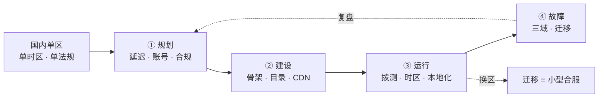
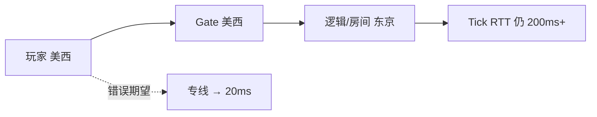
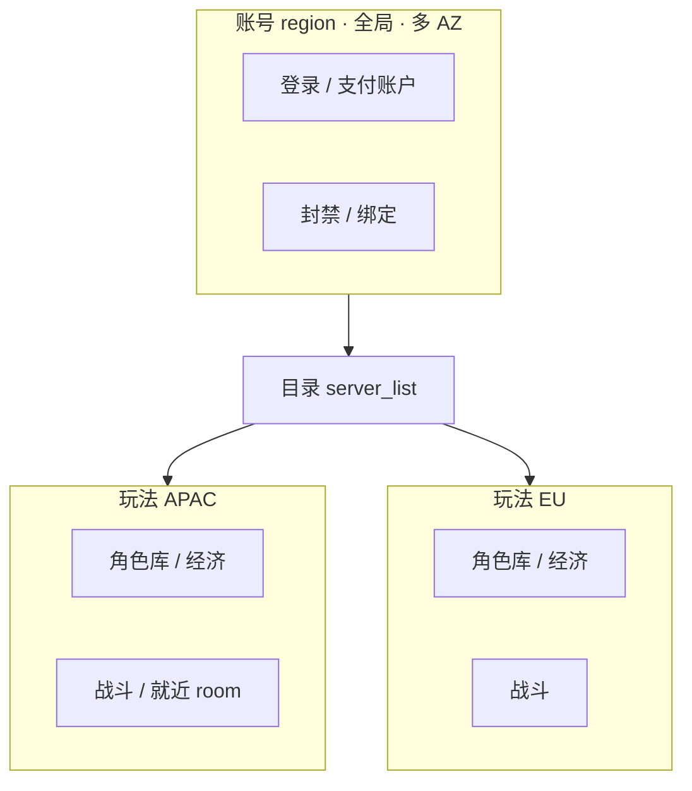
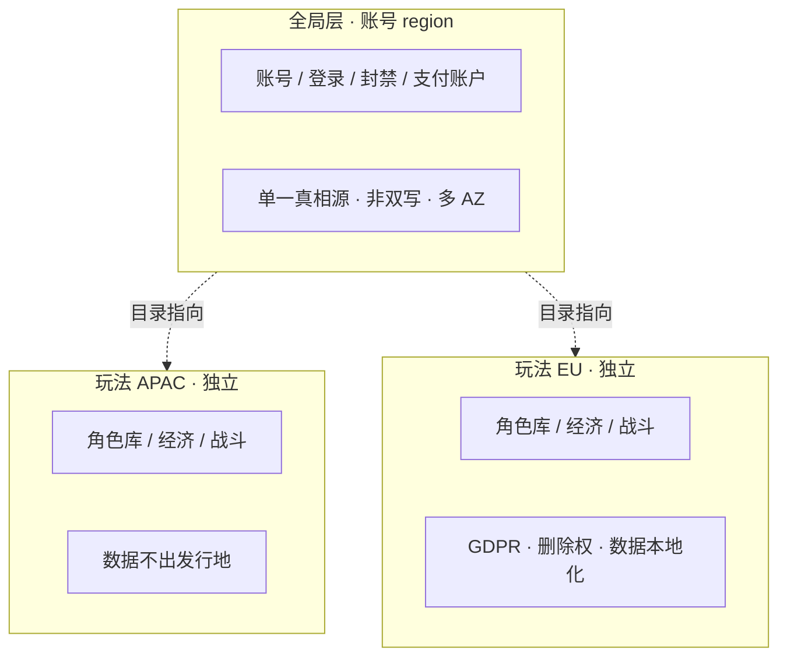
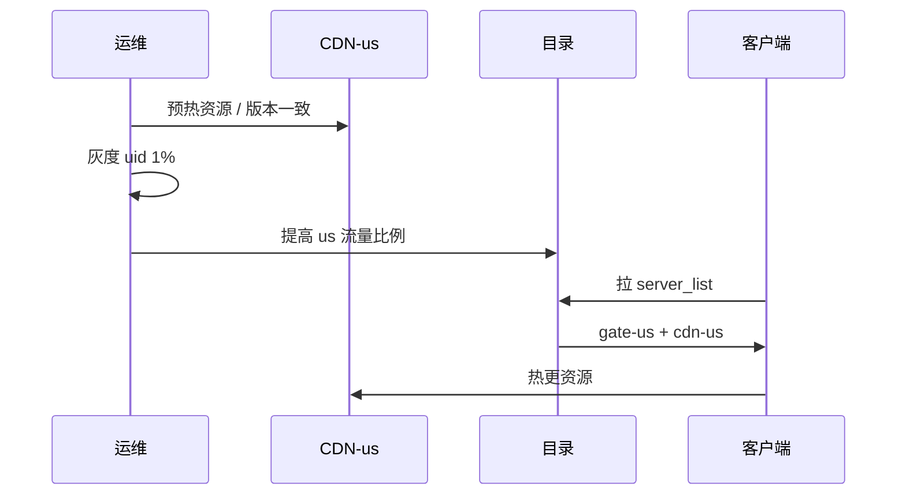
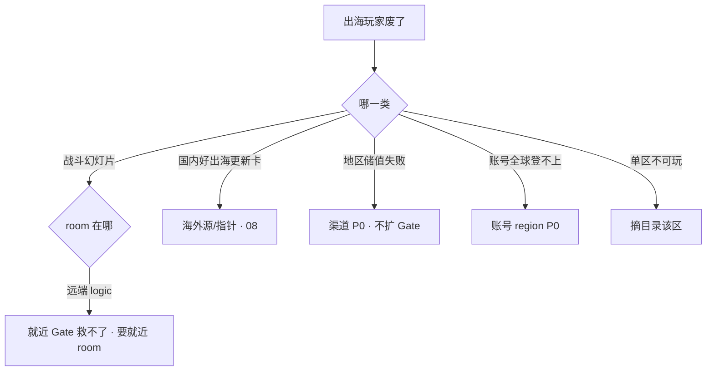

# 出海与多区域

> 大家好，欢迎来到这次分享。开讲之前，先带大家回到一个现场：
> 美西玩家打日服卡成幻灯片，有人说上专线就能把 200ms 变 20ms。欧区备份 S3 跨 region 复制一勾，PII 出了发行地。北京 05:00 cron 给美西合服，美西还在黄金时段。群里有人要 `UPDATE region='us'` 给玩家换区。
> 这一章讲完，你会知道当时「专线把 200ms 变 20ms」和「UPDATE region 换区」各自错在哪，以及三域止血怎么互斥。
> **本章回答的问题**：一个游戏从国内到出海会经历什么——规划定边界、建设搭骨架、运行守延迟和合规、故障分三域止血。
> **本章不讲**：CDN 预热细节 → [08](../08-CDN与资源更新/)；迁角色步骤 → [06](../06-开服合服/)；主机双活理论 → [01-33](../../01-基础底座/33-高可用与容灾/)；加速器失真 → [12](../12-游戏网络与对抗/)；云平台 region/VPC 细节 → [07-AWS生产](../../06-云平台/07-AWS生产/)、[09-多云对照](../../06-云平台/09-多云对照/)。

**标记**：🎯重点 · 🔥难点 · ⭐常考 · 🔧实操

**怎么听这场分享**：先把第一节「出海的一生」看熟——规划→建设→运行→故障；第二到第十节顺着延迟、账号、合规、骨架、时区走，第十一到第十四节讲三域止血与换区。每一节讲完会提示对应练习题，趁热打铁。

---

## 一、一张图：出海的一生

> 🎯 **一句话**：出海不是在国内架构上多买几个 region——规划定边界，建设定骨架，运行守延迟和合规，故障分三域；换区是合服不是改字段。



**读图**：主线是一个游戏从国内单区到出海的一生。**目录**是运行和故障时的总闸——先查目录指哪，不是先猜 DNS。**迁移**挂在运行期——换区是作业，不是 `UPDATE region` 字段。**复盘**回规划，不是打完就散。

> 📝 **面试**：「没做过真出海怎么答？」——讲国内多 AZ 和方案边界，标明未执刀；不编 region 切流故事。


好，主图装进脑子了。接下来从「规划」开始——延迟物理与玩法预算。

本节对应练习题 Q1。

---

## 二、规划：延迟物理与玩法预算

🔥 大白话：**光速有下限，专线降的是抖动和丢包，不是把跨洋 RTT 削成同城**。玩法要按延迟预算选型（就近房间 / 异步）。

> 🎯 **一句话**：跨洋 150～250ms 消不掉；专线稳丢包不消光速；实时对战必须就近匹配、就近 room——不是就近 Gate + 远端逻辑。⭐🔥

跨洋延迟是物理下限。同城 10～30ms，同大陆跨城 30～80ms，跨大陆/跨洋 150～250ms+。专线修平坑（降抖动、稳丢包），不能把洛杉矶和东京拉近。

| 玩法类型 | 延迟预算 | 架构要求 |
|----------|----------|----------|
| 卡牌 / 回合 / 异步 | 100～200ms 可玩 | 可跨 region 匹配（慢档） |
| 操作类 MMO | 抖动比平均 RTT 敏感 | 同 region 房间 |
| 实时对战 / FPS | ~50ms 舒适 | **必须就近 room** |
| 弱网位置同步 | UDP/KCP 另算 | 见 [12](../12-游戏网络与对抗/) |



**读图**：Gate 就近只改善握手和大包下载；**战斗 Tick 往返**仍受逻辑/room 所在 region 约束。专线降抖动、稳丢包，不缩光速距离。

> 💡 **打个比方**：跨洋延迟像洛杉矶到东京的物理距离——**专线是修高速公路的坑，不是瞬移**。

> ⚠️ **别混**：**就近 Gate** vs **就近 room**——Gate 在美西、room 在东京，Tick 仍 200ms+。产品卖「全球同服无延迟」= 架构谎言。

> 🔍 **现场**：分地区拨测（注意：办公网 ≠ 玩家网）

```bash
# HTTPS 登录入口（美西探针）
curl -o /dev/null -s -w 'us_login:%{time_total}s\n' https://gate-us.example.com/health
# us_login:0.045s   ← 仅握手段；战斗 UDP 另测

# 战斗 TCP 端口
nc -zv battle-us.example.com 9001
# 通 ≠ UDP 通；高防/SG 可能 TCP 通 UDP 不通（见 12）
```

> 📝 **面试**：「专线能把 200ms 变 20ms 吗？」——不能；稳丢包不消光速；实时玩法就近 room。


延迟讲完。大家想想：专线能不能把跨洋 200ms 变 20ms？很多人会答「能」——⭐ 这是高频错答。

本节对应练习题 Q1。

---

## 三、规划：账号全局与角色分区

> 🎯 **一句话**：账号全局、角色落 region——登录/支付/封禁走账号层；背包/进度/区服经济在玩法 region；目录告诉客户端去哪。⭐

**账号 region（全局层）**：账号、登录、支付账户、渠道绑定、全局封禁。多 AZ，SLO 最严（全球进门）。

**玩法 region（分区层）**：角色、背包、进度、区服经济、就近战斗、本服支付发货。每个 region 独立经济单元。

**目录**：告诉客户端去哪个 region 的哪条 server_id。



**读图**：

1. **没有** APAC 与 EU 角色库之间的双写箭头——跨区数据同步只发生在账号层（单一真相源），角色数据不跨 region。
2. 写路径（扣费、发货、结算）必须落在**角色所在 region**。
3. 远 region **只读副本**可以给排行/展示，**不能写背包**。

游戏几乎不做「两个 region 双活写同一角色库」。有状态 + 经济对账，冲突和回档都无法收场。

> 💡 **打个比方**：账号是护照——全球唯一，在哪都认；角色是银行账户——钱存在哪个国家就只能在那国取。

> ⚠️ **别混**：**分服（server_id）** vs **玩法 region**——一 region 可有多 server_id；换区跨 region = 迁移，不是改目录显示名。

> 📝 **面试**：「账号挂 vs 玩法 region 挂？」——账号挂全球 P0 登不上；玩法挂摘目录该区，其他 region 正常。


账号讲完。合规与数据驻留——备份勾选跨 region 就可能把 PII 带出境。

本节对应练习题 Q2、Q3。

---

## 四、规划：合规与数据驻留

⭐ 这是面试必考。备份「跨 region 复制」一勾，PII 可能出发行地——驻留不是口号，是路径上每一跳。

> 🎯 **一句话**：数据驻留按发行地，不是按机房在哪；GDPR 给删除权，数据本地化给物理隔离；跨区不同步角色数据；答「在 S3」不够，要说账号 + region + 有无复制。⭐🔥

### GDPR

**GDPR（General Data Protection Regulation）** = 欧盟通用数据保护条例，适用所有处理欧盟居民个人数据的服务，不限于欧盟公司。

核心要求：

- **删除权（right to erasure）**：玩家要求删号，必须彻底删除，不是软删标记
- **数据可携带权（data portability）**：玩家可要求数据导出为机器可读格式
- **跨境传输**：出欧盟需标准合同条款（SCC，Standard Contract Clauses）或充分性认定
- **72 小时违规通知**：发现数据泄露 72 小时内报告监管机构

> ⚠️ **别混**：GDPR 限制的是「跨境传输」和「处理目的」，不是强制数据存在欧盟境内——但数据本地化法是真的强制物理存。

### 数据本地化（data localization）

**数据本地化** = 部分国家/地区法律要求个人数据必须存储在本国境内服务器上。

- **俄罗斯**：个人数据必须首次录入俄罗斯境内数据库
- **中国 PIPL（个人信息保护法）**：个人信息出境需安全评估
- **印度 DPDP（数字个人数据保护法）**：数据受托者须在印度存储

数据本地化是物理隔离——不是 GDPR 的「限制出境」，是「必须在本国存」。

### 跨区数据同步

出海不是把国内数据同步到海外——每个 region 独立，全局的只有账号。数据回流（analytics、对账、排行汇总）走批处理脱敏，不走实时双写。

| 数据类型 | 跨区策略 | 理由 |
|----------|----------|------|
| 账号 / 封禁 | 全局，账号 region 单一真相源 | 非双写，读写都走账号层 |
| 角色数据 | 不同步，region 独立 | 有状态 + 经济，冲突无法收场 |
| 排行 / 展示 | 只读副本可跨区 | 只读不写，延迟可接受 |
| 支付对账 | 批处理聚合，非实时 | 跨区结算走离线，不在线双写 |

> 💡 **打个比方**：跨区数据同步像连锁银行——总行管客户身份（账号），各分行管本地账户（角色）；你不会让北京分行直接改上海分行的账本。数据回流像总行月底要报表——脱敏汇总，不是实时翻账本。

### 数据驻留与合规清单 🔧

**PII（Personally Identifiable Information）** = 可识别个人身份的信息。复制一开，PII 可能出发行地。

合规清单（规划期就要答）：

```text
□ 生产日志采集器 endpoint 在哪？默认不出发行地
□ 备份桶 region + 有无 cross-region replication
□ 客服能否下载整包玩家数据？审计在哪
□ 聊天 / 客服是否送境外大模型
□ 支付发货、GM audit 是否在可审计 region 完成
□ 云账号是否按发行主体拆分（非一个 Administrator 打全球）
```

答「数据在 S3」不够——要说**哪个账号、哪个 region、有没有跨账号 / 跨 region 复制**。

> 🔍 **现场**：查备份桶位置和复制

```bash
aws s3api get-bucket-location --bucket game-backup-eu
# eu-west-1   ← 应与发行地一致

aws s3api get-bucket-replication --bucket game-backup-eu
# 空 / 未配置 = 正常；有规则 → 合规评估
```

> ⚠️ **别混**：**数据驻留** vs **多 AZ**——国内三 AZ 不是真出海；多 AZ 保机房，跨洋保不了 RTT，也保不了合规。云平台 region/VPC 细节见 [07-AWS生产](../../06-云平台/07-AWS生产/)。

### 收束：多区域数据凭什么不出事



**读图**：上层是账号 region，全局唯一、非双写；下层是各玩法 region，独立经济、数据不出域。两层之间只有目录指向箭头，没有数据同步箭头。数据回流走批处理脱敏，不走实时双写。

出海数据可控的七条底线：

```text
① 账号全局、角色落 region，不跨洋双写角色库
② 数据驻留按发行地，不是按机房在哪
③ GDPR：删除权、可携带权、72h 违规通知
④ 数据本地化：俄罗斯/中国/印度有物理存储要求
⑤ 跨区同步：账号单一真相源；角色不同步；排行只读；数据回流走批处理
⑥ 备份说清账号 + region + 有无复制，默认关 replication
⑦ 云账号按发行主体拆，一个 Administrator 打全球 = 合规 + 误操作双爆
```

> ⚠️ **别混**：这套机制保证的是「数据不出域」「合规可审计」，**不保证**跨区实时一致——角色数据本来就允许各 region 各自为政，不强求全局一致。

> 📝 **面试**：「出海数据怎么管？」——账号全局单一真相源，角色落 region 不双写，合规按发行地，备份说清账号 + region + 复制，云账号按发行拆。


合规讲完。建设：region 最小骨架。

本节对应练习题 Q3、Q5。

---

## 五、建设：region 最小骨架

> 🎯 **一句话**：每个玩法 region 是独立经济单元——角色库、战斗、本服支付发货、独立 CDN 指针；账号 region 单独多 AZ。

region 最小骨架：

```text
1. 账号 region
   - 登录、绑定、封禁、支付账户
   - 多 AZ；SLO 最严（全球进门）

2. 每个玩法 region（APAC / EU / US …）
   - 角色库（独立 MySQL / 独立 shard）
   - 战斗进程池（就近 room）
   - 本服支付发货 Logic
   - 独立 CDN 指针与源站
   - 独立 GM 写权限域（见 14）

3. 目录
   - 聚合各 region gate / cdn / maintenance 标记
   - 可摘单一玩法 region，不影响全球登录

4. 备份
   - 落在该发行主体账号、该 region
   - cross-region replication 默认关，开之前合规评估

5. oncall
   - 跟随该发行当地时区
   - 变更冻结用当地活动整点（见 13 ±30min）
```

| 项 | 选 | 不选 |
|----|----|------|
| 实时玩法 | 就近匹配、就近 room | 就近 Gate + 远端 logic |
| 角色库 | region 独立；坏了维护 | 跨洋双活写 |
| 云账号 | 按发行主体拆 | 一个 Administrator 打全球 |
| 备份 | 同发行地账号 + region | 全球复制勾上再说 |
| 写路径 | 角色所在 region 发货结算 | 远 region 只读副本写背包 |

> 📝 **面试**：「多 region 最小骨架？」——账号 region 多 AZ + 每玩法 region 独立经济 + 目录 + 按 region CDN。先画游戏约束，再填云产品（[07-AWS生产](../../06-云平台/07-AWS生产/)）。


骨架讲完。目录、CDN 与云账号。

本节对应练习题 Q4、Q5。

---

## 六、建设：目录、CDN 与云账号

> 🎯 **一句话**：客户端听目录，不是写死 IP；每个 region 独立 CDN 源和指针；云账号按发行主体拆——一个 Administrator 打全球 = 合规 + 误操作双爆。

### 目录配置 🔧

```json
{
  "regions": {
    "apac": {
      "gate": "gate-apac.example.com",
      "cdn": "cdn-apac.example.com",
      "min_client_version": "1.2.100"
    },
    "eu": {
      "gate": "gate-eu.example.com",
      "cdn": "cdn-eu.example.com",
      "min_client_version": "1.2.100"
    },
    "us": {
      "gate": "gate-us.example.com",
      "cdn": "cdn-us.example.com",
      "maintenance": false
    }
  },
  "maintenance": { "eu": false, "us": true }
}
```

**读图**：`maintenance` 按 region 独立——摘 EU 不影响 US 登录（账号层仍要活）。

### CDN 分区

- 每个玩法 region **独立源站 + 指针**（见 [08](../08-CDN与资源更新/)）
- 避免一个源站给全球回源——开服/活动海外 CDN 回源打爆 = 登录 + 更新双事故
- 版本/资源指针按 region 独立发布

### 云账号拆分

```text
发行主体 A（国内）→ 云账号 A → 国内 region
发行主体 B（欧区）→ 云账号 B → eu-west-1
发行主体 C（美区）→ 云账号 C → us-west-2

禁止：一个 root/Administrator 管理全球生产
```

多云对照见 [09-多云对照](../../06-云平台/09-多云对照/)。

> 🔍 **现场**：查备份桶位置和复制

```bash
aws s3api get-bucket-location --bucket game-backup-eu
# eu-west-1   ← 应与发行地一致

aws s3api get-bucket-replication --bucket game-backup-eu
# 空 / 未配置 = 正常；有规则 → 合规评估
```


目录讲完。发布顺序与灰度。

本节对应练习题 Q12。

---

## 七、建设：发布顺序与灰度

> 🎯 **一句话**：目标 region 先预热、版本一致，再改目录指向——切到未预热 region = 登录 + 更新双事故；灰度按 region + uid，不要全球同时抬 min_client_version。

发布顺序（建设期定好，运行期执行）：

```text
① 版本 / 配置 / 资源指针按 region 独立发布（05 / 08）
② CDN 分区预热完成（带宽 + 命中率达标）
③ 灰度：region + uid 百分比，观察 SLI
④ 最后改目录指向（或 DNS，若架构如此）
⑤ 观察 login_5m + 热更失败率 + CDN 回源
```



> ⚠️ **别混**：**国内预热完 ≠ 海外可切**——海外有独立源、独立带宽、独立 min_version 链路。

> 📝 **面试**：「切 region 先切 DNS 还是目录？」——听目录；目标先预热；DNS 切完更新全失败 = 目标没独立源。


建设讲完。运行：延迟拨测与观测。

本节对应练习题 Q10。

---

## 八、运行：延迟拨测与观测

> 🎯 **一句话**：运行期守分地区、分协议、分玩家网拨测——办公网/加速器测不出真实玩家路径；TCP 通 UDP 不通先查高防/SG。🔧

### 拨测矩阵

| 探针位置 | 测什么 | 不测什么 |
|----------|--------|----------|
| 美西 residential | gate-us HTTPS、battle UDP | 不代表亚太 |
| 东京 ISP | apac 全链路 | 不代表欧区 |
| 办公网 | 仅内部 admin | **不能当玩家 SLA** |

```bash
# 分协议
curl -o /dev/null -s -w 'login_https:%{time_total}s\n' https://gate-us.example.com/health
nc -zv battle-us.example.com 9001
# UDP 需专用探针或 game client simulator

# 目录一致性
curl -s https://dir.example.com/v1/regions | jq '.regions.us'
# gate / cdn / maintenance 与预期一致
```

Dashboard 建议分行：

```text
by region：login_5m · ccu · pay_deliver · cdn_origin_qps
by region：battle_join · tick_p95 · udp_loss（若有）
global：账号 region login（全球进门）
```

> ⚠️ **别混**：**加速器**会让地区失真——见 [12](../12-游戏网络与对抗/)。拨测点要放**真实玩家 ASN**，不是 CDN 边缘到源站。


拨测讲完。时区、活动与 oncall——北京 05:00 合服可能是美西黄金档。

本节对应练习题 Q6。

---

## 九、运行：时区、活动与 oncall

> 🎯 **一句话**：活动整点、合服窗口、变更冻结（13 ±30min）都用发行当地时区——一份北京 cron 打全球 = 美西黄金时段停服。⭐

```cron
# 美西低峰维护 — 当地 04:00 PST
0 4 * * * TZ=America/Los_Angeles /opt/scripts/maintenance.sh

# 错例：北京 05:00 = 美西下午黄金时段
# 0 5 * * * /opt/scripts/maintenance.sh   ← 禁止全球一份 cron
```

**现场走一遍**（用北京时间 05:00 给美西合服）：

1. 北京 05:00 = 美西 13:00～16:00 黄金时段（视 DST）。
2. 合服停写 → 美西玩家集体进不去 → 地区 P0 / 舆情。
3. 正确：按 `TZ=America/Los_Angeles` 当地低峰；多 region 配置按时区拆。

oncall 跟随发行地：

```text
APAC 发行 → APAC oncall 主 · EU/US 备份
EU 发行   → EU oncall 主
变更窗口 / 活动整点冻结 → 各 region 独立日历
```

NTP / 时钟：token 过期、活动「已开但进不去」先看**客户端与服务端时钟偏移**（见 [32-NTP](../../01-基础底座/32-NTP与时间同步/)）。

> 📝 **面试**：「活动整点用哪个时区？」——发行当地；不要北京 cron 打全球。


时区讲完。本地化与 GM 权限。

本节对应练习题 Q10。

---

## 十、运行：本地化与 GM 权限

> 🎯 **一句话**：本地化不止翻译——支付方式、文化活动、评级审核按发行地走；GM 写权限按 region 切，跨 region 查询走只读 + 审计。🔧

### 本地化（localization）

出海本地化是运维要配合的多维度工作：

```text
语言包 / i18n     → 按 region 独立版本，热更不混发
文化活动           → 各 region 独立活动日历（春节 vs 圣诞 vs 黑五）
支付方式           → Alipay / Google Play / Apple / LINE Pay 按渠道独立
评级 / 审核        → PEGI（EU）/ ESRB（US）/ CERO（JP）/ GRAC（KR）
客服               → 当地语言；整包下载走审计 region
```

> ⚠️ **别混**：**翻译** vs **本地化**——翻译只换文字；本地化包括支付通道、活动日历、法务评级、客服语言，是运维级多 region 配置。

### GM 权限

GM 写权限按 region 切：美西 oncall 只写 us region 角色库；欧区 audit 存储在 eu-west-1，不打国内 SaaS；跨 region 查号走只读 + 审计 + 工单；临时全球写 ≤24h + 双人 + 过期回收。

见 [14](../14-GM工具与运营支撑/) GM 权限；见 [13](../13-游戏SRE稳定性/) 地区支付 P0 定级。

### 合规巡检 🔧

运行期合规巡检（月度）：

```bash
# 备份 replication
for b in game-backup-eu game-backup-us; do
  echo "=== $b ==="
  aws s3api get-bucket-replication --bucket "$b" 2>/dev/null | jq '.ReplicationConfiguration.Rules|length'
done

# 日志 endpoint（示例：查 fluent-bit 配置）
grep -r 'endpoint' /etc/fluent-bit/ | grep -v '#'
# 不应指向发行地外
```


运行讲完。故障三问分叉。

本节对应练习题 Q7、Q11。

---

## 十一、故障：三问分叉

> 🎯 **一句话**：出海值班先问——卡的是延迟、更新还是支付？数据在哪个账号哪个 region？目录指到哪？🔥



| 现象 | 先做 | 别做 |
|------|------|------|
| 美西打日服幻灯片 | 查 room 是否就近 | 承诺专线变 20ms |
| 欧区 PII 出现在国内账单 | 关 cross-region 复制；法务 | 「备份更稳」继续开 |
| 美西储值失败、亚太登录绿 | 渠道成功率 / 回调 | 扩 Gate；关全球登录 |
| 账号 region 挂 | 账号多 AZ P0 | 指望玩法散开还能进 |
| 北京 05:00 合服美西炸 | 当地低峰 replan | 一份 cron 打全球 |
| DNS 切完登录通更新全挂 | 查目标 CDN 预热 | 再切一次「试试」 |

**60 秒剧本** 🔧：

```text
0–10s   全球还是单区？延迟 / 更新 / 支付哪一类？
10–30s  curl 目录；查目标 region CDN / min_version
30–45s  支付类：渠道成功率，不对 Gate
45–60s  账号类：全球 P0；玩法类：摘目录该区
```


三问讲完。账号 / 玩法 / 支付分别止血。

本节对应练习题 Q8、Q11。

---

## 十二、故障：账号 / 玩法 / 支付分别止血

> 🎯 **一句话**：三域止血互斥——账号 P0 修全球进门；玩法摘目录；支付对账补发，三域不要同时乱动。🔥

### 账号 region 挂

```text
现象：全球各渠道登录失败，玩法 region SLI 无意义（进不去）
止血：账号多 AZ 切换 / 回滚配置 / 查鉴权依赖
禁止：摘所有玩法 region 目录（没用，门在账号）
口径：全球暂不可登录，资产数据在核对
```

### 玩法 region 挂

```text
现象：仅 EU 不可玩，APAC/US 正常
止血：目录 maintenance.eu=true；EU 战斗/DB 恢复
禁止：关全球登录；把 EU 玩家指到 US（没迁移 = 空号）
口径：欧区维护，其他区正常
```

### 支付地区通道挂

```text
现象：仅 Google Play 某地区发货失败，登录正常
止血：渠道回调 / 发货 Logic / 对账补发（14）
禁止：扩 Gate；关全球登录；让玩家重复点击支付
口径：XX 渠道暂不可用，正在处理，请勿重复支付
```

> 🔍 **现场**

```bash
curl -s https://dir.example.com/v1/regions | jq '.maintenance'
# {"eu": false, "us": true}   ← us 被摘，查是否误操作

curl -s 'http://prom:9090/api/v1/query?query=sum(rate(pay_deliver_success_total{region="us"}[5m]))/sum(rate(pay_paid_total{region="us"}[5m]))' \
  | jq -r '.data.result[0].value[1]'
# 支付 SLI 独立于 login
```


三域讲完。换区是小型合服，不是 UPDATE region。

本节对应练习题 Q2、Q13。

---

## 十三、故障：迁移与换区

大家想想：玩家要换区，能不能 `UPDATE region='us'`？很多人会答「字段一改就行」——错了。🔥 **换区 = 小型合服**（映射、停写、校验），不是改字段。

> 🎯 **一句话**：换区 = 小型合服——摘目录 → 停写 → 双备份 → 映射迁移 → 三道校验；禁止 `UPDATE region='us'`；跨法域默认拒绝。⭐🔥

**现场走一遍**（玩家要换到美服，运维改字段）：

1. 改 `region='us'` 后：美西目录指向 US，角色数据仍在 APAC 库。
2. 玩家进 US Gate → 空号或脏数据。
3. 正确：和合服同一套（[06](../06-开服合服/)）：

```text
① 摘目录（该 uid 不可登录）
② 停写（锁号）
③ 源 / 目标双备份
④ 映射迁移（uid 冲突策略）
⑤ 三道校验：背包 / 订单 / 公会
⑥ 解锁，观察 login + 经济
```

4. 跨法域（欧↔美、欧↔国内）默认拒绝，除非产品 + 法务书面允许——GDPR 删除权和数据本地化法让跨法域迁移有合规风险。
5. 失败恢复：**两份备份都在**，禁止反向再迁。

> ⚠️ **别混**：**换区** vs **跨服玩法**——跨服是临时聚合，不迁移存储；换区改的是**角色数据归属 region**。

> 📝 **面试**：「换区不是改字段。失败恢复两份备份，禁止反向再迁。跨法域要法务书面允许。」


现在再看群里「专线降延迟 / UPDATE 换区」，你知道该怎么拦住他了。

本节对应练习题 Q9。

---

## 十四、作战：出海故障定责

> 🎯 **一句话**：先分类（延迟 / 更新 / 支付 / 账号），再查目录和数据驻留，最后一件止血——不要「全球同服」思维乱切。

| 现象 | 先做 | 别做 |
|------|------|------|
| 产品要全球同服无延迟 | 讲 RTT 物理 + 就近 room | 承诺专线魔法 |
| 角色库跨洋双活 | 拒绝；讲经济冲突 | 套 01-33 主主 |
| 国内三 AZ 当出海经验 | 标明差别 | 编造 region 故障故事 |
| GM 全球写方便值班 | 按 region 切（14） | 临时权限永久化 |
| 加速器拨测全绿 | 换 residential 探针 | 用办公网代表玩家 |
| 切 region 未预热 | 回目录；先预热 | 硬切 DNS |

> 🔍 **现场**：一键出海巡检

```bash
echo "=== dir ===" && curl -s https://dir.example.com/v1/regions | jq '.maintenance, .regions|keys'
echo "=== us login ===" && curl -o /dev/null -s -w '%{http_code} %{time_total}s\n' https://gate-us.example.com/health
echo "=== backup eu ===" && aws s3api get-bucket-location --bucket game-backup-eu
echo "=== pay us ===" && curl -s 'http://prom:9090/api/v1/query?query=sum(rate(pay_deliver_success_total{region="us"}[5m]))/sum(rate(pay_paid_total{region="us"}[5m]))' | jq -r '.data.result[0].value[1]'
```


定责剧本齐了。收口把命令、面试口径和数字墙收齐。

本节对应练习题 Q14。

---

## 十五、收口

### 命令速查 🔧

```bash
curl -o /dev/null -s -w 'login:%{time_total}s\n' https://gate-us.example.com/health
aws s3api get-bucket-location --bucket game-backup-eu
aws s3api get-bucket-replication --bucket game-backup-eu
curl -s https://dir.example.com/v1/regions | jq .
nc -zv battle-us.example.com 9001
```

### 面试锚点 ⭐

遮住右列自问自答，卡壳的行回去重读对应小节——能讲出来才算会，看着答案点头不算。

| 问 | 30 秒答 |
|----|---------|
| 专线能消跨洋 200ms 吗？ | 不能；稳丢包不消光速；实时玩法就近 room |
| 账号挂 vs 玩法 region 挂？ | 全球 P0 vs 摘该区；不能双活写角色库 |
| 「数据在 S3」够吗？ | 要说账号 + region + 有无复制 |
| GDPR 删号怎么做？ | 彻底删除非软删；72h 违规通知；跨境需 SCC |
| 数据本地化是啥？ | 俄/中/印要求个人数据物理存本国，不是 GDPR 限制出境 |
| 跨区角色数据同步吗？ | 不同步；账号全局单一真相源，角色落 region |
| 切 region 先切什么？ | 目录；目标先预热版本一致 |
| 活动整点时区？ | 发行当地，不要北京 cron 打全球 |
| 地区支付失败？ | 地区 P0，不扩 Gate，不关全球登录 |
| 换区怎么做？ | 小型合服；禁止 UPDATE region |
| 三故障域？ | 账号 / 玩法 / 支付，止血不同 |
| 没做过真出海？ | 讲国内多 AZ 差别，标明未执刀 |

### 易错一句话对照

- 专线把 200ms 变 20ms → **错**，光速下限
- 就近 Gate + 远端 logic = 全球同服 → **错**
- 角色库跨洋双活写更稳 → **错**
- 换区改 region 字段 → **错**，小型合服
- 国内预热完切全球指针 → **错**
- 地区支付失败扩 Gate → **错**
- 国内三 AZ = 多 region 出海 → **错**
- GM 全球写方便值班 → **错**，按 region 切
- 办公网拨测代表玩家 → **错**
- 账号挂摘玩法目录 → **错**，修账号
- 玩法挂关全球登录 → **错**，摘该区
- cross-region 备份默认开 → **错**，合规先评估
- GDPR 就是数据存在欧盟 → **错**，限制跨境传输，不是强制本地存
- 数据本地化 = 多 AZ → **错**，物理存本国，不是机房冗余

### 数字墙

> 同城 10～30ms；跨大陆 150～250ms+；实时对战舒适约 50ms；回合制 100～200ms 可玩；变更冻结 ±30min 用当地活动整点；GDPR 违规通知 72h。

---

## 合上书

学到这里，先别急着翻下一章。合上书，试试下面这几件事能不能做到——能做到，这章才算真的听懂了。卡住的那一条，就回到对应的小节再听一遍：

- [ ] **默画**出海的一生：国内单区 → 规划 → 建设 → 运行 → 故障，标出目录总闸和迁移挂在运行期
- [ ] 跨洋 200ms 专线消得掉吗？实时玩法 room 必须在哪？就近 Gate 救得了 Tick 吗？
- [ ] **默画**账号全局、角色落 region 的结构图：为什么没有双写箭头？写路径落在哪？
- [ ] 账号挂和玩法 region 挂分别做什么？为什么不能双活写角色库？
- [ ] GDPR 给了什么权？数据本地化和 GDPR 限制出境有什么区别？
- [ ] 跨区数据同步：什么同步、什么不同步？数据回流怎么走？「数据在 S3」缺哪三句话？cross-region 复制一开会怎样？
- [ ] 多 region 最小骨架？云账号怎么拆？
- [ ] 切 region 先切目录还是先切 DNS？目标未预热会怎样？
- [ ] 活动整点和合服用哪个时区？一份 cron 打全球为什么错？
- [ ] 本地化包括哪些维度？翻译和本地化有什么区别？
- [ ] 三故障域怎么止血？地区支付失败为什么不扩 Gate？
- [ ] 换区和合服什么关系？`UPDATE region` 为什么禁止？跨法域怎么办？

十二题能口述，这一章就过了。游戏运维专题收到这里：包体、回档、入口、SLO、GM、出海六条线都能对着白板讲。

全部打勾之后，给自己出一个终极测试：找一位同事，十分钟讲清本章开头那个现场——错在哪、正确第一刀是什么。讲得下来，这章才算过关。
