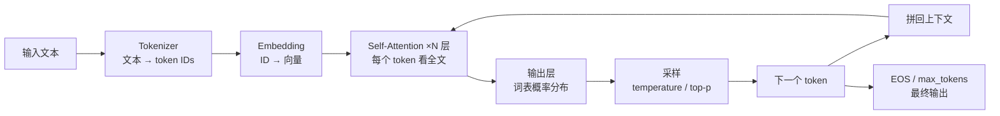
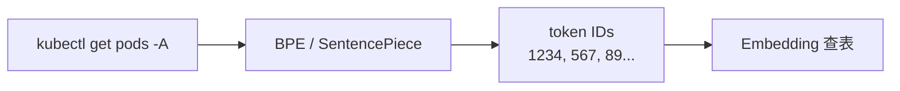
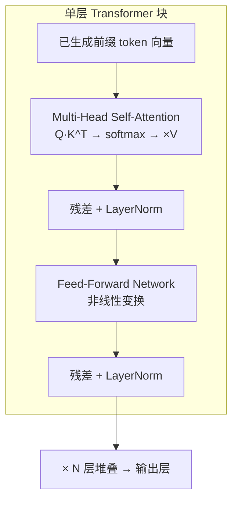
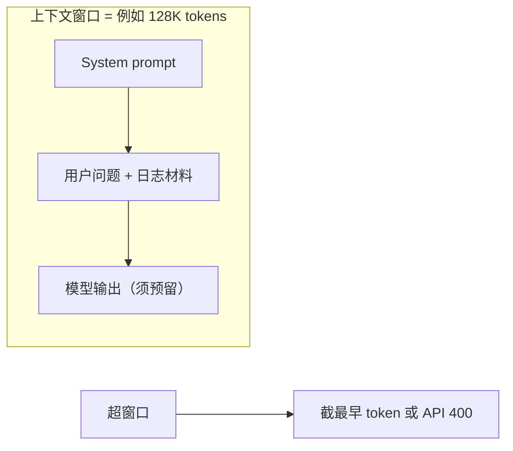
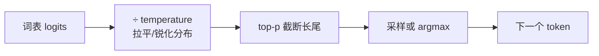
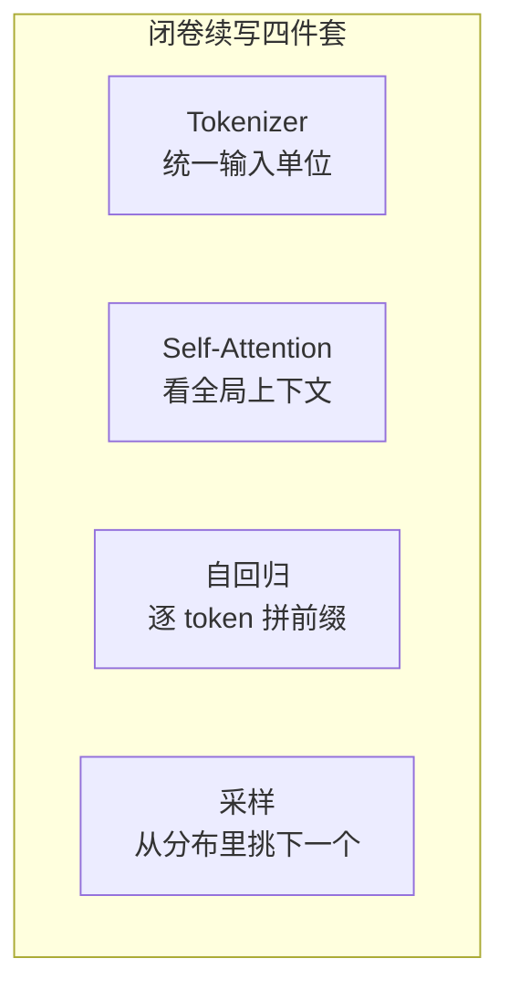
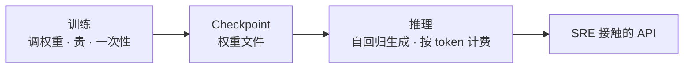
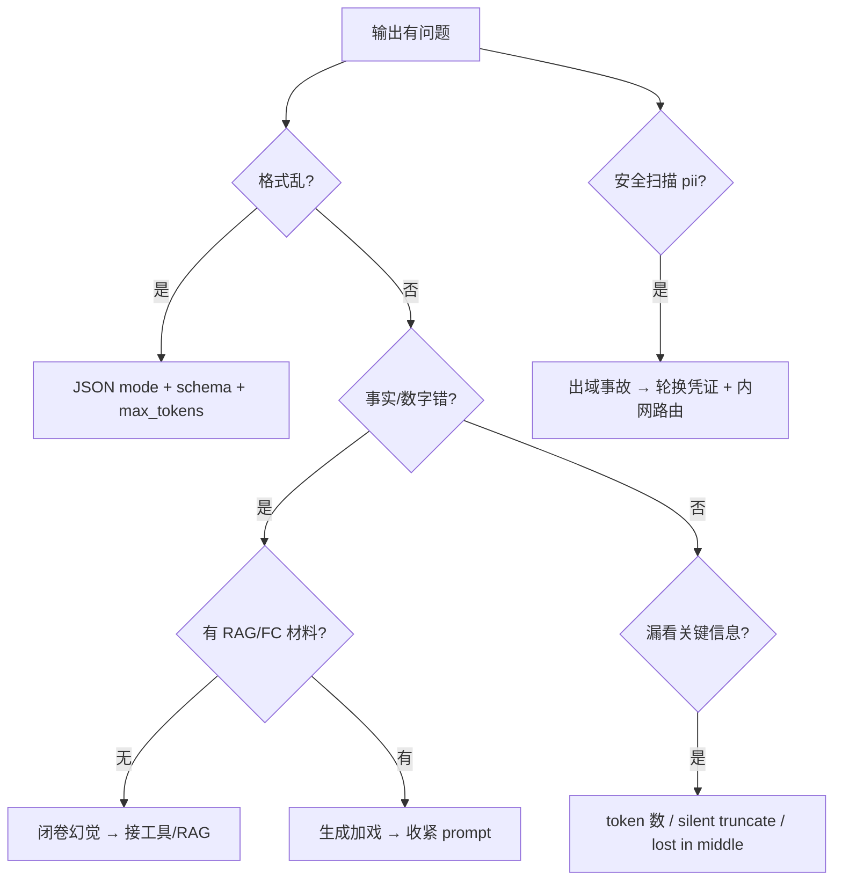
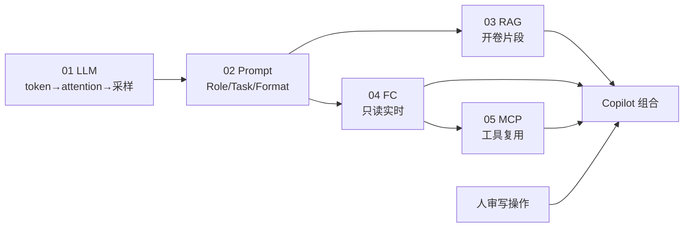

# LLM 与 Transformer 基础

> 活动高峰 P1 告警风暴，Junior SRE 把含 `kubeconfig` 的 `kubectl describe` 全文贴进公有云 ChatGPT，问「帮我写扩容 YAML」——模型秒回一段看起来很专业的 `apply`，还编造了「CPU 已达 90%」；Oncall 差点直接执行。群里有人喊「换个大模型就不幻觉了」，有人喊「temperature 设 0 就稳了」——两个都错。
> **本章回答**：一次推理从 token 切分、Attention 看上下文、采样出下一个 token，到拼成最终输出，每个阶段会出什么岔子、SRE 该怎么用、不该怎么用。
> **不讲**：Prompt 结构化写法 → [02](../02-Prompt工程/)；RAG 开卷 → [03](../03-RAG检索增强/)；只读工具查实时 → [04](../04-Function-Calling与Tool-Use/)；GPU 推理部署 → [08](../08-GPU资源与调度/)。

**标记**：🎯重点 · 🔥难点 · ⭐常考 · 🔧实操

---

## 一、一张图：一次推理的一生

> 🎯 **一句话**：LLM 推理 = Tokenizer 切 token → 多层 Self-Attention 看上下文 → 输出词表概率 → 采样拼回 → 重复直到停——不是查库，是闭卷续写。



**读图**：

- 主线是一次 **自回归（autoregressive）** 推理：每步只预测下一个 token，拼回去再预测下一个，直到遇到停止符或达到 `max_tokens`。
- Tokenizer 和窗口管「能塞多少」；Attention 管「上下文里谁重要」；采样管「同样输入会不会抖」；输出层不管「对不对」，只管「像不像训练分布」。
- 排障 Copilot 看问题：漏信息 → 查窗口/截断；编数字 → 查是否闭卷（要 RAG/FC）；输出乱 → 查 temperature 和 JSON mode——不是先换模型。

---

## 二、入场：Token 与 Tokenizer

> 🎯 **一句话**：模型读的不是「字」，是 **Tokenizer** 切出来的 **token** 序列——token 数决定窗口占用和账单，同一句话在不同模型里 token 数不同。

> 💡 **打个比方**：Tokenizer 像海关安检把行李拆成标准件——「kubectl」可能整件过，「内存泄漏排查」可能被拆三块；件数决定能不能塞进货舱（上下文窗口），也决定运费（API 账单）。



**读图**：文本先过 Tokenizer 变成整数 ID，再查 Embedding 表变成向量——**token 是模型眼里最小的读写单位**，不是字节也不是汉字。

**Tokenizer 三种常见算法** 🎯⭐：

- **BPE（Byte Pair Encoding）**：从字节/字符出发，高频子串合并成 token；GPT 系、Llama 系常用。
- **SentencePiece**：把空格也当普通字符，中英混排更稳；Qwen、ChatGLM 常用。
- **WordPiece**：BERT 系；LLM 对话模型较少单独用。

> ⚠️ **别混**：**token ≠ 字节 ≠ 汉字**。UTF-8 一个字可能 3 字节，但 token 数可能是 1 也可能是 2；英文单词常 1 token，中文粗算 **字符 × 1.5~2** 仍安全，精确要用目标模型 Tokenizer 试算。

> 🔍 **现场**：估一条告警日志要烧多少 token：

```bash
python3 - <<'PY'
import tiktoken
enc = tiktoken.encoding_for_model("gpt-4o")
text = open("/tmp/alert_snippet.txt").read()  # 脱敏后的告警 JSON
print(f"chars={len(text)} tokens={len(tokens)} ratio={len(tokens)/len(text):.2f}")
PY
# chars=12450 tokens=18230 ratio=1.46  ← 比字符多 46%，JSON/缩进特别费 token
```

```bash
curl -s https://llm-gw.internal/v1/chat/completions \
  -H "Authorization: Bearer $TOKEN" \
  -d '{"model":"qwen-72b","messages":[...],"max_tokens":512}' \
  | jq '.usage'
# {"prompt_tokens":18230,"completion_tokens":287,"total_tokens":18517}
# prompt_tokens ← input 已占 18K；32K 窗口只剩 ~14K 给输出和历史
```

> 📝 **面试**：「我先 Tokenizer 试算 input 长度；长日志先规则提取 ERROR 行再喂模型，不会整段 describe 无差别塞进去。」

---

## 三、理解：Embedding 与 Self-Attention

> 🎯 **一句话**：**Self-Attention（自注意力）** 让每个 token 根据 **Query / Key / Value（Q/K/V）** 看上下文里哪些位置重要——这是 Transformer 能处理长距离依赖的核心，不是 RNN 那样逐字传递。

> 💡 **打个比方**：Attention 像开卷答题时用笔尖扫全文——当前这个词（Query）拿「我在找什么」去和每个位置（Key）比相似度，相似高的位置把内容（Value）多抄一点过来；多层堆叠后，「它」「内存」「OOM」能互相关联。



**读图**：Attention 算「看谁」，FFN 算「怎么想」；**N 层堆叠**从局部搭配（`kubectl get`）到全局语义（「这是 K8s 排障语境」）。SRE **不必推公式**，只需懂：模型每一步都在 **条件于已生成前缀** 预测下一 token。

**Attention 官方写法（白板够用的简化版）** 🔥⭐：

```text
Attention(Q, K, V) = softmax(QK^T / sqrt(d_k)) · V

Q = 当前 token 的「查询向量」
K = 每个位置的「键向量」
V = 每个位置的「值向量」
softmax 后 = 权重：上下文里谁对当前 token 最重要
```

> ⚠️ **别混**：**Self-Attention** 是「同一序列内 token 互看」；Cross-Attention（交叉注意力）是「解码器看编码器」——纯 decoder-only LLM（GPT/Qwen/Llama）推理时主要是 Self-Attention。**Embedding** 是把 token ID 映射成向量；和 RAG 里的 **Embedding 模型**（把整段文本变检索向量）不是同一个东西，见 [03](../03-RAG检索增强/)。

> 📝 **面试**：「Transformer 靠 Self-Attention 并行看全局上下文，每层 Q/K/V 算权重再聚合 Value；运维只需懂它是『看上下文续写』，细节不推矩阵。」

---

## 四、堆叠：Transformer 块与上下文窗口

> 🎯 **一句话**：**上下文窗口（context window）** 是 input + output **共享**的 token 上限——超了拒请求或 **静默截断（silent truncate）**，不会提醒你「前面被砍了」。



**读图**：窗口像一张答题卡——题目、材料、答案都写上面；满了要么拒收（400），要么撕掉最早几页（截断），**栈在文件前 5% 的 OOM 信息可能整段消失**。

**窗口管理四步** 🔧：

1. Tokenizer 试算 system + user 总长。
2. 日志超窗口 50% → 先规则提取（`grep OOMKilled`、最近 5 分钟 ERROR）。
3. 仍超 → 分段摘要（Map-Reduce），再合成进 prompt。
4. 预留 output：`max_tokens` 设 512~4096，别占满整个窗口。

**Lost in the Middle** 🔥：长上下文里，模型对 **首尾** 信息更敏感，中间段落容易被「稀释」——重要栈 trace 放首尾，不要埋在大段 access log 正中间。

> 🔍 **现场**：长日志被截断导致「漏看前半」：

```bash
curl -s https://llm-gw.internal/v1/chat/completions -d @/tmp/oversized.json \
  | jq '{error, usage, finish: .choices[0].finish_reason}'
# 情况 A: {"error":{"message":"maximum context length exceeded"}}  ← 硬拒
# 情况 B: {"usage":{"prompt_tokens":127500},"finish":"length"}      ← 静默截断仍 200
# 模型答「未发现 OOM」→ 栈在被砍掉的头部
```

> ⚠️ **别混**：**上下文窗口** 是推理时一次能看多少 token；**训练数据 cutoff** 是模型知识截止日期——窗口再大也补不了 cutoff 之后的世界事件，要靠 RAG/FC。

---

## 五、出场：采样与下一个 token

> 🎯 **一句话**：**Temperature** 和 **top-p（nucleus sampling，核采样）** 控制采样随机性，**不控制真实性**——低温只是更 deterministic，该幻觉还会幻觉。

> 💡 **打个比方**：temperature 像摇号力度——低温几乎总摇到最大号（接近贪心解码），高温小号也有机会；但奖池里根本没有的号码（事实），摇再准也摇不出来。



**读图**：logits 经 temperature 缩放后 softmax 得概率；top-p 从大到小累加直到概率和 ≥ p，只在「核」里抽——**流水线用低温 + top-p 求稳定，不能当事实开关**。

| 对比 | temperature 低（0~0.3） | temperature 高（0.7~1.0） |
|------|-------------------------|---------------------------|
| 效果 | 同样输入输出更像 | 措辞多样 |
| SRE 场景 | 告警分类、JSON 提取 | 对外公告润色（仍人审） |
| 防幻觉 | ✗ 不能 | ✗ 更不能 |

**贪心解码（greedy decoding）**：`temperature=0` 时近似每步选概率最高 token——**可复现，不等于正确**。

> 🔍 **现场**：同一 prompt，`temperature=0` 连跑三次分类几乎相同；换「我们 etcd 版本是多少？」——`temperature=0` 仍可能自信答 `3.5.12`（编造）。

> 📝 **面试**：「temperature 拉平或锐化概率分布，top-p 截长尾；流水线 0~0.3，但不能当事实开关——低温只是更 deterministic。」

---

## 六、交付：输出、幻觉与 API 参数

> 🎯 **一句话**：最终输出是逐 token 拼成的文本——**幻觉（hallucination）** 是闭卷机制：模型用训练分布「补全」不知道的事，且语气自信；要靠 RAG/FC/人审挡，不是 prompt 魔法。

**幻觉三层防护** 🎯⭐：

1. **材料层**：RAG 给文档片段 / FC 查 Prometheus、`kubectl` 实时值。
2. **约束层**：JSON schema、「不知道就说不知道」、强制 citation。
3. **人审层**：变更、Silence、对外公告必须人签字。

> 🔍 **现场**：数值幻觉——无材料问 memory limit，模型答 `512Mi`；人查 `kubectl get pod ... -o jsonpath='{.spec...limits.memory}'` 实际 `1Gi`。

**API 参数速查（SRE 视角）** 🔧：

| 参数 | 作用 | 推荐 |
|------|------|------|
| `max_tokens` | 输出 token 上限 | JSON 摘要 512~2048 |
| `temperature` | 随机性 | 流水线 0~0.3 |
| `top_p` | 核采样 | 0.9~0.95 |
| `response_format` | JSON mode | 告警分类 |
| `stop` | 遇字符串停止 | 多轮工具链 |
| `timeout` | 客户端超时 | 比网关 SLA 短 5~10s |

```bash
curl -s https://llm-gw.internal/v1/chat/completions \
  -d '{"max_tokens":128,"response_format":{"type":"json_object"},...}' \
  | jq '{finish: .choices[0].finish_reason, content: .choices[0].message.content}'
# finish: "length"  ← JSON 写一半被截断，json.loads 失败
# 改为 max_tokens=2048 → finish: "stop"
```

**多轮对话与无状态** ⭐：模型 API **无状态**——「聊天记忆」是应用层把 history 再塞回窗口，占 token、会滚进早期错误。生产 Oncall 助手倾向 **单轮** 或 **≤3 轮短多轮**，session 存结构化字段 `{"pod":"gw-2","oom":true}`，不靠模型记住。

### 收束：LLM 凭什么「像会答题」



**读图**：四件套让输出「像 SRE 会怎么写」，**不保证对应你们集群真实状态**——查状态靠 FC，查文档靠 RAG，变更靠人。

> ⚠️ **别混**：LLM **不是搜索引擎**（不查索引）、**不是执行器**（不 ssh）、**不是形式化验证器**（不学语义只学统计模式）。像不像 ≠ 对不对。

> 📝 **面试**：背四件套 + 一句「查事实靠 RAG/FC，变更靠人审」。

---

## 六点五、训练与推理：SRE 只需知道的界线

> 🎯 **一句话**：**训练（training）** 用海量文本调权重；**推理（inference）** 用固定权重自回归生成——线上 Oncall 100% 在推理侧，但要知道 cutoff、量化、KV Cache 对延迟/成本的影响。



**读图**：你不会去训练 70B，但要懂 **知识 cutoff**（训练截止日期）→ 问「昨天刚发的 CVE」可能胡编；**参数量**（7B/70B）→ 能力/成本/幻觉率权衡；**量化（quantization）**（INT8/INT4）→ 省显存、略损质量，见 [08 GPU](../08-GPU资源与调度/)。

**KV Cache 直觉** 🔥⭐：自回归每步都要重算 Attention，但 **已生成 token 的 K/V 可缓存**——首 token 慢（**TTFT，Time To First Token**），后续 token 快（**TPOT，Time Per Output Token**）。长 output 时 KV 占显存涨；网关 **max_tokens** 设太大既烧钱也可能 OOM 推理节点。

> ⚠️ **别混**：**上下文窗口** 是推理时能塞多少 token；**KV Cache** 是推理实现里对已算 K/V 的缓存——窗口越大、生成越长，KV 占显存越多，不是「免费加长记忆」。

> 🔍 **现场**：用户抱怨「第一个字 3 秒、后面很快」——典型 TTFT vs TPOT；查推理网关是否冷启动、是否 batch、prompt 是否过长。别把 TTFT 高全怪成「模型笨」。

> 📝 **面试**：「训练调权重，推理自回归；cutoff 导致时效盲区；KV Cache 解释 TTFT/TPOT 差异。」

**Decoder-only vs Encoder-Decoder** ⭐：GPT/Qwen/Llama 对话模型多为 **decoder-only**（只 Self-Attention 生成）；翻译/摘要类旧架构有 encoder-decoder（Cross-Attention）。运维面试问 Transformer，答 **Self-Attention + 自回归 + decoder-only** 即可。

**Multi-Head Attention 一句** 🔥：不是一套 Q/K/V，而是 **多组头并行**看不同关系（语法/指代/格式），最后拼接——运维不必数头数，只需知「多层多头 = 更强的上下文模式提取，算力更贵」。

---

## 七、边界：SRE 该用与禁止

> 🎯 **一句话**：LLM 是 **加分项**——懂边界、能落地、不吹「AI 替值班」；红线四条：**生产数据不出域、会幻觉、只读工具、写操作人审**。

| 该用 | 禁止 |
|------|------|
| 告警/日志 **摘要草稿**（人审后发群） | 含 UID/支付/`kubeconfig` 贴公有云 |
| 排障 **方向建议**（「先查 X 指标」） | 模型直连生产写接口或 ssh |
| Runbook/脚本 **初稿** | 不经 review 把 AI 生成的 YAML apply |
| 内网私有部署 / 脱敏后再调 API | 默认「GPT 说的就是生产真相」 |
| 低温 + JSON schema **结构化草稿** | `temperature=0` 当「不会错」保证 |

**开源 vs 闭源选型顺序** ⭐：先问 **合规 → 数据出域 → 成本 → 能力**，不是 GitHub star 排行。

| 对比 | 闭源 API | 开源私有部署 |
|------|----------|--------------|
| 能力 | 通常更强、迭代快 | 7B~70B 看场景 |
| 数据 | 出域，审 DPA | 数据留内网 |
| 成本 | 按 token，高峰波动 | GPU 固定 + 运维人力 |
| 延迟 | 依赖出网 | 内网可控 |

> 📝 **面试**：「含生产数据默认不出域；POC 用评测集+成本表，不凭体感选模型。」

**落地场景 1：告警风暴群消息摘要** 🔧

1. 聚合器 **脱敏** firing 告警 JSON。
2. 调内网 API，`temperature=0.2`，要求根因假设 ≤3 条、**禁止变更命令**。
3. Oncall **人审**后 pin；Silence/Scale 必须人点。

**落地场景 2：FinOps token 账单 ×8**

1. 按 caller 聚合 input tokens——发现脚本每 5 分钟送全量 access log。
2. 加单请求 input 上限 + 日配额；改 grep ERROR + 超 8K 走本地摘要。

**网关层必做（扩展）** 🔧：

| 策略 | 说明 |
|------|------|
| 单请求 input 上限 | 32K tokens，超过走摘要 |
| 每日配额 | 防脚本死循环 |
| 模型路由 | 含 secret/kubeconfig → 内网 |
| PII 扫描 | 命中拒绝或脱敏 |
| 响应缓存 | 相同 fingerprint 5min（非排障实时） |
| prompt/response 采样审计 | 合规抽查，存脱敏版 |

**Stop sequence 与工具链** ⭐：多轮 FC 时 `stop` 防止模型一次生成过长散文；与 [04 FC](../04-Function-Calling与Tool-Use/) 步数上限配合。

**Batch API / 异步** ⭐：告警批量分类可走异步 batch 降成本——**实时 Oncall 摘要仍同步**；batch 结果同样要 schema 校验+人审抽检。

**MoE 直觉** 🔥：部分大模型是 **MoE（Mixture of Experts）**——激活参数小于总参数；选型看 **平台实际计费 token**，不只看参数量 billboard。

**安全：日志进 prompt** ⭐：即使用内网模型，日志仍 **脱敏**——UID/hash、IP 末段抹掉、kubeconfig 剥离。

> 📝 **面试**：「网关 token 预算+PII+路由；batch 降本不替代 Oncall 校验。」

---

## 八、作战：推理问题定责

> 🎯 **一句话**：LLM 相关线上问题三类——超窗/截断、幻觉误导、数据出域——按现象对表排查，**别一上来换模型**。



### 现象 · 先做 · 别做

| 现象 | 先做 | 别做 |
|------|------|------|
| 答案漏看堆栈前半 | 查 `prompt_tokens`、是否截断 | 加 temperature |
| JSON 缺一半 | 查 `max_tokens`、`finish_reason=length` | 无限增大窗口 |
| 摘要里 plausible 假指标 | 禁编数值 + 接只读 PromQL FC | 让 Oncall 信摘要 |
| 同样 prompt 前后不一致 | 查 temperature、有无 seed | 当厂商 bug 先报 |
| 安全扫描告警外发 | 轮换凭证、改内网路由 | 继续公有 API |

### 60 秒剧本 🔧

```text
① 0–10s  现象分型：格式 / 事实 / 漏信息 / 合规
② 10–30s 查 usage：prompt_tokens、completion_tokens、finish_reason
③ 30–45s 事实错 → 有无 tool_result/RAG citation；无 → 闭卷
④ 45–60s 合规 → audit log pii_detected；修复路由，不换模型先查窗口
```

---

## 九、收口

### 命令速查 🔧

```bash
# Token 试算（脱敏样本）
python3 -c "import tiktoken; e=tiktoken.encoding_for_model('gpt-4o'); print(len(e.encode(open('/tmp/s.txt').read())))"

# 看单次用量
curl -s .../v1/chat/completions ... | jq '.usage, .choices[0].finish_reason'

# 网关审计：是否走公有路由 + PII
grep '"route":"public-api"' /var/log/llm-gw/audit.log | jq 'select(.pii_detected==true)' | head
```

### 面试锚点

| 问 | 30 秒答 |
|----|---------|
| LLM vs 搜索引擎？ | 前者闭卷续写 token；后者查索引。像不像≠对不对。 |
| 上下文窗口？ | input+output 共享；超了截断或 400；长日志先提取。 |
| temperature 防幻觉？ | 不能；只控随机性；事实靠 RAG/FC/人审。 |
| Self-Attention 直觉？ | Q/K/V 算权重，token 互看上下文；多层堆叠。 |
| 幻觉怎么挡？ | 材料层+约束层+人审层；换大模型 alone 不够。 |
| 选型前三问？ | 数据能否出境、合规、成本；再谈能力。 |
| API 无状态？ | 记忆是应用层拼 history；生产倾向单轮/短多轮。 |
| kubeconfig 贴公有云？ | 禁止；出域+泄露；走内网私有。 |

### 易错一句话对照

- LLM 理解了代码所以不会错 → 学统计模式，不是形式化验证
- temperature=0 保证事实 → 只保证更 deterministic
- 128K 窗口 = 128K 汉字 → token 通常更多，还要预留 output
- 开源部署 = 数据不出域 → 贴公有云照样出域
- 幻觉 prompt 能完全消除 → 只能降；架构要拒答+人审
- token = 字节 → 三套单位，用 Tokenizer 试算
- 多轮模型记住上周 → 无状态；history 占窗口
- Attention = Cross-Attention → decoder-only 主要是 Self-Attention
- 上下文窗口 = 训练 cutoff → 前者推理容量，后者知识截止日期
- 整段 describe 塞窗口 → 贵、慢、可能截断；先 grep 提取

### 数字墙

> 排障 JSON **temperature 0~0.3** · 预留 output **512~4096 tokens** · 中文粗算 token **字符×1.5~2** · 7B vs 70B **能力/成本差约一个量级** · `finish_reason=length` = **输出被 max_tokens 截断** · API **无状态**，history 占窗口 · TTFT/TPOT 见 **KV Cache** · MoE **看计费 token 不看 billboard 参数**

### 口述模板

**【30 秒】**「LLM 是 Transformer 自回归模型，Tokenizer 切 token，Self-Attention 看上下文，采样出下一个 token，闭卷续写不是搜索引擎。运维做摘要和草稿，控窗口和低温，幻觉靠 RAG、FC 和人审。选型先看数据能不能出境。」

**【2 分钟】** 按一次推理的一生讲：入场 token→理解 Attention→窗口共享 input/output→采样 temperature/top-p→交付与幻觉三层防护→边界四条红线→网关 token/PII/路由。强调：数值必须 FC，SOP 必须 RAG，变更必须人审，kubeconfig 不出域。

**【常见追问】**

| 追问 | 答法 |
|------|------|
| 128K 能塞 128K 汉字吗 | 不能；token 更多；预留 output |
| 低温为何还胡说 | deterministic ≠ 正确 |
| 和 RAG 关系 | LLM 生成；RAG 给材料 |
| 小模型生产 | 可辅助；要评测；关键路径大模型 |
| Transformer vs RNN | Attention 并行全局；RNN 顺序长依赖弱 |
| KV Cache 是什么 | 缓存已算 K/V；解释 TTFT/TPOT |
| 训练 vs 推理 | 训练调权重；线上只推理；cutoff 限制时效 |

### 扩展现场：stream 看自回归

```bash
curl -sN https://llm-gw.internal/v1/chat/completions \
  -d '{"model":"qwen-72b","stream":true,"temperature":0.2,"messages":[{"role":"user","content":"Pod OOM 可能原因？"}]}'
# data: {"choices":[{"delta":{"content":"容器"}}]}
# data: {"choices":[{"delta":{"content":"内存"}}]}  ← 逐 token，不是先想好整段
```

**读输出**：每个 delta 是一步采样；措辞像 SRE ≠ 集群真实 limit——要 `kubectl` 或 FC 核实。

### 扩展：top-k 与 repetition penalty

部分 API 支持 **top_k**（只从概率最高 K 个 token 抽）和 **repetition_penalty**（惩罚重复）——流水线常用 **temperature + top_p** 即可；重复啰嗦时调 repetition_penalty，仍 **不防事实幻觉**。

### 扩展：logprobs 与评测

开发/评测时可开 **logprobs** 看模型对分类 token 的置信——**生产 Oncall 不必开**（增带宽）；可用于构建 50 条告警分类回归集，对比 prompt 版本 A/B。

### 扩展：system / user / assistant 角色

Chat API 用 **role** 区分消息：System 信任最高（红线）；User 含不可信材料；Assistant 是历史生成。**Tool 结果**在 FC 里用 `role: tool` 回喂（见 [04](../04-Function-Calling与Tool-Use/)）——别把 tool_result 伪装成 System。

### 扩展：BPE 子词与运维日志

日志里大量 **UUID、Pod hash、十六进制** 可能被 BPE 拆成很多 token——同样字符数比纯中文更费窗口。规则提取时去掉无关 label 降 token。

### 扩展：推理精度 FP16/BF16/INT8

推理常用 **FP16/BF16**；**INT8/INT4 量化** 省显存、略损推理质量——SRE 选型看平台 SLA 与评测，不自行量化模型。部署细节见 [08 GPU](../08-GPU资源与调度/)、[09 推理服务](../09-推理服务性能与稳定性/)。

### 扩展：Responsible AI 口径

面试可能问「AI 替值班吗」——答：**不替**；AI 出草稿和只读查询，Silence/apply/对外公告 **人签字**；责任在人与流程，不在模型。

### FAQ 快问快答 ⭐

**Q：LLM 能替代 `kubectl` 吗？**  
A：不能替代执行；最多生成 **待审** 草稿。执行靠人与变更系统，查询靠 FC 只读工具。

**Q：为什么叫「大语言模型」？**  
A：参数量大 + 在大量文本上训练 + 建模语言序列概率；「大」不保证「不幻觉」。

**Q：Embedding 层和 Self-Attention 谁先？**  
A：Token ID → **Embedding** 取向量 → 进 Transformer 块 **Self-Attention** → FFN。

**Q：top_p=0.1 和 temperature=0 差别？**  
A：top_p 截断候选集；temperature 缩放 logits。常一起用；都不保证事实。

**Q：128K 模型是否还需要 RAG？**  
A：要。窗口≠可更新知识库；长文贵、慢、易 lost in the middle；SOP 变更 RAG 重 embed 即可。

**Q：闭源 API 的 data retention 要问什么？**  
A：训练是否用客户数据、日志保留多久、是否支持零保留 Enterprise——合规问卷必项。

**Q：Oncall 能否把 LLM 摘要当 Silences 依据？**  
A：不能；摘要草稿，Silence 人点，且要对照真实指标。

**Q：如何向非技术经理解释幻觉？**  
A：「闭卷作文写得像真的」——不是故意骗，是机制；要开卷（RAG）和复核（人）。

**Q：logits 是什么？**  
A：输出层对每个词表的未归一化分数；softmax 后变概率再采样。

**Q：为什么游戏运维要懂 LLM 基础？**  
A：加分项 + 边界事故（出域、误执行） increasingly 真实；懂机制才能设网关和审计。

**Q：prefill 和 decode 阶段？**  
A：prefill 处理输入 prompt（常占 TTFT）；decode 逐 token 生成（TPOT）——长 input 拖慢首字。

**Q：speculative decoding 要懂吗？**  
A：面试加分：小模型 draft 大模型 verify 加速 decode；SRE 知有这优化即可，部署见 09 章。

---

## 合上书

- [ ] **默画一节的图**：输入 → Tokenizer → Embedding → Attention×N → logits → 采样 → 拼回 → 输出。
- [ ] **口述**：LLM 和搜索引擎机制差在哪？为什么说「像 SRE 写法 ≠ 集群真实状态」？
- [ ] **口述窗口**：128K 怎么分 input/output 预算？超窗两种表现？lost in the middle 怎么办？
- [ ] **口述 Attention**：Q/K/V 各干什么？为什么 SRE 不必推公式？
- [ ] **口述采样**：temperature 和 top-p 各解决什么？为什么低温仍可能编数字？
- [ ] **口述幻觉**：三层防护是什么？数值类问题最佳实践？
- [ ] **边界判断**：含 kubeconfig 的 describe 能否贴公有云？开源私有 vs 闭源 API 选型顺序？
- [ ] **定责**：格式乱/事实错/漏信息/出域各先查什么？60 秒剧本四步？
- [ ] **落地**：告警摘要和 FinOps 账单异常各怎么做、边界在哪？
- [ ] **口述收束**：闭卷续写四件套 + 「不保证什么」？

下一章：[02 Prompt 工程](../02-Prompt工程/)。开卷：[03 RAG](../03-RAG检索增强/)。

---

## 附录：与后续章节衔接

> 🎯 **一句话**：01 建立 **闭卷续写** 直觉——后面四章分别在 **接口（Prompt）、材料（RAG）、实时（FC）、插头（MCP）** 上补洞；红线四条全程不变。



**读图**：Copilot = Prompt 定红线 + RAG/FC 供材料 + MCP 统一工具；**变更永远在人侧**。

| 下一章 | 01 章留什么坑 | 那章填什么 |
|--------|---------------|------------|
| [02 Prompt](../02-Prompt工程/) | 窗口/幻觉/采样 | 结构化接口、防注入 |
| [03 RAG](../03-RAG检索增强/) | 闭卷编 SOP | chunk→检索→citation |
| [04 FC](../04-Function-Calling与Tool-Use/) | 闭卷编指标 | tool_result 实时值 |
| [05 MCP](../05-MCP协议/) | 多 Host 胶水 drift | 标准 list/call |
| [08 GPU](../08-GPU资源与调度/) | TTFT/KV/量化 | 推理部署与显存 |

**复习路线（README）**：必吃透 **03→04→05**；01 建直觉；02 要会用；红线在每一章 **边界+作战** 节重复强化——不是五套不同红线，是 **同一四条** 在不同阶段的落点。

**合上书追加**：

- [ ] **画衔接图**：01 闭卷与 02/03/04 各补哪一块？
- [ ] **口述**：为何「换大模型」不能替代 RAG+FC+人审？
