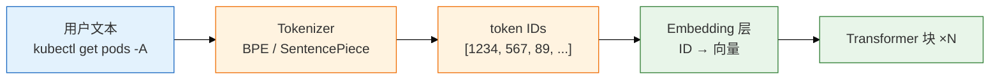
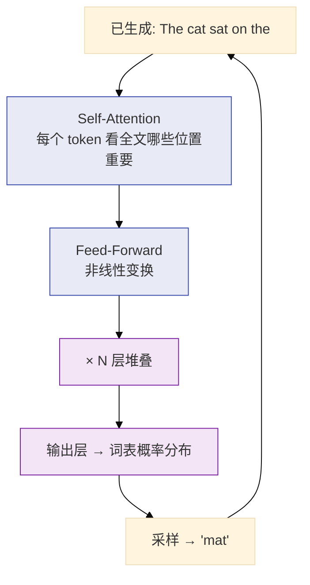
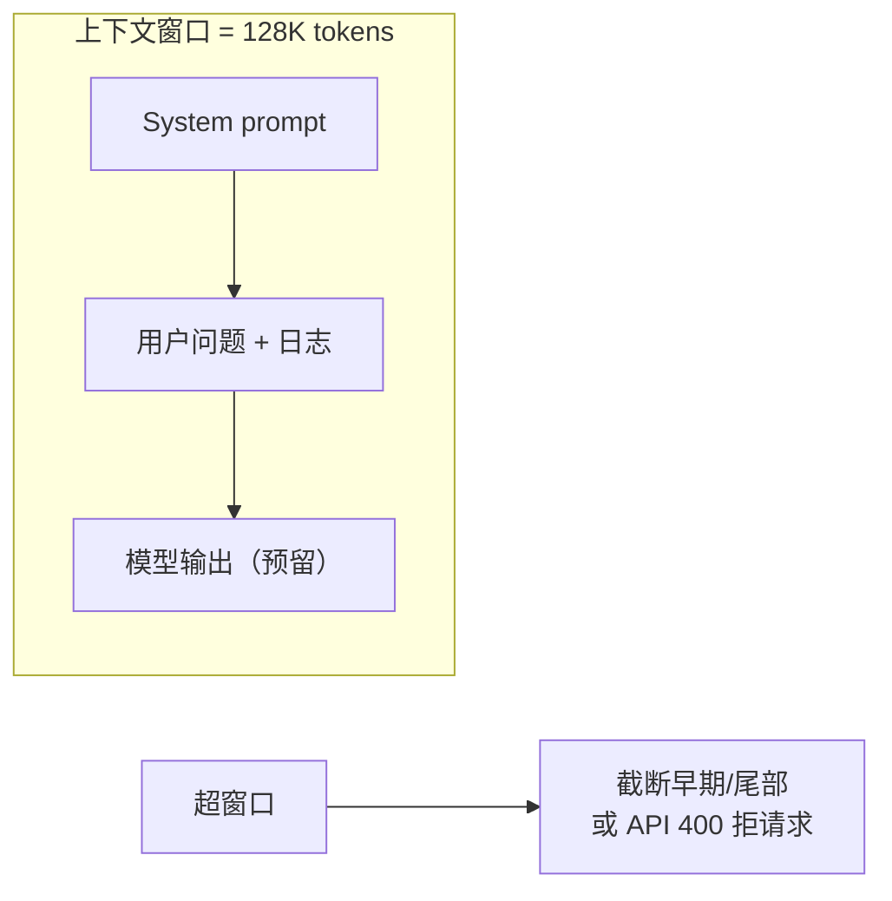

# 01｜LLM 与 Transformer 基础

活动高峰 P1 告警风暴，Junior SRE 把含 `kubeconfig` 的 `kubectl describe` 全文贴进公有云 ChatGPT，问「帮我写扩容 YAML」——模型秒回一段看起来很专业的 `apply`，还编造了「CPU 已达 90%」；Oncall 差点直接执行。群里有人喊「换个大模型就不幻觉了」，有人喊「temperature 设 0 就稳了」——两个都错。

> **加分项定位**：大厂 SRE 面试常用来测「懂不懂 AI 边界」——不是要你推公式，是要你说清 LLM 是什么、不是什么。  
> **红线**：生产数据/密钥不出域；模型会幻觉；低温 ≠ 事实；LLM 不是搜索引擎也不是执行器。

---

## 面试怎么考

| 频率 | 典型问法 | 30 秒要点 | 2 分钟要点 |
|:----:|----------|-----------|------------|
| ★★★★★ | LLM 和搜索引擎有什么区别？ | 闭卷续写下一个 token，不查库不执行；像不像 ≠ 对不对 | 自回归：Tokenizer → Transformer 堆叠 → 采样出下一个 token；训练学分布不是记事实；运维用它读日志/写草稿，不能让它 ssh |
| ★★★★★ | 上下文窗口怎么算？超了会怎样？ | 输入 + 输出一起占窗口；超了截尾巴或拒请求，不会报警 | 128K 不是「能塞 128K 字」；token 与字符比因模型而异；长日志要先摘要再塞；留 output 预算给 JSON 答案 |
| ★★★★ | temperature 和 top-p 干什么？ | 控随机性；流水线用低温；不能当事实开关 | temperature 拉平/锐化概率分布；top-p 核采样截断长尾；排障 JSON 用 0~0.3；创意文案才升温 |
| ★★★★ | 什么是幻觉？怎么挡？ | 自信地错；材料+校验+人审；不能靠「换大模型」 alone | 闭卷必然幻觉；RAG 开卷、FC 查实时、schema 校验、引用原文、拒答策略；值班责任在人 |
| ★★★★ | 开源闭源怎么选？ | 先问数据能不能出境、合规、成本；不是先问谁最强 | 闭源 API：快、强、数据出境风险；开源私有：控数据、要 GPU 运维；混合：敏感内网、通用外网 |
| ★★★ | Transformer 直觉是什么？ | Self-Attention 让 token 互看；堆叠层提取模式；不推公式 | Q/K/V 注意力：当前 token 看上下文哪些位置重要；FFN 做非线性；多层堆叠从局部到全局；运维只需懂「看上下文续写」 |

---

## SRE 边界

| 该用 | 禁止 |
|------|------|
| 告警/日志 **摘要草稿**（人审后发群） | 把含 UID/支付/kubeconfig 的原文贴公有云 |
| 排障 **方向建议**（「先查 X 指标」） | 让模型「直接给出 kubectl 变更命令并执行」 |
| Runbook/脚本的 **初稿** | 不经 review 把 AI 生成的 YAML apply 上线 |
| 内网私有部署 / 脱敏后再调 API | 默认认为「GPT 说的就是对的生产真相」 |
| 低温 + JSON schema 做 **结构化草稿** | 用 temperature=0 当「不会错」的保证 |

---

## 原理讲透

### 3.1 Token 与 Tokenizer

**一句话**：模型读的不是「字」，而是 Tokenizer 切出来的 token 序列；同一个词在不同模型里 token 数不同，直接影响窗口占用和账单。

**打个比方**：Tokenizer 像海关安检把行李拆成标准件——「kubectl」可能整件过，「内存泄漏排查」可能被拆成三块；件数（token 数）决定你能不能塞进飞机货舱（上下文窗口），也决定运费（API 账单）。

**现场走一遍**（估一条告警日志要烧多少 token）：

1. 跳板机装好 `tiktoken`（或调内网网关的 `/v1/tokenize`），拿一段真实脱敏日志：

```bash
python3 - <<'PY'
import tiktoken
enc = tiktoken.encoding_for_model("gpt-4o")
text = open("/tmp/alert_snippet.txt").read()  # 约 800 汉字 + 200 行 JSON
tokens = enc.encode(text)
print(f"chars={len(text)} tokens={len(tokens)} ratio={len(tokens)/len(text):.2f}")
PY
```

2. 屏幕出现：

```text
chars=12450 tokens=18230 ratio=1.46
```

3. 再试「整段 `kubectl describe pod` 无删减」——同样字符数，token 可能 ×1.8（缩进、符号、长 label 都占件）。

4. 调一次真实 API，看响应头或 body 里的用量字段：

```bash
curl -s https://llm-gw.internal/v1/chat/completions \
  -H "Authorization: Bearer $TOKEN" \
  -d '{"model":"qwen-72b","messages":[{"role":"user","content":"..."}],"max_tokens":512}' \
  | jq '.usage'
```

5. 屏幕出现：

```text
{
  "prompt_tokens": 18230,
  "completion_tokens": 287,
  "total_tokens": 18517
}
```

6. 结论：**input 已占 18K**，若窗口 32K，只剩 ~14K 给输出和历史；整段 describe 不能无脑塞。

**输出解读**：

| 字段 | 含义 | 上面例子 |
|------|------|----------|
| `chars` | 人类看的字符数 | 12450 |
| `tokens` | 模型计费/窗口单位 | 18230，比字符多 **46%** |
| `ratio` | token/字符 | 中文粗算 **1.5~2** 仍安全 |
| `prompt_tokens` | 本次 input 消耗 | 占窗口大头 |
| `completion_tokens` | 模型输出消耗 | 与 `max_tokens` 上限共享窗口 |

> **记住**：账单按 input + output token 计费；窗口也是 input + output 共享。能摘要就摘要。

**面试怎么说**：「我先 Tokenizer 试算 input 长度，中文按字符 ×1.5~2 粗估；长日志先规则提取 ERROR 行再喂模型，不会整段 describe 无差别塞进去。」



| 现象 | 原因 | 运维动作 |
|------|------|----------|
| 同样 1000 字中文，两家 API 价格差 2 倍 | token 切分策略不同 | 用目标模型 Tokenizer 试算，别凭感觉 |
| JSON 里大量重复 key | 重复结构每个符号都是 token | 先压缩/提取字段再喂模型 |
| 代码块特别「费 token」 | 缩进、符号、长变量名 | 只贴相关函数，不要整文件 |

---

### 3.2 自回归与 Transformer 直觉

**一句话**：LLM 每次只预测「下一个 token」，把预测结果拼回去再预测下一个——像极快的中文联想，不是数据库查询。

**打个比方**：像手机输入法联想——你打了「战斗服 OOM」，它猜下一个词是「先」还是「重启」；它不会先去 Prometheus 查真实 CPU，只是根据「以前见过无数 SRE 怎么写」来续写。

**现场走一遍**（看自回归逐 token 生成）：

1. 内网 Playground 或 `curl` 开 **stream** 模式，输入固定 prompt：

```bash
curl -sN https://llm-gw.internal/v1/chat/completions \
  -H "Authorization: Bearer $TOKEN" \
  -d '{
    "model": "qwen-72b",
    "stream": true,
    "temperature": 0.2,
    "messages": [
      {"role": "system", "content": "你是 SRE 助手，只给只读建议。"},
      {"role": "user", "content": "Pod game-gw-1 OOMKilled，可能原因？"}
    ]
  }'
```

2. 终端逐行蹦出（简化）：

```text
data: {"choices":[{"delta":{"content":"容器"}}]}
data: {"choices":[{"delta":{"content":"内存"}}]}
data: {"choices":[{"delta":{"content":" limit"}}]}
data: {"choices":[{"delta":{"content":" 不足"}}]}
...
data: [DONE]
```

3. 每个 `delta.content` 就是 **一个（或子词）token 的采样结果**；模型并没有「先想好整段再打印」。

4. 同一 prompt 再跑一遍，`temperature=0.2` 时前后高度相似；改成 `1.0` 措辞会变，但**仍可能编造**具体数值。

5. 要查真实 limit，必须人执行 `kubectl describe` 或 FC 调 API——模型输出里的 `512Mi` 可能是猜的。

**输出解读**：

| 观察 | 说明 |
|------|------|
| 逐 token 流出 | 自回归：条件于已生成前缀，预测下一 token |
| 措辞像 SRE | 训练分布里常见写法，≠ 你们集群真实状态 |
| 低温仍可能编数字 | 闭卷机制；不是 bug |
| `[DONE]` 结束 | 遇到 stop 或 `max_tokens` 上限 |

**面试怎么说**：「LLM 是闭卷续写器：Tokenizer 切词 → 多层 Self-Attention 让 token 互看上下文 → 输出下一 token 概率 → 采样拼回去。它擅长『像 SRE 会怎么写』，查状态要靠工具或人，我不会让它 ssh。」



> **记住**：LLM = 闭卷续写器。你塞进去的材料是这一次它「能看见的全部世界」。

---

### 3.3 上下文窗口（Context Window）

**一句话**：窗口是 input + output 共享的 token 上限；超了要么拒请求、要么静默截断——不会提醒你「后面被砍了」。

**打个比方**：考场答题卡只有一面纸（128K token）——题目、草稿、最终答案都写上面；纸满了，监考员要么拒收（400），要么默默撕掉最早几道题（截断），不会大声宣布。

**现场走一遍**（长日志被截断导致「漏看前半」）：

1. 准备一份 40K token 的脱敏 access log，故意把 **唯一一条 OOM 栈** 放在文件 **前 5%** 位置。

2. 不设摘要，整文件 base64 后塞进 user message（错误示范），调 API：

```bash
# 网关返回 400 或 200 但 finish_reason=length，取决于实现
curl -s https://llm-gw.internal/v1/chat/completions \
  -d @/tmp/oversized_request.json | jq '{error, usage, choices: [.choices[0].finish_reason]}'
```

3. 情况 A——直接拒：

```text
{"error":{"message":"maximum context length exceeded"},"usage":null}
```

4. 情况 B——静默截断后仍 200：

```text
{"usage":{"prompt_tokens":127500,"completion_tokens":512},"choices":["finish_reason":"length"]}
```

5. 模型回答「未发现 OOM」——因为栈在 **被截掉的头部**，Oncall 以为模型眼瞎。

6. **正确做法**：先规则提取：

```bash
grep -E 'OOMKilled|OutOfMemory|exit code 137' /tmp/access.log | tail -20 > /tmp/oom_snippet.txt
# 再 Tokenizer 试算，确认 < 窗口 50%
```

7. 预留 output：`max_tokens` 设 2048，不要占满整个窗口。

**输出解读**：

| 信号 | 含义 | 下一步 |
|------|------|--------|
| `400 context length` | 硬拒 | 减 input 或走摘要服务 |
| `prompt_tokens` 接近上限 | 危险 | 检查是否截断早期内容 |
| `finish_reason=length` | 输出被 `max_tokens` 截断 | JSON 可能缺字段 |
| 答「没看到 X」但 X 在日志里 | 疑 silent truncate | 查 token 数 + 重要信息放首尾 |

**面试怎么说**：「128K 窗口是 input+output 共享，不是 128K 汉字；超了拒请求或截最早 token。长日志我先规则提取再塞，重要信息放首尾防 lost in the middle，并预留 512~4096 output。」



**运维估窗口四步**：

1. Tokenizer 试算 system + user 总长。
2. 日志超 50% 窗口 → 先规则提取（ERROR 行、最近 5 分钟）。
3. 仍超 → 分段摘要（Map-Reduce 或滑动窗口），再合成。
4. 预留 output：`max_tokens` 设够，避免 JSON 写一半截断。

---

### 3.4 采样：Temperature 与 Top-p

**一句话**：Temperature 和 top-p 控制「随机性」，不控制「真实性」；生产流水线默认低温，但仍要人审。

**打个比方**：temperature 像摇号力度——低温几乎总摇到最大号（贪心），高温小号也有机会；但奖池里根本没有的号码（事实），摇再准也摇不出来。

**现场走一遍**（同一 prompt 对比低温 vs 高温）：

1. 固定 prompt，连跑 3 次 `temperature=0`：

```bash
for i in 1 2 3; do
  curl -s https://llm-gw.internal/v1/chat/completions \
    -d '{"model":"qwen-72b","temperature":0,"messages":[{"role":"user","content":"将告警分类为 cpu|memory|network: HighMemoryUsage on gw-1"}]}' \
    | jq -r '.choices[0].message.content'
done
```

2. 三次输出几乎相同：

```text
{"category":"memory","confidence":"high"}
{"category":"memory","confidence":"high"}
{"category":"memory","confidence":"high"}
```

3. 改 `temperature=1.0` 连跑 3 次——分类可能仍对，但措辞、confidence 字段会飘。

4. 换一道 **训练集里没有的事实题**：「我们集群 etcd 版本是多少？」——`temperature=0` 仍可能自信回答 `3.5.12`（编造的）。

5. 生产流水线配置：

```json
{"temperature": 0.1, "top_p": 0.9, "response_format": {"type": "json_object"}}
```

**输出解读**：

| 参数 | 效果 | SRE 推荐 |
|------|------|----------|
| `temperature=0~0.3` | 输出稳定、可复现 | 告警分类、JSON 提取 |
| `temperature=0.7~1.0` | 措辞多样 | 对外公告润色（仍人审） |
| `top_p=0.9~0.95` | 砍掉低概率长尾 token | 与低温配合 |
| `top_k` | 只从 top K 里抽 | 部分 API 支持；不如 top-p 常用 |

**面试怎么说**：「temperature 拉平或锐化概率分布，top-p 做核采样截长尾；流水线用 0~0.3 求稳定，但不能当事实开关——低温只是更 deterministic，该幻觉还会幻觉。」

> **记住**：低温让「同样输入多次输出更像」，不是「更真」。

---

### 3.5 幻觉（Hallucination）

**一句话**：模型用训练分布「补全」它不知道的事，且语气自信——这是机制不是 bug，要靠架构挡。

**打个比方**：闭卷考生不会的题也会写满答题卡——字迹工整、格式正确，但公式是编的；你不能靠「让他认真点」杜绝，得发参考资料（RAG）或允许翻书（FC）。

**现场走一遍**（抓一次典型幻觉）：

1. 故意不给任何材料，问：

```text
User: game-gw-1 当前 memory limit 是多少？只回答数字。
```

2. 模型可能答：

```text
512Mi
```

3. 人查真相：

```bash
kubectl get pod game-gw-1 -o jsonpath='{.spec.containers[0].resources.limits.memory}'
# 实际输出: 1Gi
```

4. 加 **材料层**——把 describe 片段放进 user（脱敏后）：

```text
Context: limits: memory: 1Gi
User: 根据上文，memory limit 是多少？
```

5. 仍可能错读字段——加 **约束层** JSON schema + **人审层**。

6. 数值类问题最佳实践：FC 查 Prometheus / `kubectl`，**禁止模型报具体数值**。

**输出解读**：

| 幻觉类型 | 例子 | 挡法 |
|----------|------|------|
| 事实幻觉 | 编造不存在的 kubectl flag | FC 查 `--help`；人核对 |
| 引用幻觉 | 「根据 wiki 第 3 章…」无此文 | RAG 强制引用片段 ID |
| 数值幻觉 | 「CPU 90%」实际没查 | 工具查指标 |
| 时效幻觉 | 讲已下线架构 | 文档元数据 + 过期下架 |

**面试怎么说**：「幻觉是闭卷补全机制，三层挡：材料层 RAG/FC、约束层 schema 和拒答、人审层变更和对外必须人签字；换大模型 alone 解决不了。」

**三层防护（面试背）**：

1. **材料层**：RAG / FC 给真实上下文或实时数据。
2. **约束层**：Prompt 要求「仅基于引用」「不知道就说不知道」；JSON schema 校验。
3. **人审层**：变更、对外、Silence 必须人签字。

---

### 3.6 开源 vs 闭源选型

**一句话**：SRE 选型顺序是 **合规 → 数据出域 → 成本 → 能力**，不是 GitHub star 排行。

**打个比方**：选模型像选快递——不是看谁飞机最快，而是先问「这东西能不能出境」「丢了谁赔」「月结还是按件」。

**现场走一遍**（合规门禁三连问）：

1. 安全问卷第一题：「本次请求是否含 kubeconfig / 玩家 UID / 支付信息？」——**是** → 走内网私有路由，拒绝公有云。

2. 查网关路由日志：

```bash
grep '"route":"public-api"' /var/log/llm-gw/audit.log | jq 'select(.pii_detected==true)' | head -5
```

3. 若出现命中，立即：轮换泄露凭证 + 改路由策略 + 通报。

4. 对 **可脱敏** 场景做 POC 对比表：

| 维度 | 闭源 API | Qwen2.5-72B 私有 |
|------|----------|------------------|
| 100 条告警摘要人工评分 | 4.2/5 | 3.8/5 |
| P99 延迟 | 2.1s（出网） | 0.8s（内网） |
| 月成本 | token × $0.00x | GPU 月租 + 2 人运维 |
| 数据路径 | 出境，审 DPA | 不出内网 |

5. 结论写进 ADR：**敏感内网 + RAG 用私有；公开文案可用 API**。

**输出解读**：

| 维度 | 闭源 API | 开源私有 |
|------|----------|----------|
| 能力 | 通常更强、迭代快 | 7B~70B 看场景 |
| 数据 | 出域/合规条款要审 | 数据留内网 |
| 成本 | 按量；高峰账单波动 | GPU 固定成本 + 运维人力 |
| 延迟 | 依赖网络 | 内网可控 |
| 运维 | 几乎零运维 | vLLM/TGI、监控、扩缩容 |

**面试怎么说**：「选型前三问：数据能否出境、合规条款、成本模型；含生产数据的默认不出域。能力排在后面，POC 用评测集+成本表决策，不凭体感。」

---

### 3.7 API 调用参数速查（SRE 视角）

**一句话**：除了 temperature，SRE 要会设 `max_tokens`、stop sequence、seed（若有），并在网关层做 token 预算与审计。

**打个比方**：调 API 像订机票——`max_tokens` 是行李额度，`timeout` 是转机等待上限，网关是旅行社风控（超额拒单、敏感品禁运）。

**现场走一遍**（JSON 摘要被截断）：

1. 请求 20 条告警聚类，`max_tokens=128`（故意设小）：

```bash
curl -s https://llm-gw.internal/v1/chat/completions \
  -d '{"model":"qwen-72b","temperature":0.1,"max_tokens":128,"response_format":{"type":"json_object"},"messages":[...]}' \
  | jq '{finish: .choices[0].finish_reason, content: .choices[0].message.content}'
```

2. 输出：

```text
{
  "finish": "length",
  "content": "{\"clusters\":[{\"name\":\"oom\",\"alerts\":[\"a1\",\"a2\""
}
```

3. `json.loads` 失败 → 流水线报错。

4. 改为 `max_tokens=2048`，`finish_reason=stop`，JSON 完整。

5. 客户端 `timeout=55s`（网关 SLA 60s），便于重试。

**输出解读**：

| 参数 | 作用 | 运维推荐 |
|------|------|----------|
| `max_tokens` | 输出 token 上限 | JSON 摘要 512~2048 |
| `temperature` | 随机性 | 流水线 0~0.3 |
| `top_p` | 核采样 | 0.9~0.95 |
| `stop` | 遇字符串停止 | 多轮工具链 |
| `seed` | 固定采样（部分 API） | 评测对比 prompt 版本 |
| `response_format` | JSON mode | 告警分类 |
| `timeout` | 客户端超时 | 比网关 SLA 短 5~10s |

**面试怎么说**：「除模型参数外，网关要做 token 预算、PII 扫描、内外网路由和 audit log；单请求 input 超限走摘要服务，防脚本死循环烧钱。」

**网关层必做**：

| 网关策略 | 说明 |
|----------|------|
| 单请求 input 上限 | 如 32K tokens，超过走摘要服务 |
| 每日配额 | 防脚本死循环烧钱 |
| 模型路由 | 含 `password`/`secret`/`kubeconfig` → 拒绝或强制内网 |
| 响应缓存 | 相同 fingerprint 5min 内复用（注意 stale） |

---

### 3.8 生产排障：窗口、幻觉、出域

**一句话**：LLM 相关线上问题三类——超窗/截断、幻觉误导、数据出域——按现象对表排查，别一上来换模型。

**打个比方**：助手答错了别先换脑子——先看是不是卷子被撕了（截断）、闭卷瞎编（幻觉）、还是把考题传真到国外（出域）。

**现场走一遍**（Oncall 说「摘要里 CPU 90% 但面板没有」）：

1. 查该次请求的 `prompt_tokens` 和是否带 Prometheus 查询结果——若无 FC 结果，定性 **数值幻觉**。

2. 查 prompt 版本 git diff：是否有人删了「不得编造指标」红线。

3. 查 `temperature` 和 `finish_reason`：排除输出截断。

4. 修复：system 加「数值必须来自 tool_result」+ 接只读 PromQL FC。

5. 并行查 audit：同一时段有无 `pii_detected` → 出域事故走安全流程。

**输出解读**：

| 现象 | 先做 | 别做 |
|------|------|------|
| 答案「漏看」堆栈前半 | 查 input token；是否 silent truncate | 加 temperature |
| JSON 字段缺一半 | 查 `max_tokens`、`finish_reason=length` | 无限增大窗口 |
| 同样 prompt 前后不一致 | 查 temperature>0；有无 seed | 当 bug 报厂商 |
| 分类准确率骤降 | 查 prompt 版本；数据漂移 | 直接 fine-tune |
| 摘要里 plausible 假指标 | 加强禁编数值；接 FC | 让 Oncall 信摘要 |
| 安全扫描告警外发 | 轮换凭证；改内网路由 | 继续用公有 API |

**面试怎么说**：「输出问题先分叉：格式乱查 JSON mode+schema，事实错查是否闭卷→RAG/FC，漏信息查 token 截断，合规查出域审计；不换模型先查窗口和 prompt。」

---

### 3.9 多轮对话与状态管理

**一句话**：模型 API 本身无状态；「聊天记忆」是应用层把 history 再塞回窗口——占 token、会累积幻觉，运维助手通常 **单轮** 或 **短窗口多轮**。

**打个比方**：模型像金鱼——每次通话结束就失忆；应用层把聊天记录复印一份塞下次信封里，信封越厚 postage（token）越贵，早期抄错的也会一起寄回去。

**现场走一遍**（长多轮把错误滚进 context）：

1. 第 1 轮用户贴错 Pod 名 `game-gw-1`，模型基于错误名给建议。

2. 第 5 轮用户纠正为 `game-gw-2`，若应用把 **全文 history** 原样塞回——模型仍可能被第 1 轮带偏。

3. 查 session store：应存 **结构化中间结果** `{"pod":"game-gw-2","oom":true}`，而非全文对话。

4. Token 试算：5 轮 history 可能从 8K 涨到 35K，逼近窗口。

5. 生产配置：**单轮** 告警分类；排障助手最多 3 轮，每轮只带摘要材料。

**输出解读**：

| 模式 | 适用 | 风险 |
|------|------|------|
| 单轮 | 告警分类、日志提取 | 低 |
| 短多轮（≤5） | 排障追问 | history 膨胀超窗 |
| 长多轮 | 不推荐生产 Oncall | 早期错误滚进 context |

**面试怎么说**：「API 无状态，记忆是应用层拼 history；我倾向单轮或短多轮，用 session 存结构化字段，关键结论写回工单不靠模型记住。」

---

## 落地场景

### 场景 1：告警风暴下的群消息摘要

**背景**：P1 活动高峰，200 条 Alertmanager 通知涌入飞书群，Oncall 需要 30 秒内知道「是不是同一根因」。

**做法**：

1. 告警聚合器先把 firing 告警 JSON **脱敏**（去掉内网 IP 末段、实例 ID 哈希）。
2. 调内网 LLM API，`temperature=0.2`，Prompt 要求输出：根因假设（≤3 条）、建议先看哪 2 个面板、**禁止**给出变更命令。
3. Oncall 人审后 pin 到群；若摘要提到具体 Pod，人工 `kubectl` 核实。

**边界**：摘要是 **草稿**；Silence / Scale / Rollback 必须人点。

**翻车画面**：有人跳过脱敏直接贴公有云 → 数据出域 + 编造子命令。正确姿势：内网模型 + 脱敏 + 只读建议。

### 场景 2：FinOps — token 账单异常飙高

**背景**：活动后 LLM 网关账单环比 ×8，FinOps 质疑是否被刷。

**排查**：

1. 按 caller 聚合 input tokens：发现某「日志分析」脚本把全量 access log 每 5 分钟送一次。
2. 加 **单请求 input 上限** + **caller 日配额**。
3. 脚本改为：先 grep ERROR + 超 8K token 走本地摘要器。

**口径**：「LLM 成本 = token × 单价 × QPS；窗口管理是 FinOps 问题，不是只属算法团队。」

---

## 口述模板

### 【30 秒】

「LLM 本质是 Transformer 自回归模型，每次预测下一个 token，不是搜索引擎也不是执行器。运维用它做告警摘要、排障方向、脚本草稿，但要控上下文窗口、用低温增稳定，幻觉靠 RAG、工具查实时和人审来挡。选型先看数据能不能出境，再看成本和 GPU 运维能力。」

### 【2 分钟】

「从机制上说，文本经 Tokenizer 切成 token，过多层 Self-Attention 和 FFN，输出下一个 token 的概率分布，采样后拼回去继续生成——所以叫闭卷续写。上下文窗口是 input 和 output 共享上限，超了会截断或拒请求，长日志要先摘要。temperature 和 top-p 控随机性，流水线用 0~0.3，但不能当事实开关，幻觉是机制问题，要靠检索、Function Calling 和 schema 校验。选型上，含生产数据的场景默认不出域，能私有就私有；通用文案可以用 API。我们线上用 LLM 做告警聚合摘要和 Runbook 匹配草稿，变更和 Silence 一定人审，模型永远不直连生产写接口。」

### 【常见追问】

| 追问 | 答法 |
|------|------|
| 128K 窗口是不是能塞 128K 汉字？ | 不能，token 数通常大于字符数；还要预留 output |
| 为什么低温还会胡说？ | 低温只是选最高概率 token，训练数据里没有的事实仍会「像样地编」 |
| 和 RAG 什么关系？ | LLM 是生成器；RAG 先检索再给材料，减少闭卷幻觉 |
| 小模型能不能上生产？ | 可以辅助分类/摘要，关键路径要评测；7B 幻觉率高于 70B |
| Transformer 和 CNN/RNN 区别？ | Attention 并行看全局上下文；RNN 顺序传递，长依赖弱 |

---

## 必会 · 常考

### 对错表

| 说法 | 对错 | 纠正 |
|------|:----:|------|
| LLM 理解了代码语义所以不会错 | ✗ | 学的是统计模式，不是形式化验证 |
| temperature=0 保证事实正确 | ✗ | 只保证更 deterministic，不保证真 |
| 上下文越大越好，整段日志全塞 | ✗ | 贵、慢、中间信息可能被忽略；要先提取 |
| 开源模型数据一定不出域 | ✗ | 不出域指部署在内网；贴到公有云照样出域 |
| 幻觉可以通过 prompt 完全消除 | ✗ | 只能降低；架构上要有拒答和人审 |
| Token 和字节是一回事 | ✗ | Token 是模型词表单位；UTF-8 字节是另一套 |
| 多轮对话模型会「记住」上周内容 | ✗ | 无状态；历史要靠应用层再传入 |
| Self-Attention 让模型能看长距离依赖 | ✓ | 这是 Transformer 核心优势 |

### 易混

| A | B | 区分 |
|---|---|------|
| LLM | 搜索引擎 | 前者生成文本；后者检索索引 |
| temperature | max_tokens | 前者控随机；后者控输出长度上限 |
| 上下文窗口 | 训练数据 cutoff | 窗口是推理时一次能看多少；cutoff 是训练知识截止日期 |
| 幻觉 | 模型过时 | 幻觉是编造；过时是训练/文档未更新，RAG 可解后者 |
| 闭源 API | 私有开源 | 出域与运维责任不同，不是能力绝对高低 |

### 数字参考（口径题）

| 项 | 参考值 | 备注 |
|----|--------|------|
| 排障 JSON 提取 temperature | 0 ~ 0.3 | 仍要 schema 校验 |
| 预留 output tokens | 512 ~ 4096 | 看答案复杂度 |
| 中文粗算 token | 字符 × 1.5~2 | 用官方 Tokenizer 更准 |
| 7B vs 70B | 能力/成本差一个量级 | 边缘任务 7B；复杂推理 70B+ |

---

## 合上书，问自己

1. 用一句话向面试官解释「LLM 不是搜索引擎」——机制上差在哪？
2. 128K 窗口的一请求里，input 和 output 怎么分预算？超窗口会发生什么？
3. temperature 和 top-p 各解决什么问题？为什么低温不能防幻觉？
4. 含 kubeconfig 的 `kubectl` 输出能不能贴公有云 API？为什么？
5. 开源私有和闭源 API，你的选型决策树前三问是什么？
6. Self-Attention 直觉是什么？为什么 SRE 只需要懂「续写」而不必推公式？

---

**本章不讲**：结构化 Prompt、注入防护 → [02 Prompt 工程](../02-Prompt工程/)；RAG 开卷 → [03 RAG](../03-RAG检索增强/)；调监控只读工具 → [04 FC](../04-Function-Calling与Tool-Use/)；推理部署 → [08 GPU](../08-GPU与推理服务运维/)。
