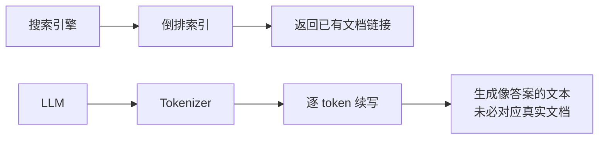
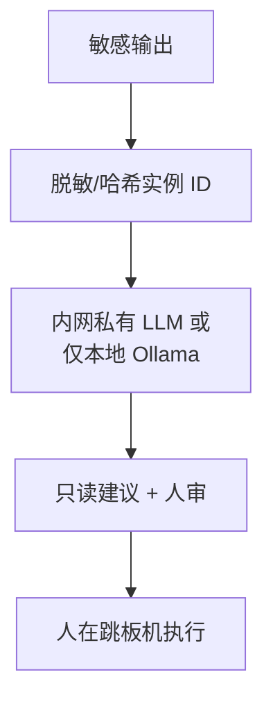
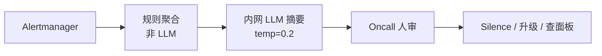

# 01｜LLM 与 Transformer 基础 · 练习题

先对照 [知识点](知识点.md) **面试怎么考** 自己口述，再对答案。每题标了覆盖范围：

| 标记 | 含义 |
|------|------|
| **核心** | 不懂整章就没建立起来 |
| **必会** | 值班和面试都要能讲 |
| **常用** | 线上会反复碰到 |
| **常考** | 白板和追问的高频口径 |

## 本题目录

- [Q1 LLM 和搜索引擎的本质区别](#q1)
- [Q2 上下文窗口与截断](#q2)
- [Q3 temperature 能不能防幻觉](#q3)
- [Q4 公有云粘贴 kubeconfig](#q4)
- [Q5 开源闭源选型](#q5)
- [Q6 Transformer 直觉](#q6)
- [Q7 告警摘要场景设计](#q7)
- [Q8 Token 估算与成本](#q8)
- [Q9 边界判断：排障助手](#q9)
- [Q10 口述综合题](#q10)
- [合上书](#合上书)

---

## Q1

**★★★★★｜LLM 和搜索引擎的本质区别是什么？**

**覆盖**：核心 · 必会 · 常考  
**对应**：知识点 §3.2 自回归、§面试怎么考

### 场景

面试官白板：「你们用 GPT 查 wiki，和 Google 有什么不一样？」

### 完整解答

**一句话**：搜索引擎检索索引返回链接；LLM 是自回归生成下一个 token，不查库时不接触外部事实。

**展开**：

| 维度 | 搜索引擎 | LLM |
|------|----------|-----|
| 输出来源 | 已索引网页 | 参数里的统计模式 |
| 新鲜度 | 爬虫更新 | 训练 cutoff；实时要靠 RAG/FC |
| 可引用 | 有 URL | 可能编造引用 |
| 运维用途 | 查公开资料 | 摘要、分类、草稿 |

### 再追问

- 「那 RAG 呢？」→ RAG 把检索和生成拼起来：先搜索索引，再让 LLM 基于片段写——仍是生成，但开了卷。

---

## Q2

**★★★★★｜128K 上下文窗口，能塞多长的生产日志？超了会怎样？**

**覆盖**：核心 · 必会  
**对应**：知识点 §3.3 上下文窗口

### 场景

Junior 把 30 万字符的 Java 堆栈一次性 POST 给 API，返回 400 或答案明显「漏看」早期 OOM 行。

### 完整解答

**一句话**：128K 是 token 上限且 input+output 共享；中文粗算远小于 128K 字；超了截断或拒请求，被截部分模型完全不可见。

**处理步骤**：

1. 用目标模型 Tokenizer 试算；30 万字符中文可能 > 200K tokens。
2. 规则提取：ERROR/FATAL/OOMKilled 行 + 时间窗最近 5 min。
3. 仍超 → 分段 Map-Reduce 摘要。
4. 预留 `max_tokens` 4096 给结构化输出。

| 现象 | 原因 |
|------|------|
| API 400 context_length_exceeded | 硬超限 |
| 答案忽略堆栈开头 | 静默截断早期 token |
| JSON 半截 | output 预算不足 |

### 再追问

- 「lost in the middle？」→ 长上下文模型对中间段落注意力弱，关键信息放 prompt 首尾。

---

## Q3

**★★★★｜temperature=0 是不是就不会幻觉？**

**覆盖**：必会 · 常考  
**对应**：知识点 §3.4 采样、§3.5 幻觉

### 场景

平台把告警分类服务设为 `temperature=0`，仍把「数据库主库宕机」错分类为「网络抖动」，OnCall 几乎误 Silencing。

### 完整解答

**一句话**：temperature=0 只让采样近乎贪心、输出更稳定，不保证事实；幻觉是闭卷补全机制，低温仍会 confidently wrong。

**挡法三层**：

1. RAG/FC 给真实材料或指标。
2. JSON schema + 枚举校验；低置信度走「unknown」。
3. Silence/变更必须人审。

| 参数 | 能做什么 | 不能做什么 |
|------|----------|------------|
| temperature=0 | 同样输入输出更一致 | 保证分类正确 |
| top_p=0.9 | 砍掉长尾怪 token | 引入外部事实 |

### 再追问

- 「分类用什么温度？」→ 0~0.3 + 固定 label 集合 + 评测集监控准确率。

---

## Q4

**★★★★★｜能把含 kubeconfig 的 kubectl 输出贴到 ChatGPT 吗？**

**覆盖**：核心 · 必会  
**对应**：知识点 §SRE 边界

### 场景

事故群有人截图 `kubectl get secret` 和完整 kubeconfig 到公有云对话框求「快速修复命令」。

### 完整解答

**一句话**：禁止——kubeconfig/Secret/玩家 UID 属于生产凭证与敏感数据，出域违反合规且模型可能返回错误变更命令。

**正确流程**：

| 禁止 | 允许 |
|------|------|
| 公有云 API + 明文凭证 | 内网模型 + 脱敏字段 |
| 模型返回的命令直接 pipe 执行 | 人 copy 只读命令核实后执行 |

### 再追问

- 「脱敏标准？」→ IP 末段、UID 哈希、Secret 名可留类型不留值；kubeconfig 绝不外发。

---

## Q5

**★★★★｜开源模型私有部署 vs 闭源 API，你怎么选型？**

**覆盖**：必会 · 常考  
**对应**：知识点 §3.6 开源闭源

### 场景

平台组要在「内网 wiki 问答」和「对外 STATUS 页文案润色」两个场景选型。

### 完整解答

**一句话**：决策顺序是合规/出域 → 成本 → 能力；内网 wiki 用私有+RAG；对外润色可用 API。

| 场景 | 选型 | 理由 |
|------|------|------|
| 内网 wiki（含架构/IP） | 私有 Qwen/DeepSeek + RAG | 数据不出域 |
| STATUS 页公告 | 闭源 API | 无敏感数据、要措辞质量 |
| 活动高峰弹性 | API 或预扩 GPU 池 | 私有要提前容量规划 |

**2 分钟补一句**：私有要承担 GPU、vLLM、监控（见 Ch08）；API 要估 token 账单和 SLA。

### 再追问

- 「开源是不是免费？」→ 权重免费，GPU/人力/电费不免费。

---

## Q6

**★★★★｜不用公式，怎么向面试官解释 Transformer？**

**覆盖**：必会 · 常考  
**对应**：知识点 §3.2

### 场景

面试官：「Attention is all you need 你懂吗？别背论文。」

### 完整解答

**一句话**：Transformer 用 Self-Attention 让当前 token 看全文哪些位置重要，多层堆叠后逐 token 续写——像极快的上下文联想。

**白板三框**：

1. Tokenize → Embedding
2. N 层：Attention（看谁）+ FFN（变换）
3. 输出词表概率 → 采样下一 token → 循环

**和 RNN 对比一句**：RNN 顺序传 hidden state，长依赖弱；Attention 并行看全局，适合长日志——但仍不保证事实。

### 再追问

- 「要推 QK^T 吗？」→ SRE 面试不需要；懂 Q/K/V 是查询/键/值直觉即可。

---

## Q7

**★★★★★｜设计：告警风暴时 LLM 怎么帮 Oncall，红线是什么？**

**覆盖**：核心 · 常用  
**对应**：知识点 §落地场景 1、§SRE 边界

### 场景

200 条 firing 告警涌入飞书；领导问能不能「让 AI 自动 Silence 重复的」。

### 完整解答

**一句话**：LLM 只做脱敏后聚合摘要与根因假设草稿；Silence/变更必须人审，禁止自动执行。

**架构**：

| 该用 | 禁止 |
|------|------|
| 「这 180 条像同一 Deployment 滚动失败」 | 自动 Silence |
| 建议先看 CPU Throttle 面板 | 自动 scale / rollback |

### 再追问

- 「摘要错了怎么办？」→ 摘要标题标注 AI 草稿；关键决策必须对原始告警计数核实。

---

## Q8

**★★★★｜同样的日志，为什么两家 API 账单差 3 倍？**

**覆盖**：常用 · 常考  
**对应**：知识点 §3.1 Token

### 场景

FinOps 质疑：同一段 JSON 日志，Vendor A 报 12K tokens，Vendor B 报 38K tokens。

### 完整解答

**一句话**：不同 Tokenizer 切分策略不同，JSON/代码/中文的 token 效率差异大，必须按目标模型试算不能凭字符数估。

**动作**：

1. 用官方 `tiktoken` 或 API token count 端点试算。
2. 日志预处理：去重复字段、只留 level/message/timestamp。
3. 账单告警：单请求 >50K input token 打审计日志。

### 再追问

- 「省 token 技巧？」→ 摘要后再问、结构化提取、缓存 system prompt（部分 API 支持）。

---

## Q9

**★★★★★｜边界判断：下列哪些可以交给 LLM？**

**覆盖**：必会 · 常考  
**对应**：知识点 §SRE 边界

### 场景

勾选能交给 LLM 的任务（多选）：

- A. 根据 Prometheus 指标自动生成 HPA YAML 并 apply  
- B. 把 OnCall 复盘 PDF 脱敏后生成 5 条改进项草稿  
- C. 读取生产 DB 慢查询日志原文上传公有云分析  
- D. 对告警 title 做分类打标（枚举 10 类）  
- E. 代替 Oncall 在 P1 事故中做决策  

### 完整解答

**一句话**：B、D 可以（草稿/分类 + 脱敏/内网）；A/C/E 禁止或必须大幅改造。

| 选项 | 判断 | 理由 |
|:----:|:----:|------|
| A | ✗ | 写操作 + 可能幻觉 → 人审；不自动 apply |
| B | ✓ | 脱敏 + 草稿 + 人审 |
| C | ✗ | 生产 DB 日志出域 |
| D | ✓ | 低温 + 枚举 + 评测；低置信走 unknown |
| E | ✗ | 不能替值班决策 |

### 再追问

- 「D 上线前要做什么？」→ 标注 500 条评测集、准确率/SLO、漂移监控。

---

## Q10

**★★★★★｜2 分钟口述：LLM 在你们 SRE 实践中的位置**

**覆盖**：核心 · 必会  
**对应**：知识点 §口述模板

### 场景

终面开放题：「谈谈 AI 和大模型对你工作的改变。」

### 完整解答

**一句话**：LLM 是加分项辅助层——摘要、分类、Runbook 草稿；核心仍是 SLO、变更管理和人审；数据不出域、不自动修。

**口述骨架（2 分钟）**：

1. **机制一句**：闭卷续写，不是搜库不是执行器。
2. **用过什么**：告警摘要、wiki RAG 问答（Ch03）、Cursor 写脚本（Ch07）。
3. **边界三不**：不出域、不自动写、不替值班。
4. **幻觉怎么挡**：RAG + 只读 FC + schema + 人审。
5. **不吹**：P1 仍靠 runbook 和面板，AI 缩短理解时间。

### 再追问

- 「失败案例？」→ 准备一句：曾把未脱敏日志贴外网被安全拦下/或摘要误导向，后来改内网+脱敏流程。

---

## 合上书

1. 闭卷续写和搜索引擎检索索引，机制差在哪？
2. input 和 output 如何共享上下文窗口？超窗后模型能看到被截内容吗？
3. 为什么 temperature=0 仍会幻觉？你挡幻觉的三层是什么？
4. kubeconfig 出域的风险是什么？正确替代方案？
5. 开源私有 vs 闭源 API，选型前三问？
6. 告警风暴场景：LLM 该做什么、绝对不能做什么？
7. Token 估算为什么必须用目标模型 Tokenizer？

---

**上一章**：无 · **下一章**：[02 Prompt 工程](../02-Prompt工程/练习题.md)
