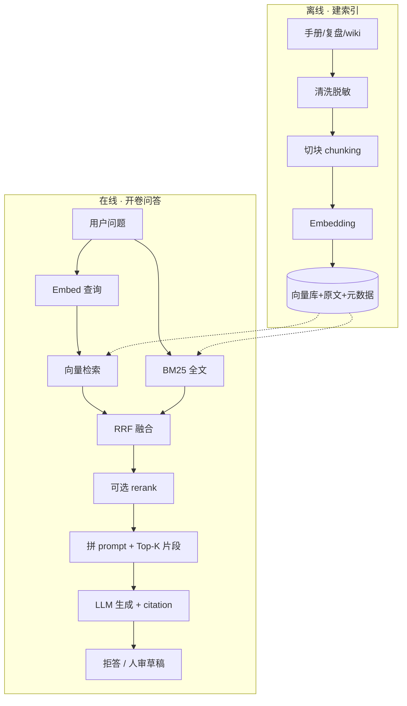
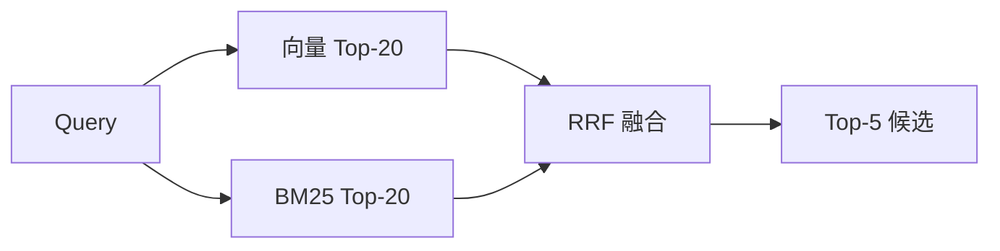
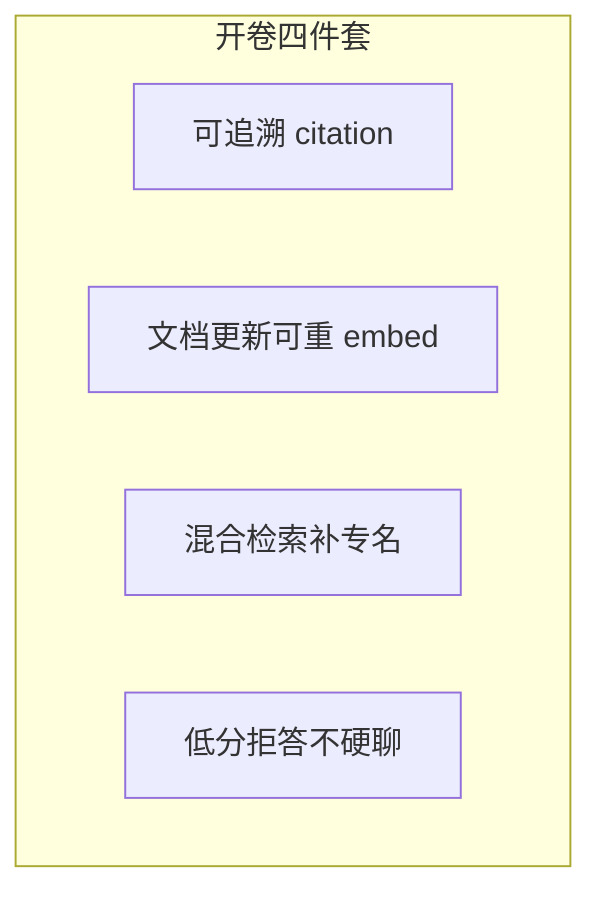
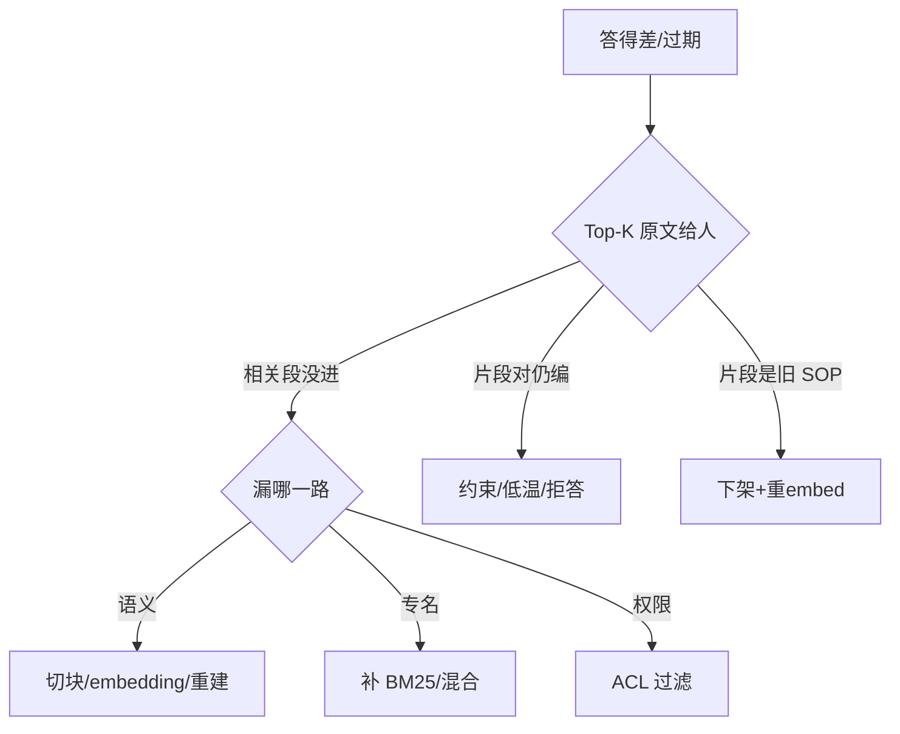

# 03｜RAG 检索增强

> 大家好，欢迎来到这次分享。开讲之前，先带大家回到一个很多值班同学都经历过的现场：
> 值班在告警卡片旁问「game/gw-1 OOM 上次怎么收的」——闭卷 LLM 编了一套从没发生过的 cordon 步骤；开卷 RAG 若检索到三个月前的合服文档，又会把**已作废的限号阈值**当标准答案。RAG 不是「把 wiki 塞进窗口」，是 **chunk → embed → 混合检索 → 带引用生成**。
> 这一章讲完，你会知道闭卷编 SOP 和开卷检到过期文档，错在哪一层，以及正确优化顺序是什么。
> **本章回答**：一次 RAG 问答从离线建索引到在线检索生成，每个阶段怎么设计、检索错了怎么定责、SRE 红线怎么守。
> **不讲**：Prompt 四要素写法 → [02](../02-Prompt工程/)；FC 查实时指标 → [04](../04-Function-Calling与Tool-Use/)；MCP 工具插头 → [05](../05-MCP协议/)；Agent 多步 → [06](../06-Agent智能体/)。这些都有专门的章节，本章只在用到时点到为止。

**标记**：🎯重点 · 🔥难点 · ⭐常考 · 🔧实操

**怎么听这场分享**：咱们先看第一节 RAG 主图，把「离线建索引 → 在线检索生成」装进脑子；后面按切块、Embedding、混合检索、生成约束展开；作战节拆「换大模型就好了」——优化顺序永远切块优先。口述模板保留可背性。每一节讲完都会提示对应练习题。

---

## 一、一张图：一次 RAG 问答的一生

> 🎯 **一句话**：RAG = 离线 **chunk→embed→入库**，在线 **问→检索→拼 prompt→生成**——检索错了，后面模型再强也是错答。

大家想想：答错了第一反应是什么？很多人会说「换个更强的模型」——**错了**。先摊开 Top-K 原文：检索错了换模型也白搭。



**读图**：

- 上半条是 **索引生命周期**：文档变块、块变向量、和原文/metadata 一起存——换 Embedding 模型要 **整库重建**。
- 下半条是 **问答生命周期**：问题同时走向量语义路和 BM25 专名路，融合后进模型；**数字和步骤必须来自片段**，不是闭卷记忆。
- 定责照图：答错先 **摊开 Top-K 原文**——相关段没进是检索问题；段进了还编是生成问题；段是旧 SOP 是索引过期。


练习题 Q1、Q14。主线有了——先谈怎么切块。

---

## 二、离线：清洗、切块与元数据

> 🎯 **一句话**：检索命中的是 **块（chunk）** 不是整篇文档——切坏了，向量语义对、内容却缺半句否定词。

> 💡 **打个比方**：切块像撕菜谱卡片——从「不要」和「重启」中间撕一刀，厨师只拿到「要重启」，灾难现场。

**切块策略** 🎯⭐：

| 策略 | 适用 | 风险 |
|------|------|------|
| **结构切 H2/H3** | 运维手册、复盘 | 推荐生产默认 |
| **overlap 10~20%** | 边界句两侧都保留 | 0 overlap 丢否定词 |
| 固定 500 token | 原型 | 易切断命令/表格 |
| 语义切 | 超长 unstructured | 贵，难运维 |

**错误示范** 🔥：复盘句「先看 limit，再查泄漏，**不要重启有状态服**」——固定 500 token、0 overlap → 块 A 结尾「不要」，块 B 开头「重启…」→ query「OOM 能重启吗」只命中块 B → 模型建议重启。

**正确做法**：

```text
按 H2「处置步骤」整节为一块
overlap 15%（边界句重复出现在相邻块）
元数据：source_path, section, updated_at, acl_tag, doc_status
```

**清洗与脱敏** 🎯：密钥、玩家 UID、完整内网拓扑 **不进库**；表格和 `kubectl` 示例 **整块保留**，不要从命令中间切断。

> ⚠️ **别混**：「先 cordon 再 drain」是 **一步流程**，不能拆成两块各检索一半——步骤拆开 = 召回半套 SOP。

> 📝 **面试**：「优化顺序：切块第一刀，再混合检索，再 rerank，再换 embedding，最后换大模型。」


口诀：**「切块第一刀」**。练习题 Q2。切好了，再 embed。

---

## 三、向量化：Embedding 与向量库

> 🎯 **一句话**：**Embedding 模型** 把文本变成固定维度向量（如 1536 维）；**换模型必须整库重建**——新旧向量不能混比距离。

> 💡 **打个比方**：Embedding 像把书翻译成地图坐标——换翻译官后，旧坐标和新坐标不能在同一张图上比远近。

**Embedding vs 对话 LLM** 🎯⭐：

- **Embedding 模型**：输入文本 → 输出向量；用于检索相似块；BGE/m3e/bge-m3/text-embedding-3 等。
- **对话 LLM**：输入 token 序列 → 生成文本；和 Embedding **不是同一个模型**。

```bash
curl -s http://rag-api.internal/v1/embed \
  -d '{"text":"战斗服 gw-1 OOM 上次怎么收的"}' | jq '.vector | length'
# 1536  ← 维度必须与库一致
```

**容量估算** 🔧：

```text
100 万块 × 1536 维 × float32(4B) ≈ 6GB 原始向量
HNSW 索引内存通常 ×1.5~2 → 约 9~12GB
```

**向量库选型** ⭐：

| 库 | 适合 |
|----|------|
| FAISS / Chroma | 原型 |
| pgvector | 已有 PostgreSQL |
| ES / OpenSearch | **已有日志栈、要混合检索** |
| Qdrant | 中小生产 |
| Milvus | 大规模 |

> 📝 **面试**：「有 ES 先做 dense_vector + BM25 混合，不必为了专业向量库多运维一套；换 embedding 整库 delete + 重 embed。」

**相似度直觉**：

```text
cos("服务器内存爆了", "OOM 被杀") ≈ 0.89  → 语义互召
cos("服务器内存爆了", "今天天气不错") ≈ 0.12 → 应远离
```

> ⚠️ **别混**：**HNSW（近似最近邻）** 快但有 recall 损失；**Flat（暴力）** 准但慢——生产用 HNSW 要评测 recall@K。


⭐ 换 embedding 必须整库重建。练习题 Q3。入库了，怎么检索。

---

## 四、在线检索：混合检索与 RRF

> 🎯 **一句话**：运维 **默认混合检索**——向量抓语义（「内存爆了」≈ OOM），**BM25** 抓字面专名（`INC-044`、`Xid`、`errno`）；**RRF（Reciprocal Rank Fusion，倒数排名融合）** 融合两路排名，不必分数同量纲。

🔥 RRF 大白话：**两路各自排个名次，名次越靠前加分越多，加起来再排**——不用把向量分和 BM25 分硬对齐。

> 💡 **打个比方**：找事故工单——向量像「按意思搜」，BM25 像「按单号搜」；两本索引都要翻。



**读图**：宽召回 **20~50**；进 prompt **3~5**；低于相似度阈值 **0 条拒答**——弱相关硬答 = 开卷考错题。

**RRF 公式** 🔥：

```python
# score(doc) = sum( 1 / (k + rank_i) ), k 常取 60
score = 1/(60+rank_vector) + 1/(60+rank_bm25)
```

**现场对比** 🔧：Query `INC-044 game-gw-1 Xid 怎么处理`

- **仅向量** Top-5：泛化 GPU 文档，**漏** `INC-044` 字面。
- **仅 BM25** Top-5：命中工单号，口语「显存打满」可能漏。
- **混合 RRF**：两路优势合并。

> ⚠️ **别混**：**召回（recall）** 求宽 vs **rerank** 求准——先 20~50 再筛 3~5，不是只召回 5 条再 rerank 50。

> 📝 **面试**：「运维默认向量+BM25；专名靠 BM25，同义词靠向量；RRF 不 require 分数对齐。」


口诀：**「专名靠 BM25，同义靠向量」**。练习题 Q4、Q5。召回宽了，rerank 与生成。

---

## 五、精排与生成：rerank、引用与拒答

> 🎯 **一句话**：召回求宽，**rerank（重排序）** 求准；开了卷模型仍会 **生成加戏**——要低温 + 强制 **citation（引用）** + 低分 **拒答**。

**生成约束 Prompt 骨架** 🔧：

```text
只基于下列资料回答。资料没有的，说「知识库中未找到」，不要编。
每条结论标注来源（文档名 + 章节）。
不得输出 apply/delete/patch/exec。
数值必须来自资料原文，不得推测。
```

```json
{
  "answer": "...",
  "citations": [{"doc": "postmortem-2024-q3-gw-oom.md", "section": "处置步骤"}],
  "confidence": "high"
}
```

**三种失败模式** 🎯⭐：

| 模式 | 症状 | 修法 |
|------|------|------|
| 检索差 | Top-K 无相关段 | 切块/混合/ACL/rerank |
| 生成加戏 | 段对仍编 YAML | 收紧 prompt/低温/禁字段 |
| 过期卷 | 段是旧 SOP | 下架+删向量+重 embed |

**rerank 降级**：rerank 服务 5xx → 用 RRF Top-5 直接进 LLM，**不整接口挂**。

> 🔍 **现场**：片段写「limit 512Mi→1Gi 需审批」，模型仍输出 apply YAML——**生成加戏**，不是检索问题；加禁 apply 字段 + 人打开源 wiki。

### 收束：RAG 凭什么比闭卷靠谱



**读图**：RAG **降低**幻觉，**不消灭**——kubectl 前人仍须打开源文档；写操作 **人审**。

> ⚠️ **别混**：**RAG** vs **微调**——改事实用 RAG（可追溯）；改口吻/格式才微调。RAG vs **长窗口塞整本 wiki**——后者贵、慢、更新要重贴、中间稀释，不是「穷人 RAG」。

> 📝 **面试**：「RAG 降低幻觉不消灭；数字必须来自片段；变更人审。」


练习题 Q6、Q7。生成约束外，还有 ACL 与评测。

---

## 六、RAG vs 微调 · ACL · 评测

> 🎯 **一句话**：知识库要 **ACL（访问控制）** 过滤可检索子集；评测分 **检索命中、生成忠实度、工程延迟** 三层，**50~100** 条真实值班问题做基线——**拒答率不是越低越好**。

**ACL 事件** 🔥：支付 SOP 出现在战斗服问答 → 查 **acl_tag** 过滤，不是 rerank 的锅。全公司 Confluence 无过滤灌库 = 垃圾进垃圾出。

**文档生命周期** 🔧：

```text
wiki 更新 → 24h 内重切块+重 embed
作废文档 → 删向量 + doc_status=deprecated
回答展示 updated_at → 值班判断时效
```

**评测三层** ⭐：

| 层 | 指标 |
|----|------|
| 检索 | 相关文档进 Top-K 吗（recall@K） |
| 生成 | 忠实度、该拒否拒 |
| 工程 | P99 延迟、token 成本 |

**LangChain 一句**：DocumentLoader、TextSplitter、VectorStore、Retriever、Chain 串 pipeline——**原理不变**，仍是 chunk→embed→retrieve→generate；编排挂 Agent 章，不替代原理。


练习题 Q8、Q9。工程选型讲完——边界。

---

## 五点五、工程深潜：ES 混合、Rerank 与 RAGAS

> 🎯 **一句话**：已有 **Elasticsearch/OpenSearch** 时，用 `dense_vector` + BM25 **同索引混合** 往往比另起 Milvus 更省运维；**Rerank（重排序）** 用 cross-encoder 模型对「问句-块」精排，第一期可不上，有评测再加。

**ES 混合检索示意** 🔧：

```json
{
  "query": {
    "hybrid": {
      "queries": [
        {"match": {"content": "gw-1 OOM"}},
        {"knn": {"field": "embedding", "query_vector": [...], "k": 20}}
      ]
    }
  }
}
```

**读图**：同一索引存 **原文 + embedding + acl_tag + updated_at**；检索时 ACL filter 先于向量/BM25——没过滤的混合检索是 **先泄漏后补救**。

**Rerank 模型** 🔥：`bge-reranker` 等 **cross-encoder** 对 (query, chunk) 打分，比 bi-encoder 向量检索准但 **慢**——适合 20~50 候选缩到 3~5。5xx 时 **降级** RRF Top-5，见五节。

**RAGAS 评测指标** ⭐（口径题）：

| 指标 | 问什么 |
|------|--------|
| Context Precision | 检索块里有用的多吗 |
| Context Recall | 该用的块招回来了吗 |
| Faithfulness | 答案是否忠于块 |
| Answer Relevance | 答非所问吗 |

人工抽检仍不可少——50~100 条 **真实值班问题** 做回归集，wiki 大改/换 embedding 必跑。

**Query 改写（可选）** ⭐：口语「内存爆了」→ hyde/多 query 扩展 → 多路检索再 RRF——提升召回，增加延迟和成本；第一期可只做混合检索。

**Parent-Child / 小块检索大块返回** 🔥：检索用 256 token 小块提高精度，返回时 **带上 parent 段落** 给 LLM——避免只给半句 kubectl。元数据存 `parent_id`。

**增量索引** 🔧：文档变更 webhook → 只重 embed 变更块；全量 rebuild 放低峰。`embedding_model_version` 字段强制与查询侧一致。

> 🔍 **现场**：换 `bge-large` → `bge-m3` 后召回率掉 20%——是否 **整库重建**？是否混了旧向量？grep 索引 `model_version` 不一致即事故。

```bash
curl -s http://rag-api.internal/v1/admin/index_stats | jq '{chunks, model_version, oldest_embed_at}'
# chunks: 1200341, model_version: "bge-m3-v1", oldest_embed_at: "2025-08-01"  ← wiki 8月大改但 embed 仍 8月 → 过期卷
```

**Map-Reduce 长文摘要进 RAG** ⭐：单篇复盘 200K 字不能整块 embed——Map 按章摘要，摘要块入库；在线命中摘要再 **按需拉原文章节**（Resource 式，见 [05 MCP](../05-MCP协议/) Tools/Resources 分工）。

**负例库** 🔧：把「答错/拒答错」案例加入评测集——限号旧阈值、支付 SOP 误召、编造 citation 各一条，防回归。

**在线 latency 预算** ⭐：embed 50ms + 向量 80ms + BM25 40ms + rerank 200ms + LLM 2s ≈ **2.5s P99 目标**——超则先砍 rerank 或减 K，别先换 70B LLM。

**冷启动与空库** 🔧：新 wiki 导入后 **batch embed** 完成前 API 应返回 `INDEXING`——避免空库硬答。`doc_status=indexing` 的块不参与检索。

**Citation 校验** 🔥：生成后代码检查 `citations[].doc` 是否 **真在 Top-K**——模型编造 `postmortem-fake.md` 应拒收重试或降级人审。

**多租户 / 多游戏** ⭐：`acl_tag` + `game_id` 双过滤——战斗服 bot 带 `game_id=mlbb`，检索 filter 必须进 **向量查询与 BM25** 两侧，只在一侧 filter 仍会泄漏。

> ⚠️ **别混**：**向量相似度阈值** 拒答 vs **rerank 分数** 拒答——两阶段阈值不同，调参要分开 log。

> 📝 **面试**：「有 ES 先混合；rerank 有评测再加；RAGAS 四层；citation 校验防编造引用。」


练习题 Q10、Q11。红线钉死，作战定责。

---

## 七、边界：SRE 该用与禁止

> 🎯 **一句话**：RAG 输出是 **只读草稿**——生产数据/密钥不进库；**写操作人审**；过期 SOP 必须下架；**AI 不替值班签字变更**。

| 该用 | 禁止 |
|------|------|
| 手册/复盘/SOP **只读** 知识库 | 密钥、玩家数据、完整拓扑进库 |
| 混合检索 + 低分拒答 | 相似度低硬答 |
| 答案带 citation | RAG 接写工具 auto apply |
| 按身份 ACL 过滤 | 无过滤灌全 wiki |
| 文档更新 **24h 内** 重 embed | 只改 markdown 不重 embed |
| 告警旁「相似案例」只读卡片 | 吹成自动修故障 |

**落地场景 1：战斗服 OOM「上次怎么收的」** 🔧

1. 脱敏复盘按 H2 切，overlap 15%，元数据 `updated_at`。
2. 混合检索：向量抓 OOM 语义，BM25 抓 `gw-1`、`OOMKilled`。
3. rerank Top-3；无块 → 拒答 + 建议查 Grafana。
4. 输出 **草稿**；执行步骤人打开源 wiki。

指标：Top-5 检索命中 >85%；无依据句抽检 小于 5%；文档更新 24h 内向量跟上。

**落地场景 2：限号阈值改了 bot 仍答旧数**

根因链：wiki 改了 **没重 embed**；作废页 **没删向量**；没展示 `updated_at`。

修复：下架 → 删向量 → 重切块 embed → 进评测集回归。


练习题 Q12、Q13。现在回开头那个现场。

---

## 八、作战：RAG 答错定责

> 🎯 **一句话**：答得差 **先摊开 Top-K 原文给人看**——再分叉检索差、生成加戏、过期卷；优化顺序 **切块→混合→rerank→embedding→大模型**。



### 现象 · 先做 · 别做

| 现象 | 先做 | 别做 |
|------|------|------|
| 相关段没进 Top-K | 改切块、混合、rerank | 先换大模型 |
| 片段对但答非所问 | 约束 prompt、减 K | 再灌脏片段 |
| wiki 已改仍答旧数 | 重切块重 embed | 只改对象存储 |
| 支付 SOP 进普通会话 | ACL 事件 | 当 rerank 的锅 |
| rerank 5xx | 降级 RRF Top-K | 整接口挂 |
| 拒答率「太高」 | 分库没有 vs 该有却没有 | 降阈值硬答 |

### 60 秒剧本 🔧

```text
① 0–10s  debug/search 拉 Top-K + score + preview
② 10–30s  相关段在不在？在 → 生成问题；不在 → 检索问题
③ 30–45s  检索：切块/混合/ACL/embedding 版本
④ 45–60s  过期：updated_at vs wiki；删向量+重 embed
```

```bash
curl -s http://rag-api.internal/v1/debug/search?q="gw-1+OOM" \
  | jq '.top_k[] | {score, doc, section, updated_at, preview}'
# 最高分若是支付限号 doc → acl_tag 过滤漏了 battle
```

---

**回到开头那个现场**：闭卷编 cordon、开卷检到过期合服文档。正确剧本是：摊开 Top-K → 分叉检索/生成/过期卷 → 优化顺序切块→混合→rerank→embedding→大模型。现在再看「换大模型」的同学，你知道该怎么拦住他了。

## 九、收口

### 参数速查 🔧

| 参数 | 推荐 | 改错后果 |
|------|------|----------|
| 切块 | H2/H3 结构 | 固定 500 切断否定句 |
| overlap | **10~20%** | 0 丢边界 |
| 宽召回 | **20~50** | 太小漏、太大脏 |
| 进 prompt | **3~5** | 太大稀释窗口 |
| 相似度阈值 | 低于拒答 | 弱相关硬聊 |
| 生成 temperature | **0~0.2** | 加戏 |
| 文档更新 | **24h** 内向量跟上 | 答旧阈值 |
| 评测基线 | **50~100** 条 | 无法回归 |

### 面试锚点

遮住右列自问自答，卡壳的行回去重读对应小节——能讲出来才算会：

| 问 | 30 秒答 |
|----|---------|
| RAG 是什么？ | chunk→embed→retrieve→generate；开卷减幻觉。 |
| vs 微调？ | 改事实 RAG；改口吻微调。 |
| 为何混合检索？ | 向量语义+BM25 专名；RRF 融合。 |
| 切块注意？ | 结构切+overlap；步骤不拆半。 |
| 答得差怎么排？ | 先 Top-K；检索差 vs 生成加戏 vs 过期。 |
| 换 embedding？ | 整库重建，不能混旧向量。 |
| 向量库选型？ | 有 ES 先混合；百万级 Qdrant/Milvus。 |
| 拒答率？ | 库没有应拒；该有没有查检索。 |
| RAG 能 auto fix？ | 不能；只读草稿，变更人审。 |
| ACL？ | 按身份过滤可检索子集。 |

### 易错一句话对照

- 注入知识先微调 → 改事实用 RAG
- 长窗口塞 wiki = 穷人 RAG → 贵慢稀释
- 切块不如换大模型 → 切块常是第一刀
- 「先 cordon 再 drain」拆开切 → 召回半套
- 运维只用向量 → 专名要 BM25
- 召回 5 再 rerank 50 → 宽召回 20~50
- 相似度低硬答 → 低分拒答
- Embedding = 对话 LLM → 只出向量
- 换 embedding 混旧向量 → 整库重建
- 只改 markdown → 必须重 embed
- 删文档不删向量 → 召回作废 SOP
- 拒答率越低越好 → 该拒拒
- 有 ES 必须 Milvus → 先 ES 混合
- RAG auto apply → 只读人审

### 数字墙

> overlap **10~20%** · 宽召回 **20~50** · 进 prompt **3~5** · 评测 **50~100** 条 · 100万×1536 float32 ≈ **6GB** · 文档更新 **24h** · 生成 temperature **0~0.2** · RRF **k=60** · P99 预算 **~2.5s** · citation **必须校验在 Top-K**

### 口述模板

合上书能背下面三段——字面别改：

**【30 秒】**「RAG 先 chunk embed 入库，在线混合检索向量+BM25，RRF 融合，Top-3~5 进模型带 citation。答错先摊开 Top-K。改事实用 RAG，数据不出库，输出草稿，变更人审，过期文档下架重 embed。」

**【2 分钟】** 沿一次 RAG 问答一生：离线清洗结构切+overlap+元数据→embedding 与选型→混合检索与 RRF→rerank 可选→生成约束与拒答→ACL/评测/RAGAS→三种失败模式→优化顺序切块优先→红线四条。

**【常见追问】**

| 追问 | 答法 |
|------|------|
| 长窗口塞 wiki | 贵慢稀释；不是穷人 RAG |
| 只用向量 | 不够；工单号要 BM25 |
| rerank 必须吗 | 有评测再加 |
| RAG 自动修 | 不能；只读人审 |
| 拒答率高 | 分库没有 vs 检索漏 |

### 离线 pipeline 逐步（值班可画白板）🔧

```text
1. 源：Confluence/Git 手册 webhook
2. 清洗：去 HTML、脱敏 UID/IP/secret
3. 切块：H2/H3 + overlap 15%
4. 元数据：source, section, updated_at, acl_tag, game_id, model_version
5. embed：batch 512 条/批，失败重试 3
6. upsert：向量库 + 原文对象存储
7. 验收：抽检 10 块能否 retrieve 回原 section
```

### 在线 request 逐步

```text
1. auth → acl_filter(game_id, role)
2. embed(query) — 维度校验
3. vector_top_k=30 + bm25_top_k=30
4. RRF → optional rerank → top 5
5. score < threshold → INSUFFICIENT_EVIDENCE
6. build prompt：System 红线 + User 参考资料块 + Task + Format
7. LLM temperature=0.1 → parse JSON + verify citations ∈ top_k
8. audit：query_hash, top_k_ids, latency
```

### 评测集构造 🔧

从过去 6 个月 **真实 Oncall 问题** 脱敏抽 50~100 条；每条标注：`expected_docs[]`、`should_refuse`、`forbidden_content`（apply/旧阈值）。发版前 **recall@5 + faithfulness** 不得低于基线 -2%。

### Hybrid 在 ES 上的运维优势 ⭐

团队已有 ES 集群 → **dense_vector + text** 同索引；ACL 用 ES filter；BM25 与 knn **同一请求**——少一套 Milvus 运维。百万块以上再评估 Qdrant/Milvus 水平扩展。

### 与 Agent 的边界（预告 06）⭐

RAG 是 **一步开卷**；Agent 可能 **多步** RAG+FC 交织——本章先把 **单轮 RAG 质量** 做稳，再上 Agent，否则多步只会放大错误。

### 合服/活动专项知识库

活动前 **单独 acl_tag=event_2025_q4** 索引；活动结束后 **整库下架** event 标签向量——避免平时问答招到活动临时 SOP。

### 人工反馈闭环

值班点「答案/helpful/no」→ 进入 **负/正样本**；weekly Review Top-K miss 案例，优先改切块/ACL，不是加 prompt 形容词。

### FAQ 快问快答 ⭐

**Q：RAG 和 FC 同时用 prompt 怎么写？**  
A：数值仅 tool_result；SOP 步骤仅 citation 片段；两者冲突以 **实时 tool** 为准。

**Q：chunk 多大合适？**  
A：没有 universal 500；运维按 **H2 节** + overlap，一般 200~800 token/块，以完整步骤为准。

**Q：向量库和对象存储分工？**  
A：向量库存 embedding+id；原文存 S3/OSS/ES _source；检索 id 再拉全文。

**Q：BM25 要分词中文吗？**  
A：ES 用 ik/smartcn 等；与向量并行，各走各的分词。

**Q：相似度 0.7 拒答阈值 universal 吗？**  
A：不；按评测集调；不同 embedding 分布不同。

**Q：整库 rebuild 要多久？**  
A：100 万块 batch embed 看 QPS；低峰跑；期间可双写 model_version 蓝绿切换。

**Q：Confluence 图片表格怎么办？**  
A：清洗转 markdown 表格文本；图片 OCR 或人工 alt text，否则检索不到图里字。

**Q：RAG 能接自动 ticket 关闭吗？**  
A：只读建议；关 ticket 人点；可自动 **推荐** runbook 链接。

**Q：和 wiki 搜索区别？**  
A：wiki 搜索返回链接；RAG 生成 **融合答案**——生成仍可能加戏，要 citation。

**Q：拒答后用户体验？**  
A：明确「知识库未找到」+ 建议查 Grafana；别编造。

**Q：GraphRAG 要懂吗？**  
A：面试加分：图结构增强检索；运维第一期 hybrid+结构切通常够。

**Q：hyde 是什么？**  
A：用 LLM 先生成假答案再 embed 检索——增召回也增成本和幻觉风险，慎用。

---

## 合上书

学到这里，先别急着翻下一章。合上书，试试下面这几件事——卡住就回对应小节：

- [ ] **默画主图**：离线建索引 + 在线问答全链路。
- [ ] **口述 chunking**：结构切、overlap、不要从「不要|重启」中间切。
- [ ] **Embedding vs LLM**；换模型为何要整库重建；6GB 怎么估。
- [ ] **混合检索+RRF**：向量 vs BM25 各擅长什么。
- [ ] **三种失败**：检索差、生成加戏、过期卷各怎么认、怎么修。
- [ ] **RAG vs 微调 vs 长窗口**；LangChain 一句定位。
- [ ] **ACL、脱敏、只读、人审** 四条红线口述。
- [ ] **定责决策树** + 60 秒剧本；优化顺序背出来。
- [ ] **落地**：OOM 案例与限号过期案例根因链。
- [ ] **收束开卷四件套**：citation、可更新、混合、拒答。

**合上书追加**：

- [ ] 画 Copilot 三件套：RAG 片段 + FC 数值 + Prompt 红线各管什么？
- [ ] 口述：为何 RAG 是 08 模块「必吃透」第一章？

**索引运维日历（建议）** 🔧：wiki 大改后 **24h 内** 重 embed；季度 **全量 recall@5 回归**；活动结束 **下架 event acl**；embedding 升级 **蓝绿 rebuild**。

---
