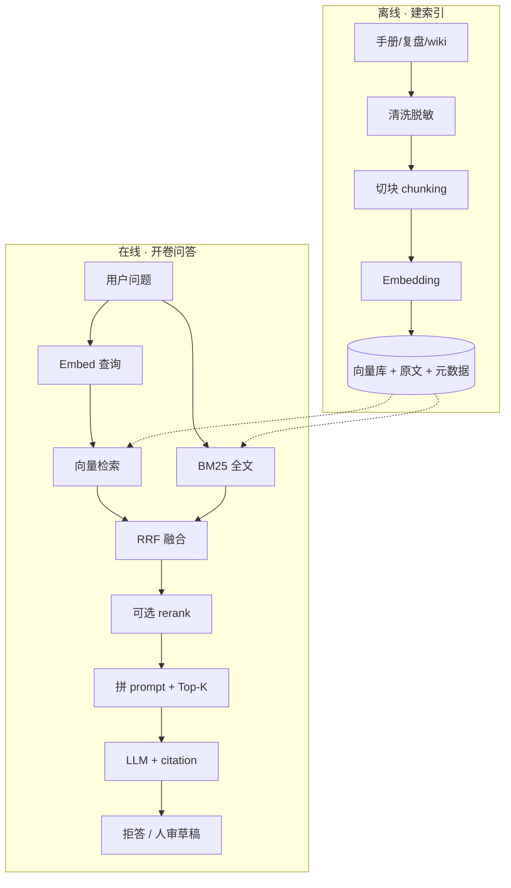
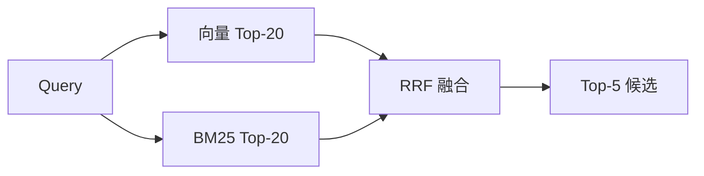
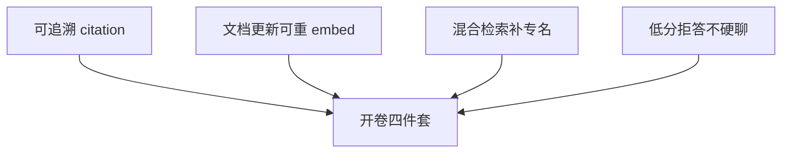

# RAG 检索增强

> 值班在告警卡片旁问「game/gw-1 OOM 上次怎么收的」——闭卷 LLM 编了一套从没发生过的 cordon 步骤；开卷 RAG 若检到三个月前的合服文档，又把**已作废的限号阈值**当标准答案。有人喊「换 70B」、有人喊「再灌一遍 wiki」，两句都不对。
> **本章回答**：一次 RAG 问答从离线建索引到在线检索生成，每个阶段怎么设计、答错怎么定责、SRE 红线怎么守。
> **不讲**：Prompt 四要素 → [02](../02-Prompt工程/)；FC 查实时指标 → [04](../04-Function-Calling与Tool-Use/)；MCP 工具插头 → [05](../05-MCP协议/)；Agent 多步编排 → [06](../06-Agent智能体/)。

**标记**：🎯重点 · 🔥难点 · ⭐常考 · 🔧实操
---

## 一、一张图：一次 RAG 问答的一生

> 🎯 **一句话**：RAG = 离线 **chunk→embed→入库**，在线 **问→检索→拼 prompt→生成**——检索错了，模型再强也是错答。



- 📖 **读图**
  - 🛤️ 上半条 **索引生命周期**：文档→块→向量，和原文/metadata 同存；换 Embedding 要 **整库重建**
  - 🛤️ 下半条 **问答生命周期**：语义路（向量）+ 专名路（BM25）→ 融合 → 进模型；数字/步骤必须来自片段
  - 🔪 定责第一刀：摊开 Top-K 原文——段没进＝检索；段进了还编＝生成；段是旧 SOP＝过期卷

#### ❓ 为什么不是「换大模型就好了」？

- ❌ **先换模型**：检索把错段/空段塞进窗口，70B 只会更自信地胡说
- ✅ **先摊开 Top-K**：相关段在不在、新不新、有没有权限泄漏——分叉后再动刀
- 🧭 **优化顺序**（全章口诀）：切块 → 混合检索 → rerank → embedding → 大模型

> 📝 **面试**：「RAG = chunk→embed→retrieve→generate；开卷减幻觉不消灭。答错先 Top-K，别先换模型。」⭐（练习题 Q2、Q7、Q14）

本节对应练习题 Q2、Q14。主线有了——先谈怎么切块。

---

## 二、离线：清洗、切块与元数据

> 🎯 **一句话**：检索命中的是 **块（chunk）** 不是整篇——切坏了，向量语义对、内容却缺半句否定词。

> 💡 **打个比方**：切块像撕菜谱——从「不要」和「重启」中间撕一刀，厨师只拿到「要重启」。

### ✂️ 切块策略 🎯⭐🔥

| 策略 | 适用 | 风险 |
|------|------|------|
| **结构切 H2/H3** | 运维手册、复盘 | 生产默认 |
| **overlap 10~20%** | 边界句两侧都保留 | 0 overlap 丢否定词 |
| 固定 500 token | 原型 | 易切断命令/表格 |
| 语义切 | 超长 unstructured | 贵、难运维 |

#### ❓ 为什么不能固定 500 token、0 overlap？

- 🎭 **小剧场**：复盘句「先看 limit，再查泄漏，**不要重启有状态服**」——固定 500、0 overlap → 块 A 尾「不要」，块 B 头「重启…」→ query「OOM 能重启吗」只命中块 B → 模型建议重启
- ✅ **正确做法**：按 H2「处置步骤」整节为一块 + overlap **15%**（边界句在相邻块重复）
- ⚠️ **步骤不拆半**：「先 cordon 再 drain」是一步流程，拆开＝召回半套 SOP

```text
按 H2「处置步骤」整节为一块
overlap 15%
元数据：source_path, section, updated_at, acl_tag, doc_status, game_id, model_version
```

- 🧼 **清洗与脱敏** 🎯：密钥、玩家 UID、完整内网拓扑 **不进库**；表格和 `kubectl` 示例 **整块保留**，别从命令中间切断
- 🧩 **Parent-Child（可选）** 🔥：检索用小块（~256 token）提精度，返回时带上 **parent 段落** 给 LLM——元数据存 `parent_id`，避免只给半句 kubectl

> ⚠️ **别混**：切块第一刀 ≠「切得越碎越好」——碎到半句否定词丢失，比大块更危险。

> 📝 **面试**：「优化顺序切块第一刀；结构切 + overlap 10~20%；步骤不拆半。」⭐（练习题 Q3）

口诀：**「切块第一刀」**。切好了，再 embed。

---

## 三、向量化：Embedding 与向量库

> 🎯 **一句话**：**Embedding 模型** 把文本变成固定维向量；**换模型必须整库重建**——新旧向量不能混比距离。

> 💡 **打个比方**：Embedding 像把书译成地图坐标——换翻译官后，旧坐标和新坐标不能在同一张图上比远近。

### 📐 Embedding vs 对话 LLM 🎯⭐

- **Embedding 模型**：文本 → 向量；用于相似检索（BGE / m3e / bge-m3 / text-embedding-3…）
- **对话 LLM**：token 序列 → 生成文本；和 Embedding **不是同一个模型**

```bash
curl -s http://rag-api.internal/v1/embed \
  -d '{"text":"战斗服 gw-1 OOM 上次怎么收的"}' | jq '.vector | length'
# 1536  ← 维度必须与库一致；model_version 必须与索引一致
```

#### ❓ 为什么换 Embedding 必须整库重建？

- 🧮 **空间不同**：不同模型的向量空间不可比；混库＝距离乱跳、召回崩
- ✅ **做法**：整库 delete + 重 embed；索引带 `embedding_model_version`；可蓝绿双写再切流量
- 📦 **容量直觉** 🔧：`100 万块 × 1536 × float32(4B) ≈ 6GB` 原始向量；HNSW 常 ×1.5~2 → **9~12GB**

### 🗄️ 向量库选型 ⭐

| 库 | 适合 |
|----|------|
| FAISS / Chroma | 原型 |
| pgvector | 已有 PostgreSQL |
| **ES / OpenSearch** | **已有日志栈、要混合检索**（优先） |
| Qdrant | 中小生产 |
| Milvus | 大规模 / 百万块以上再评 |

```text
cos("服务器内存爆了", "OOM 被杀") ≈ 0.89  → 应互召
cos("服务器内存爆了", "今天天气不错") ≈ 0.12 → 应远离
```

- 🔍 **HNSW vs Flat**：近似最近邻快但有 recall 损失；暴力准但慢——生产用 HNSW **必须评测 recall@K**
- 🔧 **增量**：文档 webhook → 只重 embed 变更块；全量 rebuild 放低峰；空库 batch 未完成应返 `INDEXING`，`doc_status=indexing` 不参与检索

> ⚠️ **别混**：Embedding ≠ 对话 LLM；换模型混旧向量＝事故，不是「慢慢覆盖」。

> 📝 **面试**：「有 ES 先 dense_vector + BM25，少一套运维；换 embedding 整库重建。」⭐（练习题 Q5、Q6）

入库了，怎么检索。

---

## 四、在线检索：混合检索与 RRF

> 🎯 **一句话**：运维 **默认混合检索**——向量抓语义，**BM25** 抓字面专名；**RRF（倒数排名融合）** 合两路，不必分数同量纲。

> 💡 **打个比方**：找事故工单——向量像「按意思搜」，BM25 像「按单号搜」；两本索引都要翻。



- 📖 **读图**
  - 宽召回 **20~50** → 进 prompt **3~5**；低于相似度阈值 **0 条拒答**
  - 弱相关硬答 = 开卷考错题

#### ❓ 为什么运维默认混合检索？

- 🔤 **仅向量**：口语「内存爆了」能召到 OOM，但 **漏** `INC-044` / `Xid` 字面
- 🔡 **仅 BM25**：工单号准，口语同义词可能漏
- ✅ **混合 + RRF**：两路优势合并——专名靠 BM25，同义靠向量

**RRF 公式** 🔥：

```python
# score(doc) = sum( 1 / (k + rank_i) ), k 常取 60
score = 1/(60+rank_vector) + 1/(60+rank_bm25)
```

- 🔧 **现场对比**：Query `INC-044 game-gw-1 Xid 怎么处理`
  - 仅向量 Top-5：泛化 GPU 文档，漏工单号
  - 仅 BM25 Top-5：命中工单，口语「显存打满」可能漏
  - 混合 RRF：两路合并

#### ❓ 为什么召回要先宽再精？

- ❌ **只召 5 再 rerank 50**：精排没有候选可救
- ✅ **先 20~50 再筛 3~5**：召回求宽，rerank 求准——顺序反了白花钱

**ES 同索引混合示意** 🔧（有 ES 时优先，不必先上 Milvus）：

```json
{
  "query": {
    "hybrid": {
      "queries": [
        {"match": {"content": "gw-1 OOM"}},
        {"knn": {"field": "embedding", "query_vector": ["..."], "k": 20}}
      ]
    }
  }
}
```

- 📖 **读图**
  - 同一索引存 **原文 + embedding + acl_tag + updated_at**
  - **ACL filter 先于** 向量/BM25——没过滤的混合＝先泄漏后补救
- 🔁 **Query 改写（可选）**：口语→多 query / HyDE 扩召回，也增延迟与幻觉风险；第一期可只做混合
- 🈶 **中文 BM25**：ES 用 ik / smartcn 等分词；与向量并行，各走各的——分词坏了专名路，别怪 RRF

> ⚠️ **别混**：召回（recall）求宽 ≠ rerank 求准；两阶段阈值分开 log。

> 📝 **面试**：「运维默认向量+BM25；RRF 不要求分数对齐；k=60 常见默认。」⭐（练习题 Q4）

口诀：**「专名靠 BM25，同义靠向量」**。召回宽了，rerank 与生成。

---

## 五、精排与生成：rerank、引用与拒答

> 🎯 **一句话**：召回求宽，**rerank** 求准；开了卷模型仍会 **生成加戏**——低温 + 强制 **citation** + 低分 **拒答**。

### 🎛️ rerank 与降级 🔥

- **cross-encoder**（如 `bge-reranker`）对 `(query, chunk)` 打分，比 bi-encoder 准但慢——适合 20~50 → 3~5
- **第一期可不上**，有评测基线再加
- **5xx 降级**：用 RRF Top-5 直进 LLM，**不整接口挂**

### 🧾 生成约束骨架 🔧

```text
只基于下列资料回答。资料没有的，说「知识库中未找到」，不要编。
每条结论标注来源（文档名 + 章节）。
不得输出 apply/delete/patch/exec。
数值必须来自资料原文，不得推测。
```

```json
{
  "answer": "...",
  "citations": [{"doc": "postmortem-2024-q3-gw-oom.md", "section": "处置步骤"}],
  "confidence": "high"
}
```

- 🔒 **Citation 校验** 🔥：生成后检查 `citations[].doc` **真在 Top-K**——编造 `postmortem-fake.md` 应拒收/重试/人审

### 三种失败模式 🎯⭐

| 模式 | 症状 | 修法 |
|------|------|------|
| 检索差 | Top-K 无相关段 | 切块 / 混合 / ACL / rerank |
| 生成加戏 | 段对仍编 YAML | 收紧 prompt / 低温 / 禁字段 / citation 校验 |
| 过期卷 | 段是旧 SOP | 下架 + 删向量 + 重 embed |

#### ❓ 为什么 RAG 降低幻觉却消灭不了？

- 📦 **开卷只换「材料来源」**：模型仍会脑补步骤、编造字段、伪造 citation
- ✅ **工程约束**：低温 **0~0.2**、强制引用、低分拒答、写操作 **人审**——kubectl 前人仍须打开源文档

### 收束：RAG 凭什么比闭卷靠谱



- 📖 **读图**
  - 四件套降低幻觉，**不消灭**——RAG 是只读草稿，不是自动修故障
  - citation / 可更新 / 混合 / 拒答缺一，就会回到「开卷仍胡说」

> ⚠️ **别混**：**RAG vs 微调**——改事实用 RAG（可追溯）；改口吻/格式才微调。**RAG vs 长窗口塞整本 wiki**——后者贵、慢、更新要重贴、中间稀释，不是「穷人 RAG」。

> 🔍 **现场**：片段写「limit 512Mi→1Gi 需审批」，模型仍输出 apply YAML——**生成加戏**，不是检索问题；加禁 apply 字段 + 人打开源 wiki。（练习题 Q8、Q11）

- 🌡️ **拒答率升高**：先分两类——库真没有→拒答正确；该有却没有→查检索/切块/ACL。**勿降阈值硬答**＝幻觉回潮
- 🗂️ **向量库 vs 对象存储**：向量库存 embedding+id；原文在 S3/OSS/ES `_source`；检索 id 再拉全文——别把大段原文只塞进向量侧

> 📝 **面试**：「RAG 降低幻觉不消灭；数字来自片段；变更人审；拒答率不是越低越好。」⭐

练习题 Q8、Q11。生成之外还有 ACL 与评测。

---

## 六、ACL、评测与生命周期

> 🎯 **一句话**：知识库要 **ACL** 过滤可检索子集；评测分 **检索 / 生成 / 工程** 三层；**50~100** 条真实值班问题做基线。

### 🔐 ACL 与多租户 🔥⭐

- 🎭 **事件**：支付 SOP 出现在战斗服问答 → 查 **acl_tag** / `game_id`，不是 rerank 的锅
- 🚨 全公司 Confluence 无过滤灌库 = 垃圾进垃圾出
- ✅ filter 必须进 **向量与 BM25 两侧**——只滤一路仍会泄漏
- 🎮 活动专项：`acl_tag=event_…`；活动结束 **整库下架** 该标签，避免平时招到临时 SOP

### 📅 文档生命周期 🔧

```text
wiki 更新 → 24h 内重切块 + 重 embed
作废文档 → 删向量 + doc_status=deprecated
回答展示 updated_at → 值班判断时效
```

```bash
curl -s http://rag-api.internal/v1/admin/index_stats \
  | jq '{chunks, model_version, oldest_embed_at}'
# model_version:"bge-m3-v1", oldest_embed_at:"2025-08-01"
# ← wiki 大改但 embed 仍旧月 = 过期卷
```

### 📏 评测三层 + RAGAS ⭐

| 层 | 看什么 |
|----|--------|
| 检索 | 相关文档进 Top-K 吗（recall@K）；Context Precision / Recall |
| 生成 | Faithfulness、Answer Relevance、该拒否拒 |
| 工程 | P99 延迟、token 成本 |

- 🧪 **评测集**：过去 6 个月真实 Oncall 脱敏 **50~100** 条；标 `expected_docs[]`、`should_refuse`、`forbidden_content`
- 负例必含：限号旧阈值、支付 SOP 误召、编造 citation——wiki 大改 / 换 embedding **必跑回归**
- ⏱️ **P99 预算直觉**：embed 50ms + 向量 80ms + BM25 40ms + rerank 200ms + LLM 2s ≈ **~2.5s**——超则先砍 rerank / 减 K，别先换 70B

- 🧱 **LangChain 一句**：Loader / Splitter / VectorStore / Retriever / Chain 是胶水——**原理仍是** chunk→embed→retrieve→generate，不替代本章
- 📚 **超长复盘**：单篇 200K 字不能整块 embed——按章 Map 摘要入库，在线命中摘要再 **按需拉原文章节**（Resource 式分工见 [05](../05-MCP协议/)）
- 🔗 **与 Agent 边界**：RAG 是 **一步开卷**；Agent 多步会放大错误——先把单轮质量做稳再上 [06](../06-Agent智能体/)
- 🤝 **与 FC / Prompt 同用**：数值以 **实时 tool** 为准；SOP 步骤以 **citation 片段** 为准；冲突以实时为准。RAG 片段放 **User** 并标不可信，别塞进 System（间接注入 → [02](../02-Prompt工程/)）
- 🔁 **人工反馈闭环**：值班点 helpful/no → 进正/负样本；weekly Review Top-K miss，优先改切块/ACL，不是加 prompt 形容词
- 🗓️ **索引运维日历**：wiki 大改 **24h 内** 重 embed；季度 **recall@5 回归**；活动结束 **下架 event acl**；embedding 升级 **蓝绿 rebuild**

> ⚠️ **别混**：向量相似度阈值拒答 ≠ rerank 分数拒答——两阶段分开调。相似度 **0.7** 不是 universal——按 embedding 分布与评测集调。

> 📝 **面试**：「改事实 RAG；ACL 两侧 filter；RAGAS 四指标 + 人工抽检；有 ES 先混合。」⭐（练习题 Q1、Q10）

练习题 Q1、Q9、Q10。红线钉死，作战定责。

---

## 七、边界：SRE 该用与禁止

> 🎯 **一句话**：RAG 输出是 **只读草稿**——生产数据/密钥不进库；写操作人审；过期 SOP 必须下架；**AI 不替值班签字变更**。

| 该用 | 禁止 |
|------|------|
| 手册/复盘/SOP **只读** 知识库 | 密钥、玩家数据、完整拓扑进库 |
| 混合检索 + 低分拒答 | 相似度低硬答 |
| 答案带 citation | RAG 接写工具 auto apply |
| 按身份 ACL 过滤 | 无过滤灌全 wiki |
| 文档更新 **24h 内** 重 embed | 只改 markdown 不重 embed |
| 告警旁「相似案例」只读卡片 | 吹成自动修故障 / 自动关 ticket |

### 落地场景 1：战斗服 OOM「上次怎么收的」🔧

1. 脱敏复盘按 H2 切，overlap 15%，元数据带 `updated_at`
2. 混合检索：向量抓 OOM 语义，BM25 抓 `gw-1` / `OOMKilled`
3. 可选 rerank Top-3；无块 → 拒答 + 建议查 Grafana
4. 输出 **草稿**；执行步骤人打开源 wiki

指标：Top-5 检索命中 >85%；无依据句抽检 <5%；文档更新 24h 内向量跟上。

### 落地场景 2：限号阈值改了 bot 仍答旧数

- 根因链：wiki 改了 **没重 embed**；作废页 **没删向量**；没展示 `updated_at`
- 修复：下架 → 删向量 → 重切块 embed → 进评测集回归

练习题 Q9、Q12、Q13。现在回开头那个现场。

---

## 八、作战：RAG 答错定责

> 🎯 **一句话**：答得差 **先摊开 Top-K 原文**——再分叉检索差 / 生成加戏 / 过期卷；优化顺序 **切块→混合→rerank→embedding→大模型**。


- 📖 **读图**
  - 第一刀永远是 Top-K；分叉后才动切块/混合/ACL/生成约束/重 embed
  - 别从换大模型起手——模型只放大窗口里已有的对或错

### 现象 · 先做 · 别做

| 现象 | 先做 | 别做 |
|------|------|------|
| 相关段没进 Top-K | 改切块、混合、rerank | 先换大模型 |
| 片段对但答非所问 | 约束 prompt、减 K、citation 校验 | 再灌脏片段 |
| wiki 已改仍答旧数 | 重切块重 embed | 只改对象存储 |
| 支付 SOP 进普通会话 | ACL 事件 | 当 rerank 的锅 |
| rerank 5xx | 降级 RRF Top-K | 整接口挂 |
| 拒答率「太高」 | 分库没有 vs 该有却漏 | 降阈值硬答 |

### 60 秒剧本 🔧

> 🔍 **现场**：接到「又胡说」，别先换模型——60 秒走完这条线。

```text
① 0–10s   debug/search 拉 Top-K + score + preview + updated_at
② 10–30s  相关段在不在？在→生成问题；不在→检索问题
③ 30–45s  检索：切块 / 混合 / ACL / embedding 版本
④ 45–60s  过期：updated_at vs wiki；删向量 + 重 embed
```

```bash
curl -s 'http://rag-api.internal/v1/debug/search?q=gw-1+OOM' \
  | jq '.top_k[] | {score, doc, section, updated_at, preview, acl_tag}'
# 最高分若是支付限号 doc → acl_tag 过滤漏了 battle
```

### 离线 / 在线 pipeline（白板可画）🔧

```text
离线：源 webhook → 清洗脱敏 → H2 切 + overlap 15% → 打元数据
     → batch embed → upsert 向量+原文 → 抽检 10 块能否 retrieve 回原 section

在线：auth → acl_filter(game_id, role) → embed(query) 维度校验
     → vector_k=30 + bm25_k=30 → RRF → optional rerank → top 5
     → score < 阈值 → INSUFFICIENT_EVIDENCE
     → System 红线 + User 资料块 → LLM t=0.1 → 校验 citation ∈ Top-K → audit
```

**回到开头**：闭卷编 cordon、开卷检到过期合服文档——正确剧本是摊开 Top-K → 分叉三模式 → 优化顺序切块优先。现在该能拦住「换大模型」的同学了。

本节对应练习题 Q7、Q13、Q14。

---

## 九、收口

### 参数速查 🔧

| 参数 | 推荐 | 改错后果 |
|------|------|----------|
| 切块 | H2/H3 结构 | 固定 500 切断否定句 |
| overlap | **10~20%** | 0 丢边界 |
| 宽召回 | **20~50** | 太小漏、太大脏 |
| 进 prompt | **3~5** | 太大稀释窗口 |
| 相似度阈值 | 低于拒答 | 弱相关硬聊 |
| 生成 temperature | **0~0.2** | 加戏 |
| 文档更新 | **24h** 内向量跟上 | 答旧阈值 |
| 评测基线 | **50~100** 条 | 无法回归 |

### 面试锚点

| 问 | 30 秒答 |
|----|---------|
| RAG 是什么？ | chunk→embed→retrieve→generate；开卷减幻觉。 |
| vs 微调？ | 改事实 RAG；改口吻微调。 |
| 为何混合检索？ | 向量语义 + BM25 专名；RRF 融合。 |
| 切块注意？ | 结构切 + overlap；步骤不拆半。 |
| 答得差怎么排？ | 先 Top-K；检索差 vs 生成加戏 vs 过期。 |
| 换 embedding？ | 整库重建，不能混旧向量。 |
| 向量库选型？ | 有 ES 先混合；百万级再评 Qdrant/Milvus。 |
| 拒答率？ | 库没有应拒；该有没有查检索。 |
| RAG 能 auto fix？ | 不能；只读草稿，变更人审。 |
| ACL？ | 按身份过滤；向量与 BM25 两侧都要。 |

### 易错一句话对照

- 注入知识先微调 → 改事实用 RAG
- 长窗口塞 wiki = 穷人 RAG → 贵慢稀释
- 切块不如换大模型 → 切块常是第一刀
- 「先 cordon 再 drain」拆开切 → 召回半套
- 运维只用向量 → 专名要 BM25
- 召回 5 再 rerank 50 → 宽召回 20~50
- 相似度低硬答 → 低分拒答
- Embedding = 对话 LLM → 只出向量
- 换 embedding 混旧向量 → 整库重建
- 只改 markdown → 必须重 embed
- 删文档不删向量 → 召回作废 SOP
- 拒答率越低越好 → 该拒拒
- 有 ES 必须 Milvus → 先 ES 混合
- RAG auto apply → 只读人审
- 只滤向量一路 ACL → BM25 侧仍泄漏

### 数字墙

> overlap **10~20%** · 宽召回 **20~50** · 进 prompt **3~5** · 评测 **50~100** 条 · 100万×1536 float32 ≈ **6GB** · 文档更新 **24h** · 生成 temperature **0~0.2** · RRF **k=60** · P99 预算 **~2.5s** · citation **必须校验在 Top-K**

### 口述模板

**【30 秒】**「RAG 先 chunk embed 入库，在线混合检索向量+BM25，RRF 融合，Top-3~5 进模型带 citation。答错先摊开 Top-K。改事实用 RAG，数据不出库，输出草稿，变更人审，过期文档下架重 embed。」

**【2 分钟】** 沿一次 RAG 问答一生：离线清洗结构切+overlap+元数据 → embedding 与选型 → 混合检索与 RRF → rerank 可选 → 生成约束与拒答 → ACL/评测 → 三种失败模式 → 优化顺序切块优先 → 红线四条。

**【常见追问】**

| 追问 | 答法 |
|------|------|
| 长窗口塞 wiki | 贵慢稀释；不是穷人 RAG |
| 只用向量 | 不够；工单号要 BM25 |
| rerank 必须吗 | 有评测再加；5xx 降级 RRF |
| RAG 自动修 | 不能；只读人审 |
| 拒答率高 | 分库没有 vs 检索漏 |
| GraphRAG / HyDE | 加分项；第一期 hybrid+结构切通常够；HyDE 慎用 |

---

## 合上书

对着第一节主图口述一遍，卡住就回对应小节。开头那个现场——闭卷编 cordon、开卷检到过期合服文档——错在哪一层，现在该能说清。

- [ ] **默画主图**：离线建索引 + 在线问答全链路；定责第一刀是 Top-K。（→ Q2 · Q14）
- [ ] **口述切块**：结构切、overlap、不要从「不要\|重启」中间切；步骤不拆半。（→ Q3）
- [ ] **Embedding vs LLM**：换模型为何整库重建；6GB 怎么估；有 ES 先混合。（→ Q5 · Q6）
- [ ] **混合检索 + RRF**：向量 vs BM25 各擅长什么；为何先宽后精。（→ Q4）
- [ ] **三种失败**：检索差、生成加戏、过期卷各怎么认、怎么修；citation 校验。（→ Q7 · Q8 · Q11）
- [ ] **RAG vs 微调 vs 长窗口**；ACL 两侧 filter；评测三层 / RAGAS。（→ Q1 · Q10）
- [ ] **红线**：脱敏、只读、人审、24h 重 embed；OOM 案例与限号过期根因链。（→ Q9 · Q12）
- [ ] **定责决策树** + 60 秒剧本；优化顺序背出来。（→ Q7 · Q13 · Q14）
- [ ] **收束开卷四件套**：citation、可更新、混合、拒答。

---
