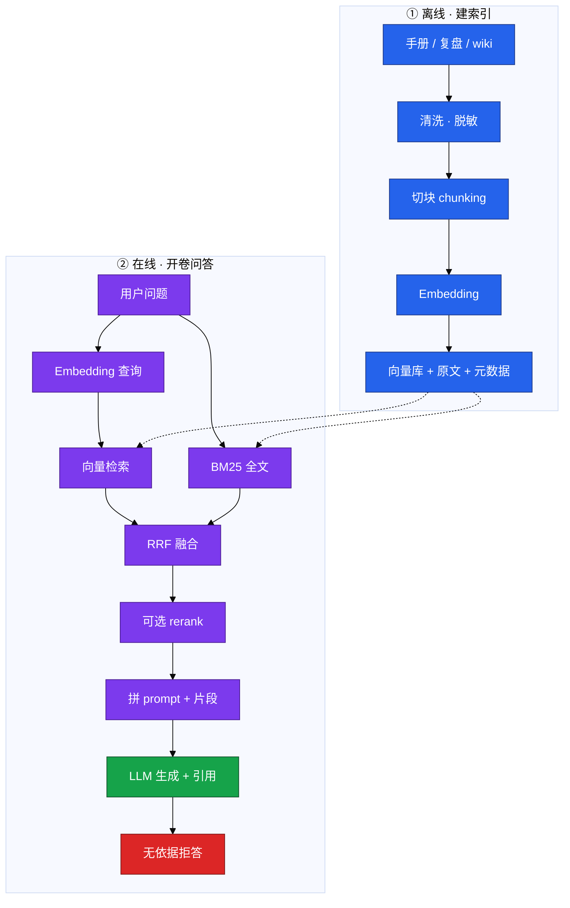
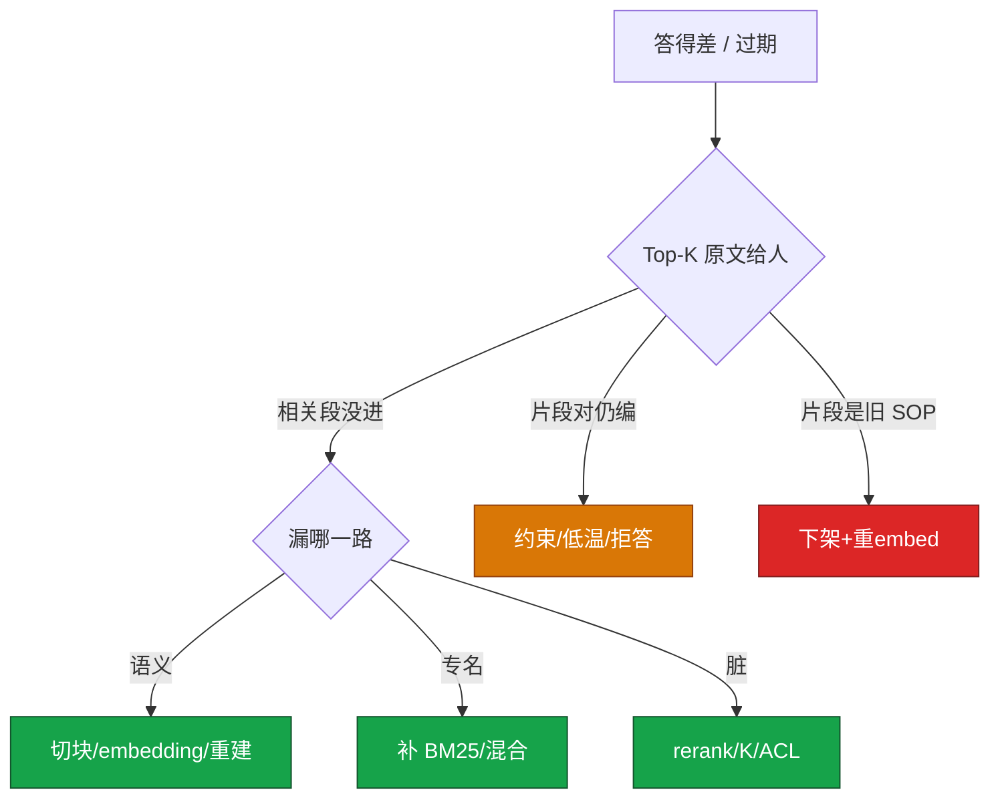

# 03｜RAG 检索增强

值班在告警卡片旁问「game/gw-1 OOM 上次怎么收的」——闭卷 LLM 编了一套从没发生过的 cordon 步骤；开卷 RAG 若检索到三个月前的合服文档，又会把**已作废的限号阈值**当标准答案。RAG 不是「把 wiki 塞进窗口」，是 **chunk → embed → 混合检索 → 带引用生成**，检索错了后面模型再强也是错答。

> **加分项定位**：RAG 是 SRE 让 LLM「开卷答运维题」的标准解法——考你会不会 chunk→embed→retrieve→generate，混合检索和评测，而不是闭卷硬聊。  
> **红线**：生产数据、密钥、玩家 UID 不进库；RAG 输出是草稿，kubectl apply 必须人审；过期 SOP 要下架，否则开卷考的是过期卷。

---

## 面试怎么考

| 频率 | 典型问法 | 30 秒要点 | 2 分钟要点 |
|:----:|----------|-----------|------------|
| ★★★★★ | RAG 是什么？和微调怎么选？ | 先检索片段再生成；改事实用 RAG，改口吻才微调 | 离线建索引 + 在线检索生成；可追溯、可更新；微调慢、黑盒；约九成「懂业务」用 RAG |
| ★★★★★ | RAG 链路怎么画？ | chunk→embedding→向量库；问→混合检索→Top-K→LLM | 离线清洗切块 embed 入库；在线 embed 查询、向量+BM25、RRF 融合、可选 rerank、拼 prompt 生成 |
| ★★★★ | 为什么运维要混合检索？ | 专名多：向量懂语义，BM25 抓工单号/错误码 | 「内存爆了」≈ OOM 靠向量；`INC-044`、`Xid` 靠 BM25；RRF 融合两路排名 |
| ★★★★ | 切块怎么切？ | 按结构切 H2/H3；overlap 10~20%；别把 SOP 步骤拆开 | 固定长度易从「不要重启」中间切断；表格/kubectl 示例整块保留；元数据带来源/时间/权限 |
| ★★★★ | 答得差怎么排？ | 先摊开 Top-K 原文：检索差还是生成加戏 | 相关段没进→改切块/混合/rerank；片段对仍编→约束 prompt/低温/拒答；旧 SOP→重 embed 下架 |
| ★★★ | 向量库怎么选？ | 有 ES 先做混合；量大再上 Qdrant/Milvus | pgvector 少组件；HNSW 吃内存；100 万×1536×4B≈6GB；换 embedding 整库重建 |
| ★★★ | 怎么评测 RAG？ | 检索命中 + 生成忠实度 + 端到端延迟 | 50~100 条真实值班问题；拒答率不是越低越好；RAGAS/人工抽检 |

---

## SRE 边界

| 该用 | 禁止 |
|------|------|
| 手册、复盘、SOP、wiki 做 **只读** 知识库 | 密钥、玩家数据、完整内网拓扑进库 |
| 混合检索 + 低分 **拒答** | 相似度低硬答「显得智能」 |
| 答案带 **citation**（文档名+章节） | RAG 接写工具自动 kubectl apply |
| 按身份 **ACL** 过滤可检索子集 | 全公司 Confluence 无过滤灌进库 |
| 文档更新后 **24h 内** 重 embed | 只改 markdown 不重 embed |
| 告警旁挂「相似案例」卡片（只读引用） | 把 RAG 吹成能替值班签字变更 |

---

## 原理讲透

### 3.1 全链路：chunk → embedding → retrieve → generate

**一句话**：闭卷靠记忆会幻觉；开卷先找块再生成——检索错了，后面模型再强也是错答。

**打个比方**：像开卷考试——先翻索引找页码（检索），再在指定页上答题（生成）；索引错了，答案写得再漂亮也是错题。

**现场走一遍**（从问句到带 citation 的答案）：

1. 用户问：「战斗服 gw-1 OOM 上次怎么收的？」

2. **在线 embed 查询**：

```bash
curl -s http://rag-api.internal/v1/embed \
  -d '{"text":"战斗服 gw-1 OOM 上次怎么收的"}' | jq '.vector | length'
# 输出: 1536
```

3. **向量检索** Top-20 + **BM25** Top-20：

```bash
curl -s http://rag-api.internal/v1/search \
  -d '{"query":"战斗服 gw-1 OOM","vector_top":20,"bm25_top":20}' \
  | jq '.candidates | length'
# 输出: 35  (去重后)
```

4. **RRF 融合** → rerank → 取 Top-3 片段进 prompt。

5. **LLM 生成**（`temperature=0.1`）：

```json
{
  "answer": "先查 memory limit 与泄漏，参考复盘 cordon 前确认无状态…",
  "citations": [{"doc": "postmortem-2024-q3-gw-oom.md", "section": "处置步骤"}]
}
```

6. 值班点开 citation 核对源文档——**草稿**，不自动执行。

**输出解读**：

| 阶段 | 输入 | 输出 | 失败信号 |
|------|------|------|----------|
| embed 查询 | 问句文本 | 1536 维向量 | 维度与库不一致 |
| 向量检索 | 向量 | 语义近邻块 | 「内存爆了」召不回 OOM 文档 |
| BM25 | 原问句 | 含 `gw-1`/`OOMKilled` 块 | 专名漏召回 |
| RRF | 两路排名 | 融合候选 | 只开一路会偏 |
| 生成 | Top-3 片段 | 答案+citation | 片段对仍编造 |

**面试怎么说**：「离线清洗切块 embed 入库带元数据；在线向量+BM25 混合、RRF、宽召回 20~50、进模型 3~5；资料没有就拒答，数字必须来自片段。」



> **记住**：图上没有箭头从「模型闭卷记忆」指向 SOP 数字——数字必须来自库里的块。

---

### 3.2 切块 chunking

**一句话**：检索命中的是 **块** 不是整篇文档；切坏了，向量语义对、内容却缺半句。

**打个比方**：像把菜谱撕成卡片——从「不要」和「重启」中间撕一刀，厨师只拿到「要重启」，灾难现场。

**现场走一遍**（固定 500 token 切断 SOP）：

1. 复盘原文关键句：「先看 limit，再查泄漏，**不要重启有状态服**」。

2. **错误切块**（固定 500 token，0 overlap）——块 A 结尾在「不要」，块 B 从「重启」开始。

3. 检索 query「OOM 能重启吗」→ 只命中块 B：

```text
Chunk-B: 重启有状态服前需确认持久化…
```

4. 模型建议「可以重启」——**检索语义沾边、内容缺否定词**。

5. **正确切块**：按 H2「处置步骤」整节为一块，**overlap 15%**（边界句两边都有）。

6. 元数据：`source_path`, `section`, `updated_at`, `acl_tag`。

**输出解读**：

| 策略 | 适用 | 注意 |
|------|------|------|
| 结构切 H2/H3 | 运维手册 | 「先 cordon 再 drain」不拆开 |
| overlap **10~20%** | 生产必开 | 0 overlap 边界句丢失 |
| 固定 500 token | 原型 | 易切断命令/表格 |
| 语义切 | 长文 | 贵，难运维 |

**面试怎么说**：「优化顺序：切块第一刀，再混合检索，再 rerank，再换 embedding，最后换大模型；很多『模型不行』其实是块切烂了。」

---

### 3.3 Embedding 与向量库

**一句话**：Embedding 只出向量；换模型必须整库重建——新旧向量不能混比。

**打个比方**：Embedding 像把书翻译成坐标——换翻译官（换模型）后，旧坐标和新坐标不能混在一张地图上比距离。

**现场走一遍**（估容量 + 换模型重建）：

1. 知识库 **100 万** 块，维度 **1536**，float32：

```text
1000000 × 1536 × 4B ≈ 6GB 原始向量
HNSW 索引内存通常 ×1.5~2 → 约 9~12GB
```

2. 运维口语问「OOM」与「内存爆了」余弦相似度（同模型）：

```text
cos("服务器内存爆了", "OOM 被杀") ≈ 0.89  → 能互召
cos("服务器内存爆了", "今天天气不错") ≈ 0.12 → 应远离
```

3. 决定从 `bge-large` 换 `bge-m3`——**整库删除 + 重 embed**，不能新旧混检。

4. 选型：已有 **ES** → 先加 `dense_vector` 做混合；只有 PG → **pgvector**；百万级专用 → Qdrant/Milvus。

**输出解读**：

| Embedding | 说明 |
|-----------|------|
| BGE / m3e | 中文运维文档常用 |
| bge-m3 | 中英混用 |
| text-embedding-3 | 云 API，按 token 计费 |
| 用 GPT 做向量 | ✗ 不对口，且贵 |

| 向量库 | 适合 |
|--------|------|
| FAISS / Chroma | 原型 |
| pgvector | 已有 PostgreSQL |
| ES / OpenSearch | **已有日志栈、要混合** |
| Qdrant | 中小生产 |
| Milvus | 大规模 |

**面试怎么说**：「Embedding 只出向量，和对话 LLM 不是同一个；换 embedding 整库重建；有 ES 不必为了专业向量库再运维一套。」

---

### 3.4 混合检索与 RRF

**一句话**：运维专名多，**默认混合**；只走向量会漏工单号，只走 BM25 会漏同义词。

**打个比方**：找事故工单——向量像「按意思搜」（「内存爆了」≈ OOM），BM25 像「按单号搜」（`INC-044`）；两本索引都要翻。

**现场走一遍**（单路漏召回对比）：

1. Query：`INC-044 game-gw-1 Xid 怎么处理`

2. **仅向量** Top-5——可能全是泛化 GPU 文档，**漏** `INC-044` 字面。

3. **仅 BM25** Top-5——命中 `INC-044`，但「显存打满」口语问法可能漏。

4. **混合**：向量 Top-20 + BM25 Top-20 → **RRF** 融合：

```python
# RRF 分数 = sum(1 / (k + rank_i)), k 常取 60
score(doc) = 1/(60+rank_vec) + 1/(60+rank_bm25)
```

5. 最终 Top-5 进 rerank；低于相似度阈值 → **拒答**。

**输出解读**：

| 路 | 擅长 | 运维例子 |
|----|------|----------|
| 向量 | 语义 | 「内存爆了」≈ OOMKilled |
| BM25 | 字面 | `INC-044`、`Xid`、errno |

| 阶段 | 条数 |
|------|------|
| 宽召回 | **20~50** |
| 进 prompt | **3~5** |
| 低于阈值 | **0（拒答）** |

**面试怎么说**：「运维默认向量+BM25，RRF 融合排名不必分数同量纲；专名靠 BM25，口语靠向量。」

---

### 3.5 Rerank 与生成约束

**一句话**：召回求宽，rerank 求准；开了卷模型仍会编——要低温 + 引用 + 拒答。

**打个比方**：海选 50 人（召回），复试挑 3 人（rerank），最后答题（生成）——仍要监考（引用+拒答）防抄袭卷外内容。

**现场走一遍**（片段对但模型加戏）：

1. Top-3 片段明确写「limit 512Mi → 调到 1Gi 需审批」。

2. 模型却答「建议直接 apply 以下 YAML：…」——**生成加戏**。

3. 收紧 prompt：

```text
只基于下列资料回答。资料没有的，说「知识库中未找到」，不要编。
每条结论标注来源（文档名 + 章节）。不得输出 apply/delete。
```

4. `temperature=0.1`，强制 `citations` 字段非空。

5. 无 citation 或相似度 < 阈值 → 返回 `INSUFFICIENT_EVIDENCE`。

6. rerank 服务 5xx → **降级**用 RRF Top-5 直接进 LLM，不整接口挂。

**输出解读**：

| 手段 | 作用 |
|------|------|
| temperature **0~0.2** | 减发散 |
| 强制 citation | 值班可核对 |
| 低分拒答 | 弱相关不硬聊 |
| 返回引用片段 | 人对照源文档 |

**面试怎么说**：「宽召回 20~50，rerank 取 3~5；生成低温+强制引用；RAG 降低幻觉不消灭，kubectl 前人打开源文档。」

> **记住**：支付 SOP 出现在战斗服问答 → 查 **ACL**，不是 rerank 的锅。

---

### 3.6 RAG vs 微调 · 评测 · LangChain 一句

**一句话**：改事实用 RAG；改说话腔才微调；LangChain 只是把上述链路组件化编排，不是魔法。

**打个比方**：RAG 像更新图书馆书架；微调像换厨师口味——菜谱事实变了该改书架，不是重训厨师。

**现场走一遍**（答得差排障 + 评测基线）：

1. 值班吐槽「bot 答错了」——**先摊开 Top-K 原文**给人看。

2. **分支 A**：相关段没进 Top-K → 切块？混合？ACL？

```bash
curl -s http://rag-api.internal/v1/debug/search?q="gw-1+OOM" \
  | jq '.top_k[] | {score, doc, section, preview}'
```

3. 输出显示最高分是无关「支付限号」文档 → **ACL 过滤**漏了 `acl_tag=battle`。

4. **分支 B**：片段对，答案仍编数字 → 收紧 prompt / FC 查指标。

5. **分支 C**：片段是三个月前合服 doc → wiki 已改但 **没重 embed** → 下架+删向量+重切块。

6. 评测集 **50~100** 条真实值班问题，三层指标：

| 层 | 指标 |
|----|------|
| 检索 | 相关文档进 Top-K 吗 |
| 生成 | 忠实度、该拒否拒 |
| 工程 | P99 延迟、成本 |

7. 拒答率 **不是越低越好**——库没有的问题硬答就是幻觉。

**输出解读**：

| 维度 | RAG | 微调 |
|------|-----|------|
| 注入知识 | 改文档即生效 | 重训 |
| 可追溯 | 能 cite | 黑盒 |
| 适合 | 事实、SOP | 口吻、格式 |

**LangChain 一句**：DocumentLoader、TextSplitter、VectorStore、Retriever、Chain 串 pipeline——原理不变，仍是 chunk→embed→retrieve→generate。

**面试怎么说**：「答得差先 Top-K 定性检索还是生成；优化顺序切块→混合→rerank→embedding→大模型；评测 50~100 条三层；LangChain 是胶水不是替代原理。」

**RAG 排障决策树**：



| 现象 | 先做 | 别做 |
|------|------|------|
| 相关段没进 Top-K | 改切块、混合、rerank | 先换大模型 |
| 片段对但答非所问 | 约束 prompt、减 K | 再灌脏片段 |
| wiki 已改仍答旧数 | 重切块重 embed | 只改对象存储 |
| 支付 SOP 进普通会话 | ACL 事件 | 当 rerank 的锅 |
| rerank 5xx | 降级融合 Top-K | 整接口跟着挂 |

**生产参数速查**：

| 参数 | 推荐值 | 改错后果 |
|------|--------|----------|
| 切块 | 按 H2/H3 结构 | 固定 500 从「不要」切断 |
| overlap | **10~20%** | 0 则边界句丢失 |
| 宽召回 | **20~50** | 太小漏、太大脏 |
| 进 prompt | **3~5** | 太大稀释窗口 |
| 相似度阈值 | 低于则拒答 | 弱相关硬聊 |
| rerank | 有评测再加 | 第一期非必选 |
| 文档更新 | **24h** 内向量跟上 | bot 答旧阈值 |
| 生成 temperature | **0~0.2** | 加戏 |

---

## 落地场景

### 场景 1：战斗服 OOM「上次怎么收的」

**背景**：值班在告警卡片旁追问，闭卷 LLM 编造了从没发生过的步骤。

**做法**：

1. 知识库收录脱敏复盘，按 H2 结构切，overlap **15%**，元数据带 `updated_at`。
2. 在线混合检索：向量抓「内存打满/OOM」，BM25 抓 `gw-1`、`OOMKilled`。
3. rerank 取 Top-3 进 prompt；生成带 citation；无相关块则拒答并建议查 Grafana。
4. 输出标注 **草稿**；执行步骤人打开源文档核对，不自动变更。

**指标**：Top-5 检索命中 >85%；忠实度抽检无依据句 <5%；文档更新 **24h** 内向量跟上。

**画面**：若有人跳过 citation 直接信 bot → 可能按旧 SOP 误操作；必须点开源 wiki。

### 场景 2：限号阈值改了 bot 仍答旧数

**背景**：活动前策划改限号规则，wiki 已更新，RAG bot 仍引用三个月前合服文档。

**根因链**：

1. 只改了 Confluence，**没重 embed** → 检索仍是旧语义。
2. 作废合服页 **没删向量** → 开卷考过期卷。
3. 没展示 `updated_at` → 值班无法判断时效。

**修复**：下架/标废弃 → 删向量 → 重切块 embed → 回答展示更新时间 → 该问题进评测集回归。

---

## 口述模板

### 【30 秒】

「RAG 就是先检索相关片段再让 LLM 生成，适合把 SOP、复盘、wiki 注入助手。链路是 chunk、embedding、混合检索、可选 rerank、拼 prompt 生成。运维默认向量加 BM25，专名靠 BM25。答得差先摊开 Top-K 看是检索还是生成问题。生产数据不出域，输出是草稿，变更必须人审，过期文档要下架重 embed。」

### 【2 分钟】

「离线侧清洗脱敏、按结构切块带 overlap 和元数据、embed 进向量库。在线侧问题 embed，向量语义检索加 BM25 专名检索，RRF 融合，宽召回 20 到 50 条，rerank 后进模型 3 到 5 条，低分拒答。生成要低温、强制引用、资料没有就拒答。和微调比，改事实用 RAG 因为可追溯、可更新；微调改口吻。向量库有 ES 先做混合，换 embedding 要整库重建。评测分检索命中、生成忠实度、工程延迟三层，50 到 100 条真实问题做基线。LangChain 只是把链路组件化，原理不变。红线是 ACL、脱敏、只读、不自动 apply。」

### 【常见追问】

| 追问 | 答法 |
|------|------|
| 长窗口塞整本 wiki 行不行？ | 不行：贵、慢、中间稀释；不是穷人 RAG |
| 只用向量检索够吗？ | 不够：工单号、错误码要 BM25 |
| 切块和换模型哪个优先？ | 切块往往是第一刀 |
| rerank 必须上吗？ | 有评测再说；第一期可 Top-5 直接进 LLM |
| RAG 能自动修故障吗？ | 不能：只读建议；执行走人审 |
| 拒答率高怎么办？ | 分两类：库真没有→正常；该有却没有→查检索 |

---

## 必会 · 常考

### 对错表

| 说法 | 对错 | 纠正 |
|------|:----:|------|
| 注入业务知识应该先微调 | ✗ | 改事实用 RAG |
| 微调了就不会幻觉 | ✗ | 仍会编，且黑盒 |
| 长窗口塞 wiki = 穷人 RAG | ✗ | 贵、慢、更新要重贴 |
| 切块不如换大模型值钱 | ✗ | 切块往往是第一刀 |
| 「先 cordon 再 drain」可以拆开切 | ✗ | 步骤拆开会召回半套 |
| 运维只用向量检索就够 | ✗ | 专名要 BM25；默认混合 |
| 召回 5 条再 rerank 50 | ✗ | 宽召回 20~50，进模型 3~5 |
| 相似度低也要硬答 | ✗ | 低分拒答 |
| Embedding 和对话模型是同一个 | ✗ | embedding 只出向量 |
| 换 embedding 可混旧向量 | ✗ | 整库重建 |
| 只改 markdown 检索就会变 | ✗ | 必须重 embed |
| 删文档不删向量 | ✗ | 会召回作废 SOP |
| 拒答率越低越好 | ✗ | 该拒拒、该答答 |
| 已有 ES 必须上 Milvus | ✗ | 先用 ES 混合 |
| RAG 可以接写工具自动修 | ✗ | 只读；变更人审 |
| 全公司 wiki 无过滤灌库 | ✗ | 垃圾进垃圾出；ACL |

### 易混

| A | B | 区分 |
|---|---|------|
| 检索差 | 生成加戏 | 前者 Top-K 缺段；后者片段对仍编 |
| 向量检索 | BM25 | 语义 vs 字面专名 |
| 召回 | rerank | 宽 vs 准；20~50 vs 3~5 |
| RAG | 微调 | 事实 vs 口吻 |
| RAG | 长窗口 | 可更新 cite vs 贵且稀释 |
| Embedding 模型 | 对话 LLM | 只出向量 vs 生成文本 |
| HNSW | Flat | ANN 快 vs 暴力准 |

### 数字

| 项 | 值 |
|----|-----|
| overlap | **10~20%** |
| 宽召回 | **20~50** |
| 进 prompt Top-K | **3~5** |
| 评测基线 | **50~100** 条 |
| 100 万×1536 向量 | ≈ **6GB** float32 |
| 文档更新向量跟进 | **24h** 内 |
| 生成 temperature | **0~0.2** |

---

## 合上书，问自己

1. RAG 离线到在线怎么画？chunk→embed→retrieve→generate 各干什么？
2. 为什么运维默认混合检索？RRF 解决什么问题？
3. 切块太大/太小各会怎样？结构切 + overlap 怎么做？
4. 答得差怎么分检索差、生成加戏、过期卷三种？
5. 换 embedding、改文档、删文档各要做什么？
6. RAG 四条红线（ACL、脱敏、只读、人审）你怎么口述？

---

**本章不讲**：Prompt 约束写法 → [02](../02-Prompt工程/)；工具调监控 → [04 FC](../04-Function-Calling与Tool-Use/)；标准插头 → [05 MCP](../05-MCP协议/)；Agent 多步 → [06](../06-Agent智能体/)。
