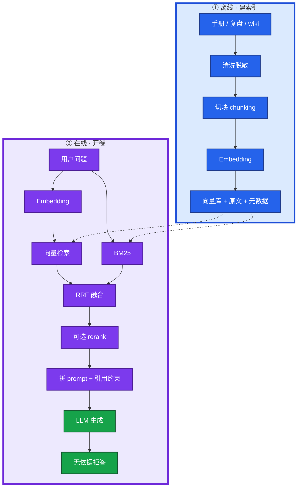
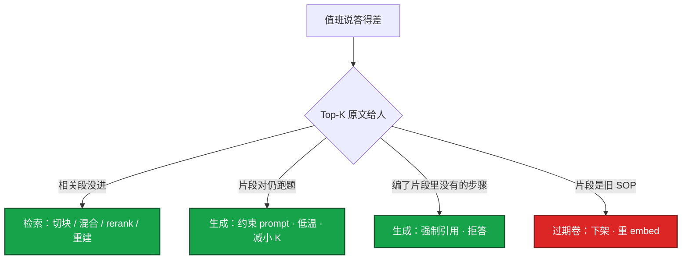
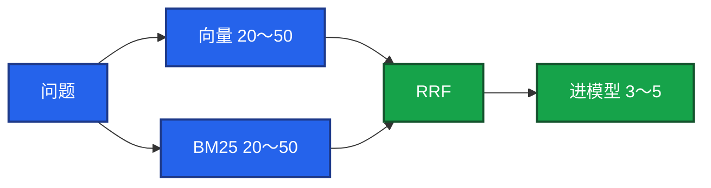

# 03｜RAG 检索增强 · 练习题

先对照 [知识点](知识点.md) **面试怎么考** 自己口述，再对答案。每题标了覆盖范围：

| 标记 | 含义 |
|------|------|
| **核心** | 不懂整章就没建立起来 |
| **必会** | 值班和面试都要能讲 |
| **常用** | 线上会反复碰到 |
| **常考** | 白板和追问的高频口径 |

## 本题目录

- [Q1 离线到在线全链路](#q1)
- [Q2 RAG vs 微调 vs 长窗口](#q2)
- [Q3 答得差怎么分锅](#q3)
- [Q4 切块策略与 overlap](#q4)
- [Q5 混合检索与 RRF](#q5)
- [Q6 rerank 与 Top-K](#q6)
- [Q7 Embedding 与整库重建](#q7)
- [Q8 知识库红线](#q8)
- [Q9 评测三层与拒答率](#q9)
- [Q10 口述综合：活动前 wiki 改了 bot 仍答旧数](#q10)
- [合上书](#合上书)

---

## Q1

**★★★★★｜RAG 从离线建索引到在线问答，整条链路怎么画？哪一步最影响效果？**

**覆盖**：核心 · 必会 · 常考  
**对应**：知识点 §2 架构图、§面试怎么考

### 场景

面试官：「你们内部运维问答怎么做的？」有人开始背微调。值班下一句是「战斗服 OOM 上次怎么收的」。

### 完整解答

**一句话**：RAG 是离线切块入库、在线混合检索再生成；检索错了，后面模型再强也会错答，切块往往比换大模型更值钱。



三条线要能说出口：

| 线 | 口径 |
|----|------|
| 数字从哪来 | 来自库里的块，不是闭卷记忆 |
| 三步分工 | 召回求别漏、rerank 求别脏、生成求别加戏 |
| 低分 | 相似度低于阈值直接拒答，不硬聊 |

生产数据、密钥不进库。答案是草稿，执行变更仍要人审。RAG 缩小查找范围，不替值班签字。

### 再追问

- 哪一步最影响效果？→ 切块。很多「模型不行」其实是块切烂了；优化顺序：切块 → 混合检索 → rerank → 再换 embedding / 大模型。
- 和搜索引擎区别？→ 搜索引擎返回链接；RAG 把片段塞进 prompt 让 LLM 写答案，仍是生成，但开了卷。

---

## Q2

**★★★★★｜注入业务知识为什么用 RAG 而不是微调？长窗口塞整本 wiki 行不行？**

**覆盖**：核心 · 必会 · 常考  
**对应**：知识点 §4.1 RAG vs 微调

### 场景

合服 SOP 每月改，有人申请 GPU 做微调。另有人要把 200 页手册塞进 1M 上下文当「穷人 RAG」。

### 完整解答

**一句话**：改事实用 RAG（改文档即生效、能引用），改口吻才微调；长窗口不能替代知识库。

| 维度 | RAG | 微调 |
|------|-----|------|
| 注入知识 | 改文档 + 重建向量 | 重训、等实验 |
| 更新速度 | 近实时 | 慢 |
| 可追溯 | 能给出处片段 | 黑盒 |
| 成本 | 切块 + embed + 检索 | GPU + 数据 + 评测 |
| 幻觉 | 仍可能编，但有据可查 | 仍会编 |

运维大约九成「让它懂我们业务」用 RAG。微调只在要改行为/风格、且有大量标注时才上。两者可叠加：微调管口吻，RAG 管事实——先上 RAG。

长窗口塞整本 wiki：贵、慢、中间段落稀释注意力，更新还要重贴整段 prompt，不能替代向量库。80 条告警可以塞窗口；半年复盘不能。

### 再追问

- 微调了就不会幻觉？→ 会。权重里的错法加业务细节照样编。
- wiki 改了限号阈值，RAG 和微调各怎么更新？→ RAG 改库重 embed 下次就对；微调要等下次训完。

---

## Q3

**★★★★★｜RAG 答得差，怎么区分检索问题、生成问题和过期卷？**

**覆盖**：核心 · 必会 · 常用  
**对应**：知识点 §7 生产排障、§6.1 生成约束

### 场景

值班问 OOM 处理，系统建议「重启节点」。复盘里「不要重启有状态服」被 500 token 固定长度从「不要」中间切断。wiki 三个月前已作废的合服步骤仍被捞到。

### 完整解答

**一句话**：答得差先摊开 Top-K 原文给人看——人答不出是检索，人能答模型加戏是生成，片段本身是旧 SOP 是过期卷。



| 现象 | 定位 | 先做 |
|------|------|------|
| 相关段落没进 Top-K | 检索 | 改切块、混合检索、rerank |
| 片段对但答非所问 | 生成 | 约束 prompt、temperature 0～0.2 |
| 编片段里没有的步骤 | 约束不足 | 只基于资料、要 citation |
| 该拒却硬答 | 阈值太低 | 提高相似度阈值 |
| wiki 已改仍答旧数 | 过期卷 | 重切块重 embed，不是只改对象存储 |

**不要** 一上来换 GPT。知识库挂了也不该让模型闭卷顶上硬答。

### 再追问

- 人对得上、模型加戏怎么办？→ 生成约束问题，不是切块；减小 Top-K、强制引用、低温。
- 支付 SOP 进了普通值班会话？→ ACL 事件，不是 rerank 的锅。

---

## Q4

**★★★★★｜运维文档怎么切块？overlap 多少？「先 cordon 再 drain」能拆开吗？**

**覆盖**：核心 · 必会 · 常考  
**对应**：知识点 §3.1 切块

### 场景

固定 500 token 切块后，检索只拿到「先看 limit，再查泄漏」的上半句，模型建议重启有状态战斗服。

### 完整解答

**一句话**：检索命中的是块不是整篇文档；运维文档按结构切 + 10～20% overlap，SOP 步骤和 kubectl 示例不能从中间砍断。

| 切法 | 效果 | 运维建议 |
|------|------|----------|
| 固定长度 | 快，可能从「不要」中间切断 | 不推荐单独使用 |
| 按 H2/H3 / SOP 步骤 | 语义完整 | **推荐** |
| overlap 10～20% | 边界句两边都有 | 与结构切配合 |
| 语义切 | 效果好、贵 | 长文再考虑 |

每块带元数据：来源路径、章节、更新时间、权限标签。表格、回滚步骤、命令示例尽量不切断。「先 cordon 再 drain」是一条动作链，拆开就召回半套。

块太大：垃圾多、相关性稀释、吃窗口。块太小：SOP 一句两截、答不全。

### 再追问

- 优化顺序？→ 切块 → 混合检索 → rerank → 再考虑换 embedding / 大模型。
- 长文本超过 embedding 上限？→ 先切块再 embed，不要截断关键句。

---

## Q5

**★★★★★｜为什么运维 RAG 默认要混合检索？RRF 是什么？K 怎么定？**

**覆盖**：核心 · 必会 · 常考  
**对应**：知识点 §3.2 召回

### 场景

问「内存爆了」能搜到 OOM 文档，但工单号 `INC-20260318-044` 和 errno 经常漏。只向量时搜 `CrashLoopBackOff` 不如「镜像 pull 失败」近。GPU 现场要搜 `Xid`、`nvidia-smi`。

### 完整解答

**一句话**：运维专名多，向量懂语义、BM25 抓字面，默认混合；RRF 融合两路排名，召回 20～50、进模型 3～5。

| 路 | 优点 | 缺点 | 运维靠它 |
|----|------|------|----------|
| **向量** | 「内存爆了」≈ OOM | 工单号、errno、Pod 名弱 | 同义、口语 |
| **BM25** | 字面命中 errno、kubelet | 同义词对不上 | 专名、ID、错误码 |

RRF（Reciprocal Rank Fusion）：把两路排名的倒数融合成分数，不必对齐分数量纲。也可以加权，目标是语义近的和字面命中的都进候选。



已有 Elasticsearch / OpenSearch 时，BM25 本来就在，加向量字段就能混，不必急着上 Milvus。

### 再追问

- 只向量漏什么？→ 工单号、errno、纯数字专名。
- 只 BM25 漏什么？→ 「内存打满」对不上标题写 OOM 的那篇。
- 相似度低也要硬答？→ 错，低分拒答；硬答就是幻觉。

---

## Q6

**★★★★☆｜rerank 什么时候上？挂了怎么办？召回 5 再 rerank 50 对吗？**

**覆盖**：必会 · 常用 · 常考  
**对应**：知识点 §3.3 重排

### 场景

第一期只有 500 篇 SOP，架构师第一天就要交叉编码器。rerank 服务 5xx 后整个问答接口跟着挂。支付 SOP 出现在普通战斗服问答里。

### 完整解答

**一句话**：宽召回 20～50、精排进模型 3～5；数据少可先不上 rerank，挂了降级到融合 Top-K 并告警。

| 阶段 | 召回 | 进模型 | rerank |
|------|------|--------|--------|
| 召回 | 宽、粗、快，20～50 条 | — | — |
| 重排 | — | 准、慢、贵，3～5 条 | 交叉编码器 |

第一期 500 篇 SOP：混合检索 Top-5 可能够，有评测再证明 rerank 值不值。不要为「架构完整」第一天上两阶段。

rerank 挂了：降级到 RRF 后的 Top-K 直接进 LLM，并告警——**不要让整个问答接口跟着 5xx**。

支付 SOP 出现在战斗服问答：权限过滤没做，不是 rerank 的锅。

### 再追问

- 召回 5 再 rerank 50？→ 反了。宽召回、窄进模型。
- P99 延迟高先看哪？→ 拆四段：embed 查询、向量检索、rerank、LLM 生成；GPU 池打满时生成先爆（08）。

---

## Q7

**★★★★☆｜Embedding 和对话模型是一回事吗？换 embedding 要做什么？**

**覆盖**：必会 · 常用 · 常考  
**对应**：知识点 §3.4 Embedding

### 场景

「我们用 GPT 做向量吧，省一个模型。」中英混用手册召回很差。有人换了 BGE 没重建向量库，召回突然变差。

### 完整解答

**一句话**：Embedding 只出向量负责检索，对话模型负责生成；换 embedding = 维度和语义空间都变，必须整库重建。

| 角色 | 例子 | 干什么 |
|------|------|--------|
| Embedding | BGE / m3e / text-embedding-3 | 文本 → 固定长度向量 |
| 对话 LLM | GPT / Qwen | 基于片段生成答案 |

```
「服务器内存爆了」 → [0.12, -0.8, ...]
「OOM 被杀」       → [0.11, -0.79, ...]  ← 近，能检索到
「今天天气不错」    → [0.9,  0.2, ...]    ← 远
```

相似度常用余弦；文本先归一化，归一化后点积 ≈ 余弦。中文运维文档选中文表现好的 embedding；中英混用看 bge-m3 等多语言模型。

换模型：新旧向量不能混比，同一集合维度必须一致，否则索引废或结果无意义。提前算全量 embed 的时间和 API/GPU 费用。

### 再追问

- 长文本超过 embedding 输入上限？→ 先切块再 embed，不要截断「不要重启有状态服」这类关键句。
- 本地试 embedding？→ Ollama 可以；生产高并发算 08 的账。

---

## Q8

**★★★★☆｜搭运维知识库，权限、时效、脱敏、只读边界怎么说？**

**覆盖**：必会 · 常用 · 常考  
**对应**：知识点 §6.4 知识库红线

### 场景

把全公司 Confluence 无过滤灌进 bot。支付应急 SOP 被普通值班搜到；三个月前的删库演练被当成现行步骤。有人按 RAG 输出的 kubectl 要 apply。

### 完整解答

**一句话**：知识库要 ACL 过滤、过期下架、脱敏入库；只读试点、带来源、拒答无依据问题，变更步骤标人审绝不自动执行。

| 红线 | 做法 |
|------|------|
| **权限** | 按身份过滤可检索子集；支付 SOP 进普通会话 = 安全事件 |
| **时效** | 过期下架或标废弃；元数据带更新时间；改 wiki 后 **24h 内** 向量跟上 |
| **脱敏** | 密钥、玩家 UID、完整内网拓扑不进库 |
| **只读** | 检索不到就拒答；小范围试点；反馈闭环 |
| **不自动变更** | RAG 的 kubectl 是建议，执行走人审和变更单 |

垃圾进、垃圾出。十年工单全量灌入 = 扩大脏数据和注入面。活动前把限号/合服相关页标热点，检查 ACL 和更新时间。

拒答文案示例：「知识库未找到依据，请查某某系统或找 oncall」，并建议只读命令，不编步骤。回档/踢全服类 SOP 尤其不能硬答。

### 再追问

- RAG 能接写工具自动修吗？→ 不能。知识库只读，责任在执行的人。
- 和 Prompt 间接注入关系？→ RAG 片段是 untrusted reference，见 02；强制 citation，无引用拒答。

---

## Q9

**★★★★☆｜怎么评测 RAG 有没有用？拒答率是不是越低越好？**

**覆盖**：必会 · 常用  
**对应**：知识点 §6.3 评测

### 场景

产品只报「准确率 95%」，值班说经常瞎编。改了切块没跑评测就直接上值班群。库里没有的问题也被硬答出来。

### 完整解答

**一句话**：评测分检索、生成、工程三层；拒答率不是越低越好——该拒就拒，硬答就是幻觉。

| 层 | 看什么 |
|----|--------|
| **检索** | 相关文档有没有进 Top-K（命中 / 召回） |
| **生成** | 忠实度（每句能否在片段找到依据）、相关性、该拒时是否拒 |
| **工程** | 端到端延迟、成本、值班采纳率 / 「有帮助」按钮 |

用值班真实问题建 50～100 条基线：「上次 OOM 怎么收」「推理 TTFT 升高怎么收」。改切块或换混合检索，先在这批上对比 Top-K 命中，再看生成忠实度。

| 信号 | 含义 |
|------|------|
| 检索命中升了、仍答得飘 | 生成加戏 → 约束 prompt |
| 检索命中没变、生成变好 | prompt 约束生效 |
| 拒答率被 KPI 压到很低 | 可能在硬答库里没有的问题 |

工具可用 RAGAS、TruLens，或先人工标基线。不要一改就上值班群。

### 再追问

- 忠实度怎么抽检？→ 抽回答，看每句能不能在引用片段里找到依据；找不到记一次幻觉。
- 延迟怎么拆？→ embed / 向量 / rerank / 生成四段，P99 高先看哪段最长。

---

## Q10

**★★★★★｜30 秒口述：活动前夜 wiki 改了限号阈值，bot 仍答旧数，你怎么收？**

**覆盖**：必会 · 常考  
**对应**：知识点 §口述模板、§7 过期卷

### 场景

策划 22:00 改了限号规则，wiki 已更新，23:30 值班 bot 还在背旧阈值。有人提议「换个大模型就好了」。

### 完整解答

**一句话**：先确认向量是否重建、过期页是否下架，再抽该问题 Top-5 给人对——不是换模型的题，是过期卷和索引没跟上。

**30 秒口述**：

「wiki 改了不等于 bot 立刻变新。RAG 库里是旧 embedding 就会答旧数。我先查该文档有没有重新切块、重新 embed、删旧向量；已作废页有没有下架。然后抽『限号阈值是多少』这个问题，把 Top-5 片段摊开——片段里还是旧数就是索引问题，片段是新数模型还答旧才是生成问题。活动前宁可拒答，不要开卷考过期卷。阈值变更 24 小时内向量必须跟上。」

**处理步骤**：查文档更新时间 vs 向量 rebuild 时间 → 确认删页是否删向量 → 抽问题看 Top-K → 通知值班暂不按旧阈值 → 重建后跑评测集回归。

### 再追问

- 只改对象存储里的 markdown 够吗？→ 不够，必须重 embed。
- 向量库怎么选要不要讲？→ 有 ES 优先混合，不必为专业向量库再运维一套（§4.2）。

---

## 合上书

1. 离线到在线怎么画？切块、混合检索、拒答各在哪一步？
2. 改事实用 RAG 还是微调？Top-K 原文怎么分检索 / 生成 / 过期卷？
3. 切块策略、向量 vs BM25、RRF、K 值能说清吗？
4. 换 embedding、改文档、删文档各要做什么？知识库五条红线？
5. 评测三层？拒答率 KPI 压太低会怎样？wiki 改了 bot 仍答旧数先查什么？

---

**上一章**：[02 Prompt 工程](../02-Prompt工程/练习题.md) · **下一章**：[04 Function Calling](../04-Function-Calling与Tool-Use/练习题.md)
