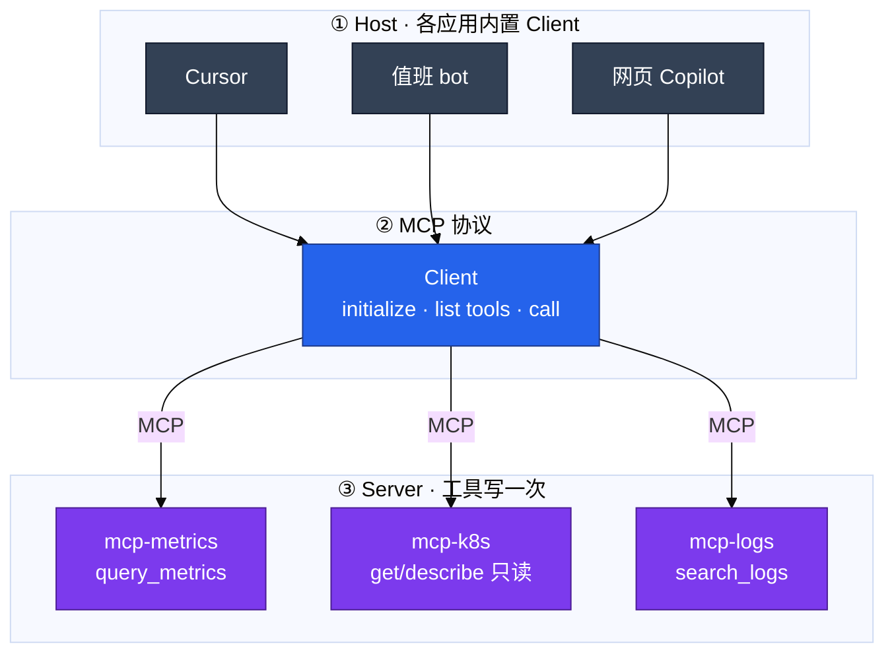
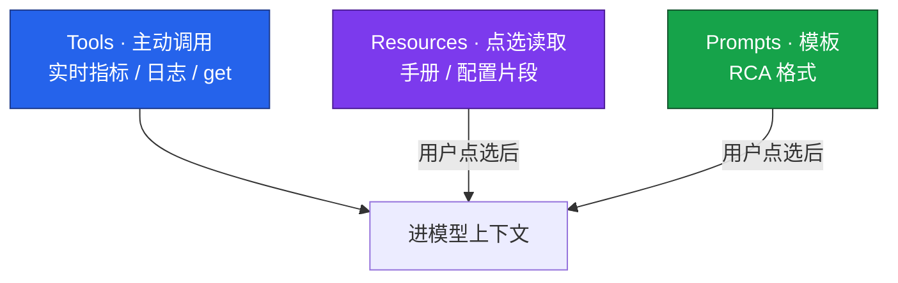
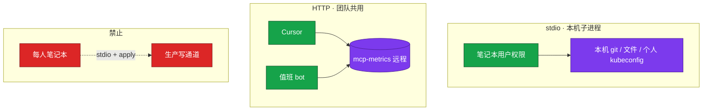
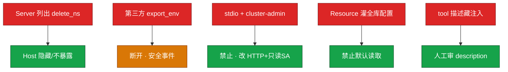

# 05｜MCP 协议

开服夜 20:01，值班 bot 查 `login_qps` 用一套 PromQL，Cursor 巡检脚本用另一套——同一指标两处口径 drift，群里吵「到底 P99 是 80ms 还是 800ms」。有人提议「每个 Host 各写一份胶水」；正确做法是 **MCP 把工具做成标准插头**：一个 `mcp-metrics` Server，bot 和 Cursor 共用，改口径只改一处。

**本章主线（接 MCP 就按这三步想）：**

1. **分清角色**：Host 决定连谁、哪些 tool 可见；Client 做 list/call；Server 的 handler 打真实系统——**没有箭头从模型进程指向 Prometheus**。
2. **传输选型**：stdio = 笔记本用户权限，个人实验；团队共用监控走 **远程 HTTP + SSO + 最小 SA**。
3. **安全不外包**：协议不会替你拒绝 `delete_namespace`；Host 过滤 tool、只读默认、全调用审计一条不能少。

**读完你能：** 白板上画 Host/Client/Server；Tools/Resources/Prompts 分工；stdio vs HTTP 选型；MCP 和 FC 谁机制谁插头；healthz 探活和 schema 变更纪律。

## 本章目录

- [面试怎么考](#面试怎么考)
- [SRE 边界](#sre-边界)
- [3. 原理讲透](#原理讲透)
- [落地场景](#落地场景)
- [口述模板](#口述模板)
- [必会 · 常考](#必会--常考)
- [合上书](#合上书问自己)

> **加分项定位**：MCP 考你会不会把运维工具做成「标准 USB-C 插头」——Host/Client/Server、stdio vs HTTP、和 FC 的分层，以及生产安全审计。  
> **红线**：协议只统一形状，不统一人品；写权限不能挂每人笔记本 stdio；只连可信 Server，审查每一个 tool；敏感数据不出域。

**本章不讲：** FC 循环与审批细节 → [04](../04-Function-Calling与Tool-Use/)；Agent 多步打满监控 → [06](../06-Agent智能体/)；Cursor 配置 → [07](../07-AI工具实战与Vibe-Coding/)。

---

## 面试怎么考

| 频率 | 典型问法 | 30 秒要点 | 2 分钟要点 |
|:----:|----------|-----------|------------|
| ★★★★★ | MCP 是什么？解决什么问题？ | AI 连外部工具的标准协议；N×M 胶水收成 N+M | Host 内置 Client 连 Server；Tools/Resources/Prompts；改 Server 所有 Host 一起变 |
| ★★★★★ | MCP 和 Function Calling 什么关系？ | FC 是执行机制；MCP 是接入标准；Client 拿到列表后仍走 FC 循环 | 模型出意图→执行→回喂不变；MCP 管发现、描述、跨应用复用 |
| ★★★★ | stdio 和 HTTP 怎么选？ | stdio=本机子进程，权限=笔记本用户；团队共用走 HTTP+SSO | 个人实验 stdio 只读；生产写权限、监控共用必须远程 HTTP |
| ★★★★ | MCP 安全怎么做？ | 默认只读；Host 过滤 tool；最小 SA；审第三方 Server | 协议不拒绝 delete_namespace；list tools 多了 read_secret 立刻断开 |
| ★★★★ | Tools / Resources / Prompts 区别？ | 运维主路径是 Tools；Resources 点选才读，不默认灌窗口 | query_metrics 是 Tool；file://runbook 是 Resource；Prompt 是 Server 模板 |
| ★★★ | 生产怎么落地 MCP？ | 第一周只读监控共用；探活 handler；schema 当 API 发 | Cursor+bot 连同一 mcp-metrics；审计 user/host/tool/args.hash |
| ★★★ | 排障顺序？ | healthz→list tools→审计→对 Grafana 口径 | 401 鉴权；403 白名单；429 限流或 Agent 打满 |

---

## SRE 边界

| 该用 | 禁止 |
|------|------|
| 只读监控/日志/K8s get 做成 **远程 HTTP Server** | 生产写权限 stdio 挂全员笔记本 |
| **Host 过滤**可见 tool；写映射成审批 | Server 列出什么就全交给模型 |
| 只读 SA，**限定 namespace** | cluster-admin「方便调试」 |
| 第三方 Server **当不明软件**审 tool 列表 | 现成 GitHub/网盘 Server 不经审进生产 |
| schema 变更 **先加后删**，通知各 Host | 突然改参数名导致某 Host 大量 400 |
| 探活 **handler/healthz**，不只探 TCP | 进程在、handler 挂仍算活 |
| 全调用审计：user、host、tool、args.hash | 敏感数据经不可信 Server |

---

## 原理讲透

### 3.1 MCP 是什么：Host / Client / Server

**一句话：** MCP 是 AI 应用连接外部工具的标准协议——N 个应用 × M 个工具 的私有胶水变成 N+M。

**打个比方：** 像 USB-C——以前每个手机一种充电口（Cursor 一套胶水、bot 一套、Copilot 又一套）；MCP 是统一插头，**充电器（Server）写一次，所有设备（Host）都能插**。

**现场走一遍**（没有 MCP vs 有 MCP）：

1. **没有 MCP**：PromQL 登录 QPS 口径改了三处——bot 用 `sum(rate(login_total[5m]))`，Cursor 脚本用 `login_qps_5m`，对不上数。
2. **部署 `mcp-metrics` Server**：只暴露 `query_metrics`，PromQL 白名单写在 Server 里。
3. 20:01 值班 bot `list tools` → 拿到 `query_metrics` schema → 模型出意图 → Client call Server。
4. 20:02 工程师开 Cursor，连 **同一 Server**，同一 query 的 `args.hash` 一致，口径一起变。



**输出解读**（list tools 返回片段）：

```json
{
  "tools": [{
    "name": "query_metrics",
    "description": "查询 Prometheus。只读。用于 QPS/延迟/错误率。",
    "inputSchema": {
      "type": "object",
      "properties": {
        "query": {"type": "string"},
        "range": {"enum": ["5m", "1h", "1d"]}
      },
      "required": ["query"]
    }
  }]
}
```

| 字段 | 谁消费 | 改错会怎样 |
|------|--------|------------|
| description | 模型决定调不调 | 糊了乱点 |
| inputSchema | Client 校验 + 模型填参 | 缺 required → 400 |
| name | call 时指定 | 改名不通知 → 某 Host 全挂 |

**面试怎么说：**「MCP 把 N 乘 M 的私有胶水收成 N 加 M。Host 内置 Client 连 Server，改 Server 所有 Host 一起变。打真实系统的是 Server 的 handler，不是模型进程。」

| 没有 MCP | 有 MCP |
|----------|--------|
| Cursor、bot、Copilot 各写一份 Prom 胶水 | 一个 `mcp-metrics`，三处共用 |
| PromQL 口径改三处 | 口径只在 Server |
| 工具改，三处一起烂 | 改 Server，所有 Host 一起变 |

**三个角色**：

| 角色 | 干什么 |
|------|--------|
| **Host** | AI 应用（Cursor/bot/Copilot）；决定连谁、什么身份、哪些 tool 可见 |
| **Client** | Host 内置；发现工具、发起调用、结果塞回模型 |
| **Server** | 暴露 Tools/Resources/Prompts；权限 = 它持有的 SA/IAM/本机用户 |

> **记住**：没有箭头从模型进程指向 Prometheus——打真实系统的是 Server 的 handler。

---

### 3.2 一次调用的完整路径

**一句话：** 和 04 同一形态——list tools → schema 进模型 → 意图 → Client 调 Server → 回喂。

**打个比方：** 还是餐厅——MCP 是统一菜单格式（list tools）；顾客（模型）勾菜；服务员（Client）把单子送到 **中央厨房（Server）**，不是每桌一个小灶各炒各的。

**现场走一遍**（登录 QPS 突增，开服夜时间线）：

1. `20:01:00` Host=值班bot，Client `initialize` → `list tools` → 得到 `query_metrics`, `get_alerts`。
2. `20:01:05` 用户问「登录慢了吗？」模型出意图：

```json
{"name": "query_metrics", "arguments": {"query": "login_p99_latency", "range": "5m"}}
```

3. `20:01:06` Client call Server → handler 校验白名单 → 打 Prometheus。
4. `20:01:07` 回喂：`P99 80ms → 800ms`。
5. `20:02:00` Host=Cursor，**同一 schema、同一 Server**，`args.hash` 与 bot 一致。


**输出解读**（审计两行对比）：

```text
20:01:06 host=oncall-bot user=alice tool=query_metrics args.hash=7c3a... status=200 elapsed=82ms
20:02:11 host=cursor     user=bob   tool=query_metrics args.hash=7c3a... status=200 elapsed=79ms
```

| 对比项 | 一致 = 健康 | 不一致 = 查什么 |
|--------|-------------|-----------------|
| args.hash | 同一口径 | 某 Host schema 旧版 |
| status | 200 | 401/403/429/5xx |
| elapsed | 百毫秒级 | 秒级 → Server 或 Prom 慢 |

**面试怎么说：**「Client 拿到 tool 列表后仍是模型出意图、代码执行、结果回喂。MCP 管发现和复用，不改变 FC 执行机制。」

---

### 3.3 Tools / Resources / Prompts

**一句话：** 运维主路径是 **Tools**（可调函数）；Resources 是点选才读的数据；Prompts 是 Server 带的模板。

**打个比方：** Tools 像「现炒现做」——查实时 QPS、拉 Pod 状态；Resources 像「图书馆书架」——手册在那，**用户点哪本读哪本**，别一开聊天就把整库灌进窗口；Prompts 是「填空模板」——按我们格式起草 RCA。

**现场走一遍**（组合使用，别混）：

1. 用户问「登录 P99 高怎么办？」
2. **Tool** `query_metrics` 拉当前 P99 → Observation：800ms。
3. **不要** 把整本合服 Runbook embed 进 RAG 当实时数据；静态 SOP 走 **RAG（03）** 或用户 **点选** MCP Resource `file://runbooks/login-slow.md`。
4. **Prompt**「按我们 RCA 格式输出」——仍是 02 四要素，只是模板由 Server 提供。



**输出解读**（错误用法 vs 正确）：

| 做法 | 结果 | 级别 |
|------|------|------|
| Host 启动自动读 `cm://cluster/game-config` | 每次聊天带一份内网配置 | **出域** |
| 用户点选 `runbook/login-slow.md` | 只读一篇 | 正常 |
| 用 Tool 查「手册里怎么写」 | 该用 RAG/Resource | 口径错 |

**面试怎么说：**「运维主用 Tools 查实时指标和日志。Resources 点选才读，不要默认灌窗口。实时 QPS 不要 embed 成 RAG。」

**分工**：

- 实时 QPS、Pod 状态 → **Tools**
- 静态 SOP → **RAG（03）** 或 MCP Resources（点选）
- 组合：Tool 拉当前值 + RAG 搜 SOP，生成时都引用

---

### 3.4 传输：stdio vs HTTP

**一句话：** stdio 权限等于笔记本用户；团队共用能力必须远程 HTTP + SSO + 审计。

**打个比方：** stdio 像把工具装在 **自己口袋里的瑞士军刀**——只能切自己桌上的苹果，权限就是你的用户账号；HTTP 像 **公司前台统一的查档窗口**——全团队来办，窗口后面是 Server 的只读 SA，要刷卡（SSO）、要登记（审计）。

**现场走一遍**（两种部署）：

1. **个人实验**：工程师笔记本 Cursor 配 stdio 启动 `mcp-k8s`，读个人 kubeconfig 的 get/describe——权限 = 他本人能看什么。
2. **团队共用**：部署 `https://mcp-metrics.internal`，bot 和全员 Cursor 连远程；SSO + mTLS；Server 持只读 Prom SA。
3. **禁止场景**：每人笔记本 stdio + cluster-admin + apply 工具 → 等于全员口袋揣生产写钥匙。



**输出解读**（stdio 失败 vs HTTP 失败）：

| 现象 | 常见原因 | 第一刀 |
|------|----------|--------|
| stdio 连不上 | 子进程没起、路径错 | 看 stderr JSON-RPC |
| HTTP 401 | SSO/token 过期 | 重登、查 mTLS |
| HTTP 429 | Agent 循环打满或抢 GPU 出口 | 限流 + 查 06 max_steps |
| HTTP 5xx | handler 挂 | `curl healthz` |

**面试怎么说：**「个人实验 stdio 只读；团队共用监控走远程 HTTP 加 SSO。生产写权限不能挂笔记本 stdio。个人 kubeconfig 只读仍有出域风险——Host 出网策略要管。」

| 方式 | 场景 | 权限等于 | 失败常见 |
|------|------|----------|----------|
| **stdio** | 本地 git、个人文件、实验 | 笔记本用户 | 进程没起、stderr JSON-RPC 错 |
| **HTTP/SSE** | 团队监控、CMDB、共用 K8s 只读 | Server 的 SA/IAM | 401 鉴权、429 限流、5xx |

**选型口诀**：个人实验 → stdio + **只读**；值班 bot + 全团队 Cursor → **远程 HTTP + SSO + 最小 SA**；活动日 MCP Server 是 **CPU 服务**，别和 GPU 推理池混部署抢出口。

---

### 3.5 MCP vs Function Calling

**一句话：** FC 是「模型说出调谁」的执行机制；MCP 是工具如何被发现和跨 Host 复用的接入标准——**不是替代关系**。

**打个比方：** FC 是「怎么点菜、怎么做菜、怎么上菜」的流程；MCP 是「各家餐厅统一的菜单接口和插头规格」——**接了统一插头，做菜流程还是那套**。

**现场走一遍**（追问「上了 MCP 还要懂 FC 吗？」）：

1. 没有 MCP：每个 Host 自己写「怎么把 Prom 结果塞进模型」——N×M。
2. 上了 MCP：Client `list tools` 拿到统一 schema——N+M。
3. 但模型仍要出 **意图 JSON** → Client/适配层 **校验** → Server handler **执行** → **回喂**——这是 **04 FC 循环**，一步不能省。
4. 误以为「MCP 自动安全」→ Server 列出 `delete_namespace` → 若 Host 全暴露给模型 → 事故。

```mermaid
flowchart TB
    classDef a fill:#2563EB,stroke:#1E3A8A,color:#fff
    classDef b fill:#7C3AED,stroke:#4C1D95,color:#fff

    subgraph fc ["Function Calling · 执行机制"]
        m[模型]:::a --> intent[结构化意图]:::a
        intent --> exec[Host/适配层执行]:::a
        exec --> feed[结果回喂]:::a
    end

    subgraph mcp ["MCP · 接入标准"]
        disc[发现 list tools]:::b
        schema[统一 schema]:::b
        call[标准化 call]:::b
        reuse[跨 Host 复用]:::b
        disc --> schema --> call --> reuse
    end

    mcp -->|"Client 拿到列表后仍走"| fc
```

**输出解读**（选型表）：

| | Function Calling | MCP |
|--|------------------|-----|
| 解决什么 | 模型会「说出」调谁、传什么 | 工具如何被发现、描述、复用 |
| 接线成本 | 各家 N×M 私有胶水 | N+M 标准插头 |
| 护栏 | 只读、人审、校验、审计 | **一条不少** |
| 什么时候单独用 FC | 单应用、工具不共享 | — |
| 什么时候上 MCP | — | 监控进 Cursor + bot + Copilot 三处 |

**面试怎么说：**「接了 MCP 还要懂 FC，否则你看不到模型出意图、代码执行这一跳，会误以为 MCP 自动安全。单应用可以只用 FC；要跨 Host 共用才上 MCP。」

**游戏公司落地顺序**：

1. 第一周：只读 `mcp-metrics`，bot + Cursor 共用
2. 第二周：越权企图留日志，再谈 `mcp-k8s` get/describe
3. 写操作：Server 只创建审批单，不直接 apply
4. 永远不做：万能 Server + cluster-admin

---

### 3.6 安全：Server 实现 + Host 策略

**一句话：** 协议不会替你拒绝 `delete_namespace`——护栏落在 Server 凭证、Host 过滤、审批流、审计。

**打个比方：** USB-C 只规定插头形状，**不保证插上来的是充电器还是电钻**——你得自己审 Server 列了什么 tool、用什么凭证、Host 给模型看哪几个按钮。

**现场走一遍**（第三方 Server 多了 read_secret）：

1. 工程师在 Cursor 装了社区「万能运维 Server」。
2. `list tools` 出现 `read_secret`、`export_env`——**立刻断开**，不当「协议 bug」。
3. 查审计：是否已有调用；有则按 **出域事件** 复盘。
4. Host 策略：未批准 Server 禁止连接；推广自建只读 `mcp-metrics`。



**输出解读**（值班探活四条 + 阈值）：

```bash
curl -sS https://mcp-metrics.internal/healthz          # 1 探活 handler
# 2 list tools 是否完整、有无陌生写工具
# 3 审计最近 10min：user/host/tool/status/args.hash
# 4 对比 Grafana：同一 PromQL 口径是否一致
```

| 指标 | 阈值 | 级别 |
|------|------|------|
| healthz 非 200 | 任意持续 | **P0** |
| 陌生写 tool 出现 | 立刻 | **P0** 安全 |
| 5xx/超时 | 活动日升高 | P1 |
| 429 持续 | Agent 打满或抢出口 | P1 |
| 某 Host 400 集中 | schema 未通知 | P1 |

**面试怎么说：**「协议不拒绝 delete_namespace。Host 过滤可见 tool、最小只读 SA、全调用审计 user/host/tool/args.hash。第三方 list tools 多了 read_secret 立刻断开。schema 变更当 API 发，先加后删。」

**六条安全铁律**：

1. 工具默认只读；写 = 审批单
2. Server 凭证 **最小**（只读 SA，限定 namespace）
3. **Host 过滤**可见 tool
4. 全调用审计：`user` / `host` / `tool` / `args.hash` / `status`
5. 只连 **可信来源**；审每一个 tool
6. 敏感数据 **不经过** 不可信 Server

**schema 当 API 发**：加必填字段 `cluster` 没通知 Cursor → Cursor 大量 400、bot 正常——变更纪律问题。

---

## 落地场景

### 场景 1：mcp-metrics 给 Cursor 和值班 bot 共用

**背景**：开服夜告警摘要 bot 和 Cursor 巡检脚本都要查 `login_qps`，原先两套 Prom 胶水，口径 drift。

**做法**：

1. 部署 `mcp-metrics` 远程 HTTP Server，只暴露 `query_metrics` / `get_alerts`。
2. PromQL 白名单；只读 Prom 凭证；SSO + mTLS。
3. Cursor 和 bot 连同一 Server；审计用 `host=` 区分。
4. 探活 `curl -sS https://mcp-metrics.internal/healthz`（不只探 TCP）。
5. 共用一周，越权企图留日志，再谈 K8s get Server。

**验收**：同一 query 的 `args.hash` 在 bot 和 Cursor 一致；改登录 QPS 标签，两处一起变。

### 场景 2：第三方 Server 多了 read_secret

**背景**：工程师在 Cursor 装了社区「万能运维 Server」，list tools 出现 `read_secret`、`export_env`。

**处理**：

1. **立刻断开** Server 连接，不当「协议 bug」。
2. 查审计：是否已有调用；有则按出域事件复盘。
3. 团队规范：第三方 Server 进生产前安全 Review；Host 策略禁止未批准 Server。
4. 推广自建只读 `mcp-metrics`，替代不明插件。

### 场景 3：schema 变更导致 Cursor 大量 400

**背景**：`mcp-metrics` 给 `query_metrics` 加了必填字段 `cluster`，只通知了 bot 侧，Cursor 仍用旧 schema。

**现象**：bot 正常；Cursor 里模型乱调，审计里 400 集中在 `host=cursor`。

**修复**：

1. schema 变更走 API 变更流程：**先加可选字段 → 各 Host 升级 → 再改 required**。
2. 临时：Server 对新旧 schema 兼容窗口（如 7 天）。
3. 监控：按 `host` 聚合 400 率，变更后 24h 内盯盘。

---

## 口述模板

### 【30 秒】

「MCP 是 AI 连外部工具的标准协议，把 N 乘 M 的私有胶水收成 N 加 M。Host 内置 Client 连 Server，Server 暴露 Tools、Resources、Prompts。运维主用 Tools 查实时指标和日志。stdio 适合本机实验，权限等于笔记本用户；团队共用监控走远程 HTTP 加 SSO。MCP 不替代 Function Calling，Client 拿到 tool 列表后仍是模型出意图、代码执行、结果回喂。安全靠 Host 过滤 tool、最小 SA、审计，协议不会替你拒绝 delete namespace。」

### 【2 分钟】

「三个角色：Host 决定连谁和哪些 tool 可见；Client 做 initialize、list tools、call；Server 实现 handler 打 Prometheus 或 K8s。一次调用和 04 一样：schema 进模型、出意图、Client 调 Server、回喂。Tools 是主动调用，Resources 是点选才读不要默认灌窗口，Prompts 是 Server 模板。传输上 stdio 是本机子进程适合个人只读实验；HTTP 是团队共用，权限等于 Server 的 SA，要鉴权 TLS 限流审计。和 FC 的关系：FC 是执行机制，MCP 是接入标准，不是替代。接了 MCP 护栏一条不能少——只读默认、写操作人审、参数白名单、全调用审计。生产第一周只上只读监控，schema 变更当 API 发先加后删。第三方 Server 当不明软件，list tools 多了 read_secret 立刻断开。探活要 healthz 不要只探 TCP 443。」

### 【常见追问】

| 追问 | 答法 |
|------|------|
| MCP 让模型更聪明吗？ | 不；只让接线标准化 |
| 上了 MCP 可以不管 FC 吗？ | 不行；FC 是执行机制 |
| 生产写权限能 stdio 吗？ | 不能；远程+审批 |
| Server 列出的 tool 都要给模型吗？ | 不；Host 过滤 |
| MCP 取代 REST 吗？ | 不；REST 给程序，MCP 给 LLM 发现 |
| 现成 Server 都能用吗？ | 现成≠可生产；要审权限 |

---

## 必会 · 常考

### 对错表

| 说法 | 对错 | 纠正 |
|------|:----:|------|
| MCP 让模型更聪明 | ✗ | 只让接线 N×M→N+M |
| 上了 MCP 不管 FC | ✗ | FC 是执行机制 |
| 接了 MCP 就自动安全 | ✗ | 协议不拒 delete_ns |
| MCP 取代对内 REST | ✗ | 各服务不同对象 |
| 生产写权限用笔记本 stdio | ✗ | 远程+SSO+审批 |
| Server 列出 tool 必须全给模型 | ✗ | Host 过滤 |
| cluster-admin 给 Server 方便 | ✗ | 最小只读 SA |
| 现成 Server 都能进生产 | ✗ | 当不明软件审 |
| Resources 默认灌整库手册 | ✗ | 点选才读；ACL |
| 只探 TCP 443 算活着 | ✗ | 探 handler/healthz |
| schema 改参数名不用通知 | ✗ | 当 API 变更 |
| nvidia-smi 和重启 GPU 都能做 tool | ✗ | 只读可以；重启不行 |
| 个人 kubeconfig 只读无出域风险 | ✗ | 上下文可能上公有云 |
| MCP Server 和 vLLM 混部署 | ✗ | MCP 是 CPU 服务 |

### 易混

| A | B | 区分 |
|---|---|------|
| FC 机制 | MCP 插头 | 执行 vs 发现复用 |
| stdio | HTTP | 本机用户 vs Server SA |
| Tools | Resources | 主动 call vs 点选读取 |
| Host 过滤 | Server 列出 | 可见性决策在 Host |
| handler 探活 | TCP 探活 | 真可用 vs 假活 |
| 改 Server 口径 | 各 Host 私改 | 统一 vs drift |
| 官方 Server | 社区万能 Server | 信任级不同 |

### 数字与口令

| 项 | 值 |
|----|-----|
| 接线成本 | **N×M → N+M** |
| 落地第一周 | **只读监控** 共用 |
| P0 安全事件 | 陌生写 tool、healthz 挂 |
| 审计字段 | **user / host / tool / args.hash / status** |
| schema 变更 | **先加后删**，通知 Host |
| 429 排查 | Agent 循环打满 **或** 与 GPU 网关抢出口 |

---

## 合上书，问自己

1. MCP 把什么从 N×M 收成 N+M？Host/Client/Server 各干什么？
2. Tools / Resources / Prompts 运维主用哪个？Resources 默认灌窗口会怎样？
3. stdio 和 HTTP 权限各等于什么？生产写权限为什么不能挂笔记本？
4. MCP 和 FC 谁是机制、谁是插头？接了 MCP 护栏还在哪？
5. 探活、对审计、对 Grafana 口径的标准四条是什么？
6. 第三方 Server 多了 read_secret 你做什么？万能 Server + cluster-admin 爆炸半径是什么？

六题都能口述，这一章就过了。下一章看 Agent 在多步自主上怎么设 max_steps——别让它把 Prometheus 和 GPU 网关一起打满。
