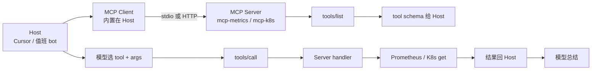
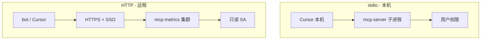
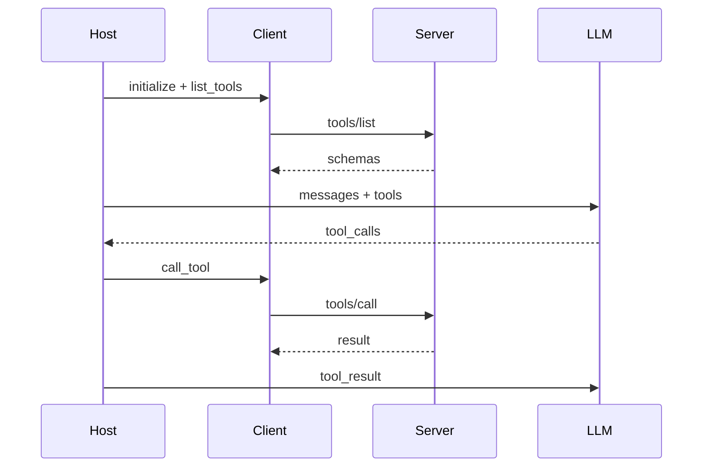
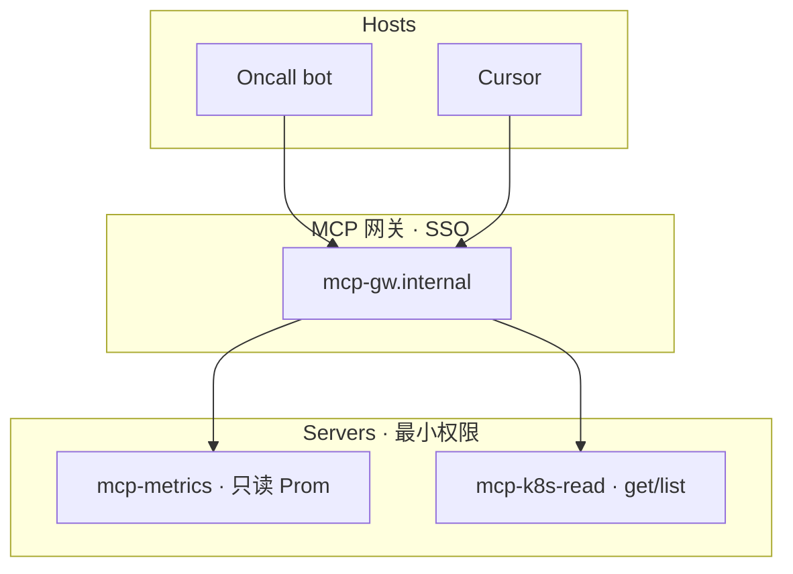
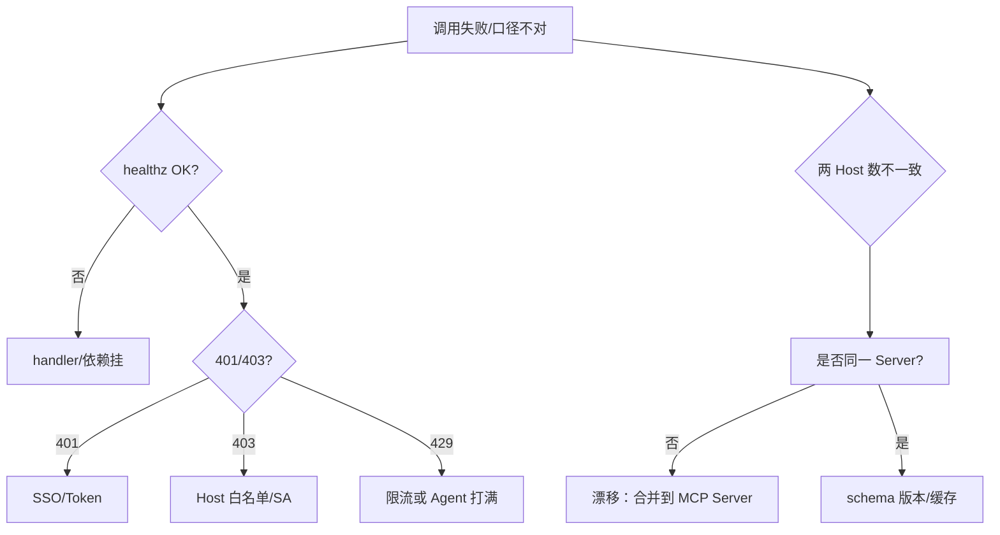

# MCP 协议

> 大家好，欢迎来到这次分享。开讲之前，先带大家回到一个很多值班同学都经历过的现场：
> 开服夜 20:01，值班 bot 查 `login_qps` 用一套 PromQL，Cursor 巡检脚本用另一套——同一指标两处口径 drift，群里吵「到底 P99 是 80ms 还是 800ms」。有人提议「每个 Host 各写一份胶水」；正确做法是 **MCP 把工具做成标准插头**：一个 `mcp-metrics` Server，bot 和 Cursor 共用，改口径只改一处。
> 这一章讲完，你会知道 MCP 解决的是插头标准，不是自动放权，以及 drift 该怎么收。
> **本章回答**：一次 MCP 调用从 Host 连接、list tools、call tool、回结果，每个角色干什么、stdio vs HTTP 怎么选、安全审计怎么做。
> **不讲**：FC 循环与审批细节 → [04](../04-Function-Calling与Tool-Use/)；Agent 多步 → [06](../06-Agent智能体/)；Cursor 配置 → [07](../07-AI工具实战与Vibe-Coding/)。这些都有专门的章节，本章只在用到时点到为止。

**标记**：🎯重点 · 🔥难点 · ⭐常考 · 🔧实操

**怎么听这场分享**：咱们先看第一节 MCP 主图，把 Host / Client / Server 三角钉死；后面按 list/call、传输、安全、与 FC 衔接展开；作战节拆「多套胶水 drift」。口述模板保留可背性。每一节讲完都会提示对应练习题。

---

## 一、一张图：一次 MCP 调用的一生

> 🎯 **一句话**：**MCP（Model Context Protocol，模型上下文协议）** = Host 通过 Client 连 Server → **list_tools** → 模型出意图 → **call_tool** → handler 打真实系统——**协议统一插头，不统一人品**。

大家想想：MCP 上了是不是就「自动安全」？很多人会答「标准协议了所以放心」——**错了**。MCP 是插头，Host 仍要过滤 tool、只读默认、审计每一次 call。



**读图**：

- **Host** 决定连哪些 Server、哪些 tool 对模型可见；**Client** 做协议收发；**Server** 的 handler 才是真正打系统的人。
- list → call 之后，Host 内仍走 **FC 循环**（[04](../04-Function-Calling与Tool-Use/)）——MCP 管 **发现与复用**，不管模型采样。
- **没有箭头从 LLM 进程直连 Prometheus**——和 FC 章同一安全模型。


练习题 Q1、Q14。三角有了——先看一次调用。

---

## 二、角色：Host / Client / Server

> 🎯 **一句话**：**N 个 Host × M 个工具** 的私有胶水，收成 **N+M**——Server 写一次，Cursor、bot、Copilot 都能插。

> 💡 **打个比方**：MCP 像 **USB-C**——以前每个 App 一种口；现在统一插头，充电器（Server）写一次，设备（Host）都能用。

**三者分工** 🎯⭐：

| 角色 | 职责 | 例子 |
|------|------|------|
| **Host** | 连 Server、过滤 tool、调 LLM、审计 | Cursor、内部 Oncall bot |
| **Client** | MCP 协议：list/call/resources | Host 内置库 |
| **Server** | 暴露 tools/handlers、最小 SA | mcp-metrics, mcp-k8s-readonly |

```text
没有 MCP：  bot 一套 PromQL 胶水 + Cursor 一套 + Copilot 一套 → 口径 drift
有 MCP：    一个 mcp-metrics Server → 所有 Host list 同一 query_metrics schema
```

> ⚠️ **别混**：**MCP Server** ≠ **LLM**——Server 不推理，只执行 handler；LLM 在 Host 里。

> 📝 **面试**：「MCP 解决 N×M 胶水；Host/Client/Server 分工；改 Server 所有 Host 一起变。」


练习题 Q2、Q3。调用通了，谈传输。

---

## 三、能力：Tools / Resources / Prompts

> 🎯 **一句话**：运维主路径是 **Tools（工具）**；**Resources（资源）** 是按需读取的 URI 内容；**Prompts（提示模板）** 是 Server 提供的模板——别默认把 Resources 全灌窗口。

| 能力 | 是什么 | 运维例子 |
|------|--------|----------|
| **Tools** | 可 call 的函数 | `query_metrics`, `get_pod` |
| **Resources** | 可读 URI | `file://runbooks/oom.md` |
| **Prompts** | Server 侧模板 | `summarize_incident` 模板 |

**读图**：值班 bot 排障 **90% 走 Tools**；Resources 适合「点选才读」的 runbook，避免一次性把 500 页 wiki 塞进 context。

> 🔍 **现场**：

```bash
# Host 启动后 Client 调用
{"method":"tools/list"} 
# → query_metrics, get_pod_status, search_logs ...

{"method":"tools/call","params":{"name":"query_metrics","arguments":{"promql":"..."}}}
# → Server handler 打 Prom → 返回序列化结果
```


口诀：**「实验 stdio，生产 HTTP+SSO」**。练习题 Q4。传输定了，安全。

---

## 四、传输：stdio vs HTTP

> 🎯 **一句话**：**stdio** = 本机子进程，权限 = **笔记本用户**；团队共用、生产写权限、审计 → **远程 HTTP + SSO + 最小 SA**。



**选型表** ⭐：

| 维度 | stdio | HTTP |
|------|-------|------|
| 部署 | 本地 spawn | 集群服务 |
| 权限 | **等于启动用户** | 独立 SA |
| 共享 | 每人一套 | **团队共用** |
| 审计 | 难集中 | 网关集中 |
| 适用 | 个人实验、只读本地 | **生产监控、共用口径** |

> ⚠️ **别混**：生产 **写权限** 不能 stdio 挂全员笔记本——某人 laptop 被控 = 集群被控。

> 📝 **面试**：「个人实验 stdio 只读；生产共用监控必须远程 HTTP+SSO；stdio 权限=用户权限是核心风险。」


⭐ Host 过滤 tool，安全不外包给 Server。练习题 Q5、Q6。安全外，和 FC 怎么接。

---

## 五、调用链：list → FC → call → 回喂

> 🎯 **一句话**：Client **list_tools** 把 schema 交给 Host → Host 放进 LLM 的 tools 参数 → 模型 **tool_calls** → Client **call_tool** → 结果回喂——和 [04 FC 章](../04-Function-Calling与Tool-Use/) 完全衔接。



**schema 变更纪律** 🔧：**先加后删**参数/工具，通知各 Host——突然改参数名导致某 Host 大量 400。

**healthz** ⭐：探 **handler/healthz**，不只探 TCP——进程在、handler 挂仍算假活。


练习题 Q7。衔接清了，谈复用与 drift。

---

## 六、安全：协议不替你拒绝 delete

> 🎯 **一句话**：MCP **只统一形状，不统一人品**——Host 必须 **过滤 tool 列表**、默认 **只读**、**全调用审计**；第三方 Server 当 **不明软件** 审。

**安全清单** 🎯⭐：

| 措施 | 说明 |
|------|------|
| Host 过滤 | Server list 100 个，Host 只暴露 5 个只读 |
| 只读 SA | namespace 限定；禁 cluster-admin |
| 写 → 审批 | 映射 propose 流，不 direct call |
| 审第三方 Server | list 出现 read_secret → 断开 |
| args.hash 审计 | 不记明文 PII |
| 敏感不出域 | 不可信 Server 不经生产数据 |

```bash
# 审计日志示例
{"user":"alice","host":"cursor","server":"mcp-metrics","tool":"query_metrics","args_hash":"a1b2","status":200}
# list tools 发现 delete_namespace → 告警 + 禁用该 Server 连接
```

> ⚠️ **别混**：**MCP** 和 **FC**——FC 是执行机制；MCP 是接入标准。可以没有 MCP 直接 FC；有 MCP 后 FC 不变。

> 📝 **面试**：「协议不会拒绝 delete_namespace；Host 过滤+只读默认+审计；stdio 生产写权限禁止。」


练习题 Q8、Q9。drift 收了——边界。

---

## 五点五、部署、SSE 与多 Server 拓扑

> 🎯 **一句话**：生产 **HTTP MCP Server** 常走 **SSE（Server-Sent Events）** 或 Streamable HTTP 长连接；多 Server 拓扑要 **Host 侧 allowlist** 分域——metrics 一个 Server，K8s read 一个，**不要把 cluster-admin 和 Prom 混在同一进程**。



**读图**：**网关** 统一 SSO、审计、限流；各 Server **单职责 SA**——metrics Server 没有 K8s 凭证，K8s Server 没有 Prom admin。

**stdio 本地配置（仅实验）** 🔧：

```json
{
  "mcpServers": {
    "local-metrics": {
      "command": "npx",
      "args": ["-y", "@example/mcp-metrics"],
      "env": {"PROM_URL": "http://localhost:9090"}
    }
  }
}
```

风险：权限 = 启动 Cursor 的用户；**勿接生产 admin kubeconfig**。

**SSE 会话** ⭐：Client `initialize` → Server 返回 capabilities → 长连接上 multiplex `tools/list`、`tools/call`——断线重连要 **重新 list** schema（防版本漂移）。

**多 Server 合并 tool 列表** 🔥：Host 从 metrics + k8s 两个 Server list tools → **合并前 dedupe name**——重名 `query_metrics` 要加前缀 `metrics.query` / `k8s.query`，否则模型调错 Server。

**Secrets 管理**：HTTP Server 用 **Vault/K8s SA** 拉 Prom bearer；**不进 Host 配置文件**。Cursor 本机 stdio 最易把 token 写进 `mcp.json` 泄露——生产禁。

**速率限制**：网关按 `user+host` QPS；与 [04 FC](../04-Function-Calling与Tool-Use/) 步数上限 **双重** 防 Agent 打满。

**升级与灰度**：Server 发新版 schema **先加后删**；网关可按 Host 版本路由 10% 流量到新 Server，对比 error rate 与 latency。

> 🔍 **现场**：Cursor 能查 metrics、bot 不能——比 diff `toolAllowlist` 与 SSO 角色；不是「MCP 坏了」而是 **Host 过滤策略** 不同。

> ⚠️ **别混**：**MCP Gateway** vs **LLM Gateway**——前者路由 tools/call；后者路由 chat/completions；审计 log 要 **关联 session_id** 串起来。

> 📝 **面试**：「生产 HTTP+SSE+网关 SSO；多 Server 分 SA；stdio 仅实验；合并 tool 防重名。」

**Resources 运维用法** ⭐：`resources/list` 暴露 runbook URI 树；Host **不默认 read**——模型或用户点选才 `resources/read`，避免 500 页 wiki 进窗口。与 RAG 块检索互补：RAG 自动召回，Resources **人工/显式** 深读。

**合规与数据驻留** ⭐：MCP Server 部署在 **内网**；Host 调远程 Server 时 **日志/指标/query 参数不出域**——`args.hash` 审计代替明文。第三方 Server 若代码不可审，**只能连脱敏沙箱 Prom**。

**故障演练 checklist** 🔧：每月一次——(1) 故意 list 含 `exec` tool 的 Server，Host 应拒绝连接；(2) 断 metrics Server healthz，Host 应降级提示而非闭卷编数；(3) 审计随机抽 10 条能否还原 PromQL。

**与 Cursor / bot 并存** ⭐：两 Host 共享 Server 时 **tool 名、schema、PromQL 白名单** 版本写在 ADR；Cursor 升级 MCP SDK 前跑 **list/call 集成测试**。见 [07 工具实战](../07-AI工具实战与Vibe-Coding/)。

**Prompts 能力**：Server 提供 `incident_summary` 模板——Host 选用时仍走本地 System 红线；**Server Prompt 不能覆盖 Host 安全策略**。

> 📝 **面试**：「内网 Server+args.hash；第三方不可审则沙箱；与 Cursor 共用要 ADR+集成测试。」


练习题 Q10、Q11。红线钉死，作战定责。

---

## 七、边界：SRE 该用与禁止

> 🎯 **一句话**：**生产数据不出域**；**只读工具** 默认；**写操作人审**；只连 **可信 Server**——GitHub 现成 Server 不经审不进生产。

| 该用 | 禁止 |
|------|------|
| 只读监控/K8s get 做 **远程 HTTP Server** | 生产写权限 stdio 挂全员笔记本 |
| Host 过滤可见 tool | Server list 什么全给模型 |
| 只读 SA + namespace 限定 | cluster-admin「方便调试」 |
| 第三方 Server **审 tool 列表** | 不明 Server 进生产 |
| schema **先加后删** | 突然改参数名 |
| handler **healthz** 探活 | 只探 TCP |
| 全调用审计 args.hash | 敏感经不可信 Server |

**落地场景：mcp-metrics 统一口径** 🔧

1. 部署 `mcp-metrics`：只暴露 `query_metrics`，PromQL 白名单在 Server。
2. 值班 bot + Cursor 连 **同一 HTTP Server**（SSO）。
3. 改 login QPS 口径 → 只改 Server handler；两 Host 下次 call 一致。
4. 审计对比 `args.hash` 与 Grafana 面板。

**落地场景：第三方 Server 审查**

1. 工程师想装社区 `mcp-k8s`——安全要求 **tools/list 人工审**。
2. 发现 `exec_in_pod` → **拒绝接入生产 Host**；仅 stdio 本地实验。


练习题 Q12、Q13。现在回开头那个现场。

---

## 八、作战：MCP 排障定责

> 🎯 **一句话**：401/403/429/口径 drift——顺序 **healthz → list tools → 审计 args → 对 Grafana**。



### 现象 · 先做 · 别做

| 现象 | 先做 | 别做 |
|------|------|------|
| 401 | SSO/Token 刷新 | 关审计 |
| 403 | Host 过滤 vs SA RBAC | 升 cluster-admin |
| 429 | 步数/限流 | 无限 call |
| 两 Host 口径 drift | 是否同一 Server | 各写各的胶水 |
| list 出现写 tool | 断开+安全事件 | 全暴露给模型 |
| TCP 活 handler 死 | healthz 探业务 | 只看进程 |

### 60 秒剧本 🔧

```text
① 0–10s  curl Server /healthz
② 10–30s  tools/list 是否含意外 tool
③ 30–45s  audit 最近 call：tool/args.hash/status
④ 45–60s  对 Grafana 同一 query 验证口径
```

---

**回到开头那个现场**：三套 Host 各写胶水、口径 drift。正确剧本是：Server 一处改 → Host 过滤只读 → 全调用审计 → 生产 HTTP+SSO。现在再看「上了 MCP 就安全」的说法，你知道该怎么纠正了。

## 九、收口

### 配置速查 🔧

```json
// Host 侧（概念）
{
  "mcpServers": {
    "metrics": {
      "url": "https://mcp-metrics.internal/sse",
      "headers": {"Authorization": "Bearer ..."}
    }
  },
  "toolAllowlist": ["query_metrics", "get_pod_status"]
}
```

### 面试锚点

遮住右列自问自答，卡壳的行回去重读对应小节——能讲出来才算会：

| 问 | 30 秒答 |
|----|---------|
| MCP 是什么？ | AI 连外部工具的标准协议；N+M 胶水。 |
| vs FC？ | FC=机制；MCP=插头；call 后仍 FC。 |
| stdio vs HTTP？ | stdio=本机用户权限；生产共用 HTTP+SSO。 |
| Tools/Resources？ | 运维主路径 Tools；Resources 点选读。 |
| 安全？ | Host 过滤；只读默认；审第三方；审计。 |
| 生产落地？ | 第一周只读监控共用；healthz；schema 纪律。 |
| 口径 drift？ | 多 Host 同一 Server；改一处。 |
| 写操作？ | 不 stdio 全员；propose+人批。 |

### 易错一句话对照

- MCP = 模型 → Server 是 handler，LLM 在 Host
- 有 MCP 不要 FC → 仍 FC 循环
- stdio 生产写权限 → 禁止；权限=用户
- Server list 全给模型 → Host 必须过滤
- 协议拒 delete → 不会；Host 拒
- 只探 TCP → healthz 探 handler
- 改参数名不通知 → 先加后删
- 第三方 Server 可信 → 当 malware 审 list
- Resources 全灌 → 爆窗口；点选读
- MCP 自动合规 → 审计+ACL 仍要做

### 数字墙

> 运维主路径 **Tools** · 生产写 **stdio 禁止** · schema 变更 **先加后删** · 排障顺序 **healthz→list→audit→Grafana** · 与 FC 关系 **插头+机制** · 多 Server **分 SA** · args **hash 审计**

### 口述模板

合上书能背下面三段——字面别改：

**【30 秒】**「MCP 是 Host-Client-Server 标准插头，list tools 后仍走 FC call。stdio 本机实验，生产共用 HTTP+SSO。Host 过滤 tool、只读默认、审第三方 Server、全调用审计。改 PromQL 口径只改 Server 一处。」

**【2 分钟】** 沿一次 MCP 调用：Host 连 Server→initialize/list→schema 给 LLM→tool_calls→Client call→handler 打系统→回 Host→与 FC 衔接→stdio vs HTTP 权限→安全不外包→drift 合并 Server→排障 healthz/list/audit。

**【常见追问】**

| 追问 | 答法 |
|------|------|
| MCP 替代 FC 吗 | 不；插头+机制 |
| stdio 生产写 | 禁止 |
| 协议拒 delete | 不会；Host 过滤 |
| Resources 干啥 | 点选读 runbook |
| 两 Host 数不一致 | 是否同一 Server |

### initialize 握手要点 🔧

Client 发 `initialize` 带 protocolVersion → Server 回 capabilities（tools/resources/prompts）→ Client `initialized` 通知 → 才能 `tools/list`。版本不匹配 **拒绝连接**，别静默降级成闭卷。

### tool 重名治理

metrics Server 与 legacy Server 都有 `query` → Host 注册为 `metrics.query` / `legacy.query`，schema description 写清差异——否则模型随机选。

### 网关 SSO 与 mTLS

生产 MCP HTTP：**SSO JWT** 或 **mTLS 双向**；每请求带 `X-User-Id` 进 audit。Cursor 个人版 token 放本机 **不进** 生产 bot。

### Server 发布 checklist

- [ ] tools/list 人工审无 write/exec
- [ ] healthz 测 handler 真打 Prom
- [ ] schema 变更 changelog 通知 Host 团队
- [ ] 压测 QPS 限流配置
- [ ] args.hash 审计入库

### 与 07 Cursor 实战衔接

工程师 Cursor 连 **同一 mcp-metrics** 写巡检 → 与 bot 口径一致；配置样例见 [07](../07-AI工具实战与Vibe-Coding/)——**生产写权限仍禁止 stdio admin**。

### 故障：list 空但 healthz OK

Handler 依赖的 Prom **凭证过期** → list 有 tool 但 call 401；排障 **先 call 一个小 query**，不只 list。

### FAQ 快问快答 ⭐

**Q：MCP 是 Anthropic 独有吗？**  
A：开放协议；多 Host 实现；Server 语言任意，handler 打系统即可。

**Q：一个 Host 连几个 Server？**  
A：多个；合并 tool 列表要 dedupe；allowlist 按 Server 分组管理。

**Q：MCP 能传文件吗？**  
A：Resources 可读 URI；大文件慎进 context；与对象存储 presign 配合。

**Q：Server Down Host 怎么办？**  
A：降级闭卷并 **明示**「监控工具不可用」；禁止编数。

**Q：Cursor stdio Server 谁更新？**  
A：工程师本机 npm；生产 bot 用 **远程 HTTP** 统一版本——避免 drift。

**Q：MCP 和 Plugin 区别？**  
A：Plugin 各平台私有；MCP 跨 Host 标准；长期看 MCP 减 N×M 胶水。

**Q：需要 Kubernetes Operator 跑 MCP Server 吗？**  
A：常见 Deployment+Service+Ingress；要 healthz、HPA、SA，不是必须 Operator。

**Q：call 超时谁设？**  
A：Client 侧 timeout < Server handler timeout；避免 hung 占连接。

**Q：能否 MCP 调写库 SQL？**  
A：生产禁止；只读从库或预定义 query 白名单。

**Q：审计 args.hash 怎么算？**  
A：canonical JSON sort keys 后 SHA256；不含 PII 明文。

**Q：SSE 和 WebSocket？**  
A：MCP 远程常用 SSE/Streamable HTTP；WS 看实现；选型问平台文档。

**Q：Server 版本回滚？**  
A：K8s rollout undo；schema 向后兼容；Host list 缓存 TTL 短。

**Q：MCP Server 多副本？**  
A：可以；无状态 handler+共享 Prom；Session 粘滞看 Host 实现。

**Q：本地 dev 如何测 MCP？**  
A：stdio + mock Prom；集成测试用 HTTP docker-compose。

**Q：bot 与 Cursor 审计能否统一？**  
A：进同一 SIEM；字段 user/host/tool/args.hash 对齐。

**Q：MCP 与 gRPC 内部 API？**  
A：Server handler 内可调 gRPC；对 Host 暴露 MCP tool 边界；别裸暴露 gRPC 给 LLM。

**Q：Prompts 模板会覆盖 Host System 吗？**  
A：不应；Host System 红线优先；Server Prompt 仅补 Task 结构。

**Q：跨机房 MCP？**  
A：HTTP 走内网 LB；latency 预算进 Oncall SLA；失败降级明示。

**Q：开源 MCP Server 供应链？**  
A：pin 版本 hash；CI 扫 CVE；生产镜像自建，不 pull latest。

---

## 合上书

学到这里，先别急着翻下一章。合上书，试试下面这几件事——卡住就回对应小节：

- [ ] **默画主图**：Host→Client→Server→list→call→handler→系统。
- [ ] **口述三者分工**；N×M 变 N+M 什么意思。
- [ ] **Tools vs Resources vs Prompts** 各何时用。
- [ ] **stdio vs HTTP** 选型；stdio 权限风险 **口述**。
- [ ] **MCP 与 FC 衔接** sequence **默画**。
- [ ] **安全清单**：Host 过滤、只读 SA、审第三方、审计 args.hash。
- [ ] **定责决策树** + 60 秒剧本。
- [ ] **落地**：mcp-metrics 统一口径；第三方审查。
- [ ] **FC vs MCP vs Agent** 分层（呼应 04、06）。
- [ ] **四条红线**：不出域、只读默认、写人审、可信 Server。

下一章：[06 Agent](../06-Agent智能体/)。FC：[04](../04-Function-Calling与Tool-Use/)。

---

## 附录：第一周 MCP 落地清单

```text
Week1 目标：只读监控统一口径
[ ] 部署 mcp-metrics HTTP + SSO + healthz
[ ] PromQL 白名单 + 只读 SA
[ ] Host allowlist: query_metrics only
[ ] audit: user/host/tool/args.hash → SIEM
[ ] bot + Cursor 连同一 Server 集成测试
[ ] 文档：schema 变更先加后删
[ ] 明确：写操作不走 MCP direct call
```

**与 07 工具实战**：Cursor `mcp.json` 连 **远程** Server，非生产 admin stdio——配置细节见 [07](../07-AI工具实战与Vibe-Coding/)。

**合上书追加**：

- [ ] 背 Week1 checklist 七条。
- [ ] 口述：为何 MCP 不替代 Host 侧安全过滤？

**Host 侧配置审查（季度）** 🔧：

```text
[ ] mcp.json / bot 配置无生产 admin token  plaintext
[ ] toolAllowlist 与 security 文档一致
[ ] 连接的 Server 列表有 owner 与版本 pin
[ ] SIEM 告警：list 出现 write/exec 类 tool
[ ] 与 04 FC 审计字段可对齐 session_id
```

**面试白板组合题**：「draw Host-Client-Server + 标出 FC 循环在哪一段」——call 之后回 Host 内 LLM 即 FC 回喂。

**常见 MCP Server 拆分（生产参考）** ⭐：

| Server | 暴露 tool | SA |
|--------|-----------|-----|
| mcp-metrics | query_metrics, query_alerts | Prom read |
| mcp-k8s-read | get_pod, list_events | K8s get/list 限定 NS |
| mcp-logs | search_logs | Loki read + 脱敏 |

**禁止**：一个 Server 既 cluster-admin 又 Prom admin—— blast radius 过大。

**Cursor 与 bot 配置 drift 预防**：Server URL、allowlist、SSO client_id 进 **同一 Git repo**；bot 用 K8s ConfigMap 从同 repo 渲染；MR 必双人 Review。

**降级话术（Host 必实现）**：MCP 不可用时返回「监控工具暂不可用，请手动查 Grafana xxx 面板」——**禁止**闭卷编 login_qps 数字。

**telemetry**：`mcp_call_total{server,tool,status}`、`mcp_call_latency_seconds`——与 04 FC metrics 同 dashboard，按 session_id 关联。

**SSE 断线重连** ⭐：Client 应 exponential backoff 重连 → 重新 `initialize` + `tools/list`——防 schema 过期；重连风暴加 jitter，别打爆 Server。

**多环境**：`mcp-metrics-staging` 与 `mcp-metrics-prod` **不同 URL+SA**——Cursor 误连 prod 是常见事故；Host 配置显式 label 环境色。

**面试追问答案模板**：「我们第一周只 read metrics 一个 Server，HTTP+SSO，Host allowlist，audit args.hash，bot 和 Cursor 共用，写操作不走 MCP。」

**Q：与 LangChain / SDK 关系** ⭐：各 Host SDK 内置 MCP Client——你维护的是 **Server handler + 安全网关**，不是重写协议；协议版本升级跟 Host release note，别 silent bump。

**Q：文档要求**：每个生产 Server 必须有 **tool 列表截图 + 示例 call + 错误码表**——Oncall 没文档会当「模型坏了」。

**Q：MCP Server 热更新怎么滚？** 🔧  
A：K8s `kubectl rollout restart deploy/mcp-metrics`；schema 向后兼容（先加后删）；Host list 缓存 TTL **5~10 分钟**，滚完自动刷新。紧急删 tool 要在 Host allowlist 同步移除，否则模型 call 到不存在的 tool 报 404。

**Q：Cursor 连不上 MCP Server 怎么排？** 🔧  
A：三步——(1) `curl -s https://mcp-metrics.internal/healthz` 确认 Server 活；(2) 查 Cursor 的 MCP 日志 `~/.cursor/logs/mcp-*.log` 看 initialize 是否成功；(3) SSO token 是否过期，重新 `auth login`。最常见的是 token 过期和 Host allowlist 写错 Server 名。

**Q：MCP 和 Agent 的边界？** ⭐  
A：MCP 管 tool 发现与复用；Agent 管 multi-step 自主决策。一个 Host 可以有 MCP Server 但不用 Agent（固定 2~3 步 FC 循环）；也可以有 Agent 但不用 MCP（工具直接内嵌）。两者正交，别混。

**Q：生产 MCP Server 该用哪个语言写？**  
A：Python / Go / TypeScript 均可——关键是 handler 稳定、有 healthz、有审计；团队最熟的语言优先，别为了「官方推荐」选不熟的。

---
