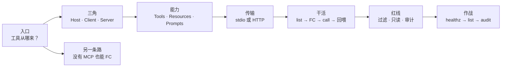
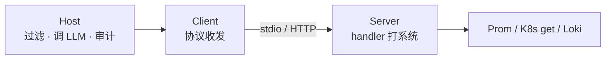
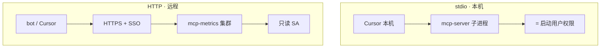
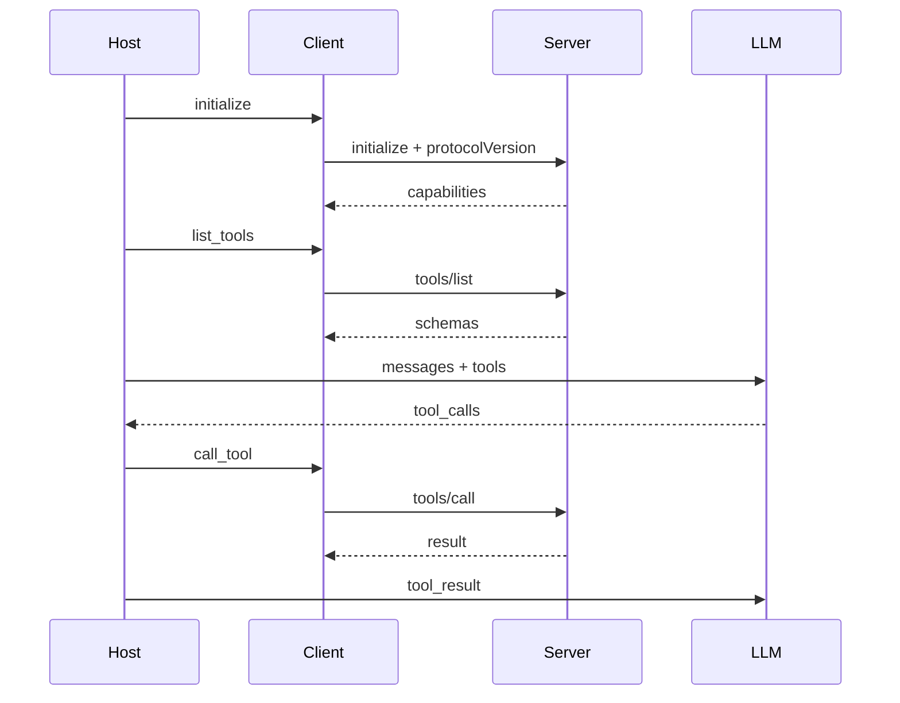
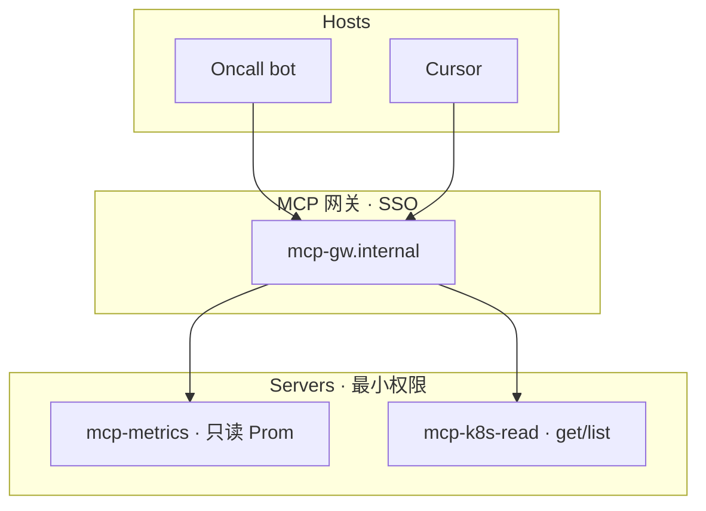
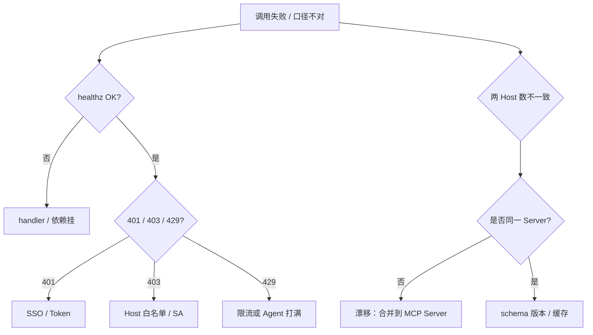

# MCP 协议

> 开服夜 20:01，值班 bot 查 `login_qps` 用一套 PromQL，Cursor 巡检用另一套——同一指标两处口径 drift，群里吵「到底 P99 是 80ms 还是 800ms」。有人喊「每个 Host 各写一份胶水」；有人喊「上了 MCP 就自动安全」。两句都不对。
> **本章回答**：一次 MCP 调用从 Host 连接、list tools、call tool、回结果，每个角色干什么、stdio vs HTTP 怎么选、安全审计怎么钉。
> **不讲**：FC 循环与审批闸门 → [04](../04-Function-Calling与Tool-Use/)；Agent 多步 → [06](../06-Agent智能体/)；Cursor 配置细节 → [07](../07-AI工具实战与Vibe-Coding/)。

**标记**：🎯重点 · 🔥难点 · ⭐常考 · 🔧实操
---

## 一、一张图：一次 MCP 调用的一生

> 🎯 **一句话**：**MCP（Model Context Protocol）** = Host 经 Client 连 Server → **list** → 模型出意图 → **call** → handler 打真实系统——**统一插头，不统一人品**。



- 📖 **读图**
  - 🚪 入口问「工具从哪来」：私有胶水 → drift；标准插头 → 一处改、多 Host 共用
  - 🛤️ 主线「三角 → 能力 → 传输 → 干活 → 红线 → 作战」；卡在哪一段，第一刀都是 **healthz + tools/list**（Q9、Q13）
  - 🔀 另一条路：没有 MCP 也能直接 FC 注册 schema（[04](../04-Function-Calling与Tool-Use/)）——MCP 管发现与复用，不管采样

本节对应练习题 Q1、Q14。三角先钉死——谁连谁、谁真正打系统？

---

## 二、角色：Host / Client / Server

> 🎯 **一句话**：**N 个 Host × M 个工具** 的私有胶水，收成 **N+M**——Server 写一次，Cursor、bot、Copilot 都能插。

> 💡 **打个比方**：MCP 像 **USB-C**——以前每个 App 一种口；现在充电器（Server）写一次，设备（Host）都能用。插头标准了，不代表插进去的一定是安全电源。

### 三角分工 🎯⭐

| 角色 | 职责 | 例子 |
|------|------|------|
| **Host** | 连哪些 Server、过滤可见 tool、调 LLM、审计 | Cursor、内部 Oncall bot |
| **Client** | MCP 协议收发：initialize / list / call / resources | Host 内置库 |
| **Server** | 暴露 tools/handlers、最小 SA | `mcp-metrics`、`mcp-k8s-readonly` |



- 📖 **读图**：箭头只到 Server handler——**没有**从 LLM 进程直连 Prometheus；和 [04 FC](../04-Function-Calling与Tool-Use/) 同一安全模型。

```text
没有 MCP：  bot 一套 PromQL 胶水 + Cursor 一套 + Copilot 一套 → 口径 drift
有 MCP：    一个 mcp-metrics Server → 所有 Host list 同一 query_metrics schema
```

- 📖 **读图**：左栏是 N×M 私有胶水；右栏是 N+M——**改口径只改 Server handler**，下次 list/call 各 Host 一起变。

#### ❓ 为什么不是每个 Host 各写一套胶水？

- ❌ **各写一套**：PromQL / namespace / 超时各处漂移 → 开服夜两套数字互相打脸
- ✅ **一个 Server**：schema + 白名单 + handler 一处维护；Host 只负责 **allowlist + 审计 + FC**
- 🧩 **LLM 在 Host，不在 Server**——Server 不推理，只执行 handler
- 🌐 **开放协议**：多 Host 实现；Server 语言任意（Python / Go / TS），关键是 handler 稳、有 healthz、有审计

> ⚠️ **别混**：**MCP Server ≠ LLM**。Server 是「打 Prometheus / K8s get 的进程」；模型采样、tool_calls 解析都在 Host 里。**MCP ≠ 各平台私有 Plugin**——Plugin 锁死单一 Host；MCP 跨 Host 减胶水。

> 📝 **面试**：「MCP 解决 N×M 胶水 → N+M；Host 连谁/过滤/调 LLM，Client 协议收发，Server handler 打系统；改 Server 所有 Host 一起变。」⭐（练习题 Q2、Q3）

本节对应练习题 Q2、Q3。角色清了——Server 到底能暴露哪三类能力？

---

## 三、能力：Tools / Resources / Prompts

> 🎯 **一句话**：运维主路径是 **Tools**；**Resources** 是按需读的 URI；**Prompts** 是 Server 侧模板——**别默认把 Resources 全灌窗口**。

| 能力 | 是什么 | 运维例子 |
|------|--------|----------|
| **Tools** | 可 `tools/call` 的函数 | `query_metrics`、`get_pod` |
| **Resources** | 可读 URI 内容 | `file://runbooks/oom.md` |
| **Prompts** | Server 提供的提示模板 | `summarize_incident` |

```text
tools/list  →  schema 进 LLM tools 参数 → 模型可主动 call
resources/list → URI 树给 Host UI / 模型「点选」→ resources/read 才进窗口
prompts/get  → 补 Task 结构；Host System 红线仍优先
```

- 📖 **读图**：三条能力不是平级入口——值班排障主路径是 **Tools**；Resources / Prompts 是辅线，默认「不自动灌」。

- 🔧 **运维用法**
  - 排障 **~90% 走 Tools**——查指标、看 Pod、搜日志
  - Resources 适合「点选才读」的 runbook；与 RAG 互补：RAG **自动召回**，Resources **显式深读**
  - Server Prompt **不能覆盖** Host System 红线——模板只补 Task 结构
  - 大文件 / 对象：Resources 可读 URI；真大对象走对象存储 presign，**别整文件塞 context**

```bash
# Host 启动后 Client 调用（概念）
{"method":"tools/list"}
# ← 返回 query_metrics / get_pod_status / search_logs ...

{"method":"tools/call","params":{"name":"query_metrics","arguments":{"promql":"..."}}}
# ← Server handler 打 Prom → 序列化结果回 Host
```

> 🔍 **现场**：list 很长、窗口立刻爆——查 Host 是否把 Resources **默认 read 全树**；应改为点选 `resources/read`。

> ⚠️ **别混**：**Tools 是 call**，**Resources 是 read**。把 500 页 wiki 当 Resource 一次性塞进 context，不是「更智能」，是窗口自杀。

> 📝 **面试**：「运维主路径 Tools；Resources 点选深读，与 RAG 自动召回互补；Server Prompt 压不过 Host 红线。」⭐

本节对应练习题 Q4。能力有了——本机子进程还是远程服务？

---

## 四、传输：stdio vs HTTP

> 🎯 **一句话**：**stdio** = 本机子进程，权限 = **笔记本用户**；团队共用、生产写权限、集中审计 → **远程 HTTP + SSO + 最小 SA**。



- 📖 **读图**
  - 左：spawn 本机进程，凭证常进 `mcp.json`，权限跟用户走——**某人 laptop 被控 ≈ 集群被控**
  - 右：网关统一 SSO / 审计 / 限流；Server 用独立 SA，不绑个人 kubeconfig

| 维度 | stdio | HTTP |
|------|-------|------|
| 部署 | 本地 spawn | 集群服务 |
| 权限 | **等于启动用户** | 独立 SA |
| 共享 | 每人一套 | **团队共用** |
| 审计 | 难集中 | 网关集中 |
| 适用 | 个人实验、只读本地 | **生产监控、共用口径** |

#### ❓ 为什么生产写权限不能挂 stdio？

- 🧨 **blast radius**：全员 Cursor stdio + admin kubeconfig → 任意一台失陷 = 写集群
- 🧾 **审计散落**：本机日志难进 SIEM；HTTP 网关可统一 `user/host/tool/args.hash`
- ✅ **口诀**：**实验 stdio，生产 HTTP+SSO**；生产写操作更应走 propose + 人批（[04](../04-Function-Calling与Tool-Use/)），不 direct call

- 🔧 **stdio 本地配置（仅实验）**

```json
{
  "mcpServers": {
    "local-metrics": {
      "command": "npx",
      "args": ["-y", "@example/mcp-metrics"],
      "env": {"PROM_URL": "http://localhost:9090"}
    }
  }
}
```

- ⚠️ **勿接生产 admin kubeconfig**；token 别明文长期写进 `mcp.json`

> 📝 **面试**：「个人实验 stdio 只读；生产共用监控必须远程 HTTP+SSO；stdio 权限=用户权限是核心风险。」⭐（练习题 Q5）

- 📡 **远程长连接**：生产 HTTP MCP 常走 **SSE / Streamable HTTP**
  - `initialize` → capabilities → 长连接上 multiplex `tools/list`、`tools/call`
  - 断线重连：**exponential backoff + jitter** → 重新 `initialize` + `tools/list`（防 schema 过期；防重连风暴打爆 Server）
  - 选型跟平台文档；WS 是否支持看实现，面试答「远程常用 SSE/Streamable HTTP」即可

- 🔑 **生产鉴权**：SSO JWT 或 mTLS；每请求带 `X-User-Id`（或等价）进 audit。Cursor 个人 token **不进** 生产 bot 配置。

本节对应练习题 Q5。线接上了——一次 call 怎么和 FC 咬合？

---

## 五、调用链：list → FC → call → 回喂

> 🎯 **一句话**：Client **list_tools** 把 schema 交给 Host → Host 放进 LLM 的 tools → 模型 **tool_calls** → Client **call_tool** → 结果回喂——**MCP 插头 + FC 机制**。

> 💡 **打个比方**：MCP 是「菜单从中央厨房统一印制」；FC 是「顾客点菜 → 服务员校验 → 后厨做菜 → 端回桌」。换了统一菜单，点菜流程没变。



- 📖 **读图**
  - 前半：`initialize` 谈版本与 capabilities；谈不成 **拒绝连接**，别静默降级成闭卷编数
  - 后半：从 tool_calls 起仍是 [04](../04-Function-Calling与Tool-Use/) 的 FC 循环——**没有箭头从 LLM 直连 Prometheus**

#### ❓ 为什么上了 MCP 还要走 FC？

- 🔌 **MCP**：发现 schema、跨 Host 复用、传输与会话
- ⚙️ **FC**：模型出意图 → Host 校验/限流/执行/回喂
- ✅ **可以没有 MCP**：直接在 Host 注册 JSON Schema 照样 FC
- ❌ **「上了 MCP 就不用 FC」**：call 之后回 Host 内 LLM——还是同一条循环

### 🤝 initialize 握手要点 🔧

- Client 发 `initialize` 带 **protocolVersion** → Server 回 **capabilities**（tools / resources / prompts）
- Client 发 `initialized` 通知 → 才能 `tools/list`
- 版本不匹配 → **拒绝连接**；别静默降级成闭卷编指标

- 🔧 **schema 变更纪律**：**先加后删**参数/工具，changelog 通知各 Host；突然改参数名 → 某 Host 大量 400
- ⏱️ **超时**：Client timeout < Server handler timeout，避免 hung 占连接
- 🔁 **list 缓存 TTL**：常见 5～10 分钟；滚版本后靠短 TTL 或强制 re-list
- 🚀 **灰度**：网关可按 Host 版本把 10% 流量打到新 Server，对比 error rate / latency 再全切

> ⚠️ **别混**：**MCP Gateway** 路由 `tools/call`；**LLM Gateway** 路由 `chat/completions`。审计要用 **session_id** 把两边串起来。

> 📝 **面试**：「FC=机制，MCP=插头；Client call 后仍 FC。没有 MCP 也能直接 FC；有 MCP 后采样与闸门不变。initialize 版本不匹配就拒绝，别静默降级。」⭐（练习题 Q3、Q8）

本节对应练习题 Q3、Q7、Q8。调用通了——协议会不会替你挡 `delete_namespace`？

---

## 六、安全：协议不替你拒绝 delete

> 🎯 **一句话**：MCP **只统一形状，不统一人品**——Host 必须 **过滤 tool**、默认 **只读**、**全调用审计**；第三方 Server 当 **不明软件** 审。

#### ❓ 为什么协议不会替你拒绝 delete？

- 📜 **协议层**：只规定 list/call 怎么传；**不内置**「写操作非法」
- 🛡️ **必须在 Host**：allowlist 只暴露只读；写 → `propose_*` + 人批（见 [04](../04-Function-Calling与Tool-Use/)）
- 🧪 **第三方 list 出现 `exec_in_pod` / `delete_namespace`** → **立即断开** + 安全事件，不是「先用着再说」

- 🔒 **安全清单** 🎯⭐🔥
  - Host 过滤：Server list 100 个，Host 只暴露 5 个只读
  - 只读 SA：namespace 限定；禁 cluster-admin「方便调试」
  - 写 → 审批：不 direct call
  - 审第三方：list 人工过；pin 版本 hash；生产镜像自建，不 `latest`
  - 审计：`user/host/server/tool/args.hash/status` 进 SIEM；**不记明文 PII**
  - 敏感不出域：不可信 Server 只连脱敏沙箱；生产数据不经不可审代码

```bash
# 审计日志示例
{"user":"alice","host":"cursor","server":"mcp-metrics","tool":"query_metrics","args_hash":"a1b2","status":200}
# ← list 若出现 delete_namespace → 告警并禁用该 Server 连接
```

> 🔍 **现场**：Cursor 能查 metrics、bot 不能——先 diff **`toolAllowlist` 与 SSO 角色**，不是「MCP 坏了」。

> 📝 **面试**：「协议不会拒绝 delete；Host 过滤+只读默认+审计；stdio 生产写权限禁止；第三方当 malware 审 list。」⭐（练习题 Q6、Q10）

### 收束：MCP 凭什么收口径 drift 🎯

把本章散落机制收成一条可背清单——**不是「上了协议就齐」**，是这六件一起生效：

```text
① 统一 Server handler     ← PromQL / 白名单一处写
② 多 Host 同一 URL        ← bot 与 Cursor 插同一插头
③ Host allowlist          ← list 再长也只暴露只读
④ schema 先加后删         ← 不突然改名砸 400
⑤ args.hash 审计对账      ← 和 Grafana 同一 query 可验
⑥ 生产 HTTP+SSO+分 SA     ← 权限与审计可集中，stdio 不扛生产写
```

- 📖 **读图**：①② 治 **N×M 胶水**；③⑤⑥ 治 **人品与权限**；④ 治 **版本漂移**。缺任一件，开服夜仍可能两套数字。

> ⚠️ **别混**：MCP **保证**的是「发现与复用形状一致」；**不保证**模型不乱调、不保证 handler 业务正确、不保证 Host 一定过滤——那三件仍是你的代码与流程。

本节对应练习题 Q6、Q9、Q10。红线钉死——多 Server 怎么拆、drift 怎么收？

---

## 七、边界：SRE 该用与禁止

> 🎯 **一句话**：**生产数据不出域**；**只读工具** 默认；**写操作人审**；只连 **可信 Server**——GitHub 现成包不经审不进生产。

### 该用 · 禁止

| 该用 | 禁止 |
|------|------|
| 只读监控/K8s get 做 **远程 HTTP Server** | 生产写权限 stdio 挂全员笔记本 |
| Host 过滤可见 tool | Server list 什么全给模型 |
| 只读 SA + namespace 限定 | cluster-admin「方便调试」 |
| 第三方 Server **审 tool 列表** | 不明 Server 进生产 |
| schema **先加后删** | 突然改参数名不通知 |
| handler **healthz** 探活 | 只探 TCP 端口 |
| 全调用审计 args.hash | 敏感经不可信 Server |

### 多 Server 拓扑 🔥⭐



- 📖 **读图**：网关统一 SSO、审计、限流；**metrics 与 K8s 分进程分 SA**——metrics 没有 K8s 凭证，K8s 没有 Prom admin。**不要把 cluster-admin 和 Prom 混在同一进程**。

- 🏷️ **tool 重名**：两 Server 都叫 `query` → Host 注册 `metrics.query` / `k8s.query`，description 写清差异，否则模型随机选
- 🔐 **Secrets**：HTTP Server 用 Vault/K8s SA 拉 bearer；**不进 Host 配置文件**
- 🚦 **双重限流**：网关按 `user+host` QPS + FC 步数上限（[04](../04-Function-Calling与Tool-Use/)）
- 🌍 **多环境**：staging / prod **不同 URL+SA**；Host 配置显式标环境，防 Cursor 误连 prod

#### ❓ 为什么两 Host 数字不一致要先问「是否同一 Server」？

- 🔀 **否** → 口径 drift：各写胶水或连了不同 handler → **合并到同一 mcp-metrics**
- ✅ **是** → 查 schema 版本、list 缓存、allowlist 是否裁掉了关键参数
- 🧾 **对账**：审计 `args.hash` 应对得上 Grafana 同一 query

### 落地：mcp-metrics 统一口径 🔧

1. 部署 `mcp-metrics`：只暴露 `query_metrics`，PromQL 白名单在 Server
2. 值班 bot + Cursor 连 **同一 HTTP Server**（SSO）
3. 改 login QPS 口径 → **只改 Server handler**；两 Host 下次 call 一致
4. 审计对比 `args.hash` 与 Grafana 面板
5. 写操作 **不走** MCP direct call

### 落地：第三方 Server 审查

1. `tools/list` 人工审；发现 `exec_in_pod` → **拒绝生产 Host**
2. pin 版本 + CI 扫 CVE；不可审代码 → 只连沙箱 Prom 或拒绝
3. 仅 stdio 本地实验可以，但 **勿挂生产 admin**

### Week1 checklist 🔧

```text
[ ] mcp-metrics HTTP + SSO + healthz
[ ] PromQL 白名单 + 只读 SA
[ ] Host allowlist: query_metrics only
[ ] audit → SIEM（args.hash）
[ ] bot + Cursor 同一 Server 集成测试
[ ] schema 变更：先加后删 + changelog
[ ] 明确：写操作不走 MCP direct call
```

### 故障演练 · 配置审查 🔧

```text
每月演练：
(1) 故意 list 含 exec 的 Server → Host 应拒绝连接
(2) 断 metrics healthz → Host 降级明示，禁止编数
(3) 审计抽 10 条能否还原 PromQL（对 Grafana）

季度审查 Host 配置：
[ ] mcp.json / bot 无生产 admin token 明文
[ ] toolAllowlist 与安全文档一致
[ ] Server 列表有 owner + 版本 pin
[ ] SIEM：list 出现 write/exec 告警
[ ] 与 04 FC 审计字段可对齐 session_id
```

- 📦 **Server 发布**：tools/list 人工审无 write/exec · healthz 真打 Prom · changelog 通知 Host · QPS 限流 · args.hash 入库
- 🔄 **热更新**：`kubectl rollout restart`；schema 向后兼容；紧急删 tool 要同步 Host allowlist，否则模型 call 到 404
- 🤝 **与 Cursor 并存**：Server URL / allowlist / SSO client_id 进同一 Git；bot ConfigMap 同仓渲染；MR 双人 Review（细节见 [07](../07-AI工具实战与Vibe-Coding/)）

> 📝 **面试**：「第一周只 read metrics 一个 Server，HTTP+SSO，Host allowlist，audit args.hash，bot/Cursor 共用；写操作不走 MCP。」⭐（练习题 Q7、Q12）

本节对应练习题 Q7、Q10、Q12。边界清了——现场卡死怎么 60 秒定责？

---

## 八、作战：MCP 排障定责

> 🎯 **一句话**：401 / 403 / 429 / 口径 drift——顺序 **healthz → list tools → 审计 args → 对 Grafana**。

#### ❓ 为什么 healthz 不能只探 TCP？

- 🔌 **TCP 通**：进程在听端口，**handler / Prom 凭证** 仍可能挂
- ✅ **探** `handler/healthz` + **试 call 一个小 query**——list 有 tool ≠ call 能成功
- 💀 常见：list 正常、call 401 → Prom bearer 过期；只 ping 端口永远看不出来



- 📖 **读图**：先活没活，再身份/权限/限流；drift 支路 **永远先问「是否同一 Server」**。

### 现象 · 先做 · 别做

| 现象 | 先做 | 别做 |
|------|------|------|
| 401 | SSO/Token 刷新 | 关审计 |
| 403 | Host 过滤 vs SA RBAC | 升 cluster-admin |
| 429 | 步数/限流 | 无限 call |
| 两 Host 口径 drift | 是否同一 Server | 各写各的胶水 |
| list 出现写 tool | 断开+安全事件 | 全暴露给模型 |
| TCP 活 handler 死 | healthz + 试 call | 只看进程 |
| Server Down | 降级明示「工具不可用」 | 闭卷编 login_qps |

### 60 秒剧本 🔧

> 🔍 **现场**：接到「bot 和 Cursor 数对不上 / call 全挂」，别先改 PromQL，60 秒走完这条线。

```text
① 0–10s   curl Server /healthz
② 10–30s  tools/list 是否含意外 write/exec tool
③ 30–45s  audit 最近 call：tool / args.hash / status
④ 45–60s  对 Grafana 同一 query 验证口径；两 Host 是否同一 Server URL
```

- ✅ Cursor 连不上：healthz → MCP 日志看 initialize → SSO token 是否过期；最常见是 token 过期与 allowlist 写错 Server 名
- ✅ 降级话术必须实现：「监控工具暂不可用，请查 Grafana xxx」——**禁止编数**
- ✅ Server 多副本：handler **无状态** + 共享 Prom；session 粘滞看 Host 实现
- ✅ 跨机房：HTTP 走内网 LB；latency 进 Oncall SLA；失败降级明示，不跨域出生产日志明文

**回到开头那个现场**：三套 Host 各写胶水、口径 drift。正确剧本是：Server 一处改 → Host 过滤只读 → 全调用审计 → 生产 HTTP+SSO。「上了 MCP 就安全」——现在你知道该怎么纠正了。

本节对应练习题 Q9、Q11、Q13。

---

## 九、收口

### 配置速查 🔧

```json
// Host 侧（概念）
{
  "mcpServers": {
    "metrics": {
      "url": "https://mcp-metrics.internal/sse",
      "headers": {"Authorization": "Bearer ..."}
    }
  },
  "toolAllowlist": ["query_metrics", "get_pod_status"]
}
```

```bash
curl -sS https://mcp-metrics.internal/healthz
# ← 必须探 handler，不只 TCP

# 审计字段对齐（进 SIEM）
# user / host / server / tool / args_hash / status / session_id
```

- 生产拆分参考：`mcp-metrics`（Prom read）· `mcp-k8s-read`（get/list 限定 NS）· `mcp-logs`（Loki read + 脱敏）
- telemetry：`mcp_call_total{server,tool,status}`、`mcp_call_latency_seconds`，与 FC 指标同 dashboard，按 `session_id` 关联

### 面试锚点

| 问 | 30 秒答 |
|----|---------|
| MCP 是什么？ | AI 连外部工具的标准协议；N×M 胶水 → N+M。 |
| vs FC？ | FC=机制；MCP=插头；call 后仍 FC。 |
| Host/Client/Server？ | Host 连/过滤/调 LLM；Client 协议；Server handler 打系统。 |
| stdio vs HTTP？ | stdio=本机用户权限，实验；生产共用 HTTP+SSO。 |
| Tools/Resources？ | 运维主路径 Tools；Resources 点选读，不默认灌窗。 |
| 安全？ | Host 过滤；只读默认；审第三方；审计 args.hash。 |
| 协议拒 delete？ | 不会；Host 拒 + allowlist。 |
| 口径 drift？ | 先问是否同一 Server；改一处。 |
| healthz？ | 探 handler + 试 call；不只 TCP。 |
| 生产落地？ | 第一周只读监控共用；schema 先加后删。 |

### 易错一句话对照

- MCP Server = 模型 → Server 是 handler，LLM 在 Host
- 有 MCP 就不用 FC → 仍走 FC 循环
- stdio 生产写权限方便 → 禁止；权限=用户
- Server list 全给模型 → Host 必须过滤
- 协议会拒 delete → 不会；Host 拒
- 只探 TCP → healthz 探 handler + 试 call
- 改参数名不通知 → 先加后删 + changelog
- 第三方 Server 可信 → 当 malware 审 list
- Resources 全灌 → 爆窗口；点选读
- MCP 自动合规 → 审计+ACL 仍要做
- 两 Host 数不一致先改 PromQL → 先问是否同一 Server
- MCP Gateway = LLM Gateway → 一个路由 tool，一个路由 chat

### 数字墙

> 运维主路径 **Tools** · 生产写 **stdio 禁止** · schema **先加后删** · list 缓存常见 **5～10 min** · 排障顺序 **healthz→list→audit→Grafana** · 与 FC **插头+机制** · 多 Server **分 SA** · 审计 **args.hash** · Week1 **只读监控一个 Server**

### 口述模板

**【30 秒】**「MCP 是 Host-Client-Server 标准插头，list 后仍走 FC call。stdio 本机实验，生产共用 HTTP+SSO。Host 过滤 tool、只读默认、审第三方、全调用审计。改 PromQL 口径只改 Server 一处。」

**【2 分钟】** 沿一次调用：Host 连 Server → initialize/list → schema 给 LLM → tool_calls → Client call → handler 打系统 → 回喂 → stdio vs HTTP 权限 → 安全不外包 → drift 合并 Server → 排障 healthz/list/audit。

**【常见追问】**

| 追问 | 答法 |
|------|------|
| MCP 替代 FC 吗 | 不；插头+机制 |
| stdio 生产写 | 禁止 |
| 协议拒 delete | 不会；Host 过滤 |
| Resources 干啥 | 点选读 runbook |
| 两 Host 数不一致 | 是否同一 Server |
| MCP vs Agent | MCP 管发现复用；Agent 管多步决策，正交 |

---

## 合上书

对着第一节主图口述一遍，卡住就回对应小节。开头那个现场——口径 drift、「上了 MCP 就安全」——两人各自错在哪，现在该能说清了。

- [ ] **默画主图**：入口 → 三角 → 能力 → 传输 → 干活 → 红线 → 作战；另一条路「无 MCP 也能 FC」。（→ Q1 · Q14）
- [ ] **口述三者分工**：N×M → N+M；LLM 在 Host 不在 Server。（→ Q2）
- [ ] **Tools vs Resources vs Prompts**：运维主路径；Resources 为何不默认灌窗。（→ Q4）
- [ ] **stdio vs HTTP**：权限风险；口诀「实验 stdio，生产 HTTP+SSO」。（→ Q5）
- [ ] **默画调用链**：initialize → list → FC tool_calls → call → 回喂；说清为何还要 FC。（→ Q3 · Q8）
- [ ] **安全清单**：Host 过滤、只读 SA、审第三方、args.hash；协议为何不拒 delete。（→ Q6 · Q10）
- [ ] **drift 与落地**：是否同一 Server；mcp-metrics Week1 checklist。（→ Q7 · Q12）
- [ ] **定责**：决策树 + 60 秒剧本；healthz 为何不能只探 TCP。（→ Q9 · Q11 · Q13）
- [ ] **收束六件套**：统一 Server · 同 URL · allowlist · 先加后删 · args.hash · HTTP+SSO——缺一仍可能 drift。
- [ ] **分层**：FC vs MCP vs Agent（呼应 [04](../04-Function-Calling与Tool-Use/)、[06](../06-Agent智能体/)）。

下一章：[06 Agent](../06-Agent智能体/)。FC：[04](../04-Function-Calling与Tool-Use/)。工具实战：[07](../07-AI工具实战与Vibe-Coding/)。
