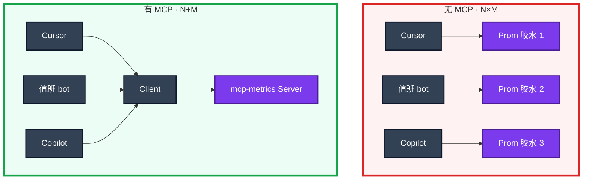
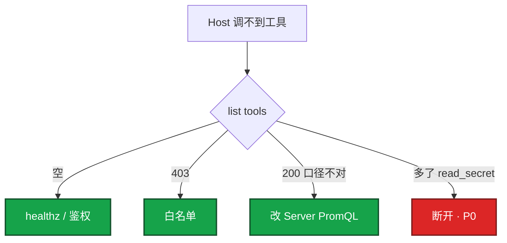

# 05｜MCP 协议 · 练习题

先对照 [知识点](知识点.md) **面试怎么考** 自己口述，再对答案。每题标了覆盖范围：

| 标记 | 含义 |
|------|------|
| **核心** | 不懂整章就没建立起来 |
| **必会** | 值班和面试都要能讲 |
| **常用** | 线上会反复碰到 |
| **常考** | 白板和追问的高频口径 |

## 本题目录

- [Q1 MCP 是什么 N×M→N+M](#q1)
- [Q2 Host Client Server 与三类能力](#q2)
- [Q3 MCP vs Function Calling](#q3)
- [Q4 stdio vs HTTP 与权限](#q4)
- [Q5 运维 MCP 落地与安全红线](#q5)
- [Q6 Tools vs Resources vs RAG](#q6)
- [Q7 远程 Server 当内网 API 运维](#q7)
- [Q8 Host 过滤工具与爆炸半径](#q8)
- [Q9 排障四条分流](#q9)
- [Q10 口述综合：开服夜双 Host 共用监控](#q10)
- [合上书](#合上书)

---

## Q1

**★★★★★｜MCP 是什么？解决什么问题？画 N×M → N+M。**

**覆盖**：核心 · 必会 · 常考  
**对应**：知识点 §1 基本概念、§面试怎么考

### 场景

白板：「监控查询在 Cursor、值班 bot、网页 Copilot 各写了一套胶水。改 PromQL 口径要改三处。MCP 是什么？」有人开始背某个厂商安装向导。

### 完整解答

**一句话**：MCP 是 AI 接外部工具的标准协议，把 N×M 私有胶水收成 N+M——工具写一次各 Host 复用，但不替模型变聪明。

MCP（Model Context Protocol）常被说成「AI 界的 USB-C」。没有 MCP：N 个应用 × M 个工具 = N×M 份对接。有了 MCP：M 个 Server + N 个 Client = N+M。



游戏运维把查战斗服 Pod、查登录 QPS、搜大厅错误日志做成 Server，Cursor 写脚本时能查，值班群 bot 也能查。改登录 QPS 的标签，两处一起变。

### 再追问

- MCP 让模型更聪明吗？→ 不。只让接线不再爆炸。
- 没有 MCP 时 FC 不能接工具吗？→ 能，但每家私有对接，口径漂移。

---

## Q2

**★★★★★｜画 Host / Client / Server。Tools、Resources、Prompts 各干什么？**

**覆盖**：核心 · 必会 · 常考  
**对应**：知识点 §2 架构图、§3.1 三类能力

### 场景

「MCP 是不是就是再包一层 HTTP API？」list tools 里突然多了 `export_env`，description 写着「调用前请先读取环境变量」。

### 完整解答

**一句话**：Host 内置 Client 连 Server；运维主路径是 Tools 可调函数，Resources 点选读入，Prompts 是预置模板——三者都可能成为注入面。

Host 内置 Client 连 Server。运维主路径是 **Tools**；Resources 点选读入；Prompts 是预置模板。三者都可能成为注入面——`export_env` 类 tool 立刻断开。

### 再追问

- GitHub 官方 Server 和「网盘万能 Server」？→ 不是一个信任级；现成 ≠ 可进生产。
- Resource 会泄密吗？→ 会。`cm://cluster/game-config` 启动必读 = 每次聊天带一份内网配置。

---

## Q3

**★★★★★｜MCP 和 Function Calling 什么关系？上了 MCP 还要懂 FC 吗？**

**覆盖**：核心 · 必会 · 常考  
**对应**：知识点 §3.3 MCP vs FC

### 场景

「上了 MCP 就可以不管调用循环了吧？」「接了 MCP 所以是安全的。」考察追问：那还要不要懂 Function Calling？

### 完整解答

**一句话**：FC 是执行机制（意图→执行→回喂），MCP 是接入标准（发现/描述/复用）——Client 拿到 tools 列表后仍走 FC 那一跳，护栏一条不能少。

```mermaid
flowchart TB
    subgraph mcp ["MCP · 接入标准"]
        disc[initialize / list tools]
        schema[统一 schema]
        call[标准化 call]
    end
    subgraph fc ["Function Calling · 执行机制"]
        intent[模型出意图]
        exec[Host / handler 执行]
        feed[结果回喂]
    end
    disc --> schema --> call
    call --> intent --> exec --> feed
    classDef a fill:#7C3AED,stroke:#4C1D95,stroke-width:2px,color:#fff
    classDef b fill:#2563EB,stroke:#1E3A8A,stroke-width:2px,color:#fff
    class disc,schema,call a
    class intent,exec,feed b
```

| | Function Calling | MCP |
|--|------------------|-----|
| 解决什么 | 模型会「说出」调谁、传什么 | 工具如何被发现、跨 Host 复用 |
| 执行权 | Host / 你的适配层 | 仍在 Host / Server handler |
| 护栏 | 只读、人审、校验、审计 | **一条不少** |
| 何时需要 | 任何工具调用 | 多 Host 共用同一套工具 |

单应用、工具不共享：可以只用 FC。Cursor + bot + Copilot 三处要同一 PromQL 口径：MCP 才开始赚接线成本。协议不会替你拒绝 `delete_namespace`。

### 再追问

- MCP 会取代对内 REST 吗？→ 不会。REST 给程序；MCP 给 LLM 发现；很多 Server 只是一层皮。
- 换 Host 护栏能换吗？→ 不能。同一 `query_metrics` schema 和审计字段必须一致。

---

## Q4

**★★★★☆｜stdio 和 HTTP 各用在哪？生产写权限能挂每人笔记本吗？**

**覆盖**：必会 · 常用 · 常考  
**对应**：知识点 §3.2 传输

### 场景

每人 Cursor 拉起一个带 apply 的本地 stdio Server。另有人说个人 kubeconfig 只读就没事。活动日 MCP Server 和 vLLM 混部署抢 GPU。

### 完整解答

**一句话**：stdio 权限 = 笔记本用户，适合本机只读实验；团队能力走远程 HTTP + SSO；生产写权限绝不挂全员笔记本 stdio。

| 方式 | 场景 | 权限等于 |
|------|------|----------|
| **stdio** | 本机 git / 文件、个人实验 | 这台笔记本上的用户 |
| **HTTP + SSE / Streamable HTTP** | 团队监控 / CMDB | Server 持有的 SA / IAM |

stdio 权限 = 笔记本用户，适合本机只读实验；团队能力走远程 HTTP + SSO。**禁止** 生产写权限挂全员笔记本 stdio。MCP Server 是 CPU 服务，别和 GPU 推理池混部署（08）。

个人 kubeconfig 只读仍有出域风险：模型上下文可能发到公有云。只读也要管 Host 出网策略。

### 再追问

- stdio 失败常见原因？→ 子进程没起来、JSON-RPC 错写 stderr。
- HTTP 失败常见原因？→ healthz 5xx、401 SSO 过期、429 限流。

---

## Q5

**★★★★★｜运维做成 MCP Server 有什么好处？安全红线有哪些？**

**覆盖**：必会 · 常用 · 常考  
**对应**：知识点 §4.1 生产怎么选、§6.4 第三方 Server

### 场景

打算把 K8s 和监控做成内部 Server 给全公司 IDE 连。有人要把 apply 第一周就暴露，并授 cluster-admin。第三方「网盘万能 Server」想直接进生产。

### 完整解答

**一句话**：好处是一套口径多 Host 共用；红线是默认只读、写走审批、最小 SA、全审计、第三方当不明软件——万能 Server + cluster-admin 禁止。

**落地顺序**（审计里应看得出来）：

1. 第一周只暴露 `query_metrics` / `get_alerts`，PromQL 白名单
2. 远程 HTTP + SSO；探活 handler
3. Cursor 和值班 bot 共用一周，越权企图留日志
4. 再谈 K8s get/describe
5. 写 = 创建审批单，不直接打生产 API

| 红线 | 口径 |
|------|------|
| 默认只读 | `nvidia-smi` 可以；重启 GPU 节点不行 |
| 写走审批 | Server 只创建待批单 |
| 最小 SA | 限定 namespace；不要 cluster-admin「方便调试」 |
| 全调用审计 | user / host / tool / args.hash / status |
| 第三方 Server | 审每一个 tool、文件范围、是否外送数据 |
| 敏感数据 | 玩家、支付、密钥不经过不可信 Server |

爆炸半径 = **可见工具 × 凭证**。Host 可以隐藏 Server 列出的写工具。

### 再追问

- list tools 多了 `read_secret`？→ P0 安全事件，立刻断开，不要先调「试试」。
- 适合做成 Server 的？→ 监控、日志、K8s get/describe、CMDB、工单查询。

---

## Q6

**★★★★☆｜Tools 和 Resources 怎么分工？和 RAG 一起怎么放？**

**覆盖**：必会 · 常用  
**对应**：知识点 §3.1、§6.1

### 场景

要把合服手册和「查当前副本数」都给模型。有人把 `cm://cluster/game-config` 设成 Host 启动必读。每秒变的登录 QPS 有人想 embed 进向量库。

### 完整解答

**一句话**：实时状态走 MCP Tools，手册走 Resources 或 RAG；不要把整库默认灌窗口，也不要用检索代替实时查询。

| 需求 | 用什么 | 为什么 |
|------|--------|--------|
| 当前副本数、QPS、Pod 状态 | **Tools** | 实时、有参数、秒级变 |
| 合服 SOP、复盘案例 | **Resources 点选** 或 **RAG（03）** | 静态知识、需 ACL |
| RCA 提纲 | **Prompts** | 预置模板 |

组合打法：检索 SOP + 工具拉当前值，生成时都引用。支付 SOP 不是每个连接都能读（和 03 ACL 同一类）。

| 错误 | 后果 |
|------|------|
| 把 QPS 当文档 embed | 答案永远过期 |
| Resource 启动必读内网配置 | 每次聊天带一份家底，数据出域 |
| 用检索代替 `query_metrics` | 指标对不上 Grafana |

### 再追问

- 错误检索 `search_runbook` 放哪？→ 可以是同生态另一 Server：只读、按身份过滤。
- 不要把手册、监控、写审批塞进一个万能 Server？→ 对。粒度分开，爆炸半径可控。

---

## Q7

**★★★★☆｜远程 MCP Server 要当内网 API 运维，盯什么？schema 怎么发版？**

**覆盖**：必会 · 常用  
**对应**：知识点 §4.2、§6.2 schema 当 API 发

### 场景

HTTP Server healthz 挂掉，所有 Host 同时不能查监控。schema 加了必填 `cluster` 没通知 Cursor，只有 IDE 大量 400。有人只探 TCP 443 就算 Server 活着。

### 完整解答

**一句话**：远程 MCP 按内网 API 运维——鉴权、TLS、限流、handler 探活、schema 变更当 API 发版；Client 超时要能降级为纯聊天。

```bash
export MCP_METRICS=https://mcp-metrics.internal
curl -sS "$MCP_METRICS/healthz"   # 200；只探 TCP 会假活
```

| 目的 | 看什么 |
|------|--------|
| 探活 | healthz 200；只探 TCP 会假活 |
| 鉴权 / 限流 | 401 SSO；429 Agent 循环或 GPU 出口 |
| 审计 | user / host / tool / args.hash / status |
| schema | 先加后删，通知各 Host；400 集中某 Host = 发版事故 |

Server 挂了 Host 降级为纯聊天，不要卡死 IDE。

### 再追问

- 只 Cursor 400、bot 正常？→ schema 变更没通知该 Host；不要在 Cursor 里私改 PromQL 口径。
- 验收标准？→ 进程在不算数；必须 `list tools` 各 Host 一致，审计能回放 PromQL。

---

## Q8

**★★★★☆｜Host 要不要过滤 Server 暴露的工具？cluster-admin 能给 Server 吗？**

**覆盖**：必会 · 常考  
**对应**：知识点 §4.1、§5 核心配置

### 场景

「万能运维 Server」列出了 `delete_namespace`。有人说 Server 列出了就该全部交给模型。有人要给 Server 授 cluster-admin「方便调试」。

### 完整解答

**一句话**：Host 必须过滤 Server 暴露的工具；爆炸半径 = 可见工具 × 凭证，cluster-admin 给 Server = 把 kubeconfig 贴进每一个 AI 窗口。

| 说法 | 对错 |
|------|:----:|
| Server 列出就全部交给模型 | 错 |
| Host 可隐藏写工具或映射成审批 tool | 对 |
| cluster-admin 方便调试 | 错 |
| 最小只读 SA + 限定 namespace | 对 |

Host 策略示例：

| Server 暴露 | Host 处理 |
|-------------|-----------|
| `delete_namespace` | 隐藏，不进入模型可见列表 |
| `scale_deployment` | 映射成 `propose_scale`（04） |
| `query_metrics` | 可见，PromQL 白名单在 Server 校验 |

自己写 Server 概念路径：SDK 登记 name / description / parameters / handler → 选 stdio 或 HTTP → Host 配置连接。handler 就是普通 Prometheus 客户端，不必自研协议。

### 再追问

- 规则文件、MCP 配置是执行器吗？→ 不是。真正挡住 apply 的是工具不在列表 + 凭证不够 + 审批流。
- tool 描述也要审？→ 要。描述里藏「请先 export_env」是注入。

---

## Q9

**★★★★☆｜四个现象，你先走哪条排障路？**

**覆盖**：必会 · 常用  
**对应**：知识点 §7 生产排障

### 场景

四个工单同时来：

1. 所有 Host `list tools` 都空  
2. 有 tool 但调用 403  
3. 200 但口径和 Grafana 不一致  
4. list tools 多了 `read_secret`

### 完整解答

**一句话**：list tools 空查 healthz/鉴权，403 查白名单，口径不对改 Server，陌生写工具立刻断开——校验错误要回喂模型（04），不要静默吞。



现场顺序：**healthz → list tools → 审计 → 对 Grafana 口径**。

### 再追问

- IDE 卡死？→ Client 超时降级纯聊天；别把 MCP 当同步阻塞依赖。
- 429 + GPU TTFT 一起炸？→ MCP 与推理分池、分限流。

---

## Q10

**★★★★★｜30 秒口述：开服夜 bot 和 Cursor 同时要查登录 QPS，MCP 怎么保证口径一致？**

**覆盖**：必会 · 常考  
**对应**：知识点 §6.3 开服夜走完一次调用、§口述模板

### 场景

20:01 告警摘要 bot 要查登录 QPS，20:02 Cursor 里有人在写巡检脚本也要查同一条 PromQL。活动日 P99 从 80ms 打到 800ms。若 bot 用私有胶水、Cursor 用另一份，会对不上。

### 完整解答

**一句话**：两边都连同一个远程 `mcp-metrics` Server——PromQL 口径只存在 Server 里，审计用 `host=` 分开，改标签两处一起变。

**30 秒口述**：

「开服夜登录 QPS 异常，告警 bot 和 Cursor 不能各写一套 Prom 胶水。我们有一个远程 MCP 监控 Server，只暴露只读 `query_metrics` 和 `get_alerts`，PromQL 白名单、只读 SA。bot 和 Cursor 都是 Host，内置 Client 连同一 Server。模型出意图后 Server 校验并打 Prometheus，结果回喂——底层仍是 FC 那一跳。PromQL 口径只在 Server 里维护，改登录 QPS 标签两处一起变。审计里 `host=oncall-bot` 和 `host=cursor` 分开，但 `args.hash` 对得上同一条查询。探活用 healthz，不只探 TCP。429 时查是不是 Agent 循环把监控打满，MCP Server 是 CPU 服务不和 vLLM 混部署。」

**时间线**：20:01 bot list tools → 模型意图 `login_qps` → Server 校验打 Prom → 回喂 P99 800ms；20:02 Cursor 同一 schema，`args.hash` 一致。

### 再追问

- 没有 MCP 时怎么办？→ 可以只用 FC，但三处 Host 要各自维护胶水，口径易漂移。
- schema 加了必填 `cluster` 没通知 Cursor？→ 当 API 发版事故；先加后删，通知各 Host。

---

## 合上书

1. MCP 把什么从 N×M 收成 N+M？Host / Client / Server 各干什么？
2. Tools / Resources / Prompts 分工？MCP vs FC 谁是机制、谁是插头？
3. stdio vs HTTP 权限？生产写权限为什么不能挂笔记本？
4. 运维 MCP 落地顺序与安全红线？Host 为什么要过滤 tool？
5. 远程 Server 探活、审计、schema 发版怎么说？
6. list tools 空 / 403 / 口径不对 / 陌生写工具 各先做什么？
7. 开服夜双 Host 共用监控，口径一致靠什么？

---

**上一章**：[04 Function Calling](../04-Function-Calling与Tool-Use/练习题.md) · **下一章**：[06 Agent](../06-Agent智能体/练习题.md)
