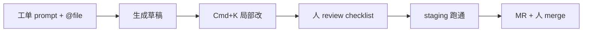
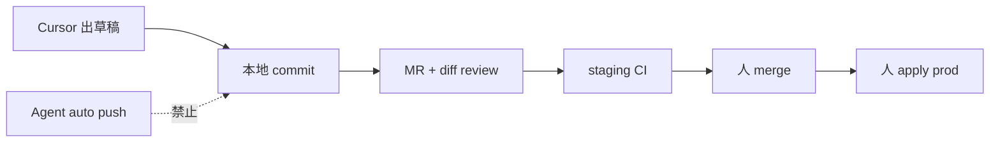
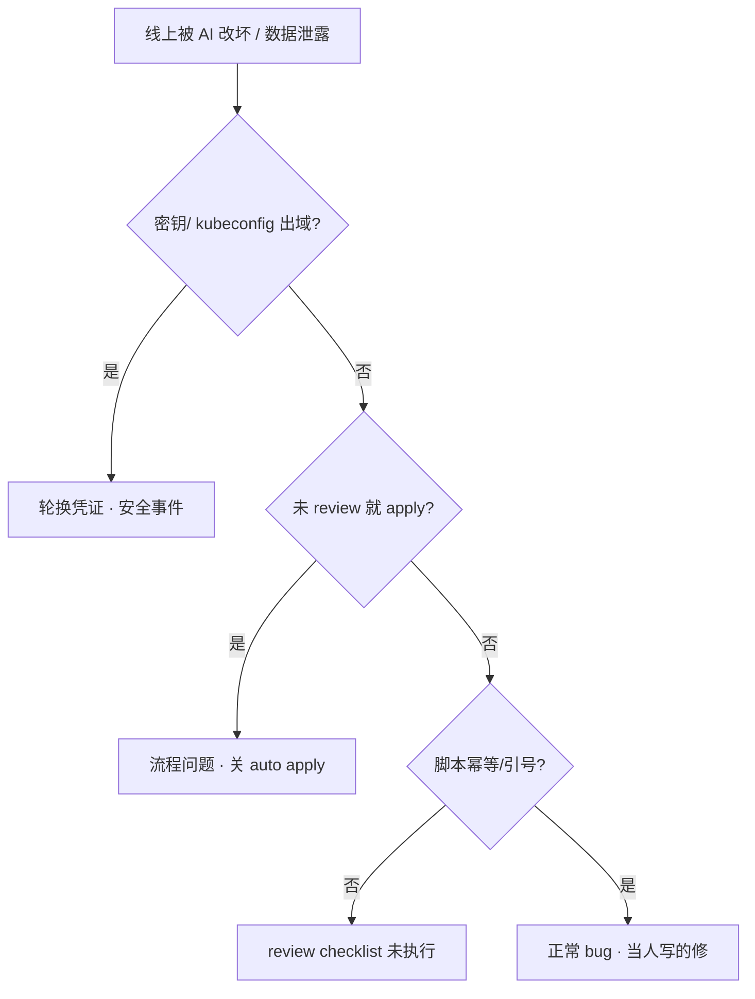

# AI 工具实战与 Vibe-Coding

> 活动前夜，有人把 prod kubeconfig 贴进 ChatGPT 问「怎么扩容」；另有人让 Cursor Agent 一键 `kubectl apply -n prod`，diff 没看就合了——第二天限流脚本把测试路径写死成生产。
> **本章回答**：一次「用 AI 辅助排障或写代码」从提需求到合入会经历什么——人管两头、模型出草稿、验收清单挡住出域和自动执行。
> **不讲**：FC 审批闸门 → [04](../04-Function-Calling与Tool-Use/)；MCP Server 部署 → [05](../05-MCP协议/)；Agent 多步循环 → [06](../06-Agent智能体/)；GPU/推理队列 → [08](../08-GPU资源与调度/) · [09](../09-推理服务性能与稳定性/)。

**标记**：🎯重点 · 🔥难点 · ⭐常考 · 🔧实操
---

## 一、一张图：AI 辅助的一生

> 🎯 **一句话**：AI 辅助六段——人收证据、写工单、模型出草稿、人 review、测试验、合入或丢——模型永远不管签字。


- 📖 **读图**
  - 🛤️ 主线不是「AI 替我写」，是 **人写工单、模型出中间稿、人验收**——两端必须是人
  - 🔍 「review」最易翻车：没看 diff 就 apply，和没看化验单就签字一样（Q3、Q6）
  - 🎮 Vibe Coding 提效在重复劳动（骨架、样板、文档草稿），不在替你承担变更责任

### 🎸 Vibe Coding 是什么 🎯⭐

> 🎯 **一句话**：**Vibe Coding** = 自然语言驱动 IDE/CLI 出代码草稿，人负责需求、review、测试、合入。

| 对比 | 传统写脚本 | Vibe Coding |
|------|------------|-------------|
| 起点 | 人从零敲 | 人写工单 + 模型出骨架 |
| 中间 | 人写全量 | 人迭代选中段 Cmd+K 改 |
| 终点 | 人测试合入 | **同样**人测试合入 |
| 风险 | 手误 | **+** 出域、幻觉、自动 apply |

#### ❓ 为什么不是「AI 替我写」？

- ❌ **「不用懂代码」**：看不懂的代码合进去 = 值班替模型签字
- ✅ **人管两头**：需求与验收；模型只管中间草稿
- 🔑 **提效点**：重复劳动（骨架、样板、文档），不是跳过 review

> 📝 **面试**：自然语言出草稿，人 review+测试+合入；提效重复劳动，不替值班签字。⭐（练习题 Q1）

本节对应练习题 Q1。主线有了——排障怎么开场。

---

## 二、人收证据：排障先有人，再要 AI 假设

> 🎯 **一句话**：开场不要「挂了怎么办」——先贴 **3~5 条证据**，再要 **3~5 个假设 + 只读下一步命令**。

### 🎬 错误开场 vs 正确开场 🔧

```text
# 错误：闭卷 + 无边界
「大厅挂了怎么办？」→ 模型编 cordon 步骤、建议 delete pod

# 正确：开卷 + 只读
「20:05 LoginP99 500ms（Grafana 链）· 19:50 发布 gw v2.3.1 · gw-1 RestartCount=3 OOMKilled
 只要：① 3 个根因假设 ② 每条对应只读命令 ③ 不要 apply/delete」
```

模型输出应像：

```text
假设1: limit 512Mi 过低 → kubectl describe pod gw-1 -n game
假设2: v2.3.1 内存回归 → diff 发布物 + query 内存曲线
假设3: 依赖超时连坐 → ss -ti / trace 抽样
禁止: 任何 restart/scale/apply
```

> ⚠️ **别混**：RAG 查手册（[03](../03-RAG检索增强/)）是 **开卷**；闭卷让模型「回忆 SOP」会幻觉。AI 辅助排障 = 人证据 + 模型假设，不是 Agent 自动跑 40 步（[06](../06-Agent智能体/)）。

### 📋 证据清单模板 🔧

开服夜排障，**先填再贴给模型**——缺一项就补：

```text
【工单模板 · 只读排障】
时间窗: 20:02–20:15
症状: LoginP99 500ms（Grafana 链: https://...）
变更: 19:50 gw v2.3.1 deploy（变更单 #8842）
已查只读证据:
  - kubectl describe pod gw-1 -n game → OOMKilled x3
  - prom: working_set 贴 512Mi limit
约束: 不要 restart/scale/apply；输出 3 假设 + 只读下一步
```

```bash
# 人侧先跑的只读命令（再贴输出给 AI）
kubectl describe pod gw-1 -n game | tail -20
# Last State: OOMKilled  ← 假设 1 证据链起点；不要等 AI 输出后再补 describe
kubectl top pod gw-1 -n game 2>/dev/null || echo "metrics-server 不可用"
```

- 🗺️ **四类证据**：指标要带链；变更要单号+时间；Pod 状态用 describe/events 摘要；日志抽样 50 行 + 聚类——**别贴** 200MB 整文件、无链的「P99 很高」

#### ❓ 为什么不能闭卷问「挂了怎么办」？

- 👻 **闭卷** → 模型编步骤、幻觉 SOP、建议 delete/apply
- ✅ **开卷** → 人贴 3~5 证据，只要假设 + 只读命令
- 🔁 **同会话追加** describe / 指标，别重开对话丢上下文；仍 **不要** auto execute

> 📝 **面试**：排障用 AI——人先收证据，只要假设和只读命令；delete/apply 不在自动路径。⭐（练习题 Q2）

口诀：**「先证据，再假设，只要只读」**。本节对应练习题 Q2。开场对了，工单四要素。

---

## 三、写工单：Prompt 四要素 + 钉文件

> 🎯 **一句话**：工单式 prompt = **角色 + 输出格式 + 约束边界 + 验收标准**；Cursor 用 `@file` 钉已有框架，别让它从零发明目录。

> 💡 **打个比方**：像点外卖——「不要香菜、微辣、送到 3 楼」写清楚；厨房（模型）出菜，**你尝一口再端给客人**。

活动前夜要 nginx 巡检脚本：

```text
角色：SRE 巡检脚本，bash，对齐 @file scripts/check-framework.sh
输出：check-nginx.sh，函数 check_upstream / check_ssl_expiry
约束：set -euo pipefail；变量加引号；--dry-run 默认开；无硬编码密钥
验收：shellcheck 零 error；staging 跑通再 MR
```

### 📜 `.cursorrules` 能挡生产变更吗？ ⭐

**不能 alone**。规则锁 **生成倾向**；真正挡执行的是：**关 Agent 自动 apply**、命令白名单、MR 必审——和 [04](../04-Function-Calling与Tool-Use/)、[06](../06-Agent智能体/) 同一层。

```text
# .cursorrules 片段（生成侧）
- 生产变更只输出 diff 建议，不执行 kubectl apply
- 脚本默认 --dry-run
- 未知事实标「待核实」
```

#### ❓ 为什么 `.cursorrules` 不够？

- 🛡️ 规则只影响 **怎么写**，不挡 **怎么跑**
- 🔒 执行闸门：关 auto apply · 白名单 · MR 必审
- ⚠️ 写了「禁止 apply」但 Agent 仍可跑终端 → 当流程事故，不是「规则写漏一句」

> 📝 **面试**：`.cursorrules` 不够；关 auto apply + 白名单 + MR。⭐（练习题 Q7）

本节对应练习题 Q3、Q7、Q8。工单清了，按形态选工具。

---

## 四、模型出草稿：Cursor / Copilot / CLI 各管哪段

> 🎯 **一句话**：按 **形态** 选工具——多文件小工具 Cursor；行内补全 Copilot；批量改仓终端 Agent；**敏感仓不出公网**。

| 形态 | 典型工具 | 适合 | 危险品 |
|------|----------|------|--------|
| IDE 多文件 | Cursor Chat/Agent | 脚本骨架、YAML 草稿 | Agent 自动跑 shell |
| 行内补全 | Copilot | 零散函数、正则 | 无脑 Tab 接受 |
| 终端 Agent | Claude Code / Codex CLI | 批量 refactor、跑 pytest | 自动 git push |
| 对话 | 内网模型 API | 假设、文档草稿 | 贴 kubeconfig |

**Vibe 闭环**（编码）：



- 📖 **读图**
  - 🧑 模型管 G→K；W 和 R→M 必须是人
  - 🛑 Agent 弹 `kubectl apply` → **直接拒**，看 diff 手动执行（Q6）

### 🔐 内网 vs 公网：模型部署边界 🔥

- 🎮 游戏服 kubeconfig、AK/SK → **内网** Copilot / 私有化 API；**禁止** ChatGPT 公网对话
- 👤 玩家 UID、订单号 → 脱敏后内网；开源骨架可 Cursor，**别贴**完整 `.env`
- 🔍 排障假设 → 内网 + 证据先行；禁止闭卷「大厅挂了怎么办」

```bash
curl -s http://llm-internal/v1/models | jq '.data[].id'
grep -iE 'kubeconfig|AKIA|BEGIN RSA' /var/log/llm-audit.log && echo "SECURITY INCIDENT"
```

> ⚠️ **别混**：私有化部署 **不消除** 最小必要——GB 日志进窗口仍烧钱+漏行（[10](../10-AIOps落地/)）。

### ⌨️ Copilot Tab：逐行验收 ⭐

行内补全适合零散函数——**安全相关行必须人眼过**：

```text
ssh $host rm -rf /data/cache/*          ← 未引号 + 破坏性
kubectl delete pod -l app=gw            ← 无 dry-run
curl https://xxx/install.sh | bash      ← 管道执行
```

> 🔍 **现场**：`git diff` 里 Copilot 行——重点看引号、路径、delete 类动词。

本节对应练习题 Q4、Q5。工具选了，review 七条。

---

## 五、人 review：七条 checklist

> 🎯 **一句话**：生成稿合入前过 **七条**——比「看起来对」重要；看不懂的代码 **不能合**。

🔥 口诀：**「合入前过七条，比看起来对重要」**。

```text
① set -euo pipefail / 错误处理完整？
② 变量引号、路径 injection？
③ 无硬编码密钥、token、kubeconfig？
④ 幂等？重复跑会不会删两遍？
⑤ --dry-run 默认开？生产参数从 env/flag 读？
⑥ 对照官方文档/K8s API 版本——模型爱用过期写法
⑦ 未知数字/主机名标「待核实」，不编
```

Shell 示例——模型常漏 `-euo`：

```bash
# 模型首稿（不合格）
for host in $HOSTS; do ssh $host systemctl restart nginx; done

# review 后（合格）
set -euo pipefail
for host in "${HOSTS[@]}"; do
  ssh "${host}" 'systemctl is-active nginx' || echo "WARN: ${host}" >&2
done
```

> 🔍 **现场**：`shellcheck check-nginx.sh` 零 error 再 MR；`bash -n` 不够。

### 🚫 绝不能交给模型的清单 🔥

```text
✗ 完整 kubeconfig / 云 AK/SK
✗ 玩家 UID、订单号、未脱敏日志
✗ prod 上自动 apply / delete / silence P0
✗ 「你帮我直接改生产」类 Agent 任务
✗ 200MB 日志整文件进窗口——应抽样 + 聚类（10）
```

内网模型仍要 **最小必要**——出域 = 安全事件，不是「私有部署就没事」。

#### ❓ 为什么内网模型也不能贴 kubeconfig？

- 🔑 出域 = 凭证进入模型上下文（日志、缓存、训练旁路都可能留痕）
- 🚨 **立刻轮换**，按安全事件流程——删聊天记录 ≠ 结束
- 📏 私有化只缩小攻击面，**不取消**最小必要原则

### 📦 YAML / Helm 草稿：API 版本陷阱 🔥

模型训练数据常含 **过期 API**——`extensions/v1beta1 Ingress`、`batch/v1beta1 CronJob`；review 必须 **对照集群版本**。

```bash
kubectl api-resources | grep -E 'ingress|cronjob'
kubectl apply --dry-run=server -f deploy-draft.yaml -n staging
# error: unable to recognize "extensions/v1beta1"  ← 模型用了过期 API
helm template mychart ./charts/mychart --namespace staging | kubectl apply --dry-run=server -f -
```

- 🧪 过期 apiVersion → `dry-run=server`；硬编码 `namespace: prod` → 改 values/env；缺 resources → 补 requests/limits；`latest` tag → 钉 digest 或版本号

> 📝 **面试**：AI 出的 YAML **和手写同一验收链**——dry-run=server、MR、人 apply prod。⭐（练习题 Q12）

### 📖 Runbook 生成：人核后才能进 wiki ⭐

模型适合出 **Runbook 草稿**——时间线、命令占位、rollback；**禁止**未核就进 wiki 当 SOP。

```text
【Runbook 草稿验收】
□ 每个时间点有变更单/监控链 citation，不是模型编的时间
□ 命令块经 dry-run 或 staging 验证
□ 「待补充」「待核实」标清，不伪装成已验证
□ 涉及 restart/scale 的步骤写「需变更单」，不是直接执行
```

> ⚠️ **别混**：Runbook 生成 ≠ AIOps 自动修（[10](../10-AIOps落地/)）——都是 **草稿层**，execute 永远人。

⭐ 看不懂的代码不能合。本节对应练习题 Q3、Q4、Q12、Q13。

---

## 六、测试验：staging 跑通再 MR

> 🎯 **一句话**：AI 出的脚本 **默认不可信**，直到在 **测试环境** 跑通 + peer review——和手写代码同一标准。

```bash
shellcheck scripts/check-nginx.sh
./scripts/check-nginx.sh --dry-run --hosts staging.txt
# OK: upstream backend OK  ← dry-run 只打印将执行的操作
kubectl apply --dry-run=server -f deploy-draft.yaml -n staging
# 无 error 再提 MR；prod apply 人手动
```

| 阶段 | 通过标准 | 失败信号 |
|------|----------|----------|
| 静态 | shellcheck / yamllint | SC2086 未引号变量 |
| dry-run | 只打印不改 | 直接改了 staging 文件 |
| MR | 至少一人看 diff | 「AI 写的不用看」 |
| prod | 变更单 + 人执行 | Agent 自动 merge main |

> ⚠️ **别混**：**脚本确定性自动**（探针摘流、磁盘 90% 清已知目录）可以；**模型决定 restart** 不行——和 AIOps（[10](../10-AIOps落地/)）同一红线。

本节对应练习题 Q12。验收链外——合入边界。

---

## 七、合入或丢：MR 文化，禁止 auto apply

> 🎯 **一句话**：本地 commit 可以快，**push 主分支 / apply prod 必须人**；生成 Runbook 进 wiki 前人核，未知标「待补充」。

### 🛠️ Cursor Agent 工作流：Cmd+L / Cmd+K / @file 🔧

> 🎯 **一句话**：Chat 出骨架，Cmd+K 改选中段，`@file` 钉框架——**不要**让 Agent 从零发明仓库结构。

```text
① Cmd+L：贴工单 + @scripts/check-framework.sh
② 生成 check-nginx.sh → 人发现缺 set -euo pipefail
③ 选中 for 循环 → Cmd+K：「加引号、改数组、默认 --dry-run」
④ shellcheck → staging --dry-run → MR
⑤ Agent 若弹 kubectl apply → 拒，人看 diff
```

- Chat → 整文件骨架（一次接受全文件风险高）；Cmd+K → 局部精确改；`@file` → 对齐现有风格；Agent 跑终端 → **禁** auto apply / push

### 🔁 排障迭代：同一会话追加证据 ⭐

```text
「假设 1 更像 OOM，补充：RestartCount=3 LastState=OOMKilled。
 更新假设排序；仍只要只读命令；不要 restart。」
```

> 📝 **面试**：Vibe 排障 = 人证据迭代 + 模型假设；不是 Agent 40 步自动跑（[06](../06-Agent智能体/)）。⭐（练习题 Q9）

### 📦 Git + AI：commit 快，push 慢 🔧



- 📖 **读图**
  - ✅ 本地 commit 可快；push main / apply prod 必须经 MR + 人
  - 🛑 Claude Code / Codex CLI 若配置 **auto git push** = 生产危险品——默认关（Q14）

```bash
shellcheck scripts/*.sh
git diff main...HEAD --stat
git diff main...HEAD | grep -iE 'password|secret|kubeconfig|delete pod' && echo "REVIEW BLOCKER"
# 确认: autoCommit=false, autoPush=false, terminal.autoRun=off
```

#### ❓ 为什么禁止 auto apply / auto push？

- 🧨 模型没有变更单、没有值班签字、没有回滚预案
- ✅ 人看 diff → staging → MR → 人 apply prod
- ⚠️ 「prompt 写清楚点」治不了自动执行——要关开关，不是改措辞

### 落地三条剧本 ⭐

**活动日 nginx 巡检全链路**

1. 工单：角色 SRE bash + `@file` check-framework.sh + dry-run 默认
2. Cursor 出稿 → 人补 `set -euo pipefail`、数组引号 → `shellcheck` 零 error
3. staging `--dry-run` → MR → 变更单 + cron；**不是** Agent 活动日现场改 nginx conf

```bash
md5sum /opt/scripts/check-nginx.sh
git show main:scripts/check-nginx.sh | md5sum
# 两个 hash 应一致  ← cron 跑的是 MR 合入版本，不是 Cursor 临时 buffer
```

**kubeconfig 进公网对话**

1. **立刻**轮换凭证；当安全事件
2. 复盘：内网 Copilot + 工单模板禁密钥
3. 不是删聊天记录就结束

**模型建议 restart**

1. AI 输出「建议 restart gw-1」——是排障假设，不是 Vibe 合入项
2. 人确认证据链 → 变更单 → **人** `kubectl rollout restart` 或调 limit
3. 禁止 Cursor Agent 一键执行；禁止把 restart 写进 cron 让模型触发

> ⚠️ **别混**：**确定性脚本**（磁盘 90% 清白名单目录）可自动；**模型建议 restart** 不行——和 AIOps（[10](../10-AIOps落地/)）、Agent（[06](../06-Agent智能体/)）同一红线。

本节对应练习题 Q6、Q9、Q14。

---

## 八、作战：AI 编码/排障翻车怎么定责

> 🎯 **一句话**：先问 **有没有出域**，再问 **有没有未 review 就执行**，最后才问 **模型笨不笨**。



- 📖 **读图**
  - 🚪 第一刀出域；第二刀未 review 执行；第三刀才是代码质量
  - 🧭 定责优先级：**出域 > 未 review > 幂等/引号 bug**（Q10）

### 现象 · 先做 · 别做

| 现象 | 先做 | 别做 |
|------|------|------|
| kubeconfig 进对话 | 轮换；审计 scope | 只删聊天 |
| Agent 自动 apply prod | 关自动执行；回滚 | 「下次 prompt 写清楚点」 |
| 脚本删两遍缓存 | 查幂等；dry-run 默认 | 怪模型 |
| Runbook 时间线编造 | 人核；标待补充 | 直接进 wiki 当 SOP |
| 200MB 日志进窗口 | 抽样/聚类 | 怪 context 不够 |

### 60 秒剧本 🔧

> 🔍 **现场**：接到「被 AI 改坏 / 泄露」报障，60 秒走完这条线再下结论。

```text
① 0–10s  是否涉及密钥/UID/完整 kubeconfig？→ 是则安全线，轮换
② 10–30s 变更是否经 MR + 人 apply？→ 否则关 Agent 自动执行
③ 30–45s 脚本 shellcheck + 是否 dry-run 默认？
④ 45–60s 定责：出域 > 未 review > 代码质量
```

本节对应练习题 Q6、Q10。现在回开头那个现场。

---

## 九、收口

**回到开头**：prod kubeconfig 贴公有云、diff 没看就合。正确剧本：证据开场 → 工单四要素 → review 七条 → staging 验收 → 人签字。

### 工具选型速查 🔧

```text
多文件脚本/YAML 草稿     → Cursor + @file 钉框架
行内补全零散代码         → Copilot（逐行看 delete/rm）
批量改仓 + 跑测试        → Claude Code / Codex CLI（禁 auto push）
排障假设 + 只读命令      → 内网对话 + 人证据先行
手册问答                 → RAG（03），不是闭卷
Runbook 草稿             → 内网 + 人核 + 标待补充
```

```bash
# 合入前一条龙
shellcheck scripts/check-nginx.sh
kubectl apply --dry-run=server -f deploy-draft.yaml -n staging
git diff main...HEAD | grep -iE 'password|secret|kubeconfig'
./scripts/check-nginx.sh --dry-run --hosts staging.txt
grep -iE 'AKIA|BEGIN RSA|kubeconfig:' /var/log/llm-audit.log
```

### review 七条 → 现场命令对照

| checklist 项 | 现场命令 |
|--------------|----------|
| ① -euo pipefail | `head -5 script.sh` |
| ② 引号/injection | `shellcheck script.sh` |
| ③ 无硬编码密钥 | `grep -iE 'password|token|AKIA' script.sh` |
| ④ 幂等 | staging 连跑两次 diff 结果 |
| ⑤ dry-run 默认 | `./script.sh --help \| grep dry-run` |
| ⑥ API 版本 | `kubectl apply --dry-run=server -f` |
| ⑦ 待核实 | 输出含「待核实」而非编造 IP |

### 面试锚点

| 问 | 30 秒答 |
|----|---------|
| Vibe Coding 是什么？ | 自然语言出草稿，人 review+测试+合入；提效重复劳动，不替值班签字。 |
| Cursor/Copilot/CLI 怎么选？ | 按形态：多文件 Cursor，补全 Copilot，批量改仓终端 Agent；敏感不出公网。 |
| 运维脚本注意什么？ | checklist 七条；dry-run 默认；staging 跑通；对照官方文档。 |
| 什么绝不能给模型？ | kubeconfig、UID、未脱敏日志、auto apply prod。 |
| 排障怎么用 AI？ | 人先证据；3~5 假设+只读命令；同会话迭代；不 auto delete。 |
| .cursorrules 够吗？ | 不够；关 auto apply + 白名单 + MR。 |
| Vibe vs Agent vs AIOps？ | Vibe=人写工单出草稿；Agent=多步只读+护栏；AIOps=规则先行+摘要；三者 execute 层同一红线——模型不签字。 |

### 易错一句话对照

- Vibe Coding 不用懂代码 → 人必须 review，看不懂不能合
- 内网模型可以贴 kubeconfig → 最小必要，出域仍要轮换
- Agent 自动 apply 省事 → 默认禁止；人看 diff
- AI 写的脚本不用 shellcheck → 和手写同一标准
- 闭卷问「挂了怎么办」 → 先贴证据再要假设
- Runbook 生成完直接进 wiki → 人核，未知标待补充
- 200MB 日志丢窗口 → 抽样；聚类后给 LLM（[10](../10-AIOps落地/)）
- Copilot Tab 全接受 → 逐行看，尤其 delete/rm
- dry-run 可选 → 默认开；YAML 用 `dry-run=server`
- 模型建议 restart → 人走变更单，不是 Vibe 合入
- `.cursorrules` 就够 → 只锁生成倾向，执行靠关 auto apply + MR
- auto git push 省事 → 默认禁止
- cron 跑 Cursor buffer → hash 必须对齐 `main` 合入版

### 数字墙

> review **7** 条 checklist · 排障开场证据 **3~5** 条 · 假设 **3~5** 个 · 日志进窗口 **抽样** 不整文件 · MR **≥1** 人看 diff · prod apply **0** 次 Agent 自动 · shellcheck **0** error 再合入 · dry-run=**server** 验 YAML · autoPush **关** · 出域 **0** 容忍 · 证据清单 **4** 块（时间窗/症状/变更/已查）

### Vibe vs Agent vs AIOps

| 场景 | 用啥 | 为什么 |
|------|------|--------|
| 人要 3 假设+只读命令 | Vibe（07） | 人写工单，模型出草稿 |
| 多源只读自动拉证据 | Agent（[06](../06-Agent智能体/)） | ReAct+护栏 |
| 80 条告警摘要 | AIOps（[10](../10-AIOps落地/)） | 规则先行+LLM JSON |
| 自动 restart | **都不行** | 人+变更单 |

---

## 合上书

对着第一节主图口述一遍，卡住就回对应小节。开头那个现场——贴 kubeconfig、没看 diff 就 apply——两个人各自错在哪，现在该能说清了。

- [ ] **默画主图**：人收证据 → 写工单 → 出草稿 → review → 测试 → 合入/丢；查 diff/出域/自动执行照哪一段。（→ Q1 · Q10）
- [ ] **口述 Vibe Coding**：和「AI 替我写」差在哪？谁管两头？（→ Q1）
- [ ] **口述排障开场**：错误问法 vs 正确问法；证据清单四块；输出应长什么样？（→ Q2 · Q8）
- [ ] **口述工单四要素**：角色、格式、约束、验收；`@file` 干什么？`.cursorrules` 为什么不够？（→ Q7 · Q8）
- [ ] **口述 review 七条**：逐条说为什么；模型常漏什么；绝不能给的清单。（→ Q3 · Q4）
- [ ] **口述工具选型**：Cursor/Copilot/CLI 各适合什么？危险品是什么？（→ Q5）
- [ ] **口述 staging 验收链**：shellcheck → dry-run=server → MR → 人 apply；cron hash 对齐 main。（→ Q12）
- [ ] **口述与 Agent/AIOps 边界**：自动 apply vs 确定性脚本自动；Vibe vs Agent vs AIOps 选型。（→ Q9）
- [ ] **定责**：出域 / 未 review / 幂等 bug 各先查什么？60 秒剧本。（→ Q6 · Q10 · Q14）

下一章：[08 GPU 资源与调度](../08-GPU资源与调度/)。上游：[02](../02-Prompt工程/) · [04](../04-Function-Calling与Tool-Use/) · [06](../06-Agent智能体/)；落地：[10](../10-AIOps落地/)。
