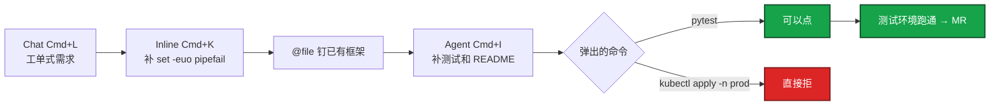
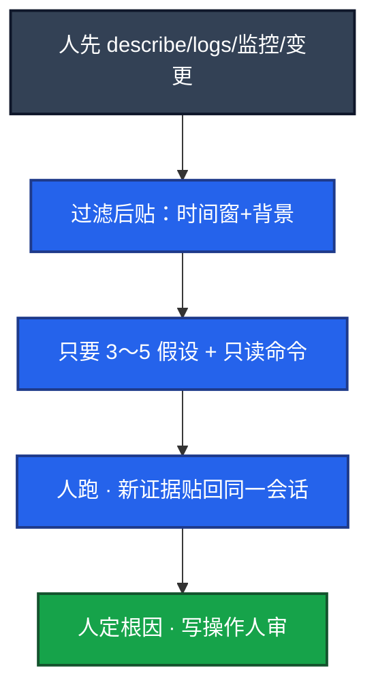

# 07｜AI 工具实战与 Vibe Coding · 练习题

先对照 [知识点](知识点.md) **面试怎么考** 自己口述，再对答案。每题标了覆盖范围：

| 标记 | 含义 |
|------|------|
| **核心** | 不懂整章就没建立起来 |
| **必会** | 值班和面试都要能讲 |
| **常用** | 线上会反复碰到 |
| **常考** | 白板和追问的高频口径 |

## 本题目录

- [Q1 Vibe Coding 完整例子](#q1)
- [Q2 Cursor 键位与选型](#q2)
- [Q3 故事 A 巡检脚本](#q3)
- [Q4 故事 B Claude Code](#q4)
- [Q5 故事 C 排障](#q5)
- [Q6 什么不能交](#q6)
- [Q7 脚本 / YAML checklist](#q7)
- [Q8 文档与 RCA](#q8)
- [Q9 原则与效率怎么讲](#q9)
- [Q10 30 秒口述综合](#q10)
- [合上书](#合上书)

---

## Q1

**★★★★★｜怎么用 AI 提运维效率？讲一个完整例子。**

**覆盖**：核心 · 必会 · 常考
**对应**：知识点 §1 · §3.1 · §3.2

### 场景

开场就要具体例子，不要「我用 ChatGPT」。面试官追问：生成代码质量怎么保证？

### 完整解答

**一句话**：Vibe Coding 是说清意图→草稿→人 review→测试环境迭代；生产变更另走人审。

Vibe Coding：用自然语言描述意图，模型生成代码和配置，**人 review、改、跑测试、再迭代**。你从「每个字符手敲」转到「把需求说清楚 + 把结果验清楚」。它不是「不用懂」。看不懂生成的 Shell，就不能在生产用。

```
  1. 描述：遍历 Deployment，找无 limits / 副本为 0，输出 ns/name/问题，支持 --namespace
  2. 生成初版
  3. Review：错误处理、无硬编码、kubeconfig 加载
  4. 迭代：加 --dry-run、--output json、verbose
  5. 测试环境跑通再合入
```

以前手写两小时的模板活，现在半小时到一小时，时间花在验收。进流程顺序：写代码 → 只读排障 → 文档 → 自动执行（默认禁止）。效率在重复劳动，不在替你承担变更责任。

Checklist 验收：`set -euo pipefail`、引号、dry-run、无密钥、幂等、对照官方 API。踩过的坑：Shell 作用域/引号、过时 Python 参数、旧 K8s 字段。

### 再追问

Vibe Coding 就是不用懂代码吗？——错。看不懂就不能合入，等于把生产交给幻觉。

---

## Q2

**★★★★★｜Cursor 怎么用？和 Copilot 怎么选？**

**覆盖**：核心 · 必会 · 常考
**对应**：知识点 §3.1 · §5

### 场景

「你日常编码助手是哪个？」有人站队吵架。另有人 Agent 模式直接 apply 生产。

### 完整解答

**一句话**：按形态选 Cursor/Copilot/终端 Agent；规则锁生成，白名单才挡执行，Agent 禁 apply prod。

| 工具 | 形态 | 运维怎么用 |
|------|------|------------|
| Cursor | AI-first 编辑器，能吃多文件 | 写巡检工具、改一仓库脚本 |
| VS Code + Copilot | 补全 + Chat 插件 | 零散脚本、模板补全 |
| Claude Code / Codex | 终端 Agent，读代码、批量改 | 跨 10 个文件的机械改动 |
| 网页 ChatGPT | 语法草稿 | 敏感内容不要走公网 |

Cursor：Cmd+L Chat，Cmd+K 改选中段，Cmd+I 多文件 Agent，`@file` 钉上下文。复杂小工具仓库用 Cursor；零散补全用 Copilot。都是界面，背后仍要选模型、管出域、禁止 Agent 自动 apply 生产。

`.cursorrules` 底稿：Shell `set -euo pipefail`、Python 有日志、YAML 有 limits、生产脚本 dry-run、密钥走环境变量、不生成直接改生产的命令。**规则锁生成，白名单才挡执行。**

Agent 模式：关自动执行或命令白名单。本地 `pytest` 可以，`kubectl apply -n prod` 不行。仓库里不要放生产 kubeconfig；能被 Agent 读到就先挪走。MCP 只连只读 Server（05）。Cline 等带终端执行的更危险。

### 再追问

Chat / Inline / Agent 眼睛看到什么不同？——Chat 出新文件草稿；Inline 只改选中那段；Agent 列将改文件和将跑命令，等人点。没有点确认就 apply 是配置错误，不是功能。

---

## Q3

**★★★★★｜故事 A：开服前夜用 Cursor 交出大厅限流巡检。按键讲一遍。**

**覆盖**：核心 · 必会 · 常考
**对应**：知识点 §4.1

### 场景

活动前要巡检：hosts、`systemctl is-active nginx`、超时 3s、并发 10、失败写 `failed.txt`、dry-run。仓库有旧框架，还有一份 prod kubeconfig。

### 完整解答

**一句话**：故事 A 用 Cmd+L/K/I 迭代巡检脚本，pytest 可点、kubectl apply prod 直接拒。



1. Chat（Cmd+L）贴工单式需求，含 `set -euo pipefail`、dry-run 开关。
2. Inline（Cmd+K）改漏掉的引号和 `set -euo pipefail`。
3. `@file` 钉住已有巡检框架，少另起风格。
4. Agent（Cmd+I）补测试和 README。弹 pytest 可点；弹 `kubectl apply -n prod` **直接拒**。
5. 测试环境跑通再提 MR。生产变更另走人审，不在 Cursor 会话里完成。
6. prod kubeconfig 先挪走或 ignore。

生成稿开头要有 `set -euo pipefail`；`--dry-run` 默认开；没有写死密码。同一会话迭代。

### 再追问

为什么第一轮不把所有需求堆进去？——先拿到能跑的骨架再加选项，比一次完美稿容易验收。迭代是工作方式，不是失败。

---

## Q4

**★★★★☆｜故事 B：Claude Code / 终端 Agent 给 10 个脚本补 dry-run。**

**覆盖**：必会 · 常用
**对应**：知识点 §4.2

### 场景

仓库里改 10 个脚本并跑测试。有人让 Agent 自动 push 主分支。流水线重试会把「清理」跑两遍。

### 完整解答

**一句话**：终端 Agent 适合批量改仓和跑测试；可看 diff 和本地 commit，不要自动 push 主分支。

终端 Agent（Codex / Claude Code / Aider）适合在 repo 里改文件、跑测试、和 git 集成。与 Cursor 分工：结构思考在 Chat，批量改文件用终端 Agent，提交前自己看 diff。

人必须看到：统一 `--dry-run`、默认开、幂等；diff 里有没有幻觉路径 / 把 kubeconfig 写进脚本。可以本地 commit，消息和 diff 人要看。**不要自动 push 主分支。** 生产凭证不进会话。敏感仓优先自托管、不出公网。

讲的时候要有一次拒绝和一处幻觉被你改掉——「10 个脚本、统一 dry-run、我拒了自动 push、diff 里修了两处把 `rm -rf` 写死路径的幻觉」。没有 diff、没有拒绝，就像没做过。

### 再追问

幂等为什么重要？——流水线会重试。删两次、加两次防火墙规则，本身就是事故。

---

## Q5

**★★★★★｜故事 C：发版 v1.2.3 后三分钟 OOM，怎么用 AI 辅助而不是让它指挥？**

**覆盖**：核心 · 必会 · 常用
**对应**：知识点 §4.3 · §6.3

### 场景

有人先问「出问题了怎么办」。另有人把 200MB 日志和玩家 UID 丢进网页对话框，并准备敲模型给的 delete。

### 完整解答

**一句话**：排障先人收证据再贴过滤材料；模型只给假设和只读命令，写操作人审。



1. 人先 `kubectl describe po gw-1`、截故障前后 5 分钟、记下刚发的 v1.2.3。
2. Chat 里指定输出：3～5 个假设，每个配一条只读验证命令，不要写操作。
3. 人跑 get / describe / logs / PromQL，把新证据贴回**同一会话**。
4. 「上次怎么收」走 RAG / @手册（03），不要闭卷。
5. GPU 贴 `nvidia-smi` 和排队，不要删 Deployment（08）。

「可能是泄漏」是待证假说。delete/apply/scale 不在自动路径。贴日志：时间范围、背景、先 grep、指定格式。超长走切分或 RAG。监控优先贴数字，截图可能出域。不要换成「Agent 你自己 kubectl」。

### 再追问

UID / kubeconfig 贴进网页？——已经出域，走安全事件，不是「下次注意」。内网本地模型仍要脱敏。

---

## Q6

**★★★★★｜哪些事明确不能交给模型？**

**覆盖**：必会 · 常考
**对应**：知识点 §7 · §8

### 场景

同事把 kubeconfig 和一段玩家 UID 日志贴进网页对话框，并把模型给的 delete 敲了生产。

### 完整解答

**一句话**：生产命令、密钥出域、无监督改配置和当唯一审计，明确不能交给模型。

| 不能 | 原因 |
|------|------|
| 直接执行生产命令 | 幻觉 flag / 错误 ns |
| 玩家数据、密钥、完整 kubeconfig 出域 | 合规；网页历史 = 已出域 |
| 无监督 Agent 改生产配置 | 不可控变更 |
| 当唯一安全审计 | 漏报 |
| 替代测试和官方文档 | 过时 API、错的默认值 |
| 200MB 日志整文件丢进去 | 窗口爆、胡猜 |

进流程顺序：写代码 → 只读排障 → 文档草稿 → 自动执行（默认禁止）。告警摘要、错误检索、GPU 排障都可以出草稿，都不能直接改集群。AI 是助手不是决策者。

### 再追问

内网本地模型就可以贴玩家表吗？——仍要最小必要和脱敏。落盘、越权、截图外传都还在。

---

## Q7

**★★★★☆｜AI 写的 Shell / YAML 上线前 checklist？现场写一版巡检 prompt。**

**覆盖**：必会 · 常用
**对应**：知识点 §6.1

### 场景

脚本在个人机器能跑，生产路径有空格，变量没加引号。另一次要展示你会下规格。

### 完整解答

**一句话**：脚本上线前 checklist 含 set -euo pipefail、引号、dry-run 和 limits；巡检 prompt 像工单分轮迭代。

Checklist 七条：

1. `set -euo pipefail` 或语言等价物
2. 变量加引号
3. 失败有提示，不静默
4. 无硬编码密码和机器路径
5. 幂等：跑两遍别删两次
6. 生产必须有 dry-run
7. 关键外部 API 对照官方文档

`kubectl --dry-run=client` 再对照规范。让模型「找这份 YAML 的生产问题」往往比从零生成更有值。GPU 探针 delay 必须大于权重加载（08），人要改。

巡检 prompt 第一轮：遍历所有 ns 的 Deployment；无 limits、副本为 0；输出 `ns/deploy/container/问题`；`--namespace`；API 不可达友好错误；官方客户端。第二轮：`--dry-run`、`--output json`、`--verbose`。Review：依赖、kubeconfig 来源、连接失败、输出格式、**巡检不应写**。

Deployment 工单示例：镜像 game-server:v1.2.3，副本 3，CPU/内存 limits，HTTP /health，terminationGracePeriodSeconds 60，HPA、PDB、反亲和。**不要包含会立刻 apply 到生产的命令。**

### 再追问

YAML 为什么常让模型找问题而不是从零生成？——模型不一定知道你们的加载要几分钟、旧字段写法；找问题 + 人改更稳。

---

## Q8

**★★★★☆｜文档和 RCA 怎么用 AI 而不把幻觉写进 wiki？**

**覆盖**：必会 · 常用
**对应**：知识点 §6.2

### 场景

模型补了没发生过的回滚时间，进了复盘页。GPU Runbook 写「先删业务 Deployment」。

### 完整解答

**一句话**：RCA 只给已确认时间线，未知标待补充，wiki 草稿人过，不能自动发群。

RCA：给时间线和已确认根因，让它按影响 / 时间线 / 根因 / 止血 / 改进项写；未知标「待补充」，禁止编造时间点。告警摘要可以当时间线原料，不能当已确认根因。人核时间戳。

Runbook：前置检查、步骤、验证、回滚。生成后第一件事：测试环境按步骤走一遍，验证回滚段是真能执行的命令。过期页要下架，否则污染 RAG（03）。GPU Runbook 人审改成「先 nvidia-smi、先 cordon」。

玩家通告：不写内部组件名，只写影响和补偿口径，法务/运营过目。架构说明：组件列表你提供，它排段落，你对图。文档幻觉会进 wiki 变成「现行 SOP」。草稿必须人过。

### 再追问

能自动发群吗？——不能。通告和 RCA 都要人核。

---

## Q9

**★★★★☆｜Vibe Coding 三条原则？效率数字怎么讲才像真的？排障分流？**

**覆盖**：必会 · 常用 · 常考
**对应**：知识点 §3.2 · §7

### 场景

「心得」题。吹 10 倍容易露馅。另四个现场：出域、已 apply、Shell 幻觉、RCA 编时间。

### 完整解答

**一句话**：Prompt 当工单、迭代不赌第一稿、人验证；已出域当安全事件，已 apply 先回滚关自动执行。

三条原则：

1. Prompt 当工单：格式、约束、边界写清。
2. 迭代，不幻想第一稿完美。
3. 模型生成，人验证；生产相关清单比信任重要。

效率讲「重复模板从两小时到半小时，时间在 review 和测试」。不讲「AI 替我值班 / 10 倍」。进团队靠 **模板化 prompt + review 清单**，不是靠每个人会聊天。

| 翻车 | 先做什么 |
|------|----------|
| 已出域（UID/kubeconfig/未脱敏日志） | 安全事件 |
| Agent 已 apply / delete | 变更回滚 + 关自动执行 + 查白名单 |
| Shell/YAML 草稿 | checklist + dry-run + 对照官方文档 |
| RCA/Runbook 胡编 | 人核时间戳 + 测试走回滚段 |
| 排障胡猜 | 人先收证据 + 只要只读命令 + 同一会话 |

### 再追问

规则文件能挡住执行吗？——不能。规则锁生成；白名单才挡执行。两者都要。

---

## Q10

**★★★★★｜30 秒 + 2 分钟：Vibe Coding 怎么讲才像做过？**

**覆盖**：必会 · 常考
**对应**：知识点 §4 · §8

### 场景

面试官：「你怎么用 Cursor 提效？有没有踩坑？」

### 完整解答

**一句话**：按故事 A 讲巡检脚本从工单到 MR，强调一次拒 apply prod 和 checklist 验收。

**30 秒**：「开服前夜用 Cursor 写大厅限流巡检。Cmd+L 贴工单：hosts、超时 3s、并发 10、dry-run。`@file` 钉旧框架，Agent 补测试。弹 pytest 我点了，弹 kubectl apply prod 我拒了。测试环境跑通再 MR，生产变更不在会话里完成。」

**2 分钟**：补故事 B（10 脚本 dry-run、看 diff、不 auto push）或故事 C（OOM 先收证据、只要只读命令、UID 出域是安全事件）。三条原则、七条 checklist、规则 vs 白名单。效率讲半小时验收，不讲 10 倍。进流程顺序写代码 > 只读排障 > 文档 > 自动执行禁止。

### 再追问

Cursor 和 Copilot 必须站队吗？——按形态选，别争信仰。多文件小工具 Cursor，行内补全 Copilot，都可以。

---

## 合上书

1. Vibe Coding 的闭环是什么？人负责哪两头？自动执行默认准不准？
2. 故事 A：Cmd+L / K / I / `@file` 各干什么？弹 apply prod 怎么处理？kubeconfig 呢？
3. 故事 B：10 个脚本补 dry-run，人和终端 Agent 怎么分工？能不能自动 push 主分支？
4. 故事 C：发版 OOM 的五步顺序？「可能是泄漏」是什么？UID 贴进网页算什么？
5. 脚本 checklist 七条是哪七条？YAML 为什么常让模型找问题而不是从零生成？
6. 什么绝不能交给模型？文档幻觉进 wiki 怎么防？
7. 30 秒怎么讲 Vibe Coding 才像做过？

---

**上一章**：[06 Agent 智能体](../06-Agent智能体/练习题.md) · **下一章**：[08 GPU 与推理服务运维](../08-GPU与推理服务运维/练习题.md)
