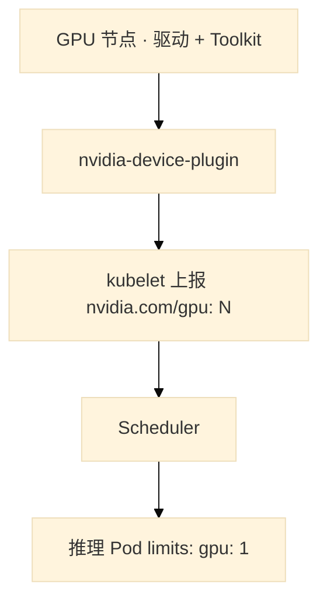
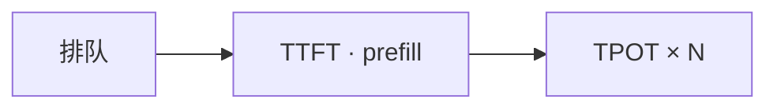
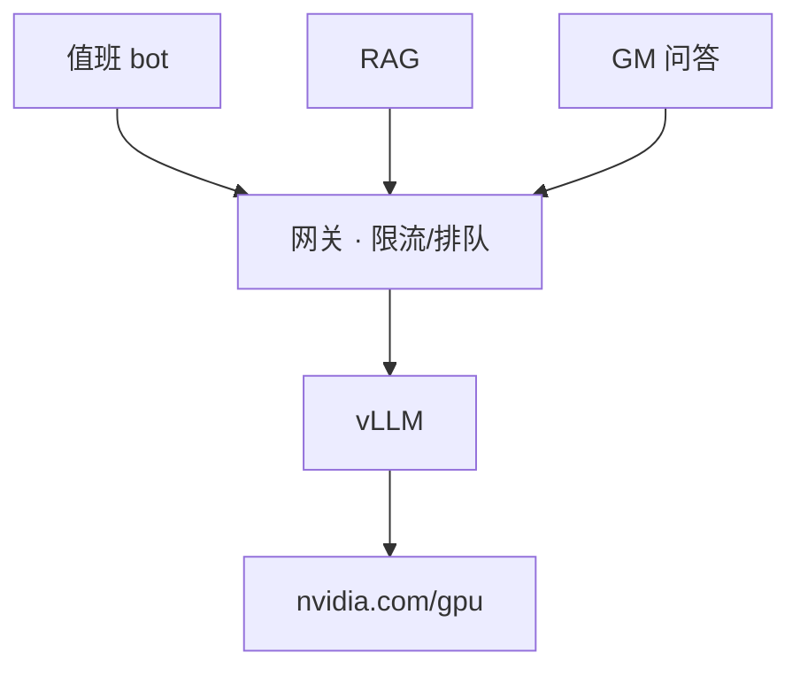
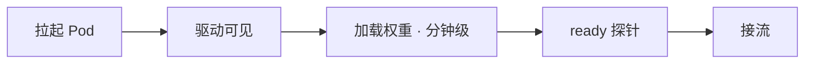
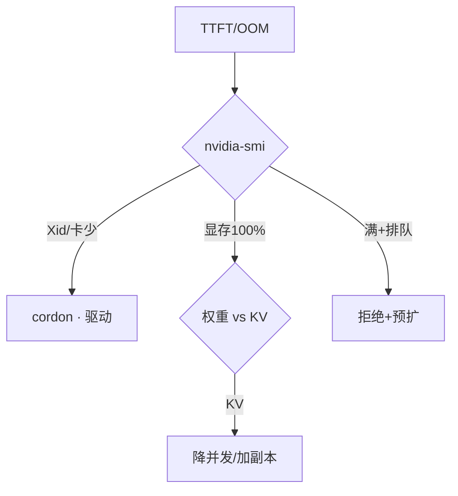

# 08｜GPU 与推理服务运维

活动日 20:05，群里三条线同时炸：告警摘要 bot「半天不吐字」、RAG 检索慢、GM 问答超时。有人要删大厅 Deployment「腾 GPU」——卡根本不在普通池；有人 `kubectl delete pod` 全重启推理，权重重新加载三分钟，TTFT 从 300ms 飙到 8s。**推理服务不是拷模型文件**，是调度、显存账、延迟拆解、引擎选型。

> **加分项定位**：面试测「懂不懂推理服务不是拷模型文件」——调度、显存账、延迟拆解、引擎选型。  
> **红线**：删大厅腾不出 GPU；HPA 不能按 CPU 扩推理；Ollama 不扛活动峰值；权重钉版本禁 latest；**先 nvidia-smi，别先删业务**。

---

## 面试怎么考

| 频率 | 典型问法 | 30 秒要点 | 2 分钟要点 |
|:----:|----------|-----------|------------|
| ★★★★★ | K8s 怎么调度 GPU？ | Device Plugin 报 `nvidia.com/gpu`；整数卡或 MIG；独立池+taint | 不能像 CPU 写 0.3 卡；Scheduler 绑带 GPU 请求的 Pod；训练/推理分池 |
| ★★★★★ | 推理 OOM 怎么查？ | 显存≈权重+KV(并发×长度)；一放量就 OOM 常是 KV | 7B FP16≈14GB；72B≈144GB 仅权重；降并发/限长度/加副本；量化先质量回归 |
| ★★★★★ | TTFT / TPOT / 排队怎么拆？ | 排队等 GPU；TTFT 含 prefill；TPOT×输出 token | 先看网关队列；GPU 满+排队=真过载；流式不降低真实 TTFT |
| ★★★★ | vLLM 和 Ollama 怎么选？ | Ollama 试模型；活动 SLA 用 vLLM | continuous batching、PagedAttention、K8s 探针限流；Ollama 不按峰值设计 |
| ★★★★ | 推理 HPA 有什么坑？ | 看排队/GPU/显存；min≠0；probe delay>加载时间 | 按 CPU 扩无效；从 0 扩=自杀；新副本预热分钟级 |
| ★★★ | Xid 掉卡怎么办？ | cordon 节点；查驱动硬件；反亲和扛流量 | 删 Pod 没用；大厅不在 GPU 池 |

---

## SRE 边界

| 该用 | 禁止 |
|------|------|
| 独立 GPU 节点池 + taint；训练/推理再分池 | 普通大厅 Pod 调度到带卡机「只吃 CPU」 |
| 整数 `nvidia.com/gpu` 或 MIG 实例 | 无隔离 time-slicing 扛活动在线 |
| 活动峰值 **vLLM**（或 TGI 等生产引擎） | Ollama 原样接活动流量 |
| HPA：排队 / GPU 利用率 / 显存；**minReplicas ≥ 1** | HPA min=0；按 CPU 扩推理 |
| 探针 delay **大于**权重加载时间 | 只探进程端口 |
| 过载 **拒绝**新请求 + 小模型降级 | 无限排队拖死全体 |
| 权重/量化/上下文 **钉 hash**，禁 latest | PVC 静默换权重文件 |
| 活动前预扩 + 提前要 quota | 活动日现场买卡 |
| Spot 给可中断训练/离线批 | 活动日在线推理用 Spot |

---

## 原理讲透

### 3.1 K8s GPU 调度：Device Plugin 把卡报成可调度资源

**一句话**：NVIDIA Device Plugin 把 GPU 暴露成 `nvidia.com/gpu`；Scheduler 只给申请了 GPU 且能容忍污点的 Pod 绑到 GPU 节点。

**打个比方**：GPU 节点像「带专用工位的车间」——普通员工（大厅 Pod）进不来，除非你有工位预约单（`limits.nvidia.com/gpu`）和通行证（toleration）。

**现场走一遍**（新推理 Pod Pending）：

1. `kubectl describe pod vllm-0 -n ai` 看 Events：

```text
Warning  FailedScheduling  0/12 nodes available: 3 Insufficient nvidia.com/gpu
```

2. 查 GPU 节点资源：

```bash
kubectl describe node gpu-node-01 | grep -A2 nvidia.com/gpu
```

3. 屏幕：

```text
Capacity:
  nvidia.com/gpu:     8
Allocatable:
  nvidia.com/gpu:     8
```

4. 若 Allocatable 是 0 → Device Plugin 或驱动问题，不是「多申请 0.3 卡」能救。
5. 确认 Pod spec 有 `tolerations` 对应 `nvidia.com/gpu=true:NoSchedule`，`limits.nvidia.com/gpu: 1`（整数）。

**输出解读**：

| Events / describe 字段 | 说明 | 下一步 |
|------------------------|------|--------|
| Insufficient nvidia.com/gpu | 卡被占满或没上报 | `nvidia-smi` 看谁占；扩池或等释放 |
| Allocatable: 0 | Plugin/驱动挂了 | 查 DaemonSet、驱动版本 |
| 没 toleration | 普通调度进不了 GPU 池 | 加 toleration，别删大厅 |

**面试怎么说**：「GPU 经 nvidia-device-plugin 上报 nvidia.com/gpu；独立池+taint；整数卡或 MIG；不能像 CPU 写 0.3；删大厅腾不出卡。」



| 共享方式 | 隔离 | 生产在线 |
|----------|------|----------|
| **整卡独占** | 强 | 大模型默认 |
| **MIG** | 硬件切分 | 小模型多租 |
| **Time-slicing** | **无** | 仅开发测试 |

> **记住**：训练/推理分池；time-slicing 两进程互相 OOM，不能扛活动。

---

### 3.2 显存账：权重 + KV + 碎片，一放量就炸常是 KV

**一句话**：显存 ≈ 权重 + KV cache（并发×长度）+ 碎片；一放量 OOM 常不是「模型太大」。

**打个比方**：显存像酒店房间——床（权重）占固定面积；每来一个客人（并发）还要加床（KV）；50 个客人各带超大行李箱（长上下文），比换小床（量化权重）更先爆房。

**现场走一遍**（7B 模型平时稳，活动一放量 OOM）：

1. 故障 Pod 日志：

```bash
kubectl logs vllm-0 -n ai --tail=50 | grep -i oom
```

2. 屏幕：

```text
CUDA out of memory. Tried to allocate 512.00 MiB for KV cache
```

3. 同节点 `nvidia-smi`：

```text
|   0  NVIDIA A100 ...  |
|  78%   78500MiB / 81920MiB |  python3 (vllm)
```

4. **心算**：7B FP16 权重 ≈ 14GB；显存 78GB 已用 → 大头是 **KV**（并发×上下文），不是权重装不下。
5. 对策顺序：降 `max_num_seqs` / 限 `max_tokens` → 加副本分流 → 再考虑 INT8/INT4（**先质量回归**）。

**输出解读**：

| 日志关键词 | 更像什么 | 第一刀 |
|------------|----------|--------|
| `failed to load weights` | 权重装不下 | 量化/多卡/换小模型 |
| `KV cache` / 一放量就炸 | 并发×长度 | 降并发、限长、加副本 |
| 显存 100%、利用率也 100% | 真算力+显存双满 | 限流拒绝 + 预扩 |
| RAG 塞 50 条进窗口 | KV+窗口双爆 | Top 3~5 进模型（03） |

**面试怎么说**：「显存三块：7B FP16 约 14GB，72B 约 144GB 仅权重；KV 随并发和上下文涨；OOM 先分权重还是 KV；PagedAttention 减碎片不是无限。」

```
显存 ≈ 权重 + KV cache + 激活/碎片
FP16 = 2B/参数 → 7B≈14GB，72B≈144GB
```

---

### 3.3 延迟拆解：排队、TTFT、TPOT 三段，别混为一谈

**一句话**：先拆三段时间，再决定加卡、限流还是修 tokenizer。

**打个比方**：餐厅等位——排队（等桌）、上第一道菜多久（TTFT）、每道菜间隔（TPOT）；客人抱怨「半天没吃上」可能是还在门口排队，不是厨师慢。

**现场走一遍**（TTFT 300ms → 8s）：

1. 网关 metrics：`inference_queue_depth=847`，持续涨。
2. `nvidia-smi`：

```text
GPU-Util: 98%  Memory-Usage: 81000/81920 MiB
```

3. 对同一请求看引擎 trace：排队 6.2s + prefill 1.1s + 首 token 后 TPOT 45ms。
4. **做差**：8s 总延迟里 **排队占 6.2s** → 容量问题，不是「模型变笨了」。
5. 若 GPU 利用率 20% 但 queue 涨 → 查网关/tokenizer/拼批，不是加卡。

**输出解读**：

| 段 | 怎么量 | 高了怎么办 |
|----|--------|------------|
| **排队** | 网关 queue depth | 限流拒绝、预扩、加副本 |
| **TTFT** | 首 token 时间（含 prefill） | 权重加载、batch、上下文太长 |
| **TPOT** | 每输出 token | 算力满、量化、降输出长度 |
| **流式** | 感知变好 | **真实 TTFT 不变**，别当优化完成 |

**面试怎么说**：「延迟拆排队、TTFT、TPOT；先看网关队列和 nvidia-smi；GPU 满+排队=真过载；流式只改善感知。」



---

### 3.4 vLLM vs Ollama：试模型 vs 扛 SLA

**一句话**：Ollama 试 prompt/试模型；活动峰值 SLA 用 vLLM 或同类生产引擎。

**打个比方**：Ollama 像家用电磁炉试菜谱；vLLM 像中央厨房流水线——continuous batching 动态拼桌，PagedAttention 像灵活拼房，扛活动峰值。

**现场走一遍**（选型决策）：

1. **办公机**试新 prompt → `ollama run qwen2.5:7b`，改 temperature、看输出格式。**不进活动链路**。
2. **活动内网 Copilot** → vLLM Deployment：`--max-num-seqs`、网关限流、探针 `initialDelaySeconds: 180`（权重加载 2 分钟）。
3. 压测对比：Ollama 50 并发 P99 TTFT **12s**；vLLM continuous batching P99 **1.2s**（同卡同模型）。
4. 路由：告警摘要 → 小模型 + 短 JSON；GM 长问答 → 大模型——全打 70B 会挤爆池子。

**输出解读**：

| 指标 | Ollama 活动日 | vLLM 生产 |
|------|---------------|-----------|
| continuous batching | 弱 | 核心能力 |
| K8s 探针/限流 | 需自己包 | 常规落地 |
| 权重版本 | 容易 latest | **钉 artifact hash** |
| 适用 | 试模型、离线小工具 | 在线 SLA |

**面试怎么说**：「Ollama 试 prompt 不进活动；vLLM 用 continuous batching 和 PagedAttention；权重钉 hash 禁 latest；短请求路由小模型。」

---

### 3.5 架构全链路：网关是水龙头，GPU 是水箱

**一句话**：客户端 → 网关（鉴权限流排队）→ GPU 池引擎 → 权重+KV 在显存。

**打个比方**：自来水厂——用户龙头（客户端）→ 水表阀门（网关限流）→ 加压泵（vLLM）→ 蓄水池（显存）。Agent 循环（06）像很多人同时开龙头，没限流会把池子抽干。

**现场走一遍**（三条业务打满推理）：

1. 监控面板：bot、RAG、GM 三条线 **共用一个网关** `inference-gw`。
2. `kubectl get deploy -n ai`：vLLM replicas=3，HPA max=6。
3. Agent 值班 bot（06）`max_steps=12` 每步调一次推理 → QPS 叠加。
4. 网关配置：`max_queue=500`，`reject_http_code=429`——超额**拒绝**，不无限排队。
5. TTFT 报警时：先查 **哪条业务** 占队列（按 route label），再决定限流还是扩副本。

**输出解读**：

| 观测点 | 正常 | 异常 |
|--------|------|------|
| 网关 queue + 429 率 | 高峰有拒绝、服务存活 | 无拒绝、全超时 = 排队拖死 |
| 按 route 分 QPS | 可路由降级 | 全打大模型 |
| Agent 调用频率 | 与限流同级 | 打满网关 |

**面试怎么说**：「全链路经网关鉴权限流排队；多业务共池要路由降本；Agent 循环和 GPU 队列同一等级要限流。」



---

### 3.6 HPA 与扩容：像游戏服预热，不像 CPU 服务

**一句话**：看排队和水位；新副本预热加载权重分钟级；min≠0；probe delay > 加载时间。

**打个比方**：游戏开新服——不是 Pod Running 就能接玩家，要等资源下完、网关验活；HPA 按 CPU 扩推理像看着停车场空着就加出口，其实里面车还没造好。

**现场走一遍**（HPA 加了副本但 TTFT 更差）：

1. `kubectl get hpa -n ai`：

```text
NAME        REFERENCE          TARGETS   MINPODS   MAXPODS   REPLICAS
vllm-hpa    Deployment/vllm    45%/70%   2         6         4
```

2. 新 Pod `vllm-3`：Running 但 **未 Ready**——`readinessProbe` 失败。
3. `kubectl describe pod vllm-3`：

```text
Readiness probe failed: connection refused :8000
Events: Started container 30s ago
```

4. `initialDelaySeconds: 30`，权重加载要 **120s** → 半加载实例曾被 Service 放过，或探活只查端口进程在、权重未就绪。
5. 修法：`initialDelaySeconds: 180` + 真实推理探针；`minReplicas: 2`；HPA 信号改 **queue depth**，不是 CPU。

**输出解读**：

| HPA/探针配置 | 后果 |
|--------------|------|
| 按 CPU 扩 | GPU 100%、CPU 低，扩不动或扩了没用 |
| minReplicas=0 | 从 0 扩 = 冷启动自杀 |
| probe delay < 加载 | 半加载接流，TTFT 爆炸 |
| 只探 `:8000` 端口 | 进程在、权重空 |

**面试怎么说**：「HPA 看排队/GPU/显存，不按 CPU；min≥1；probe delay 大于权重加载分钟级；活动前预扩 quota。」



---

### 3.7 值班第一刀：nvidia-smi，不是删 Deployment

**一句话**：TTFT 炸 / OOM / NotReady，第一刀永远是 `nvidia-smi`，不是删大厅 Deployment。

**打个比方**：车抛锚先查油表和故障灯，不是先把后备箱行李扔了——删大厅 Deployment 腾不出 GPU，就像扔行李加不了油。

**现场走一遍**（P0：推理全慢）：

1. **第一刀**（30 秒内）：

```bash
nvidia-smi -L
nvidia-smi
kubectl describe node gpu-node-01 | grep -E 'nvidia|Xid|Ready'
```

2. 屏幕 A（真过载）：

```text
GPU-Util: 99%  Memory: 81000/81920 MiB
```

→ 限流 + 查 queue + 预扩，**不**无脑 delete 所有 Pod。

3. 屏幕 B（掉卡）：

```text
GPU 2: Unable to determine the device handle
Xid: 79, GPU has fallen off the bus
```

→ `kubectl cordon gpu-node-01`；查驱动/硬件；反亲和扛流量。

4. 屏幕 C（Pending）：

```text
Allocatable nvidia.com/gpu: 0
```

→ Device Plugin / 驱动，不是删业务 Pod。

**输出解读**：

| nvidia-smi 画面 | 定责 | 别做 |
|-----------------|------|------|
| 显存 100% + KV 日志 | 降并发/加副本 | 只重量化不管并发 |
| Xid / 卡数少 | 硬件 cordon | delete Pod 指望自愈 |
| Util 低 + queue 高 | 网关/tokenizer | 盲目加卡 |
| 全 Pod 重启后 TTFT 再炸 | 冷启动加载 | 「重启救命」 |

**面试怎么说**：「TTFT/OOM 先 nvidia-smi 和 queue；Xid cordon 查硬件；删大厅腾不出 GPU；过载拒绝不无限排队。」



---

## 落地场景

### 场景 1：活动日 TTFT 300ms → 8s

**背景**：告警摘要 bot、RAG、GM 问答同时打满推理网关。

**五刀顺序**：

1. 网关排队长度 → 有队先限流拒绝超额
2. `nvidia-smi` 利用率 → 满则真过载；不满查 tokenizer/拼批
3. 显存 → KV 还是权重
4. 卡数/Xid/温度 → 掉卡 cordon
5. 新副本是否半加载接流 → 查 probe delay

**不要**：删大厅 Deployment；无脑重启所有推理 Pod（重新加载又分钟级 TTFT 再炸）。

### 场景 2：K8s 新上 GPU 推理池

**背景**：内网 Copilot 要上 vLLM，活动前两周。

**做法**：

1. 独立 GPU 节点池 + taint + Device Plugin
2. vLLM Deployment：`nvidia.com/gpu: 1`，反亲和，priorityClass
3. 探针：真实推理或引擎 ready；**initialDelaySeconds > 权重加载时间**
4. HPA：minReplicas=2，信号排队/GPU；活动前预扩
5. 权重 artifact 钉 hash；网关限流 + max_tokens
6. Ollama 留在办公机试 prompt，不进活动链路

**验收**：金丝雀看 TTFT P99 + 质量；Spot 不给在线池。

---

## 口述模板

### 【30 秒】

「推理服务是 Device Plugin 报 nvidia.com/gpu，独立池+taint，整数卡或 MIG。显存=权重+KV，一放量 OOM 常是并发×长度。延迟拆排队、TTFT、TPOT，先看网关队列和 nvidia-smi。Ollama 试模型，活动用 vLLM。HPA 看排队/GPU，min 不能 0，探针 delay 大于加载时间。TTFT 炸先 nvidia-smi，别删大厅。」

### 【2 分钟】

「K8s 里 GPU 经 nvidia-device-plugin 暴露，Scheduler 绑带 GPU 请求和 toleration 的 Pod。训练推理分池，time-slicing 无隔离不能扛活动。显存三块：7B FP16 约 14GB，72B 约 144GB 仅权重，KV 随并发和上下文涨，PagedAttention 减碎片不是无限。TTFT 含 prefill，TPOT 是逐 token，流式不降低真实 TTFT。vLLM 用 continuous batching 扛在线；Ollama 试 prompt 不进活动链路。扩容像游戏服：预热分钟级，HPA 不按 CPU，min≥1，活动前预扩 quota。权重钉 hash 禁 latest。Xid 掉卡 cordon 查硬件，删 Pod 没用。过载拒绝而不是无限排队，短请求路由小模型。」

### 【常见追问】

| 追问 | 答法 |
|------|------|
| 删大厅能腾 GPU 吗？ | 不能，卡不在普通池 |
| HPA 按 CPU 行吗？ | 不行，看排队/GPU/显存 |
| 量化一定能救 OOM 吗？ | 先分权重 vs KV |
| Spot 能省在线推理吗？ | 活动日不行，回收=掉服务 |
| Agent 和 GPU 队列关系？ | Agent 循环打满网关，要限流（06） |

---

## 必会 · 常考

### 对错表

| 说法 | 对错 | 纠正 |
|------|:----:|------|
| 推理 Pod 可申请 0.3 卡 | ✗ | 整数或 MIG |
| 普通业务可调 GPU 节点吃 CPU | ✗ | 独立池+taint |
| OOM 一定是模型太大 | ✗ | 常是 KV |
| HPA 按 CPU 扩推理 | ✗ | 排队/GPU/显存 |
| 删大厅腾 GPU | ✗ | 卡不在普通池 |
| Ollama 扛活动峰值 | ✗ | 试模型；生产 vLLM |
| 权重 latest / 静默换 PVC | ✗ | 钉 hash |
| 活动日在线用 Spot | ✗ | 回收=掉服务 |
| 只探进程端口够 | ✗ | 真推理；delay>加载 |
| HPA min=0 省钱 | ✗ | 从 0 扩自杀 |
| 利用率低=没问题 | ✗ | 队列可能在网关 |
| 流式降低真实 TTFT | ✗ | 只改善感知 |
| 重启所有推理 Pod 救命 | ✗ | 重新加载再炸 |

### 易混

| A | B | 区分 |
|---|---|------|
| 整卡 | MIG / time-slicing | 独占 vs 硬件切 vs 无隔离 |
| 权重 OOM | KV OOM | load failed vs 一放量就炸 |
| 排队 | GPU 满 | 网关 vs 算力 |
| Ollama | vLLM | 试 vs 生产 SLA |
| 预热探针 | 进程探活 | 权重加载完 vs 进程在 |
| Spot 训练 | Spot 在线 | 可中断 vs 不可 |

### 数字参考

| 项 | 参考值 |
|----|--------|
| 7B FP16 权重 | ≈ 14GB |
| 72B FP16 权重 | ≈ 144GB（还要 KV） |
| FP16/INT8/INT4 | 2B / 1B / ≈0.5B 每参数 |
| 权重加载 | 分钟级 |
| RAG 进模型 | Top 3~5 条，非 50 条 |
| GPU 利用率长期 20% | 超配信号 |

---

## 合上书，问自己

1. K8s GPU 调度和 CPU 差在哪？Device Plugin 报什么资源？
2. 显存三块是什么？7B/72B 怎么心算？KV OOM 怎么治？
3. 排队、TTFT、TPOT 各看什么？continuous batching 代价？
4. vLLM 和 Ollama 怎么选？为什么不能 latest？
5. HPA 有哪些坑？探针 delay 和 min=0 各会怎样？
6. TTFT 300ms→8s 五刀怎么拆？Xid 掉卡先干什么？

---

**本章不讲**：通用 K8s 调度污点 → [03-06 调度](../../03-Kubernetes/06-调度机制/)；节点 NotReady → [03-16 节点运行时](../../03-Kubernetes/16-节点运行时与升级/)；LLM 窗口 → [01](../01-LLM与Transformer基础/)；RAG 打推理 → [03](../03-RAG检索增强/)；Agent 步数 → [06](../06-Agent智能体/)；告警降噪 → [09](../09-AIOps落地/)。
