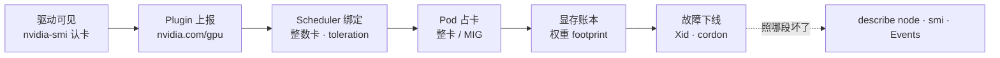
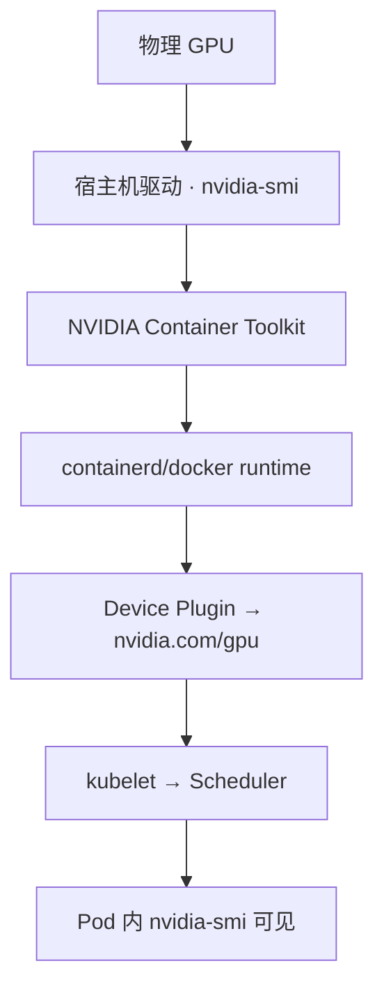
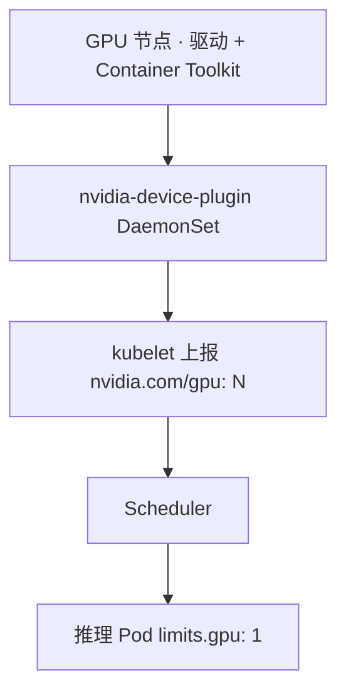
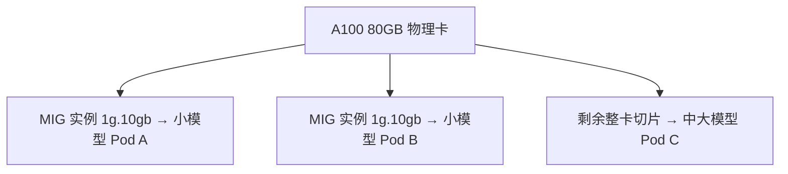
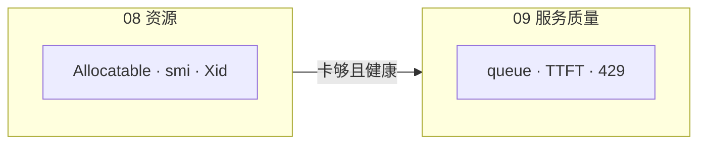
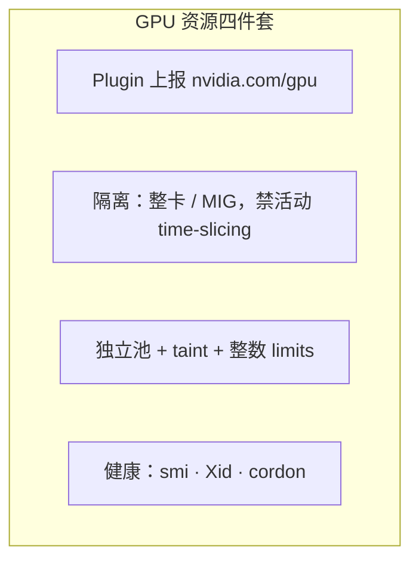
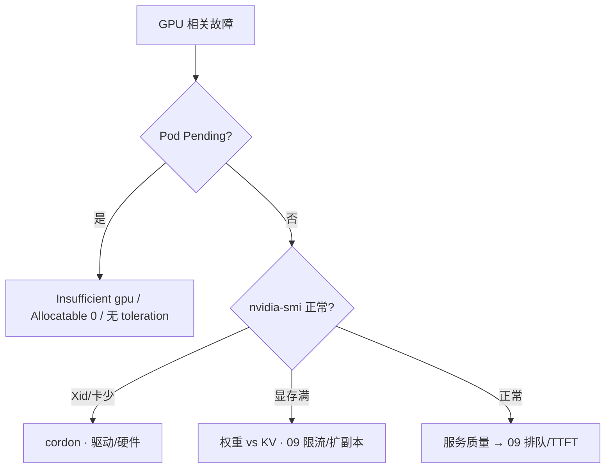

# GPU 资源与调度

> 大家好，欢迎来到这次分享。开讲之前，先带大家回到一个很多值班同学都经历过的现场：
> 活动日 20:05，有人要删大厅 Deployment「腾 GPU」——卡根本不在普通池；有人 `kubectl delete pod` 全重启推理，权重加载三分钟，TTFT 从 300ms 飙到 8s（服务质量在 [09](../09-推理服务性能与稳定性/) 讲）。
> 这一章讲完，你会知道卡怎么报、怎么分、坏了怎么办，以及哪些事该交给 09 章。
> **本章回答**：一块 GPU 资源从 **上报、分配、占用、隔离到故障下线** 的一生——显存账、MIG、K8s Device Plugin、Xid 各管哪段。
> **不讲**：TTFT/TPOT/排队/vLLM 服务质量 → [09](../09-推理服务性能与稳定性/)；通用 K8s 调度 → [03-06](../../03-Kubernetes/06-调度机制/)；节点 NotReady → [03-17](../../03-Kubernetes/17-节点运行时与升级/)。这些都有专门的章节，本章只在用到时点到为止。

**标记**：🎯重点 · 🔥难点 · ⭐常考 · 🔧实操

**怎么听这场分享**：咱们先看第一节 GPU 资源的一生，并钉死 **08 vs 09 边界**；后面按 Device Plugin、整卡/MIG、Pending、Xid 展开；作战节拆「删大厅腾 GPU」。骨架不动。每一节讲完都会提示对应练习题。

> **边界**：**08 只管资源与调度**（卡怎么分、怎么监控、坏了怎么办）；**09 管服务质量**（延迟指标、吞吐、打不动怎么办）。

### 本章与 09 分工：一张对照表 🎯⭐

| 你问的问题 | 归哪章 | 第一刀 |
|------------|--------|--------|
| Pod 为什么 Pending GPU？ | **08** | describe Events |
| Xid / 掉卡 | **08** | cordon |
| 7B 权重多少 GB？ | **08** | FP16 心算 |
| TTFT 为什么 8s？ | **09** | queue 拆解 |
| 要不要 429？ | **09** | max_queue |
| KV OOM 怎么办？ | **09** 限并发；**08** 加卡 | 先 09 降 max_num_seqs |
| MIG 怎么切？ | **08** | 硬件/profile |
| continuous batching？ | **09** | vLLM 参数 |

> ⚠️ **别混**：值班群说「GPU 还有空但很慢」——**08 看 smi 是否真空**；不空或 queue 涨是 **09**；两章 **联查**，不是二选一甩锅。

---

## 一、一张图：GPU 资源的一生

> 🎯 **一句话**：GPU 的一生六段——驱动可见、Plugin 上报、Scheduler 绑定、Pod 占卡、显存账本、故障下线——坏了先 `nvidia-smi`，别先删业务。

大家想想：活动日 GPU 不够，删大厅能腾卡吗？很多人会答「能，大厅也占 GPU」——**错了**。卡在独立池里，删普通池 Deployment 腾不出来。口诀：**「08 管卡，09 管慢」**。



**读图**：

- 主线是一块 GPU 从硬件到被 Pod 占用的资源链——**不是**「拷个模型文件就能推理」。
- 「Scheduler 绑定」段：不能像 CPU 写 0.3 卡；普通大厅 Pod 进不了 GPU 池。
- 延迟、排队、KV 打满后的 **服务质量** 在 09；本章只讲 **卡还在不在、分没分对、坏没坏**。


练习题 Q1、Q2、Q11。边界钉死——Device Plugin。

---

## 二、驱动可见：nvidia-smi 是第一刀

> 🎯 **一句话**：TTFT 炸 / Pod Pending / OOM 之前，先在节点上确认 **驱动认卡、无 Xid**——删大厅 Deployment **腾不出 GPU**。

```bash
nvidia-smi -L
# GPU 0: NVIDIA A100 80GB (UUID: GPU-xxx)  ← 卡数对不对

nvidia-smi
# GPU-Util: 98%  Memory-Usage: 78500/81920 MiB  ← 占用概况
# 若 "Unable to determine device handle" → Xid，见六节
```

> 💡 **打个比方**：GPU 节点像带专用工位的车间——普通员工（大厅 Pod）没有工位预约单（`limits.nvidia.com/gpu`）和通行证（toleration）进不来。

> ⚠️ **别混**：Util 高是 **算力忙**；Memory 高是 **显存满**——两者都高才是真过载；Util 低 Memory 满可能是 KV（09）。本章先看 **卡是否存在、是否被占满到不可用**。

### NVIDIA 软件栈：从驱动到容器内可见 🎯⭐

GPU 进 Pod 不是「挂个镜像就行」——整条链断了，Pod 里 `nvidia-smi` 也会失败。



**读图**：

- **宿主机** `nvidia-smi -L` 正常是前提——Pod 里看不到先查宿主机，不是改 Deployment。
- **Container Toolkit** 把 GPU 设备注入容器；缺它 Pod 启动报 `CUDA driver version insufficient` 或找不到设备。
- **Device Plugin** 把「有几张卡」报给 K8s——和 Toolkit 是不同层；Allocatable 0 查 Plugin，不是改 limits。

```bash
# 宿主机链验收
nvidia-smi -L
nvidia-container-cli info | head -20

# Pod 内（debug 容器或推理 Pod）
kubectl exec -n ai vllm-0 -- nvidia-smi -L
# 宿主机有卡、Pod 无 → Toolkit/runtime 配置

# 驱动 vs Plugin 版本对齐（常见 Pending/CrashLoop 根因）
kubectl logs -n kube-system -l name=nvidia-device-plugin-ds --tail=20 | grep -iE 'version|NVML'
```

| 症状 | 定责层 | 第一刀 |
|------|--------|--------|
| 宿主机 smi 失败 | 驱动/硬件 | dmesg Xid；cordon |
| 宿主机 OK、Pod 无卡 | Toolkit/runtime | nvidia-container-cli |
| Allocatable 0 | Device Plugin | DS logs |
| Pod Pending Insufficient | 调度/池 | describe Events |

> 📝 **面试**：GPU 节点排障 **从宿主机 smi 向外**——不是先 delete 推理 Pod。


练习题 Q1。上报通了，整卡/MIG/切片。

---

## 三、Plugin 上报：Device Plugin 把卡报成可调度资源

> 🎯 **一句话**：**NVIDIA Device Plugin** 把 GPU 暴露为 **`nvidia.com/gpu`**；Allocatable 为 0 是 Plugin/驱动问题，不是「多申请 0.3 卡」能救。



**读图**：Scheduler 只给 **申请了 GPU 且 toleration 匹配 GPU 节点 taint** 的 Pod 绑卡。训练/推理 **分池**，活动日在线不与训练抢 time-slicing。

Pod Pending 时：

```bash
kubectl describe pod vllm-0 -n ai | tail -20
# Warning  FailedScheduling  0/12 nodes: 3 Insufficient nvidia.com/gpu  ← 真没卡

kubectl describe node gpu-node-01 | grep -A2 nvidia.com/gpu
# Capacity/Allocatable: 8  ← 若是 0，查 Plugin DS，不是删大厅
```

| Events | 含义 | 第一刀 |
|--------|------|--------|
| Insufficient nvidia.com/gpu | 卡满或未上报 | smi 看谁占；扩池 |
| Allocatable: 0 | Plugin/驱动挂 | 查 DaemonSet、驱动版本 |
| 无 toleration | 进不了 GPU 池 | 加 toleration，别动大厅 |

> 📝 **面试**：K8s GPU 调度 = Device Plugin 报 `nvidia.com/gpu` + 独立池 taint + **整数卡**；不能像 CPU 写 0.3。


口诀：**「活动日整卡，开发可 MIG」**。练习题 Q3。切分定了，显存账本。

---

## 四、Scheduler 绑定：整卡、MIG、time-slicing

> 🎯 **一句话**：生产在线默认 **整卡独占** 或 **MIG 硬件切分**；**time-slicing 无隔离**，不能扛活动峰值。

| 共享方式 | 隔离 | 生产在线 |
|----------|------|----------|
| **整卡独占** | 强 | 大模型默认 |
| **MIG（Multi-Instance GPU）** | 硬件切分 | 小模型多租、配额细 |
| **Time-slicing** | **无** | 仅开发测试 |

### MIG 是什么 🔥

**MIG** 把一张物理卡切成多个 **独立 GPU 实例**（如 1g.10gb、3g.40gb），Scheduler 报 `nvidia.com/mig-1g.10gb` 等资源名——**硬件级隔离**，不像 time-slicing 两进程互抢显存 OOM。



**读图**：MIG 适合 **多租户小模型**；70B 级通常仍要整卡或多卡张量并行（09 讲引擎侧）。

> ⚠️ **别混**：MIG = **硬件切分**；time-slicing = **软件分时**，两进程可能同时 OOM。**活动日在线不用 time-slicing 扛 SLA**。

### 多卡与张量并行：资源视角 🔥

70B+ 模型常需 **多卡张量并行（TP）**——K8s 侧表现为 **一个 Pod 申请 N 张 GPU**，Scheduler 必须找到 **同一节点有 N 张空闲卡**。

```text
Pod vllm-70b-0
  limits.nvidia.com/gpu: "4"    ← 要 4 张整卡，同节点
  nodeSelector: gpu-a100-80g
反亲和: 不要把两个 4 卡 Pod 挤同一节点（除非节点有 8 卡且策略允许）
```

```bash
kubectl describe pod vllm-70b-0 -n ai | grep -A3 Events
# FailedScheduling: 0/8 nodes: 2 Insufficient nvidia.com/gpu, 6 node(s) didn't match Pod's node affinity
# ← 可能是「有卡但不够 4 张同节点」

kubectl describe node gpu-node-03 | grep -E 'nvidia.com/gpu|Allocatable'
# Allocatable nvidia.com/gpu: 8  ← 已占 6，剩 2，不够 4 卡 Pod
```

**读输出**：Insufficient 不一定是「集群没卡」——可能是 **单节点凑不齐 N 卡**。扩池或降 TP 度数是 **08 资源决策**；TP 选几是 **09 引擎+模型** 联合拍板。

| 场景 | 08 动作 | 09 动作 |
|------|---------|---------|
| 4 卡 Pod Pending | 找 8 卡节点或扩池 | 评估能否 2 卡+量化 |
| 2 个 4 卡 Pod 抢同节点 | 反亲和/Spread | 降 max_num_seqs |
| NCCL 超时 | 查 NVLink/网络（节点间） | 引擎日志 |

> ⚠️ **别混**：**NCCL 通信慢** 是 09 延迟/吞吐；**Pod 凑不齐 N 卡** 是 08 Pending——先 describe Events 分责。

典型 Pod 片段：

```yaml
resources:
  limits:
    nvidia.com/gpu: "1"    # 整数；或 nvidia.com/mig-1g.10gb: "1"
tolerations:
  - key: nvidia.com/gpu
    operator: Equal
    value: "true"
    effect: NoSchedule
```


练习题 Q4、Q9。账本心算后，Pending 定责。

---

## 五、Pod 占卡：独立池、反亲和、权重 footprint

> 🎯 **一句话**：推理 Pod 占卡后，显存先被 **权重 footprint** 占一块——7B FP16 ≈ 14GB；**KV 随并发涨** 是 09 的服务质量题，本章只记 **权重装不装得下**。

### 显存账本（资源视角）🎯⭐

```text
显存 ≈ 权重(W) + KV cache(K) + 激活/碎片
FP16 ≈ 2 bytes/参数
  7B  → W ≈ 14GB
  72B → W ≈ 144GB（还未算 KV）
```

| 日志关键词 | 资源定责 | 本章动作 |
|------------|----------|----------|
| `failed to load weights` | 权重装不下 | 量化/多卡/换小模型 |
| `CUDA OOM` + 一放量就炸 | 常是 KV（09 详讲） | 降副本占用方式在 09 |
| 显存 100% 长期 | 卡被吃满 | 限新 Pod 调度；扩池 |

```bash
kubectl logs vllm-0 -n ai --tail=20 | grep -i oom
# CUDA out of memory. Tried to allocate ... for KV cache  ← KV 细节见 09

nvidia-smi --query-compute-apps=pid,used_memory --format=csv
# pid, used_memory [MiB]
# 12345, 78500  ← 谁占满，决定 evict/扩池，不是删大厅
```

### 节点池规范

```text
独立 GPU 节点池 + taint nvidia.com/gpu=true:NoSchedule
训练池 / 推理池 分离
priorityClass：活动推理高于离线训练
反亲和：同一 Deployment 分散到不同 GPU 节点
权重 artifact 钉 hash，禁 latest（静默换 PVC = 资源行为不确定）
```

> 📝 **面试**：删大厅腾 GPU？**不能**，卡不在普通池。OOM 先分 **权重 vs KV**——权重装不下是资源选型；一放量就炸常是 KV（09）。

### GPU 监控指标：资源层该看什么 🔧

**08 看资源水位**，不拆解 TTFT——但要知道哪些指标 **交给 09**。

```bash
nvidia-smi --query-gpu=index,utilization.gpu,memory.used,memory.total --format=csv,noheader
nvidia-smi --query-compute-apps=gpu_uuid,pid,used_memory --format=csv
kubectl describe node gpu-node-01 | grep -A1 nvidia.com/gpu
```

| 指标 | 08 解读 | 交给 09 当 |
|------|---------|------------|
| GPU-Util % | 算力忙 | TPOT 高原因之一 |
| Memory-Usage | 显存水位 | KV vs 权重 |
| Xid | 硬件/驱动 | cordon |
| queue_depth | **不属 08** | 09 服务质量 |



**读图**：smi Mem 100% + queue 847 → 两章都查；smi 空 + queue 涨 → 主要 09。

### 收束：GPU 资源调度四件套



**读图**：四件套管 **有没有卡、分给谁、坏没坏**；TTFT/排队/continuous batching 是 09 的服务质量层。

> ⚠️ **别混**：**08 管资源边界**（卡、池、MIG、Xid）；**09 管服务质量边界**（TTFT、TPOT、网关排队、vLLM 参数）。


⭐ 三种 Events。练习题 Q5、Q13。Pending 外，Xid 掉卡。

---

## 六、故障下线：Xid、掉卡、cordon

> 🎯 **一句话**：**Xid** 是驱动报的错误码；**GPU has fallen off the bus** → cordon 节点、查驱动硬件——**delete Pod 不能修卡**。

```bash
kubectl describe node gpu-node-01 | grep -iE 'Xid|Ready|nvidia'
# Xid: 79, GPU has fallen off the bus

kubectl cordon gpu-node-01
# 新 Pod 不再调度；已有 Pod 按反亲和/人工迁移
```

| nvidia-smi 画面 | 定责 | 别做 |
|-----------------|------|------|
| Xid / 卡数少 | 硬件/驱动 | delete Pod 指望自愈 |
| Allocatable gpu: 0 | Plugin/驱动 | 删业务 Pod |
| 显存 100% | 占满（查 09 是否该限流） | 删大厅 |
| 全 Pod 重启后更慢 | 冷启动加载（09） | 「重启救命」 |

> 🔍 **现场**：Spot 实例回收 = 卡没了，不是应用 bug——活动日 **在线推理不用 Spot**（09 讲 SLA）。

### Device Plugin 排障：Allocatable 为 0 🔧

> 🎯 **一句话**：节点有卡但 **Allocatable nvidia.com/gpu: 0** → Plugin/驱动链断了，不是业务 Pod 的问题。

```bash
kubectl get ds -n kube-system -l name=nvidia-device-plugin-ds
# DESIRED CURRENT READY 应等于 GPU 节点数

kubectl logs -n kube-system -l name=nvidia-device-plugin-ds --tail=30
# 常见：驱动版本不匹配 · NVML 初始化失败

kubectl describe node gpu-node-01 | grep -E 'Capacity|Allocatable|nvidia'
# Capacity: 8  Allocatable: 0  ← Plugin 未上报
```

**读输出**：先修 Plugin/驱动，再谈扩推理副本（09）。反复 delete 业务 Pod **不会**修好 Allocatable 0。

### 训练 / 推理分池：为什么活动不能混训练 🔥

```text
训练池：高 GPU 占用可接受 · 可 Spot · 批任务可排队
推理池：低延迟 · minReplicas≥1 · 禁 Spot · taint 隔离
混在同一 time-slicing 节点 → 训练一占满 · 在线 TTFT 爆（09）
```

| 池 | taint | 典型工作负载 |
|----|-------|--------------|
| gpu-train | train=true | 微调、离线批 |
| gpu-infer | infer=true | vLLM 在线 |
| 普通 | 无 | 大厅（无 GPU） |

> 📝 **面试**：删大厅不腾卡；训练推理分池；活动在线不用 Spot。

### Spot / 抢占实例：资源层红线 ⭐

云厂商 **Spot/抢占** 实例回收 = **GPU 突然消失**——不是应用 OOM，是 **卡没了**（08 定责）。

```text
Spot 回收典型 Events:
  Node gpu-spot-02 NotReady
  Pod vllm-0 Terminating · Preempted
```

| 工作负载 | Spot | 原因 |
|----------|------|------|
| 离线训练 | 可（有 checkpoint） | 成本 |
| 活动在线推理 | **禁止** | 回收=TTFT 爆炸（09） |
| 开发试模型 | 可 | 无 SLA |

> 🔍 **现场**：活动日推理池 node label 不应含 `lifecycle=spot`；若 TTFT 飙且 node 刚 NotReady，先查是否误调度 Spot。

### 权重 artifact 与 PVC：资源行为要确定 🔧

`latest` tag 或浮动 PVC = **重启后占卡行为不确定**——08 资源规划无法复现。

```bash
# 钉 artifact hash（示例）
kubectl get pod vllm-0 -n ai -o jsonpath='{.spec.containers[0].env[?(@.name=="MODEL_HASH")].value}'
# sha256:abc123...  ← 换模型必须改 hash，不能 silent rolling

kubectl describe pod vllm-0 -n ai | grep -A2 'Mounts:'
# 权重 PVC 是否只读挂载；写权重目录 = 资源行为漂移
```


口诀：**「Xid 先 cordon，delete Pod 没用」**。练习题 Q6、Q7。坏卡外，独立池。

---

## 七、作战：GPU 资源问题定责

> 🎯 **一句话**：Pending 查 **Events**；Running 但慢查 **09**；节点怪查 **Xid**——本章决策树不碰 TTFT 三段拆解。



### 现象 · 先做 · 别做

| 现象 | 先做（08） | 别做 |
|------|------------|------|
| 推理 Pod Pending | describe Events；node Allocatable | 删大厅腾 GPU |
| Allocatable gpu: 0 | 查 device-plugin DS | 改 requests 为 0.3 |
| Xid 79 | cordon；硬件流程 | 反复 delete pod |
| 要混部训练+在线 | 分池 + MIG/整卡 | time-slicing 扛活动 |
| 权重 latest | 钉 artifact hash | 静默换 PVC |

### 60 秒剧本 🔧

```text
① 0–10s  nvidia-smi -L；卡数对吗？Xid？
② 10–30s  Pending → describe pod Events + node Allocatable gpu
③ 30–45s  Running 慢 → 本章到此为止，切 09 看 queue/TTFT
④ 45–60s  Xid → cordon；Insufficient → 扩池或等释放
```


练习题 Q8、Q14。池规范外——作战。

---

**回到开头那个现场**：有人删大厅腾 GPU、有人把 TTFT 当资源问题。正确剧本是：08 查 Plugin/Allocatable/Xid/池；09 查 queue/TTFT/限流。现在再看「重启就能腾卡」的同学，你知道该怎么拦住他了。

## 八、收口

### 命令速查 🔧

```bash
# 第一刀：宿主机认卡
nvidia-smi -L
nvidia-smi
dmesg | tail -50 | grep -i xid

# K8s 调度
kubectl describe node <gpu-node> | grep -E 'nvidia|Xid|Allocatable|Capacity'
kubectl describe pod {pod} -n ai | grep -A8 Events
kubectl get ds -n kube-system | grep nvidia-device-plugin
kubectl logs -n kube-system -l name=nvidia-device-plugin-ds --tail=30

# 容器内 GPU
kubectl exec -n ai {pod} -- nvidia-smi -L

# 进程显存
nvidia-smi --query-compute-apps=pid,used_memory,gpu_uuid --format=csv

# 故障下线
kubectl cordon <gpu-node>
kubectl drain <gpu-node> --ignore-daemonsets --delete-emptydir-data  # 维护窗口，人审

# 多卡 Pending
kubectl describe pod {pod} -n ai | grep -E 'Insufficient|affinity'

# OOM 类型初判（细节 09）
kubectl logs {pod} -n ai --tail=30 | grep -iE 'oom|weights|kv'
```

### 08 vs 09 联查决策表

| 你看到的 | 08 先查 | 09 再查 |
|----------|---------|---------|
| Pod Pending | Events、Allocatable | — |
| Xid / 卡少 | cordon、dmesg | — |
| smi Mem 100% | 谁占、权重 footprint | KV、max_num_seqs |
| smi Util 98% + queue 847 | 是否真满 | 429、HPA、route |
| smi Util 22% + queue 847 | Toolkit？ | 网关/tokenizer |
| 全 Pod restart 后慢 | 加载权重（分钟级） | probe delay、TTFT |

### 面试锚点

遮住右列自问自答，卡壳的行回去重读对应小节——能讲出来才算会：

| 问 | 30 秒答 |
|----|---------|
| K8s 怎么调度 GPU？ | Device Plugin 报 nvidia.com/gpu；整数卡或 MIG；独立池+taint；不能像 CPU 0.3 卡。 |
| MIG vs time-slicing？ | MIG 硬件隔离；time-slicing 无隔离，仅 dev/test。 |
| 显存账本心算？ | FP16 2B/参；7B≈14GB，72B≈144GB 仅权重；KV 在 09。 |
| 删大厅腾 GPU？ | 不能，卡不在普通池。 |
| Xid 怎么办？ | cordon；查驱动硬件；delete Pod 没用。 |
| 08 和 09 边界？ | 08 资源调度；09 服务质量 TTFT/排队/vLLM。 |

### 易错一句话对照

- 推理 Pod 0.3 卡 → 整数或 MIG
- 大厅调度 GPU 节点吃 CPU → 独立池+taint
- time-slicing 扛活动 → 无隔离，会互 OOM
- OOM 一定模型太大 → 先分权重 vs KV
- 删大厅腾 GPU → 卡不在普通池
- HPA 按 CPU 扩 GPU 服务 → 09 讲排队/GPU 信号
- delete Pod 修 Xid → cordon+硬件
- 权重 latest → 钉 hash
- 活动 Spot 在线推理 → 回收=掉卡
- TTFT 拆解 → 09，不是 08
- 宿主机 smi OK Pod 无卡 → 查 Toolkit，不是 delete Pod
- 4 卡 TP Pending 总卡够 → 同节点凑不齐 N 卡
- Spot 扛活动 SLA → 回收=掉卡
- queue_depth 在 08 章详解 → 09 服务质量

### 数字墙

> FP16 **2** bytes/参数 · **7B** ≈ **14GB** 权重 · **72B** ≈ **144GB** 权重 · GPU 请求必须 **整数** · MIG **硬件**切 · time-slicing **无**隔离 · Xid 见 **dmesg/describe node** · 活动在线 **不用** Spot


练习题 Q10。现在回开头那个现场。

---

## 合上书

- [ ] **默画主图**：驱动 → Plugin → Scheduler → Pod 占卡 → 显存账 → 故障下线。
- [ ] **口述 08 vs 09 边界**：各管什么？TTFT 在哪章？
- [ ] **口述 Device Plugin**：报什么资源？Allocatable 0 查什么？
- [ ] **口述整卡/MIG/time-slicing**：活动日选哪个？为什么？
- [ ] **心算权重 footprint**：7B、72B FP16 各多少 GB？
- [ ] **口述 Pending 三种 Events**：Insufficient / Allocatable 0 / 无 toleration。
- [ ] **口述 Xid 处理**：cordon 后做什么？为什么 delete Pod 没用？
- [ ] **口述独立池规范**：taint、训练推理分池、反亲和。
- [ ] **定责**：Pending vs Xid vs「慢」各走哪章？
- [ ] **口述删大厅为什么不能腾 GPU**。

### 附录：Xid 常见码速查（资源层）

| Xid | 含义 | 08 动作 |
|-----|------|---------|
| 13 | Graphics Exception | cordon + 硬件 |
| 31 | GPU memory page fault | cordon + 驱动/硬件 |
| 43 | GPU stopped processing | cordon |
| 79 | GPU fallen off bus | cordon + 硬件流程 |
| 119 | GSP RPC timeout | 查驱动版本 |

```bash
dmesg | grep -i xid
kubectl describe node gpu-node-01 | grep -i xid
```

**读输出**：任何 Xid → **先 cordon**，delete Pod 不能修卡；新 Pod 调度到坏节点会重复 Pending/CrashLoop。

下一章：[09 推理服务性能与稳定性](../09-推理服务性能与稳定性/)（**09 管服务质量**；本章 **08 管资源**）。

### 合上书补充

- [ ] **NVIDIA 软件栈** 四层：驱动 → Toolkit → Plugin → Pod。
- [ ] **4 卡 TP Pending** 同节点凑不齐 vs 集群总卡够。
- [ ] **Spot 回收** 定责在 08，TTFT 爆炸在 09 表现。
- [ ] **08/09 联查表**：queue+smi 组合怎么分责？

> 数字墙补充：Toolkit 链 **4** 层 · Xid **先 cordon** · 多卡 TP **同节点 N 张**

### 08 一句话收口

**资源问题先 smi，Pending 看 Events，Xid 先 cordon，慢且 Running 切 09——删大厅 never。**

> 联调口诀：**08 管卡，09 管慢；queue 找 09，Pending 找 08。**
