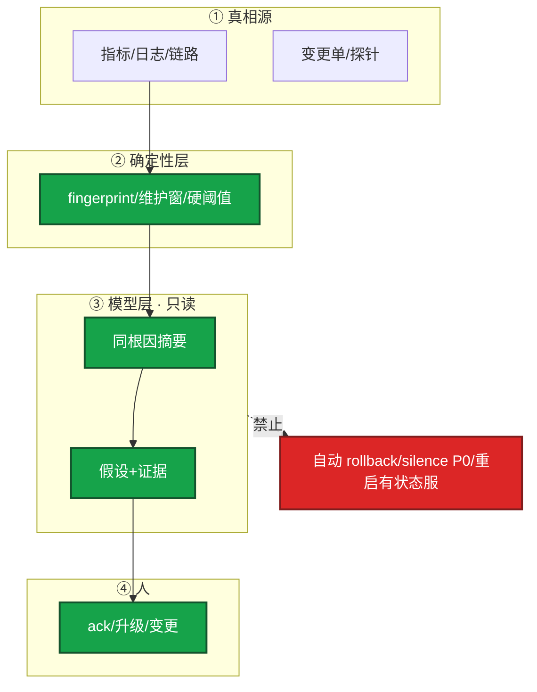

# 09｜AIOps 落地 · 练习题

先对照 [知识点](知识点.md) **面试怎么考** 自己口述，再对答案。
没有落地项目也能答边界；有项目按窄场景和漏报讲。
每题标了覆盖范围：

| 标记 | 含义 |
|------|------|
| **核心** | 不懂整章就没建立起来 |
| **必会** | 值班和面试都要能讲 |
| **常用** | 线上会反复碰到 |
| **常考** | 白板和追问的高频口径 |

## 本题目录

- [Q1 能做 / 不能做](#q1)
- [Q2 第一刀降噪三层](#q2)
- [Q3 什么不能自动执行](#q3)
- [Q4 六条与成熟度](#q4)
- [Q5 根因辅助怎么讲](#q5)
- [Q6 异常检测更吵](#q6)
- [Q7 日志聚类](#q7)
- [Q8 漏报事后](#q8)
- [Q9 没有项目 / 排障](#q9)
- [Q10 30 秒口述综合](#q10)
- [合上书](#合上书)

---

## Q1

**★★★★★｜AIOps 能做什么，不能做什么？**

**覆盖**：核心 · 必会 · 常考
**对应**：知识点 §1 · §3.3

### 场景

简历写「智能运维大脑，自动修复生产」。战斗服是有状态的。追问：为什么不能自动故障自愈？

### 完整解答

**一句话**：AIOps 增强理解和只读建议，不替代监控，模型决策永远不能自动修生产。

能做：告警降噪、异常检测、日志聚类、根因辅助（假设+证据）、复盘草稿、知识检索。  
不能做：替代监控采集、**自动修生产**、自动定责、当唯一容量真相。



本质是增强理解，不接管变更。监控和告警规则仍是真相源。模型会幻觉，写操作人批准。生产数据、密钥不出域。容量看压测、水位、活动预报，不是模型输出。

游戏战斗服有玩家状态和长连接。模型把「重启」当万能药，踢的是正在开团的人，且 limit 没改 OOM 还会来。

### 再追问

确定性动作和模型自动怎么分？——探针失败摘流量、磁盘 90% 清已知目录用脚本/控制器；不要「模型认为泄漏所以重启」。脚本自动 ≠ 模型自动。

---

## Q2

**★★★★★｜落地第一个场景选什么？三层怎么做？**

**覆盖**：核心 · 必会 · 常考
**对应**：知识点 §3.2 · §4.2

### 场景

活动开始告警刷屏，要立项「AIOps 平台」。80 条告警，有人要把 LLM 接在所有告警前面。

### 完整解答

**一句话**：第一刀选告警降噪：规则层先去重，模型层收束摘要，人 ack，模型不能 auto silence。

选告警降噪：痛点清、只读、好度量。不要先做大中枢。正确顺序：痛点 → 只读接口 → 指标 → 小流量。

```
  80 条原始告警
    → 规则层：fingerprint / 维护窗 / 已知噪音 / P3 不进模型
    → 十几条 + 发布单链接（从 API 拉，不让模型猜）
    → 模型层：低温 JSON 一条摘要，need_human: true
    → 人 ack / 升级 / 变更单
```

| 层 | 做什么 | 不做什么 |
|----|--------|----------|
| **规则层（主）** | fingerprint 去重；维护窗；P3 不进模型 | 过粗 fingerprint 把支付和登录合成一条 |
| **模型层（辅）** | 同根因摘要；关联变更从发布 API 拉 | `action: rollback`；自动 silence |
| **人** | ack 还是升级 | 模型不能自动 silence |

嵌进现有 IM，不另开 APP。`json.loads` + schema，失败降级成只显示规则层。P0 通道仍走原规则。TTFT 升高不要吞进「登录抖动」（见 08）。

证明有效：同时报 **条数、有效率、漏报率**。漏 P0/P1 为失败。只报「少了 80%」是藏问题。本周 P0/P1 漏报 = 0 才及格。

### 再追问

开服 80 条眼睛应看到什么？——规则层先降到十几条（还没花 token）→ 发布 API 链接 → 一条摘要三件事 → 老群 ack。支付 P0 若被吞，立刻关模型层。

---

## Q3

**★★★★★｜哪些动作永远不能自动执行？脚本自动和模型自动差在哪？**

**覆盖**：核心 · 必会 · 常考
**对应**：知识点 §3.3

### 场景

摘要卡片带「一键 rollback」「一键 silence」。有人说磁盘 90% 让模型判断完重启战斗服。另有人要把 GPU 过载交给模型投票删推理 Pod。

### 完整解答

**一句话**：silence P0、回档、重启有状态服等模型决策禁止自动执行；脚本自动≠模型自动。

**模型决策 · 永远不要自动执行：**

- silence P0/P1
- rollback / 回档 / 合服
- restart 有状态战斗服
- scale / 改副本
- delete 推理 Deployment
- 对玩家处罚
- 改注册表 / 密钥
- 自动定责

**脚本/控制器 · 可以自动（不是 AIOps 成果，也不贴 AI 标签）：**

- 探针失败摘流量
- 磁盘 90% 清已知 `/tmp/cache`（目录白名单）
- 网关排队超阈值拒绝新请求（08）

无状态可回滚的小动作：仍要规则触发、可回滚、人能关。不要把 LLM 放在写路径上「感觉该重启」。群里出现模型触发的 rollback = 成熟度越界，先拆写路径。

```
  建议型（要）                         越界（不要）
  摘要：三件事 + 链接 + 未变更          「根因已确定，已自动回滚大厅」
  OOM：假设 + RAG 案例 + 人审调 limit   Agent 自己 restart gw-1
  GPU：排队/显存证据 + 人预扩           模型决定 delete deploy vllm
```

### 再追问

写路径在不在是第一问。在，落地六条已经断了。

---

## Q4

**★★★★☆｜落地六条缺一条会怎样？成熟度停在哪一级？**

**覆盖**：必会 · 常考
**对应**：知识点 §3.1

### 场景

做了模型摘要，但摘要里带一键 silence，且另做了一个没人打开的 APP。「我们要做到自动型才算 AIOps。」

### 完整解答

**一句话**：落地六条缺只读、度量、嵌现有系统任一都会翻车；成熟度默认停建议型。

| # | 条 | 缺了现场 |
|---|----|----------|
| 1 | **只读优先** | 错摘要变成 silence / 自动 rollback |
| 2 | **窄场景** | 「平台」做一年，值班仍看原始风暴 |
| 3 | **可度量** | 只报降噪率，漏了支付 P0 没人知道 |
| 4 | **可回滚** | 模型写路径接上，错了要靠人救火 |
| 5 | **人在环** | 夜班全自动，早班发现战斗服被缩成 0 |
| 6 | **嵌进现有系统** | 另做一个 APP，没人打开 |

可回滚在只读设计里几乎免费——因为本来就不写生产。已经自动 rollback 了？那已经越界，先拆写路径。

成熟度：描述 → 诊断 → 预测 → **建议型（生产默认停）** → 自动型（游戏默认不做）。即使讨论自动型，决策应来自规则，不是 LLM 投票。跳到自动型只在无状态、可回滚、爆炸半径极小、且动作本身是确定性脚本时才讨论。

### 再追问

「可回滚所以可以先接 rollback 再拆」？——错。写路径一接上就不是可回滚设计。

---

## Q5

**★★★★★｜做过「根因分析」怎么讲才像真的？**

**覆盖**：必会 · 常考
**对应**：知识点 §3.4 · §6.3

### 场景

追问误报怎么收、漏报红线是什么。只剩架构图的人会卡。系统输出「根因已确定：Redis，已自动重启」。

### 完整解答

**一句话**：根因辅助讲假设+证据并列，人确认；没有证据链接当没上线，不自动定责不修。

讲辅助定位，不用「自动根因」。开服夜三条假设并列：

```
  假设 A  刚发版大厅 v1.2.3     证据：发布 API + 登录 P99
  假设 B  gw-1 limit 打满       证据：OOMKilled + 内存曲线 + RAG 案例
  假设 C  推理网关排队          证据：TTFT 8s + nvidia-smi 100%
```

值班选一条去验证。系统不输出「根因已确定」，不自动 rollback / restart / delete。

像真做过：窄场景名（「登录链路告警降噪」）；上线前后对照；漏报/误报怎么处理；人在环；承认某类告警效果一般。像 PPT（减分）：智能大脑、自动自愈、只报好指标、答不出漏报。

相似案例（03）：权限、时效、脱敏、带来源、标环境。测试/演练文档隔离。案例点击率不能单独当成功指标，必须和漏报、误导投诉一起看。

### 再追问

根因没有证据链接？——当没上线。自动定责不做——伤人且经常点错。

---

## Q6

**★★★★☆｜异常检测上线后告警更吵了怎么办？**

**覆盖**：必会 · 常用
**对应**：知识点 §3.4

### 场景

QPS 异常检测全集群打开，值班比以前更炸。有人要用它当容量规划唯一依据，并取代磁盘 90% 硬阈值。

### 完整解答

**一句话**：异常检测更吵说明误报没收敛，先关小再调；不能取代磁盘 90% 硬阈值。

异常检测学周期和趋势，偏离则报。坑：误报、冷启动无基线、业务改版后基线漂移、开服流量被当成「不像往常」狂报。

建立反馈：人标误报，规则/模型收敛。先灰度一个业务线。更吵就先关小，不要全集群开着装忙。开服流量当成异常狂报，先标误报、收基线。

固定硬阈值（磁盘 90%）仍然要留着；异常检测补「没有固定红线但今天不像往常」的指标（QPS、延迟）。两者互补，不是替代。不能当容量规划唯一依据——容量看压测、水位、活动预报（08-05）。

### 再追问

上线后更吵说明什么？——误报没收敛。先关小再调，不要硬撑着装忙。

---

## Q7

**★★★★☆｜日志聚类解决什么？和把日志丢给长窗口模型有何不同？**

**覆盖**：必会 · 常用
**对应**：知识点 §3.4

### 场景

战斗服 GB 级日志，有人要全部塞进 1M 窗口当根因分析。

### 完整解答

**一句话**：日志聚类从 GB 量里抓主因类型，再抽样给 LLM；整文件塞长窗口贵且易截断。

聚类按模板归类，「哪类错误多少条」，从量里抓主因类型。整文件塞窗口贵、慢、易截断（01），也没有结构。聚类 + 抽样再给 LLM 摘要，比通读全文靠谱。

工作流：错误检索之前先聚类，再按主类型去知识库搜 SOP（03）。你眼睛看到「OOMKilled 1200 次 / timeout 80 次」，而不是把 GB 日志贴进模型。

聚类结果能当线索（某类错误暴涨），根因仍要变更和指标证据，人判断。根因辅助不当最终结论，不自动定责，不自动修。

### 再追问

GB 日志整文件进模型当根因？——错。窗口和费用都不够，也没有结构。

---

## Q8

**★★★★☆｜降噪漏报了一条 P0，事后怎么改系统？**

**覆盖**：必会 · 常用
**对应**：知识点 §6.2 · §5

### 场景

fingerprint 把支付超时和登录超时合成一条，支付 P0 被压成「登录抖动」。有人为了条数更好看要继续加激进合并。JSON 失败半截散文进群。

### 完整解答

**一句话**：漏报 P0 是失败，立刻关模型层回纯规则，P0/P1 旁路模型，不要为了条数激进合并。

漏报是失败。复盘三问：

1. fingerprint 维度是否过粗？——支付单独维度
2. 维护窗是否误伤活动日真故障？
3. 模型是否被允许 silence / 拦截 P0？

立刻关模型层，回退纯规则。P0/P1 通道旁路模型，或模型只附加摘要不拦截。补漏报率看板。不要为了条数更好看继续加激进合并。

P3 默认不进模型，省钱、少幻觉。规则滤掉即可。JSON schema 失败 → 只显示规则层结果，不要把半截散文推进群里。

模型层开关必须能一键关回纯规则。活动周没有对照，项目页上的「降噪 80%」按没上过线处理。

### 再追问

三率是哪三率？——条数、有效率、漏报率。只报条数下降是藏问题。

---

## Q9

**★★★★☆｜没有 AIOps 项目怎么不减分？给出现象先走哪条？**

**覆盖**：必会 · 常用 · 常考
**对应**：知识点 §4.1 · §7

### 场景

公司还停留在 Grafana + 工单。四个工单：① 群里「已自动 rollback」② 支付 P0 被吞 ③ 异常检测更吵 ④ 另做一个 APP 没人打开。

### 完整解答

**一句话**：没有项目讲边界和第一刀降噪；出现自动 rollback 先拆写路径，P0 被吞关模型层。

没有项目：讲边界和若从零做的第一刀——降噪三层、漏报红线、不自动修。能讲清比编「智能平台」加分。吹自动修才减分。会用 RAG/工具调用/GPU 运维补（03/04/08）。AIOps 看判断力，不看 PPT 层数。

| # | 走哪条 | 不要做 |
|---|--------|--------|
| ① | 立刻拆写路径 | 继续调模型 |
| ② | 关模型层；修 fingerprint；P0 旁路 | 为条数继续合并 |
| ③ | 关小、标误报、灰度一条线 | 全集群开着装忙 |
| ④ | 嵌回现有 IM | 再画中枢大图 |

现场：写路径 → P0 通道还在不在 → 对照表漏报 → JSON 是否降级 → 相似案例环境标记。答不出漏报怎么处理、答不出模型错了系统为何不受损，就不要用 AIOps 当项目名。

没有落地时第一刀：登录链路降噪三层，P0 不经过 silence，写路径不接模型。错误检索挂卡片旁，GPU 打满按 08 走。

### 再追问

会不会显得落后？——会用 03/04/08 补。加分模块不是生死线。

---

## Q10

**★★★★★｜30 秒 + 2 分钟：AIOps 怎么讲才像做过？**

**覆盖**：必会 · 常考
**对应**：知识点 §6.3 · §8

### 场景

面试官：「你们 AIOps 做了什么？会不会自动修生产？」

### 完整解答

**一句话**：讲窄场景降噪三层+三率对照+漏报红线，成熟度停建议型，不写路径。

**30 秒**：「第一刀做登录链路告警降噪。规则层 fingerprint 和维护窗把 80 条收到十几条，P3 不进模型。模型低温 JSON 收束成一条摘要，变更从发布 API 拉。P0 原通道仍响，模型不能 silence。漏 P0 就是失败。只读建议，不自动 rollback。」

**2 分钟**：补落地六条、禁执行清单（silence P0、restart 有状态服、delete vllm）、根因辅助三条假设+证据、脚本自动 vs 模型自动。有项目报活动周对照表；没项目讲若从零怎么做第一刀。工具链：02 低温 JSON、03 RAG 案例、04/05 只读查监控、06 Agent 步数护栏、08 GPU 单独成条。不说「智能根因大脑」。

### 再追问

成熟度必须到自动型才算 AIOps？——错。生产默认停建议型。自动型在游戏有状态环境默认不做。

---

## 合上书

1. AIOps 能做什么、不能做什么？真相源是谁？
2. 落地六条缺一条会怎样？第一刀为什么是降噪？
3. 降噪三层各自做什么？漏 P0 怎么算、怎么改系统？
4. 哪些动作永远不能自动执行？哪些是脚本可以、不要贴 AI？
5. 根因辅助怎么并列三条假设？异常检测更吵怎么办？
6. 没有项目怎么讲不减分？建议型和自动型差在哪？
7. 30 秒怎么讲 AIOps 才像做过？

---

**上一章**：[08 GPU 与推理服务运维](../08-GPU与推理服务运维/练习题.md) · **下一章**：[09-AI 与智能运维 README](../README.md)
