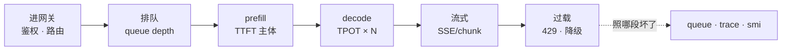
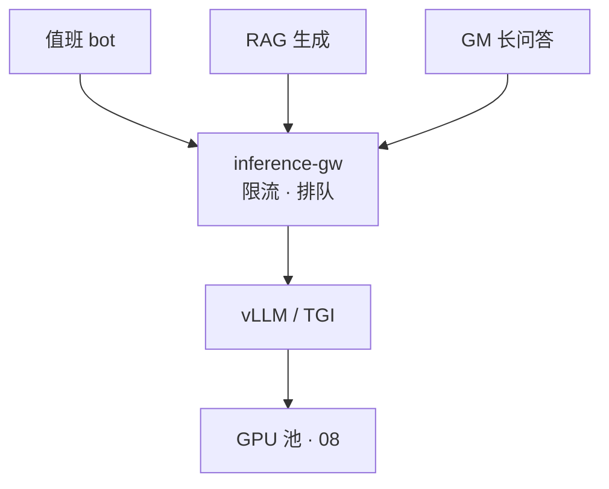
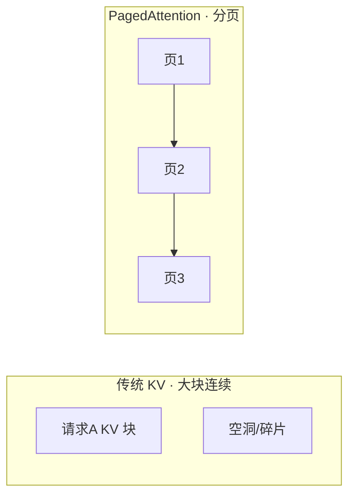
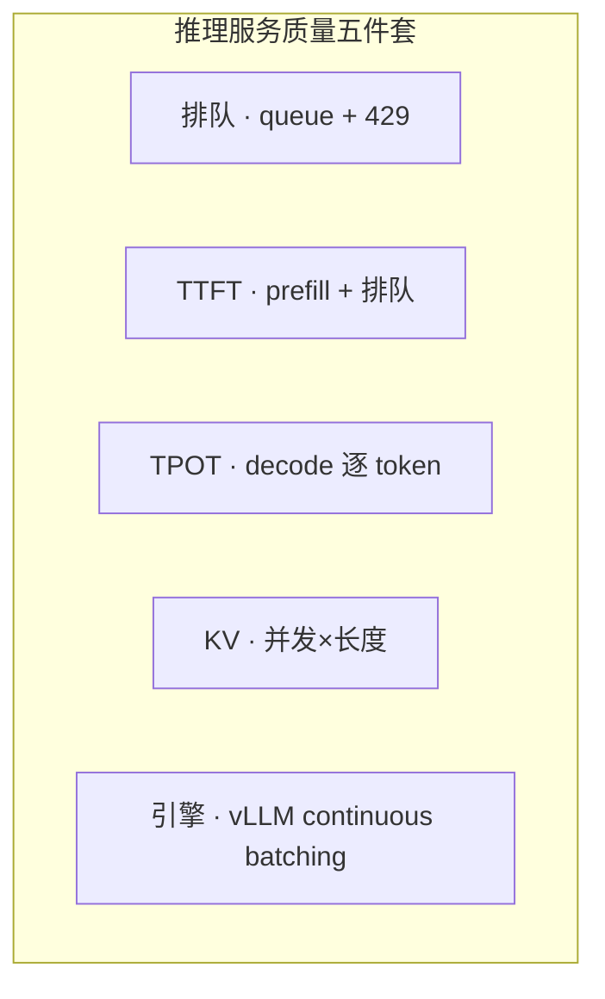
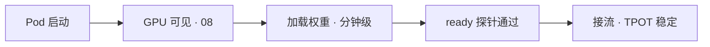
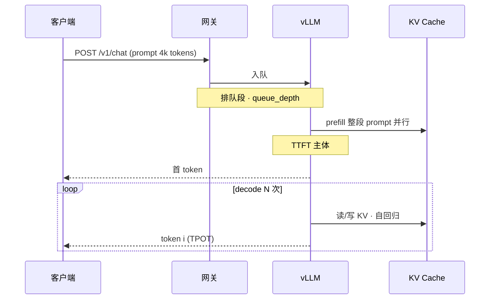
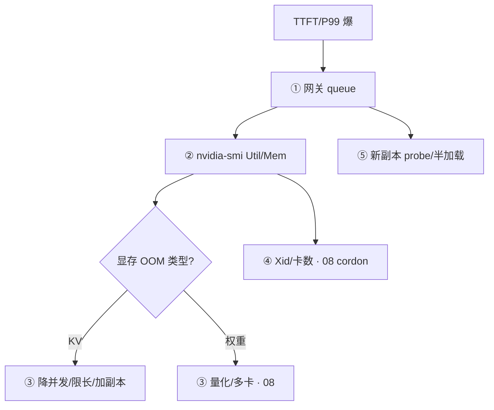

# 推理服务性能与稳定性

> 活动日 20:05，告警 bot、RAG、GM 问答三条线同时打满推理网关——TTFT 从 300ms 飙到 8s，有人 `kubectl delete pod` 全重启，权重加载又三分钟；有人只看 `nvidia-smi` 说「GPU 还有空」却忽略网关 queue 847。
> **本章回答**：一条 **推理请求** 从进网关到吐出 token 会经历什么——排队、TTFT（含 prefill）、TPOT、KV Cache、vLLM 拼批，以及打不动时怎么限流降级。
> **不讲**：Device Plugin/MIG/Xid 资源调度 → [08](../08-GPU资源与调度/)；LLM 窗口/token 基础 → [01](../01-LLM与Transformer基础/)；RAG 检索链 → [03](../03-RAG检索增强/)；Agent 步数打满网关 → [06](../06-Agent智能体/)。

**标记**：🎯重点 · 🔥难点 · ⭐常考 · 🔧实操

> **边界**：**08 管资源**（卡怎么分、坏了怎么办）；**09 管服务质量**（延迟、吞吐、排队、引擎参数、限流降级）。

### 本章与 08 分工：联查示例 🎯⭐

活动日同时看到：`queue_depth=847`、`GPU-Util=98%`、`Memory=81000/81920`。

```text
① 08：卡真满 → Insufficient gpu？能否扩池？
② 09：真过载 → 429 + HPA + route 限流
③ 若 Util 22% 但 queue 847 → 查网关/tokenizer，不是 08 加卡
```

| 组合信号 | 08 | 09 |
|----------|----|----|
| queue↑ + smi 满 | 占满确认 | 429/HPA |
| queue↑ + smi 空 | Plugin？ | 拼批/网关 |
| KV OOM | 加卡备选 | max_num_seqs 先 |
| Xid | cordon | — |

> ⚠️ **别混**：delete 大厅腾 GPU → 08 不适用；全 restart 推理 Pod → 09 冷启动灾难。

---

## 一、一张图：推理请求的一生

> 🎯 **一句话**：推理请求的一生六段——进网关、排队、prefill（TTFT）、逐 token 生成（TPOT）、流式吐出、过载拒绝——慢了先拆 **哪一段**，别混成一个「慢」。



**读图**：

- 主线是一条请求的时间线——**总延迟 = 排队 + TTFT + TPOT×输出长度**（流式改善感知，不降低真实 TTFT）。
- 「排队」在网关和引擎入口——GPU Util 低但 queue 涨，可能是 tokenizer/拼批/网关，不是加卡（08 资源够）。
- KV Cache 贯穿 prefill+decode，显存 **资源占用** 在 08，**并发×长度怎么打满** 在本章。

---

## 二、进网关：鉴权、路由、限流阀

> 🎯 **一句话**：客户端不直连 GPU——**网关**是水龙头：鉴权、按业务路由、**max_queue**、超额 **429 拒绝**，不无限排队拖死全体。



**读图**：三条业务共池时要 **按 route 分 QPS**——全打 70B 会挤爆；短 JSON 摘要路由小模型。Agent（06）每步调一次推理，和网关限流 **同一等级**。

典型网关指标：

```text
inference_queue_depth=847     ← 排队段爆了
inference_reject_rate=0.12    ← 429 在起作用（好过全超时）
route=alert_summary qps=120   ← 谁占队列
```

> ⚠️ **别混**：**拒绝（429）** 是过载保护；**无限排队** 是自杀——P99 全超时，像餐厅门口不拦人、里面没桌。

### 网关限流配置：max_queue 与 route QPS 🎯⭐

```text
# 网关配置示意（名因平台而异）
max_queue: 500
reject_http_code: 429
routes:
  alert_summary: { qps: 200, model: 7b }
  rag_generate:  { qps: 50,  model: 13b }
  gm_long_qa:    { qps: 10,  model: 70b }
```

```bash
curl -s http://metrics | grep -E 'queue_depth|reject_rate|route='
# inference_queue_depth{route="rag_generate"} 520
# inference_reject_rate 0.12  ← 有拒绝好过全超时
```

**读输出**：`reject_rate>0` 说明过载保护在工作；`reject_rate=0` 且 queue 持续涨 = **无限排队**，P99 会先炸。

| 配置 | 现象 | 定责 |
|------|------|------|
| max_queue 过大 | queue 涨、P99 超时 | 调小 + 429 |
| 无 route 分 QPS | 70B 被 alert 挤占 | 路由治理 |
| Agent route 无限流 | 06 步数打满 queue | route QPS + max_steps |

> 📝 **面试**：网关 = 水龙头；429 是保护，不是「服务坏了」——比全超时好。

---

## 三、排队：等 GPU 还是等拼批

> 🎯 **一句话**：**排队** = 请求在网关或引擎入口等空闲算力/槽位——`queue_depth` 持续涨而 GPU Util 也满，才是真容量过载。

```bash
# 网关 / 引擎 metrics（名因平台而异）
curl -s http://metrics/inference | grep queue_depth
# inference_queue_depth 847  ← 持续涨 = 容量问题

nvidia-smi
# GPU-Util: 98%  Memory: 81000/81920 MiB  ← 与 queue 同向 = 真过载
# GPU-Util: 22%  queue 仍涨              ← 查 tokenizer/拼批/网关，不是加卡
```

| 观测 | 定责 | 第一刀 |
|------|------|--------|
| queue↑ + GPU 满 | 容量 | 限流 429 + 预扩副本（08 有卡） |
| queue↑ + GPU 空 | 软件/网关 | 查引擎拼批、tokenizer |
| 无 429、全超时 | 无限排队 | 开 reject + max_queue |

> 💡 **打个比方**：餐厅等位——客人抱怨「半天没吃上」可能还在 **门口排队**（本章），不是厨师每道菜慢（TPOT）。

---

## 四、prefill 与 TTFT：首 token 之前发生什么

> 🎯 **一句话**：**TTFT（Time To First Token）** = 从请求进入到 **首个输出 token** 的时间，主体是 **prefill**——把 prompt（含 RAG 片段）过一遍模型填 KV。

### TTFT 含什么 🎯⭐🔥

```text
TTFT ≈ 排队等待 + prefill 计算 + 调度/网络小量
       ↑ 09        ↑ 09           ↑ 常忽略

prefill：整段 prompt 并行算一遍 → 生成 KV Cache 初始块
decode：  逐 token 自回归，每步读/写 KV
```

对同一请求 trace 拆解：

```text
总延迟 8.0s
  排队     6.2s   ← 容量（限流/加副本）
  prefill  1.1s   ← 上下文太长/RAG 塞太多
  首 token 后 TPOT 45ms/token
```

**读输出**：8s 里 **6.2s 是排队** → 不是「模型变笨」；修 prefill 救不了排队。

| 因素 | 拉高 TTFT | 治理 |
|------|-----------|------|
| 排队 | 并发超容量 | 429、HPA、预扩 |
| 长 prompt | RAG Top 50 进窗 | Top 3~5（03） |
| 冷启动 | 新副本权重未加载 | probe delay > 加载时间 |
| 权重加载 | Pod Running 未 Ready | 真推理探针，非只探端口 |

> ⚠️ **别混**：**流式（SSE）** 让 **感知** 变快——首 chunk 早到；**真实 TTFT**（prefill 完成时刻）不变，别当优化完成。

> 📝 **面试**：TTFT 含 prefill；先拆排队 vs prefill；流式不降真实 TTFT。

### 量化与 TTFT/TPOT：服务质量权衡 🔥

**INT8/INT4 量化** 减 **权重 footprint（08）** 和 **decode 算力**——但可能损质量，活动前要 **回归评测**。

| 量化 | 权重显存（08） | TPOT/质量（09） |
|------|----------------|-----------------|
| FP16 | 基准 | 质量基准 |
| INT8 | ~减半 | 多数场景可接受 |
| INT4 | ~1/4 | 需业务评测 |

```text
活动前决策链:
  1. 08: 权重是否装得下？→ 装不下先量化或多卡
  2. 09: 量化后 TPOT/P99 是否达标？→ 不达标回 FP16 或换小模型
  3. 09: RAG 进窗 Top 3~5（03）→ 减 prefill，不是只量化
```

> ⚠️ **别混**：量化 **不解决排队**——queue 847 先 429/HPA，不是「换 INT4 就行」。

---

## 五、decode 与 TPOT：逐 token 生成

> 🎯 **一句话**：**TPOT（Time Per Output Token）** = 每输出一个 token 的平均耗时——decode 阶段自回归，**总生成时间 ≈ TPOT × 输出 token 数**。

```text
输出 200 token，TPOT 45ms → decode ≈ 9s（不含 TTFT）
P99 尾延迟高：看 TPOT 是否随负载升 · 是否该限 max_tokens
```

| TPOT 高 | 常见原因 | 治理 |
|---------|----------|------|
| GPU Util 满 | 算力饱和 | 量化、加副本、降并发 |
| 输出过长 | max_tokens 太大 | 网关 cap |
| batch 过大 | 拼批牺牲单请求 | 调 max_num_seqs |

**continuous batching（连续批处理）**：vLLM 在 decode 时 **动态拼批**——新请求插入、完成的踢出，提高 GPU 利用率；代价是调度复杂度，**不是** Ollama 默认路径。

### max_tokens 与输出长度治理 ⭐

长回答 **TPOT × N**——网关 cap `max_tokens` 是 **09 服务质量** 手段，和 08 无关。

```text
gm_long_qa: max_tokens=4096  → 尾延迟可达 TPOT×4096
alert_summary: max_tokens=256 → 适合短 JSON
```

| 业务 | max_tokens 建议 | 原因 |
|------|-----------------|------|
| 告警摘要 | 256~512 | 短 JSON，低 TPOT 总时间 |
| RAG 生成 | 1024 | 平衡 |
| GM 长问答 | 2048~4096 | 需 cap + 低优先级 route |

```bash
# 抽样看输出长度分布（若有 metrics）
curl -s http://metrics | grep 'output_tokens_p99'
# output_tokens_p99{route="gm_long_qa"} 3800  ← 接近 cap，尾延迟高
```

> 🔍 **现场**：P99 尾延迟高但 TTFT 正常 → 查 TPOT 和 output_tokens，不是先加 GPU 卡。

---

## 六、KV Cache：并发×长度打满显存

> 🎯 **一句话**：**KV Cache** 存每层 attention 的 Key/Value——**随并发请求数 × 上下文长度** 涨；一放量 OOM 常是 KV，不是权重装不下（08 心算权重）。

```text
OOM 日志: Tried to allocate ... for KV cache
         ↑ 典型 KV OOM，不是 failed to load weights

对策顺序:
  1. 降 max_num_seqs / 限 max_tokens / RAG 少塞
  2. 加副本分流（08 有卡）
  3. INT8/INT4 量化（先质量回归）
```

### PagedAttention 🔥

**PagedAttention**（vLLM 核心）：KV 像 **虚拟内存分页**——按需分配、减少碎片，提高并发；**不是无限**——显存仍有限，要 **max_num_seqs** 和网关限流。



**读图**：PagedAttention 减 **碎片**、提 **并发**；活动日仍要 cap 并发和上下文。

| 对比 | 权重 OOM | KV OOM |
|------|----------|--------|
| 日志 | failed to load weights | KV cache allocate |
| 时机 | 启动/换模型 | 一放量就炸 |
| 第一刀 | 量化/多卡/小模型 | 降并发/限长/加副本 |

> 📝 **面试**：显存三块权重+KV+碎片；一放量 OOM 常 KV；PagedAttention 减碎片不是无限。

### 收束：推理服务质量五件套



**读图**：五件套都在 **09**；**08** 只回答「卡够不够、坏没坏」。

> ⚠️ **别混**：HPA 按 **CPU** 扩推理无效——看 **queue depth / GPU 利用率 / 显存水位**；minReplicas **不能 0**（冷启动自杀）。

---

## 七、vLLM vs Ollama：试模型 vs 扛 SLA

> 🎯 **一句话**：**Ollama** 办公机试 prompt/试模型；**活动 SLA** 用 **vLLM**（或 TGI 等）——continuous batching、K8s 探针、网关限流。

| 维度 | Ollama | vLLM 生产 |
|------|--------|-----------|
| continuous batching | 弱 | 核心 |
| PagedAttention | 无 | 有 |
| 活动 50 并发 P99 TTFT | 易秒级 | 可压到亚秒级（同卡同模型） |
| 适用 | 试模型、离线小工具 | 在线 SLA |

```yaml
# vLLM Deployment 片段（服务质量侧）
readinessProbe:
  httpGet:
    path: /health
    port: 8000
  initialDelaySeconds: 180   # 必须 > 权重加载时间（分钟级）
```

**预热链**：



> 📝 **面试**：Ollama 不进活动链路；vLLM + 网关限流 + probe delay；权重钉 hash 禁 latest。

### 分布式 trace：怎么拆延迟 🔧

```text
# 理想 trace span（示意）
span gateway.queue_wait    6200ms
span engine.prefill        1100ms
span engine.first_token    0ms      ← TTFT 边界
span engine.decode         45ms/token × 200
```

```bash
# 若有 OpenTelemetry / 自建 trace id
curl -s "http://trace-api/v1/trace/${TRACE_ID}" | jq '.spans[] | {name, duration_ms}'
# 无 trace 时：网关 metrics queue + 客户端 TTFB 粗拆
```

**读输出**：`queue_wait` 占 6.2s → **09 容量**（429/HPA）；`prefill` 1.1s 且 prompt 4k tokens → **RAG 减窗（03）** 或换小模型。

| span | 高时第一刀 |
|------|------------|
| queue_wait | 429、扩副本（08 有卡） |
| prefill | 减 prompt/RAG TopK |
| decode/TPOT | 量化、降 max_num_seqs |
| 冷启动 gap | probe delay、minReplicas |

---

## 八、过载：429、降级、HPA 信号

> 🎯 **一句话**：打不动时 **拒绝新请求 + 路由小模型**，不无限排队；HPA 看 **queue/GPU**，probe **delay > 权重加载**。

```text
网关: max_queue=500, reject_http_code=429
降级: alert_summary → 7B · GM 长文 → 70B（分路由）
HPA:  minReplicas=2, 信号 queue_depth 或 GPU util
禁止: minReplicas=0 · 按 CPU 扩 · 只探 :8000 端口
```

| 配置 | 后果 |
|------|------|
| 无 429 | 全超时，比拒绝更糟 |
| min=0 | 从 0 扩 = 冷启动 TTFT 爆炸 |
| probe 30s、加载 120s | 半加载接流 |
| 重启所有 Pod | 又重新加载，TTFT 再炸 |

Agent（06）+ RAG（03）同时打满 → **网关按 route 限流**，不是只加 GPU 卡（08）。

### prefill vs decode：过程图 🎯⭐🔥



**读图**：prefill 一次算整段 prompt（RAG 片段也算）→ 填 KV 初始块；decode 逐步出 token，**TPOT×N** 是长回答尾延迟来源。流式只是 **更早推送** decode 出的 token，prefill 耗时不变。

### 多业务共池：按 route 路由与降级 ⭐

```text
alert_summary  → 7B  · max_tokens=256  · 高优先级
rag_generate   → 13B · max_tokens=1024 · 中
gm_long_qa     → 70B · max_tokens=4096 · 低（可 429 降级到 13B）
agent_tool     → 与 alert 同池 · 共享 max_steps 限流（06）
```

活动日三条线共 `inference-gw`：监控 **按 route label 的 queue 占比**——全打 70B 会 KV OOM + queue 双爆。

```bash
curl -s http://metrics | grep 'inference_queue_depth{route='
# route=alert_summary  12
# route=rag_generate   520   ← 先限这条或扩副本
# route=gm_long_qa     315
```

> ⚠️ **别混**：加 GPU 卡（08）解决不了 **错误路由**——70B 接 alert 摘要也会慢。

### 落地场景：活动日 TTFT 300ms → 8s

1. queue 847 + smi Util 98% → 真过载：429 + 预扩（08 有卡）。
2. trace：排队 6.2s 占大头 → 不是换更大模型。
3. 查新副本 probe：initialDelaySeconds 30、加载 120s → 半加载曾接流。
4. **不要**：删大厅；全 restart 推理 Pod。

---

## 九、作战：TTFT 300ms → 8s 五刀

> 🎯 **一句话**：**五刀顺序**——queue → smi → 权重 vs KV → Xid/卡数（08）→ 半加载探针。



### 现象 · 先做 · 别做

| 现象 | 先做 | 别做 |
|------|------|------|
| queue 847 + GPU 满 | 429 + 预扩 | 只加重试 |
| GPU 空 + queue 涨 | 查拼批/tokenizer | 盲目加卡 |
| KV OOM | max_num_seqs、限 tokens | 只重量化 |
| 全 Pod restart | 等加载完；查 probe | 「重启救命」 |
| 流式「感觉快了」 | 仍看真实 TTFT | 当容量已够 |

### 60 秒剧本 🔧

```text
① 0–10s  queue_depth 涨吗？按 route 谁占？
② 10–30s  nvidia-smi Util/Mem；与 queue 同向吗？
③ 30–45s  抽样 trace：排队/prefill/TPOT 各多少秒？
④ 45–60s  KV→限并发；排队→429+HPA；Xid→08 cordon
```

---

## 十、收口

### 命令与指标速查 🔧

```bash
# 队列与拒绝（09 核心）
curl -s http://metrics | grep -E 'queue_depth|reject_rate|route='
curl -s http://metrics | grep 'output_tokens_p99'

# GPU 侧（与 08 联查）
nvidia-smi
nvidia-smi --query-gpu=utilization.gpu,memory.used,memory.total --format=csv

# Pod 就绪与加载
kubectl get pod -n ai -o wide
kubectl describe pod vllm-0 -n ai | grep -A5 Readiness
kubectl logs vllm-0 -n ai --tail=30 | grep -iE 'oom|kv|weights|loading'

# HPA（信号要对）
kubectl get hpa -n ai
kubectl describe hpa vllm-hpa -n ai | grep -A5 Metrics

# 网关配置验收
kubectl get cm inference-gw-config -n ai -o yaml | grep -E 'max_queue|429|qps'

# trace 抽样（若有）
curl -s "http://trace-api/v1/trace/${TRACE_ID}" | jq '.spans[].duration_ms'
```

### 09 vs 08 速查对照

| 问题 | 09 第一刀 | 08 何时介入 |
|------|-----------|-------------|
| queue 847 | 429、route 限流 | 扩副本前确认有卡 |
| TTFT 8s、queue 6s | 限流+HPA | Insufficient gpu |
| KV OOM | max_num_seqs | 加卡/扩池 |
| 权重 OOM | — | 量化/多卡 |
| Xid | — | cordon |
| smi 空+queue 涨 | tokenizer/网关 | Plugin/Toolkit |

### 面试锚点

| 问 | 30 秒答 |
|----|---------|
| TTFT / TPOT？ | TTFT 含排队+prefill 到首 token；TPOT 每输出 token；总生成≈TPOT×N。 |
| 延迟怎么拆？ | 排队、TTFT、TPOT 三段；先看 queue 和 smi。 |
| KV Cache？ | 并发×长度；一放量 OOM 常 KV；PagedAttention 减碎片非无限。 |
| vLLM vs Ollama？ | 试模型 vs 生产 SLA；continuous batching。 |
| 流式降 TTFT 吗？ | 不降真实 TTFT，只改善感知。 |
| HPA 坑？ | 不按 CPU；min≠0；probe delay>加载。 |
| 08 vs 09？ | 08 资源；09 服务质量。 |
| 过载怎么办？ | 429 拒绝+降级路由，不无限排队。 |

### 易错一句话对照

- 一个「慢」字概括 → 拆排队/TTFT/TPOT
- 流式优化 TTFT → 只感知，真实 TTFT 不变
- OOM 一定模型太大 → 常 KV
- Ollama 扛活动 → vLLM+网关
- HPA 按 CPU → queue/GPU/显存
- minReplicas=0 省钱 → 冷启动自杀
- 重启所有推理 Pod → 重新加载再炸
- GPU 空就没问题 → queue 可能在网关
- RAG 50 条进窗 → Top 3~5
- 只探 8000 端口 → 权重未就绪也 Ready
- 无限排队 → 429 才是保护
- 量化救 queue 847 → 先 429/HPA
- max_tokens 不管尾延迟 → TPOT×N
- trace queue_wait 6s → 容量不是换模型

### 数字墙

> **TTFT** = 排队 + prefill + 调度 · **TPOT** × 输出 token ≈ decode 时间 · RAG 进模型 **Top 3~5** · 权重加载 **分钟级** · probe **initialDelaySeconds > 加载时间** · HPA **minReplicas ≥ 1** · 网关 **max_queue + 429** · 7B FP16 权重 **≈14GB**（08）· 活动 **不用** Ollama 扛峰值

---

## 合上书

- [ ] **默画主图**：网关 → 排队 → prefill/TTFT → decode/TPOT → 流式 → 过载。
- [ ] **口述 08 vs 09 边界**：各管什么？
- [ ] **拆解 8s 延迟**：排队 6.2s + prefill 1.1s 说明什么？
- [ ] **口述 TTFT vs TPOT vs 流式**：真实 TTFT 变了吗？
- [ ] **口述 KV OOM vs 权重 OOM**：日志怎么分？第一刀？
- [ ] **口述 PagedAttention 与 continuous batching**：解决什么、不保证什么？
- [ ] **口述 vLLM vs Ollama**：活动日怎么选？
- [ ] **口述 HPA/探针/min=0**：各会怎样？
- [ ] **口述五刀排障**：TTFT 爆的顺序。
- [ ] **口述过载策略**：429 vs 无限排队。

### 附录：HPA 信号配置示例（服务质量）

```yaml
# 示意：HPA 不看 CPU
metrics:
  - type: Pods
    pods:
      metric:
        name: inference_queue_depth
      target:
        type: AverageValue
        averageValue: "100"
  - type: Resource
    resource:
      name: nvidia.com/gpu
      target:
        type: Utilization
        averageUtilization: 80
```

**读图**：queue_depth 和 GPU util **都是 09 信号**——扩副本前 **08 确认 Insufficient gpu 不是根因**（有卡才扩）。

上一章：[08 GPU 资源与调度](../08-GPU资源与调度/)。下一章：[10 AIOps 落地](../10-AIOps落地/)。
