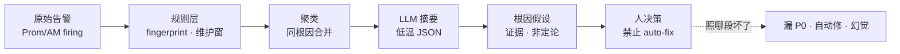
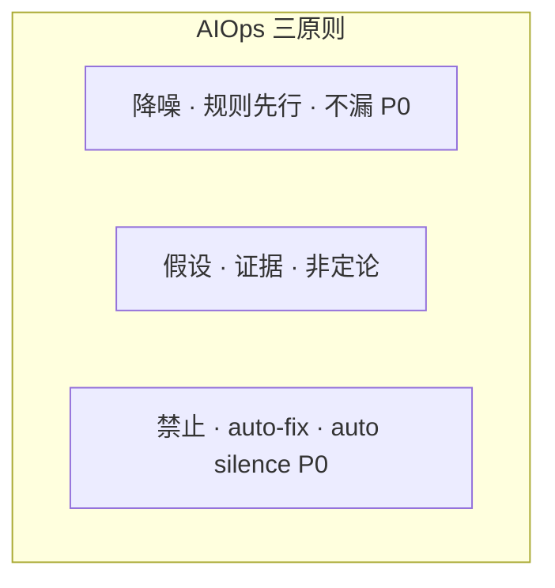
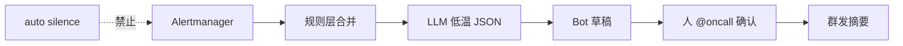
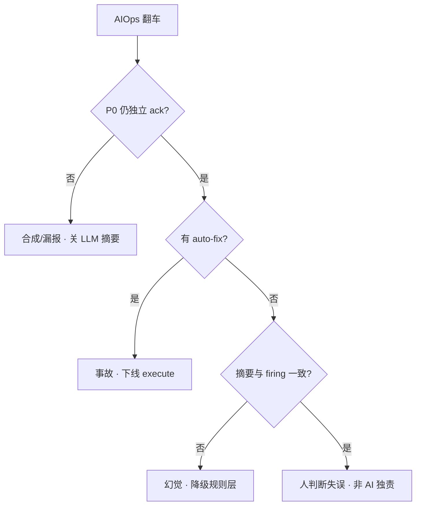

# AIOps 落地

> 开服 20:00，飞书群 80 条告警刷屏：登录超时、gw-1 OOM、推理 TTFT、支付 P99 全混在一起。有人想让模型「自动回滚大厅」；另有人只报「降噪 80%」——支付 P0 被合成进「登录抖动」没人看见。
> **本章回答**：一次 AIOps 辅助排障从告警风暴到给人可行动假设会经历什么——规则降噪、LLM 摘要、根因假设、禁止自动修。
> **不讲**：Prometheus/Alertmanager 基础 → [09-02](../../09-可观测性与SRE方法论/02-Prometheus与PromQL/)；通用告警降噪 → [09-03](../../09-可观测性与SRE方法论/03-告警设计与降噪/)；Agent ReAct → [06](../06-Agent智能体/)。

**标记**：🎯重点 · 🔥难点 · ⭐常考 · 🔧实操

---

## 一、一张图：AIOps 辅助排障的一生

> 🎯 **一句话**：AIOps 六段——原始告警 → 规则降噪 → 同根因聚类 → LLM 摘要 → 根因假设 → **人决策**；模型停在建议，不碰 execute。



- 📖 **读图**
  - 🛤️ 主线在监控之上的**理解层**——Prometheus/Alertmanager 仍是真相源；AIOps 不替代采集、不替代 oncall 签字
  - 🛡️ 「规则层」必须先于 LLM：80 条进模型是烧钱+漏报；P0 原通道必须仍响
  - ✅ 最后一节永远是人：silence / rollback / restart **不接模型**

### ⚖️ AIOps 是什么、不是什么 🎯⭐

| 是 | 不是 |
|----|------|
| 对已采集信号做降噪、摘要、假设 | 新监控系统 |
| 嵌进 IM/工单的草稿 | 替值班大脑 |
| 辅助理解「可能同一根因」 | 自动执行变更 |
| 复盘/RCA 起草（人核） | 编造时间点进 wiki |

- 🔑 **与邻章分工**
  - 规则层降噪手法细节 → [09-03](../../09-可观测性与SRE方法论/03-告警设计与降噪/)；本章钉 **AI 能帮到哪、哪一步必须人**
  - 只读多步拉证据 → [06 Agent](../06-Agent智能体/)；人写工单出假设 → [07](../07-AI工具实战与Vibe-Coding/)
  - execute 层与 Agent/Vibe **同一红线**——模型不签字

> 📝 **面试**：AIOps = 监控之上的理解层；真相源不变；**不能 auto-fix 生产**。⭐（练习题 Q1、Q6）

本节对应练习题 Q1、Q6。分层有了——先钉真相源。

---

## 二、原始告警：真相源不变

> 🎯 **一句话**：`LoginP99High`、`GwOOM`、`PayP99High` 各走原 Alertmanager 规则通道——AIOps 是附加摘要，不是拦截 P0。

```text
[ firing ] LoginP99High        severity=P1  fingerprint=login_timeout
[ firing ] GwOOMKilled         severity=P1  pod=gw-1
[ firing ] InferenceTTFTHigh   severity=P2  route=rag
[ firing ] PayP99High          severity=P0  ← 绝不能被摘要层吃掉
```

- 📖 **读图**：四行都是真相源 firing；AIOps 只能在旁边写「可能同事故」草稿，不能让最后一行只出现在散文里。

> 💡 **打个比方**：血压计（Prometheus）测原始数据；主治医生读报告写「可能三高，建议复查」是理解层——医生不能替代血压计，也不能不经你同意就开刀。

> ⚠️ **别混**：确定性阈值（磁盘 90%、探针失败摘流）仍用脚本/控制器——贴「AI 自愈」标签但其实是 if 判断，不算 AIOps 模型决策（见六节「脚本自动 ≠ 模型自动」）。

本节对应练习题 Q2。真相源钉死——规则层四手段。

---

## 三、规则层降噪：fingerprint、维护窗、severity、inhibit

> 🎯 **一句话**：规则层先行——同 fingerprint 合并、维护窗压已知噪音、P3 不进 LLM；模型只处理收束后的十几条。

```text
80 条原始 firing
  → fingerprint 合并（同 login_timeout 47 条 → 1 条）
  → 维护窗（CDN 预热已知 → suppress）
  → severity 闸门（P3 仅工单，不进群摘要）
  → 剩余 ~12 条进 LLM 摘要
```

- 📖 **读图**：每一步都是规则/配置，不是 prompt；进 LLM 前必须压到约十几条，且带 severity/P0 标记。

| 规则手段 | 作用 | 失败信号 |
|----------|------|----------|
| **fingerprint** | 同标签重复告警合并 | 47 条独立 Login |
| **维护窗** | 已知变更期 suppress | 预热 CDN 仍刷屏 |
| **severity 路由** | P0 独立通道 | P0 只出现在 LLM 散文里 |
| **inhibit** | 上游根因抑制下游 | OOM 还刷 HPA 子告警 |

```bash
# Alertmanager 侧（规则层，非 LLM）
amtool alert query 'alertname=LoginP99High' | wc -l
# 47  ← 同根因重复；合并后再送 LLM
```

### 🔗 inhibit：规则层示例 🔧

```text
# 示意：GwOOMKilled firing 时抑制下游 LoginP99 重复刷屏
inhibit_rules:
  - source_match: { alertname: GwOOMKilled }
    target_match: { alertname: LoginP99High }
    equal: ['cluster']
```

```bash
amtool alert query 'alertname=LoginP99High' --output json | jq '.[] | .status.inhibitedBy'
# 非空 ← 被上游 OOM 抑制；若仍 47 条独立 Login → inhibit 未配
```

#### ❓ 为什么不能 80 条全进 LLM？

- ❌ **全进模型**：贵、慢、易漏关键行；模型还可能把 PayP0 合成进「登录抖动」
- ✅ **规则先行**：fingerprint / 维护窗 / severity / inhibit 先压到 ~12 条，再低温摘要
- 🚨 **漏 P0/P1 = 失败**：只报「降噪 80%」不够——三率要一起报（七节）

> ⚠️ **别混**：inhibit **漏配** 不能靠 prompt「请合并重复告警」——模型可能误合并 P0。

> 📝 **面试**：降噪规则层先行，LLM 收束；三率：条数、有效率、漏报。⭐（练习题 Q2、Q3、Q13）

本节对应练习题 Q2、Q3、Q13。规则外——聚类与 LLM 摘要。

---

## 四、聚类与 LLM 摘要：同根因一条话

> 🎯 **一句话**：聚类把可能同一事故的告警放一组；LLM 用低温 JSON + schema 输出「一条群消息草稿」——失败降级规则层，不推半截散文。

送 LLM 的输入结构（示意）：

```json
{
  "alerts": [
    {"name": "LoginP99High", "sev": "P1", "since": "20:02", "labels": {"svc": "login"}},
    {"name": "GwOOMKilled", "sev": "P1", "pod": "gw-1"},
    {"name": "PayP99High", "sev": "P0", "since": "20:03"}
  ],
  "recent_deploy": [{"svc": "gw", "ver": "v2.3.1", "at": "19:50"}]
}
```

期望输出（schema 约束）：

```json
{
  "summary": "20:02 起登录 P99 升高，gw-1 OOM；支付 P0 独立并列，需立即 ack",
  "groups": [
    {"theme": "login_gw", "alerts": ["LoginP99High", "GwOOMKilled"], "hypothesis": "gw 内存/regression"},
    {"theme": "pay", "alerts": ["PayP99High"], "hypothesis": "待查，不与 login 合并"}
  ],
  "p0_ack_required": ["PayP99High"],
  "auto_action": "none"
}
```

- 📖 **读图**
  - `PayP99High` **独立成组**且进 `p0_ack_required`——不能合成进「登录抖动」
  - `auto_action` 永远是 **none**；半截 JSON → 只推规则层合并结果

### 🌡️ LLM 参数：低温 + schema 🔧

```text
temperature: 0.1
response_format: json_schema
required_fields: [summary, groups, p0_ack_required, auto_action]
```

```bash
jq -e '.p0_ack_required and .auto_action=="none"' /var/log/aiops/outbound-last.json
# 校验失败 → 不群发，只推 amtool 合并结果
```

- 🔑 **生产参数**
  - temperature **0~0.2**：高则编造 deploy 时间
  - max_tokens 够容纳 schema：截断会丢 p0 字段
  - schema 硬校验：半截 JSON → 降级规则层，不是 retry 10 次「认真点」

#### ❓ 为什么摘要失败要降级规则层，而不是重试模型？

- 🔁 **重试模型**：可能仍半截、仍漏 P0、仍散文——值班窗口在烧掉
- ✅ **降级规则层**：fingerprint 合并结果仍可进群，P0 原通道仍响
- 🛡️ schema 是闸门，不是「建议」——校验不过就不出站

> ⚠️ **别混**：LLM 摘要人审后进群（或 bot 发草稿 @oncall 确认）；不是 auto silence。

> 📝 **面试**：摘要失败降级规则层；`p0_ack_required` + `auto_action=none` 是硬字段。⭐（练习题 Q3、Q7）

本节对应练习题 Q3、Q7。摘要外——根因假设。

---

## 五、根因假设：证据链，不是定论

> 🎯 **一句话**：根因 AI 只输出假设 + 证据（变更链接、指标截图、RAG citation）——不说「根因已确定」，不定责，不 auto rollback。

```text
假设1（中）: gw v2.3.1 内存回归
  证据: 19:50 deploy · gw-1 OOMKilled · 内存曲线贴 limit
  下一步（只读）: describe pod · query 内存 · diff 发布物

假设2（低）: 登录链路上游 DNS
  证据: 不足，需 dig
  下一步: dig login.game.com @各递归

禁止: 「根因已确定为 DNS」· 自动 rollback gw
```

### 📦 变更关联：输入必须带 deploy 上下文 ⭐

开服夜 **19:50 gw v2.3.1** 与 **20:02 Login P99** 关联——靠结构化 `recent_deploy`，不是模型闭卷猜。

```bash
kubectl rollout history deployment/gw -n game --revision=3
curl -s http://change-api/v1/recent?window=1h | jq '.[] | select(.svc=="gw")'
```

| 输出 | 允许 | 禁止 |
|------|------|------|
| 假设排序 | ✓ | 「已确定」 |
| 变更/API 链接 | ✓ | 自动 apply |
| RAG citation | ✓ | 过期 SOP 不核就执行 |
| 只读下一步 | ✓ | restart / scale / silence P0 |

#### ❓ 为什么不能写「根因已确定」？

- 🎭 **假设 ≠ 定论**：同一时刻可有多条并行假设；定论要人核 citation 后签字
- 🔥 **幻觉风险**：模型会编时间点、编 DNS、编「已 rollback」——写进 wiki 就是事故
- ✅ **允许措辞**：「假设（中）+ 证据列表 + 只读下一步」；Agent（06）可代劳只读拉证据，仍无写工具

### 收束：AIOps 落地三原则 🎯🔥



- 📖 **读图**：缺任一原则，成熟度应停在建议型——不能因「有模型」就升自动修。

> 🔥 **难点**：脚本确定性自动（磁盘 90% 清已知目录、探针摘流）可以；**模型决定 restart** 不行——面试必答。

> 📝 **面试**：根因输出假设+证据+只读下一步；不当定论、不定责。⭐（练习题 Q5）

本节对应练习题 Q5。红线外——人决策与禁止自动修。

---

## 六、人决策：禁止自动修、禁止 auto silence P0

> 🎯 **一句话**：silence / rollback / restart 有状态服 / scale / delete vllm 永远人审——模型最多生成审批单 JSON，执行器不接 LLM 输出。

```text
✗ 模型 auto silence P0/P1
✗ 模型 auto rollback 大厅
✗ 模型 restart 有状态 gw
✗ 模型 scale 推理 Deployment
✓ 人 ack P0 后走变更单
✓ 确定性脚本：磁盘 90% + 白名单路径清理（非 LLM 决策）
✓ Agent 只读调查 + 提议（06）
```

| 成熟度 | 做什么 | 不做什么 |
|--------|--------|----------|
| **L1 建议型**（默认） | 摘要、假设、只读命令建议 | 任何 execute |
| **L2 半自动** | 人点按钮触发预审计脚本 | LLM 直接触发 |
| **L3 自动修** | 游戏有状态生产禁止 | — |

#### ❓ 为什么脚本自动可以、模型自动不行？

- 📜 **脚本自动**：if 磁盘>90% 且路径在白名单 → 清目录——确定性、可审计、可回放
- 🤖 **模型自动**：幻觉 + 有状态一次错杀 = 事故；写路径不接模型
- 🏷️ 贴「AI 自愈」标签的确定性脚本 ≠ AIOps 模型决策——口诀：**脚本自动 ≠ 模型自动**

### 💬 IM 嵌入：摘要进飞书的接线 🎯⭐



- 📖 **读图**
  - Bot 发的是草稿——`p0_ack_required` 必须 @ 对应 Oncall；不是 auto ack
  - 半截 JSON → 只推规则层；群里「已自动 rollback」文案 = 事故

```bash
jq '{summary, p0_ack_required, auto_action}' /var/log/aiops/outbound-last.json
# auto_action 必须 "none"
```

> ⚠️ **别混**：飞书卡片按钮触发预审计脚本（L2）≠ LLM 直接 execute——按钮背后仍是人点 + 固定脚本。

> 📝 **面试**：为什么 AI 不能自动修？幻觉 + 有状态错杀；写路径不接模型。与 Agent 不能替 Oncall（06）同一红线。⭐（练习题 Q4、Q8）

本节对应练习题 Q4、Q8。红线外——三率与成熟度。

---

## 七、观测与迭代：三率对照表

> 🎯 **一句话**：活动周用对照表评 AIOps——条数、有效率、漏报；只报「降噪 80%」不证明没漏 P0。

```text
| 指标 | 活动前基线 | 活动周 | 目标 |
|------|------------|--------|------|
| 群告警条数/小时 | 120 | 28 | 降 ≠ 唯一 KPI |
| 摘要有效率（人标有用） | - | 85% | >80% |
| P0/P1 漏报 | 0 | 0 | 必须 0 |
| 误合并（P0 进错组） | - | 0 | 必须 0 |
```

### 🎚️ 成熟度：默认停在 L1 ⭐

```text
L0 观测    只有 Prom/AM，无 AI
L1 建议型  摘要+假设+只读建议 ← 生产默认停这里
L2 半自动  人点按钮触发预审计脚本（非 LLM 触发）
L3 自动修   游戏有状态生产禁止
```

### 📉 日志聚类：GB 不能整进窗口 🔧

```text
原始 ERROR 200 万行
  → 规则/指纹聚类 → 847 类
  → 每类抽 3~5 行代表
  → 共 ~4000 行送 LLM 做「可能同一发布导致」假设
  → 输出仍带 citation 到原始 log_id
```

> ⚠️ **别混**：聚类是降采样；不是让模型「读全量日志」。整文件进窗口 = 烧钱 + 漏关键行（→ [07](../07-AI工具实战与Vibe-Coding/)）。

### 📡 异常检测 vs 阈值：补位，不替代 🔥

- 硬阈值（磁盘满、5xx 率、PayP99 P0）→ 规则，非 LLM；原 AM 通道必须保留
- 异常检测（「今天不像往常」）→ 可 ML，摘要给人；**不替代**硬阈值
- LLM 摘要 / 根因假设 → 理解层，非定论

> 📝 **面试**：异常检测不替代监控；P0 硬阈值 + 原 AM 通道必须保留。⭐（练习题 Q14）

### 🔄 反馈闭环

活动周三率对照后，人标「摘要有用/无用」进反馈表——调 prompt/schema，不是加 auto-fix。

> 🔍 **现场**：误合并率 >0 → **关 LLM 合并 P0**，不是「换更大模型」。

### 落地场景：没 AIOps 平台怎么答面试

「若从零，登录链路三层：① AM fingerprint 合并 ② 维护窗压 CDN 预热 ③ 低温 JSON 摘要进飞书人审后发；P0 支付独立 ack；execute 零 LLM；活动周三率对照。」——不编「我们有个 AI 大脑平台」。（练习题 Q9）

本节对应练习题 Q8、Q9、Q14。观测清了——作战定责。

---

## 八、作战：AIOps 翻车怎么定责

> 🎯 **一句话**：先问 P0 是否仍独立响；再问有没有 auto-fix；最后问摘要是否幻觉。



- 📖 **读图**：三条失败路径——漏 P0、自动修、幻觉——对应关摘要 / 下线 execute / 降级规则层；人判断失误不甩锅给模型独责。

### 现象 · 先做 · 别做

| 现象 | 先做 | 别做 |
|------|------|------|
| P0 被合成进 P2 摘要 | 关 LLM 合并 P0；规则隔离 | 调 prompt「认真点」 |
| 模型 auto silence | 下线写接口；审计 | 「下次加确认」 |
| 根因「已确定」文案 | 改 schema 禁措辞 | 当最终 RCA |
| 降噪 80% 但漏支付 | 以漏报为准判失败 | 只报降条数 |
| GB 日志进模型 | 聚类+抽样 | 怪 context 小 |

### 60 秒剧本 🔧

```text
① 0–10s  P0 firing 与原 AM 通道是否仍在？独立 ack 了吗？
② 10–30s  摘要 JSON 里 p0_ack_required 是否完整？
③ 30–45s  执行层有无 LLM 触发的 silence/rollback？
④ 45–60s  漏报→关 AI 合并；auto-fix→事故；幻觉→降级规则层
```

### 开服夜完整剧本：80 条 → 12 条 → 1 条群消息 ⭐

```text
T+0min   80 firing：Login×47 GwOOM InferenceTTFT PayP0
T+2min   规则层：fingerprint Login→1 · PayP0 独立 ack
T+5min   12 条送 LLM（含 recent_deploy gw v2.3.1）
T+6min   JSON：login_gw 一组 · pay 独立 · auto_action=none
T+7min   人审 → 群发 · @pay-oncall ack P0
T+8min   Agent（06）只读拉 gw 证据
T+30min  人变更单调 limit——execute 无 LLM
```

> 🔍 **现场**：复盘查 `auto_action` 历史——任何非 none = 事故线索。

本节对应练习题 Q10、Q11、Q12。回到开头那个现场——规则降噪 → LLM 草稿 → 假设带证据 → 人签字；三率一起报。

---

## 九、收口

### 命令速查 🔧

```bash
# 规则层：firing 条数与 P0
amtool alert query | wc -l
amtool alert query 'severity=critical'   # P0 必须可见

# LLM 出站验收
jq '{p0_ack_required, auto_action, groups[].theme}' /var/log/aiops/summary-last.json

# execute 层审计：有无 LLM 触发变更
grep -iE 'llm_trigger|auto_silence|auto_rollback' /var/log/change-audit.log

# 日志聚类后抽样规模
wc -l /tmp/log-cluster-sample.txt   # 应 ~4000 行级，非 200 万
```

### 落地 checklist 🔧

```text
□ P0 原规则通道仍响，LLM 只附加
□ 规则 fingerprint/维护窗/inhibit 先于 LLM
□ LLM 低温 JSON + schema；失败降级规则层
□ 根因输出「假设+证据」，禁「已确定」
□ execute 层无 LLM 接线
□ 活动周三率对照：条数/有效率/漏报
□ 嵌 IM/工单，不做没人打开的 APP
□ recent_deploy 结构化进摘要输入
□ auto_action 字段恒为 none
```

### 面试锚点

| 问 | 30 秒答 |
|----|---------|
| AIOps 是什么？ | 监控之上理解层；降噪、摘要、假设；不替代 Prom/AM。 |
| 降噪怎么做？ | 规则层先行 fingerprint/维护窗；再 LLM 收束；漏 P0=失败。 |
| 为何不能自动修？ | 幻觉；有状态错杀=事故；写路径不接模型。 |
| 根因 AI 怎么做？ | 假设+证据+只读下一步；不当定论；不定责。 |
| 没落地项目怎么答？ | 讲边界+若从零：登录链降噪三层、只读、可度量。 |
| 异常检测替代监控吗？ | 不替代；补「今天不像往常」；硬阈值仍要。 |
| 与 Agent 关系？ | Agent 只读拉证据；AIOps 禁止 auto-fix。 |
| 与 09-03 关系？ | 通用降噪在 09-03；本章 AI 边界。 |

### 易错一句话对照

- AIOps 替代监控 → 理解层，真相源不变
- 80 条全进 LLM → 规则层先行
- 降噪 80% 就够 → 漏 P0/P1=失败
- P0 写进摘要就行 → 必须独立 ack 通道
- 根因已确定 → 只能是假设
- auto silence 省事 → 禁止 P0/P1
- 模型 auto rollback → 永远人审
- 脚本摘流 + AI 标签 → 确定性可以，模型决策不行
- GB 日志给 LLM → 聚类抽样
- 没项目编平台 → 讲边界+窄场景 hypothetical
- Agent 自动修 → 06 也禁止；10 产品层再强调
- inhibit 靠 LLM → 规则层 inhibit 先行
- 异常检测替代 P0 阈值 → 不替代
- IM 按钮=L3 自动修 → L2 人点+固定脚本
- 无 recent_deploy 高置信度假设 → schema 标 low

### 数字墙

> 原始告警 **80** 条 → 规则层 **~12** 条进 LLM · 摘要 **低温 JSON**（temperature **0~0.2**）· **P0 漏报 = 0** 才合格 · 成熟度默认 **L1 建议型** · 三率：**条数 / 有效率 / 漏报** · execute 层 LLM 接线 **0** · `auto_action` 恒 **none**

---

## 合上书

对着第一节主图口述一遍，卡住就回对应小节。开头那个现场——自动回滚、只报降噪 80%、P0 被合成——三个人各自错在哪，现在该能说清了。

- [ ] **默画主图**：原始 → 规则降噪 → 聚类 → LLM 摘要 → 假设 → 人决策。（→ Q1）
- [ ] **口述 AIOps vs 监控**：真相源是谁？理解层做什么？（→ Q1 · Q6）
- [ ] **口述规则层四手段**：fingerprint、维护窗、severity、inhibit；为何不能 80 条全进 LLM。（→ Q2 · Q13）
- [ ] **口述 LLM 摘要 schema**：`p0_ack_required`、`auto_action=none`；失败为何降级规则层。（→ Q3 · Q7）
- [ ] **口述根因假设**：允许什么、禁止什么措辞；为何不能「已确定」。（→ Q5）
- [ ] **口述禁止自动修**：silence/rollback/restart；脚本自动 vs 模型自动。（→ Q4 · Q8）
- [ ] **口述三率对照表**：为何只报降噪 80% 不够。（→ Q3）
- [ ] **口述与 06 Agent、09-03 分工**。（→ Q11）
- [ ] **定责**：P0 漏报 / auto-fix / 摘要幻觉各怎么处理。（→ Q10 · Q12）
- [ ] **口述开服夜 80→12→1 剧本**与 execute 边界。

> **一句话收口**：规则先行降噪，LLM 只出 JSON 草稿，假设非定论，execute 零 LLM——漏 P0 即失败。

上一章：[09 推理服务](../09-推理服务性能与稳定性/)。告警方法论：[09-03](../../09-可观测性与SRE方法论/03-告警设计与降噪/)。
