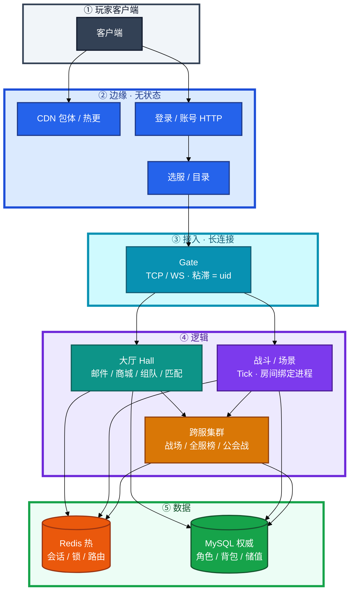
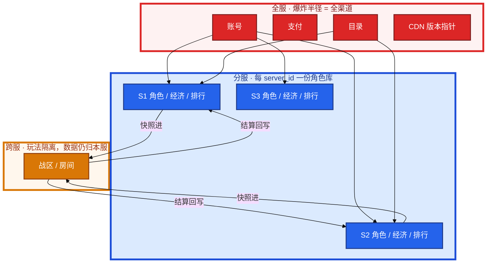
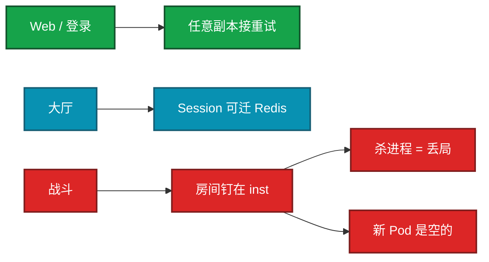
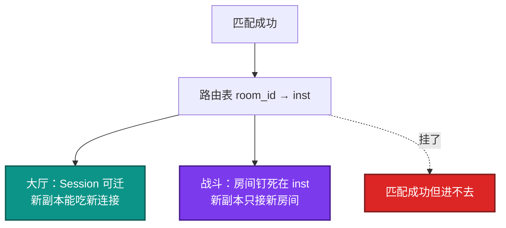
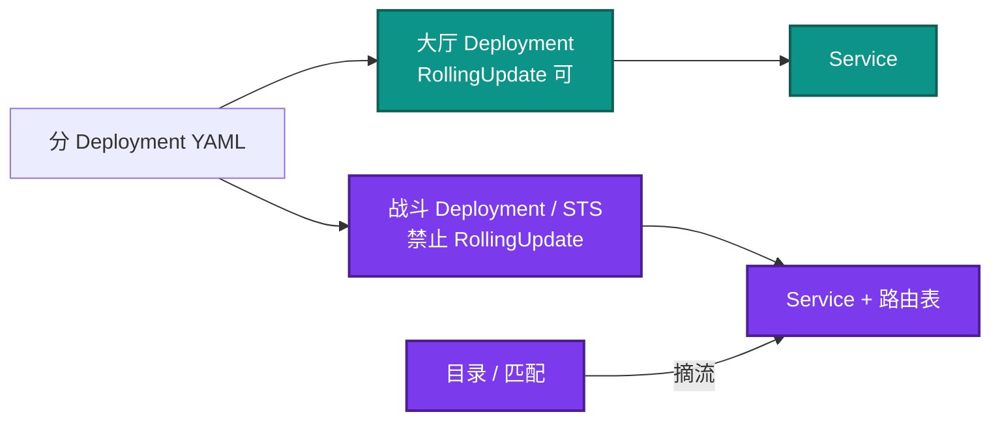
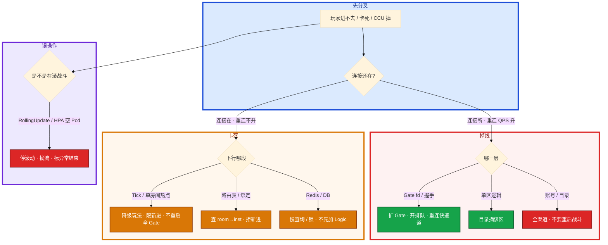

# 游戏服务器架构


公会战进行中。有人把大厅和战斗写成同一个 Deployment，YAML 抄了 Web 的 `maxUnavailable=25%`，准备 `kubectl rollout restart`。另有人说战斗 CPU 90%，先上 HPA。

先别动手。这一章后半全是你会动手的：**怎么拆 Deployment、怎么摘流、怎么发战斗服、进程没了先救哪一层。** 前面的概念和原理，是为了让你动手时不把战斗服当 Web 滚。

**读完你能：** 白板上画出从客户端到库；讲清有状态 / 无状态、分服 / 跨服 / 全服数据边界；战斗服不会抄 `maxUnavailable=25%`；容量账能把 CCU、登录 QPS、写 QPS 拆开。

## 本章目录

缩进 = 上下级。3 下面才是 3.1。

想钉在**正文左边**跟着滚：菜单 **查看 → 打开视图 → 大纲**。Markdown 预览做不到独立左栏，目录只能写在文章开头。

- [1. 基本概念](#1-基本概念)
- [2. 架构图](#2-架构图)
- [3. 原理](#3-原理)
  - [3.1 有状态 vs 无状态](#31-有状态-vs-无状态)
  - [3.2 分服 / 跨服 / 全服](#32-分服--跨服--全服数据边界)
  - [3.3 大厅 vs 战斗](#33-大厅-vs-战斗扩容和发布必须拆开)
  - [3.4 长连接](#34-长连接容量先算连接再算消息)
  - [3.5 CCU 口径](#35-ccu-口径和容量账)
- [4. 安装部署](#4-安装部署)
  - [4.1 生产怎么拆](#41-生产怎么拆)
  - [4.2 K8s 落地](#42-k8s-落地你实际看到什么)
- [5. 核心配置](#5-核心配置)
- [6. 常用命令](#6-常用命令)
- [7. 常用操作](#7-常用操作)
  - [7.1 有状态发布](#71-有状态发布四步)
  - [7.2 进程没了](#72-进程没了怎么救)
  - [7.3 回滚](#73-回滚)
  - [7.4 扩容](#74-扩容)
- [8. 生产排障](#8-生产排障)
- [9. 必会 · 常考](#9-必会--常考)
- [合上书](#合上书问自己)

**本章不讲：** 开服流水线、合服映射 → [02 开服合服](../02-开服合服/)；配置 / 脚本 / 二进制 / 资源 / 强更 → [03 热更新与版本发布](../03-热更新与版本发布/)；登录打爆、排队令牌、选服 → [04 登录排队与选服](../04-登录排队与选服/)；活动三峰、压测、降级开关 → [05 活动高峰与压测](../05-活动高峰与压测/)；CDN、回档、弱网、SLO、出海 → [06](../06-CDN与资源更新/)–[10](../10-出海与多区域/)。

---

## 1. 基本概念

游戏不是「一台大机器跑很多 HTTP」。客户端一条长连接钉在 Gate 上，大厅管社交和匹配，战斗把对局钉在进程内存里。**权威落盘只认 MySQL，Redis 只是热状态。** 账号必须全局，玩法数据必须按服——混在一张库里，后面合服和出海都会炸。

三个不要混：

| 在进程内存里 | 在 Redis 里 | 在 MySQL 里 |
|--------------|-------------|-------------|
| 对局 Tick、AOI、技能 CD、未 flush 的背包变更 | 会话、锁、排行、房间路由 `room_id → inst` | 角色、背包权威、储值、公会 |
| 杀进程 = 丢局 | 丢了可重建，**不能当备份** | 合服、回档、投诉 **只认这里** |

三个角色不要混：

| 角色 | 干什么 | 扩容含义 |
|------|--------|----------|
| **无状态** | 请求不粘进程：登录 API、目录读、CDN | 加副本立刻吃流量 |
| **轻状态** | Session 可序列化到 Redis：大厅、部分匹配 | 可滚可扩，重连后重建 |
| **有状态** | 房间 / 对局钉在进程：战斗、场景、部分跨服战场 | 新副本是空的；旧房间不迁 |

读拓扑时记住三句：

1. **无状态扩的是吞吐，有状态扩的是「还能不能进新房间」。**
2. **单区逻辑炸，只该区；账号 / 支付 / 目录挂，是全渠道。**
3. **Gate 活着不等于能玩**——连接在、下行 Tick 或库死了，玩家看到的是「点了没回包」。

> **记住**：Web 滚的是无状态节点；战斗滚的是正在打的局。先摘流，再动进程。把战斗服当成 Web 抄 `maxUnavailable=25%`，等于主动砍四分之一在线对局。

---

## 2. 架构图

先把整张图钉住。后面拆 Deployment、容量账、排障都对着这张图说话。



图上五条线：

1. **CDN 和登录是两条边。** 包体走 CDN（06）；鉴权 / 选服走登录和目录。
2. **Gate 是长连接总闸。** 粘滞键 = uid / session，不是源 IP。挂了 = 集体断线 + 重连风暴。
3. **大厅可滚可扩；战斗房间钉死在进程。** 进行中的局几乎不能热迁。
4. **跨服只借快照，结算回写本服。** 数据归属仍是 `server_id`。
5. **Redis 丢了可重建；合服、回档只认 MySQL。**

数据边界另钉一张：



---

## 3. 原理

原理只保留动手和面试会用到的：谁能随便杀、数据归谁、大厅和战斗为什么必须拆、容量卡在哪、三个数字为什么不能混。

**本节 5 块：** 3.1 有状态 · 3.2 数据边界 · 3.3 大厅 vs 战斗 · 3.4 长连接 · 3.5 CCU

### 3.1 有状态 vs 无状态

用一个具体动作串起来。公会战进行中，有人在战斗 Deployment 上执行 `kubectl rollout restart`，YAML 里抄了 Web 的 `maxUnavailable=25%`。大厅和战斗还写在同一个 Deployment 里。

系统里发生了什么：K8s 按 25% 先杀掉一批 Pod。Web 请求没有粘在进程上，客户端重试到任意节点即可。游戏这边，对局状态、AOI、技能 CD、未落盘的背包变更都在进程内存。杀进程 = 掉线或丢局，不是 502 再试一次。新起来的副本是空的，旧房间不会迁过去。



| 动作 | Web / 登录 | 大厅 | 战斗 / 场景 |
|------|------------|------|-------------|
| 随便杀进程 | 重试即可 | 重登或从 Redis 重建 | 对局中断、未落盘丢失、投诉刷屏 |
| HPA 加副本 | 立刻吃流量 | 新连接可进新副本 | 新副本是空的，旧房间仍爆 |
| 滚动发布 | 就绪探针过了切走 | 可 RollingUpdate | 先摘流、等局结束或强制结算 |
| 负载均衡 | RR / 随机 | 可迁 Session | 必须粘滞（uid / room_id → 实例） |

K8s 的 Deployment RollingUpdate 是给无状态设计的：按比例杀旧、起新，靠就绪探针切流量。战斗没有「切流量」这回事——长连接还钉在旧 Pod 上，房间也不会迁。`maxUnavailable=25%` 不是更安全，是主动砍 25% 在线对局。这是定级往下打的典型信号。

卡住先看哪：先停滚动，不要再滚回去「补救」——二次结算比一次中断更脏。目录立刻摘掉病实例，房间标异常结束。止血后再拆 Deployment。

生产故事：版本夜把大厅和战斗写成同一个 Deployment，公会战进行中被滚动杀掉。止血不是再滚回去——先停滚动、目录摘掉病实例、房间标异常结束，避免自动拉起后二次结算。发布纪律见第 7 节。

> **记住**：Deployment 的 RollingUpdate、CPU HPA、10 秒 liveness 杀进程，三件套都是 Web 的。抄到战斗服 = 自己制造 P0。

### 3.2 分服 / 跨服 / 全服：数据边界

**分服（分区）**：每个 `server_id` 一份角色库、独立经济、独立排行。好处是爆炸半径小，开新服复制一套即可。代价是同账号多角色、社交割裂、后期要合服（02）。

**跨服**：本服数据仍归属 `server_id`，跨服只借玩家快照进战场，结算回写本服。运维要点：

- 跨服集群独立部署、独立容量，不要和本服逻辑混池
- 路由键是 `match_id / war_id`，不是玩家当前 Gate
- 本服维护时，进行中的跨服局要有「冻结结算 / 强制结束」，不能让跨服去写一个已停写的本服

**全服**：账号、支付、邮件中心、CDN 版本指针，全局只有一份。挂了是全渠道事故，SLO 和变更窗口要比单服严一档。全服组件没有「只灰度 S1」这回事。

数据边界按「谁有权写」划，不要按「进程跑在哪」划：

| 数据 | 归属 | 谁能写 | 挂了的范围 |
|------|------|--------|------------|
| 账号、token | 全服 | 账号服 | 全渠道登录 |
| 支付订单、发货 | 全服 | 支付 | 全渠道储值 |
| 服列表、推荐、`min_client_version` | 全服 | 目录 | 新登录 / 选服；已有长连接通常还在 |
| 角色、背包、本服经济 | 分服 `server_id` | 该区逻辑 | 只该区 |
| 跨服战场快照 | 临时，战区 | 跨服进程 | 关玩法；本服还可玩 |
| 跨服结算结果 | **回写本服** | 跨服 → 本服库 | 本服停写时必须先冻回写 |

具体动作：S1 计划维护，跨服公会战还在打。本服目录标维护、停写。跨服进程不知道，继续把结算往 S1 库里写。

系统里：S1 库已经停写或只读，跨服回写失败或写进一个即将作废的位点。玩家在跨服战场里看到「结算中」，本服打开后背包对不上。

你眼睛看到：本服大厅和已有角色进服其实可以继续；只有跨服入口该关。反过来，本服库挂了，跨服回写必须停，否则写出脏结算。

卡住先看哪：先问「挂的是本服逻辑、跨服集群，还是账号 / 支付 / 目录」。常见误判是跨服挂了就把本服标维护。

| 故障 | 隔离效果 | 玩家感知 |
|------|----------|----------|
| 单区逻辑 OOM | 只该区；目录摘掉该区 | 该区进不去，别区正常 |
| 跨服集群挂 | 本服可玩，跨服玩法关 | 公会战 / 战场进不去 |
| 账号或支付挂 | 全渠道登录或储值失败 | P0，和单区不是一类 |
| 中心 Redis 挂 | 看它存的是会话还是全服锁 | 范围差一个数量级，先问存了什么 |

> **记住**：分服隔离故障；跨服隔离的是玩法不是数据归属；账号 / 支付 / 目录挂了是全渠道。开新服是复制分服环境；合服是合并分服权威库。

### 3.3 大厅 vs 战斗：扩容和发布必须拆开

大厅：登录后常驻，邮件、背包展示、组队、匹配。状态可序列化到 Redis，玩家重连后重建。可以滚动，可以按连接数 / CPU 扩。

战斗：帧 / Tick 驱动，房间绑定进程。进行中的局**没有**「再开一个 Pod 把人迁过去」这种便宜事——除非做了完整的房间迁移（极少卡牌 / SLG 会做，MMO 场景迁移也是专项）。

具体动作：匹配成功，客户端拿到 `room_id`，大厅去查路由表 `room_id → inst`，再把人转到那台战斗进程。



你眼睛看到「匹配成功但进不去」：先查这张路由表和 Gate 绑定，不要先加机器。新 HPA 出来的战斗 Pod 是空的，旧房间仍钉在旧 inst 上。

生产怎么拆：

1. **分 Deployment、分发布策略、分 PDB**，不要共一份 YAML。
2. 战斗服发布：维护窗口，或只对空房间进程摘流；有局的等结束。K8s 上用手动摘流（或 StatefulSet `OnDelete`），不要 RollingUpdate。Deployment 的 `Recreate` 会一次杀光，更糟。
3. PDB：战斗服 `minAvailable` 按「还能不能开新房」算，不是抄 Web 的 20%。
4. 探针：liveness 乱杀战斗进程 = 自己制造 P0。卡死走业务心跳 + 人工 / 熔断，不要 10 秒探失败就杀。readiness 失败不要把有局的进程摘出 Service，除非已经强制结算。
5. 匹配到房间的路由表挂了，先查 `room → inst`，不要先加机器。
6. HPA：登录和大厅可以按 QPS / 连接。战斗可以按「空闲房间数」扩出空进程，不要按 CPU 追已爆的房间。活动前预热水位，比现场 HPA 有用（05）。

常见误判：战斗进程内存升高就自动重启。十次里有八次是房间堆积，不是泄漏。重启 = 集体判负 + 二次结算风险。先看房间数 × 人均内存对不对得上。

> **记住**：大厅扩的是连接；战斗扩的是空房间。CPU 高了加 Pod，救不了已经在打的局。

### 3.4 长连接：容量先算连接，再算消息

客户端到 Gate 是 TCP 或 WebSocket，不是 HTTP 短连接。FPS / MOBA 战斗可能另走 UDP / KCP，那是传输层选型，**会话仍然有状态**。运维保证高防 / 安全组放行、统计丢包和 PPS，不在机房改游戏协议。UDP 被云防火墙默丢：内网通、公网玩家全超时，抓包到边界没出站或没回——和业务 Tick 慢的区分是 Gate 根本收不到包。弱网和对抗体现在 08。

容量卡点按这个顺序查，不要一上来加 Logic：


Gate 单进程 5 万连接很常见，fd 先到顶。2 万 CCU 的 Logic 吃 4～8GB 不稀奇。房间循环到 CPU 70% 就要拆房间，不是再堆连接。Gate 活着、下行死了 = 「连着但没回包」。

**粘滞跟 uid / session token，不跟源 IP。** 加速器和 NAT 把海量玩家变成同一出口 IP，四层哈希会打满单台 Gate。开服日的典型画面：只有一台 Gate 在冒烟，其余空转。修复在应用层做绑定表，或 Gate 集群共享绑定。IP 风控阈值对加速出口要单独做，否则误伤；灰度、封禁同样不要只信源 IP。

绑定表挂了：匹配成功但进错进程或进不去。先查 `room → inst` 和 Gate 绑定，不要先加机器。降级是拒绝新进、保留已有连接，重建绑定后再放。

断线重连：客户端重连拿的是 session，不是重新登录走完整鉴权。Gate 或 Session 存储挂了，会叠加成重连风暴——和登录打爆是两类故障，处理见 04。重连必须绕开登录排队，否则在线玩家掉线后更登不回来。

「连着但点了没回包」走一遍：

1. `ss` 上连接还在，CCU 没掉，重连 QPS 也不升——不是掉线。
2. 沿下行查 Gate 到逻辑的队列、逻辑 Tick、Redis / DB 慢、消息堆积。
3. 单房间热点（活动 BOSS）表现为部分人卡、CCU 不掉。止血：降级该玩法、限新进房间，不重启全部门 Gate。

掉线是连接断、重连 QPS 升；卡死是连接在、重连不升、操作超时。指标要分开。

> **记住**：粘滞跟 uid；容量先 fd，再内存，再 Tick，再下游。Gate 活着只说明门没塌。切了 UDP，CCU 仍是会话人数，不是 TCP fd 数；房间仍然钉在进程上。

### 3.5 CCU 口径和容量账

| 名词 | 含义 | 用来规划什么 |
|------|------|----------------|
| CCU | 某一秒仍持有会话的人数 | Gate / 逻辑的连接和内存 |
| 峰值 CCU | 活动 / 开服最高点 | 买量和开服计划 |
| DAU | 当天来过的人 | 运营，不是机器数 |
| 登录 QPS | 鉴权 + 进服请求速率 | 登录集群；和 CCU 不是线性 |
| 写库 QPS | 落盘 / 发奖 / 战斗结算 | DB；不跟 CCU 线性 |

**禁止**用「注册 100 万所以要 100 万 CCU 的机器」。转化率和在线率差两个数量级。  
**禁止**只压 HTTP health。要压：登录 → 进服 → 拉背包 → 开战 → 结算 → 发奖（05）。

具体动作：策划说目标峰值 CCU = 3 万，问你要多少机器。先把账拆开，不要用一个 CCU 买所有层。

```
目标峰值 CCU = 3 万
单 Logic 舒适 CCU = 2000
  （压测：P95 操作 < 80ms，CPU < 60%，Tick 不破线）
Logic 台数 = 30000 / 2000 × 1.4 余量 ≈ 21
Gate：按连接，单机 2～4 万，再留重连峰值（开服瞬间可到 2×）
登录：按 QPS，开服 10 分钟的登录量 / 600 秒，再乘 3（含重试）
MySQL：按写，不是按 CCU；发奖、邮件、结算才是写高峰
```

单实例舒适值来自压测，不是厂商宣传。换玩法要重测：卡牌和实时对战不是一个数。登录尖峰是秒级、CCU 爬升是分钟级，只按 CCU 扩登录会在开服前 3 分钟被鉴权打死。

观测：`game_ccu{server_id}`、每进程连接数、Tick 耗时、消息堆积、会话 Redis 命中。CCU 10 分钟腰斩是 P0，比 CPU 90% 更值得叫醒。

向策划说「这个活动开不了」时，拿出三峰：登录、玩法 QPS、发奖写，指出硬顶（单服写、热 key、战斗房间），给可承载数字，要产品改发奖节奏或拆服，而不是「再加两台」。加只读从库救不了发奖——发奖是写和行锁。细节在 05。

能扩 vs 硬顶：

| 能扩 | 硬顶 |
|------|------|
| 登录、目录、Gate 连接、大厅、空战斗进程 | 进行中的房间、单服单库写、全服排行一个 key |

> **记住**：CCU 管连接和内存，登录 QPS 管登录集群，写 QPS 管库。三个数混用一定买错机器。

---

## 4. 安装部署

### 4.1 生产怎么拆

| 项 | 选 | 不选 |
|----|----|------|
| 工作负载 | 登录 / 目录 / 大厅 / 战斗 **分 Deployment** | 大厅和战斗共一份 YAML |
| 战斗发布 | 手动摘流；空进程才发；StatefulSet `OnDelete` 可接受 | RollingUpdate、`maxUnavailable=25%`、`Recreate` 一次杀光 |
| PDB | 战斗按「还能开新房」留 `minAvailable` | 抄 Web 的 20% |
| HPA | 登录 / 大厅按 QPS / 连接；战斗按空闲房间数 | 战斗按 CPU 追已爆房间 |
| 探针 | 战斗 liveness 极保守；有局不要因 readiness 摘 Service | 10 秒失败就杀战斗进程 |
| 粘滞 | 应用层 uid / `room_id → inst` | 四层按源 IP 哈希 |
| 跨服 | 独立集群、独立容量 | 和本服逻辑混池 |
| 数据 | 角色库按 `server_id`；账号 / 支付全局 | 账号和玩法混一张库 |

蓝绿只适合无状态登录 / 目录，不适合「房间钉在进程上」的战斗。金丝雀只能对新开房间（匹配按版本分流），不能对已开房间切 5% 流量。

### 4.2 K8s 落地你实际看到什么



验收：进程 Running 不算数。必须：目录不再把新 `room_id` 指到待发实例；房间数降到 0 或已强制结算；flush 之后库里能对上最后一局。

kubelet / 节点失联时，进程可能还在、长连接还活着——先救节点，别为了「做点什么」去重启游戏容器。控制面影响面见 [04-01](../../04-Kubernetes/01-集群架构/)。etcd 挂了 = 不能变更，不是立刻踢玩家。

---

## 5. 核心配置

只动有证据的项。战斗和大厅不要共一份 values。

| 参数 | 登录 / 目录 | 大厅 | 战斗 | 改错会怎样 |
|------|-------------|------|------|------------|
| `strategy` | RollingUpdate | RollingUpdate 可 | 手动摘流 / OnDelete | 战斗 RollingUpdate = 砍在线局 |
| `maxUnavailable` | 按就绪 | 按就绪 | **不要抄 25%** | 主动砍四分之一对局 |
| PDB `minAvailable` | 保登录入口 | 保连接容量 | 按「还能开新房」 | 抄 20% 会在活动中被驱赶 |
| liveness | 常规 | 常规 | 极保守；卡死走业务心跳 | 10 秒杀 = 自己制造 P0 |
| readiness | 失败即摘 | 失败可摘 | **有局不要摘 Service** | 摘了 = 长连接从入口拿掉 |
| HPA 指标 | QPS / 连接 | QPS / 连接 | 空闲房间数 | CPU 追已爆房间 = 空 Pod 堆起来 |
| `restartPolicy` | Always | Always 可 | 受控；先标房间异常 | 乱拉 = 二次结算 |
| 粘滞 | 无 | Session 可迁 | uid / room_id | 源 IP = 加速器打满单台 |

> **记住**：`restartPolicy: Always` 对大厅帮、对战斗害。有状态 OOM 后让 K8s 自动重启当自愈，会二次结算或脏写。

---

## 6. 常用命令

值班先分「掉线还是卡死」，不要只看 CPU。

```bash
ulimit -n
cat /proc/<pid>/limits | grep 'open files'
ss -ant sport = :<gate_port> | wc -l
```

| 目的 | 命令 / 指标 | 看什么 |
|------|-------------|--------|
| 进程 fd | `ulimit -n`、`/proc/<pid>/limits` | Gate 单进程 5 万连接很常见，fd 先到顶 |
| 实际连接 | `ss -ant sport = :<gate_port> \| wc -l` | 对上 CCU 口径；连着但没回包时连接仍在 |
| 在线 | `game_ccu{server_id}` | 10 分钟腰斩 = P0 |
| 每进程连接 | 进程级 gauge | 是否单台 Gate 被加速器打满 |
| Tick | 战斗 Tick P95 | 破线先拆房间，不是再堆连接 |
| 消息堆积 | Gate → 逻辑队列 | 「点了没回包」先看这里 |
| 房间 | 房间数、空闲房间、单房人数 | 内存升高先对房间 × 人均 |
| 路由 | `room_id → inst` 命中 | 匹配成功但进不去 |

指标要分开：连接数、重连 QPS、操作成功率。不要用一个「登录失败」总数糊弄。重连 QPS 升 = 掉线；连接在、重连不升、操作超时 = 卡死。

---

## 7. 常用操作

### 7.1 有状态发布四步

滚动前固定四步，缺一步就不要发：


1. 目录或匹配摘流，不再往这台分配新人。
2. 等房间清空，或到点强制结算（要产品签字，会有客诉）。
3. 确认脏数据已落盘（定期 snapshot + 下线 flush）。
4. 再发版本、再上线、再挂回流。

你眼睛看到的门禁：匹配不再把新 `room_id` 指到这台；房间数降到 0 或已强制结算；flush 之后库里能对上最后一局。四步里任何一步没做，就是在赌未落盘。

大厅轻状态，Session 可落到 Redis，可以滚动。战斗是 Tick 驱动、房间绑定进程。K8s 上战斗服不要抄 Web 的 PDB 百分比。

### 7.2 进程没了怎么救

先拆「单实例还是一片、大厅还是战斗」：

1. **战斗**：优先恢复该实例或把房间标异常结束，避免反复结算。不要让 `restartPolicy` 乱拉。
2. **大厅**：可以拉起并从 Redis 重建 Session。
3. **Gate**：扩 Gate、打开排队（04），避免重连打死登录。不要先重启还活着的逻辑服。
4. 目录立刻摘掉病服，防止匹配继续往里塞。
5. 恢复后校验未落盘：以 DB 为准，内存当丢失。复盘加房间上限和摘流，不是只加内存。

kubelet / 节点失联时，进程可能还在、长连接还活着——先救节点，别为了「做点什么」去重启游戏容器。

怎么快速判断堆积还是泄漏：房间数 × 人均内存是否对得上；空房间是否内存不回。对得上是容量，对不上是泄漏或未释放。对得上就扩空进程 / 降级新进，不要重启有局的进程。

### 7.3 回滚

战斗发版回滚 **不是** `kubectl rollout undo` 再杀一轮。二次结算比一次中断更脏。

1. 停滚动 / 停 undo。
2. 目录立刻摘掉病实例，房间标异常结束。
3. 未落盘以 DB 为准。
4. 空进程或新窗口再发旧镜像；有局的等结束，不要用 undo 补救。

大厅可以 RollingUpdate undo。登录 / 目录无状态，蓝绿切回即可。全服组件（账号 / 支付 / 目录 / CDN 指针）灰度更小、窗口更严、回滚更快——不要拿单服热更的随意度改全局登录。目录挂了，已经打上的长连接通常还能玩；新登录、选服会失败。止血是目录降级出缓存列表（04），不要为了目录去重启战斗服。

### 7.4 扩容

- **登录 / 目录**：按 QPS，好扩。
- **Gate**：提前扩连接容量；扩完 **不会** 自动迁走已有连接。
- **大厅**：按连接 / CPU 扩，新连接进新副本。
- **战斗**：按空闲房间数预开空进程；不要按 CPU 追已爆的房间。活动前预热水位，比现场 HPA 有用。
- **跨服**：提前扩战区 / 房间池；本服加机器救不了跨服。

---

## 8. 生产排障

和 Kubernetes 同一套三问：进程还在不在？还能不能变更？已有流量还通不通？游戏再加一问：**掉线还是卡死？**



现场顺序：

```bash
# 连接还在不在、重连 QPS 升没升、操作成功率
ss -ant sport = :<gate_port> | wc -l
# game_ccu{server_id}  10 分钟腰斩 = P0
# 房间数 × 人均内存  对得上 = 容量，对不上 = 泄漏
# room_id → inst 路由是否还在
```

| 现象 | 先做什么 | 不要做什么 |
|------|----------|------------|
| 战斗 RollingUpdate 中 CCU 掉 | 停滚动，目录摘病实例，房间标异常 | 再 undo 一轮 |
| 只有一台 Gate 冒烟 | 粘滞改 uid；查加速器出口 | 先加 Logic |
| 匹配成功但进不去 | 查 `room → inst` 和 Gate 绑定 | 先加机器 |
| 连着但没回包 | 沿下行查队列 / Tick / DB | 重启全部门 Gate |
| 战斗 CPU 90%、HPA 加空 Pod | 停按 CPU 扩；限新进 | 指望新 Pod 接走旧房间 |
| 战斗内存高 | 先对房间 × 人均 | 自动重启 |
| 跨服挂 | 关跨服入口，本服继续 | 把本服标维护 |
| 目录挂 | 降级出缓存列表 | 重启战斗服 |
| 节点失联 | 先救节点；进程可能还在 | 重启还活着的游戏容器 |
| CCU 10 分钟腰斩 | P0；分掉线和卡死 | 只看 CPU 90% |

活动高峰 etcd 和日志同盘、控制面超时，正确处理：确认进程还在 → 停止发版和重启战斗服 → 救盘 / quorum → 恢复后先 `get nodes`，再补自愈。etcd 不可用 = 不能变更，不是立刻踢玩家。

常见误判：用 Web 的 PDB / HPA / liveness 套战斗服；有状态 OOM 后让 K8s 自动重启当自愈；CCU 掉了先重启 Gate；登录失败先重启战斗。

---

## 9. 必会 · 常考

白板和追问高频，能一口回：

| 说法 | 对错 | 口径 |
|------|:----:|------|
| 战斗服可以抄 Web 的 `maxUnavailable=25%` | 错 | 等于砍四分之一在线对局 |
| 大厅和战斗可以同一个 Deployment | 错 | 分 Deployment、分策略、分 PDB |
| HPA 按 CPU 能救已爆的战斗房间 | 错 | 新 Pod 是空的；按空闲房间数预开 |
| 跨服挂了应把本服标维护 | 错 | 关跨服入口，本服可玩 |
| 跨服数据归属在跨服集群 | 错 | 快照进、结算回写本服 |
| 账号 / 支付挂了只影响一区 | 错 | 全渠道 |
| 粘滞按源 IP 即可 | 错 | 加速器打满单台；跟 uid |
| Redis 可以当合服 / 回档权威 | 错 | 权威在 MySQL；Redis 丢了可重建 |
| 注册 100 万就要 100 万 CCU 的机器 | 错 | 转化 / 在线率差两个数量级 |
| 只压 HTTP health 就算压过活动 | 错 | 要压进服、开战、结算、发奖 |
| 加只读从库能抗全服发奖 | 错 | 发奖是写和行锁 |
| Gate 活着就能玩 | 错 | 下行 Tick / 库死了是「点了没回包」 |
| liveness 10 秒失败杀战斗进程更安全 | 错 | 自己制造 P0 |
| 战斗内存高应自动重启释放 | 错 | 先对房间 × 人均；重启可能二次结算 |
| UDP 换了传输层就变成无状态 | 错 | 房间仍钉在进程上 |
| 全服登录配置可以按一个 `server_id` 灰度 | 错 | 全服没有「只灰度 S1」 |
| `rollout undo` 能补救正在滚的战斗服 | 错 | 二次结算更脏；先停、摘流、标异常 |

数字：单 Logic 舒适 CCU 来自压测（例：2000，CPU &lt; 60%，P95 &lt; 80ms）；3 万 CCU × 1.4 余量 ≈ 21 台 Logic；Gate 单机 2～4 万连接，开服重连按 2×；登录按 10 分钟量 / 600 秒再乘 3；CCU 10 分钟腰斩 = P0；房间 Tick CPU 70% 拆房间。

易混：无状态 vs 轻状态 vs 有状态；分服 vs 跨服 vs 全服；掉线 vs 卡死；CCU vs 登录 QPS vs 写 QPS；大厅滚动 vs 战斗摘流；扩空进程 vs 迁已开房间。

---

## 合上书，问自己

1. 从客户端到库有哪几层？权威在哪、热状态在哪？
2. 有状态和无状态差在哪？为什么不能把战斗服当 Deployment 滚？
3. 分服、跨服、全服的数据归属和爆炸半径？本服维护时跨服回写怎么办？
4. 大厅和战斗的 Deployment / PDB / HPA / 探针怎么拆？
5. 粘滞为什么不能跟源 IP？容量卡点按什么顺序查？
6. CCU、登录 QPS、写 QPS 各规划哪一层？有状态发布四步是什么？进程没了先问哪句？

六题都能口述，这一章就过了。下一章把开服门禁和合服一致性剖开：五段流水线、映射表、失败为什么禁止反向再迁。
