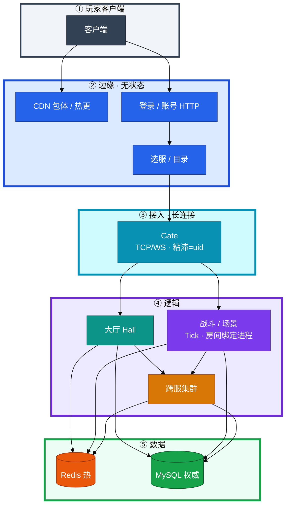
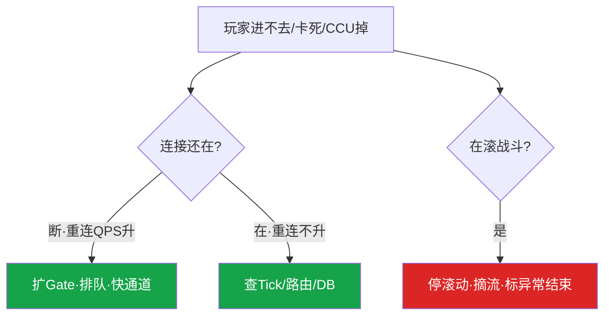

# 游戏服务器架构


公会战进行中，有人把大厅和战斗写成同一个 Deployment，YAML 抄了 Web 的 `maxUnavailable=25%`。这一章只做一件事——**先分清有状态 / 无状态，再决定怎么摘流、怎么扩、怎么发版**。

**本章主线（排障就按这三步想）：**

1. **分层**：客户端 → CDN/登录/目录 → Gate → 大厅/战斗/跨服 → Redis/MySQL；权威在 MySQL，Redis 是热状态。
2. **归类**：无状态扩吞吐，有状态扩空房间；分服隔离故障，跨服隔离玩法，账号/支付/目录挂是全渠道。
3. **留证**：战斗发布先摘流四步；进程没了先问掉线还是卡死，再决定救哪一层。

**读完你能：** 白板上画出从客户端到库；讲清有状态/无状态、分服/跨服/全服边界；战斗服不会抄 `maxUnavailable=25%`；容量账把 CCU、登录 QPS、写 QPS 拆开。

## 本章目录

- [1. 基本概念](#1-基本概念)
- [2. 架构图](#2-架构图)
- [3. 原理](#3-原理)
- [4. 落地](#4-落地)
- [5. 核心配置](#5-核心配置)
- [6. 命令与操作](#6-命令与操作)
- [7. 生产排障](#7-生产排障)
- [8. 必会 · 常考](#8-必会--常考)
- [合上书](#合上书问自己)

**本章不讲：** 开服流水线、合服映射 → [02](../02-开服合服/)；热更五类 → [03](../03-热更新与版本发布/)；登录排队、ticket → [04](../04-登录排队与选服/)；活动三峰、压测 → [05](../05-活动高峰与压测/)；CDN、回档、弱网、SLO、出海 → [06](../06-CDN与资源更新/)–[10](../10-出海与多区域/)。

---

## 1. 基本概念

游戏不是「一台大机器跑很多 HTTP」。客户端长连接钉在 Gate，大厅管社交和匹配，战斗把对局钉在进程内存。**权威落盘只认 MySQL，Redis 只是热状态。**

| 在进程内存里 | 在 Redis 里 | 在 MySQL 里 |
|--------------|-------------|-------------|
| 对局 Tick、AOI、技能 CD、未 flush 背包 | 会话、锁、排行、房间路由 | 角色、背包权威、储值、公会 |
| 杀进程 = 丢局 | 丢了可重建，**不能当备份** | 合服、回档、投诉 **只认这里** |

三个角色不要混：

| 角色 | 干什么 | 扩容含义 |
|------|--------|----------|
| **无状态** | 登录 API、目录读、CDN | 加副本立刻吃流量 |
| **轻状态** | Session 可序列化到 Redis：大厅、部分匹配 | 可滚可扩，重连后重建 |
| **有状态** | 房间/对局钉在进程：战斗、场景、跨服战场 | 新副本是空的；旧房间不迁 |

> **记住：** 无状态扩的是吞吐，有状态扩的是「还能不能进新房间」。Web 滚的是无状态节点；战斗滚的是正在打的局。抄 `maxUnavailable=25%` = 主动砍四分之一在线对局。

---

## 2. 架构图



**读图三句话：**

1. CDN 和登录是两条边；Gate 是长连接总闸，粘滞键 = uid/session。
2. 大厅可滚可扩；战斗房间钉死在进程，进行中的局几乎不能热迁。
3. 跨服只借快照，结算回写本服；Redis 丢了可重建，合服回档只认 MySQL。

数据边界：

| 数据 | 归属 | 挂了范围 |
|------|------|----------|
| 账号、token、支付 | 全服 | 全渠道 |
| 服列表、`min_client_version` | 全服 | 新登录/选服 |
| 角色、背包、本服经济 | 分服 `server_id` | 只该区 |
| 跨服结算 | **回写本服** | 本服停写须冻回写 |

---

## 3. 原理

### 3.1 有状态 vs 无状态

**一句话：** Deployment RollingUpdate 是给无状态设计的；战斗没有「切流量」——长连接钉在旧 Pod，房间不会迁。

| 动作 | Web/登录 | 大厅 | 战斗/场景 |
|------|----------|------|-----------|
| 随便杀进程 | 重试即可 | 重登或 Redis 重建 | 对局中断、未落盘丢失 |
| HPA 加副本 | 立刻吃流量 | 新连接可进新副本 | 新副本是空的，旧房间仍爆 |
| 滚动发布 | 就绪探针过了切走 | 可 RollingUpdate | 先摘流、等局结束或强制结算 |

> **记住：** Deployment RollingUpdate、CPU HPA、10 秒 liveness 杀进程，三件套都是 Web 的。抄到战斗服 = 自己制造 P0。

### 3.2 分服 / 跨服 / 全服

**一句话：** 数据边界按「谁有权写」划，不按「进程跑在哪」划。

S1 计划维护、跨服公会战还在打：本服停写后跨服仍回写 → 脏结算。止血：关跨服入口或冻回写，不要把本服标维护（除非跨服回写卡住停写）。

| 故障 | 隔离效果 |
|------|----------|
| 单区逻辑 OOM | 只该区 |
| 跨服集群挂 | 本服可玩，跨服玩法关 |
| 账号或支付挂 | 全渠道 P0 |

### 3.3 大厅 vs 战斗

**一句话：** 大厅扩的是连接；战斗扩的是空房间。CPU 高了加 Pod，救不了已经在打的局。

生产怎么拆：分 Deployment、分 PDB、分发布策略。战斗：维护窗口或只对空房间摘流；PDB 按「还能开新房」算；liveness 极保守；HPA 按空闲房间数，不按 CPU 追已爆房间。

### 3.4 长连接容量

**一句话：** 粘滞跟 uid/session，不跟源 IP；容量先 fd，再内存，再 Tick，再下游。


掉线 = 连接断、重连 QPS 升；卡死 = 连接在、重连不升、操作超时。Gate 活着只说明门没塌。

### 3.5 CCU 口径和容量账

**一句话：** CCU 管连接和内存，登录 QPS 管登录集群，写 QPS 管库——三个数混用一定买错机器。

```
目标峰值 CCU = 3 万
单 Logic 舒适 CCU = 2000（压测：P95<80ms，CPU<60%）
Logic 台数 = 30000/2000 × 1.4 ≈ 21
Gate：单机 2～4 万连接，开服重连按 2×
登录：开服 10 分钟量/600 × 3（含重试）
MySQL：按写 QPS，不是 CCU
```

| 能扩 | 硬顶 |
|------|------|
| 登录、Gate、大厅、空战斗进程 | 进行中房间、单服单库写、全服排行一个 key |

---

## 4. 落地

| 项 | 选 | 不选 |
|----|----|------|
| 工作负载 | 登录/目录/大厅/战斗 **分 Deployment** | 大厅战斗共 YAML |
| 战斗发布 | 手动摘流；空进程才发；OnDelete 可接受 | RollingUpdate、`maxUnavailable=25%` |
| HPA | 登录/大厅按 QPS/连接；战斗按空闲房间 | 战斗按 CPU 追已爆房间 |
| 粘滞 | uid / `room_id→inst` | 四层按源 IP 哈希 |
| 跨服 | 独立集群、独立容量 | 和本服逻辑混池 |

蓝绿只适合无状态登录/目录。金丝雀只能对新开房间（匹配按版本分流），不能对已开房间切 5% 流量。

验收：进程 Running 不算数——目录不再指新 `room_id` 到待发实例；房间数降到 0 或已强制结算；flush 后库能对上最后一局。

---

## 5. 核心配置

| 参数 | 登录/目录 | 大厅 | 战斗 | 改错会怎样 |
|------|-----------|------|------|------------|
| `strategy` | RollingUpdate | RollingUpdate 可 | 手动摘流/OnDelete | 战斗 RollingUpdate = 砍在线局 |
| `maxUnavailable` | 按就绪 | 按就绪 | **不要抄 25%** | 主动砍四分之一对局 |
| PDB `minAvailable` | 保登录入口 | 保连接容量 | 按「还能开新房」 | 抄 20% 活动中被驱赶 |
| liveness | 常规 | 常规 | 极保守 | 10 秒杀 = P0 |
| readiness | 失败即摘 | 失败可摘 | **有局不要摘 Service** | 摘了 = 长连接从入口拿掉 |
| HPA | QPS/连接 | QPS/连接 | 空闲房间数 | CPU 追已爆房间 = 空 Pod 堆起来 |

> **记住：** `restartPolicy: Always` 对大厅帮、对战斗害。有状态 OOM 后让 K8s 自动重启 = 二次结算或脏写。

---

## 6. 命令与操作

### 6.1 第一眼：掉线还是卡死

```bash
ulimit -n
cat /proc/<pid>/limits | grep 'open files'
ss -ant sport = :<gate_port> | wc -l
```

典型输出（Gate fd 接近上限）：

```text
65535
Max open files            65535                65535                files
48231
```

| 目的 | 命令/指标 | 看什么 |
|------|-----------|--------|
| 进程 fd | `ulimit -n`、`/proc/<pid>/limits` | Gate 5 万连接常见，fd 先到顶 |
| 实际连接 | `ss -ant sport = :<port> \| wc -l` | 对着 CCU；卡死时连接仍在 |
| 在线 | `game_ccu{server_id}` | 10 分钟腰斩 = P0 |
| Tick | 战斗 Tick P95 | 破线先拆房间 |
| 路由 | `room_id → inst` | 匹配成功但进不去 |

### 6.2 有状态发布四步


### 6.3 进程没了 / 回滚 / 扩容

- **战斗**：恢复实例或标异常结束；不要让 `restartPolicy` 乱拉。
- **大厅**：拉起并从 Redis 重建 Session。
- **Gate**：扩 Gate、开排队（04），不要先重启还活着的逻辑服。
- **回滚**：停滚动/停 undo → 目录摘病实例 → 房间标异常结束 → 未落盘以 DB 为准。`rollout undo` 再杀一轮 = 二次结算。
- **扩容**：Gate 扩完不会迁走已有连接；战斗按空闲房间预开空进程，活动前预热（05）。

---

## 7. 生产排障

| 现象 | 先做 | 别做 |
|------|------|------|
| 战斗 RollingUpdate 中 CCU 掉 | 停滚动，目录摘病实例，标异常结束 | 再 undo 一轮 |
| 只有一台 Gate 冒烟 | 粘滞改 uid；查加速器出口 | 先加 Logic |
| 匹配成功但进不去 | 查 `room→inst` 和 Gate 绑定 | 先加机器 |
| 连着但没回包 | 查队列/Tick/DB | 重启全部门 Gate |
| 战斗 CPU 90%、HPA 空 Pod | 停按 CPU 扩；限新进 | 指望新 Pod 接旧房间 |
| 战斗内存高 | 先对房间 × 人均 | 自动重启 |
| 跨服挂 | 关跨服入口，本服继续 | 把本服标维护 |
| CCU 10 分钟腰斩 | P0；分掉线和卡死 | 只看 CPU 90% |



---

## 8. 必会 · 常考

| 说法 | 对错 | 口径 |
|------|:----:|------|
| 战斗服抄 Web `maxUnavailable=25%` | 错 | 砍四分之一在线对局 |
| 大厅和战斗同一 Deployment | 错 | 分 Deployment、策略、PDB |
| HPA 按 CPU 救已爆战斗房间 | 错 | 新 Pod 是空的 |
| 跨服挂了应把本服标维护 | 错 | 关跨服入口 |
| 跨服数据归属在跨服集群 | 错 | 快照进、结算回写本服 |
| 粘滞按源 IP | 错 | 加速器打满单台 Gate |
| Redis 可当合服/回档权威 | 错 | 权威在 MySQL |
| 注册 100 万要 100 万 CCU 机器 | 错 | 转化/在线率差两个数量级 |
| 只压 HTTP health 算压过活动 | 错 | 要压进服、开战、结算、发奖 |
| 加只读从库抗全服发奖 | 错 | 发奖是写和行锁 |
| `rollout undo` 能补救滚战斗服 | 错 | 二次结算更脏 |
| liveness 10 秒失败杀战斗进程更安全 | 错 | 自己制造 P0 |
| 战斗内存高应自动重启 | 错 | 先对房间×人均 |
| UDP 换了传输层就变成无状态 | 错 | 房间仍钉进程 |
| 全服登录配置可以只灰度 S1 | 错 | 全服没有只灰度 S1 |
| Gate 活着就能玩 | 错 | 下行 Tick/库死了 |

数字：单 Logic 舒适 CCU 来自压测（例 2000）；3 万 CCU×1.4≈21 台 Logic；Gate 单机 2～4 万；开服重连按 2×；登录按 10 分钟量/600×3；CCU 10 分钟腰斩=P0；房间 Tick CPU 70% 拆房间。

易混：无状态 vs 轻状态 vs 有状态；掉线 vs 卡死；CCU vs 登录 QPS vs 写 QPS；大厅滚动 vs 战斗摘流。

---

## 合上书，问自己

1. 从客户端到库有哪几层？权威在哪、热状态在哪？
2. 为什么不能把战斗服当 Deployment 滚？
3. 本服维护时跨服回写怎么办？
4. 大厅和战斗的 Deployment/PDB/HPA/探针怎么拆？
5. 粘滞为什么不能跟源 IP？容量卡点顺序？
6. 有状态发布四步是什么？CCU、登录 QPS、写 QPS 各规划哪层？

六题能口述，这一章就过了。下一章：[开服与合服](../02-开服合服/)——五段流水线、映射表、失败为什么禁止反向再迁。
