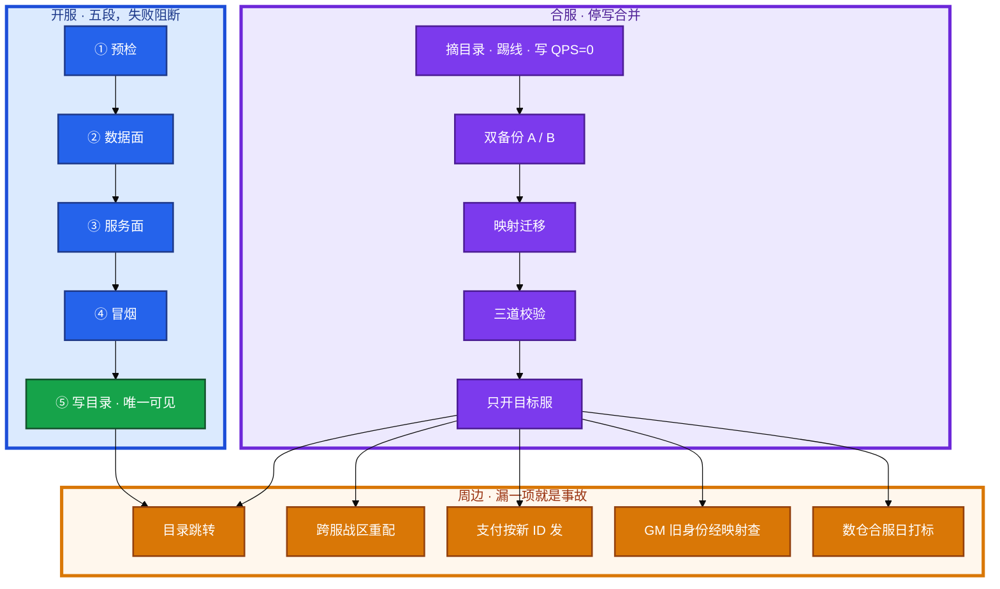
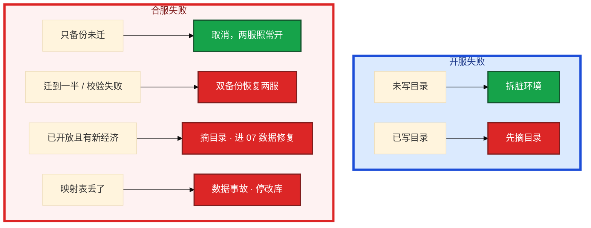
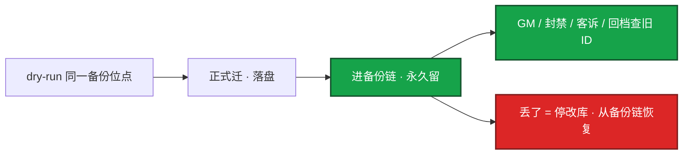
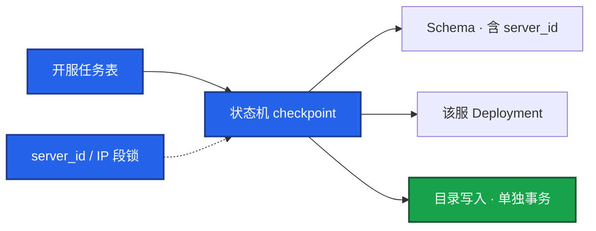
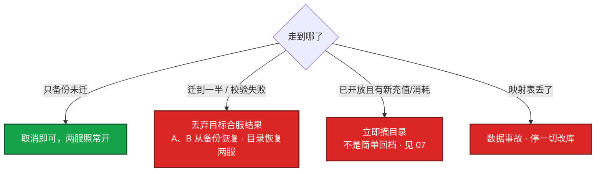
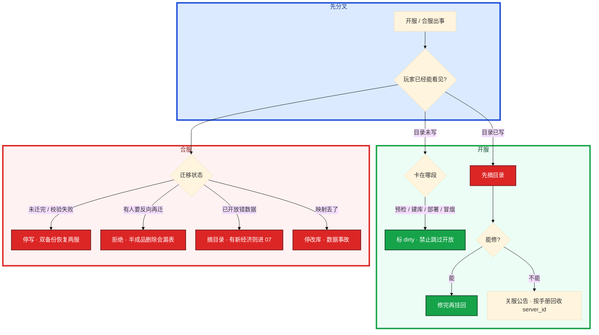

# 开服与合服


开新服玩家已经能在列表里点进去，库却是空的。合服迁到一半，群里有人建议「反向再迁回去」。另有人要把合服塞进周日版本夜「顺便做」。

先别动手。这一章后半全是你会动手的：**开服五段门禁、合服映射与三道校验、失败怎么回滚、窗口超时怎么办。** 前面的概念和原理，是为了让你动手时不把半成品开放出去。

**读完你能：** 把开服讲成五段且只有最后一步对玩家可见；合服冲突能按表处理并永久留映射；失败回滚是恢复两份备份，不是反向再迁；窗口超时拒绝加时。

## 本章目录

缩进 = 上下级。3 下面才是 3.1。

想钉在**正文左边**跟着滚：菜单 **查看 → 打开视图 → 大纲**。Markdown 预览做不到独立左栏，目录只能写在文章开头。

- [1. 基本概念](#1-基本概念)
- [2. 架构图](#2-架构图)
- [3. 原理](#3-原理)
  - [3.1 开服五段](#31-开服五段最后一步才可见)
  - [3.2 合服冲突](#32-合服冲突策略)
  - [3.3 为什么停写](#33-为什么主流是停写不是在线双写)
  - [3.4 窗口](#34-窗口怎么定谁能改)
- [4. 安装部署](#4-安装部署)
  - [4.1 生产怎么选](#41-生产怎么选)
  - [4.2 流水线落地](#42-流水线落地你实际看到什么)
- [5. 核心配置](#5-核心配置)
- [6. 常用命令](#6-常用命令)
- [7. 常用操作](#7-常用操作)
  - [7.1 开服](#71-开服)
  - [7.2 开服回滚](#72-开服失败回滚)
  - [7.3 合服](#73-合服窗口内步骤)
  - [7.4 合服回滚](#74-合服失败回滚)
  - [7.5 周边](#75-周边系统)
- [8. 生产排障](#8-生产排障)
- [9. 必会 · 常考](#9-必会--常考)
- [合上书](#合上书问自己)

**本章不讲：** 分服 / 跨服拓扑、有状态摘流 → [01 游戏服务器架构](../01-游戏服务器架构/)；热更、强更、版本兼容 → [03 热更新与版本发布](../03-热更新与版本发布/)；目录、选服、排队、创角热点 → [04 登录排队与选服](../04-登录排队与选服/)；合服后回档、映射表二次伤害 → [07 玩家数据备份与回档](../07-玩家数据备份与回档/)；数仓口径、事故定级 → [09 游戏 SRE 稳定性](../09-游戏SRE稳定性/)。

---

## 1. 基本概念

开服不是 `kubectl apply` 完事。合服不是「两个库 dump 进一个库」。

| | 开服 | 合服 |
|--|------|------|
| 本质 | 复制一套分服环境并最后写目录 | 合并两份分服权威库 |
| 权威 | 新建带 `server_id` 的库 | MySQL（角色库）；**Redis 作废重建** |
| 对玩家可见 | 只有写目录那一步 | 目录切到目标服、源服标已合并 |
| 失败回滚 | 未开放拆脏环境；已开放先摘目录 | **恢复合服前两份备份**，禁止反向再迁 |
| 窗口 | 可以白天（新服没人） | 低峰；超时回滚，不现场加时 |

三个不要混：

| 对象 | 干什么 |
|------|--------|
| **`server_id`** | 分服身份。分配要落库；回收写手册，防串服和错回档 |
| **映射表** | `old(server_id,id) → new_id`。合服产物，永久保留 |
| **目录** | 总闸。没写进去，外面看不到；写进去再发现库空，就是开服事故 |

> **记住**：apply 成功不是开服成功。目录没写，外面看不见；目录写了库却空，就是开服事故。合服回滚是恢复两份备份，不是反向再迁。

---

## 2. 架构图

先把开服和合服两条路钉住。后面门禁、命令、排障都对着这张图说话。



图上三条线：

1. **开服 ①～④ 玩家看不见。** 卡在哪段就停在哪段，不要自动吞错继续。
2. **合服以库为准，Redis 热状态作废重建。** 映射表是产物，不是临时文件。
3. **库迁完只做了一半。** 目录、跨服、支付、数仓、映射查询，漏一项就是事故。

回滚分叉：



---

## 3. 原理

原理只保留动手和面试会用到的：哪一步对玩家可见、冲突怎么解、为什么不停写双写、窗口谁能改。

**本节 4 块：** 3.1 开服五段 · 3.2 冲突 · 3.3 停写 · 3.4 窗口

### 3.1 开服五段：最后一步才可见

标准五段，**每段失败阻断**，不要自动吞掉错误继续。服列表是总闸。

具体动作：变更单要开 S201。脚本开始跑。你盯的不是「Job 绿了」，是每一段有没有留下可重入的状态。

| 段 | 做什么 | 失败 |
|----|--------|------|
| ① 预检 | 镜像/配置版本钉死（禁 latest）；配额、磁盘、IP、证书；中心服（账号、支付、目录）健康；该 `server_id` 未占用、无上次失败残留 | 修配额/版本，重跑；玩家不可见 |
| ② 数据面 | 建库 / Schema（命名含 `server_id`）；导静态表（道具、关卡、掉落）；初始化 Redis（服配置、活动开关默认关）；写入 `server_id`、开服时间、渠道 | 删脏 Schema，禁止在半成品上重入 |
| ③ 服务面 | Gate / 大厅 / 逻辑 / 必要跨服依赖；该服独立配置（端口、DB、路由）；**尚未挂到公网目录** | 拆该服 Deployment，保留日志 |
| ④ 冒烟 | 测试账号走：登录 → 创角 → 进场景 → 战斗结算 → 发一封邮件；查进程、fd、DB 连接、配置版本号 | 标 dirty，不开放，不跳过 |
| ⑤ 开放 | 目录写入：状态=新服、推荐；打开注册 / 创角开关；渠道公告（CDN 不必为开服单独出包） | 已可见 → 先摘目录 |

你眼睛看到什么：开服任务表里有步骤、版本、操作者、日志；目录写入是单独事务。`kubectl get po` 全 Running 只说明③过了，④没过就不能⑤。冒烟必须用测试账号走完整路径，不要用生产玩家，也不要只打 health。

卡住先看哪：卡在①修配额 / 版本；卡在②删脏 Schema，禁止在半成品上重入；卡在④标 dirty，不跳过开放。已经写进目录再发现库空，先摘目录，这是事故不是「再导一次表」。

耗时口径（用自己的数）：单服 8～15 分钟；活动日并行开 N 服，要有并发锁（同一 `server_id`、同一批 IP 段）。并行不是无脑 fork，DB 实例和镜像预热会先打满。开服可以在白天（新服本来就没人）。合服不行。

一天开 20 服，先卡的是镜像拉取、IP / 配额、DB 实例建库速率、目录写、并行锁，不是逻辑进程 CPU。要预热镜像和连接，分批而不是 20 路齐发。目录写入也要限速。开服写入不该和玩家选服共用一条无保护的写路径（04）。

脚本跑到一半机器重启：每段可重入。预检看状态机，建库前检查 Schema 是否完整，部署 apply 幂等，开放步骤独立且有锁。半成品标 dirty，宁可重建不续写未知状态。`server_id` 分配要落库，不要无状态地「再跑一遍 insert」。答「脚本 for 循环」过不了关。

不要做：冒烟失败仍开放、用生产玩家当冒烟、开服脚本里写死密码、开完才发现镜像是上周的。

> **记住**：apply 成功不是开服成功。目录没写，外面看不见；目录写了库却空，就是开服事故。

### 3.2 合服冲突策略

合服是数据迁移。权威在 MySQL（或你们的角色库），Redis 是热状态，**合服以库为准，Redis 作废重建**。

必须先定的冲突策略：

| 冲突 | 生产常见做法 | 不能做的 |
|------|----------------|----------|
| 角色主键 / 区内自增 uid | 合服前生成 `old(server_id,id) → new_id` 映射表，所有外键跟着改 | 两边主键直接 insert 撞车 |
| 角色名 | 被合入方加后缀 + 改名卡补偿 | 静默改名不通知 |
| 公会名 / 公会 ID | 同名加后缀；成员列表按映射重写 | 两个同名公会直接叠成员 |
| 好友 / 黑名单 | 按映射改 ID；跨已删服的关系丢弃并记录 | 残留指向已删除 server 的 ID |
| 排行榜 | 合服后按规则重算，不拼接两份榜 | 分数直接 append |
| 邮件 / 拍卖 / 全服用唯一道具 | 按全局唯一约束迁移，冲突走工单 | 复制一份神器给两个人 |
| 经济（钻石、绑玉） | 原样迁移 + 合服后产出监控 | 「平衡经济」现场改数字 |

映射表本身是合服产物，要落盘、进备份、**永久保留**。合服后客诉、回档、封禁、GM 查旧 `server_id + role_id` 都靠它。映射表丢了视为数据事故，停止一切改库，从备份链恢复。`/tmp` 里的映射表不算留存。

好友指向已删除服的 ID：丢弃并记日志，不要留悬挂指针。玩家侧表现为好友消失，比点进去报错好。排行不拼接两份榜，按合并后角色重算；活动期榜要产品定规则：作废、按比例、或提前结束活动再合。分数 append 会把两套经济叠在一张榜上，发奖必炸。合服窗口尽量避开活动结算；避不开就先结束活动再迁。

邮件、拍卖、公会成员漏一张表就是事故。经济现场「调平衡」属于裸改，不做。

校验至少三道，少一道都能把脏服开放出去：

1. **计数**：角色 / 充值单 / 道具种类
2. **金额**：储值累计必须对得上
3. **抽样**：高 V、公会会长、邮件未领

> **记住**：主键必须映射，外键全跟着改。映射表永久留；丢了 = 数据事故。排行重算不拼接。唯一道具冲突走工单。

映射表生命周期（合服冲突与回档绑在一起，07 只处理「已经开放后的数据修复」，本章先保证映射还在）：



合服后回档必须带映射：回档到合服前 = 两份备份分别拉起，和 7.4 同一条路；回档到合服后某一时刻 = 在目标服上按新 ID 回，客服仍用旧 `server_id + role_id` 经映射定位。映射丢了，回档圈人圈不准，二次伤害见 07。禁止合服后立刻用旧 ID 对目标库裸改「修冲突」——那是绕过映射的第二份脏数据。

外键漏改的典型清单，迁之前当检查表，不是迁完再想：

| 表 / 关系 | 跟着映射改 | 漏了的表现 |
|-----------|------------|------------|
| 背包、装备、宝石 | 是 | 登录空包或串号 |
| 公会成员、职位 | 是 | 会长消失、两人同会 |
| 好友、黑名单、仇敌 | 是 | 点进去报错或指向幽灵 |
| 邮件发件 / 收件 | 是 | 未领附件领到别人号 |
| 拍卖、交易记录 | 是 | 成交后发错货 |
| 跨服战区报名名单 | 是 | 合服后战场认不出人 |

### 3.3 为什么主流是停写，不是在线双写

卡牌 / SLG 主流仍是停写合并。游戏有状态 + 强一致经济，在线双写窗口更难证明两边一致，房间和背包锁跨服。双写适合无状态订单；角色 + 公会 + 拍卖 + 跨服回写，对账成本高于数小时维护。除非有成熟的全局 ID 和双写中间件，不要吹在线合服。

停写会亏流水：选低峰、控制窗口、提前公告，用短窗口换数据正确；窗口失控才是真亏。现场加时把半成品放开，才是真亏。

T-0 之前必须提前关跨服入口，避免窗口里还有跨服写回本服（01）。本服停写时跨服还在结算，合服和回档都会脏。

### 3.4 窗口怎么定、谁能改

- 选最低 CCU 时段，国内通常 02:00–06:00；出海按当地。
- 公告时长 ≥ 48 小时；涉及跨服玩法要提前关入口。
- 窗口长度按演练耗时 × 1.5。没演练过的合服，不要排在周日版本夜。
- **超时策略写进变更单**：到点未校验通过 → 回滚并改期，不现场加时。加时是客诉和加班事故的常见源头。运营说「再给 20 分钟」要拒绝，预案会前对齐。
- 变更负责人、数据负责人、运营公告各一人；回滚指令只能数据负责人 + 变更负责人同时确认。

把合服塞进版本发布窗口「顺便做」，是事故套餐。开服可以白天；合服不行。

拒绝合服的条件（当场能说出来）：版本不一致、备份未验证、窗口不够、映射脚本未 dry-run。没演练的合服，履历里不要写「负责合服」。演练用两个下线服或镜像库完整跑一遍，记下每步耗时和校验 SQL。映射 dry-run 和正式跑的输入必须同一份备份位点，否则演练白做。两边二进制、配置、协议必须一致，口头「都是最新」不算（03）。

答题时要带的数字：单服开服耗时、一天最多并行几服、失败率；合服一次迁多少角色、窗口多长、校验跑多久。

> **记住**：窗口超时就回滚，不现场加时。合服不和版本夜、跨服结算叠。

---

## 4. 安装部署

### 4.1 生产怎么选

| 项 | 选 | 不选 |
|----|----|------|
| 开服可见点 | 冒烟通过后才写目录 | apply 完就挂列表 |
| 冒烟 | 测试账号完整路径 | health、生产玩家 |
| `server_id` | 落库分配；回收写手册 | 内存自增；同 ID 立刻再开 |
| 合服方式 | 停写 + 双备份 + 映射 | dump 直进、在线双写、反向再迁 |
| 权威 | MySQL；Redis 重建 | Redis 当合服权威 |
| 窗口 | 低峰、演练 × 1.5、超时回滚 | 版本夜顺便做、现场加时 |
| 并行开服 | 分批、镜像预热、`server_id` / IP 锁 | 20 路齐发 |

托管或平台化开服：脚本退出码 0 仍不够。门禁要有人读数：写 QPS=0、备份能拉起来跑校验 SQL。

### 4.2 流水线落地你实际看到什么



开服任务表：步骤、版本、操作者、日志。checkpoint：预检 | 建库 | 部署 | 冒烟 | 开放。目录写入必须是可单独回滚的一步。

合服侧：映射脚本 dry-run 的输入位点 = 正式跑的备份位点。备份不是「文件在」——restore 到旁路实例，角色数、充值总额、抽样高 V 三道和合服前快照对账。

验收：进程在不算数。开服必须冒烟路径通；合服必须三道校验过、目录只放目标服、源服不起写路径。

---

## 5. 核心配置

只动有证据的项。版本钉死进变更单。

| 参数 / 门禁 | 生产怎么用 | 改错会怎样 |
|------|------------|------------|
| 镜像 / 配置 | 钉 digest / version，禁 latest | 开完才发现上周镜像 |
| 活动开关 | 新服 Redis 默认关 | 半成品服开着活动被看见 |
| 目录写入 | 独立事务、有锁、可单独回滚 | 和选服共用无保护写路径 → 老服列表 500 |
| 并行锁 | 同一 `server_id`、同一批 IP 段 | 串服、IP 冲突 |
| 合服超时 | 写进变更单，到点回滚 | 现场加时放出半成品 |
| 回滚双签 | 数据负责人 + 变更负责人 | 一个人 SSH 改目录 |
| 映射表路径 | 落盘 + 进备份，禁 `/tmp` | 丢了 = 数据事故 |
| 源服写路径 | 合服后不起 | 「方便对账」误写 |

> **记住**：回滚指令和开放指令一样走变更，不要 SSH 手动改目录。已开放后玩家可能已创角，作废要处理这些号，不是静默删库。

---

## 6. 常用命令

开服 / 合服不是「脚本退出码 0」。门禁要有人读数。

```bash
# 合服 T-0：确认两服写已经停
mysqladmin processlist | grep -c Query
# 以业务库为准：Threads_running、Com_insert/update、该 server_id 的业务写 QPS

# 备份不是「文件在」：restore 到旁路实例跑校验 SQL
# 角色数、充值总额、抽样高 V 三道，和合服前快照对账
```

| 目的 | 看什么 |
|------|--------|
| T-0 停写 | 该 `server_id` 业务写 QPS = 0，才能迁 |
| 备份可用 | 旁路 restore 后三道校验 SQL 对得上合服前快照 |
| 开服进度 | 任务表 checkpoint，不是 Job 绿了 |
| 目录 | 是否已写入；写入后失败先摘 |
| 映射 | 文件在备份链上，不是跳板机 `/tmp` |
| 跨服 | 回写为 0 再停本服 |
| 并行开服 | 镜像拉取、IP / 配额、建库速率、目录写、锁 |

值班先确认：写停了没有、备份能不能拉起来、目录指着谁。

---

## 7. 常用操作

### 7.1 开服

按 3.1 五段跑。每段失败阻断。目录写入单独事务。并行开服加 `server_id` 和 IP 段锁，预热镜像，分批。

### 7.2 开服失败回滚

| 失败点 | 玩家是否可见 | 动作 |
|--------|:------------:|------|
| 预检失败 | 否 | 修配额 / 版本，重跑 |
| 建库 / 导表失败 | 否 | 删脏 Schema，禁止在半成品上重入 |
| 部署失败 | 否 | 拆该服 Deployment / 机器，保留日志 |
| 冒烟失败 | 否 | 标 dirty，定位后重建，不「跳过冒烟开放」 |
| 已写入服列表后失败 | **是** | 列表立刻摘掉或标维护；能修则修，不能修就关服并公告 |

已开放后的回滚：**先从目录摘掉**，再决定修还是作废。作废服要冻结创角、清理测试号、回收 `server_id` 规则写进手册——一周后有人拿同 ID 再开一次，旧库 / 旧备份 / 旧数仓会对上，造成串服和错回档。回收规则：冷却期、备份归档、数仓打废服标。

回滚指令和开放指令一样走变更，不要 SSH 手动改目录。已开放后玩家可能已创角，作废要处理这些号，不是静默删库。

### 7.3 合服窗口内步骤


1. T-48h 公告维护；冻结大额交易 / 拍卖（按产品）。
2. T-4h 预检：两边版本必须一致、磁盘、备份链路、映射脚本 dry-run；提前关跨服入口。
3. T-0 目录摘两服；踢线；确认写 QPS = 0。
4. 全量备份 A、备份 B（逻辑 + binlog 位点 / 快照）。「合服前」校验：角色数、充值总额、道具总量抽样。
5. 按映射迁移：角色 → 背包 → 公会 → 关系 → 邮件。
6. 校验三道：计数、金额、抽样账号。
7. 只启动目标服；源服不再启动写路径。冒烟通过 → 目录只放目标服，源服标「已合并」。
8. 失败：停迁移；源+目标都不要用半成品开放；走 7.4。

你眼睛看到：`mysqladmin processlist` / 该 `server_id` 业务写 QPS = 0，才能迁。备份不是「文件在」。映射 dry-run 和正式跑的输入必须同一份备份位点。

备份两份分别是什么：逻辑备份（可抽校验 SQL）+ 物理快照或 binlog 位点。只丢一份 dump 文件、没有位点，回滚时你不知道「合服前」精确停在哪条事务。旁路 restore 要用同一位点重放，角色数、充值总额、抽样高 V 才能和合服前快照对账。Redis 不作备份权威，合服后重建；但要记下「重建前必须丢弃的 key 前缀」，避免源服热状态被目标服误连。

### 7.4 合服失败回滚

原则：**回滚 = 回到合服前两份备份，分别拉起两服。**  
禁止：迁移失败后「把已经写进目标库的行再删回去当回滚」——半成品删除会漏表、漏 Redis、漏跨服。  
禁止：回滚后再对目标库继续修，两边同时写。



目标库已经有新玩家登录写了，还能回两服吗？先停写。新写入无法无损拆回两服。评估后要么修映射，要么回档并处理窗口内订单。所以开放前的校验不能省。

你眼睛看到半成品已经在目录里：先摘目录，再谈修还是回。源服进程不要起写路径「方便对账」。开放后发现错数据还继续让玩家玩、指望热更修映射，会把时间窗和经济行为一起搅乱。

合服冲突修不好、已经对玩家开放，和「回档」的分界：

| 窗口 | 动作 | 为什么 |
|------|------|--------|
| 未迁 / 校验失败 | 双备份恢复两服 | 还没有新经济行为 |
| 已开放、无新充值/消耗 | 仍可能双备份回两服，但要产品确认 | 时间窗里可能有邮件、登录写 |
| 已开放、有新充值或消耗 | **不是简单回档** | 新写入无法无损拆回；进 07，支付和已消耗双签 |
| 映射丢了 | 停改库，从备份链找回映射 | 没有映射就没有合法回档圈人 |

回档到合服前那一份快照，等于放弃合服后的全部写入，必须当数据事故走，不是运维「再迁一次」能兜住的。binlog 位点要和备份文件一起留：restore 到旁路对账时，位点对不上 = 演练白做。

### 7.5 周边系统

```
  合服不只是两张库
           |
           +-- 目录：源服下架、目标服改名或双入口跳转
           +-- CDN / 客户端：通常不改端版本；服 ID 列表、推荐服要改
           +-- 跨服：server_id 集合变了，战区 / 房间要重配
           +-- GM / 封禁 / 客服：旧 server_id + role_id 必须能经映射查到
           +-- 数仓 / 报表：合服日打标，否则留存和 LTV 假断崖
           +-- 支付发货：窗口停写或进缓冲，结束后按新 ID 发
```

源服进程不要起写路径。最多只读查数据，防误写。目录不能再指向源服写入口。支付在窗口必须停写或进缓冲，结束后按映射发——漏了就是发错货。报表不断标，运营会以为事故。客户端通常不用强更，但推荐服和已合并标记要改。

卡住先看哪：玩家说号没了 → 目录有没有跳转到目标服；客服查旧 ID 查不到 → 映射表；充了没到账 → 支付缓冲有没有按新 ID 发。不要先怀疑「库没迁完」。

---

## 8. 生产排障

和 01 同一套三问：进程还在不在？还能不能变更？已有流量还通不通？开服 / 合服再加一问：**目录指着谁？写停了没有？**



怎么处理卡住：

1. 开服卡在冒烟：标 dirty，从明确 checkpoint 重建，不跳过开放。
2. 合服卡在迁移：停，不要继续往目标写；回滚走双备份。
3. 目录已经指向半成品：先摘目录，再谈修还是回。
4. 映射 dry-run 和正式跑的输入必须同一份备份位点，否则演练白做。
5. 一天开 20 服卡一半：先看镜像、IP / 配额、建库、目录写、锁，不是 Logic CPU。目录被打穿 → 降级出最后一份成功列表（04）。宁可短暂看不到新服，也不要老服列表 500。

| 现象 | 先做什么 | 不要做什么 |
|------|----------|------------|
| apply 成功但玩家进空库 | 先摘目录 | 再导一次表当没事 |
| 冒烟失败 | 标 dirty，重建 | 跳过开放 |
| 同 ID 今晚再开 | 按手册回收，冷却 | SSH 删目录立刻重开 |
| 合服迁到一半 | 停；双备份恢复 | 反向再迁、delete 半成品 |
| 运营再给 20 分钟 | 拒绝，按变更单回滚 | 现场加时 |
| 源服再起写路径 | 禁止 | 「方便对账」 |
| Redis 当权威 | 重建热状态，以库为准 | 用热状态对账 |
| 玩家说号没了 | 目录跳转、映射表 | 先怀疑库没迁完 |
| 排行翻倍发奖 | 重算不拼接；活动先结束再合 | UNION 两份榜 |
| 映射在 `/tmp` | 当丢失风险处理，落盘进备份 | 当留存 |

常见误判：把 `kubectl apply` 成功当成开服成功；合服失败「反向再迁」当回滚；源服再起写路径；窗口超时现场加时；Redis 当合服权威；开放后发现错数据还继续让玩家玩，指望热更修映射。

> **记住**：写 QPS=0、备份能拉起来跑校验 SQL，才叫门禁过了。

---

## 9. 必会 · 常考

白板和追问高频，能一口回：

| 说法 | 对错 | 口径 |
|------|:----:|------|
| `kubectl apply` 成功就是开服成功 | 错 | 冒烟通过后才写目录 |
| 冒烟失败可以先开放再补 | 错 | 跳过冒烟是人为事故 |
| 已开放失败可以同 ID 立刻再开 | 错 | 先摘目录；回收写手册，防串服 |
| 合服可以把两个 dump 直接进目标库 | 错 | 主键映射，外键全改 |
| 排行直接 append / UNION | 错 | 按合并后角色重算 |
| 合服失败反向再迁就是回滚 | 错 | 回滚 = 两份备份分别拉起 |
| 映射表用完可以删 | 错 | 永久留；丢了 = 数据事故 |
| 在线双写比停写更先进 | 错 | 有状态 + 强一致经济，对账成本更高 |
| 窗口超时再给 20 分钟 | 错 | 到点回滚，不现场加时 |
| 合服可以跟版本夜顺便做 | 错 | 事故套餐 |
| Redis 是合服权威 | 错 | 库为准，Redis 作废重建 |
| 源服可以起写路径方便对账 | 错 | 最多只读 |
| 库迁完合服就完成了 | 错 | 目录、跨服、支付、数仓、映射查询 |
| 一天开 20 服先卡 Logic CPU | 错 | 镜像、配额、建库、目录、锁 |
| 经济现场调平衡 | 错 | 裸改；原样迁移 + 事后监控 |
| 唯一神器两边都有就复制一份 | 错 | 全局唯一约束，冲突走工单 |

数字：单服开服 8～15 分钟；公告 ≥ 48h；窗口 = 演练 × 1.5；国内合服常见 02:00–06:00；校验三道（计数 / 金额 / 抽样）。

易混：开服回滚 vs 合服回滚；未开放 vs 已开放；映射表 vs 备份；停写合并 vs 在线双写；目录跳转失败 vs 库没迁完。

---

## 合上书，问自己

1. 开服五段是哪五段？哪一步对玩家可见？冒烟失败还开放吗？
2. 已写入服列表后失败怎么回滚？`server_id` 回收为什么要写手册？
3. 合服冲突表能口述吗？映射表为什么永久留？三道校验是哪三道？
4. 合服失败为什么禁止反向再迁？已产生新经济行为呢？
5. 窗口怎么定？运营再给 20 分钟怎么办？
6. 周边漏哪几项会出事？源服进程还要不要起来？

六题都能口述，这一章就过了。下一章把五类更新剖开：配置 / 脚本 / 二进制 / 资源 / 强更，回滚不是一个按钮。
