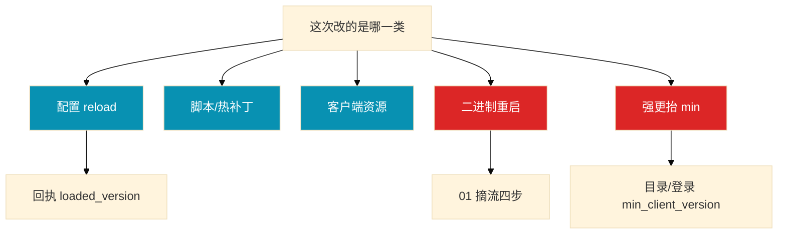

# 热更新与版本发布

群里有人说「热更一下」——有人重载配置，有人准备滚战斗镜像，有人在切 CDN 指针。活动掉落多写了一个零，另有人要再热更「×0.01」当没发生。这一章只做一件事——**先分五类更新，再按可逆性回滚**。

**本章主线（开口就按这三步想）：**

1. **分类**：配置/脚本/二进制/资源/强更——进程还在不在、端会不会听、回滚加载旧 version 还是只能向前修。
2. **发版**：配置看回执；脚本按房间切版本；二进制按 01 摘流；资源先预热再切指针；强更两段抬闸。
3. **回滚**：经济错了先停活动（07），不是再热更 ×0.01；已装新包的端常常只能向前修。

**读完你能：** 开口先说改的是哪一类；灰度按 uid 不按源 IP；强更 `min` 放目录/登录；回滚按可逆性排。

## 本章目录

- [1. 基本概念](#1-基本概念)
- [2. 架构图](#2-架构图)
- [3. 原理](#3-原理)
- [4. 落地](#4-落地)
- [5. 核心配置](#5-核心配置)
- [6. 命令与操作](#6-命令与操作)
- [7. 生产排障](#7-生产排障)
- [8. 必会 · 常考](#8-必会--常考)
- [合上书](#合上书问自己)

**本章不讲：** 战斗摘流 → [01](../01-游戏服务器架构/)；开服版本钉死 → [02](../02-开服合服/)；`min_client_version` → [04](../04-登录排队与选服/)；CDN 预热 → [06](../06-CDN与资源更新/)；经济回档 → [07](../07-玩家数据备份与回档/)。

---

## 1. 基本概念

| 类型 | 改什么 | 停服 | 回滚 | 典型风险 |
|------|--------|------|------|----------|
| 配置 | 活动、掉落、开关 | 通常否 | 重载上一版 | 经济爆炸 |
| 脚本热更 | Lua/热补丁 | 否 | 再发旧脚本 | 战斗不一致 |
| 二进制 | 逻辑镜像 | **要摘流** | 滚回镜像+摘流 | 有状态丢失 |
| 客户端资源 | 图、音、预制 | 否 | 改清单指针 | 闪退、回源打爆 |
| 强更 | 协议、引擎、渠道包 | **要** | 降 min（服务端须兼容） | 进不去、收入停 |

热更 vs 停服更，只问三句：

1. **进程还在不在？** 在=配置/脚本；没了=二进制。
2. **玩家已拿到的端会不会听？** 资源切指针管不到已下完的端。
3. **回滚是加载旧 version 还是只能向前修？**

> **记住：** 五类回滚不是一个按钮。镜像、配置、资源指针、`min_client_version` 钉进同一张变更单，禁 latest。

---

## 2. 架构图

版本号拆开：端大版本（强更）· 端资源号（热更资源）· 服配置 version（reload）· 镜像 digest（二进制）。

---

## 3. 原理

### 3.1 热更 vs 停服更

**一句话：** 不要因为怕停服就把必须强更的协议改成热补丁；也不要改个活动图就抬 `min`。

| 能热更 | 必须停服更/摘流/强更 |
|--------|----------------------|
| 活动开关、掉落、文案 | 结构体布局、协议字段含义 |
| 新增可选字段 | 改枚举、删必填、改握手 |
| 资源差分（协议仍兼容） | 战斗二进制；房间钉进程 |

兼容窗口：服务端先双协议 → 资源灰度 → 建议更新看崩溃 → 覆盖率够再抬 `min` → 再过一个版本删老协议。

### 3.2 服务端三类

**一句话：** 配置看回执，脚本按房间切版本，二进制按 01 摘流。

具体动作：活动 droprate 从 0.02 改 0.05，在配置中心点「发布 version=X」。进程还在，变的只是数值——对账全部目标 `loaded_version == X`，收不齐当失败，不要开放活动。

| 卡在 | 你看到的 | 先看 |
|------|----------|------|
| 配置没生效 | 后台已发布，部分服规则旧 | 回执 `loaded_version` |
| 规则分裂 | 同活动有的服进得去、有的进不去 | 谁没加载 X，摘新进或重推 |
| 脚本热更后结算争议 | 同一房间两边公式 | 房间版本是否切齐 |
| 二进制滚战斗 | CCU 掉、判负工单 | 停滚动，按 01 摘流 |

脚本：改不了结构体布局和协议字段含义；脏内存 → 该房间强制结算。热补丁不是免测试——线上只接受预发打过的同一份。

二进制：大厅可 RollingUpdate；战斗 OnDelete/只发空进程；金丝雀只对新开房间，不能对已开房间切 5% 流量。混一个 RollingUpdate 策略会砍在线对局。

热更通道要鉴权、审计、限频。发布指令和配置内容分开：回滚 = 再发「加载 X-1」，不是上机器改文件。

### 3.3 客户端资源

**一句话：** 切指针前必须预热；已下完的端不一定听旧指针。

顺序：打包/hash → 上传 → CDN 预热 HIT → 服务端兼容 → 原子切指针。

### 3.4 协议兼容

**一句话：** `min_client_version` 放目录/登录，**不要**放战斗里——否则老端能登录、进战斗才炸。

只降 `min` 不够：服务端须还认老协议；已抬 min 服务端不认老协议 → 先回服务端双协议再降 `min`。

### 3.5 灰度

按 uid/`server_id`/渠道；不要源 IP；不要只用新注册号测兼容。

观察 30～120 min（大版本 24h）：崩溃率、登录/进战斗成功率、支付。崩溃相对基线翻倍 → 立刻停灰度。

---

## 4. 落地

| 项 | 选 | 不选 |
|----|----|------|
| 战斗二进制 | 摘流四步/OnDelete | RollingUpdate 抄登录 |
| 配置 | 中心存储+回执 | 每台 scp 再 reload |
| 灰度 | uid/server_id | 源 IP |
| 强更 | 两段抬闸；服务端先双协议 | 过审当天一次抬满 min |
| 资源 | 先预热 HIT 再切指针 | 先切指针再传包 |

合服前两边二进制、配置、协议必须一致（02）。

---

## 5. 核心配置

| 参数 | 生产怎么用 | 改错会怎样 |
|------|------------|------------|
| 镜像 | digest，禁 latest | 线上预发对不上 |
| 配置 version | 回执必须齐 | 规则分裂 |
| 资源指针 | 短 TTL；文件 URL 带 hash | 边缘分裂 |
| `min_client_version` | 放目录/登录 | 放战斗里 |
| 热更鉴权 | 独立令牌，审计 | 安全事故 |

---

## 6. 命令与操作

| 目的 | 看什么 |
|------|--------|
| 配置生效 | 全部目标 `loaded_version == X` |
| 规则分裂 | 同活动部分服进得去部分进不去 |
| 资源分布 | 端资源号双峰；按 region 查 HIT |
| 强更覆盖率 | 客户端端大版本分布 |
| 四元组 | 镜像、配置 version、资源指针、min |

### 强更两段抬闸

商店过审 → CDN 就位 → 服务端双协议 → 建议更新看崩溃 → 覆盖率够再抬 min。

### 回滚顺序

配置 → 重载上一 version；脚本 → 旧脚本+脏房间强制结算；二进制 → 摘流+受控 undo；CDN → 指针改回+预热；经济已产出 → 停活动+07。

---

## 7. 生产排障

| 现象 | 先做 | 别做 |
|------|------|------|
| 后台已发布、部分服规则旧 | 对账回执 | 开放活动 |
| 同一房间两边公式 | 房间切版本 | 再补一刀热更 |
| 先切指针再传包 | 指针打回 | 全网 purge |
| 灰度 5% 崩溃翻倍 | 立刻停 | 再观察一小时 |
| 战斗 RollingUpdate | 停滚动，按 01 | undo 再杀一轮 |
| 掉落多写一个零 | 回配置停产出 | 再乘 0.01 |

---

## 8. 必会 · 常考

| 说法 | 对错 | 口径 |
|------|:----:|------|
| 热更是一种东西，滚一波就行 | 错 | 先分五类 |
| 脚本热更可改协议字段含义 | 错 | 改含义必须强更 |
| 战斗二进制可以 RollingUpdate | 错 | 按 01 摘流 |
| 配置后台已发布就是全服生效 | 错 | 看回执 |
| `min` 放战斗里更精确 | 错 | 老端进战斗才炸 |
| 只降 `min` 就能回滚强更 | 错 | 服务端须还认老协议 |
| 按源 IP 灰度 | 错 | 加速器毁比例 |
| 先切 CDN 指针再传包 | 错 | 全球回源 |
| 经济错了再热更 ×0.01 | 错 | 先停产出；走 07 |
| 强更用于改活动图 | 错 | 那是资源/配置 |
| 登录和战斗同一套滚动策略 | 错 | 登录可蓝绿；战斗摘流 |
| 变更单写「跟测试服一样」 | 错 | 钉死四元组，禁 latest |
| 让客户端卸掉新资源 | 错 | 一般不能依赖；向前修 |
| 改指针=客户端资源回滚完成 | 错 | 已下完的端不一定听 |
| 灰度 5% 崩了再观察一小时 | 错 | 立刻停 |
| 只用新注册号测兼容 | 错 | 没有老存档 |
| 回执不齐可以先开放活动 | 错 | 规则分裂比晚开代价大 |

数字：灰度 1%→5%→20%；观察 30～120 min（大版本 24h）；崩溃相对基线翻倍立刻停。

易混：热更 vs 停服更；配置回执 vs 后台已发布；清单指针 vs 已装包体；降 `min` vs 服务端双协议；发版回滚 vs 经济回档。

---

## 合上书，问自己

1. 五类更新怎么分？热更和停服更分界三句？
2. 配置看什么？脚本进行中的局怎么办？
3. 什么情况必须强更？`min` 放哪？
4. 灰度按什么切？切 CDN 指针顺序？
5. 掉落写错一个零，顺序是什么？

六题能口述，这一章就过了。下一章：[登录排队与选服](../04-登录排队与选服/)。
