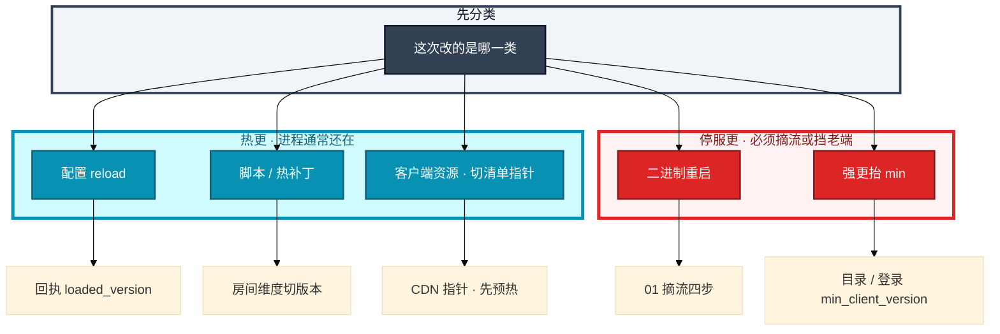
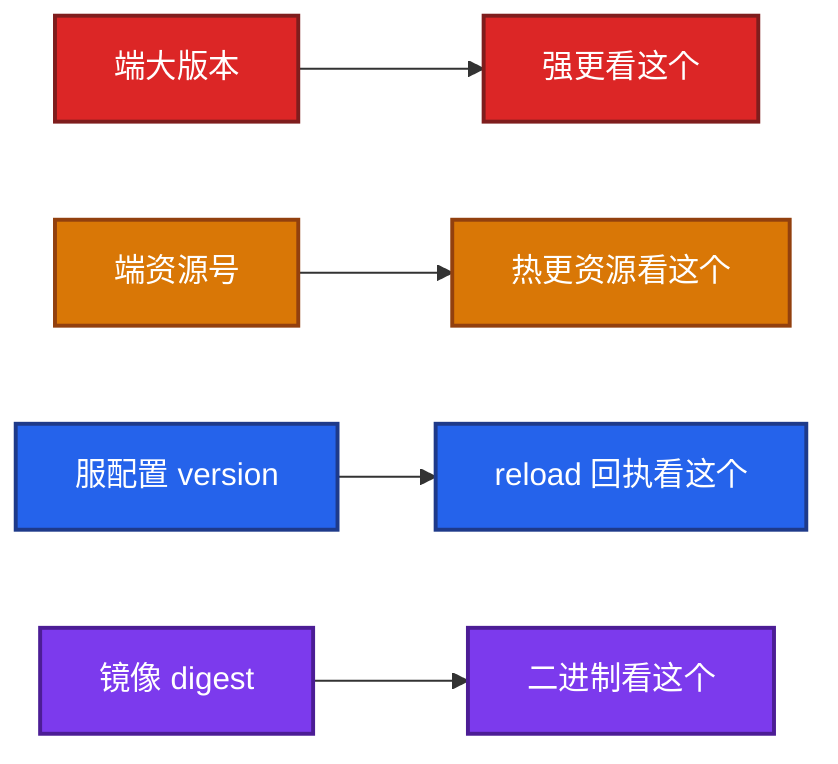
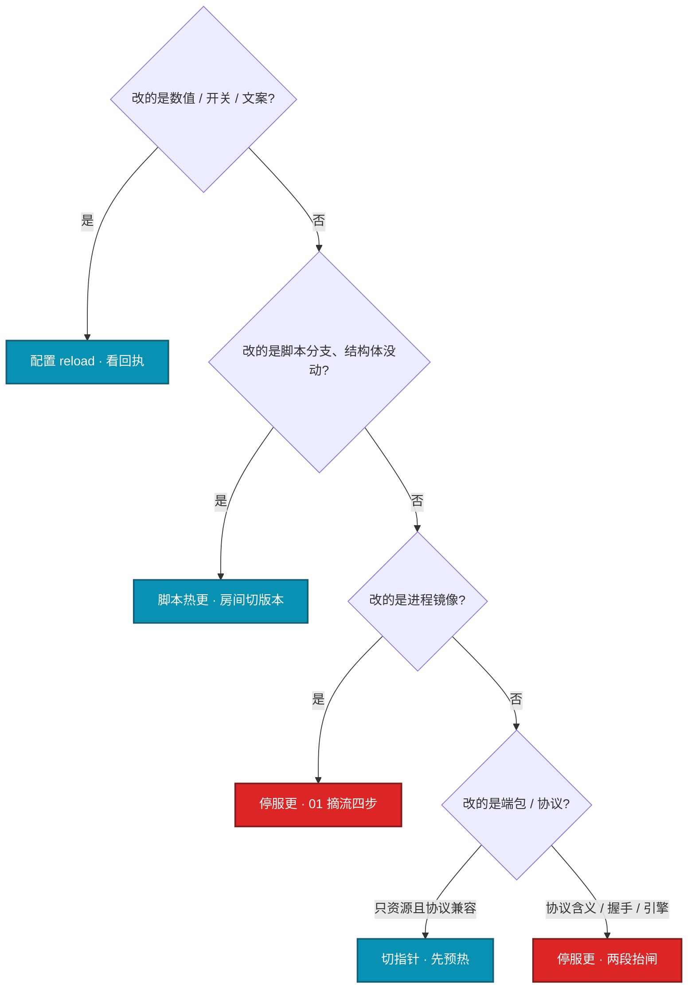
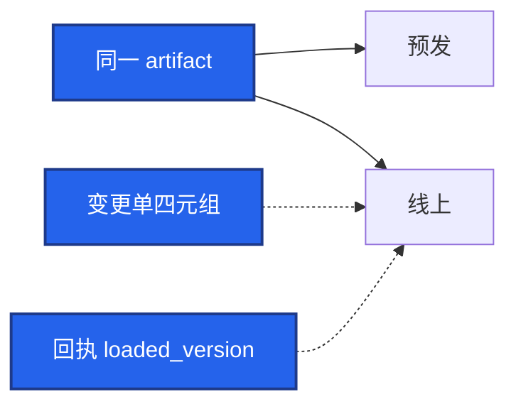
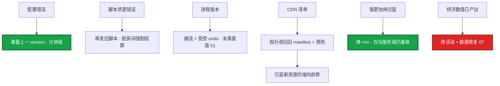
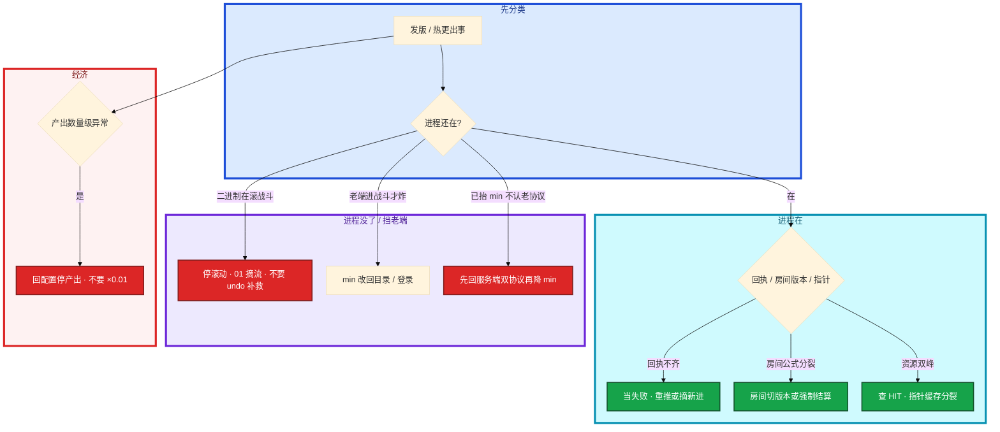

# 热更新与版本发布


群里有人说「热更一下」。有人重载了配置，有人准备滚战斗镜像，有人在切 CDN 指针。没有人说这次改的是哪一类。活动掉落多写了一个零，另有人要再热更「×0.01」当没发生。

先别动手。这一章后半全是你会动手的：**五类更新怎么发、灰度怎么切、强更怎么抬闸、回滚按哪一层。** 前面的分类和原理，是为了让你动手时不按错按钮。

**读完你能：** 开口先说改的是配置 / 脚本 / 二进制 / 资源 / 强更；讲清热更和停服更的分界；灰度按 uid 不按源 IP；回滚按可逆性排，经济错了先停活动。

## 本章目录

缩进 = 上下级。3 下面才是 3.1。

想钉在**正文左边**跟着滚：菜单 **查看 → 打开视图 → 大纲**。Markdown 预览做不到独立左栏，目录只能写在文章开头。

- [1. 基本概念](#1-基本概念)
- [2. 架构图](#2-架构图)
- [3. 原理](#3-原理)
  - [3.1 热更 vs 停服更](#31-热更-vs-停服更)
  - [3.2 服务端三类](#32-服务端配置-vs-脚本-vs-二进制)
  - [3.3 客户端资源](#33-客户端资源清单比包体重要)
  - [3.4 协议兼容](#34-协议兼容这是强更的合法理由)
  - [3.5 灰度](#35-灰度怎么切看什么)
- [4. 安装部署](#4-安装部署)
  - [4.1 生产怎么选](#41-生产怎么选)
  - [4.2 发布落地](#42-发布落地你实际看到什么)
- [5. 核心配置](#5-核心配置)
- [6. 常用命令](#6-常用命令)
- [7. 常用操作](#7-常用操作)
  - [7.1 配置 reload](#71-配置-reload)
  - [7.2 脚本热更](#72-脚本热更)
  - [7.3 二进制](#73-二进制发版)
  - [7.4 资源指针](#74-客户端资源)
  - [7.5 强更](#75-强更两段抬闸)
  - [7.6 回滚](#76-回滚)
- [8. 生产排障](#8-生产排障)
- [9. 必会 · 常考](#9-必会--常考)
- [合上书](#合上书问自己)

**本章不讲：** 战斗服摘流、OnDelete、房间不迁 → [01 游戏服务器架构](../01-游戏服务器架构/)；开服版本钉死、合服要求两边版本一致 → [02 开服合服](../02-开服合服/)；登录闸门、`min_client_version` 放目录 → [04 登录排队与选服](../04-登录排队与选服/)；CDN 预热、回源、purge → [06 CDN 与资源更新](../06-CDN与资源更新/)；经济错了回档 → [07 玩家数据备份与回档](../07-玩家数据备份与回档/)；变更窗口、发布冻结 → [09 游戏 SRE 稳定性](../09-游戏SRE稳定性/)。

---

## 1. 基本概念

「热更」不是一种东西。下一句才会被追问卡死。开口就答「滚一波」或「切个包」，会把战斗服和 CDN 指针按错按钮。

| 类型 | 改什么 | 停服 | 回滚 | 典型风险 |
|------|--------|------|------|----------|
| 配置 | 活动、掉落、开关、文案 key | 通常否 | 重载上一版配置 | 经济爆炸、活动进不去 |
| 脚本热更 | Lua / 热补丁 | 否 | 再补一刀或重载旧脚本 | 战斗不一致、内存脏状态 |
| 二进制发版 | 逻辑进程镜像 | **要摘流或维护** | 滚回镜像 + 摘流纪律 | 有状态丢失 |
| 客户端资源 | 图、音、预制、部分 UI | 否 | 改清单指回旧包，**已下完的端不一定听** | 闪退、错资源、回源打爆 |
| 强更 / 商店大版本 | 协议、引擎、渠道包 | **要** | 商店包撤架慢，靠 min 版本闸 | 进不去、差评、收入停 |

热更 vs 停服更，只问三句：

1. **进程还在不在？** 在 = 配置 / 脚本；没了再起来 = 二进制，按 01 摘流。
2. **玩家已经拿到的端会不会听？** 资源切指针管不到已下完的端。
3. **回滚是加载旧 version 还是只能向前修？** 配置能回；客户端包体常常只能向前修；经济已产出走 07，不是再发一个热更。

蓝绿只适合无状态登录 / 目录，不适合「房间钉在进程上」的战斗。钉死：镜像、配置、资源指针、`min_client_version` 写进同一张变更单，能回答「此刻线上四元组是什么」。禁 latest、禁「跟测试服现在一样」这种口头对齐。预发和线上拉同一 artifact，不在线上再改一份。

> **记住**：开口先说改的是哪一类。五类回滚不是一个按钮。热更不是免停服；停服更不是「更安全所以什么都停」。

---

## 2. 架构图

先把五类更新钉在一张图上。后面灰度、抬闸、排障都对着这张图说话。



版本号拆开，不要揉成一个自增数：



图上三条线：

1. **配置 / 脚本进程还在；二进制进程没了。** 这是热更和停服更的服务端分界。
2. **`min` 放登录 / 目录，不放战斗里。** 否则老端能登录、能进服、进战斗才炸。
3. **切指针前必须预热。** 先切指针再传包 = 全球回源（06）。

---

## 3. 原理

原理只保留动手和面试会用到的：什么能热更、什么必须停、协议何时强更、灰度看什么。

**本节 5 块：** 3.1 热更 vs 停服更 · 3.2 服务端三类 · 3.3 资源 · 3.4 协议 · 3.5 灰度

### 3.1 热更 vs 停服更

现场分类口诀：

```
  进程还在 + 只换数值     --> 配置 reload，看回执
  进程还在 + 换了逻辑     --> 脚本热更，房间切版本
  进程没了再起来          --> 二进制，按 01 摘流  ← 停服更
  切了小指针              --> 资源，已下完的端不一定听
  抬了 min_client_version --> 强更，商店包撤不回来  ← 停服更（挡老端）
```

| 能热更 | 必须停服更 / 摘流 / 强更 |
|--------|--------------------------|
| 活动开关、掉落、文案 | 结构体布局、协议字段含义 |
| 新增可选字段、老端忽略 | 改枚举、删必填、改握手 |
| 新消息号（关键路径不能只走新消息） | 引擎 / 渠道包 / 反外挂加固 |
| 资源差分（依赖协议仍兼容） | 战斗二进制；房间钉在进程上 |

热更的代价：规则分裂（回执不齐）、房间新旧公式并存、已下完的端不听指针。停服更的代价：掉线、客诉、收入窗。**不要因为怕停服就把必须强更的协议改成热补丁。** 也不要改个活动图就抬 `min`。

强更当天不要叠经济数值，出问题无法归因。服务端先保留双协议至少一个版本，再抬 `min`；否则降 `min` 也进不去。

决策树（开口前走一遍，避免「热更一下」）：



热更适用：进程可以继续跑、已有长连接不必断、回滚能加载旧 version。停服更适用：内存布局变了、协议老端会写坏、战斗房间钉在旧进程上。中间态最危险——「脚本热更改协议含义」看起来不停服，实际把脏数据写进权威库，回滚比摘流四步更贵。

兼容窗口怎么排期：

1. 服务端先上双协议 / 可选字段默认值（热更或摘流，看改的是配置还是二进制）。
2. 资源清单带依赖的协议版本，灰度 uid / 服。
3. 建议更新看崩溃和覆盖率。
4. 覆盖率够再抬 `min`（停服更的闸）。
5. 再过一个版本，才能删老协议。四步缩成一天 = 归因失败。

大厅二进制可以滚动（轻状态）；战斗二进制必须停服更纪律。登录 / 目录无状态，蓝绿算停入口，不是停战斗。不要用「我们热更过大厅」证明「战斗也能热更」。

### 3.2 服务端：配置 vs 脚本 vs 二进制

具体动作：活动 droprate 要从 0.02 改成 0.05。你在配置中心点「发布 version=X」。进程还在，fd 还在，房间还在。变的只是数值。

系统里发生了什么：内容先落到可回滚的存储，指令只说「加载 version=X」。每台进程回执「已加载 version=X」。重复「加载 X」必须幂等，不能加载两次叠加成两份活动。配置不要「每台 scp 一份再 reload」。

你眼睛看到什么：对账回执，不要信后台「已发布」。期望全部目标进程 `loaded_version == X`。收不齐回执就当失败——部分服新配置、部分服旧，活动规则会分裂。未回执实例：重推，或从匹配 / 目录摘掉新进。

卡住先看哪：回执不齐 = 规则分裂，当失败，不要开放活动。

**脚本 / 热补丁**  
能改分支逻辑，改不了结构体布局和协议字段含义。进行中的房间可能一部分人已加载、一部分人没有——要么房间维度切版本，要么维护后再补。一半人新公式一半人旧公式会出结算争议。热补丁不是免测试：核心战斗脚本必须过回归，线上只接受「已在预发打过的同一份」。已污染房间内存 → 该房间强制结算。

**二进制发版**  
有状态服按 01 章摘流。大厅可以 RollingUpdate；战斗服 OnDelete 或只发空进程。金丝雀只能对新开房间（匹配按版本分流），不能对已开房间切 5% 流量。登录无状态，可滚动 / 蓝绿。混一个 RollingUpdate 策略会砍在线对局。

热更通道本身要鉴权、审计、限频。热更后台暴露公网或共用玩家 GM 令牌，是发版事故也是安全事故。发布指令和配置内容必须分开：内容先落到可回滚的存储，指令只说「加载 version=X」。回滚是再发「加载 X-1」，不是派人上机器改文件。

| 卡在 | 你看到的 | 先看 |
|------|----------|------|
| 配置没生效 | 后台已发布，部分服规则旧 | 回执 `loaded_version`，未齐当失败 |
| 规则分裂 | 同活动有的服进得去、有的进不去 | 谁没加载 X，摘新进或重推 |
| 脚本热更后结算争议 | 进程还在，同一房间两边公式 | 房间版本是否切齐；脏内存强制结算 |
| 二进制滚战斗 | CCU 掉、判负工单 | 停滚动，按 01 摘流，不是再 undo 一次 |

常见误判：把脚本热更当免测试；把二进制滚动抄到战斗服；回执没收齐就开放活动。

> **记住**：配置看回执，脚本按房间切版本，二进制按 01 摘流。进程还在不在，是三类的分界。

热更和停服更在发布单上要写成两种变更类型，不要共用一张「发版」模板：热更查回执和房间版本；停服更查摘流四步和 `min` 覆盖率。审批人可以是同一拨人，门禁清单不能是同一张。活动开关（05）走热更模板；战斗镜像走停服更模板。混用会在周年庆把战斗滚动出去。

### 3.3 客户端资源：清单比包体重要

具体动作：新活动图要让玩家下到。打包、算 hash、上传源站都做完了。有人要「先切指针让玩家开始下」。先别切。


系统里：客户端每次启动或进登录前拉 **version 指针**（一个小文件）。指针切换必须原子：先保证新包在边缘节点可命中，再切指针。先切指针再传包，就是全球回源打爆（06）。

差分：按文件 hash 只拉变更。整包强更留给引擎 / 渠道。差分失败要有整包兜底，兜底带宽要算进峰值。指针短 TTL，文件 URL 带 hash、长 TTL。少覆盖同名、少全网 purge。失败指针打回，源站新文件先留着。

版本一致性：

- 资源版本必须带「依赖的协议 / 配置版本」
- 老资源 + 新协议 = 常见闪退
- 新资源 + 老服务端 = 按钮点了没回包
- 清单和配置不是一次发：先发兼容的服务端，再发端，或保证双向兼容窗口

你眼睛看到部分地区新、部分地区旧：指针被边缘缓存分裂，或源同步慢。查版本分布双峰，按 region 查 HIT，不先怪客户端。

客户端包已落到设备上，改指针只能管还没拉或再检查的人；已装新包的端常常必须再发一包向前修。不能依赖「让客户端卸掉新资源」。这是资源也要灰度的原因。

> **记住**：切指针前必须预热。服务端能回；客户端包体常常只能向前修。

### 3.4 协议兼容：这是强更的合法理由

| 变更 | 可否热更 | 说明 |
|------|----------|------|
| 新增可选字段、老端忽略 | 可以 | 服务端默认值要能兜住老端 |
| 新增消息号、老端不认识就丢 | 可以 | 不能把关键路径放在新消息上 |
| 改字段含义、改枚举、删必填 | **必须强更** | 老端会错解包或写坏数据 |
| 加密 / 握手改 | 必须强更 | 老端直接连不上 |

版本号拆开：`端大版本.端资源.服配置`。强更看端大版本；热更资源看资源号；出问题能判断哪一层。揉成一个自增数无法回滚分层。

`min_client_version` 放在目录 / 登录，**不要**放到战斗进程里才判断——否则老端能登录、能进服、进战斗才炸。

兼容窗口：强更当天不要同时改经济数值。出问题你分不清是协议还是数值。服务端先保留双协议至少一个版本，再抬 `min`；否则降 `min` 也进不去。已经抬 `min`、服务端不认老协议：先把服务端双协议加回或回滚服务端，再降 `min`。只降 `min` 是死门。两步必须同一变更设计。

你眼睛看到老端能登录、能进服、进战斗才炸：`min` 放错层了。先把闸改回目录 / 登录，再处理已经写坏的数据。客诉和脏数据会一起到。

卡住先看哪一层版本号：端大版本对不上是强更；资源号对不上是清单；服配置对不上是 reload 回执。揉成一个自增数，这三层无法分开回。

> **记住**：只加可选字段可以热更；改含义、删必填、改握手必须强更。`min` 放登录 / 目录，不放战斗里。

### 3.5 灰度怎么切、看什么

切分维度（按风险从低到高组合）：

1. 内网 / 测试渠道包
2. 指定 `server_id`（新服、内部服）
3. uid 哈希 1% → 5% → 20% → 全量
4. 渠道（一个应用商店先更）

不要只按「新注册用户」灰度核心战斗：他们没有老存档，测不出兼容。  
不要按源 IP 灰度：加速器和公司 NAT 会让灰度比例失真。  
全服组件（账号 / 登录）没有「只灰度 S1」这回事，见 01。

观察（至少 30～120 分钟，大版本 24 小时）：

- 客户端崩溃率、登录成功率、进战斗成功率
- 错误码分布（协议失败 vs 资源 hash 失败）
- 付费到账、核心漏斗（别只看 CPU）
- CCU 是否相对未灰度服异常偏离

回滚闸提前写死：崩溃率相对基线翻倍、登录成功率掉过阈值、支付异常，立刻停灰度。灰度 5% 已经出崩溃，不「再观察一小时」，不转全量。分析是机型、资源 hash 还是协议。资源灰度最好独立指针，确认回源比再全量。

卡住先看错误码分布，不要先看 CPU：协议失败是兼容；资源 hash 失败是清单 / CDN；崩溃率翻倍是端。三类回滚不是一个按钮：配置重载、清单指针、镜像 undo。点错按钮会把另外两层也搅乱。

> **记住**：按 uid 或服灰度，不按源 IP；5% 已经崩就停，不要再观察一小时。

---

## 4. 安装部署

### 4.1 生产怎么选

| 项 | 选 | 不选 |
|----|----|------|
| 分类 | 先说五类里哪一类 | 「热更一下」开口就滚 |
| 战斗二进制 | 摘流四步 / OnDelete / 只发空进程 | RollingUpdate 抄登录 |
| 配置 | 中心存储 + 回执 `loaded_version` | 每台 scp 再 reload |
| 灰度 | uid / `server_id` / 渠道 | 源 IP；只用新注册号测兼容 |
| 强更 | 两段抬闸；服务端先留双协议 | 过审当天一次抬满 `min` |
| 资源 | 先预热 HIT 再切指针 | 先切指针再传包 |
| 版本 | 端大版本 / 资源号 / 服配置 / 镜像四元组 | latest；口头「跟测试服一样」 |
| 热更通道 | 鉴权、审计、限频 | 公网暴露、共用玩家 GM 令牌 |

### 4.2 发布落地你实际看到什么



验收：进程 Running 不算数。配置必须回执齐；资源必须边缘 HIT 再切指针；二进制必须摘流门禁过了；强更必须覆盖率够了再抬 `min`。

合服前：两边二进制、配置、协议必须一致，否则映射脚本 dry-run 都不要跑（02）。口头「都是最新」不算一致。

---

## 5. 核心配置

只动有证据的项。四元组写进同一张变更单。

| 参数 | 生产怎么用 | 改错会怎样 |
|------|------------|------------|
| 镜像 | digest，禁 latest | 线上和预发对不上 |
| 配置 version | 指令只说加载 X；回执必须齐 | 规则分裂 |
| 资源指针 | 短 TTL；文件 URL 带 hash、长 TTL | 边缘分裂；全网 purge 打爆 |
| `min_client_version` | 放目录 / 登录 | 放战斗里 = 进战斗才炸 |
| 灰度比例 | 1% → 5% → 20%；闸写死 | 5% 崩了还观察一小时 |
| 热更鉴权 | 独立令牌，审计、限频 | 安全事故 + 发版事故 |
| 活动开关 | 配置热更；回执齐再开放 | 未齐就开 = 部分服进不去 |

> **记住**：发布指令和配置内容必须分开。回滚是再发「加载 X-1」，不是上机器改文件。

---

## 6. 常用命令

值班先问「改的是哪一类」，再看对应回执 / 指针 / 镜像。

| 目的 | 看什么 |
|------|--------|
| 配置是否生效 | 全部目标进程 `loaded_version == X`，不要信后台「已发布」 |
| 规则分裂 | 同活动部分服进得去部分进不去 → 谁没回执 |
| 资源分布 | 端资源号双峰；按 region 查 CDN HIT |
| 强更覆盖率 | 客户端上报的端大版本分布 |
| 灰度闸 | 崩溃率相对基线、登录成功率、支付 |
| 错误码 | 协议失败 vs 资源 hash 失败 vs 崩溃 |
| 四元组 | 镜像、配置 version、资源指针、`min` |

不要从「活动进不去」倒推到「镜像坏了」。先对分类。

---

## 7. 常用操作

### 7.1 配置 reload

内容先入可回滚存储 → 指令加载 X → 对账回执。未齐当失败，重推或摘新进。回滚 = 加载 X-1。活动开关走这一条，不要发版。

### 7.2 脚本热更

预发打过的同一份。房间维度切版本，或维护后再补。脏内存强制结算。改不了结构体和协议含义。

### 7.3 二进制发版

登录 / 目录：蓝绿或滚动，就绪即切。大厅：可滚动，Session 可重建。战斗：摘流 → 等空或强制结算 → flush → 换镜像。金丝雀只对新开房间。回滚按 01，不要 undo 再杀一轮。

### 7.4 客户端资源

上传 → 预热 HIT → 服务端兼容 → 切指针。失败指针打回，源站新文件先留着。已装新包的端常常向前修。

### 7.5 强更两段抬闸

使用场景：协议不兼容、反外挂加固、引擎升级、渠道强制。  
不使用场景：改个活动图、改掉落——那是资源 / 配置热更。乱强更会在应用商店被差评，收入按小时计。


一次抬满，老端全挡在登录外，你没有灰度。建议更新没人更：活动奖励或登录弹窗促更，仍不抬 `min` 直到覆盖率够。覆盖率不够就抬 = 自己砍收入。iOS 过审按天，排期倒推。

强更回滚：把 `min` 降回去。前提是服务端还认老协议。服务端已经不认：先把双协议加回或回滚服务端，再降 `min`。

### 7.6 回滚

按可逆性排：



具体动作：活动掉落多写了一个零，十分钟高 V 背包变形。群里有人要「再热更一个乘 0.01」。不要听。

系统里：产出还在刷。再发一刀只会让时间窗更乱，你分不清哪一段背包是哪次公式算出来的。

你眼睛看到：产出相对基线数量级告警（没有这条告警，复盘时要补上）。立刻回配置停产出；产出还在刷就摘服或关活动入口；已经停产出则不必全服维护，除非要整服回档。然后冻写，评估回档范围，支付和已消耗按 07 处理。

不要再热更一个「再乘 0.01」当没发生。回档是数据动作，和发版回滚分开。复盘加业务校验（概率和、上限）。

> **记住**：经济错了先停活动，不是再发一个热更当没发生。配置能回；已经刷出去的道具走 07。

---

## 8. 生产排障

先分类，再动手。不要从「活动进不去」倒推镜像。



| 现象 | 先做什么 | 不要做什么 |
|------|----------|------------|
| 后台已发布、部分服规则旧 | 对账回执，未齐当失败 | 开放活动 |
| 同一房间两边公式 | 房间切版本；脏内存强制结算 | 再补一刀热更搅时间窗 |
| 部分地区新部分旧 | 版本分布双峰，按 region 查 HIT | 先怪客户端 |
| 先切指针再传包 | 指针打回；救源站 | 全网 purge |
| 灰度 5% 崩溃翻倍 | 立刻停该类更新 | 再观察一小时、转全量 |
| 战斗 RollingUpdate | 停滚动，按 01 | undo 再杀一轮 |
| 掉落多写一个零 | 回配置停产出 | 再乘 0.01；立刻整服回档 |
| 只降 `min` 进不去 | 先回服务端双协议 | 只降闸 |

---

## 9. 必会 · 常考

白板和追问高频，能一口回：

| 说法 | 对错 | 口径 |
|------|:----:|------|
| 热更是一种东西，滚一波就行 | 错 | 先分五类 |
| 脚本热更可以改协议字段含义 | 错 | 改不了结构体和协议含义；改含义必须强更 |
| 战斗二进制可以 RollingUpdate | 错 | 按 01 摘流 |
| 配置后台显示已发布就是全服生效 | 错 | 看回执 `loaded_version` |
| 回执不齐可以先开放活动 | 错 | 规则分裂比晚开代价大 |
| `min` 放战斗里更精确 | 错 | 老端进战斗才炸；放登录 / 目录 |
| 只降 `min` 就能回滚强更 | 错 | 服务端必须还认老协议 |
| 按源 IP 灰度即可 | 错 | 加速器毁比例 |
| 只用新注册号测兼容 | 错 | 没有老存档 |
| 灰度 5% 崩了再观察一小时 | 错 | 立刻停 |
| 先切 CDN 指针再传包 | 错 | 全球回源 |
| 改指针 = 客户端资源回滚完成 | 错 | 已下完的端不一定听 |
| 让客户端卸掉新资源 | 错 | 一般不能依赖；向前修 |
| 经济错了再热更 ×0.01 | 错 | 先停产出；已刷出走 07 |
| 强更用于改活动图 | 错 | 那是资源 / 配置；乱强更按小时计收入 |
| 登录和战斗同一套滚动策略 | 错 | 登录可蓝绿；战斗摘流 |
| 变更单写「跟测试服一样」 | 错 | 钉死四元组，禁 latest |

数字：灰度观察 30～120 min（大版本 24h）；灰度阶梯 1% → 5% → 20%；崩溃相对基线翻倍立刻停。

易混：热更 vs 停服更；配置回执 vs 后台已发布；清单指针 vs 已装包体；降 `min` vs 服务端双协议；发版回滚 vs 经济回档。

---

## 合上书，问自己

1. 五类更新怎么分？热更和停服更的分界问哪三句？
2. 配置看什么回执？脚本进行中的局怎么办？战斗二进制怎么发？
3. 什么情况必须强更？`min` 放哪？已经抬了服务端不认老协议怎么回？
4. 灰度按什么切？5% 崩溃还全量吗？
5. 切 CDN 指针的顺序？客户端资源为什么比服务端难回？
6. 掉落写错一个零，顺序是什么？再热更 ×0.01 行不行？

六题都能口述，这一章就过了。下一章把登录六跳和排队令牌剖开：只扩登录副本等于把洪峰送给有状态层。
