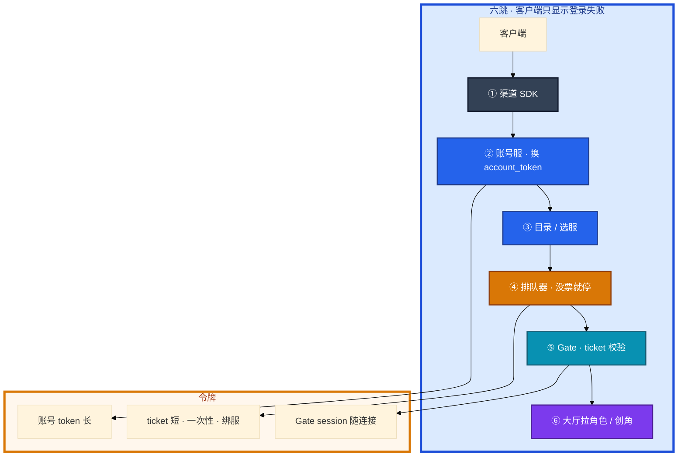
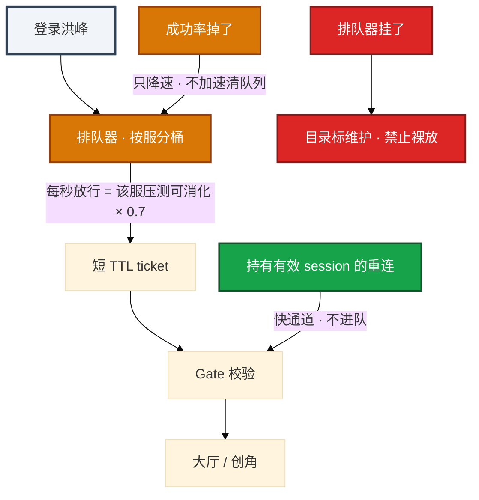
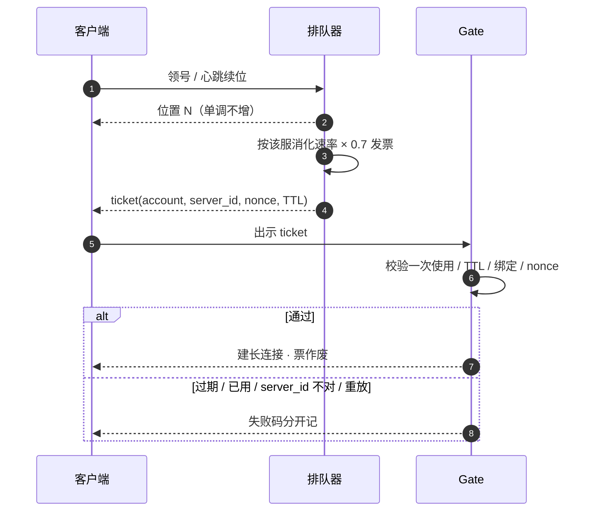
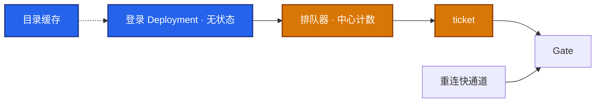
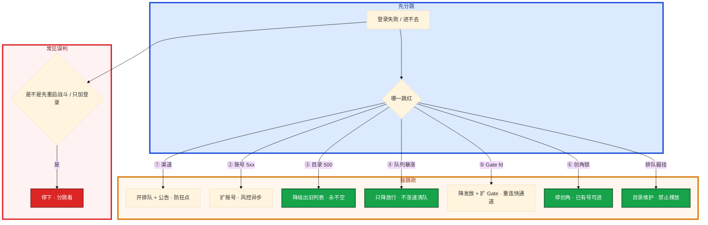

# 登录、排队与选服


开服三分钟登录全红。有人把登录 Deployment 从 10 扩到 80，排队器按登录集群空闲发票。Gate fd 打满，新服创角把单库行锁打穿。已经在线的老服也被目录 500 误伤。另有人要把排队器摘掉「先让人进去」。

先别动手。这一章后半全是你会动手的：**六跳怎么看、ticket 怎么发、目录怎么降级、全服踢人先切断入口。** 前面的链路和令牌原理，是为了让你动手时不把洪峰原样送给有状态层。

**读完你能：** 分跳看登录失败而不是复述「登录挂了」；排队按目标服消化速率发短 TTL 一次性 ticket；重连走快通道；目录可降级出旧列表，不可 500。

## 本章目录

缩进 = 上下级。3 下面才是 3.1。

想钉在**正文左边**跟着滚：菜单 **查看 → 打开视图 → 大纲**。Markdown 预览做不到独立左栏，目录只能写在文章开头。

- [1. 基本概念](#1-基本概念)
- [2. 架构图](#2-架构图)
- [3. 原理](#3-原理)
  - [3.1 六跳](#31-六跳客户端只显示登录失败)
  - [3.2 QPS ≠ CCU](#32-登录打爆qps-和-ccu-不成正比)
  - [3.3 排队令牌](#33-排队令牌保护有状态)
  - [3.4 选服](#34-选服推荐错了等于自己制造单服热点)
  - [3.5 Session](#35-session单点和踢人)
- [4. 安装部署](#4-安装部署)
  - [4.1 生产怎么选](#41-生产怎么选)
  - [4.2 落地](#42-落地你实际看到什么)
- [5. 核心配置](#5-核心配置)
- [6. 常用命令](#6-常用命令)
- [7. 常用操作](#7-常用操作)
  - [7.1 开排队](#71-开排队)
  - [7.2 令牌](#72-令牌发放与校验)
  - [7.3 选服 / 目录](#73-选服与目录降级)
  - [7.4 踢人](#74-踢人)
  - [7.5 回滚](#75-回滚)
- [8. 生产排障](#8-生产排障)
- [9. 必会 · 常考](#9-必会--常考)
- [合上书](#合上书问自己)

**本章不讲：** Gate / 大厅 / 战斗拓扑、粘滞、CCU → [01 游戏服务器架构](../01-游戏服务器架构/)；开服写目录是总闸、并行开服锁 → [02 开服合服](../02-开服合服/)；`min_client_version`、强更抬闸 → [03 热更新与版本发布](../03-热更新与版本发布/)；活动登录峰、压测登录曲线 → [05 活动高峰与压测](../05-活动高峰与压测/)；加速器毁四层粘滞、CC / DDoS → [08 游戏网络与对抗](../08-游戏网络与对抗/)。

---

## 1. 基本概念

登录打爆打的是无状态登录和目录，不是已经在线的战斗。每一跳超时，客户端通常只显示「登录失败」。你要看的是哪一段的成功率和延迟。

三种凭证过期时间不同，不要混用一个 JWT 到处传——吊销和踢人做不干净。

| 凭证 | 证明什么 | 寿命 |
|------|----------|------|
| 账号 token | 你是这个账号 | 长 |
| 进服 ticket | 排队器允许你进这个服 | **短、一次性**，绑定 `account + server_id + nonce` |
| Gate session | 这条长连接的身份 | 随连接 |

排队器职责不是做个 UI：

1. 领取排队号（按账号或设备，防多开刷位置）
2. 心跳续位，断线保留短时位次
3. 按 **目标服可消化速率** 发 ticket（不是按登录集群空闲发）
4. ticket 短 TTL、一次使用、绑定账号 + 服 + nonce

> **记住**：登录 QPS ≠ CCU。只扩登录副本，等于把洪峰原样送给有状态层。排队按目标服消化速率发票，宁少勿多。重连走快通道。

---

## 2. 架构图

先把六跳钉住。后面分桶扩容、令牌、排障都对着这张图说话。



令牌发放路径：



图上三条线：

1. **没有箭头从登录 HPA 直接指向「多发票」。** 发票速率跟目标服，不跟登录副本数。
2. **重连不进队。** 否则一次 Gate 抖动把在线玩家打进百万队列。
3. **排队器挂了就停进服。** 裸放 = 用登录把逻辑服打死。

---

## 3. 原理

原理只保留动手和面试会用到的：哪一跳红、为什么不能只扩登录、ticket 防什么、目录为何不能 500。

**本节 5 块：** 3.1 六跳 · 3.2 QPS ≠ CCU · 3.3 令牌 · 3.4 选服 · 3.5 Session

### 3.1 六跳：客户端只显示登录失败

具体动作：玩家点图标。包走完下面六跳才进大厅。你打开看板，不要只看一个「登录失败」总数。

| 跳 | 典型故障 | 止血 |
|----|----------|------|
| ① 渠道 SDK | 渠道故障、证书、时间戳 | 公告渠道侧；自家排队仍要开，避免用户狂点打爆 ② |
| ② 账号 | 连接打满、token 存储挂 | 扩账号、降级非关键校验（风控异步）、开排队 |
| ③ 目录 | 列表缓存失效、全回源 DB | 目录走缓存，脏了也要返回旧列表 |
| ④ 排队 | 计数不准、令牌超发 | 以排队器为准，宁少发 |
| ⑤ Gate | fd / 握手 / ticket 校验打满 | 降发放速率，扩 Gate |
| ⑥ 大厅 / 库 | 创角热点、角色列表慢查询 | 停创角或只开放已有号 |

判断渠道还是自家：看渠道 SDK 耗时和错误码 vs 账号服 QPS / 5xx。渠道挂时，过了 SDK 之后的自家成功率仍正常。对端再问渠道。

| 卡在 | 你看到的 | 先看 |
|------|----------|------|
| ① 渠道 | 自家账号 QPS 不高，SDK 耗时爆 | 公告渠道；开排队防狂点 |
| ② 账号 | 账号 5xx / 连接打满 | 扩账号、风控异步 |
| ③ 目录 | 登录总入口 500 | 降级出旧列表，永不空 |
| ④ 排队 | 队列暴涨、票超发 | 中心计数、按服降速 |
| ⑤ Gate | 握手失败、fd 满 | 降发放 + 扩 Gate |
| ⑥ 创角 | 锁等待、慢查询 | 停创角，已有号可进 |

支付发货、邮箱验证、风控同步校验不是登录主路径。登录高峰把它们塞进登录事务，是自己加戏。验证码服务挂了要降级：只拦创角，不拦重连。重连进验证码，等于把已经在线的人重新罚站。验证码被刷是 CC 的一种，费用会先于 CPU 爆炸，要单独账单告警。开服可对「新设备创角」加严，对已有角色进服放宽。

国内渠道、海外商店、游客账号不要做成三套登录集群各写各的限流。汇到同一账号服后按 **账号维度** 限，否则一个渠道被打、另一个渠道的同一批羊毛号仍能进。游客账号：设备指纹 / 游客 token 最终仍要落到一个 account id 再限。限在渠道入口上防不住换皮。

`min_client_version` 放在这一层（目录 / 登录），不要放到战斗里才判断（03）。

> **记住**：客户端只显示登录失败。分跳看成功率和延迟，才能决定扩哪一层、砍哪一段。Gate / 大厅失败才是进服问题，不要先重启战斗。

### 3.2 登录打爆：QPS 和 CCU 不成正比

开服 / 版本日 / 渠道投放日：

- 登录 QPS 可以是日常的 20～100 倍
- CCU 爬升是分钟级，登录尖峰是秒级
- 失败重试是乘法：客户端 3 次重试，后端看到的是 3 倍垃圾 QPS
- 创角是写放大：插角色、初始化背包、导新手邮件

具体动作：开服 T+3 分钟，登录看板全红。有人把登录 Deployment 从 10 扩到 80。HPA 看起来「弹性成功」。

系统里：洪峰原样送到 Gate / 创角写库 / 大厅。无状态层看起来弹性成功，有状态层被打死。

你眼睛看到：账号 5xx 可能降了，但 Gate fd 打满、新服创角把单库行锁打穿，已经在线的老服也被目录 500 误伤。重连 QPS 和新登录混在一个桶里，在线玩家掉线后更登不回来。

容量分桶：

1. **账号 / 登录 API**：按峰值 QPS × 重试系数扩，无状态，好扩
2. **排队器**：按「每秒放行人数」扩，状态是队列位置
3. **Gate / 大厅**：按放行后的连接和进服协议扩
4. **单服 DB**：按创角和进服读，新服尤其怕全员创角

只扩 K8s 登录 Deployment、不限制放行速率，等于没管过开服。重试：客户端指数退避；服务端对同一账号限。无限重试是自己做 CC。协议定死 ticket 重用还是重新排队，弱网否则把放行速率乘上去。

> **记住**：登录 QPS ≠ CCU。只扩登录副本，等于把洪峰原样送给有状态层。开服只答 HPA 而不提排队，按没管过开服打。

### 3.3 排队令牌：保护有状态

ticket 必须防重放：一次使用、短 TTL、绑定 `account + server_id + 随机 nonce`。日志里打 ticket id，排障能区分「没拿到票」和「票被用过」。



速率怎么定：压测给出「进服成功率 ≥ 99%、P95 进大厅 &lt; X ms、DB 连接 &lt; 70%」时的每秒进服人数，再打 0.7 折扣作为开服放行。动态调：成功率掉了就降速，不要涨速去「消化队列」。队列长度不是加速的理由。

实现要点：

- 计数用 Redis 或专用服务，不要每个登录 Pod 自己内存排队（水平扩展会超发）
- 全局限流按服分桶：S1 爆了不能把 S2 的放行卡住
- 展示「前面还有 N 人」允许粗估，但 N 倒增会引发客诉，要用单调不增的算法
- **持有有效 session 的重连不进队**，或走快速通道

弱网下同一张 ticket 连打三次：第一次 Gate 校验成功 → 票作废；重试同一票 → 校验失败（已用过），客户端走重连或重新排队。未定协议 → 放行速率被乘，消化曲线失真。

你眼睛看到放行速率对、Gate 仍拒：先查 ticket 校验失败码。过期、已用、server_id 对不上、nonce 重放，是四件不同的事。改包进测试服也走这一层挡。不要先加 Gate。ticket 绑服是为了防改包进未开放服、进测试服、进已维护服。选服鉴权：只能进自己有角色的服，或当前开放创角的服。

降级：排队器挂了，默认策略是 **拒绝开放进服**（目录标维护），而不是裸放。裸放 = 用登录把逻辑服打死，恢复更长。备用策略可以是固定全局限速的静态配置（按压测可消化的 0.5～0.7，按服写死），但不能「直接穿过」。没有预案就停进服，不要现场拍一个「看起来很大」的数。以排队器为准，宁少发。计数不准时按少的那份发。

创角热点：新服全员创角是写放大。限放行、预建号段、初始化背包异步、新手邮件批量。不要在创角事务里同步走一遍全活动。爆满服：已有角色可进，禁止创角。预建号段要纳入 `server_id` 命名空间，和合服映射同一套 ID 纪律。创角只是领取，不是现场自增撞车。

令牌状态机（排障按状态看，不要都记成登录失败）：

| 状态 | 谁写 | 下一步合法动作 | 非法动作 |
|------|------|----------------|----------|
| 排队中 | 排队器 | 心跳续位；到点领 ticket | 无票直连 Gate |
| 持票未用 | 排队器签发 | Gate 校验一次 | 改 `server_id`、重放 nonce、过期仍用 |
| 已用 | Gate 作废 | 建连成功则转 session；失败走重连或重新排队 | 同一票再握手 |
| 过期 / 作废批次 | 排队器或回滚 | 重新排队 | 当有效票 |
| 重连快通道 | Gate session 仍有效 | 绕过排队 | 丢进登录队 |

心跳续位：断线保留短时位次，防刷新就到队尾引发投诉。心跳超时再回收号，TTL 要短于「玩家以为自己还在队里」的客服窗口。多开刷位置：领号按账号或设备，不按连接。一个账号多端，只保留一个号，否则排队器被自己的马甲打满。

超发从哪来，按这个顺序查：

1. 每个登录 Pod 内存计数 → 水平扩展相加超发
2. 按登录集群空闲发票 → 登录 HPA 越大票越快
3. 弱网同一票多次握手未作废 → 放行被乘
4. 回滚时旧批次 TTL 还没降 → 两套票同时有效

止血：以排队器为准宁少发；作废旧批次；降 TTL；重连仍走快通道。不要用「再加 Gate」掩盖超发。

> **记住**：按目标服消化速率发票，宁少勿多。重连走快通道。排队器挂了就停进服，不要裸放。

### 3.4 选服：推荐错了等于自己制造单服热点

目录数据：`server_id`、状态（流畅 / 繁忙 / 爆满 / 维护 / 已合并）、开服时间、推荐标记、最低版本。

具体动作：同时开 3 个新服。所有人默认点列表第一个。S201 创角把单库打穿，S202 / S203 空转。

防羊群：新服开放后短时间推荐，CCU 到阈值摘掉「推荐」。多新服并行按账号哈希打散。合服后旧 ID 进目录要跳到目标服，避免玩家以为号没了。

目录必须可缓存、可降级。目录 DB 被登录打穿时，返回最后一份成功列表优于返回 500。宁可短暂看到已维护服，也不要登录总入口 500。错误的列表用 TTL 和版本号控制，维护状态变更要主动失效。开服写入不该和玩家选服共用一条无保护的写路径（02）。目录被开服写入打穿：宁可短暂看不到新服，也不要老服列表 500。

选服鉴权：只能进自己有角色的服，或当前开放创角的服。ticket 必须绑定服 ID。

开服后 5 分钟：只允许看成功率和队列，不要在尖峰上改推荐算法或热更配置。尖峰上改推荐，会把已经打散的人再赶到同一服。

目录状态机要和排队令牌对齐：维护中拒票；爆满只进已有号仍可发票给老角色；已合并的旧 ID 跳转目标服后再按目标服消化速率排队，不要在源服桶里排队。流畅 / 繁忙只影响推荐，不影响「已有号能否进」。推荐标是流量阀门，不是鉴权。

> **记住**：目录可降级出旧列表，不可 500。推荐要打散，爆满只进已有号。

### 3.5 Session、单点和踢人

运维侧常见动作：

1. **全服踢人**：目录维护 + Gate 广播断连 + 短时拒绝新 ticket。只杀进程会立刻重连打爆。
2. **单账号踢下线**：删 Gate 绑定 + 失效 ticket，用于封禁和安全。
3. **顶号**：同账号新登录踢旧连接，要带 epoch / 版本号，防重连把旧连接拉回来。

三种凭证混用一个 JWT 到处传，吊销和踢人做不干净：账号 token 还有效，ticket 已经失效，Gate session 还挂着——你会看到「踢了又回来」。

踢人和令牌一起做，缺一步等于没踢：


全服维护：a → b → c 必做，e 通常不必（人还要回来）。封禁单账号：c + d + 视情况吊销账号 token；只吊销 token 而 Gate session 还在，人不会掉。顶号：新登录带更高 epoch，旧连接看到 epoch 落后就断，防重连把旧连接拉回来。

维护结束放人：先恢复目录，再按目标服消化速率重新发票，不要「维护一结束就裸放」。重连快通道在维护期间也要拒——否则踢完立刻被 session 拉回来。

> **记住**：全服踢人先目录维护再断连。只杀进程，重连会把登录再打爆一次。

---

## 4. 安装部署

### 4.1 生产怎么选

| 项 | 选 | 不选 |
|----|----|------|
| 扩容 | 分桶：账号 QPS、排队放行、Gate 连接、单服创角写 | 只扩登录 Deployment |
| 排队计数 | Redis / 专用服务，按服分桶 | 每个登录 Pod 内存排队 |
| 发票 | 目标服压测可消化 × 0.7 | 按登录集群空闲发 |
| 重连 | 有效 session 快通道 | 重连和新登录同一队、同一限流桶 |
| 目录 | 缓存 + 降级出最后成功列表 | 500「更诚实」 |
| 推荐 | CCU 阈值摘标；多新服账号哈希 | 默认高亮第一个一直挂着 |
| 限流 | 汇到账号维度 | 三套渠道各限各的 |
| 排队器挂 | 目录维护或静态全局限速 | 裸放 |

### 4.2 落地你实际看到什么



验收：进程 Running 不算数。必须能分跳看成功率；ticket 校验失败码能分开；目录挂了仍返回旧列表；重连不进队。

开服前 30 分钟：登录副本就位、排队器阈值按预案、目录缓存预热、新服创角开、告警按服路由。

落地检查令牌链路，缺一项开服夜会超发：

1. 排队器是独立服务或 Redis 中心计数，登录 Pod 无本地队列。
2. ticket 签名或 HMAC 密钥不在客户端、不进玩家 GM。
3. Gate 校验与排队器作废是同一事务语义：先校验成功再作废，或作废失败则拒绝建连。
4. 快通道只认未过期的 Gate session，维护窗口把快通道一起关。
5. 按服分桶的限流 key 带 `server_id`，全局一个桶会让爆满服拖死空服。

压测给出发票速率后写进配置，不要开服夜对着看板拍。变更发票速率走配置 reload，记 version。

---

## 5. 核心配置

只动有证据的项。阈值写进预案，尖峰上不要发明。

| 参数 | 生产怎么用 | 改错会怎样 |
|------|------------|------------|
| 放行速率 | 压测可消化 × 0.7；成功率掉了只降不升 | 按队列长度涨速 = 打死目标服 |
| ticket TTL | 短；一次使用 | 长 TTL + 可重放 = 超发 |
| ticket 绑定 | `account + server_id + nonce` | 改包进测试服 / 未开放服 |
| 排队计数 | 中心化 | Pod 内存排队水平扩展超发 |
| 位置展示 | 单调不增 | N 倒增客诉 |
| 目录 TTL / 版本号 | 维护变更主动失效 | 看见已关服或列表空 |
| `min_client_version` | 目录 / 登录 | 放战斗里 |
| 验证码降级 | 只拦创角，不拦重连 | 在线玩家罚站 |
| 静态限速兜底 | 0.5～0.7 按服写死 | 现场拍一个很大的数 |

> **记住**：T0 可以按预案降速，不要涨速清队列，不要改推荐算法。阈值变更也要有人记账。

---

## 6. 常用命令

分跳，不要只看「登录失败」总数。

```bash
# 渠道 SDK 成功率 / 账号 5xx / 目录 HIT / 排队长度
# 放行速率 / ticket 校验失败 / Gate 握手 / 进大厅 P95
# 重连 QPS vs 新登录 QPS   ← 重连占比突升 = Gate/逻辑在抖
```

| 目的 | 看什么 |
|------|--------|
| 哪一跳红 | 每跳成功率、P95 |
| 排队 | 队列长度、放行速率、ticket 校验失败率（过期 / 已用 / 绑服 / nonce） |
| 创角 | 创角 QPS、单服 CCU 爬升、DB 连接和慢查询 |
| 掉线 vs 没人来 | 重连 QPS vs 新登录 QPS |
| 目录 | HIT、是否 500、缓存版本号 |

必看：每跳成功率、P95（渠道、账号、目录、排队、Gate、进大厅）；队列长度、放行速率、ticket 校验失败率；创角 QPS、单服 CCU 爬升、DB 连接和慢查询；重连 QPS vs 新登录 QPS（重连占比突然升高 = Gate / 逻辑在抖，不是没人来）。

告警口径（开服夜第一屏）：

| 指标 | 阈值 | 级别 |
|------|------|------|
| 任一跳成功率 | 掉过预案线 | P0 看哪一跳，不要先重启战斗 |
| 重连 QPS / 新登录 QPS | 重连占比突升 | P0，Gate / 逻辑在抖 |
| ticket 已用 / 重放失败 | 相对基线翻倍 | P1，令牌超发或弱网协议 |
| 目录 5xx | > 0 且无降级列表 | P0 |
| 单服创角锁等待 | 超压测线 | 停创角，已有号可进 |
| 排队器不可用 | 探活失败 | 目录维护，禁止裸放 |

---

## 7. 常用操作

### 7.1 开排队

渠道狂点或账号开始 5xx 就开。放行按目标服预案。开服后 5 分钟只看成功率和队列。

### 7.2 令牌发放与校验

中心计数、按服分桶、短 TTL 一次性、绑定账号 + 服 + nonce。日志打 ticket id。Gate 校验失败码分开。弱网协议定死：同一票重试失败后走重连或重新排队。

### 7.3 选服与目录降级

推荐带 CCU 阈值自动摘标；多新服账号哈希。爆满只进已有角色。目录挂了返回最后成功列表。合服后旧 ID 跳目标服。

### 7.4 踢人

全服：目录维护 → Gate 广播断连 → 短时拒新 ticket。单账号：删 Gate 绑定 + 失效 ticket。顶号带 epoch。

### 7.5 回滚

错误推荐权重：立刻停热更，恢复上一版推荐配置（03 配置 reload），不要在尖峰上再调一把。超发 ticket：降 TTL、作废已发出的批次、按少的那份发。排队器挂了：目录维护，不要回滚成裸放。目录错误列表：用版本号打回上一份成功缓存。

令牌回滚和登录扩容回滚不是一回事：登录 Deployment 可以缩回去；已经发出去的 ticket 必须显式作废，缩登录副本不会作废票。作废要广播批次号，Gate 拒收该批次。客户端拿到过期票应重新排队，不要死磕握手。静态限速兜底切回去时，速率仍按 0.5～0.7，不要「恢复正常」一次放到压测峰值——维护刚结束等于第二波开服。

---

## 8. 生产排障

过载时砍哪一段，按保护有状态来排，不要从前往后无脑加机器。



| 现象 | 先做什么 | 不要做什么 |
|------|----------|------------|
| 登录 HPA 80，创角打穿 | 按目标服降放行、停创角 | 继续加登录副本 |
| 重连进同一队，队伍 80 万 | 重连改快通道 | 摘掉排队器裸放 |
| 目录 500 | 降级出旧列表 | 重启战斗；开服写入打穿老服 |
| 只有一台 Gate 冒烟 | 粘滞 uid（01） | 先加登录 |
| 放行对、Gate 仍拒 | ticket 失败码四件套 | 先加 Gate |
| 踢人后又回来 | 三种凭证拆开；顶号 epoch | 只删账号 token |
| 验证码挂了 | 只拦创角 | 连重连一起拦 |
| 尖峰上改推荐 | 停 | 热更推荐权重 |

生产故事：开服日登录 HPA 从 10 扩到 80，排队器按登录集群空闲发票。Gate fd 打满，新服创角把单库行锁打穿。已经在线的老服也被目录 500 误伤。正确动作是按目标服降放行、目录降级出旧列表、停新服创角保已有号，而不是继续加登录副本。

令牌现场口诀：宁少发、重连快通道、失败码四件套（过期 / 已用 / 绑服 / nonce）、排队器挂了停进服。对不上这四句，就是在用登录副本赌博。发票速率跟目标服，不跟登录副本数；缩登录 Deployment 不会作废已发票。弱网同一票三次握手，没作废就是超发。

常见误判：登录失败先重启战斗；重连和新登录进同一限流桶；目录 500 比返回旧列表「更诚实」；按登录集群空闲发票而不是按目标服消化速率。目录降级出旧列表时，维护状态用版本号挡住，宁可看见已维护服，不要登录总入口空。

---

## 9. 必会 · 常考

白板和追问高频，能一口回：

| 说法 | 对错 | 口径 |
|------|:----:|------|
| 登录失败就是登录挂了 | 错 | 六跳分看；客户端只显示这一句 |
| 只扩登录 Deployment 就能抗开服 | 错 | 洪峰原样送给有状态层 |
| 登录 QPS 和 CCU 线性 | 错 | 尖峰秒级，CCU 分钟级；重试再乘 |
| 按登录集群空闲发票 | 错 | 按目标服消化速率 × 0.7 |
| 每个登录 Pod 内存排队即可 | 错 | 水平扩展会超发 |
| 重连和新登录进同一队 | 错 | 重连走快通道 |
| 队列长了就涨速消化 | 错 | 成功率掉了只降速 |
| 排队器挂了先让人进去 | 错 | 目录维护，禁止裸放 |
| 目录 500 比旧列表诚实 | 错 | 永不让总入口空 |
| 推荐一直挂第一个新服 | 错 | CCU 阈值摘标；多新服哈希打散 |
| ticket 不绑服也可以 | 错 | 防改包进未开放 / 测试服 |
| 一个 JWT 从账号传到战斗 | 错 | 踢人吊销不干净 |
| 全服踢人只杀进程 | 错 | 先目录维护再断连，否则重连打爆 |
| 三套渠道各限各的 | 错 | 汇到账号维度 |
| 验证码挂了整段登录停 | 错 | 只拦创角，不拦重连 |
| 开服后 5 分钟改推荐算法 | 错 | 只看成功率和队列 |
| 登录失败先重启战斗 | 错 | Gate / 大厅失败才是进服问题 |

数字：登录 QPS 日常 20～100×；放行 = 压测可消化 × 0.7；进服成功率 ≥ 99%；DB 连接 &lt; 70%；静态兜底 0.5～0.7。

易混：新登录 vs 重连；ticket 没拿到 vs 票被用过；渠道挂 vs 自家账号挂；目录 500 vs 列表空；排队保护 vs 排队 UI。

数字再记一遍：登录 QPS 日常 20～100×；放行 = 压测可消化 × 0.7；进服成功率 ≥ 99%；DB 连接 &lt; 70%；静态兜底 0.5～0.7；ticket 短 TTL 一次性。开服前 30 分钟就绪，开服后 5 分钟只看成功率和队列。

令牌绑定：`account + server_id + nonce`。缺任一维都能被改包或重放。

| 令牌字段 | 防什么 |
|----------|--------|
| account | 转赠、多开刷队 |
| server_id | 改包进未开放 / 测试服 |
| nonce + 一次性 | 弱网重放超发 |
| 短 TTL | 持票不用占额度 |

---

## 合上书，问自己

1. 从点图标到进大厅哪六跳？怎么判断渠道还是自家？
2. 为什么不能只扩登录 Deployment？容量怎么分桶？
3. ticket 绑定什么、防什么？重连为什么不能进同一队？排队器挂了呢？
4. 选服如何避免挤爆新服？目录 DB 被打穿怎么办？
5. 三种凭证怎么拆？全服踢人步骤？
6. 开服后 5 分钟盯哪些图？过载按哪一跳砍？

六题都能口述，这一章就过了。下一章把活动三峰和压测模型剖开：HPA 加出来的战斗 Pod 是空的，主库已经被全服发奖锁死。
