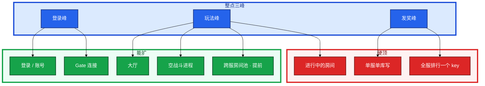
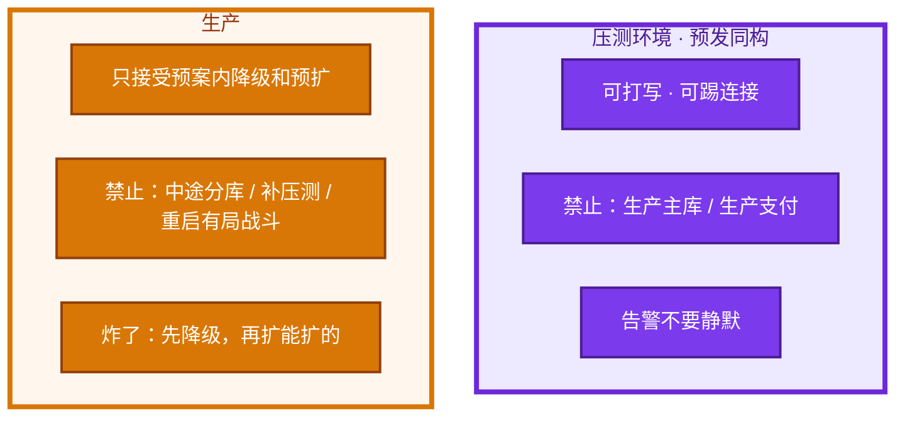
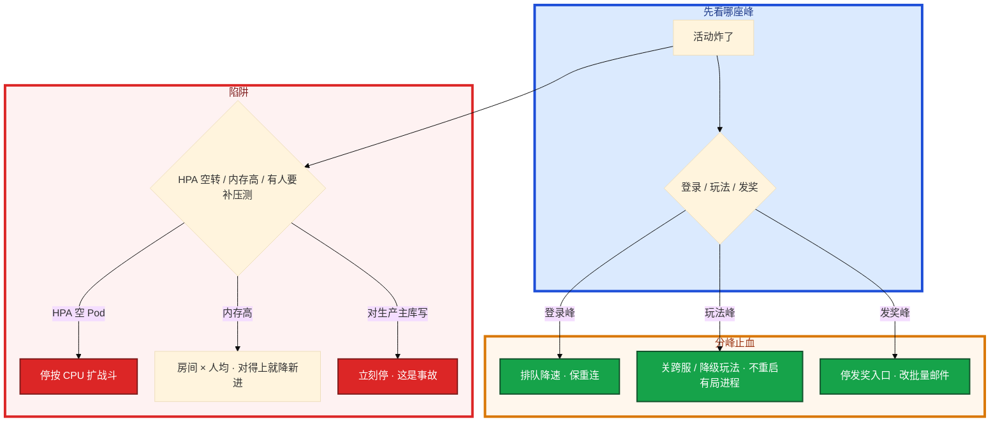

# 活动高峰与压测


周年庆整点。推送拉人、活动开启、排名结算叠在同一分钟。有人只报了「预计 CCU 5 万」。HPA 把战斗副本加了一倍，新 Pod 是空的。主库已经被全服发奖锁死。另有人要对生产主库补一轮压测「验证容量」。

先别动手。这一章后半全是你会动手的：**三峰怎么拆、降级开关怎么扳、压测走哪几条路径、炸了先降级再扩。** 前面的模型和硬顶，是为了让你动手时不把战斗服当 HPA 玩具、不对生产主库写。

**读完你能：** 把活动拆成登录 / 玩法 / 发奖三峰并分开做容量账；战斗房间只能预开空进程；降级保登录结算支付、开关走配置热更；压测走真协议且不对生产主库写。

## 本章目录

缩进 = 上下级。3 下面才是 3.1。

想钉在**正文左边**跟着滚：菜单 **查看 → 打开视图 → 大纲**。Markdown 预览做不到独立左栏，目录只能写在文章开头。

- [1. 基本概念](#1-基本概念)
- [2. 架构图](#2-架构图)
- [3. 原理](#3-原理)
  - [3.1 三峰](#31-三峰不是一个-ccu)
  - [3.2 有状态扩容边界](#32-有状态扩容边界)
  - [3.3 容量账](#33-压测模型与容量账)
  - [3.4 活动开关](#34-活动开关与降级顺序)
- [4. 安装部署](#4-安装部署)
  - [4.1 生产怎么选](#41-生产怎么选)
  - [4.2 压测环境落地](#42-压测环境落地)
- [5. 核心配置](#5-核心配置)
- [6. 常用命令](#6-常用命令)
- [7. 常用操作](#7-常用操作)
  - [7.1 预扩](#71-预扩)
  - [7.2 降级开关](#72-降级开关)
  - [7.3 压测](#73-压测)
  - [7.4 回滚](#74-回滚活动配置)
- [8. 生产排障](#8-生产排障)
- [9. 必会 · 常考](#9-必会--常考)
- [合上书](#合上书问自己)

**本章不讲：** 战斗不能热迁、HPA / PDB / 探针 → [01 游戏服务器架构](../01-游戏服务器架构/)；开服日登录峰、排队放行 → [04 登录排队与选服](../04-登录排队与选服/)；活动配置热更、回执、经济配错 → [03 热更新与版本发布](../03-热更新与版本发布/)；CDN 预热、更新卡登录 → [06 CDN 与资源更新](../06-CDN与资源更新/)；发奖错了回档 → [07 玩家数据备份与回档](../07-玩家数据备份与回档/)；游戏 SLO、事故定级、变更冻结 → [09 游戏 SRE 稳定性](../09-游戏SRE稳定性/)。

---

## 1. 基本概念

一次大型活动通常有三段峰，不要用一个「预计 CCU」糊弄。买量 + 新服 + 活动叠在同一天，是事故配方。排期上至少错开「全服结算」和「强更抬闸」。

| 峰 | 时间 | 打谁 | 典型放大 |
|----|------|------|----------|
| 登录 / 重连 | 整点、维护结束、推送 | 账号、排队、Gate | 日常登录 20×+ |
| 玩法 | 活动开启、BOSS 刷新 | 对应逻辑、房间、跨服 | 单接口 10×～50× |
| 发奖 / 结算 | 活动结束、排名结算、邮件 | DB 写、邮件、背包锁 | 写尖刺，资损风险最高 |

哪座峰最容易资损：发奖 / 结算写错或重复发。玩法进不去是体验；钱和道具错是 P0。

活动开关是配置热更（03），不是发版。降级也是变更：谁拍板、哪个开关、如何恢复，写在活动 runbook。恢复顺序与降级相反。

> **记住**：三峰分别扩分别降。只报 CCU 会买错机器，漏掉写库硬顶。战斗房间只能预开空进程，HPA 救不了已开的局。从库救不了写。

---

## 2. 架构图

先把三峰和硬顶钉住。后面容量账、开关、排障都对着这张图说话。



压测和生产两条红线：



图上三条线：

1. **HPA 箭头到不了「已开房间」。** 新 Pod 是空的。
2. **发奖峰打的是写和锁，不是 CCU。** 从库救不了。
3. **预发可打穿，生产只降级和预扩。** 禁止对生产主库补压测。

---

## 3. 原理

原理只保留动手和面试会用到的：三峰怎么拆、什么扩不了、容量账怎么做、开关先关谁。

**本节 4 块：** 3.1 三峰 · 3.2 有状态边界 · 3.3 容量账 · 3.4 活动开关

### 3.1 三峰，不是一个 CCU

具体动作：周年庆整点。推送拉人、活动开启、排名结算几乎叠在同一分钟。有人只报了「预计 CCU 5 万」。

```
  整点 / 维护结束 / 推送
           |
           +-- 登录峰 --> 账号、排队、Gate     日常登录 20×+
           |
           +-- 玩法峰 --> 房间、跨服、Redis     单接口 10×～50×
           |
           +-- 发奖峰 --> DB 写、邮件、背包锁   写 QPS 尖刺，比 CCU 更危险
```

容量账分开做：

- CCU → Gate / 大厅内存 / 连接
- 玩法 QPS → 该玩法进程和 Redis
- 发奖条数 / 秒 → MySQL 写和锁
- 跨服同时房间数 → 跨服集群，与本服 CCU 解耦

T0 你眼睛先看哪座峰，不要被 CPU 大盘带跑：登录每跳成功率掉 → 登录峰；房间 / Tick / 跨服失败 → 玩法峰；发奖失败率、主库锁等待 → 发奖峰。三座可以叠在同一分钟，看板必须能分开。

> **记住**：三峰分别扩分别降。只报 CCU 会买错机器，漏掉写库硬顶。

### 3.2 有状态扩容边界（这题就考这个）

| 组件 | 活动中能做什么 | 不能做什么 |
|------|----------------|------------|
| 登录 / 账号 | 提前扩、HPA | — |
| Gate | 提前扩连接容量 | 扩完不会自动迁走已有连接 |
| 大厅 | 扩、滚（摘流） | 不要和战斗混部 |
| 战斗房间 | **提前多开空进程** | 把已开战的房间迁到新进程 |
| 单服 MySQL | 读可加从库；写靠降级和拆高峰 | 活动中途分库 |
| 全服榜 / 热 key | 预分片、本地缓存 | 现场把一个 key 打成热点再「加 Redis 节点」 |
| 跨服 | 提前扩战区 / 房间池 | 本服加机器救不了跨服 |

具体动作：战斗 CPU 90%，房间已爆。HPA 按 CPU 把战斗副本加了一倍。

系统里：新 Pod Running，空闲房间数上去了，但旧进程 CPU 还是 90%，已开的局钉死在旧 inst。Gate 扩了也不会把已有长连接迁走。不要把战斗服当 Deployment 滚（01）——活动中滚动重启「释放内存」同样是砍在线局。

单服单库：合过的大服写是硬顶。活动设计就要把全服同时发奖改成分片发奖或延迟邮件。这是运维对产品的否决权，要敢讲。加只读从库救不了发奖——发奖是写和行锁。

否决「全服实时榜」：给出该 key 的预估 QPS 和单线程瓶颈，给替代（分片榜、定时刷新、只展示前 N）。没有数字的否决像抬杠，有数字是容量负责。活动设计服从可承载发奖每秒，不服从海报文案上的「全服实时」。

跨服活动挂了：关跨服入口，本服玩法继续。目录不要把本服标维护。除非跨服回写卡住本服停写，那是合服窗口那一类（02）。你眼睛看到本服大厅还能进、跨服战场进不去：只关跨服入口。把本服标维护，是把没炸的层一起停了。

> **记住**：战斗房间只能预开空进程，HPA 救不了已开的局。从库救不了写。不要把战斗服当 Deployment 滚。

### 3.3 压测模型与容量账

最低集合：

1. 登录 + 排队放行曲线
2. 进服 + 拉角色 / 背包
3. 目标活动主循环（打 BOSS、转盘、推图）
4. 结算 + 发奖 + 邮件
5. 支付发货（用沙箱，但走真代码路径）
6. 重连风暴（随机踢 30% 连接）

`/health` 绿了不算：不走 Tick、不走写、不走渠道。压测报告里如果只有 health 和登录 HTTP，等于没测活动。

模型：开服用「新号创角」；活动用「老号进服」。混用会测错索引和缓存。  
数据：用脱敏生产切片或按分布生成，不要 100 万个空号。道具和邮件箱体积会改变查询。  
环境：预发配置、机器规格、Redis 版本与生产同构；用生产从库打读可以，**禁止对生产主库打写压测**。

容量账怎么交，不要只交最大 CCU：

| 账本 | 算法 | 硬顶信号 |
|------|------|----------|
| Gate / 大厅 | 峰值 CCU / 单实例舒适 × 余量 | fd、每连接内存 |
| 登录 | 开服 10 分钟量 / 600 × 重试系数 | 账号 5xx、渠道超时 |
| 战斗空进程 | 预报 CCU 对应房间数，活动前预热 | 空闲房间 → 0，旧房间 Tick 破线 |
| 发奖 | 每秒条数；行锁、邮件堆积 | 主库锁等待、发奖失败率 |
| 热 key | 该 key QPS vs 单线程 | Redis CPU 单核打满 |
| 跨服 | 同时房间数，与本服 CCU 解耦 | 跨服进房失败，本服仍可玩 |

通过标准：目标 QPS 下成功率、P95、错误预算、DB 行锁、Redis 热 key、Gate fd。出一份「可承载 CCU / 可承载发奖每秒」，活动策划按这个做，而不是反过来。

容量账例（数字用自己压测替换，算法要能上台）：

```
预报峰值 CCU = 5 万
  Gate：单机舒适 2.5 万连接 × 重连 2× → 至少 4 台已预热，不是现场 HPA
  大厅：按连接，可滚动
  战斗：预报同时房间 800，单进程舒适 40 房 → 预开 20 空进程 × 1.4 余量
        已开房间不迁；HPA 按空闲房间数，不按 CPU
  登录：整点 10 分钟 8 万次登录 / 600s × 3 重试 ≈ 400 QPS 账号
  发奖：策划「全服同时」= 5 万行/秒；压测主库舒适 3 千行/秒
        → 否决同时发；改 20 分钟批量邮件，或分片 20 桶
  热 key：全服实时榜预估 5 万 QPS 打一个 key → 单线程打满
        → 分片榜 / 定时 5s 刷新 / 只展示前 N
  跨服：同时战场房间与本服 CCU 解耦，本服加机器救不了
```

曲线形状要写进模型：登录是秒级方波（推送 / 整点）；CCU 是分钟级爬升；发奖是结算瞬间尖刺。用平稳 30 分钟均值外推会低估登录和发奖、高估战斗「还能再加一点 CPU」。机器人思考时间 0 就是把三条曲线压成一条方波，报告会假绿。

压测绿、线上炸，常见原因：

- 没测渠道 SDK 和真实鉴权
- CDN 资源没预热，客户端卡在更新，登录曲线变形
- 热 key、单排行、全服锁没打到
- 机器人不走战斗 Tick，只打 HTTP
- 预发关了风控和日志，生产全开，CPU 差一截

压测环境 Redis 版本必须同构：热 key、淘汰、fork 造成的延迟和版本 / 内存策略相关。版本不一致会测出假绿。规格也要同档，不能预发小规格外推。

机器人常见作弊（会让报告变假）：

- 不拉完整资源、不走 CDN，测不出更新卡登录
- 不建长连接，只打 HTTP GM
- 背包空、邮件空，测不出慢查询
- 全员同一房间或全员分散，两个极端都不是真实分布
- 思考时间 0，QPS 形状是方波，线上是尖峰 + 长尾

报告只交「最大 CCU」不够。要交：哪一层先破、破的指标、降级后还能保哪条 SLO、建议的活动开关默认值。策划改的是这个，不是再要两台机器的愿望清单。

压测是变更，不是研发私跑：目标数字、禁止项（生产主库、生产支付）、观察人、中止条件。中止：错误率破线、主库锁等待超阈值、误打到生产。中止后留现场指标，不要「再加机器续压」把预发打成不可恢复。压测当天当活动值班，告警不要静默。静默会把误打生产的时间窗拉长。

> **记住**：压测走真协议：进服、战斗、发奖、重连。health 绿了不算。不对生产主库写。

### 3.4 活动开关与降级顺序

保底从高到低：

1. **登录 + 进已有角色 + 断线重连**
2. **战斗结算和背包权威**（可以少玩法，不能结算错）
3. 支付发货（可排队，不能丢）
4. 活动玩法本身
5. 跨服、排行、聊天、好友推荐、直播弹幕、非必要推送
6. 精美动画 / 实时排行刷新频率

排行延迟不算必须保。可改定时刷新或只读缓存。结算和背包权威必须保。支付发货可排队不能丢——排队是缓冲，不是丢单。丢了就是资损，定级走 P0，不是「活动体验差一点」。

开关清单（配置热更，不要发版；回执必须齐再算生效，见 03）：

| 开关 | 作用 | 何时扳 |
|------|------|--------|
| 跨服入口 | 关玩法，本服继续 | 跨服 Tick / 房间失败 |
| 排行刷新 | 改定时 / 只读缓存 | 热 key、单线程打满 |
| 邮件 | 实时 → 分钟级批量 | 发奖峰锁等待 |
| 匹配超时 | 打 AI / 单机 | 跨服打满 |
| 广播 / Tick | 降频率、拉长 Tick、关非关键日志 | 玩法峰 CPU / 带宽 |
| 新玩家排队 | 延长；老玩家优先（产品签字） | 登录峰保已有号 |
| 发奖入口 | 停入口，改批量 / 延迟 | 主库被排名结算锁死 |
| 活动入口 | 关入口停产出 | 经济配错、数量级告警 |

恢复顺序写进 runbook，不要现场发明：先开结算和支付缓冲，再开跨服和排行，最后开动画和实时刷新。反着开，主库会再被锁一次。

具体动作：主库已经被排名结算锁死。现场能做的是开关，不是分库。全服同时发奖打爆主库：停发奖入口，改批量 / 延迟邮件，保结算正确。不能现场分库。之后逼产品改节奏。

新玩家延长排队需产品签字。降级也是变更，写 runbook。活动中不发无关版本。

开关怎么落地，避免「群里说关了其实没关」：

1. 开关是配置 version，走 03 reload，看回执。未齐 = 部分服还在打全服榜。
2. 每个开关写清：**默认值（活动前压测给的）**、**降级值**、**谁能扳**、**恢复先开哪一个**。
3. T-7 演练必须真扳一次跨服入口和发奖入口，看到回执和玩家侧表现，不要只改测试服的一个 bool。
4. 经济类开关（掉落、发奖入口）和玩法入口分开。关玩法不等于停产出——转盘可能还在后台结算。
5. 不要把战斗服当 Deployment 滚来当降级。降级是少玩法、停入口；滚战斗是砍在线局。

T0 扳开关的顺序建议写成卡片，值班照念：登录峰 → 排队降速 + 重连快通道；玩法峰 → 关跨服 / 拉长 Tick / 匹配打 AI；发奖峰 → 停发奖入口改批量。三峰叠了就三张卡片都念，不要只念 CPU。

> **记住**：保登录、结算、支付，先关跨服和排行。开关走配置热更，恢复顺序相反。回执不齐不要当全服已降级。

---

## 4. 安装部署

### 4.1 生产怎么选

| 项 | 选 | 不选 |
|----|----|------|
| 容量评审 | 三峰分账，可承载发奖每秒 | 一个 CCU 买所有层 |
| 战斗 | 活动前预热空房间进程 | 按 CPU HPA；活动中滚动重启 |
| 发奖 | 分片 / 延迟邮件 | 全服同一秒；从库抗写 |
| 热 key | 预分片、本地缓存 | 现场加 Redis 节点救命 |
| 压测 | 预发同构；真协议六条路径 | health；生产主库写 |
| 开关 | 配置热更 + 回执；runbook 恢复顺序 | 现场发明；发版降级 |
| 排期 | 结算和强更抬闸错开 | 买量 + 新服 + 活动同一天 |

### 4.2 压测环境落地

预发配置、机器规格、Redis 版本与生产同构。用生产从库打读可以，禁止对生产主库打写。支付走沙箱真代码路径。

验收：报告有「哪一层先破」和「可承载发奖每秒」，有建议的开关默认值。只有最大 CCU = 没过。

压测当天和活动当天的机器清单要能对上：同规格、同 Redis 版本、同开关默认值。预发关风控 / 关日志再压，生产全开，CPU 差一截，是假绿的常见来源。流量发生器要能打长连接和 Tick，不能只打登录 HTTP。数据切片要带背包和邮件体积；空号测不出发奖锁。

和 01 的衔接：压测可以打穿预发的战斗进程，但不要在预发上对有「真实玩家」的房间做 RollingUpdate 演练——预发若混了内部服，纪律与生产相同。活动中更不要把战斗服当 Deployment 滚。

---

## 5. 核心配置

只动有证据的项。开关默认值来自压测，不是现场拍。

| 参数 | 生产怎么用 | 改错会怎样 |
|------|------------|------------|
| 战斗 HPA | 空闲房间数；活动前预热 | CPU 追已爆房间 = 空 Pod |
| 发奖节奏 | 可承载每秒条数 | 全服同一秒锁死主库 |
| 排行 | 分片 / 定时刷新 | 一个 key 单线程 |
| 降级开关 | 配置 version + 回执 | 未齐当已降级 = 部分服还在打 |
| 压测中止 | 错误率、锁等待、误打生产 | 续压打穿预发 |
| 告警 | 压测当天当值班 | 静默拉长误打生产窗口 |
| 活动入口 | 可关；经济配错立刻关 | 再热更 ×0.01（03） |

> **记住**：T0 还能按预案降排队阈值（成功率掉了就降），不要涨速清队列，不要改推荐算法（04）。

---

## 6. 常用命令

T0 第一屏不要把 CPU 大盘放在第一屏代替下面这些。

```bash
# T0 第一屏（示意）
# 登录每跳成功率、排队放行、创角 QPS
# 发奖失败率、主库锁等待、热 key QPS
# 战斗 Tick / 房间数 / 空闲房间
```

| 目的 | 看什么 |
|------|--------|
| 哪座峰 | 登录每跳成功率 vs Tick vs 发奖失败率 / 锁等待 |
| HPA 空转 | 新战斗 Pod Running，旧 CPU 仍 90%，空闲房间在新 Pod 上 |
| 内存高 | 房间数 × 人均是否对得上 |
| 压测中止 | 错误率、主库锁等待、流量是否打到生产 |
| 开关是否生效 | `loaded_version` 回执（03） |

告警口径（T0 第一屏）：

| 指标 | 阈值 | 级别 |
|------|------|------|
| 登录每跳成功率 | 掉过预案线 | 登录峰，排队降速 |
| 发奖失败率 | > 预案 | 发奖峰，停入口 |
| 主库锁等待 | 超压测线 | 停发奖 / 改批量 |
| 热 key QPS | 单线程打满 | 关实时榜 |
| 空闲房间 | → 0 且 Tick 破线 | 限新进；不按 CPU 加战斗 |
| 战斗内存 | 房间 × 人均对得上 | 容量，禁止滚动重启 |
| 压测误打生产 | 任何写打到主库 / 支付 | 立刻停，当事故 |

开关回执不齐不要当「已经降级」。HPA 出来一堆空战斗 Pod 不是扩容成功。

---

## 7. 常用操作

### 7.1 预扩

```
  T-7d   容量评审、降级开关演练、压测报告签字
  T-1d   登录 / Gate / 跨服预扩、CDN 预热、非必要发布冻结
  T0     看登录成功率和发奖失败率，不看无关看板
```

活动中不发无关版本。经济错误按数据事故走 07。

T-7 容量评审要带着账本上台，不是带着「大概够」：可承载 CCU、可承载发奖每秒、热 key QPS、跨服同时房间、建议开关默认值、HPA 明确不追战斗 CPU。T-1 预热空战斗进程后，核对空闲房间数是否到水位；没到就不要开活动，不要指望 T0 现场 HPA。CDN 预热失败 = 登录曲线会变形，当登录峰处理，不是当战斗 Tick 处理。

### 7.2 降级开关

配置热更扳开关（回执齐）。先关跨服和排行、邮件改批量、停发奖入口。恢复相反：先结算和支付缓冲，再跨服和排行，最后动画。跨服挂了只关跨服入口，不要把本服标维护。

### 7.3 压测

走 3.3 最低集合。开服用新号，活动用老号。中止条件写进指令。中止后留现场，不续压。不对生产主库、不对生产支付。

压测模型再钉三条曲线，写进指令书：

1. **登录曲线**：整点 / 推送后 0～3 分钟方波，带 3 次重试。用来定账号和排队放行，不定战斗台数。
2. **玩法曲线**：活动开启后爬升，打 BOSS / 转盘主循环，带真实思考时间和房间分布。用来定空战斗进程和跨服房间池。
3. **发奖曲线**：结算瞬间尖刺，按可承载每秒条数截断。用来否决「全服同时」和定邮件批量窗口。

三条一起压才能看见叠峰；只压最大 CCU 会漏写库硬顶。开关默认值从这次压测里出：哪一层先破，就预先把对应开关放在「差一点就扳」的位置，而不是 T0 现场发明。

### 7.4 回滚活动配置

经济配错：立刻回配置停产出，关活动入口（03）。不要 ×0.01。已发出去的错奖按 07 走数据修复 / 回档，评估新充值和已消耗。开关回滚 = 加载上一 version，恢复顺序仍按 runbook，不要一次全开。HPA 误开战斗 CPU 策略：停掉，不要指望空 Pod 接走旧房间。

压测中止后的回滚：停发生器、留现场指标、不要立刻加机器续压。若误打到生产：立刻停、当事故、按登录 / 发奖峰止血，不要「再观察是不是预发配错了」。活动配置回滚后，确认回执齐、产出停、发奖入口关，再谈要不要回档。

容量账回滚：活动中途发现账算错，现场只能降级和停入口，不能靠加战斗 Deployment 补上。下一场活动用这场的「哪一层先破」改账，不要用这场的最大 CCU 当下一场的承诺。

---

## 8. 生产排障

炸了先降级再扩能扩的。有状态层不重启「看起来内存高」的战斗进程，除非确认死锁且房间可强制结算。



活动中战斗进程内存高：先看是房间堆积还是泄漏。有局在打就不要自动重启。先降级新进、等结束或产品同意强制结算。重启可能二次结算。判断：房间数 × 人均内存是否对得上；空房间是否内存不回。对得上是容量，对不上是泄漏或未释放。和 01 章同一纪律。活动值班禁止「看起来高就重启」。不要把战斗服当 Deployment 滚。

| 现象 | 先做什么 | 不要做什么 |
|------|----------|------------|
| 登录每跳成功率掉、队列涨 | 排队降速，保重连 | 涨速清队 |
| Tick 破线、跨服房间失败 | 关跨服 / 降级玩法 | 重启有局进程；本服标维护 |
| 锁等待、发奖失败率 | 停发奖入口，改批量邮件 | 现场分库、加从库抗写 |
| 新战斗 Pod Running，旧 CPU 仍 90% | 停按 CPU 扩战斗 | 指望新 Pod 接走旧房间 |
| 内存高且房间 × 人均对得上 | 容量，降新进 | 自动重启 |
| 有人要对生产主库压测 | 拒绝 | 「验证一下容量」 |
| 跨服 OOM | 关跨服入口 | 全渠道维护 |
| 压测当天告警静默 | 打开，当值班 | 静默 |

生产故事：周年庆整点，登录峰和全服发奖叠在同一分钟。HPA 把战斗副本加了一倍，主库已经被排名结算锁死。现场能做的是停发奖入口改批量邮件、关跨服和实时榜、排队降速保重连；不能做的是活动中途分库、重启房间还在打的进程、对生产主库补一轮压测「验证容量」。

T0 口诀：先看哪座峰，先扳开关，再扩能扩的。战斗空 Pod 不是扩容成功。不要把战斗服当 Deployment 滚。压测和生产两条红线不要混。容量账三条曲线（登录方波、玩法爬升、发奖尖刺）必须能分开看。

常见误判：用一个 CCU 买所有层的机器；HPA 追战斗 CPU；从库抗发奖；health 绿当压测通过；压测当天静默告警；内存高就重启战斗进程。

事故定级：发奖错、重复发、丢支付 > 玩法进不去 > 排行延迟。开关回执不齐 = 还没降级。容量账没有「可承载发奖每秒」= 还没资格接全服实时。活动开关是热更，不是发版，也不是滚战斗。

常见误判：用一个 CCU 买所有层的机器；HPA 追战斗 CPU；从库抗发奖；health 绿当压测通过；压测当天静默告警；内存高就重启战斗进程。

事故定级：发奖错、重复发、丢支付 > 玩法进不去 > 排行延迟。

---

## 9. 必会 · 常考

白板和追问高频，能一口回：

| 说法 | 对错 | 口径 |
|------|:----:|------|
| 活动容量用一个 CCU 就够 | 错 | 三峰分账；发奖是写 |
| HPA 按 CPU 能救战斗 | 错 | 新 Pod 是空的；预开空进程 |
| 加只读从库能抗发奖 | 错 | 发奖是写和行锁 |
| 活动中途分库 | 错 | 现场只能降级 |
| 现场给热 key 加 Redis 分片救命 | 错 | 预分片；现场加节点救不了已有热点 |
| Gate 扩了会迁走已有连接 | 错 | 不会 |
| 跨服挂了应把本服标维护 | 错 | 关跨服入口 |
| `/health` 绿了就算压过活动 | 错 | 要走进服、战斗、发奖、重连 |
| 压测可以对生产主库写「验证」 | 错 | 禁止 |
| 压测当天静默告警 | 错 | 当值班 |
| 机器人思考时间 0 更狠所以更真 | 错 | 方波，高估平稳、低估尖峰 |
| 报告只交最大 CCU | 错 | 哪层先破、可承载发奖每秒、开关默认值 |
| 排行延迟是 P0 | 错 | 可定时刷新；结算权威才是必须保 |
| 活动中内存高就重启战斗 | 错 | 先对房间 × 人均 |
| 把战斗服当 Deployment 滚释放内存 | 错 | 砍在线局；与 01 同一纪律 |
| 降级开关可以发版上 | 错 | 配置热更；回执齐 |
| 恢复时先开实时榜再开结算 | 错 | 恢复顺序相反，主库会再被锁 |
| 经济错奖再热更补偿系数 | 错 | 停产出，走 07 |

数字：登录峰日常 20×+；玩法单接口 10×～50×；放行折扣与 04 相同（×0.7）；重连风暴随机踢 30%；T-7 / T-1 / T0 检查单。

易混：三峰 vs 一个 CCU；扩空进程 vs 迁已开房间；从库 vs 写；压测预发 vs 生产；降级开关 vs 发版；发奖错 vs 玩法进不去。

数字再记一遍：登录峰日常 20×+；玩法单接口 10×～50×；重连风暴随机踢 30%；T-7 / T-1 / T0。报告必须有可承载 CCU 和可承载发奖每秒，以及建议的开关默认值。

开关走配置热更，回执齐才算扳过。不要把战斗服当 Deployment 滚来当降级。

| 曲线 | 用来定什么 | 不能用来定什么 |
|------|------------|----------------|
| 登录方波 | 账号 / 排队放行 | 战斗台数 |
| 玩法爬升 | 空战斗进程 / 跨服池 | 发奖节奏 |
| 发奖尖刺 | 每秒条数 / 邮件批量 | Gate 连接 |

---

## 合上书，问自己

1. 三峰打谁？哪座最容易资损？容量账怎么拆？
2. 有状态扩容边界？HPA 为什么救不了战斗？从库呢？
3. 压测最低集合哪六条？health 为什么不算？开服模型 vs 活动模型？
4. 降级顺序？举得出开关？排行延迟必须保吗？回执不齐怎么办？
5. 活动中战斗内存高能重启吗？能不能把战斗当 Deployment 滚？
6. T-7 / T-1 / T0 检查什么？压测中止条件写什么？凭什么否决全服实时榜？

六题都能口述，这一章就过了。下一章把 CDN 和资源更新剖开：切指针前必须预热，先切再传包就是全球回源。
