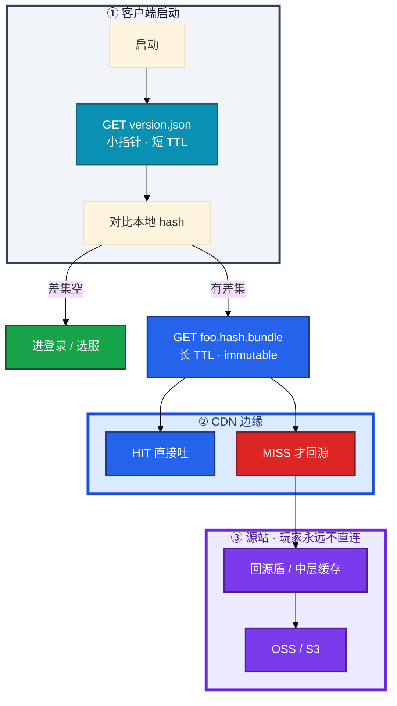
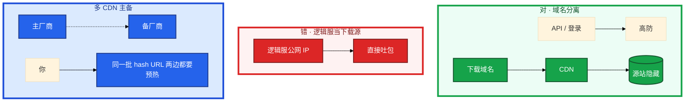
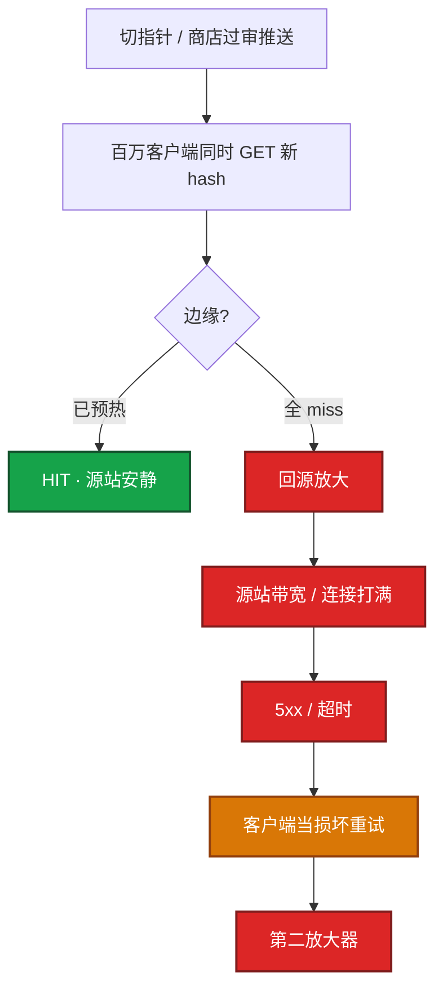
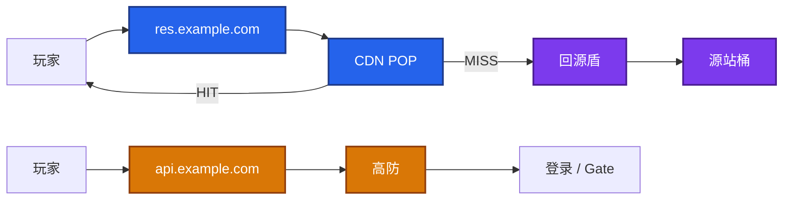
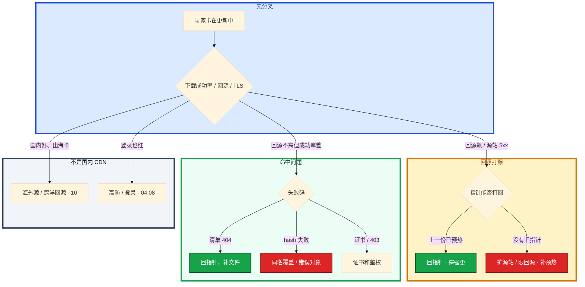

# CDN 与资源更新


版本日，登录还没开始。玩家卡在「更新中」，源站带宽打满。群里有人要全网刷新，另有人要把包挂到逻辑服 Nginx「顶一下」。

先别动手。这一章后半全是你会动手的：**怎么预热、怎么切指针、回源打爆怎么止血、切备怎么验。** 前面的版本模型和回源原理，是为了让你动手时不选错路。

**读完你能：** 白板上画出指针短、文件长、源站不露脸；回源打爆能判断回指针还是定向刷新；会预热验收、灰度指针、失败回滚、切备 CDN。

## 本章目录

缩进 = 上下级。3 下面才是 3.1。

想钉在**正文左边**跟着滚：菜单 **查看 → 打开视图 → 大纲**。Markdown 预览做不到独立左栏，目录只能写在文章开头。

- [1. 基本概念](#1-基本概念)
- [2. 架构图](#2-架构图)
- [3. 原理](#3-原理)
  - [3.1 资源版本](#31-资源版本指针短文件长)
  - [3.2 回源放大](#32-回源放大四条件与第二放大器)
  - [3.3 缓存键](#33-缓存键hash-url-与同名覆盖)
  - [3.4 差分与整包](#34-差分与整包兜底)
- [4. 安装部署](#4-安装部署)
  - [4.1 生产怎么选](#41-生产怎么选)
  - [4.2 域名与源站落地](#42-域名与源站落地你实际看到什么)
- [5. 核心配置](#5-核心配置)
- [6. 常用命令](#6-常用命令)
- [7. 常用操作](#7-常用操作)
  - [7.1 发布](#71-发布先传再预热后切指针)
  - [7.2 预热验收](#72-预热验收)
  - [7.3 止血](#73-回源打爆回指针)
  - [7.4 切备](#74-切备-cdn)
  - [7.5 灰度](#75-灰度指针)
  - [7.6 回滚](#76-回滚)
  - [7.7 多 CDN / 证书](#77-多-cdn--证书)
- [8. 生产排障](#8-生产排障)
- [9. 必会 · 常考](#9-必会--常考)
- [合上书](#合上书问自己)

**本章不讲：** HTTP 缓存语义、DNS TTL、HTTPDNS → [02-10 DNS 与 CDN](../../02-基础底座/10-DNS与CDN/)；代码热更、协议兼容、强更策略 → [03 热更新与版本发布](../03-热更新与版本发布/)；登录排队、min 版本拦人 → [04](../04-登录排队与选服/)；加速器让按地区灰度错位 → [08](../08-游戏网络与对抗/)；海外源站、跨洋回源、分区指针 → [10](../10-出海与多区域/)。

---

## 1. 基本概念

游戏资源更新不是每次下完整安装包。客户端启动先拉一份**小指针**（`version.json` / manifest），拿本地已下文件的 content hash 比对，只拉差集。差集第一次在全球出现时，边缘同时 miss，这就是版本切换的危险窗口。

包体不要从游戏逻辑服提供。逻辑服公网 IP 一旦暴露给下载，DDoS 和带宽账单一起到。下载域名走 CDN，API / 登录走高防，源站藏在 CDN 后。

| 在 CDN 这条路上 | 不在这条路上 |
|-----------------|--------------|
| 包体、差分、整包、渠道包 | 登录鉴权、选服、战斗长连接 |
| `version.json` / manifest | 协议兼容、热更脚本（03） |
| 边缘 HIT / MISS、回源 | 逻辑服 CPU、排队长度 |
| 源站 OSS / S3 | 玩家直连的公网 IP |

三个角色不要混：

| 角色 | 干什么 |
|------|--------|
| **指针** | 告诉客户端「现在该是哪一版」；必须能很快失效 |
| **文件** | 带 content hash 的不可变对象；边缘长持有 |
| **源站** | 只给 CDN 回源；玩家永远不直连 |

> **记住**：下载和登录是两条路。人卡在更新页时，加逻辑服没有用。登录空闲而下载红，按 **CDN 事故**处理。

---

## 2. 架构图

先把整张图钉住。后面预热、切指针、排障都对着这张图说话。



图上三条线：

1. **没有箭头从玩家指向源站。** 源站公网 IP 不进客户端配置。
2. **指针短 TTL**（或可主动失效）；**文件 URL 带内容 hash、长 TTL。**
3. **先传文件、再预热、最后切小指针。** 反过来就是全球同时 miss。

三种生产形态（装的时候选，挂的时候故障域不一样）：



逻辑服暴露之后，清洗和带宽比这次版本日贵得多。下载炸了扩逻辑服没有用。

---

## 3. 原理

原理只保留动手和面试会用到的：版本怎么钉、为什么会打爆源站、缓存键一裂会怎样、差分失败为什么变成整包洪峰。

**本节 4 块：** 3.1 资源版本 · 3.2 回源放大 · 3.3 缓存键 · 3.4 差分

### 3.1 资源版本：指针短、文件长

一次「版本」是四者同一时刻自洽：指针、文件、hash、最低客户端版本（`min_client_version`）。缺一块，客户端要么死循环，要么混装闪退。


| 对象 | TTL / 失效 | 为什么 |
|------|------------|--------|
| 指针 `version.json` | 短（如 30s）或主动失效 | 你切了，边缘必须很快吐新清单 |
| 文件 `foo.<hash>.bundle` | 长（一年 + `immutable`） | 内容变了就是新 URL，旧的自然过期 |
| 灰度指针 | **独立文件名**，不要和全量共用长 TTL URL | 全量玩家偶然拉到灰度 = 事故 |

反过来：指针 `max-age=3600`，你以为切了，边缘还在吐旧清单——表现为「有的人更到新、有的人永远旧」。全量后版本分布仍双峰，优先查指针缓存分裂或灰度 URL 混用。

浏览器 / ISP / CDN 边缘 / 回源盾，是四层缓存。游戏包体以 **CDN 边缘**为准；不要指望浏览器缓存帮你预热。指针绝不能被中间层长持有。

> **记住**：资源版本 = 指针指向的那一组 hash。切指针 = 发布。文件先到、指针后切。`min_client_version` 是另一道闸，CDN 炸时不要叠上去（03、04）。

### 3.2 回源放大：四条件与第二放大器

四个条件同时满足就会炸：

1. 新版本对象很大，或文件很多
2. 边缘尚未有缓存（没预热，或 TTL / LRU 被挤掉）
3. 同时启动的客户端很多（版本日、推送、商店过审瞬间）
4. 源站带宽 / 连接 / 鉴权扛不住



表现：下载成功率掉、耗时到分钟、源站 5xx、玩家卡在更新页。登录看板可能是绿的——人还没登录。排队人数会**假性偏低**，不要据此加大投放。

加重回源的错误操作：

- 全网 purge 后再让玩家自己拉（主动制造全球 miss）
- 源站关缓存头（`Cache-Control: no-cache`）
- 同一文件多 URL（带随机 query），缓存键分裂
- **先切指针、后传文件到源站**（manifest 里的对象 404）
- 同名覆盖、不带 content hash（部分边缘新、部分边缘旧）
- 分片 Range 把一个对象切成大量回源连接

回源盾（origin shield / 中层缓存）把「全球边缘 miss」收成「少数盾节点回源」。没有盾，每个 POP 各自打源站，峰值按 POP 数放大。有盾也不是免预热：盾本身 miss 时，源站仍会吃一波。源站规格按「未预热 × 峰值启动」准备一份应急额度，不要假设预热永远成功。

客户端更新失败默认猛重试，是回源的第二放大器。和客户端约定：指数退避；对 404 停重试；对 403 / 证书提示人工；运维对单一 URL 的源站 QPS 设顶。

### 3.3 缓存键：hash URL 与同名覆盖

边缘按 **缓存键** 存对象。键对不上，预热的那条永远对不上玩家。

| 做法 | 结果 |
|------|------|
| 路径带 content hash：`hero.abc123.bundle` | 新内容新 URL，旧文件自然过期，几乎不用 purge |
| 同名覆盖：`hero.bundle` | 部分地区新、部分地区旧；闪退 / hash 失败 / 重下打爆 |
| query `?v=2` 代替路径 hash | 部分 CDN **默认忽略 query**，键仍是路径 |
| 随机 query / 鉴权头进键 | 预热 URL ≠ 玩家 URL，全 miss |

刷新（purge）只对**内容被覆盖且 hash 相同 URL** 使用。游戏资源应 URL 带内容 hash，少做 purge。覆盖同名是回源和「部分地区新、部分地区旧」的根源。

多 CDN 两家默认是否忽略 query、是否把 Cookie / 鉴权头算进键，事先对一张表，不要切备那天现场发现。

源站鉴权（防盗链、时间戳）过严，边缘 miss 时回源 403，客户端看到的是损坏重下，更炸。预热请求要带着和玩家相同的鉴权方式抽检。

### 3.4 差分与整包兜底

日常热更走文件级差分：hash 变了才下。大文件小改可以二进制差分（bsdiff 一类），合成失败必须能下整包。引擎大改、渠道包、差分失败，才走整包。

| 方式 | 何时用 | 运维风险 |
|------|--------|----------|
| 文件级差分（hash 变了才下） | 日常热更 | 文件碎、请求数暴增，边缘小文件 QPS 高 |
| 二进制差分（bsdiff 等） | 大文件小改 | CPU 合成失败；失败率一高就变成整包洪峰 |
| 整包 | 引擎 / 渠道 / 差分失败 | 带宽峰值、源站压力，容量按最坏算 |
| 分片 + 多线程 | 大包加速 | 同一对象切成大量 range，边缘和源站连接数翻倍 |

灰度时要看**兜底比例**：差分失败 1% 可接受，失败 30% 等于你按整包峰值准备带宽。不要只报「平均下载体积」。关掉整包入口等于让差分失败的玩家永远进不了服。要控的是失败率，不是拆兜底。

> **记住**：差分失败率一高，带宽按整包峰值准备。别把逻辑服当下载源。

---

## 4. 安装部署

### 4.1 生产怎么选

| 项 | 选 | 不选 |
|----|----|------|
| 下载入口 | 独立下载域名 + CDN | 逻辑服公网 IP、和 API 共用 |
| 源站 | OSS / S3，只放行 CDN 回源 IP | 源站对整个公网裸奔 |
| 对象命名 | 路径带 content hash | 同名覆盖、随机 query |
| 预热 | 大版本提前数小时，覆盖指针 / 索引 / 最大 N 包 / 渠道包 | 开服前 10 分钟才点工单 |
| 回源 | 开回源盾；源站留「未预热 × 峰值」额度 | 赌边缘会慢慢热起来 |
| 多 CDN | 主备同一批 hash，切前两边都预热 | 只改 CNAME |
| 海外 | 每 region 独立指针和预热（10） | 国内预热完当天全球切 |

### 4.2 域名与源站落地你实际看到什么



验收：工单绿勾不算数。必须多地区 HEAD/GET 看到 HIT（或厂商等价头），大文件 hash 对得上，且 **切指针前**源站回源带宽已经下降。切完才下降 = 玩家在帮你预热。

证书覆盖下载域名。TLS 失败率单独盯，不要和回源 5xx 混成一条「更新失败」。

---

## 5. 核心配置

只动有证据的项。缓存头和缓存键配错，预热全白做。

| 参数 | 生产怎么用 | 改错会怎样 |
|------|------------|------------|
| 文件 `Cache-Control` | `public, max-age=31536000, immutable` | `no-cache` = 每次回源 |
| 指针 `Cache-Control` | `public, max-age=30`（或版本号 / 主动失效） | `max-age=3600` = 你以为切了 |
| URL | 路径带 content hash | 同名覆盖 → 部分地区旧 |
| 缓存键 | 与客户端 URL 完全一致；确认是否忽略 query、是否含 Cookie | 预热的那条对不上玩家 |
| 源站鉴权 | 防盗链 / 时间戳；预热带同一套 | miss 时回源 403，当损坏重下 |
| 回源并发 | 单 URL 源站 QPS 设顶 | 重试打爆源站 |
| Range | 允许但要限连接 | 分片把回源连接翻倍 |

```
文件：Cache-Control: public, max-age=31536000, immutable
指针：Cache-Control: public, max-age=30

错：文件 no-cache          --> 每次回源
错：指针 max-age=3600      --> 边缘还吐旧清单
错：URL 带随机 query       --> 缓存键分裂
```

> **记住**：预热 URL 必须和客户端完全一致：scheme、大小写、路径、query 一个字母都不能差。http/https 混用也算对不上。

---

## 6. 常用命令

URL 写成变量，避免每条复制出错。验收看头，不看工单。

```bash
URL="https://res.example.com/foo.abc123.bundle"

# 缓存是否命中：X-Cache / Age / ETag / Cache-Control
curl -sI "$URL" | grep -iE 'HTTP/|X-Cache|Age|ETag|Cache-Control'

# 内容 hash 必须和 manifest 一致
curl -s "$URL" | sha256sum

# 指针本身也要抽：短 TTL、版本号对
curl -sI "https://res.example.com/version.json" \
  | grep -iE 'HTTP/|X-Cache|Age|Cache-Control'
```

| 目的 | 做什么 | 看什么 |
|------|--------|--------|
| 预热是否真 HIT | 多地区 `curl -sI` | `X-Cache: HIT`（或厂商等价），`Age` 已增长 |
| 对象对不对 | `sha256sum` | 与 manifest 列出的 hash 一致 |
| 回源是否下来 | 源站带宽图 | **切指针前**已下降 |
| 证书 | TLS 失败率、到期天数 | 失败率抬升而回源不高 = 证书，不是回源打爆 |
| 失败码 | 客户端上报 | 404 / hash / 超时 / 证书必须能分开 |

值班看板就这几条：下载成功率、回源比、源站 5xx、指针版本分布、TLS 失败。登录空闲而下载红，按 CDN 事故处理。

客户端上报「更新失败码」要能区分：404 清单、hash 失败、超时、证书。否则值班只会听到「更新不了」。失败码进告警比只看带宽有用。

---

## 7. 常用操作

### 7.1 发布：先传、再预热、后切指针

一致性 = 指针、文件、hash、`min_client_version` 同一时刻自洽。顺序固定：

1. 文件全部上传源站，hash 与 manifest 一致
2. 预热并抽检 HIT + hash
3. 服务端已兼容该资源对应的协议 / 配置（见 03，不要只切包体）
4. 原子切换小文件指针（`version.json`）
5. 观察：下载成功率、回源带宽、客户端崩溃、指针版本分布
6. 失败：指针打回旧清单，不删源站新文件（便于再切）

文件还在传就切 `version.json`：manifest 列出的文件 404 → 客户端死循环更新。部分文件新、部分旧 → 闪退，看起来像客户端 bug。

### 7.2 预热验收

预热：把「即将成为热对象」的 URL 推到主要边缘。版本日至少覆盖：指针、资源总索引、体积最大的 N 个包、当前渠道包。预热有配额和排队，大版本提前数小时跑。

验收**不靠**「预热任务显示成功」：

1. 多地区节点 HEAD/GET，看到 HIT（或厂商等价头）
2. 抽检大文件完整性和 hash
3. 源站回源带宽在切指针前已经下降

你眼睛看到工单绿勾、现场仍 miss：先对真实客户端 URL，不要先怪厂商。query 多一个参数、http/https 混用、缓存键含 Cookie / 鉴权头、文件被 LRU 挤掉，都会让「预热成功」变成现场 miss。

预热排队失败、版本必须切：源站按「未预热 × 峰值启动」留应急额度，或推迟切指针。不要赌「边缘会慢慢热起来」。

### 7.3 回源打爆：回指针

止血顺序固定，不要先「做点刷新」：


1. 把版本指针打回上一份**已预热**的 manifest（立刻减新对象回源）
2. 或登录侧暂停强制更新，旧资源协议兼容就允许进服
3. 源站扩、限下载并发、开更激进的缓存头
4. 预热完成再切回新指针
5. **最后**才考虑定向刷新确认脏的少量 URL，不做无脑全网刷新

CDN 炸时不抬 `min_client_version`、不加投放、不扩逻辑服。人堵在更新，再被强更挡，客诉不可分。排队人数假性偏低。下载和登录两块看板，指挥是一个人。

协议已经不兼容、旧资源进服会炸：不能放旧资源进服。只能回指针或修 CDN，让人先更新完。更不能再抬 min 叠一道门。

### 7.4 切备 CDN

只切 CNAME 不够。两家缓存键、预热接口、证书、鉴权头都可能不同。

1. 同一批 hash URL 在备上预热，多地抽检 HIT
2. 证书覆盖下载域名，TLS 失败率单独看
3. 防盗链 / 时间戳在备上回源也要通
4. 切完盯命中率和下载成功率，不盯「CNAME 已改」

主备都 miss 时切 CNAME 没有用。两边都没对象，切来切去只是换一家回源。先回指针。

### 7.5 灰度指针

灰度指针和全量指针**不要共用一个会被长 TTL 缓存的 URL**。灰度用带名单的接口或独立文件名，避免全量玩家偶然拉到灰度清单，也避免灰度结束全网还缓存着灰度指针。

CDN 灰度按地区容易和加速器出口错位，优先按账号而不是按 IP（加速器见 [08](../08-游戏网络与对抗/)）。

### 7.6 回滚

失败回滚：指针打回即可，**不先删源站新文件**。删了之后你无法再切回去，预热也白做。

已下完新包的端不一定听旧指针（见 03）。回指针解决的是「还没下完 / 还没切到新清单」的人，以及立刻减回源。

### 7.7 多 CDN / 证书

证书过期表现像「更新失败」，和回源打爆容易混；监控单独做到期和 TLS 失败率。TLS 失败时回源带宽往往并不高；回源打爆是源站带宽和 5xx 先响。

海外独立源站时，国内预热完成不等于海外可切指针（[10](../10-出海与多区域/)）。

---

## 8. 生产排障

和登录同一套三问：人卡在哪一页？下载成功率掉没掉？源站回源是不是先响？

**CDN 不可用 = 进不了登录，不是逻辑服挂了。** 登录看板绿、下载红，按 CDN 指挥。



现场顺序：

```bash
# 1. 看板：下载成功率、回源比、源站 5xx、TLS、版本分布
# 2. 对真实客户端 URL 抽 HIT / hash
curl -sI "$URL" | grep -iE 'X-Cache|Age|HTTP/'
curl -s "$URL" | sha256sum
# 3. 能回指针就回；不要全网 purge
```

| 现象 | 先做什么 | 不要做什么 |
|------|----------|------------|
| 源站 5xx、回源飙、登录绿 | 回已预热指针；限回源 | 全网 purge；扩逻辑服；加投放 |
| 工单绿、现场 miss | 对客户端真实 URL / 缓存键 | 先怪厂商、先改国内预热参数 |
| 死循环更新 | manifest 文件 404：回指针补文件 | 当客户端 bug |
| 部分地区闪退 | 同名覆盖或源未同步 | 无脑全网刷新 |
| 全量后版本双峰 | 指针缓存分裂 / 灰度 URL 混用 | 「玩家不愿更新」 |
| TLS 失败、回源不高 | 证书到期、域名覆盖 | 当回源打爆去扩源站 |
| 国内 99%、出海卡 | 海外源 / 预热 / 跨洋（10） | 改国内预热并发 |
| 差分失败率跳到 25% | 按整包峰值准备；控失败率 | 关掉整包入口 |

生产故事：商店过审瞬间渠道推送把日活拉起来，指针已切、最大包没预热完。源站 5xx，登录 P99 还是绿的。有人全网 purge「清缓存」，回源再翻一倍。正确动作是指针打回上一份已 HIT 的清单，最大包补预热，抽检多地 HIT 再切回去。

---

## 9. 必会 · 常考

白板和追问高频，能一口回：

| 说法 | 对错 | 口径 |
|------|:----:|------|
| 人卡在更新页，先扩逻辑服 | 错 | 下载和登录两条路 |
| 回源打爆先全网 purge | 错 | 主动制造全球 miss；先回指针 |
| 预热工单绿勾 = 可以切指针 | 错 | 多地 HIT + hash 对 + 切前回源已降 |
| 文件和指针用一样的长 TTL | 错 | 指针短、文件长 + hash URL |
| 同名覆盖再 purge 就行 | 错 | 部分边缘新旧并存；用 content hash |
| query `?v=` 一定能当版本 | 错 | 部分 CDN 忽略 query |
| 差分失败就关掉整包省带宽 | 错 | 失败的人永远进不了服 |
| CDN 炸时抬 min 逼人更新 | 错 | 客诉不可分；排队人数假性偏低 |
| 失败回滚先删源站新文件 | 错 | 回指针即可；删了不能再切 |
| 切备只改 CNAME | 错 | 先在备上预热同一批 hash |
| 证书过期就是回源打爆 | 错 | TLS 失败而回源不高 |
| 国内预热完就能切全球指针 | 错 | 海外独立源 / 预热（10） |

数字：指针 TTL 常见 **30s**；文件 `max-age=31536000`；差分失败 1% 可接受、**30%** 按整包容量；预热提前 **数小时**；证书单独盯到期。

易混：HIT 工单 vs 真 HIT；回源打爆 vs TLS；指针缓存分裂 vs 玩家不愿更新；全网 purge vs 定向刷新；下载红 vs 登录红；灰度 URL vs 全量 URL。

---

## 合上书，问自己

1. 谁唯一碰源站？指针和文件的 TTL 为什么不能一样？
2. 回源打爆四个条件？止血先做什么、为什么不能先 purge？
3. 预热怎样才算成功？URL 对不上会怎样？
4. 发布六步顺序？失败为什么不删源站新文件？
5. 下载域名和 API 为什么必须分开？切备要验什么？
6. CDN 炸时该不该抬 min、加投放、扩逻辑服？全量后版本双峰查什么？

六题都能口述，这一章就过了。下一章把玩家数据剖开：备份分层、PITR 按角色还是按服、回档怎么防二次伤害。
