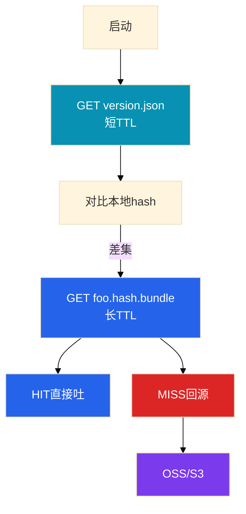

# CDN 与资源更新


版本日，玩家卡在「更新中」，源站带宽打满。群里有人要全网 purge，另有人把包挂到逻辑服 Nginx「顶一下」。这一章只做一件事——**先传、再预热、最后切指针；回源打爆先回指针**。

**本章主线（发布就按这三步想）：**

1. **分离**：下载走 CDN，登录/API 走高防；逻辑服不当下载源。
2. **版本**：指针短 TTL，文件 URL 带 content hash 长 TTL；四元组（指针、文件、hash、min）同一时刻自洽。
3. **止血**：回源打爆 → 回上一份已预热指针；不要全网 purge；CDN 炸不叠抬 min。

**读完你能：** 画指针短文件长、源站不露脸；预热验收 HIT+hash；切备 CDN 两边都预热。

## 本章目录

- [1. 基本概念](#1-基本概念)
- [2. 架构图](#2-架构图)
- [3. 原理](#3-原理)
- [4. 落地](#4-落地)
- [5. 核心配置](#5-核心配置)
- [6. 命令与操作](#6-命令与操作)
- [7. 生产排障](#7-生产排障)
- [8. 必会 · 常考](#8-必会--常考)
- [合上书](#合上书问自己)

**本章不讲：** HTTP 缓存语义 → [02-10 DNS与CDN](../../02-基础底座/10-DNS与CDN/)；热更协议 → [03](../03-热更新与版本发布/)；登录 min → [04](../04-登录排队与选服/)；加速器 → [08](../08-游戏网络与对抗/)；海外 → [10](../10-出海与多区域/)。

---

## 1. 基本概念

客户端启动先拉**小指针**（`version.json`），对比本地 hash 只拉差集。差集第一次全球出现 = 版本切换危险窗口。

| 角色 | 干什么 |
|------|--------|
| **指针** | 告诉客户端「现在该哪一版」；必须快失效 |
| **文件** | 带 content hash 的不可变对象；边缘长持有 |
| **源站** | 只给 CDN 回源；玩家永远不直连 |

> **记住：** 下载和登录是两条路。人卡在更新页，加逻辑服没用。登录绿、下载红 = **CDN 事故**。

---

## 2. 架构图



**读图三句话：**

1. 没有箭头从玩家指向源站。
2. 指针短 TTL；文件 URL 带 hash、长 TTL。
3. 先传文件、再预热、最后切指针——反过来 = 全球同时 miss。

---

## 3. 原理

### 3.1 指针短、文件长

| 对象 | TTL | 为什么 |
|------|-----|--------|
| 指针 | 短（如 30s） | 切了边缘须快吐新清单 |
| 文件 `foo.<hash>.bundle` | 长+`immutable` | 内容变=新 URL |
| 灰度指针 | **独立文件名** | 勿和全量共用长 TTL URL |

### 3.2 回源放大

四条件同时满足就炸：① 对象大/多 ② 边缘无缓存 ③ 同时启动客户端多 ④ 源站扛不住。

加重回源的错误操作：全网 purge；文件 `no-cache`；先切指针后传文件；同名覆盖不带 hash。

客户端失败猛重试 = 第二放大器。约定指数退避；404 停重试。

### 3.3 缓存键

| 做法 | 结果 |
|------|------|
| 路径带 hash | 新内容新 URL，几乎不用 purge |
| 同名覆盖 | 部分地区新、部分地区旧 |
| query `?v=2` | 部分 CDN 忽略 query |

预热 URL 必须和客户端**完全一致**（scheme、路径、query 一个字母不能差）。

### 3.4 差分与整包

差分失败率一高，带宽按整包峰值准备。关掉整包入口 = 差分失败的人永远进不了服。

---

## 4. 落地

| 项 | 选 | 不选 |
|----|----|------|
| 下载入口 | 独立域名+CDN | 逻辑服公网 IP |
| 对象命名 | 路径带 content hash | 同名覆盖 |
| 预热 | 大版本提前数小时 | 开服前 10 分钟才点 |
| 多 CDN | 主备同一批 hash 都预热 | 只改 CNAME |
| 海外 | 每 region 独立指针预热（10） | 国内预热完全球切 |

验收：多地 HIT + hash 对 + **切指针前**源站回源带宽已下降。

---

## 5. 核心配置

```
文件：Cache-Control: public, max-age=31536000, immutable
指针：Cache-Control: public, max-age=30

错：文件 no-cache          → 每次回源
错：指针 max-age=3600      → 你以为切了边缘还吐旧清单
错：URL 带随机 query       → 缓存键分裂
```

| 参数 | 改错会怎样 |
|------|------------|
| 源站鉴权过严 | miss 时 403，客户端当损坏重下 |
| Range 无限制 | 分片把回源连接翻倍 |

---

## 6. 命令与操作

```bash
URL="https://res.example.com/foo.abc123.bundle"
curl -sI "$URL" | grep -iE 'HTTP/|X-Cache|Age|Cache-Control'
curl -s "$URL" | sha256sum
curl -sI "https://res.example.com/version.json" | grep -iE 'X-Cache|Cache-Control'
```

典型输出（已 HIT）：

```text
HTTP/2 200
X-Cache: HIT
Age: 842
Cache-Control: public, max-age=31536000, immutable
```

### 发布六步

1. 文件全部上传，hash 与 manifest 一致
2. 预热并抽检 HIT+hash
3. 服务端已兼容该资源协议（03）
4. 原子切换指针
5. 观察下载成功率、回源、版本分布
6. 失败：指针打回，**不删**源站新文件

### 回源打爆止血

回上一份已预热指针 → 或暂停强制更新 → 源站扩/限并发 → 预热完再切 → **最后**才定向刷新脏 URL。

### 切备 CDN

同一批 hash URL 在备上预热，多地 HIT；证书覆盖下载域名；防盗链在备上回源也要通。

---

## 7. 生产排障

| 现象 | 先做 | 别做 |
|------|------|------|
| 源站 5xx、登录绿 | 回已预热指针 | 全网 purge；扩逻辑服 |
| 工单绿、现场 miss | 对客户端真实 URL | 先怪厂商 |
| manifest 404 死循环 | 回指针补文件 | 当客户端 bug |
| 部分地区闪退 | 同名覆盖/源未同步 | 无脑全网刷新 |
| TLS 失败、回源不高 | 证书到期 | 当回源打爆扩源站 |
| 国内好、出海卡 | 海外源/预热（10） | 改国内预热 |
| CDN 炸 | — | 叠抬 min、加投放 |

---

## 8. 必会 · 常考

| 说法 | 对错 | 口径 |
|------|:----:|------|
| 卡在更新页先扩逻辑服 | 错 | 下载和登录两条路 |
| 回源打爆先全网 purge | 错 | 先回指针 |
| 预热工单绿=可切指针 | 错 | 多地 HIT+hash+切前回源降 |
| 文件和指针一样长 TTL | 错 | 指针短、文件长+hash |
| 同名覆盖再 purge 就行 | 错 | 用 content hash |
| 差分失败关整包省带宽 | 错 | 失败的人永远进不了 |
| CDN 炸时抬 min | 错 | 客诉不可分 |
| 失败回滚先删源站新文件 | 错 | 回指针即可 |
| 切备只改 CNAME | 错 | 先在备上预热 |
| 国内预热完切全球指针 | 错 | 海外独立源 |

数字：指针 TTL 常见 **30s**；文件 max-age **31536000**；差分失败 30% 按整包容量；预热提前**数小时**。

---

## 合上书，问自己

1. 谁唯一碰源站？指针和文件 TTL 为什么不同？
2. 回源四条件？止血先做什么？
3. 预热怎样才算成功？
4. 发布六步顺序？
5. 下载和 API 为什么分开？
6. CDN 炸该不该抬 min、扩逻辑服？

六题能口述，这一章就过了。下一章：[玩家数据备份与回档](../07-玩家数据备份与回档/)。
