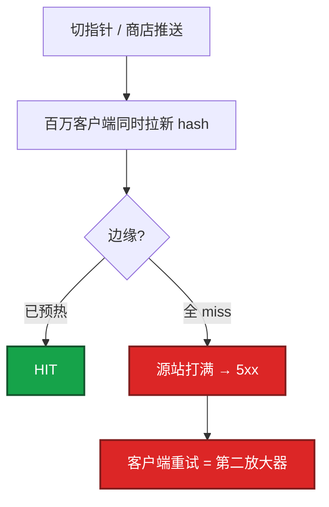
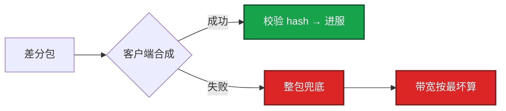
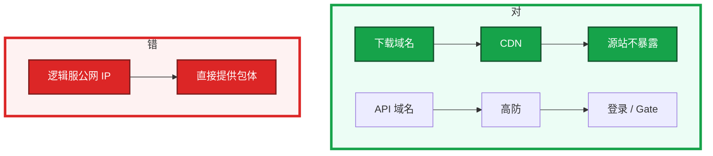
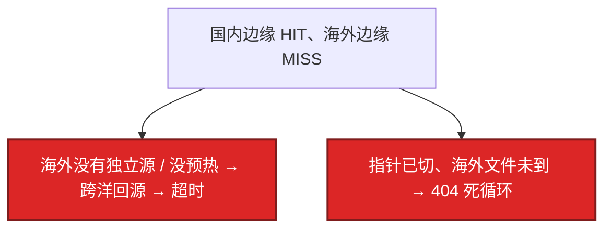

# 06｜CDN 与资源更新 · 练习题

先自己画图或口述，再对照解答。每题标了覆盖范围：

| 标记 | 含义 |
|------|------|
| **核心** | 不懂整章就没建立起来 |
| **必会** | 值班和面试都要能讲 |
| **常用** | 线上会反复碰到 |
| **常考** | 白板和追问的高频口径 |

## 本题目录

- [Q1 回源打爆四条件 / 止血](#q1)
- [Q2 预热怎样才算成功](#q2)
- [Q3 发布顺序 / 指针 TTL](#q3)
- [Q4 差分失败与整包兜底](#q4)
- [Q5 下载域名不能挂逻辑服](#q5)
- [Q6 CDN 炸时不抬 min](#q6)
- [Q7 hash URL vs 同名覆盖](#q7)
- [Q8 失败码分流](#q8)
- [Q9 出海节点全卡](#q9)
- [Q10 切备 CDN](#q10)
- [合上书](#合上书)

---

## Q1

**★★★★★｜版本日回源打爆要同时满足什么？你先做什么？为什么不能先全网刷新？**

**覆盖**：核心 · 必会 · 常考

### 场景

商店过审瞬间渠道推送把日活拉起来。下载成功率掉到 60%，源站 5xx，登录看板还是绿的。群里有人要「全网 purge 再预热」。

### 完整解答

四个条件同时满足才会炸：新对象大或文件多、边缘无缓存、同时启动的客户端多、源站扛不住。登录空闲是正常的——人卡在更新页，还没进服。



止血顺序：

1. 指针打回上一份**已预热**的 manifest，立刻减新对象回源
2. 或暂停强制更新，旧资源协议兼容就允许进服
3. 源站扩、限下载并发、确认缓存头
4. 预热完、多地 HIT，再切回新指针
5. **最后**才定向刷新确认脏的少量 URL

加重回源：同名覆盖、随机 query 分裂缓存键、先切指针后传文件、源站 `no-cache`、无脑全网 purge。

### 再追问

- 为什么 purge 会更糟？——主动制造全球 miss，所有人再打源站。只对确认脏的少量 URL 定向刷。
- 排队人数很少能不能加投放？——不能。人还没登录，排队假性偏低。

---

## Q2

**★★★★★｜预热怎样才算成功？预热后切指针仍然 miss 呢？**

**覆盖**：核心 · 必会 · 常用

### 场景

厂商控制台显示「预热任务成功」。一切指针，回源带宽照样冲高。有人说 CDN 厂商骗人。

### 完整解答

工单绿勾不够。验收三件事，缺一不可：多地区 HEAD/GET 看到 HIT；大文件 hash 和 manifest 一致；源站回源带宽在**切指针前**已经下降（切完才降 = 玩家在帮你预热）。

```bash
curl -sI "https://res.example.com/foo.abc123.bundle" \
  | grep -iE 'HTTP/|X-Cache|Age|ETag'
curl -s "https://res.example.com/foo.abc123.bundle" | sha256sum
```

URL 必须和客户端完全一致（scheme / 大小写 / query）。至少覆盖：指针、索引、体积最大的 N 个包、当前渠道包。大版本提前数小时，盯厂商配额和排队。源站鉴权要带着和玩家相同的方式抽检，否则边缘 miss 时回源 403。

预热后仍 miss，先对真实客户端 URL：query 多一个参数、http/https 混用、缓存键含头、文件被 LRU 挤掉。不要先改国内预热参数去救一个 URL 对不上的问题。

### 再追问

预热排队失败、版本必须切？——源站按「未预热 × 峰值启动」留应急额度，或推迟切指针。不要赌边缘会慢慢热起来。回源盾能把全球 miss 收成少数节点回源，但盾 miss 时源站仍会吃一波。

---

## Q3

**★★★★★｜资源发布顺序怎么排？指针和文件的 TTL 为什么不能一样？**

**覆盖**：核心 · 必会 · 常考

### 场景

文件还在传，有人先把 `version.json` 切了。部分客户端死循环更新，部分闪退。全量后版本分布仍是双峰。

### 完整解答

1. 文件全部上传源站，hash 与 manifest 一致
2. 预热并抽检 HIT + hash
3. 服务端已兼容该资源对应的协议 / 配置
4. 原子切换小指针
5. 观察下载成功率、回源、崩溃、版本分布
6. 失败：指针打回，不删源站新文件

指针必须小、短 TTL（或可主动失效），文件 URL 带 content hash、长 TTL。反过来：指针缓存 1 小时，你以为切了，边缘还在吐旧清单。全量后版本分布仍双峰，优先查指针缓存分裂或灰度 URL 和全量 URL 混用。

灰度指针不要和全量指针共用一个会长 TTL 缓存的 URL。按账号灰度，不要按 IP（加速器出口会让地区灰度错位）。

manifest 列出的文件 404 → 客户端死循环。部分文件新、部分旧 → 闪退。hash 对不上 → 当损坏重下，变成回源放大器。

### 再追问

失败要删源站新文件吗？——不先删，便于再切。指针已回旧即可。

---

## Q4

**★★★★☆｜差分失败为什么必须有整包兜底？兜底的风险怎么容量？**

**覆盖**：必会 · 常用

### 场景

二进制差分灰度，合成失败率到 25%。有人说「失败就重试差分」，带宽看板开始抖。另有人要关掉整包入口省带宽。

### 完整解答

合成失败、丢块、hash 错时，客户端必须能改走整包，否则卡死在更新页。风险是带宽和回源峰值：失败率一旦从 1% 跳到 25%，你的「差分更新」在容量上就是整包洪峰。



灰度时盯兜底比例，不要只报平均下载体积。容量按「最坏整包 × 峰值启动」留应急，和「没预热成功」是同一类预案。

### 再追问

能不能关掉整包入口省带宽？——不能。关掉等于让差分失败的玩家永远进不了服。要控的是失败率，不是拆兜底。

---

## Q5

**★★★★☆｜下载域名为什么不能和 API 共用游戏逻辑入口？**

**覆盖**：必会 · 常考

### 场景

版本日临时把包挂到逻辑服 Nginx「顶一下」。第二天公网 IP 开始挨打，高防账单和带宽一起炸。

### 完整解答

下载吃带宽、请求数高、是 DDoS 面。逻辑入口应在高防后，且不提供大文件。源站隐藏在 CDN 后，玩家只打下载域名。



逻辑服暴露之后，清洗和带宽比这次版本日贵得多。下载炸了扩逻辑服没有用。

### 再追问

源站能不能给运维临时直连调试？——内网或带鉴权的管理入口可以。不要把调试 URL 发给玩家或进客户端配置。

---

## Q6

**★★★★☆｜CDN 炸的时候能不能同时抬 min 版本？排队人数很少能不能加投放？**

**覆盖**：必会 · 常用 · 常考

### 场景

更新卡住，运营想抬 `min_client_version`「逼人更新」。投放看排队很短，准备加买量。

### 完整解答

不能同时抬 min。人堵在更新，再被强更挡，客诉不可分，你也无法判断是 CDN 还是强更策略的问题。旧资源协议兼容，就允许跳过非强制更新进服，换登录恢复。

排队人数会假性偏低（人还没登录），不要据此加大投放。CDN 未恢复时：不加买量、不抬 min、不扩逻辑服。下载和登录两块看板，指挥是一个人。

### 再追问

协议已经不兼容，旧资源进服会炸怎么办？——不能放旧资源进服。只能回指针或修 CDN，让人先更新完。更不能再抬 min 叠一道门。

---

## Q7

**★★★★☆｜为什么资源 URL 要带内容 hash？同名覆盖会导致什么？**

**覆盖**：必会 · 常用 · 常考

### 场景

为了「URL 好看」，资源始终叫 `res/hero.bundle`，每次覆盖上传。部分地区玩家闪退，部分正常。有人全网刷新。

### 完整解答

新内容新 URL（`hero.abc123.bundle`），边缘按 URL 缓存，旧文件自然过期，几乎不用 purge。覆盖同名是「部分地区新、部分地区旧」的根源：有的边缘还是旧对象，有的已经是新的，客户端按新 manifest 校验就失败或混装闪退。

刷新救不了根因，还会在未预热的对象上制造更多 miss。正确路径是带 hash 的新 URL + 预热 + 切指针。

### 再追问

query 上带版本号 `?v=2` 能不能代替路径 hash？——部分 CDN 默认忽略 query，缓存键仍是路径。要么配置缓存键包含 query，要么把 hash 放进路径。路径 hash 更不容易踩配置。

---

## Q8

**★★★★☆｜客户端校验失败（hash / 404 / 证书）你怎么止血？怎么区分？**

**覆盖**：必会 · 常用

### 场景

值班只听到「更新不了」。带宽还行，成功率很差。有人要刷新全网。

### 完整解答

失败码必须能分开，否则只会空转：

| 失败码 | 含义 | 先做什么 |
|--------|------|----------|
| 清单 404 | 指针切了，文件没传完或 URL 错 | 回指针，补文件，不要 purge |
| hash 失败 | 下到的内容和 manifest 不一致 | 查同名覆盖、错误对象、中间人 |
| 超时 | 边缘 miss 或源站慢 | 回指针 / 限回源，查预热 |
| 证书 / 403 | TLS 过期或防盗链把玩家和预热挡了 | 证书和鉴权，别当回源打爆 |

客户端对 404 应停重试；对证书提示人工；对超时指数退避。运维对单一 URL 源站 QPS 设顶，防止重试成为第二放大器。

### 再追问

TLS 失败率和回源打爆怎么分？——TLS 失败时回源带宽往往并不高，证书到期监控会先响。回源打爆是源站带宽和 5xx 先响。看板要分开。

---

## Q9

**★★★☆☆｜出海节点更新全卡、国内正常，你怎么查？**

**覆盖**：常用 · 常考

### 场景

国内下载成功率 99%，东南亚卡住。有人要改国内预热并发。

### 完整解答

分 region 看 HIT、源站是不是只有国内一份、跨洋回源时延。指针和文件是否同步到海外源。国内预热完成不等于海外可切指针。



不要先改国内预热参数。分区指针、多源、跨洋回源见第 10 章。

### 再追问

能不能全球共用一个源站省钱？——回合制、包体小或许能忍。版本日远距回源会变成更新事故。主流是每 region 独立指针和预热。

---

## Q10

**★★★☆☆｜切备 CDN 只改 CNAME 行不行？多 CDN 要验什么？**

**覆盖**：必会 · 常用

### 场景

主 CDN 抖动，有人改 CNAME 切到备厂商。切完证书报错，备上全是 miss。

### 完整解答

只切 CNAME 不够。两家缓存键、预热接口、证书、鉴权头都可能不同。切备之前：同一批 hash URL 在备上预热并多地抽检 HIT；证书覆盖下载域名；防盗链 / 时间戳在备上回源也要通；切完盯命中率和下载成功率，不盯「CNAME 已改」。

证书过期表现像更新失败，容易和回源打爆混。监控单独做到期。

### 再追问

主备都 miss 时切 CNAME 有没有用？——没有。两边都没对象，切来切去只是换一家回源。先回指针。

---

## 合上书

- [ ] 能画出「指针短、文件长、源站不露脸」和下载 / 登录两条路
- [ ] 能说回源打爆四条件和止血顺序，为什么不能先 purge
- [ ] 能把预热验收讲到多地 HIT + hash + 切前回源已降
- [ ] 能默写发布六步，并说明失败回指针、不删源站新文件
- [ ] 能区分 hash URL vs 同名覆盖、回源打爆 vs TLS、国内 HIT vs 出海 miss
- [ ] 能说 CDN 炸时不抬 min、不加投放、不扩逻辑服；切备先预热同一批 hash
