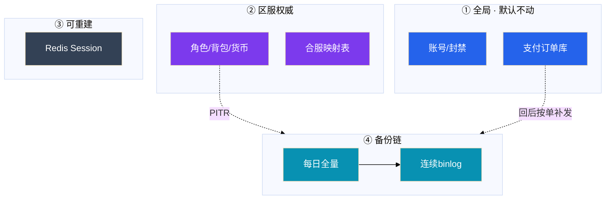

# 玩家数据备份与回档


活动掉落多写了一个零。群里有人说「整服回今早的快照」，另有人已经打开主库准备 `UPDATE` 货币——玩家 14:30 刚充了 648。**能补偿就不改历史；要回档先锁范围、留现场、导支付清单。**

**本章主线（数据事故就按这三步想）：**

1. **分层**：账号/支付近实时；角色 5～15 min RPO；Redis/聊天可重建——不要一套 dump 打天下。
2. **粒度**：补偿/GM → 按角色 PITR → 按服 PITR；能小范围就不整服。
3. **防二次伤害**：回档前导窗口内支付清单；校验失败回现场，不叠打更早位点。

**读完你能：** 画哪些库动、哪些不动；判断补偿/单号 PITR/整服 PITR；合服后只认映射表。

## 本章目录

- [1. 基本概念](#1-基本概念)
- [2. 架构图](#2-架构图)
- [3. 原理](#3-原理)
- [4. 落地](#4-落地)
- [5. 核心配置](#5-核心配置)
- [6. 命令与操作](#6-命令与操作)
- [7. 生产排障](#7-生产排障)
- [8. 必会 · 常考](#8-必会--常考)
- [合上书](#合上书问自己)

**本章不讲：** MySQL 机制 → [03-01 MySQL](../../03-中间件与数据库/01-MySQL/)；合服步骤 → [02](../02-开服合服/)；配置停产出 → [03](../03-热更新与版本发布/)；事故定级 → [09](../09-游戏SRE稳定性/)。

---

## 1. 基本概念

回档 = **受控数据恢复**：范围、时间点、审批、校验四件套。权威在 DB，不是 Redis，不是云盘快照。

**值班里什么时候碰到：**

| 场景 | 谁喊什么 | 你的第一刀 |
|------|----------|------------|
| 配错掉落 | 「整服回 0 点 dump」 | 先停产出（03），评估粒度 |
| 单号误操作 | 「这号金币多了」 | 锁号、补偿或按角色 PITR |
| 合服后 | 「号没了」 | 映射表，不是 LIKE 角色名 |
| 有人要裸改 | 「我 SQL 比较熟」 | 拒绝交互式 UPDATE |

口诀：**能小范围就不整服；能补偿就不改历史；能走 GM 就不碰主库。**

| 在回档范围 | 不在回档范围 |
|------------|--------------|
| 角色/背包/货币/任务 | 全局支付订单（按单补发） |
| 邮件附件、拍卖未结算 | 账号库、封禁名单 |
| 回档前现场备份 | Redis Session（丢了重建） |

回档三问：

1. 哪些 `server_id + uid`（合服后走映射）
2. 回到哪个位点/备份集
3. 该时间后的**充值、消耗、P2P** 怎么处理

> **记住：** 只回 MySQL 不处理支付清单 = 二次伤害。生产交互式 `UPDATE` 货币 = 不合格。

**面试怎么说**：「能补偿就不改历史。回档前导窗口内支付清单，只回角色库不回订单库——误回订单可能重复发货。」

---

## 2. 架构图



**读图三句话：**

1. 支付库和角色库备份策略分开——误回订单库可能重复发货。
2. 映射表单独落盘，权限高于普通业务表。
3. 云盘快照是整机保险，不是玩家级回档工具。

---

## 3. 原理

### 3.1 RPO/RTO 分层

**一句话：** 账号/支付近零 RPO；角色 5～15 min；Redis 可丢——不要一套 dump 打天下。

**打个比方**：备份像不同保险柜——**收银台（支付）要实时录像，仓库（角色）允许丢几分钟，临时便签（Redis）丢了能重写**。

**现场走一遍**（有人提议「Redis AOF 够用了，角色库少备」）：

1. Redis AOF 丢 30s → Session 重建，玩家重登即可。
2. 角色库若只日备 → RPO 变 24h，活动配错 14:00 发现 15:00 只能回到昨天。
3. 正确：角色全量+binlog，RPO 5～15 min；支付近实时。
4. 延迟从库能扛「删错几小时后发现」；普通从库会把误操作立刻复制过去。
5. 没 restore 过的 cron = 没有备份。

| 数据 | 典型 RPO | 典型 RTO |
|------|----------|----------|
| 账号、支付 | 接近 0 | 分钟级 |
| 角色、背包 | 5～15 min | 单服小时级 |
| Redis 热状态 | 允许丢 | 重启加载 |
| 聊天 | 可丢 | — |

**面试怎么说**：「Redis 不能当合服/回档权威。云盘快照是整机保险，不是玩家级回档按钮。」

### 3.2 PITR：按角色 / 按服

**一句话：** 位点选出错配置生效前最近一致点；能小范围就不整服。

**打个比方**：PITR 像视频倒带——**倒到配错生效前一帧，不是随便倒到早上 0 点**。

**现场走一遍**（掉落 0.02→0.2，14:00 生效，15:00 发现）：

1. 全量 02:00；误操作 14:00；发现 15:00。
2. PITR 停在 **13:59:59**（配置生效前），不是今天 0 点。
3. 14:00 后写入单独处理：导窗口内支付清单，回后按单补发。
4. 单 uid 误操作 → 按角色 PITR；经济已扩散拍卖/全服 → 按服 PITR。
5. binlog 断段 = 存储事故，不是单玩家脚本能修。

```
全量 02:00    误操作 14:00    发现 15:00
                  |
         PITR 停在 13:59:59
         14:00 后写入单独处理（支付清单补发）
```

| 粒度 | 何时用 | 不要用 |
|------|--------|--------|
| 补偿/GM | 能加回、能追回 | 手改字段当小回档 |
| 按角色 | 单 uid 误操作 | 经济已扩散到拍卖/全服 |
| 按服 | 掉落配错、库级写坏 | 「随便今晚 dump」 |

**面试怎么说**：「校验失败回到回档前现场备份，不要再试更早位点叠打。外挂刷货默认冻号取证，不是整服回档。」

### 3.3 二次伤害

**一句话：** 回档前导窗口内支付成功单；P2P 要产品规则；整服回档必须停写。

**打个比方**：回档像撤销转账——**只撤游戏币不撤银行扣款 = 玩家钱扣了道具没了，二次事故**。

**现场走一遍**（整服回到 13:59，没导支付清单）：

1. 玩家 A：14:30 充 648，15:00 回档到 13:59。
2. 支付库不动 → 银行扣了 648；角色库回到回档前 → 道具没了。
3. 工单爆炸：「钱扣了没到账」。
4. 正确：回档前导窗口内支付成功单 → 回后按单补发。
5. P2P：邮给好友的装备、拍卖成交 → 产品规则 + 人工工单。

**面试怎么说**：「只回 MySQL 不处理支付清单 = 二次伤害。生产 UPDATE 货币修一下 = 裸改，不合格。」

### 3.4 合服后只认映射表

**一句话：** 合服前后备份不是同一套主键；禁止 `UPDATE region` 换区。

**打个比方**：合服后 uid 像换过身份证号——**按名字（角色名）找人对不上，必须查对照表（映射）**。

**现场走一遍**（合服后玩家说号没了）：

1. 客服 `SELECT * FROM role WHERE name LIKE '%龙之%'`` → 多条或无结果。
2. 正确：查映射表 `old(server_id, uid) → new_id` + 目录跳转。
3. 映射丢了 = 停修，从备份链恢复映射——不是继续改库。
4. 禁止 `UPDATE region='us'` ——换区 = 小型合服迁移（02）。
5. 跨法域换区默认拒绝，除非产品+法务书面允许。

**面试怎么说**：「合服后只认映射表，不按角色名撞。换区是迁移作业，不是改一个字段。」

---

## 4. 落地

| 项 | 选 | 不选 |
|----|----|------|
| 角色备份 | 全量+binlog；按 server_id 能单独 restore | 一套 dump 打支付+角色+聊天 |
| 演练 | 季度按服+按角色各一次 | 从没 restore 的 cron |
| 权限 | 备份桶与生产分离 | oncall 整库下笔记本 |
| 快照 | 机器级保险 | 当玩家级回档按钮 |

验收：restore 过、抽样高 V 对得上、记下耗时。没演练 = 没有备份。

---

## 5. 核心配置

| 参数 | 改错会怎样 |
|------|------------|
| binlog 保留过短 | 过期只能退最近全量，RPO 变一天 |
| 延迟从库太短 | 误 DELETE 已追上 |
| 支付库与角色库同策略 | 误回订单 → 重复发货 |
| 映射表未单独备份 | 合服后无法认人 |

---

## 6. 命令与操作

```bash
# 回档前留现场（大库用 xtrabackup，见 03-01）
mysqldump --single-transaction --master-data=2 \
  game_s123 > /backup/pre_rollback_$(date +%Y%m%d_%H%M%S).sql

# 生产禁止
# mysql -e "UPDATE backpack SET ..."
```

### 按角色 PITR

锁号 → 留现场 → 导出该 uid 窗口支付/P2P → 镜像恢复 → 按单补发 → 抽样校验 → 解锁。

### 按服 PITR

目录摘服 → 踢线 → 停支付 → 留现场 → 导全服支付清单 → 双人工单 → 镜像演练 → PITR → 校验 → 开放。

### 校验失败

回到「回档前现场」备份，**不要再试更早位点叠打**。

### 外挂刷货

先冻号取证。默认不是整服回档——误伤合法玩家二次伤害更大。走评审过的追回脚本或 GM。

---

## 7. 生产排障

| 现象 | 先做 | 别做 |
|------|------|------|
| 单号错发 | 锁号、补偿或按角色 PITR | 整服回 0 点 dump |
| 掉落配错两小时 | 回配置停产出、摘服 | 不导支付清单就整服回 |
| 校验高 V 对不上 | 回现场备份 | 再往前叠打 |
| 合服后找不到号 | 映射表 | 角色名 LIKE |
| binlog 缺 20 分钟 | 灾备到断点，支付对账 | 单玩家脚本补 |
| 「我 SQL 比较熟」 | 拒绝裸改 | 交互式 UPDATE |

---

## 8. 必会 · 常考

| 说法 | 对错 | 口径 |
|------|:----:|------|
| 一套 dump 打支付+角色+聊天 | 错 | RPO 分层 |
| Redis AOF 就能少备角色库 | 错 | 权威在 DB |
| 云盘快照=玩家级回档 | 错 | 粒度整盘 |
| 回角色时订单库一起回 | 错 | 可能重复发货 |
| 校验失败再往前两个小时 | 错 | 回现场不叠打 |
| 合服后按角色名撞 | 错 | 只认映射表 |
| 生产 UPDATE 货币修一下 | 错 | 裸改不合格 |
| 没演练但文件在=有备份 | 错 | 没 restore=没有 |
| 外挂刷货默认整服回档 | 错 | 先冻号取证 |

数字：角色 RPO **5～15 min**；支付接近 **0**；单服 RTO **小时级**；演练**季度**。

---

## 合上书，问自己

1. 哪些库动、哪些不动？
2. 回档三问？能补偿为什么不改历史？
3. 按角色 vs 按服 PITR 何时用？
4. 窗口内 648 和邮给好友的装备怎么处理？
5. 合服后找不到号走哪条链路？
6. 裸改库为什么不合格？

六题能口述，这一章就过了。下一章：[游戏网络与对抗](../08-游戏网络与对抗/)。
