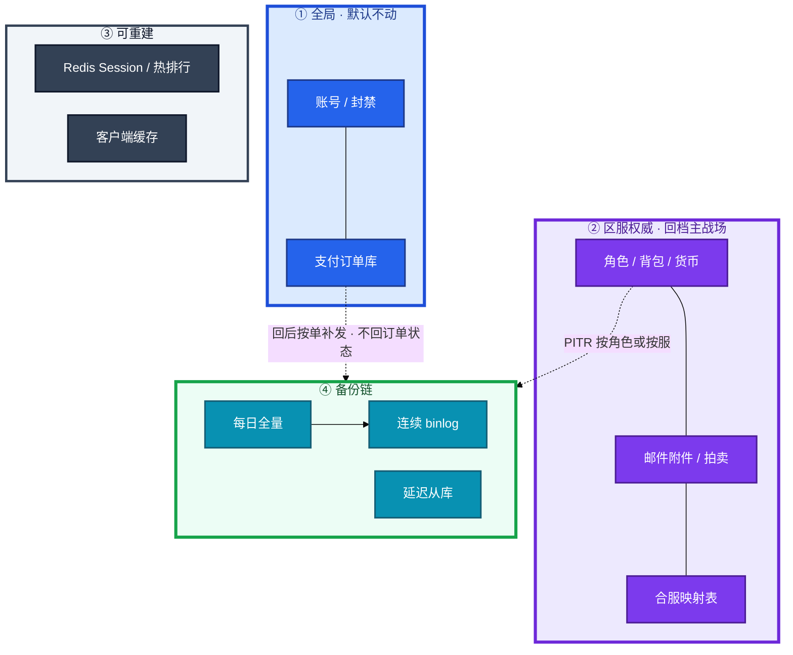
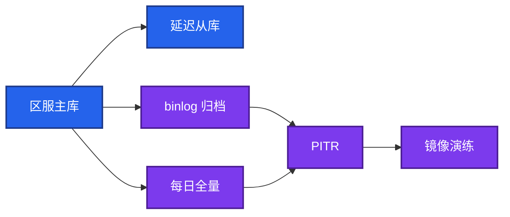
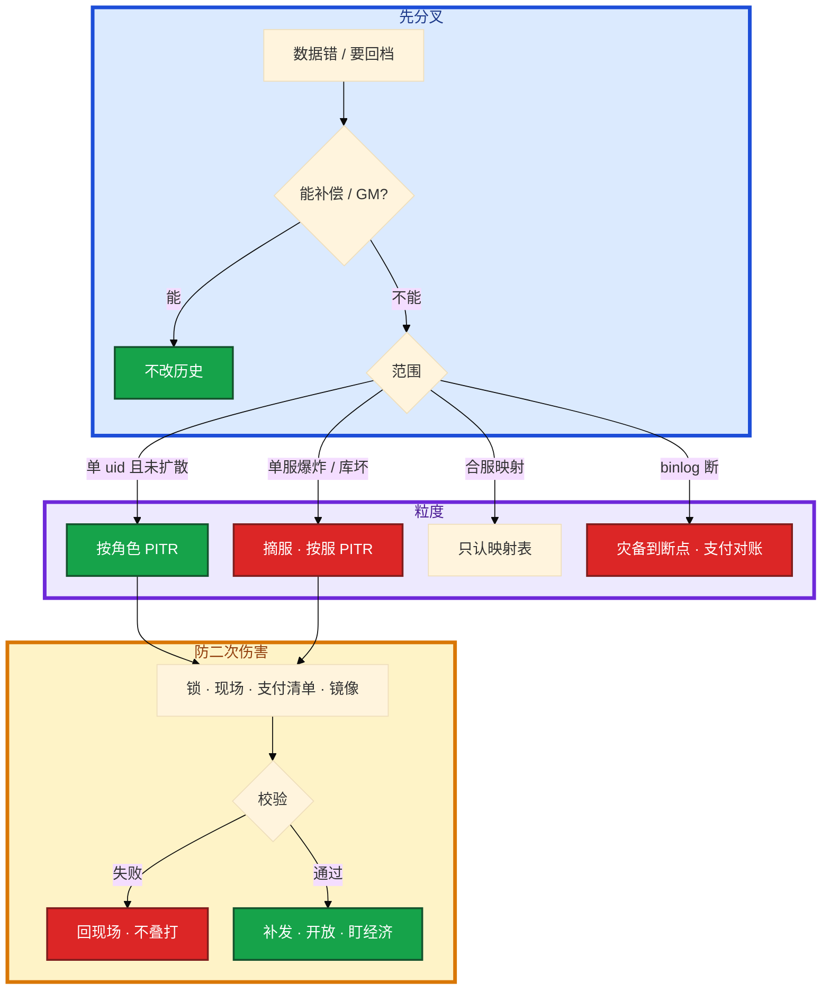

# 玩家数据备份与回档


活动掉落多写了一个零。群里有人说「整服回今早的快照」。另有人已经打开主库准备 `UPDATE` 货币。玩家 14:30 刚充了 648。

先别动手。这一章后半全是你会动手的：**怎么圈范围、怎么留现场、怎么按角色或按服做 PITR、怎么补支付、校验失败怎么退。** 前面的分层和二次伤害，是为了让你动手时不选错路。

**读完你能：** 白板上画出哪些库动、哪些不动；能判断补偿、单号 PITR 还是整服 PITR；会备份演练、锁范围、导出支付清单、失败回现场。

## 本章目录

缩进 = 上下级。3 下面才是 3.1。

想钉在**正文左边**跟着滚：菜单 **查看 → 打开视图 → 大纲**。Markdown 预览做不到独立左栏，目录只能写在文章开头。

- [1. 基本概念](#1-基本概念)
- [2. 架构图](#2-架构图)
- [3. 原理](#3-原理)
  - [3.1 RPO / RTO 分层](#31-rpo--rto-分层不要一套打天下)
  - [3.2 PITR 按角色 / 按服](#32-pitr-按角色--按服)
  - [3.3 二次伤害](#33-二次伤害窗口内充值与-p2p)
  - [3.4 合服映射](#34-合服后只认映射表)
- [4. 安装部署](#4-安装部署)
  - [4.1 生产怎么选](#41-生产怎么选)
  - [4.2 备份链落地](#42-备份链落地你实际看到什么)
- [5. 核心配置](#5-核心配置)
- [6. 常用命令](#6-常用命令)
- [7. 常用操作](#7-常用操作)
  - [7.1 备份](#71-备份)
  - [7.2 单号回档](#72-按角色-pitr)
  - [7.3 整服回档](#73-按服-pitr)
  - [7.4 校验失败](#74-校验失败回现场)
  - [7.5 合服后修复](#75-合服后修复)
  - [7.6 禁止裸改](#76-禁止裸改库)
  - [7.7 外挂刷货](#77-外挂刷货)
- [8. 生产排障](#8-生产排障)
- [9. 必会 · 常考](#9-必会--常考)
- [合上书](#合上书问自己)

**本章不讲：** MySQL 全量、xtrabackup、binlog / GTID、PITR 位点怎么打 → [03-01 MySQL](../../03-中间件与数据库/01-MySQL/)；Redis 持久化 → [03-02](../../03-中间件与数据库/02-Redis/)；主机级主备 / 快照 / 3-2-1 → [02-20](../../02-基础底座/20-高可用与容灾/)；合服迁移步骤 → [02](../02-开服合服/)；掉落配错先回配置 → [03](../03-热更新与版本发布/)；事故定级、公告口径 → [09](../09-游戏SRE稳定性/)；备份落在哪个 region → [10](../10-出海与多区域/)。

---

## 1. 基本概念

回档不是「把磁盘倒回去」，而是一次**受控的数据恢复**：范围、时间点、审批、校验四件套缺一不可。权威在 DB，不是 Redis，不是云盘整机快照。点整机回滚会把不该回的服务、账号、订单一起回回去。

口诀：**能小范围就不整服；能补偿就不改历史；能走 GM 就不碰主库。** 生产上交互式 `UPDATE` 货币 / 道具，无论结果好坏，都按不合格打。

| 在回档范围内 | 不在回档范围内 |
|--------------|----------------|
| 区服角色 / 背包 / 货币 / 任务 | 全局支付订单状态（按单补发） |
| 邮件附件、拍卖未结算 | 账号库、封禁名单 |
| 跨服已发奖流水（用来对） | 聊天（另套留存，不挡角色 RTO） |
| 「回档前现场」备份 | Redis Session / 热排行（丢了重建） |

三个角色不要混：

| 角色 | 干什么 |
|------|--------|
| **补偿 / GM** | 加道具、写流水；不改历史状态 |
| **按角色 PITR** | 锁号，把单个 `uid` 回到位点 |
| **按服 PITR** | 摘服冻写，整库回到位点 |

回档三问写不进工单就不要动手：

1. 哪些 `server_id + uid`（合服后是映射前旧 ID 还是新 ID）
2. 回到哪个精确时间 / binlog 位点 / 备份集
3. 该时间之后的**充值、代币消耗、交易**怎么处理

> **记住**：能补偿就不改历史。只回 MySQL、不处理支付清单 = 二次伤害。只回 Redis、不回 MySQL = 假恢复。

---

## 2. 架构图

先把整张图钉住。后面备份、PITR、排障都对着这张图说话。



图上三条线：

1. **支付库和角色库备份策略分开。** 回角色时误回订单库，玩家已到账的订单回到未发货，可能再发一次。
2. **跨服已发奖流水用来对，不是用来当权威改。**
3. **映射表单独落盘，权限高于普通业务表。** 合服后只认映射，不认角色名碰撞。

一次回档要写清「动哪些存储、不动哪些」，不要只说「回数据库」。

---

## 3. 原理

原理只保留动手和面试会用到的：为什么不能一套 RPO、单号和整服差在哪、窗口内 648 为什么必须单独处理、合服后为什么不能按名字撞。

**本节 4 块：** 3.1 分层 · 3.2 PITR 粒度 · 3.3 二次伤害 · 3.4 合服

### 3.1 RPO / RTO 分层：不要一套打天下

账号丢单是资损，聊天丢了只是体验。用一个 99.9% 或一套「每日 dump」打天下，要么过度备份聊天拖慢角色 RTO，要么对不起支付。

| 数据 | 权威在哪 | 典型 RPO | 典型 RTO | 玩家看得见什么 |
|------|----------|----------|----------|----------------|
| 账号、支付订单 | 全局库 | 接近 0（同步 / 双写） | 分钟级切 | 丢单 = 扣了钱没道具，或重复发货 |
| 角色、背包、货币 | 区服库 | 5～15 分钟（binlog + 定期全量） | 单服小时级 | 等级 / 道具 / 任务进度回到过去 |
| 公会、拍卖、邮件 | 区服库或独立库 | 同角色 | 同角色 | 已发出去的邮件和拍卖无法完美还原 |
| 跨服结算、已发奖励 | 流水 + 本服 | 与本服对齐 | 随本服 | 回档后跨服已发奖可能对不上 |
| Redis 热状态 / Session | 可重建 | 允许丢 | 重启加载 | 掉线重登；**不以 Redis 当备份** |
| 聊天 | 最低 | 可丢 | — | 记录没了；不要为聊天拖慢角色回档 |

手段（机制细节回 03-01，这里只定游戏口径）：

- MySQL：每日全量 + 连续 binlog 归档；合服前额外汇出并 **restore 验证**
- 备份要定期拉起来跑校验，没验证的备份等于没有
- Redis：RDB / AOF 保热，角色权威仍以 DB 为准
- 跨服结算：回写本服前打流水，回档本服时能对上跨服已发奖励
- 延迟从库能扛「删错后几小时才发现」；普通从库会把误操作立刻复制过去

云盘快照是整机保险，不是玩家级回档工具。PITR 用全量 + binlog 位点，粒度是库 / 表 / 时间点；快照粒度是整盘。合规留存和游戏回档是两套目标：一套为了恢复可玩，一套为了审计。别混成一个桶、一次 restore。带附件的邮件算经济，跟角色走；纯聊天消息跟聊天走。

> **记住**：RPO 按账号支付 / 角色 / 聊天分层。Redis 不是角色备份；快照不是玩家级回档。

### 3.2 PITR：按角色 / 按服

PITR = 全量 + 连续 binlog，停在指定秒。游戏里必须再拆一刀：**这个位点套在谁头上**。


| 粒度 | 何时用 | 前提 | 不要用 |
|------|--------|------|--------|
| **补偿 / GM** | 能加回、能追回、不需要历史状态 | 有流水、有限额 | 当「小回档」手改字段 |
| **按角色 PITR** | 单 uid 误操作、单号数据脏 | 能按 `server_id + uid` 抽出一致快照或行；该号锁写 | 经济已经扩散到拍卖 / 全服掉落 |
| **按服 PITR** | 掉落配错、全服脚本写坏、合服映射错 | 摘服冻写；位点 = 错配置生效前最近一致点 | 「随便一个今晚的 dump」；binlog 已断 |

按角色能做的条件：角色行、背包、货币在可圈的表里；有按 `uid` 的逻辑备份或 flashback / 行级恢复作业；该号从发现到恢复一直锁写。做不到就升级成按服，不要用 `WHERE uid=` 在主库手改当 PITR。

按角色的作业形态（选一种写进预案，事故里不要发明）：

| 形态 | 怎么做 | 坑 |
|------|--------|-----|
| 行级恢复 | 镜像 PITR 到位点，再只把该 uid 的角色 / 背包 / 货币导回生产 | 漏表：邮件附件、拍卖、任务进度会对不上 |
| 号级逻辑备份 | 日常按 `server_id + uid` 抽出热号（高 V） | 漏抽的号事故里只能升级按服 |
| flashback / 延迟从库 | 该 uid 的行在发现窗口内还能找到旧版本 | 普通从库已追上误操作，不能用 |

按服的位点选**出错配置生效前最近的一致位点**，不是今天 0 点。0 点到出错前的合法进度、合法充值会被一起抹掉，二次伤害面比定点回档大。

按服还要决定「哪些库进同一位点」。角色 + 邮件附件 + 拍卖未结算通常一起；支付订单库绝不一起；跨服流水只读对账。漏了邮件附件 = 回完背包、附件还在，经济仍脏。

```
  全量 02:00          误操作 14:00         发现 15:00
       |                   |                   |
       +----- binlog ------+----- binlog ------+
                           |
                           v
                 PITR 停在 13:59:59
                 14:00 之后的写入要单独处理
                 （充值单导出，回后按单补发）
```

binlog 断了一段：这是存储事故，不是单玩家脚本能修的。从最近全量 + 可用 binlog 恢复到断点，断点后数据视为丢失，对支付单独对账。玩家级脚本假定位点连续。位点断了还硬跑，会写出和谁都对不上的状态。

binlog 保留期必须覆盖「发现到开始恢复」的窗口，过期就只剩最近全量，RPO 从分钟变成一天。`expire_logs_days` 太短是事故源（03-01）。

定期做「只恢复一个 `server_id`」的演练，证明备份不是只有全实例这一种姿势。按角色恢复更要演：抽出一个高 V，对着镜像跑通，记下耗时。

### 3.3 二次伤害：窗口内充值与 P2P

玩家 14:00 被错发，14:30 自己又充了 648。你把角色回到 13:59，钱和道具一起没了——这是二次事故，客诉和法律风险都比原始误操作大。

```
  回档点 13:59                发现 15:00
       |                          |
       +-- 14:00 GM 错发装备
       +-- 14:10 玩家用错发装备打了本、交了任务
       +-- 14:30 玩家充了 648，发货成功
       +-- 14:40 把一件装备邮给好友
       +-- 14:50 拍卖行卖出材料

  角色回到 13:59 之后玩家看见：
       等级 / 任务 / 背包回到过去
       648 的道具没了（订单库若没回，钱已扣）  <-- 二次伤害
       好友仍持有那件装备                     <-- P2P 无法完美还原
       拍卖材料钱可能还在对方                 <-- 要产品规则
       排行榜、公会贡献、跨服已发奖可能脏
```

处理原则：

- 回档前导出「窗口内支付成功订单」，回档后按订单补发或走客服；**不要让已扣款玩家承担回档**
- 窗口内 P2P（拍卖、邮件给他人）无法完美还原，要产品规则：回档方回、对方是否追回
- 能单字段修复就不要整角色；能单角色就不要整服
- 整服回档必须停写：目录维护、踢线、停支付发货，做完校验再开
- 「只回道具不回等级」看起来温和，关联任务和战力会对不上。没有配置表和脚本的手工改字段，就是裸改库的变种

对外话术不要先承诺「整服回到下午三点」。那是变更单定的，不是客服随口定的。客服口中的「回档」经常只是补偿——先问清要不要改历史状态。能邮件补就不碰角色行。

方案里必须写清「他打开游戏会少什么」。已扣款的 648 不能跟着角色一起没。

### 3.4 合服后只认映射表

合服后主键是新 ID。客服、日志、玩家口述仍是旧 `区服 + 角色名`。封禁、补偿、回档走同一条身份链路。


- 合服前备份和合服后备份不是同一套主键，用错备份会写成另一批人
- 只恢复被合入的一方时，目标服上已产生的新社交关系要单独规则
- 合服当日不做无关回档。两件事叠在一起，无法向审计解释哪一步写坏的

映射表和角色库一起备份，但恢复流程独立校验。不要假设「角色库 dump 里一定有一份能用的映射」。映射表丢了视为数据事故，停止一切改库，从备份链恢复（02）。

> **记住**：合服后只认映射表，不认角色名碰撞。用错合服前后备份会写成别人。

---

## 4. 安装部署

### 4.1 生产怎么选

| 项 | 选 | 不选 |
|----|----|------|
| 角色备份 | 每日全量 + 连续 binlog；按 `server_id` 能单独 restore | 一套每日 dump 打支付 + 角色 + 聊天 |
| 支付 | 近实时 / 同步；与角色策略分开 | 回角色时顺手回订单库 |
| 发现窗口 | 延迟从库 + binlog 覆盖「发现到开修」 | 普通从库当回档源 |
| 演练 | 季度按服 + 按角色各跑一次，记下 RTO | 从没 restore 过的 cron |
| 权限 | 备份桶与生产账号分离；下载审计 | oncall 把整库下到笔记本 |
| 快照 | 机器级保险 | 当玩家级回档按钮 |

### 4.2 备份链落地你实际看到什么



验收：进程在、文件在都不算数。必须 `restore` 过、抽样高 V 对得上、记下耗时。口径里写「RTO 两小时」要说得出最近一次演练日期。没有演练 = 没有备份。

加密、异地一份（合规允许的前提）。备份落在哪个 region 见 10。

---

## 5. 核心配置

只动有证据的项。保留期和权限配错，事故里第一次发现。

| 参数 / 策略 | 生产怎么用 | 改错会怎样 |
|-------------|------------|------------|
| binlog 保留 | 覆盖「发现到开始恢复」窗口 | 过期只能退最近全量，RPO 变一天 |
| 延迟从库延迟 | 数小时，对齐误操作发现周期 | 太短 = 误 DELETE 已追上；太长 = 延迟数据过旧 |
| 备份桶权限 | 与生产账号分离，最小读，下载审计 | 整库进笔记本 |
| 支付库 vs 角色库 | 分策略、分恢复作业 | 误回订单 → 重复发货 |
| 映射表备份 | 单独落盘 + 独立校验 | 合服后无法认人 |
| 聊天 | 低等级或另桶 | 拖慢角色 RTO |

> **记住**：没 restore 演练过的备份等于没有。整服回档不能一个人既批又执行。

---

## 6. 常用命令

机制命令在 03-01。这里只强调回档前留现场、事后可审计。生产走变更系统作业，不要交互式敲库。

```bash
# 逻辑备份留「回档前现场」（大库用 xtrabackup，见 03-01）
mysqldump --single-transaction --master-data=2 \
  game_s123 > /backup/pre_rollback_$(date +%Y%m%d_%H%M%S).sql

# 生产禁止：交互式改货币 / 道具
# mysql -e "UPDATE backpack SET ..."    # 事故
```

| 目的 | 做什么 | 看什么 |
|------|--------|--------|
| 留现场 | dump / xtrabackup 回档前一刻 | 文件非空、可 restore |
| 圈范围 | 工单写 `server_id + uid`、位点 | 合服后走映射表 |
| 支付清单 | 导出窗口内成功单 | 回后按单补发 |
| 演练 | 镜像 restore 一个 `server_id` 或一个 uid | 耗时 = 真 RTO |
| 校验 | 人数、金额、抽样高 V、跨服流水 | 失败 → 回现场，不叠打 |

值班先问这四件：范围锁了没有、现场备份在不在、支付清单导出了没有、镜像演练过没有。

---

## 7. 常用操作

### 7.1 备份

至少每日全量 + 连续 binlog；合服、大活动、数值热更前加打一份并 **restore 验证**。异地按合规允许存放。本机 cron 不算备份。

**季度做一次按服 restore、一次按角色抽出**，记下 RTO。没有演练 = 没有备份。

### 7.2 按角色 PITR

单 uid 误操作。不要整服。


1. 锁号，确认该 uid 不再写入。
2. 备份「回档前现场」。
3. 导出窗口内支付成功单、大额消耗、P2P 流水。
4. 在从库或镜像按 uid 恢复到位点，核对抽样。
5. 生产执行后按订单补发，再开放。
6. 校验失败：回到现场备份，不要叠打更早位点。

经济已经扩散到拍卖、全服掉落：升级成按服或走产品规则，不要假装单号能收场。

### 7.3 按服 PITR

整服数值爆炸、库级写坏。先回配置停产出、摘服冻写，再评估：能补偿就补偿，不能就定点回档。监控应有产出数量级告警，越早停越可能不用整服回。

1. 目录摘服，踢线，停支付发货。
2. 留现场；导出**全服**窗口支付清单。
3. 工单：范围、时间点 / 位点、支付清单、执行人、复核人；产品 / 运营会签。
4. 镜像演练，看耗时（真 RTO）。
5. PITR 到错配置生效前最近一致位点。
6. 校验：人数、金额、抽样高 V、支付补发、跨服流水。通过再开放，盯经济产出。

### 7.4 校验失败：回现场

校验失败：回到「回档前现场」备份，**不要再试一个更早的时间点叠打**。叠打会把现场也弄丢，最后谁也说不清库里是哪一版。

### 7.5 合服后修复

旧身份必须走映射表到新 ID，再查库、再回档。映射丢失就停修，从合服备份找回映射。禁止角色名碰撞猜。合服当日不做无关回档。

### 7.6 禁止裸改库

禁止：生产主库登录上去 `UPDATE` 货币 / 道具、删行「清异常」、改合服映射。

原因：无审批、无回放、无触发器 / 审计、绕过背包流水、把对账链打断。出了问题无法证明「改之前是什么」。

替代：

- GM 工单系统：动作编码、双人复核、写流水、可回滚补偿
- 补偿邮件：加道具，不直接改余额字段（仍要限额和审计）
- 正式回档作业：脚本 + 位点 + 校验 SQL，在变更系统里执行
- 紧急情况也是跑评审过的脚本，账号是个人堡垒机，会话录像

被问「库错了你怎么办」：先冻、先备份现场、再走工具。答「我 SQL 比较熟」是减分句。没有 GM 系统、今晚必须修：写脚本、双人看 diff、先镜像演练、工单后执行、留现场备份——仍然不是交互式改。

口头「先改了再说」一律拒绝。单号低风险补偿可以值班 + 复核；整服回档不能一个人既批又执行。oncall 能执行恢复作业，但不能一个人把整库下到笔记本。

### 7.7 外挂刷货

外挂刷货不是默认整服回档。先冻号、取证，和法律 / 安全 / 玩法对齐：可能是追回 + 封禁。整服回会误伤合法玩家，二次伤害比外挂还大。运维提供冻结、备份现场、按名单跑**评审过的**追回脚本或走 GM。不在网关私刑，也不手改货币。名单混了误伤 uid：先抽样核对流水再跑。不确定就停。

---

## 8. 生产排障

和 01 同一套三问：要不要改历史？改谁？窗口里的钱怎么办？

**回档不可用 = 先冻写，不是先动手。** 能补偿就不进 PITR。



现场顺序：

1. 锁范围（单号或整服摘目录）→ 停写确认
2. 备份回档前现场
3. 工单：范围、位点、支付清单、双人
4. 镜像演练
5. 生产执行 → 校验 → 补发或回现场

| 现象 | 先做什么 | 不要做什么 |
|------|----------|------------|
| 单号错发 | 锁号、补偿或按角色 PITR | 整服回 0 点 dump |
| 掉落配错两小时 | 回配置停产出、摘服；能补则补 | 先整服回；不导出支付清单 |
| 校验高 V 对不上 | 回现场备份 | 再往前两个小时叠打 |
| 合服后找不到号 | 映射表 | 角色名 LIKE |
| binlog 缺 20 分钟 | 灾备到断点，支付对账 | 单玩家脚本「补上」 |
| 有人要云盘快照滚回去 | PITR / 逻辑备份 | 整盘误伤订单 / 配置 |
| 「我 SQL 比较熟」 | 拒绝裸改 | 交互式 UPDATE |
| 外挂刷货 | 冻号取证、追回脚本 | 默认整服回；手改货币 |

---

## 9. 必会 · 常考

白板和追问高频，能一口回：

| 说法 | 对错 | 口径 |
|------|:----:|------|
| 一套每日 dump 打支付 + 角色 + 聊天 | 错 | RPO 分层；支付近实时 |
| Redis 开了 AOF 就能少备角色库 | 错 | 权威在 DB |
| 云盘快照等于玩家级回档 | 错 | 粒度是整盘，误伤订单 |
| 3 丢进度就整服回今早 dump | 错 | 能单号不整服；位点对着故障开始 |
| 回角色时订单库一起回 | 错 | 可能重复发货；按单补发 |
| 校验失败再往前两个小时 | 错 | 回现场，不叠打 |
| 合服后按角色名撞 | 错 | 只认映射表 |
| 生产 UPDATE 货币修一下 | 错 | 裸改不合格 |
| 没演练过但文件在 = 有备份 | 错 | 没 restore = 没有 |
| 外挂刷货默认整服回档 | 错 | 先冻号取证；整服误伤合法玩家 |
| 聊天和角色同一 RTO | 错 | 聊天拖慢角色恢复 |
| binlog 断了用单号脚本补 | 错 | 灾备，不是玩家级脚本 |

数字：角色 RPO **5～15 分钟**；支付接近 **0**；登录级 RTO 单服**小时级**；备份演练季度；binlog 覆盖发现窗口。

易混：补偿 vs 回档；按角色 vs 按服 PITR；延迟从库 vs 普通从库；快照 vs PITR；合服前备份 vs 合服后备份；现场备份 vs 目标位点。

---

## 合上书，问自己

1. 哪些库动、哪些不动？Redis 和快照各是什么角色？
2. 回档三问是哪三问？能补偿为什么不改历史？
3. 按角色 PITR 和按服 PITR 各何时用？位点怎么选？
4. 窗口内 648 和邮给好友的装备怎么处理？校验失败怎么办？
5. 合服后找不到号走哪条链路？用错合服前后备份会怎样？
6. 裸改库为什么不合格？没演练过的备份算有吗？

六题都能口述，这一章就过了。下一章把入口剖开：加速器怎么把开服打到一台 Gate，UDP / KCP 和 DDoS / CC 怎么分。
