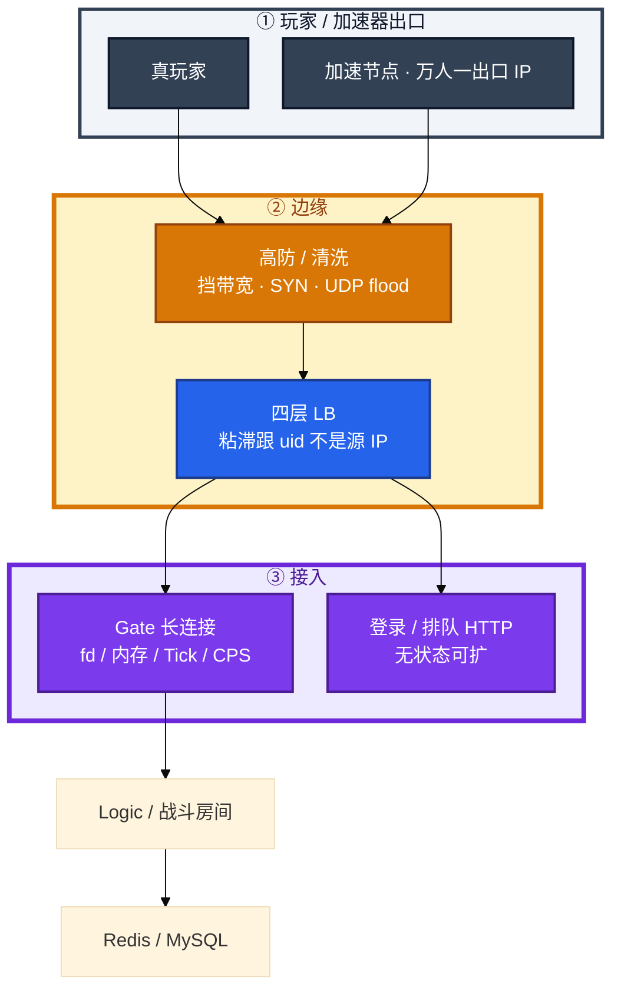
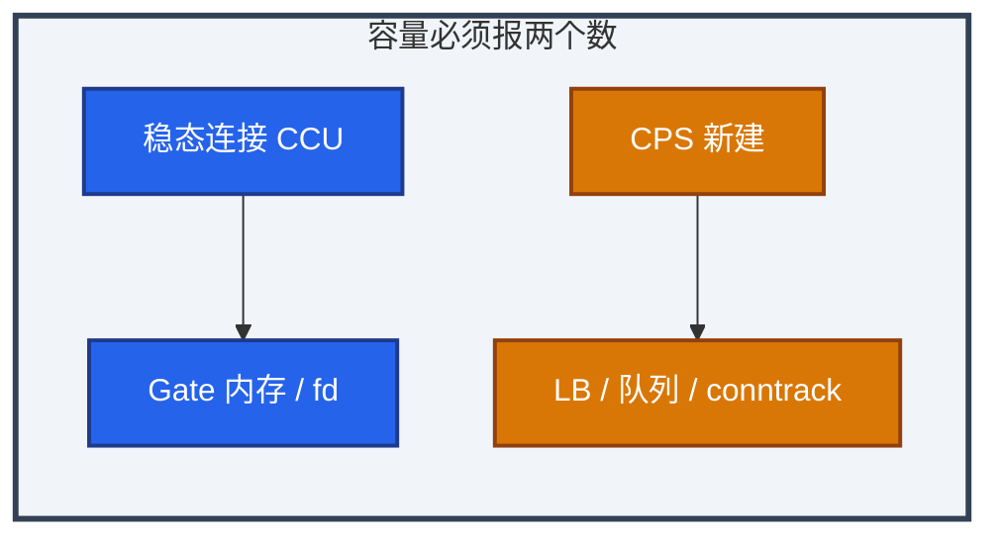
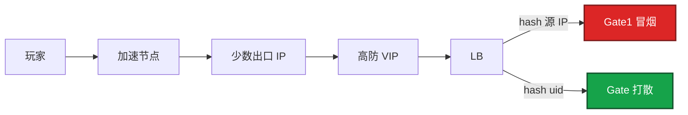
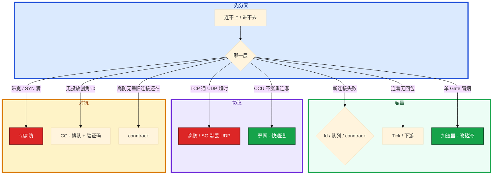

# 游戏网络与对抗


开服只有一台 Gate 冒烟，其余空转。带宽才用了 20%，新玩家进不去。群里有人要加网卡，另有人要把该出口 IP 当爬虫封掉。

先别动手。这一章后半全是你会动手的：**怎么报容量、怎么改粘滞、UDP 被默丢怎么验、DDoS 和 CC 怎么分。** 前面的加速器和 KCP，是为了让你动手时不选错路。

**读完你能：** 白板上画出玩家包走高防 → LB → Gate；能判断加速器汇聚还是 fd 满；会限 CPS、切高防、验 UDP、隔离外挂流量而不私刑。

## 本章目录

缩进 = 上下级。3 下面才是 3.1。

想钉在**正文左边**跟着滚：菜单 **查看 → 打开视图 → 大纲**。Markdown 预览做不到独立左栏，目录只能写在文章开头。

- [1. 基本概念](#1-基本概念)
- [2. 架构图](#2-架构图)
- [3. 原理](#3-原理)
  - [3.1 长连接容量](#31-长连接容量稳态连接--cps)
  - [3.2 加速器与粘滞](#32-加速器与粘滞)
  - [3.3 UDP / KCP](#33-udp--kcp)
  - [3.4 DDoS vs CC](#34-ddos-与-cc-打的层不一样)
- [4. 安装部署](#4-安装部署)
  - [4.1 生产怎么选](#41-生产怎么选)
  - [4.2 入口落地](#42-入口落地你实际看到什么)
- [5. 核心配置](#5-核心配置)
- [6. 常用命令](#6-常用命令)
- [7. 常用操作](#7-常用操作)
  - [7.1 扩容](#71-扩容报两个数)
  - [7.2 粘滞与加速器](#72-粘滞与加速器加白)
  - [7.3 弱网重连](#73-弱网重连)
  - [7.4 切高防](#74-切高防)
  - [7.5 外挂隔离](#75-外挂隔离)
  - [7.6 管理面](#76-管理面零公网)
- [8. 生产排障](#8-生产排障)
- [9. 必会 · 常考](#9-必会--常考)
- [合上书](#合上书问自己)

**本章不讲：** TCP / UDP 内核参数 → [02-08](../../02-基础底座/08-TCP与UDP/)；抓包 → [02-11](../../02-基础底座/11-网络排障与抓包/)；conntrack → [02-15](../../02-基础底座/15-iptables与conntrack/)；四层 LB → [02-16](../../02-基础底座/16-LVS与四层负载均衡/)；登录排队、重连快通道 → [04](../04-登录排队与选服/)；下载被 CC → [06](../06-CDN与资源更新/)；出海延迟、就近房间 → [10](../10-出海与多区域/)。本章不写反外挂内核，只写运维看得到的路径和边界。

---

## 1. 基本概念

游戏入口不是一条 HTTP。登录多是 HTTPS，战斗常是长连接 TCP，部分实时玩法是 UDP / KCP。高防、LB、Gate 每一跳都能把「看起来像网络问题」变成完全不同的事故。

| 在这条入口上 | 不在这条入口上 |
|--------------|----------------|
| 高防 / 清洗、四层 LB、Gate 长连接 | 反外挂检测模型、封号策略 |
| 稳态连接、CPS、fd、Tick | 逻辑服战斗公式 |
| 加速器出口汇聚 | 和加速商「开战」 |
| UDP 放行、KCP 仍是 UDP 包 | 在机房「优化」游戏协议 |

三个角色不要混：

| 角色 | 干什么 |
|------|--------|
| **高防** | 挡带宽、SYN、UDP flood |
| **LB** | 把连接分到 Gate；粘滞必须跟 uid / token |
| **Gate** | epoll 长连接；有状态的第一跳 |

外挂 / 机器人也走同一条路。运维：识别、限流、隔离、留证据。封号和玩法对抗：安全 / 玩法，不在 Gate 上随手 drop。

> **记住**：先分清打的是带宽、连接、登录还是下载，再决定切高防还是开排队。容量报两个数：稳态连接 + CPS。带宽剩余不表示还能加连接。

---

## 2. 架构图

先把整张图钉住。后面容量、粘滞、排障都对着这张图说话。



图上三条线：

1. **粘滞跟 uid。** 加速器会把万人汇成几个出口 IP，源 IP 哈希会打到同一台 Gate。
2. **TCP 登录通不等于 UDP 战斗通。** 防护策略升级常默丢 UDP。
3. **管理、DB、K8s API 零公网。** 游戏公网只留玩家入口和 CDN。

分层限流：边缘挡无票和洪水；排队器挡合法但过量的进服；应用挡单账号异常。三层都靠安全组一个 drop = 真玩家和攻击一起埋，而且没有业务日志。

---

## 3. 原理

原理只保留动手和面试会用到的：为什么要报两个容量数、加速器怎样打偏粘滞、KCP 在防火墙上长什么样、DDoS 和 CC 差在哪一层。

**本节 4 块：** 3.1 容量 · 3.2 加速器 · 3.3 UDP/KCP · 3.4 DDoS/CC

### 3.1 长连接容量：稳态连接 + CPS

Gate 常见模型：单进程 epoll，每玩家一条连接，下行推送。舒适区要自己压，给量级：单机 2～5 万连接，再高先拆进程 / 机器，不是调一个内核参数神话。

开服 CPS（每秒新建）比存量 CCU 更容易先炸。云上 NLB / CLB 也有单节点连接和 CPS 上限。容量要报两个数：**稳态连接**和**新建速率**。

卡点顺序，不要一上来加带宽：

1. `ulimit -n` / 进程 fd 是否顶满 → 新连接失败
2. 每连接缓冲和玩家对象内存 → OOM / 变慢
3. 单线程 Tick 排队 → 连着但无回包
4. somaxconn、全连接队列、SYN 丢弃
5. 网卡 PPS、中断、丢包
6. 下游 Logic / Redis 慢 → 连接空闲，客户端超时重连

fd 满是**新连接失败**；Tick 满是**连着但无回包**。指标必须分开看。带宽还剩很多，PPS 或 fd 可以已经满了。

开服当天按「峰值 CPS × 排队释放斜率」准备 Gate 和 LB 节点：存量 3 万连接的机器，可能被 2000 CPS 的新建先打穿。云 LB 单节点上限单独要，不要假设加 Gate 副本、LB 会自动无限吃 CPS。

心跳：间隔过短打服务器 CPU，过长 NAT 超时断连。移动网 NAT 常见 30～60 秒空闲被踢，心跳要短于这条。心跳包不要走完整业务鉴权。失败只重连，不走完整登录排队（见 04）。1 秒心跳会打爆 Gate CPU；120 秒会被 NAT 踢。LB 空闲超时改短了 = 集体无故断线、重连风暴。改 LB 超时当变更，要和心跳一起看。



只报 CCU 会买错机器：存量还舒服，开服 CPS 已经把 SYN 队列和云 LB 单节点打满。只报带宽会漏掉 fd 和 Tick。舒适区 2～5 万是量级，不是承诺；你自己的压测数写进容量账。

> **记住**：容量报稳态连接 + CPS。卡点顺序 fd → 内存 → Tick → 队列 → PPS → 下游慢。

加速器把 CPS 和粘滞同时扭曲：万人同一出口，四层哈希看成「一个超级客户端」。容量账里要把加速出口的连接密度单独列，否则你会按「每 IP 连接数异常」把真玩家限死，或按平均每 Gate 连接数判断「还能加」——实际上一台已经满了。

### 3.2 加速器与粘滞

加速器把玩家流量接到中继，再进你的机房。玩家 → 加速节点 → **少数出口 IP** → 你的高防 VIP。后果：

- 大量玩家同一个源 IP（加速节点出口）
- 四层 LB 按源 IP 哈希 → 连接打到同一 Gate
- IP 风控把加速节点当爬虫 / 外挂
- 地理 IP 失真，按地区灰度、按地区封禁会误伤（CDN 灰度见 06，出海拨测见 10）


运维侧：

1. 粘滞和灰度用 **uid / token**，不用源 IP
2. 连接数告警看每 VIP / 每 Gate，不看「每 IP 连接数」当异常唯一依据
3. 和加速厂商要出口 IP 段，高防和限连策略加白或单独阈值
4. 不要在安全组按国家 IP 一刀切，出海和加速会一起误杀
5. 对该出口单独限连阈值，不要当爬虫封死

产品能不能禁用加速器是产品决策。技术上封出口会误伤。运维负责亲和和容量，不负责和加速商开战。

加速器对 UDP / KCP 更差：中继改包、限速、丢包补偿和游戏自己的 KCP 叠在一起，RTT 和抖动双加。TCP 登录看着还行、战斗 UDP 幻灯片，先问是不是加速器路径，再问是不是高防默丢。

加速器还会改你以为「按地区」的一切：CDN 灰度按 IP（06）、安全组按国家、拨测按出口、风控按地理库，全部失真。出口段要进配置，不当一次性白名单便签。



「只有一台 Gate 冒烟」先想加速 / NAT，再想配置没挂全。

### 3.3 UDP / KCP

弱网表现：RTT 高、抖动、丢包、断连。客户端策略通常是重连 + 重发未确认操作。运维看到的是 Gate 连接抖动、TIME_WAIT 堆积、登录 / 重连 QPS 冲高、同一 uid 短时间多次 ticket、战斗「操作无回包」但进程还在。

CCU 不涨、重连涨 → 按重连扩 Gate，不是按 CCU。重连必须走快通道，不进万人登录队（04）。服务端对「未确认操作」必须幂等；没有就停相关玩法防资损（加钱、扣两次道具），而不是只加机器。超时按链路分段：客户端、LB、Gate、逻辑，不要只改 Nginx `60s`。

UDP / KCP 用于对延迟敏感的战斗：丢包可补偿，乱序要自己处理。


KCP 在用户态做可靠（ARQ、窗口、RTO），底层仍是 UDP。防火墙只看见 UDP。限速、清洗、安全组都按 UDP 放行和统计，不要按「它其实可靠所以当 TCP 配」。

运维保证：UDP 在高防和云防火墙没被默认丢掉；统计丢包率给研发，**不在机房「优化」游戏协议**。不要调 KCP 窗口 / nodelay 当运维手段。

研发会提到的词，运维只需要知道「别碰」：

| 词 | 是什么 | 运维做什么 |
|----|--------|------------|
| nodelay / 快速重传 | 更激进的用户态重传 | 不调；调了像弱网更炸 |
| sndwnd / rcvwnd | KCP 窗口 | 不调；窗口过大 = 突发 UDP 打满清洗 |
| 握手 / conv | 会话号 | LB 粘滞若能拿到会话 ID 更好；拿不到就 uid |
| 和 TCP 混开 | 登录 TCP + 战斗 UDP | 两条 VIP 都要验；只切 HTTPS 救不了战斗 |

和 QUIC 的差别（面试会被顺嘴问）：QUIC 跑在 UDP 上但自带 TLS 和连接迁移。游戏战斗常用 KCP / 自研，不是浏览器 QUIC。高防「UDP 防护模板」可能把两者一起误伤。新开 UDP 口先问清洗策略是阻断还是限速。

TCP 登录正常、公网玩家 UDP 战斗全超时、内网测试通：先抓边界，看包进没进机房，再查安全组 / ACL / 高防 UDP 规则。不要先杀战斗进程（有状态 = 随机判负）。新切的高防 VIP 要按协议分别验：TCP 通了不等于 UDP 通。

MTU / 分片：UDP 大包在加速器和清洗设备上更容易丢。战斗包体过大表现为「随机丢操作」，先给研发丢包率和包长分布，不要先改内核。

conntrack 对 UDP 更脆：无连接、表项靠超时。开服 CPS 高时要看连接跟踪容量，不是只买清洗（02-15）。

> **记住**：弱网 = 重连风暴，重连不进登录队。UDP 超时先看防护是否默丢，别先杀战斗进程。KCP 在防火墙上就是 UDP。

### 3.4 DDoS 与 CC：打的层不一样

| 类型 | 打什么 | 玩家感知 | 运维动作 |
|------|--------|----------|----------|
| 带宽 / SYN / UDP flood | 入口、高防、会话表 | 全服卡、连不上 | 切高防、清洗、切换 VIP |
| 连接耗尽 | Gate fd、LB 连接 | 新玩家进不去 | 限 CPS、扩 Gate、丢无票连接 |
| CC 登录 | 账号、验证码、渠道 | 登不上 | 排队降速、验证码、按账号限 |
| CC 下载 | CDN 源站 | 更新卡 | 第 06 章：回指针、限回源 |
| CC GM / 网关 | 管理面 | 后台挂 | 管理面不出公网 |

```
  分层：
    游戏 API 域名  --> 高防 / 云清洗
    下载域名      --> CDN，源站隐藏
    管理、DB、K8s API --> 零公网（VPN / 堡垒）
```

清洗误伤：看清洗后的**登录成功率**，不看厂商「已防护」绿勾。对照正常地区，放宽规则或切回，同时保持排队。不要为了「防住」把真玩家全挡。

CC 和开服洪峰长得像。区分：开服有公告和渠道曲线；CC 无投放、单 IP 段或单 UA、验证码失败率异常、创角转化接近 0。不确定时先开排队保护有状态层，再定性。

高防 / 清洗切换会改入口 IP 或链路，玩家侧是一次集体断线。当变更：公告或选低峰，切换后盯 CPS 和登录。Anycast 和高防节点质量按地区看，单一地区超时先查就近节点，不要全球切。切完登录好了但战斗仍进不去：可能只切了 HTTPS 入口，TCP / UDP 战斗 VIP 还在挨打，或 UDP 规则没带过去。按协议分别验。

云安全组 / conntrack 表打满，表现也像 DDoS：新连接失败、旧连接还在。开服 CPS 高时要看连接跟踪容量。扩 Gate 能把连接分散，但单节点表仍然会满。要改跟踪表容量 / 超时，并限 CPS。只加机器会把同样的满再复制一遍。

UDP flood 和「真玩家 KCP」在高防上看都是 UDP。清洗策略过猛 = 战斗全超时、登录 HTTPS 仍通（3.3 那条）。过松 = 带宽打满。现场用「清洗后登录成功率 + UDP 进机房没有」两块表，不要只用厂商「已防护」。真玩家加速器出口要进白名单，否则清洗会把加速节点当肉鸡。

限流装在哪：

```
  边缘     --> 挡无票、挡明显洪水
  排队器   --> 挡合法但过量的进服
  应用     --> 挡单账号异常

  三层都靠安全组一个 drop = 真玩家和攻击一起埋，而且没有业务日志
```

---

## 4. 安装部署

### 4.1 生产怎么选

| 项 | 选 | 不选 |
|----|----|------|
| 粘滞 | uid / token | 源 IP 哈希当唯一亲和 |
| 容量 | 稳态连接 + CPS 都要报 | 只报 CCU 或带宽百分比 |
| UDP | 高防 / 安全组按协议放行并抽检 | 假设 TCP 通了 UDP 就通 |
| 加速器 | 出口段加白 / 单独阈值 | 按单 IP 连接数封死 |
| 公网面 | 玩家入口 + CDN | GM / K8s API / DB 公网 |
| 限流 | 边缘 + 排队 + 应用 三层 | 安全组一刀 drop |

### 4.2 入口落地你实际看到什么

验收：TCP 登录通不算数。必须按协议验 UDP / KCP 战斗；加速器出口要打散到多台 Gate；管理面从公网扫不到。

新高防 VIP：HTTPS、TCP 长连接、UDP 三条分别探。切 VIP 当变更。

落地清单（开服前一周能勾完）：

1. Gate 进程 `ulimit`、fd 告警、单机舒适区压测报告（2～5 万量级自己的数）
2. LB 粘滞键是 uid / token，不是源 IP；加速出口段已加白或单独阈值
3. 高防策略：TCP 登录口、TCP 战斗口、UDP 战斗口分别放行；清洗模板不是「UDP 全拦截」
4. 心跳 < NAT / LB 空闲超时；重连走快通道（04）
5. GM / K8s API / DB 无公网；过期安全组规则清零
6. conntrack / 云安全组表容量按峰值 CPS 留余量

云 LB 单节点连接和 CPS 上限要单独要厂商数字。不要假设加 Gate 副本、LB 会自动无限吃 CPS。开服当天按「峰值 CPS × 排队释放斜率」准备 Gate 和 LB 节点。

---

## 5. 核心配置

| 参数 | 生产怎么用 | 改错会怎样 |
|------|------------|------------|
| LB 粘滞 | uid / token（或一致性哈希到会话） | 源 IP → 单 Gate 冒烟 |
| `ulimit -n` / Gate fd | 高于峰值连接 | 新连接失败 |
| 心跳间隔 | 短于 NAT 空闲（常 30～60s），长到不打爆 CPU | 1s 打爆 CPU；120s 被踢 |
| LB 空闲超时 | 长于心跳 | 集体断线、重连风暴 |
| UDP 放行 | 高防 / SG 显式放战斗口 | 策略升级默丢 |
| conntrack | 开服 CPS 预留表项 | 新连接失败，像 DDoS |
| 每 IP 限连 | 加速出口单独阈值 | 真玩家当爬虫 |

> **记住**：心跳不要走完整业务鉴权。失败只重连，不走完整登录排队。

---

## 6. 常用命令

```bash
# 进程 fd 是否顶满（n 接近 limit 就是这条）
ls /proc/<gate_pid>/fd | wc -l
cat /proc/<gate_pid>/limits | grep 'open files'

# 队列和 SYN 丢弃，细节见 02-08
ss -lnt | grep ':port'
nstat -az | grep -iE 'ListenOverflows|ListenDrops|TcpExt'

# 网卡丢包，不要只看带宽百分比
ethtool -S eth0 | grep -iE 'drop|discard|error'
```

| 目的 | 命令 / 动作 | 看什么 |
|------|-------------|--------|
| fd 满？ | `ls /proc/pid/fd \| wc -l` | 接近 limit → 新连接失败 |
| Tick 满？ | Gate 延迟、无回包、CPU 单核 100% | 连着但无回包 |
| SYN 丢 | `nstat` ListenOverflows / Drops | 队列 |
| 网卡 | `ethtool -S` drop | PPS，不是带宽 % |
| UDP 进没进机房 | 边界抓包（02-11） | 高防 / SG 是否默丢 |
| 加速器 | 每 Gate 连接 vs 每 IP 连接 | 单 Gate 冒烟 + 单出口海量连接 |

值班先跑：fd、limits、ListenDrops、ethtool drop、每 Gate 连接分布。

UDP / KCP 额外三条：边界能否抓到战斗口的 UDP；高防策略是阻断还是限速；加速出口上的 UDP 是否被单独限。TCP `ss` 看得到的东西，UDP 上要靠抓包和厂商日志，不要用「登录 HTTPS 通了」代替。

---

## 7. 常用操作

### 7.1 扩容：报两个数

提前扩 Gate 连接容量和 LB 节点。扩完不会自动迁走已有长连接。开服按峰值 CPS 准备。HPA 按 CPU 加战斗 Pod 救不了已开的局（01、05）。

### 7.2 粘滞与加速器加白

和厂商要出口 IP 段。高防加白或单独阈值。粘滞改 uid。告警看每 VIP / 每 Gate。不要按国家一刀切。

出口段会变。加速器升级节点、换线路，旧白名单会突然变成「真玩家被当爬虫」。约定：厂商变更出口必须提前同步；你侧白名单进配置管理，过期剔除。不要把加白写成安全组里一条永不回头的 `0.0.0.0`。

粘滞落地常见三种，选一种并写进图：

| 方式 | 适用 | 坑 |
|------|------|-----|
| 七层带 uid 的一致性哈希 | 登录 HTTPS、有 token 的重连 | 纯四层看不到 uid |
| 四层 + 会话 ID（KCP conv / 自研） | 战斗 UDP | 高防改包可能丢掉你依赖的头 |
| 客户端带 Gate 编号重连 | 重连快通道 | 该 Gate 已挂要有目录改指 |

开服单 Gate 冒烟的现场：先看每 Gate 连接分布，再看该 Gate 上的源 IP 是不是少数加速出口。确认后再改粘滞或加白，不要先重启那一台——重启 = 万人重连打到下一台，冒烟搬家。

### 7.3 弱网重连

1. 重连快通道，避免进万人队列
2. 事故里追问服务端对「未确认操作」有没有幂等；没有就停相关玩法防资损
3. 超时按链路分段
4. 地铁 / 赛事日：CCU 不涨但重连涨，按重连扩 Gate

弱网和 DDoS 长得像：都是 CPS 冲高、登录抖。区分：弱网有地区 / 运营商 / 赛事日曲线，真玩家 ticket 有效；DDoS 无投放、带宽或 SYN 先满。不确定先开排队保护有状态，再定性。UDP 战斗「无回包」时先确认包进机房，再谈弱网补偿——高防默丢不是弱网。

KCP 在弱网下会自己把重传打满 UDP 口。你看到的是 PPS 涨、清洗误伤、真玩家一起被限。正确处理：给研发丢包率和 RTT 分布，必要时停该玩法入口；不要在机房加大 KCP 窗口「让它更可靠」——窗口越大，突发越像攻击。

### 7.4 切高防

当变更：能公告就公告，或选低峰。切换后盯 CPS 和登录成功率，不盯厂商「防护中」绿勾。切完重连走快通道。按协议分别验 TCP / UDP。单一地区超时先查就近节点，不要全球切。

### 7.5 外挂隔离

流量侧可疑（报给安全，附证据）：单账号多 IP 全球跳；单连接 PPS / 包长异常偏离同玩法；大量失败的协议、异常消息号；机器人登录：空角色、无资源更新、节奏完全等间隔；同一加速出口上数千「新设备」同时创角。

运维可以做：限流、验证码、排队、隔离到熔断服；抓包 / 日志留存给安全（注意隐私和出境，见 10）；把异常 uid 名单交给封禁系统。

运维不要做：在 Gate 按「看起来像外挂」随意 drop（无法审计的错杀）；改战斗数值「制裁」；对外宣称已经从网络层根除外挂。

诚实口径：**对抗流量和入口，封禁和检测是安全 / 玩法，我负责证据和隔离。** 简历里写「负责反外挂」却只做了安全组，会被追问到方案细节。证据出境给安全厂商：看合规。玩家日志出境是另一类事故。默认最小字段、审计、不出域。

### 7.6 管理面零公网

GM、K8s API、DB 是 CC 和被黑的捷径。必须内网 + VPN / 堡垒。游戏公网只留玩家入口和 CDN。管理面被打时玩家入口可以仍是绿的，不要用登录成功率判断后台是否暴露。

临时开个安全组给策划「只放我的 IP」：IP 会变，加速器会变，规则会忘关。走堡垒机。过期规则本身就是事故源。

---

## 8. 生产排障

三问：新连接失败还是已连接无回包？打的是带宽、登录还是下载？TCP 通 UDP 通不通？



| 现象 | 先做什么 | 不要做什么 |
|------|----------|------------|
| 带宽 20%、新玩家进不去 | fd / CPS / 队列 | 加网卡 |
| 一台 Gate 冒烟 | 加速器出口、改粘滞 uid | 按单 IP 封死 |
| TCP 登录通、UDP 全超时 | 高防 / SG UDP；边界抓包 | 先杀战斗进程 |
| 创角≈0、无投放曲线 | CC：排队、验证码 | 当开服正常关验证码 |
| 高防无告警、新连接失败 | conntrack | 只加清洗带宽 |
| 清洗后登录仍差 | 对照正常地区，放宽 + 保持排队 | 看厂商绿勾 |
| 同一出口海量新设备创角 | 限流、隔离、交名单 | Gate 按包长 drop |
| GM 公网被刷、登录仍绿 | 收管理面 | 用登录成功率判断后台 |
| 加速器 UDP 幻灯片、TCP 登录还行 | 先问加速路径 + 高防 UDP | 只扩 Gate；当 Tick 杀进程 |

现场顺序：fd / CPS → 每 Gate 分布（加速器）→ 协议（TCP vs UDP）→ 高防 / CC / conntrack。不要从加带宽或重启战斗开始。

---

## 9. 必会 · 常考

白板和追问高频，能一口回：

| 说法 | 对错 | 口径 |
|------|:----:|------|
| 带宽还有余量就能加连接 | 错 | 报稳态连接 + CPS；fd / PPS 可先满 |
| 粘滞按源 IP 最稳 | 错 | 加速器万人一出口 |
| 封加速器出口清外挂 | 错 | 误伤；产品决策 |
| KCP 可靠所以按 TCP 配防火墙 | 错 | 底层仍是 UDP |
| TCP 通了 UDP 就通 | 错 | 高防常默丢 UDP |
| UDP 超时先重启战斗进程 | 错 | 有状态 = 随机判负 |
| DDoS 和 CC 都切高防 | 错 | CC 走业务限流和排队 |
| 不确定就安全组 drop | 错 | 真玩家一起埋 |
| 开服只买清洗够了 | 错 | 还要看 conntrack / CPS |
| 运维在 Gate drop 外挂 | 错 | 无法审计的错杀 |
| 心跳 1 秒更稳 | 错 | 打爆 CPU；短于 NAT 即可 |
| 管理面临时放行我的 IP | 错 | 会忘关；走堡垒 |

数字：单机 Gate 舒适区 **2～5 万**连接；心跳短于 NAT **30～60s**；存量 3 万可能被 **2000 CPS** 打穿。

加速出口要进配置管理，不当便签白名单。新高防 VIP 按 HTTPS / TCP / UDP 三条分别探，TCP 通了不算验收完。

易混：fd 满 vs Tick 满；加速器汇聚 vs 配置没挂全；DDoS vs CC vs 开服洪峰 vs conntrack；KCP vs TCP；清洗绿勾 vs 登录成功率。

KCP 面试一句收口：用户态可靠，防火墙上仍是 UDP；加速器万人一出口，粘滞必须跟 uid。

---

## 合上书，问自己

1. 容量报哪两个数？卡点顺序？fd 满和 Tick 满怎么分？
2. 加速器怎样把开服打到一台 Gate？粘滞该跟谁？
3. KCP 在防火墙上是什么？TCP 通 UDP 不通先看什么？
4. DDoS、CC、开服洪峰、conntrack 满怎么分？不确定先保护什么？
5. 弱网重连为什么不进登录队？幂等没有时运维停什么？
6. 外挂运维做什么、不做什么？公网只该留什么？

六题都能口述，这一章就过了。下一章把稳定性口径剖开：游戏 SLO 不是网关 200，SLO 和 SLA 不是一回事。
