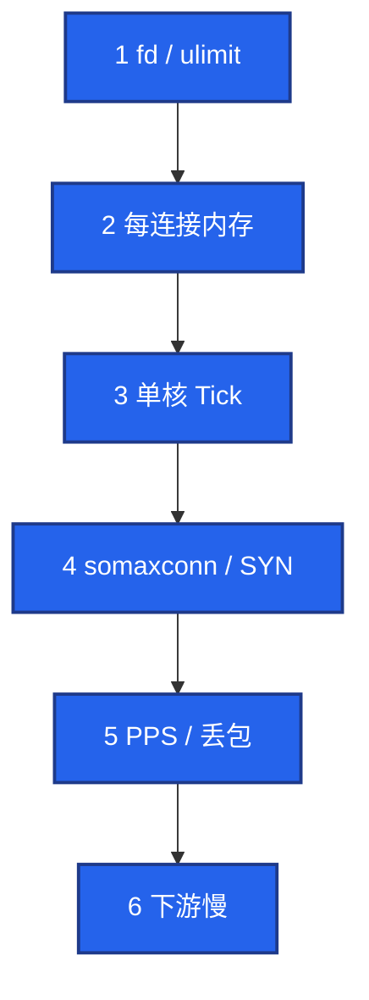

# 08｜游戏网络与对抗 · 练习题

先自己画图或口述，再对照解答。每题标了覆盖范围：

| 标记 | 含义 |
|------|------|
| **核心** | 不懂整章就没建立起来 |
| **必会** | 值班和面试都要能讲 |
| **常用** | 线上会反复碰到 |
| **常考** | 白板和追问的高频口径 |

## 本题目录

- [Q1 容量两个数 / 卡点](#q1)
- [Q2 加速器与粘滞](#q2)
- [Q3 弱网重连 / 幂等](#q3)
- [Q4 DDoS vs CC](#q4)
- [Q5 UDP / KCP](#q5)
- [Q6 外挂边界](#q6)
- [Q7 管理面](#q7)
- [Q8 心跳](#q8)
- [Q9 切高防](#q9)
- [Q10 conntrack](#q10)
- [合上书](#合上书)

---

## Q1

**★★★★★｜长连接容量你报哪两个数？卡点顺序？怎么区分 Tick 满和 fd 满？**

**覆盖**：核心 · 必会 · 常考

### 场景

开服带宽才用了 20%，新玩家进不去。有人要加带宽。Gate CPU 单核 100%，旧连接还在。

### 完整解答

报两个数：**稳态连接**和 **CPS（新建速率）**。开服先炸 CPS 很常见。云 LB 也有单节点连接和 CPS 上限。带宽剩余不表示还能加连接。



```bash
ls /proc/<gate_pid>/fd | wc -l
cat /proc/<gate_pid>/limits | grep 'open files'
nstat -az | grep -iE 'ListenOverflows|ListenDrops'
ethtool -S eth0 | grep -iE 'drop|discard'
```

fd 满：新连接失败。Tick 满：连着但无回包。指标分开看。心跳短于移动 NAT 空闲超时（常 30～60s），心跳不要走完整业务。

### 再追问

怎么区分 Tick 满和 fd 满？——新连接失败查 fd / 队列；已连接无回包查 Tick、下游 Redis / Logic。不要用带宽百分比当容量。存量 3 万连接可能被 2000 CPS 先打穿。

---

## Q2

**★★★★★｜加速器怎样把开服流量打到一台 Gate？粘滞该跟谁？**

**覆盖**：核心 · 必会 · 常考

### 场景

开服五台 Gate，只有一台 CPU 打满，其它空闲。安全组有人准备按「单 IP 连接数」把该出口封掉。

### 完整解答

加速器出口 IP 汇聚，四层按源 IP 哈希，万人打到同一台。粘滞 / 灰度用 uid 或 token。对该出口单独限连阈值，不要当爬虫封死。

「只有一台 Gate 冒烟」先想加速 / NAT，再想配置没挂全。连接数告警看每 VIP / 每 Gate，不把每 IP 连接数当唯一异常。安全组按国家一刀切会误伤出海和加速。和厂商要出口段，高防加白或单独阈值。

加速器对 UDP / KCP 更差：中继和游戏自己的丢包补偿叠在一起。TCP 登录还行、战斗幻灯片，先问加速器路径。

### 再追问

能禁用加速器吗？——产品决策。技术上封出口会误伤。运维负责亲和和容量，不负责和加速商开战。

---

## Q3

**★★★★☆｜弱网重连风暴怎么收？幂等是研发的事，运维追什么？**

**覆盖**：必会 · 常用

### 场景

赛事日 CCU 没涨，登录 / 重连 QPS 冲高，排队开始堆。战斗「无回包」，进程还在。有人按 CCU 扩逻辑服。

### 完整解答

弱网 = 超时重传 + 重连，会把小抖动放大成登录 / Gate 事故。重连必须走快通道，不进万人登录队。重发未确认操作必须服务端幂等。按重连 QPS 扩 Gate，不是按 CCU。

超时分段看：客户端、LB、Gate、逻辑，不要只改 Nginx `60s`。UDP / KCP 要确认高防没默丢。运维给丢包率，不改游戏协议。地铁 / 赛事日典型：CCU 不涨、重连涨。

### 再追问

幂等是研发的事，你追什么？——事故里要确认有没有。没有就停相关玩法防资损（加钱、扣两次道具），而不是只加机器。

---

## Q4

**★★★★★｜DDoS、CC、开服洪峰怎么分？先保护什么？**

**覆盖**：核心 · 必会 · 常考

### 场景

登录成功率掉。有人说是开服正常，有人要切高防，有人要关验证码。创角转化接近 0，投放看板没有对应峰值。

### 完整解答

| 类型 | 特征 | 动作 |
|------|------|------|
| DDoS | 打带宽 / 会话，连不上 | 切高防清洗 |
| CC | 打登录 / 下载 / GM，无投放曲线，验证码失败高，创角≈0 | 业务限流、排队 |
| 开服洪峰 | 有公告和渠道曲线 | 排队 + 扩无状态 |

不确定时先排队保护有状态层，再定性。下载走 CDN，API 走高防，管理面不出公网。看清洗后的登录成功率，不看厂商绿勾。边缘挡洪水 → 排队器挡过量进服 → 应用挡单账号。不要安全组一刀 drop 把真玩家埋了。

### 再追问

清洗误伤怎么办？——对照正常地区成功率，放宽规则或切回，同时保持排队。不要为了「防住」把真玩家全挡。

---

## Q5

**★★★★★｜UDP 战斗突然全超时，TCP 登录正常，先看什么？KCP 算 TCP 吗？**

**覆盖**：核心 · 必会 · 常用

### 场景

高防策略刚升级。登录 HTTPS 正常，战斗 UDP 全超时。有人要重启战斗进程查 Tick。另有人说「我们用的是 KCP，应该当可靠连接配」。

### 完整解答

登录还在，说明 Gate / 账号大体活着。先看安全组 / ACL / 高防是否丢 UDP，和业务 Tick 无关。常见是防护策略升级默丢 UDP。抓边界包，看包有没有进机房。不要先杀战斗进程（那是有状态，等于随机判负）。

KCP 在用户态做可靠，底层仍是 UDP 包。防火墙只看见 UDP。限速、清洗、安全组都按 UDP 放行和统计，不要按「它其实可靠所以当 TCP 配」。运维给丢包率给研发，不在机房改 KCP 参数。

### 再追问

切高防 VIP 之后 UDP 仍不通？——新 VIP 的 UDP 放行和清洗策略要单独验，不要假设 TCP 通了 UDP 就通。切换当变更，盯 CPS 和各地区超时，不要全球盲切。

---

## Q6

**★★★★☆｜外挂在流量上长什么样？运维做什么、不做什么？**

**覆盖**：必会 · 常考

### 场景

同一加速出口上短时间出现数千「新设备」创角，协议失败率异常。有人要在 Gate 按包长 drop。简历上写了「负责反外挂」。

### 完整解答

流量侧可疑：异常 PPS / 包长、失败协议 / 异常消息号、空号等间隔登录、单出口海量新设备、单账号全球跳 IP。

运维做：限流、验证码、排队、隔离到熔断服、日志 / 抓包留给安全、uid 名单交给封禁系统。

运维不做：Gate 上「看起来像外挂」就 drop（无法审计的错杀）；改战斗数值制裁；宣称网络层已根除外挂。

诚实口径：对抗流量和入口；检测模型和封禁是安全 / 玩法。编内核对抗会被问穿。

### 再追问

证据要不要出境给安全厂商？——看合规。玩家日志出境是另一类事故，见第 10 章。默认最小字段、审计、不出域。

---

## Q7

**★★★★☆｜管理面暴露公网的后果？游戏公网只该留什么？**

**覆盖**：必会 · 常用

### 场景

GM 后台为了「方便回家改邮件」开了公网。当晚后台被刷，游戏入口还正常。

### 完整解答

GM、K8s API、DB 是 CC 和被黑的捷径。必须内网 + VPN / 堡垒。游戏公网只留玩家入口和 CDN。管理面被打时玩家入口可以仍是绿的，不要用登录成功率判断后台是否暴露。

### 再追问

临时开个安全组给策划「只放我的 IP」？——IP 会变，加速器会变，规则会忘关。走堡垒机。过期规则本身就是事故源。

---

## Q8

**★★★☆☆｜心跳间隔怎么定？心跳失败该走完整登录吗？**

**覆盖**：常用 · 常考

### 场景

心跳 120 秒一次，移动网玩家频繁掉线重登，冲进登录队列。有人把心跳改成 1 秒。

### 完整解答

短于路径上 NAT / LB 空闲超时（移动网常 30～60s），长到不打爆 CPU。单独心跳通道，失败只重连，不走完整登录排队。心跳不要走完整业务鉴权。1 秒心跳会打爆 Gate CPU；120 秒会被 NAT 踢。两边都是事故。

### 再追问

LB 空闲超时改短了会怎样？——表现为集体无故断线、重连风暴。改 LB 超时当变更，要和心跳一起看，不要只改一端。

---

## Q9

**★★★☆☆｜高防切换玩家会怎样？你盯什么、不盯什么？**

**覆盖**：必会 · 常用

### 场景

DDoS 中切高防 VIP。厂商面板显示「防护中」。切完 CPS 冲高，有人说防护成功了。

### 完整解答

切换会改入口 IP 或链路，玩家侧是一次**集体断线**。当变更：能公告就公告，或选低峰。切换后盯 CPS 和登录成功率，不盯厂商「防护中」绿勾。Anycast / 高防节点质量按地区看。单一地区超时先查就近节点，不要全球切。切完重连走快通道，避免进万人队。

### 再追问

切完登录好了但战斗仍进不去？——可能只切了 HTTPS 入口，TCP / UDP 战斗 VIP 还在挨打，或 UDP 规则没带过去。按协议分别验。

---

## Q10

**★★★☆☆｜conntrack 打满和 DDoS 怎么分？开服只买清洗够不够？**

**覆盖**：常用 · 常考

### 场景

开服 CPS 很高，新连接失败，旧连接还在。高防没有告警。有人坚持是 DDoS，要加清洗带宽。

### 完整解答

云安全组 / conntrack 表打满，表现也像 DDoS：新连接失败、旧连接还在。开服 CPS 高时要看连接跟踪容量，不是只买清洗。DDoS：入口带宽 / SYN / UDP 先满，高防有量。conntrack 满：表项打满，旧连接还在，新的建不上。限流仍分三层。细节见 02-15。

### 再追问

扩 Gate 能不能缓解 conntrack 满？——能把连接分散到更多节点，但单节点表仍然会满。要改跟踪表容量 / 超时，并限 CPS。只加机器会把同样的满再复制一遍。

---

## 合上书

- [ ] 能报稳态连接 + CPS，并区分 fd 满和 Tick 满
- [ ] 能画出加速器万人一出口，粘滞跟 uid 不是源 IP
- [ ] 能把 KCP 讲成「防火墙上仍是 UDP」；TCP 通 UDP 不通先查高防
- [ ] 能分 DDoS / CC / 开服洪峰 / conntrack，不确定先保护有状态
- [ ] 能说弱网重连走快通道；幂等没有就停玩法防资损
- [ ] 能说外挂取证 + 隔离、不私刑；公网只留玩家入口和 CDN
