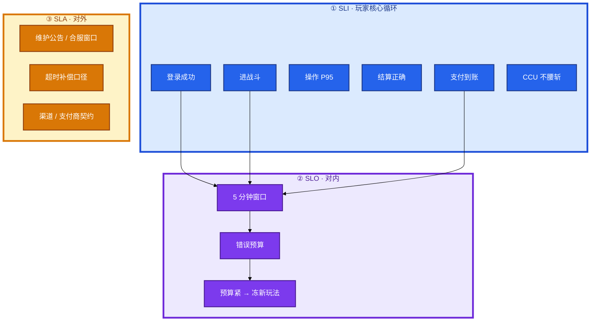
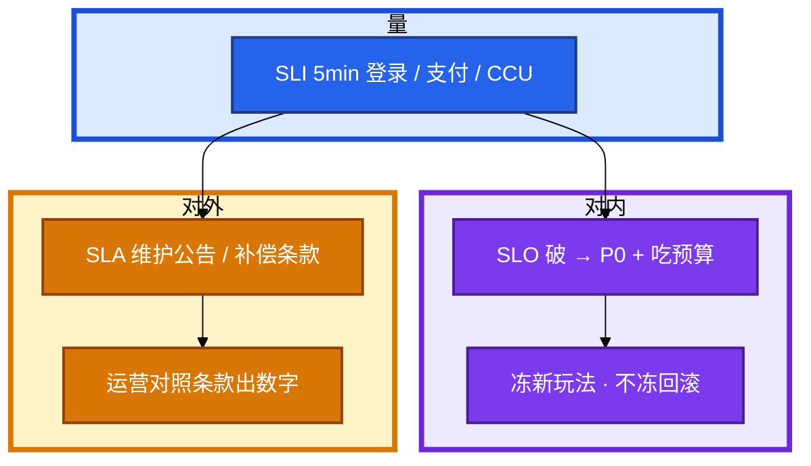
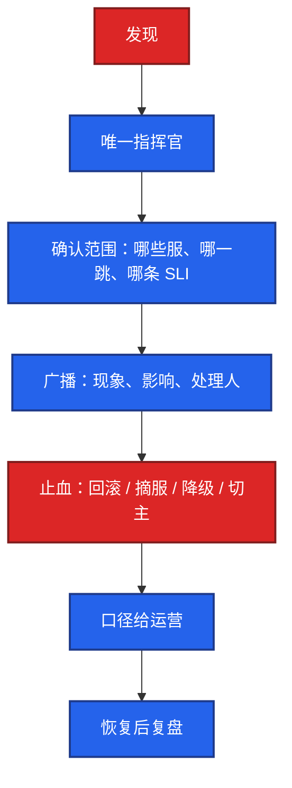
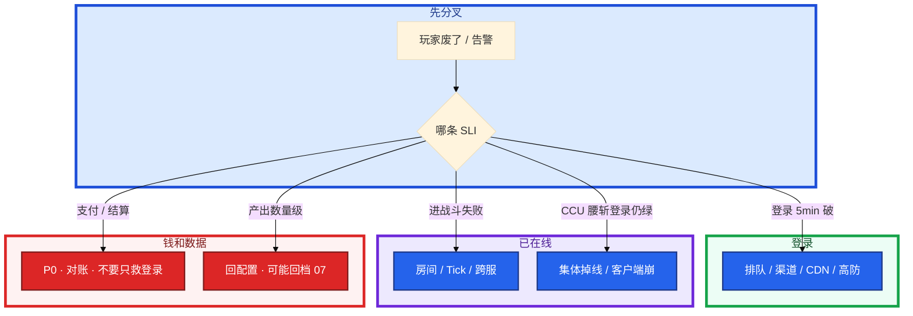

# 游戏 SRE 稳定性


开服 10 分钟登录成功率 90%。月底有人甩出网关 HTTP 99.9%，说没破 SLO。活动整点还有人要发战斗热更。合同上写着「可用性 99.9%」，运营问要不要赔。

先别动手。这一章后半全是你会动手的：**怎么订窗口、怎么冻变更、CCU 腰斩怎么分、事故怎么指挥。** 前面的 SLI / SLO / SLA，是为了让你动手时不选错口径。

**读完你能：** 白板上画出登录 / 战斗 / 支付分条 SLI；能讲清游戏 SLO 和对外 SLA 差在哪；会订错误预算、变更窗口、P0 指挥、演练摘服而不杀战斗房。

## 本章目录

缩进 = 上下级。3 下面才是 3.1。

想钉在**正文左边**跟着滚：菜单 **查看 → 打开视图 → 大纲**。Markdown 预览做不到独立左栏，目录只能写在文章开头。

- [1. 基本概念](#1-基本概念)
- [2. 架构图](#2-架构图)
- [3. 原理](#3-原理)
  - [3.1 SLI 玩家废了什么](#31-sli-玩家废了什么不是网关-200)
  - [3.2 SLO vs SLA](#32-slo-vs-sla-游戏口径)
  - [3.3 错误预算](#33-错误预算与分账)
  - [3.4 登录 SLO vs 战斗 SLO](#34-登录-slo-vs-战斗-slo)
- [4. 安装部署](#4-安装部署)
  - [4.1 生产怎么选](#41-生产怎么选)
  - [4.2 看板落地](#42-看板落地你实际看到什么)
- [5. 核心配置](#5-核心配置)
- [6. 常用命令](#6-常用命令)
- [7. 常用操作](#7-常用操作)
  - [7.1 变更窗口](#71-变更窗口)
  - [7.2 告警与静默](#72-告警与静默)
  - [7.3 事故指挥](#73-事故指挥)
  - [7.4 演练](#74-演练)
  - [7.5 oncall](#75-oncall)
  - [7.6 复盘与公告](#76-复盘与公告)
- [8. 生产排障](#8-生产排障)
- [9. 必会 · 常考](#9-必会--常考)
- [合上书](#合上书问自己)

**本章不讲：** 主机主备、脑裂、RTO 理论 → [02-20](../../02-基础底座/20-高可用与容灾/)；监控底座 → [02-21](../../02-基础底座/21-监控与告警/)；oncall 平台 → [05-06](../../05-工程化与自动化/06-运维平台与Oncall/)；有状态怎么摘流 → [01](../01-游戏服务器架构/)、[03](../03-热更新与版本发布/)；回档作业本身 → [07](../07-玩家数据备份与回档/)；K8s RollingUpdate 不是有状态策略 → [04-Kubernetes](../../04-Kubernetes/)；通用 SRE 合同、ICS、Thanos/网格/多集群 → [10 SRE 实践](../../10-SRE实践/)。

---

## 1. 基本概念

Web 可用性 = 请求成功占比。游戏玩家废的是：登不上、进不了战斗、结算错、钱扣了道具没有、CCU 无故腰斩。长连接健康检查可以永远 200，玩家已经集体掉线。

三个词不要混：

| 词 | 是什么 | 游戏里对谁说 |
|----|--------|--------------|
| **SLI** | 怎么量 | 5 分钟登录成功率、进战斗成功率、支付到账率、CCU 完整性 |
| **SLO** | 内部目标 | 「登录 5 分钟窗口 99.5%」；破了升 P0、吃错误预算 |
| **SLA** | 对外契约 | 对玩家 / 渠道 / 发行：维护怎么公告、超时怎么补、合服窗口是否另计 |

SLO 是工程刹车。SLA 是法务和运营的承诺。用月历网关 200 同时冒充两者，开服 10 分钟登不上会「两边都不破」。

| 在游戏稳定性里 | 不在这里当主指标 |
|----------------|------------------|
| 登录 / 进战斗 / 操作 P95 / 结算 / 支付 / CCU | 网关 HTTP 99.9%、长连接探活 200 |
| 5 分钟滑动窗口 | 只用 30 天平均 |
| 计划内维护另本账 | 把合服算进故障预算 |

> **记住**：登录看 5 分钟窗口，不要用月历网关 200 掩盖开服 10 分钟。计划内维护和故障分账。SLA 写「99.9%」不等于值班可以拿月平均顶回去。

Web SaaS 把日历可用性写进 SLA 还能自洽：请求短、无状态、失败可重试。游戏不行：长连接探活恒 200；开服 10 分钟废了当月其余 29 天都绿；结算错时 HTTP 仍 200。所以游戏把 **SLI 订在玩家核心循环**，把 **SLO 订在短窗口**，把 **SLA 订在公告和补偿**，三张表分开。混成一句「99.9%」，开服事故会在月底才被「证明没发生」。

---

## 2. 架构图

先把整张图钉住。后面订目标、告警、指挥都对着这张图说话。



图上三条线：

1. **先说清哪一条 SLI 破了**，再决定摘登录还是摘房间。
2. **SLO 破了升 P0、吃预算**；SLA 破了才谈公告和补偿，不要用 SLO 看板直接当赔付开关。
3. **结算错误时可用性板可以全绿，仍是 P0。** 钱和数据不看机器台数。

---

## 3. 原理

原理只保留动手和面试会用到的：量什么、内部目标和对外契约差在哪、预算怎么分账、登录和战斗为什么不能一条线。

**本节 4 块：** 3.1 SLI · 3.2 SLO vs SLA · 3.3 错误预算 · 3.4 登录 vs 战斗

### 3.1 SLI：玩家废了什么，不是网关 200

目标要带窗口。登录成功率用 **5 分钟滑动**，不要只用 30 天。开服 10 分钟登录 90%，按月平均可能仍 > 99.9%，但这次就是 P0。

```
  30 天日历（格子 = 时间片）
  |||||||||||||||||||====|||||||||||||    ==== 计划内合服（另本账）
  |||||XX|||||||||||||||||||||||||||||    XX   开服 10 分钟登录失败（故障）

  月平均仍可 > 99.9%
  5 分钟登录 SLI 已经破线 = P0
```

| SLI | 定义 | 为什么独立 |
|-----|------|------------|
| 登录成功率 | 鉴权到拿到大厅的成功占比 | 开服 / 版本日主指标；无状态可扩 |
| 进服 / 进战斗成功率 | 有 ticket 后进房间成功 | 登录好、战斗进不去是另一类 |
| 操作 P95 | 核心操作回包 | 卡顿流失，不是 5xx |
| 结算正确率 | 战斗结果与背包一致 | 可用性绿、经济错，仍是 P0 |
| 支付到账率 | 已扣款订单到道具 | 资损，单独 P0 线 |
| CCU 完整性 | 相对预测 / 环比不腰斩 | 全服静默故障的哨兵 |

常见误判：用登录成功率判断战斗；用网关探活判断长连接；用 30 天平均判断开服 10 分钟。长连接健康检查恒 200；登录失败发生在渠道或排队，网关看不到。所以不能用网关成功率代替登录 SLO。

用数字把「月平均会撒谎」说死。登录 5 分钟窗口、目标 99.5%：一个月约 8640 个 5 分钟片，预算大约 43 片。开服一次 10 分钟登录 90%，已经吃掉 2 片还外加体验事故，必须 P0。同一笔如果摊进 30 天网关 200，可能看不出来。

### 3.2 SLO vs SLA：游戏口径

**SLO**（Service Level Objective）：你们内部认的目标。破了 = 工程失败：升 P0、吃错误预算、冻非必要变更。玩家不一定看见「SLO」三个字。

**SLA**（Service Level Agreement）：写进对玩家公告规则、渠道合同、发行承诺的那部分。常见内容不是「网关 99.9%」，而是：

| SLA 里真正该写的 | 不要写成 |
|------------------|----------|
| 计划内维护提前多久公告、最长停服多久 | 「全年 99.9%」却把合服算进去 |
| 开服 / 版本日登录失败如何补偿（邮件、补时） | 用月底平均证明「没违约」 |
| 支付不到账的处理时限和对账责任 | 登录绿就当支付 SLA 达标 |
| 渠道包、商店过审、地区合规导致的不可用是否除外 | 把渠道故障算进你们的故障预算又不公告 |

游戏很少真的按「日历可用性 99.9%」赔付。合同若写了这个数，值班口径仍是：**5 分钟登录 / 支付 SLI 破了就 P0**，赔偿走运营和法务对照 SLA 条款，不在事故群里用月平均顶。

渠道 / 支付商也有他们的 SLA（回调时延、对账日切）。地区支付失败是**地区 P0**（10），不要和登录 SLO 混成一条线，更不要扩 Gate 去「完成支付 SLA」。

活动周把观察加密（看板、人在线、更短窗口），**不**把发版权放大，也不把 SLA 承诺放宽。预算是刹车，不是「这个月还能再挂几次」的配额。

对照口诀：

```
  SLI = 尺子（5 分钟登录成功率）
  SLO = 内部红线（99.5%；破了 P0 + 吃预算）
  SLA = 对外合同（维护怎么公告、超时怎么补、合服是否除外）

  破 SLO ≠ 自动破 SLA
  没破 SLA ≠ 可以不升 P0
  月历 99.9% ≠ 上面任何一条
```

发行 / 渠道合同里的「可用性」经常是律师从 Web SaaS 抄来的。落地时拆成三张表：内部 SLO 看板、对外维护与补偿规则、渠道商自己的回调 SLA。三张表对不齐，事故群里会同时出现「没破约所以不 P0」和「玩家要赔偿所以全员加班」两种错。



> **记住**：SLO 对内刹车；SLA 对外承诺。开服 10 分钟登不上，SLO 已破。月历 99.9% 救不了这次，也救不了合同解释。

### 3.3 错误预算与分账

```
  错误预算
       |
       +-- 故障消耗 --> 超了：冻新玩法上线，不冻安全修复和回滚
       +-- 计划内维护（合服、强更停服）--> 单独记账，不和故障混成一笔
       +-- 活动周 --> 提高观察密度，不提高随便发版的权利
```

把合服窗口算进故障预算，后面全月不能发版，团队会作假关窗。计划内和维护公告过的停服，另本账——这也是 SLA 里该写清的除外项。

```
  登录 SLI 目标 99.5% / 5min
  月预算 ≈ 43 个失败窗口

  开服 10min @ 90%     --> 吃预算 + 升 P0，不要等月底再算
  合服停服 2h 已公告   --> 另本账，不从这 43 里扣；SLA 维护窗口
  新玩法上线把预算打光 --> 冻下一周非必要变更
```

错误预算是给**变更权**用的，不是给「能挂多久」用的。预算还在，也不允许活动整点发战斗热更（7.1）。预算打光，安全修复和回滚仍然放行——这两类不消耗「随便发版」的权利，它们是在把 SLO 往回救。

和 SLA 分账对齐：计划内合服若已按 SLA 公告，不从故障预算扣。没公告的停服，既吃 SLO 预算，也可能踩 SLA。值班不要用「这是维护」事后改口。

### 3.4 登录 SLO vs 战斗 SLO

登录挂了是全渠道进不了门。战斗挂了是已经在线的人突然不可玩。两者的扩容、变更、止血都不是同一套。登录好、战斗进不去，是另一类事故。指挥时先说清「哪一条 SLI 破了」，再决定摘登录还是摘房间。

| 破了哪条 | 扩什么 | 变更窗口 | 对外口径 |
|----------|--------|----------|----------|
| 登录 | 无状态登录 / 排队 / 渠道 | 活动中可以扩 | 进不去门 |
| 进战斗 | 不能靠 HPA 迁已开房间（01、05） | 活动整点禁止战斗热更 | 在线的人突然不可玩 |
| 结算 / 支付 | 不扩机器能好 | 冻写、对账 | 可用性绿也是 P0 |
| CCU 腰斩 | 先分全球 vs 单区 | 先停变更 | 可能集体掉线，不是「没人来」 |

把四条订成同一条「可用性 99.9%」，指挥会用登录成功率判断战斗，或用网关 200 判断支付。分开订、分开告、分开指挥。

---

## 4. 安装部署

### 4.1 生产怎么选

| 项 | 选 | 不选 |
|----|----|------|
| 主 SLI | 登录 5min、进战斗、结算、支付、CCU | 网关 200、长连接探活 |
| 窗口 | 5 分钟滑动为主 | 只用 30 天 |
| 预算 | 故障 vs 计划内分账 | 合服扣故障预算 |
| SLA | 维护公告、补偿、除外项写清 | 用月平均当赔付开关 |
| 告警 | 按服、按玩法路由 | 所有 P2 进同一个电话 |
| 高基数 | `server_id` + 记录规则聚合 | `server_id × 全接口` |

### 4.2 看板落地你实际看到什么

分层：机器 / 中间件 / 接入各跳 / 玩法 / 业务 CCU 与经济 / 客户端崩溃。必有：登录 5 分钟成功率、CCU 腰斩、支付、单服产出数量级、跨服开房失败。`server_id` 要有但控制高基数。

验收：能回答「此刻哪一条 SLI 破了」；维护窗只静默对应服；开服 10 分钟失败会在 5 分钟窗口上红，而不是等月底。

看板最小集（版本夜必须能投屏）：

| 板 | 必须有 |
|----|--------|
| 登录 | 5 分钟成功率，按渠道 / 按跳（鉴权、排队、进大厅） |
| 战斗 | 进房间成功率、Tick / 操作 P95，按 `server_id` |
| 钱 | 支付到账率、发货延迟，按渠道 |
| 人 | CCU 分服 vs 预测 / 环比 |
| 变更 | 最近指针、配置 version、云侧、渠道公告 |

缺「按跳」的登录板：渠道挂了网关仍 200，你会以为没破 SLO。缺 `server_id`：单服 P1 被全局平均吃掉。

---

## 5. 核心配置

| 项 | 生产怎么用 | 改错会怎样 |
|----|------------|------------|
| 登录窗口 | 5 分钟滑动，目标如 99.5% | 月平均掩盖开服事故 |
| CCU 告警 | 对预测 / 环比 / 同时段，10 分钟掉 40%+ 无维护 = P0 候选 | 对绝对值 → 凌晨误报 |
| 支付 | 失败率抬升 = P0 | 登录绿就不管钱 |
| 产出 | 单服相对基线数量级 = P1 经济 | 没有这条会拖到整服回档（07） |
| 静默 | 跟维护单、对应服 | 「版本夜很忙」关全集群 |
| 高基数 | 核心接口 + 按服聚合 | Prometheus 先死，SLO 看板空白 |
| SLO vs SLA 路由 | SLI 破线进 P0；补偿进运营 | 同一电话里争论赔不赔 |

> **记住**：CCU 腰斩比 CPU 90% 更该叫醒。维护只静默对应服，不要关全集群。

内部 SLO 数字（5 分钟 99.5%）不要原样印到玩家公告或渠道合同。对外改写成：维护提前多久公告、最长停多久、支付多久内对账。把内部红线写进 SLA，法务会按日历解释，值班会被月平均绑架。

---

## 6. 常用命令

值班先看看板，不是先重启。现场顺序是读 SLI，不是敲一条神命令。

| 目的 | 看什么 |
|------|--------|
| 哪条 SLI | 登录 5min、进战斗、支付、CCU 分服 |
| 全球还是单区 | CCU / 登录按 `server_id` |
| 变更 | 配置、CDN 指针、云侧、渠道；即使「最近没发版」 |
| 维护 | 有没有对应服的维护单 / 静默 |
| 经济 | 单服产出、支付失败 |

叫醒：支付、数据错、多服登录、CCU 腰斩、安全。不叫醒：单渠道文案、已降级的排行、已知渠道故障且有公告。标准写在 SLO 和路由里，不靠值班心情。

现场口述顺序固定，避免一开口就谈赔偿：

1. 哪一条 SLI、哪个窗口、破没破内部 SLO
2. 范围：全球 / 单区 / 单渠道
3. 正在做的一件止血
4. 对外四句：影响服、能否进、钱和道具、ETA
5. 补偿：对照 SLA，运营出数字

第 1 句对工程。第 4～5 句对玩家和合同。不要用第 5 句否定第 1 句。

---

## 7. 常用操作

### 7.1 变更窗口

默认禁止：活动整点前 30 分钟到峰后 30 分钟发无关变更；周五晚上发战斗 / 协议（周末没人收尾）；合服、强更、数据修复叠在同一窗口；生产直接热更未在预发跑过的脚本。

允许：登录 / 目录无状态扩容（活动中可以，且常常必须）；已演练的降级开关；回滚（回滚也要喊一声，避免双人同时反向操作）。

```
  活动整点
  |---- 禁止无关变更 ----|--峰--|--禁止无关变更 ----|
       仍允许：登录扩容、已演练降级、回滚（要广播）

  错：合服当晚再塞战斗热更
  对：高危操作一个窗口只做一件
```

变更单写清：影响哪一类 SLO、如何观察、谁回滚、超时是否自动回。有状态发布按第 01、03 章摘流，**不把 K8s RollingUpdate 当变更策略本身**。活动中扩登录集群是对的；同一分钟热更战斗脚本是错的。错误预算吃紧：冻新玩法，不冻回滚和安全修复。

### 7.2 告警与静默

游戏特有告警：`CCU 10 分钟下降 40%+` 且无维护 = P0 候选；登录成功率 5 分钟 < 阈值 = P1 / P0；支付失败率抬升 = P0；单服道具产出相对基线数量级变化 = P1（经济）；跨服房间创建失败 = P1（玩法）。

高基数：`server_id × 接口` 要控制。全接口全服标签会把 Prometheus 打死。游戏 `server_id` 是必需维度，用记录规则打聚合，原始指标只留核心接口。丢掉 `server_id` 只留全局：腰斩和产出异常经常是单服，你会把单服 P1 看成噪声。

告警路由：按服、按玩法值班，避免所有 P2 进同一个电话。维护窗口要静默**对应服**，不要静默整个集群。CCU 对预测或环比、对同时段历史，不要对绝对值——凌晨低谷不是腰斩。

SLO 告警和 SLA 工单不要接同一条路由。登录 5 分钟破线进 P0 电话；「是否按合同补偿」进运营工单。混在一起，值班会被「要不要赔」拖住，忘了止血。

### 7.3 事故指挥

定级看 **玩家核心循环和钱**，不看机器台数。测试服用生产库配错切到生产，一台也是 P0。数据错即使「还能登录」也是 P0。可用性看板上全绿不能降级。

| 级 | 例子 | 响应 |
|----|------|------|
| P0 | 全渠道登录失败；支付不到账；全服 / 多服数据错；CCU 腰斩 | 立即，升级、运营公告 |
| P1 | 单大服不可玩；核心战斗不可进；合服后大面积找不到角色 | 15 分钟，技术负责人 |
| P2 | 排行、跨服、非主线活动、部分渠道更新慢 | 值班处理 |
| P3 | 文案、轻微错资源、个别客户端机型 | 工单 |



指挥角色拆开：指挥官（唯一）定范围、定止血、定何时开放；技术执行只做点名的那件；对外口径给运营事实（影响服、能否进、钱和道具、ETA）；记录时间线和已做变更，不当场追责。

没有唯一指挥官时，典型翻车是：一个人回指针、一个人抬 min、一个人重启逻辑服。三件叠在一起，你无法知道哪件有效。止血阶段禁止「顺便优化」。

P0 现场即使「最近没发版」，仍先看变更（配置、CDN 指针、云侧、渠道）。没有再看依赖和容量。不在现场分析一周。

定级对照 SLO，对外对照 SLA，不要用机器台数在两张表之间摇摆：

| 现场 | SLO 口径 | SLA 口径 |
|------|----------|----------|
| 开服 10min 登录 90% | 5 分钟 SLI 破，P0 | 公告影响面和 ETA；补偿走条款 |
| 测试服写乱生产订单 | 支付 / 数据 P0，一台也是 | 按单对账，不谈「就一台」 |
| 合服已公告停服 2h | 不扣故障预算 | 维护窗口内，按公告执行 |
| 排行挂了 | P2，不叫醒 | 通常不构成违约 |

指挥官只点名一件止血动作。执行的人复述「做哪条 SLI」。对外口径的人禁止在群里发明赔付数字。

### 7.4 演练

值得定期演：单服从目录摘除再挂回；排队器降速、排队器宕机走「停进服」；数据库主从切换 + 切换后经济校验（延迟窗口内写入、背包和订单对得上）；回档作业在镜像库跑通（07）；高防切换、CDN 指针回退；登录集群丢掉一半副本。

不在生产演：随机杀战斗进程做混沌（等于随机判负）；对生产主库写压测；无公告的全服踢人。

演练要有记录：步骤、耗时、谁执行、缺口。被问「混沌工程」要说杀了什么、玩家侧如何隔离。答不出就说做的是预案演练，不要硬蹭词。主机怎么切主、怎么防脑裂，理论在 02-20；这里要的是切完之后**经济校验**。

把演练耗时写进 SLO 解释，不要写进 SLA 承诺。镜像回档演练 90 分钟，对外不能说「RTO 15 分钟」。计划内维护窗口按演练真值留余量，这才是 SLA 里「最长停服多久」的来源。

### 7.5 oncall

开服日、版本日、大活动：人在线，不是「有 Pager 就行」。游戏 oncall 要能执行：摘服、降级开关、回滚配置、联系渠道 / 云高防。权限提前开通，不要事故里申请堡垒机。有 Pager 但登不上堡垒等于没有。

交接班：当前活动、未恢复的降级、进行中的灰度、已知渠道问题。游戏事故经常跨零点，交接比日班更关键。

oncall 手册里写清「破 SLO 怎么叫人、破 SLA 怎么叫运营」。P0 叫醒走 SLO（支付、数据、多服登录、CCU 腰斩）。运营公告和补偿走 SLA 条款，不必等法务在事故分钟级到场，但技术不口头承诺赔付比例。版本夜人在线，是因为 5 分钟窗口等不到第二天再看月历。

### 7.6 复盘与公告

复盘多两栏：对玩家说了什么、经济是否对平。技术根因清楚但公告撒谎「数据完整」而实际丢了，是第二次事故。公告由运营出，技术提供：**影响服、能否进、道具 / 充值是否需要补、预计时间**。不要在公告里点名组件和锅。动作项要能关：告警、校验、窗口纪律、权限。写「加强责任心」等于没写。桌上要有产品，否则只会得到「运维下次早点发现」。

对外能玩先恢复登录。数据展示异常要诚实说「正在对齐」，避免玩家重复操作造成二次写。不要让玩家在脏缓存上充值。以 DB 为准对齐 Redis。

生产故事：开服 Redis 主挂、从有延迟。对内切主、核对该窗口写入；对外能玩先恢复登录，不承诺「完整无丢失」直到对平。禁止让玩家重复充值「试试」。事后补切换告警和切换后一致性校验。延迟窗口里的写入：对账，不要猜。支付单以支付库为准补发或标记。角色以 DB 为准，脏 Redis 丢掉重建。

SLA 补偿（补时、邮件）由运营对照条款执行。技术只提供事实时间线和影响面，不在群里承诺赔付比例。

指挥时把 SLO 和 SLA 说成两句，避免运营听成「没破约所以不用公告」：

1. 「登录 5 分钟 SLI 已破，按内部 SLO 这是 P0。」
2. 「对外：影响哪些服、能否进、钱和道具、ETA。补偿对照 SLA 条款，不在这里拍数字。」

没有第二句，群里会用月历 99.9% 顶；没有第一句，会有人觉得「合同没写游戏 SLI 就不用半夜起来」。

---

## 8. 生产排障

三问：哪一条 SLI 破了？全球还是单区？最近有没有变更（含配置和渠道）？



CCU 10 分钟掉 40%+ 且无维护：

```
       |
       +-- 分服：全球一起掉 --> 账号 / 登录 / 客户端 / CDN
       |         单区掉     --> 区服逻辑 / 该服库 / 摘服误操作
       +-- 登录还绿、CCU 掉 --> 集体掉线或客户端崩，不是「没人来」
       +-- 支付同时掉       --> 资损通道，P0 不要只救登录
       +-- 先对环比 / 同时段，再对绝对值
```

| 现象 | 先做什么 | 不要做什么 |
|------|----------|------------|
| 开服 10min 登录 90%，月历仍 99.9% | P0；5 分钟 SLI | 「没破 SLO」 |
| 测试服配错生产库一台 | P0 | 「就一台算 P2」 |
| 活动整点要热更战斗 | 拒绝；可扩登录 | 同一分钟两件高危 |
| CCU 腰斩、CPU 不高 | 环比 + 分服 | 对绝对值说人少 |
| 排行挂了半夜电话 | 不叫醒（已降级） | 靠心情 |
| 预算打光还上新玩法 | 冻新玩法 | 冻安全修复 |
| 公告写「数据完整」实际没对平 | 第二次事故 | 先承诺再核对 |

---

## 9. 必会 · 常考

白板和追问高频，能一口回：

| 说法 | 对错 | 口径 |
|------|:----:|------|
| 网关 99.9% 就能当游戏 SLO | 错 | 玩家废的是登录 / 战斗 / 钱 |
| 开服 10 分钟 90% 月平均没破就不用 P0 | 错 | 5 分钟窗口已破 |
| SLO 和 SLA 是一回事 | 错 | 对内目标 vs 对外契约 |
| 合服停服扣错误预算 | 错 | 计划内另本账；SLA 除外项 |
| 预算紧了连回滚都冻 | 错 | 冻新玩法，不冻安全 / 回滚 |
| 用登录成功率判断战斗 | 错 | 两条独立 SLI |
| 定级看挂了几台机器 | 错 | 看核心循环和钱 |
| 活动中不能扩登录 | 错 | 无状态可以且常常必须 |
| CCU 看绝对值 | 错 | 环比 / 同时段；凌晨不是腰斩 |
| 生产随机杀战斗做混沌 | 错 | 随机判负 |
| 有 Pager 就等于有 oncall | 错 | 登不上堡垒 = 没有 |
| 公告先写数据完整 | 错 | 对不平就是第二次事故 |

数字：登录 **5 分钟**窗口；目标示例 **99.5%** ≈ 月 **43** 个失败片；CCU **10 分钟掉 40%+** 无维护 = P0 候选；P1 响应 **15 分钟**。

SLO 破了升 P0 是工程决定。SLA 赔不赔是条款决定。两句话都能当场说清，这一章的口径才立得住。

易混：SLI vs SLO vs SLA；故障预算 vs 计划内维护；登录 SLO vs 战斗 SLO；网关 200 vs 登录成功率；CPU 90% vs CCU 腰斩；混沌 vs 预案演练。

---

## 合上书，问自己

1. 玩家废的六条 SLI 是哪六条？为什么网关 200 不能代替？
2. SLO 和 SLA 在游戏里各对谁说？开服 10 分钟 90% 破的是哪个？
3. 错误预算怎么处理合服？预算打光还能发新玩法吗？
4. 活动整点能扩什么、不能发什么？变更单要写哪四项？
5. P0 怎么定级？唯一指挥官五步？最近没发版先看什么？
6. 演练演什么、生产绝不演什么？公告只给哪四句事实？

六题都能口述，这一章就过了。下一章把出海剖开：跨洋延迟消不掉、数据驻留、账号全局角色落 region。
