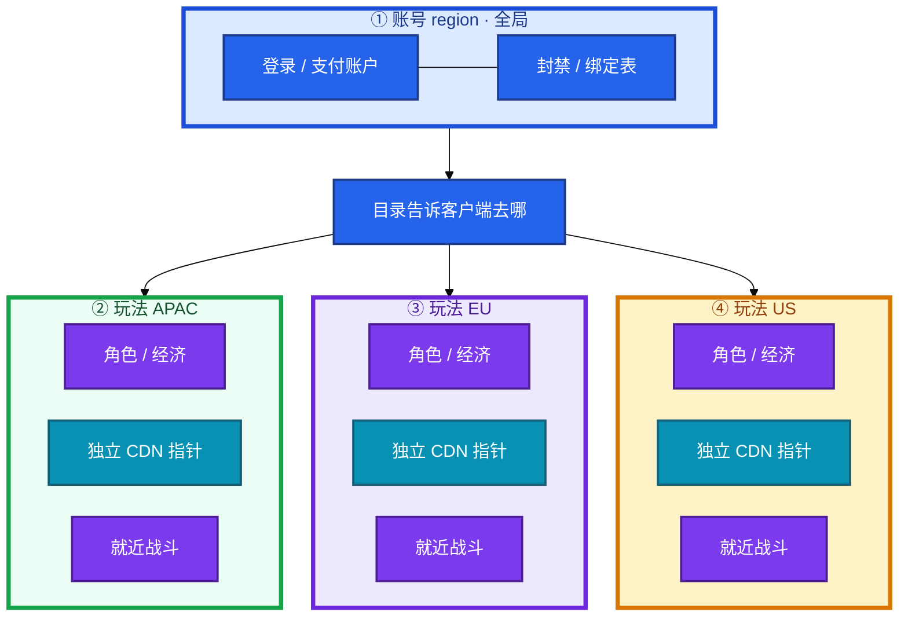
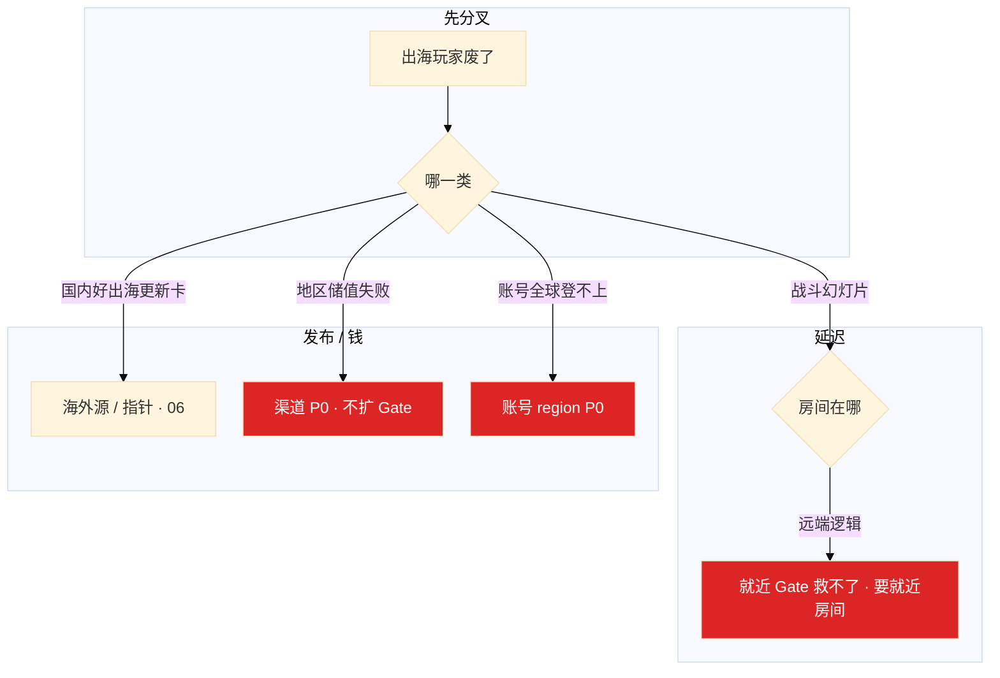

# 出海与多区域


美西玩家打日服卡成幻灯片。有人说上专线就能把 200ms 变 20ms。欧区备份把 S3 跨 region 复制勾上，账单导出里出现欧区 PII。群里有人要 `UPDATE region='us'` 给玩家换区。

**跨洋延迟消不掉，账号全局、角色落 region，换区是迁移不是改字段。**

**本章主线（出海就按这三步想）：**

1. **延迟**：实时玩法就近房间，不是只就近 Gate；专线稳丢包不消光速。
2. **驻留**：备份要说清哪个账号、哪个 region、有无跨账号复制；默认不出域。
3. **故障域**：账号挂 = 全球 P0；玩法 region 挂 = 摘该区；支付地区失败 = 地区 P0，不扩 Gate。

**读完你能：** 白板上画账号全局、角色落 region；判断就近房间还是就近 Gate；换区迁移、分区 CDN、当地时区窗口；讲清备份在哪个账号哪个 region。

## 本章目录

- [1. 基本概念](#1-基本概念)
- [2. 架构图](#2-架构图)
- [3. 原理](#3-原理)
- [4. 落地](#4-落地)
- [5. 核心配置](#5-核心配置)
- [6. 命令与操作](#6-命令与操作)
- [7. 生产排障](#7-生产排障)
- [8. 必会 · 常考](#8-必会--常考)
- [合上书](#合上书问自己)

**本章不讲：** CDN 预热、分区指针细节 → [06](../06-CDN与资源更新/)；迁角色 / 合服停写步骤 → [02](../02-开服合服/)；主机双活、脑裂理论 → [02-20](../../02-基础底座/20-高可用与容灾/)；NTP 机制 → [02-19](../../02-基础底座/19-NTP与时间同步/)；阿里云 / AWS 产品细节 → [07 云平台](../../07-云平台/)；加速器让地区 IP 失真 → [08](../08-游戏网络与对抗/)；账号登录链路 → [04](../04-登录排队与选服/)。

---

## 1. 基本概念

跨洋 150～250ms 消不掉。专线稳的是丢包和抖动，不是光速。实时对战必须就近开房间；只把 Gate 放近、逻辑仍在远端，战斗 RTT 几乎不降。

**值班里什么时候碰到：**

| 场景 | 谁说什么 | 你的第一刀 |
|------|----------|------------|
| 美西打日服 | 「上专线能不能变 20ms」 | 解释光速下限；查房间在哪 |
| 欧区合规 | 「备份更稳，开跨 region 复制」 | 关复制，法务评估 |
| 换区 | 「UPDATE region 一行搞定」 | 拒绝，走合服迁移 |
| 国内好出海卡 | 「CDN 国内预热过了啊」 | 海外独立源/预热 |

游戏几乎不做「两个 region 双活写同一角色库」。有状态 + 经济对账，冲突和回档都无法收场。主流是 region 独立：坏了公告维护，玩家在其他 region 的号仍可玩。

| 在出海这一章 | 不在这一章当承诺 |
|--------------|------------------|
| 账号全局、角色落 region | 两个 region 双活写同一角色库 |
| 就近匹配、就近房间 | 专线把 200ms 变 20ms |
| 备份账号 + region + 有无跨账号复制 | 「数据在 S3」四个字 |
| 活动整点用当地时区 | 一份北京 cron 打全球 |

三个故障域不要混：

| 挂了谁 | 玩家看见 | 你做什么 |
|--------|----------|----------|
| **账号 region** | 全球登不上 | P0；靠账号自己的多 AZ，不是靠玩法散开 |
| **玩法 region** | 该区不可玩 | 目录摘掉该区，其他地区可玩 |
| **支付地区通道** | 该渠道储值失败 | 地区 P0；不要关全球登录、不要扩 Gate |

> **记住**：跨洋延迟消不掉。账号全局、角色落 region；别吹两个 region 双活写同一角色库。答备份要说清哪个账号、哪个 region。

**面试怎么说**：「实时对战必须就近房间，只就近 Gate 救不了战斗 RTT。换区是小型合服迁移，不是 UPDATE region。」

---

## 2. 架构图



**读图三句话：**

1. **没有箭头在 APAC 角色库和 US 角色库之间双写。** 延迟、冲突、回档、合规全部炸。
2. **换区是迁移作业**（停写、备份、校验、映射），不是改一个字段。
3. **活动整点和合服窗口用发行当地时区**，不要用北京时间给美西停写。

和 02-20 的「同城双活」对齐说法：

```
  02-20 主机 HA：同城 VIP / 奇数节点，防的是机器和 AZ
  本章角色库：    跨洋不双活写；region 独立；坏了维护

  可以多 AZ 的：登录、目录、账号（全局无状态或可切）
  不要跨洋双写的：角色、背包、结算、拍卖

  远 region 只读副本可以给排行 / 展示
  写路径（扣费、发货、结算）必须落在角色所在 region
```

---

## 3. 原理

### 3.1 延迟：先认物理

**一句话：** 跨洋 RTT 有物理下限；专线稳丢包不消光速；实时对战必须就近房间。

**打个比方**：跨洋延迟像洛杉矶到东京的物理距离——**专线可以把坑坑洼洼的路修平（降抖动），不能把两地拉近**。

**现场走一遍**（美西玩家打日服，操作像幻灯片）：

1. 分地区拨测：

```bash
curl -o /dev/null -s -w 'login_https:%{time_total}s\n' https://gate-us.example.com/health
nc -zv battle-jp.example.com 9001
```

2. 屏幕：美西→Gate-US `0.045s`（正常）；美西→日服房间 RTT `198ms±12ms`。
3. 产品提议「把 Gate 放美西」→ Gate 快了，**房间仍在东京**，Tick 同步仍 198ms。
4. 正确：美西玩家匹配美西房间；回合制可跨洋单 region。
5. 专线：200ms±80ms 抖动 → 200ms±10ms；**平均 RTT 几乎不动**。

| 距离 | RTT |
|------|-----|
| 同城 | 10～30ms |
| 跨大陆 | 150～250ms+ |

| 玩法 | 预算 |
|------|------|
| 卡牌 / 回合 | 100～200ms 可玩 |
| 实时对战 | ~50ms 舒适，必须 **就近匹配、就近房间** |
| 操作类 MMO | 抖动比平均 RTT 更敏感 |

| 路径 | 典型 | 玩家感知 |
|------|------|----------|
| 玩家 → 就近 Gate | 可压到几十 ms | 登录、大厅轻操作变快 |
| Gate → 远端房间 | 跨洋 150～250ms 仍在 | 操作回包、Tick 同步仍幻灯片 |
| 房间 → 本服库 | 应同 region | 结算、发货；跨 region 写 = 经济事故 |

**面试怎么说**：「专线不能把跨洋 200ms 变 20ms。就近 Gate + 远端逻辑不是全球同服。延迟拨测要分地区、分协议。」

### 3.2 数据驻留与跨境

**一句话：** 驻留按发行地不是按机房；备份跨 region 复制是最常见的静默出域。

**打个比方**：数据驻留像护照——**人（数据）在哪国合法，不是你在哪国有办公室就算合规**。

**现场走一遍**（欧区要做备份，S3 跨 region 复制勾上）：

1. 合规审查：欧区 PII 备份进了国内账号 S3。
2. 账单导出出现欧区玩家 ID、支付记录 → **合规事故**。
3. 正确：备份落在**该发行主体账号、该 region**；跨 region 复制默认关。
4. 开复制前：法务评估 + 目标桶账号/region 确认。
5. 答「数据在 S3」不够 → 要说 **哪个账号、哪个 region、有没有跨账号复制**。

| 数据 | 驻留口径 | 翻车动作 |
|------|----------|----------|
| 角色 / 背包 / 邮件 | 落在玩法 region；不跨洋双写 | 角色库跨 region 同步「做 HA」 |
| 账号 / 绑定 | 账号 region；玩法服只认 token | 玩法服存第三方法人数据副本 |
| 日志 / 行为分析 | 默认不出发行地 | 生产日志打到国外 SaaS |
| 备份 | **账号 + region + 有无跨账号复制** | S3 跨 region 复制勾上就把 PII 带出国 |
| 支付订单 | 发货在可审计区域完成 | 订单回写到国内账号 |

**面试怎么说**：「S3 跨 region 复制一开会静默出域。云账号按发行主体拆，避免欧区数据出现在国内账单导出。」

### 3.3 合规：日志、支付、年龄、内容

**一句话：** 日志出境、聊天送境外大模型、客服整包下载都是合规事故。

**打个比方**：合规像海关——**没申报就带数据出境，不是「为了备份更稳」就能过关**。

**现场走一遍**（上线前合规清单）：

1. 问：生产日志采集器指哪？→ 发现指向 US SaaS，欧区玩家 PII 出境。
2. 问：客服工具能否下载整包玩家数据？→ 能，且无 region 限制 → 高风险。
3. 问：聊天是否送境外大模型做审核？→ 默认禁止。
4. 支付：发货必须在可审计 region 完成；当地渠道、税、留存年限分开。
5. 热更也是发行物，部分地区改数值要过审（03）。

**面试怎么说**：「运维清单：备份在哪、谁有权拉、跨 region 复制有没有 PII。商店过审周期按当地排强更，不要国内过审完当天全球抬 min。」

### 3.4 账号全局 vs 玩法分区

**一句话：** 账号挂是全球 P0，玩法 region 可摘；换区是小型合服迁移。

**打个比方**：账号像护照签发中心——**一个中心挂了，所有国家的签证都停**；玩法 region 像各国分店，**一家装修不影响别国**。

**现场走一遍**（玩家要换到美服，运维 `UPDATE region='us'`）：

1. 改字段后：美西目录指向 US region，但角色数据仍在 APAC 库。
2. 玩家进 US Gate → 空号或脏数据。
3. 正确换区：目录摘源 → 停写 → 双备份 → 映射迁移 → 三道校验（02）。
4. 跨法域（欧↔美、欧↔国内）默认拒绝，除非产品+法务书面允许。
5. 跨洋双写会：延迟冲突、道具发两次、回档不知以哪边为准、合规出境。

```
  全局：账号、登录、好友关系（可选）、支付账户、封禁名单、渠道绑定
  分区：角色、背包、进度、区服经济、就近战斗
  目录：告诉客户端去哪个 region 的哪条服
```

**面试怎么说**：「账号挂了玩法散开还能进是错的——账号挂是全球门关。不能把美西玩家指到欧区当容灾，没迁移就换指向 = 空号。」

---

## 4. 落地

### 4.1 生产怎么选

| 项 | 选 | 不选 |
|----|----|------|
| 实时玩法 | 就近匹配、就近房间 | 就近 Gate + 远端逻辑当「全球同服」 |
| 角色库 | region 独立；坏了维护 | 跨洋双活写 |
| 账号 | 全局多 AZ，SLO 更严 | 靠玩法散开救账号挂 |
| 备份 | 同发行地账号 + region | 全球复制勾上再说 |
| 云账号 | 按发行主体拆 | 一个 Administrator 打全球 |
| oncall | 跟随发行当地 | 白班北京扛美西下午 P0 |

### 4.2 多 region 落地

| 点 | 翻车点 |
|----|--------|
| 网络 VPC+SG+高防 | 安全组默认和 conntrack |
| IAM/IRSA | 密钥随包体出海 |
| 对象存储 | 备份桶开了全球复制 |
| 合规 | 日志采集器指到错误 region |
| 人 | 半夜没人理美西 P0 |

region 最小骨架：

1. 账号 region：登录、绑定、封禁；多 AZ；SLO 最严
2. 每个玩法 region：角色库、战斗、本服支付发货、独立 CDN 指针与源
3. 目录：告诉客户端去哪；可摘某一玩法 region
4. 备份：落在该发行主体账号、该 region；跨 region 复制默认关
5. oncall：跟随该发行当地；权限不跨 region 写

验收：每 region 独立 CDN 指针可预热；备份能说出账号和 region；GM 写权限按 region 切开。

简历没写出海就不要主动展开。被问到讲国内多 AZ 和「真跨洋」的差别，标明未执刀。

---

## 5. 核心配置

| 项 | 生产怎么用 | 改错会怎样 |
|----|------------|------------|
| 目录 | 客户端听目录，不写死 IP | 切 DNS 到未预热 region = 双事故 |
| CDN 指针 | 每 region 独立预热 | 国内预热完当天全球切 |
| cron / 活动 | 当地时区 | 北京 05:00 = 美西黄金时段合服 |
| `min_client_version` | 按 region + uid 灰度 | 全球同时抬 min |
| S3 复制 | 默认关；开前合规评估 | PII 出域 |
| IAM | region 范围；禁 AK 进镜像 | 密钥随包体出海 |
| NTP | 跨 region 对时 | 活动已开但进不去；票据莫名过期 |
| 换区 | 合服纪律；跨法域默认拒绝 | UPDATE region |

目录配置示例（伪 JSON）：

```json
{
  "regions": {
    "apac": { "gate": "gate-apac.example.com", "cdn": "cdn-apac.example.com" },
    "eu":   { "gate": "gate-eu.example.com",   "cdn": "cdn-eu.example.com" },
    "us":   { "gate": "gate-us.example.com",   "cdn": "cdn-us.example.com" }
  },
  "maintenance": { "eu": false, "us": true }
}
```

活动 cron（按时区拆）：

```cron
# 美西低峰维护 — 当地 04:00 PST
0 4 * * * TZ=America/Los_Angeles /opt/scripts/maintenance.sh

# 错：北京 05:00 = 美西下午黄金时段
```

> **记住**：活动整点和合服用当地时区。CDN 指针按 region 独立预热，国内预热完不等于海外可切。

---

## 6. 命令与操作

### 6.1 值班先问四句

**一句话：** 出海值班先分延迟/更新/支付，再查驻留三句话，最后看目录指哪。

| 目的 | 问什么 / 看什么 |
|------|-----------------|
| 延迟 | 分地区、分协议 RTT；点在玩家网 |
| 驻留 | 备份哪个账号、哪个 region、有无跨账号复制 |
| 目录 | 客户端被指到哪；目标版本 / CDN 是否就绪 |
| 支付 | 哪条渠道、发货延迟；不要看全球登录 |

```bash
curl -o /dev/null -s -w 'login_https:%{time_total}s\n' https://gate-us.example.com/health
nc -zv battle-us.example.com 9001
aws s3api get-bucket-location --bucket game-backup-eu
aws s3api get-bucket-replication --bucket game-backup-eu
curl -s https://dir.example.com/v1/regions | jq .
```

**输出解读**（S3 备份合规检查）：

| 命令输出 | 正常 | 异常 |
|----------|------|------|
| `get-bucket-location` | `eu-west-1`（与发行地一致） | 国内 region 存欧区 PII |
| `get-bucket-replication` | 空 / 未配置 | 有规则 → 合规评估 |

### 6.2 切流量：目录先于 DNS

1. 版本 / 配置 / 资源指针按 region 独立发布（03、06）
2. CDN 分区或多源，避免一个源站给全球回源
3. 灰度按 region + uid，不要一次全球抬 `min_client_version`
4. 目标未预热就切 DNS = 登录 + 更新双事故

### 6.3 换区迁移

和合服同一套门禁：摘目录 → 停写 → 双备份 → 映射 → 三道校验 → 开放。失败恢复两份备份。

### 6.4 支付地区 P0

美西储值失败、亚太登录还绿：按渠道看成功率和发货延迟，对账落在角色所在 region。**不要扩 Gate，不要关全球登录。**

---

## 7. 生产排障

三问：卡的是延迟、更新还是支付？数据在哪个账号哪个 region？目录指到哪？



| 现象 | 先做 | 别做 |
|------|------|------|
| 美西打日服幻灯片 | 房间是否就近 | 承诺专线变 20ms；只搬 Gate |
| 欧区备份出现在国内账单 | 关跨 region 复制；法务 | 「备份更稳」继续开 |
| 玩家换区号没了 | 目录 + 映射 | UPDATE region 再试 |
| 国内更新好、出海卡 | 海外源 / 预热 | 改国内预热参数 |
| 美西储值失败、亚太登录绿 | 渠道成功率 / 回调 | 扩 Gate；关全球登录 |
| 账号 region 挂 | 账号多 AZ P0 | 指望玩法散开还能进 |
| 北京 05:00 合服美西炸 | 当地低峰 | 一份 cron 打全球 |

---

## 8. 必会 · 常考

| 说法 | 对错 | 口径 |
|------|:----:|------|
| 专线能把跨洋 200ms 变 20ms | 错 | 光速下限；专线稳丢包 |
| 就近 Gate + 远端逻辑 = 全球同服 | 错 | 战斗 RTT 几乎不降 |
| 角色库跨洋双活写更稳 | 错 | 冲突、回档、合规全炸 |
| 账号挂了玩法散开还能进 | 错 | 账号挂 = 全球门关 |
| 换区改一个 region 字段 | 错 | 小型合服迁移 |
| 「数据在 S3」就够了 | 错 | 账号 + region + 复制 |
| 国内预热完切全球指针 | 错 | 海外独立源 / 预热 |
| 北京时间给美西合服 | 错 | 当地低峰 |
| 地区支付失败扩 Gate | 错 | 地区 P0，不是登录 |
| 国内三 AZ 等于多 region 出海 | 错 | 延迟和合规都不是一回事 |
| 没做过就编美东切流故事 | 错 | 标明未执刀 |
| GM 全球写方便值班 | 错 | 按 region 切开 |

数字：同城 **10～30ms**；跨大陆 **150～250ms+**；实时对战舒适约 **50ms**；回合制 **100～200ms** 可玩。

易混：就近 Gate vs 就近房间；多 AZ vs 多 region；目录切流 vs 只改 DNS；支付地区 P0 vs 登录 P0。

---

## 合上书，问自己

1. 跨洋 200ms 专线消得掉吗？实时玩法房间必须在哪？
2. 账号挂和玩法 region 挂分别做什么？为什么不能双活写角色库？
3. 「数据在 S3」缺哪三句话？跨 region 复制一开会怎样？
4. 切 region 先切目录还是先切 DNS？目标未预热会怎样？
5. 活动整点和合服用哪个时区？token 过期先看什么？
6. 地区支付失败为什么是 P0？没做过真出海被问怎么答？

六题都能口述，这一章就过了。游戏运维专题收到这里：包体、回档、入口、SLO、出海五条线都能对着白板讲。
