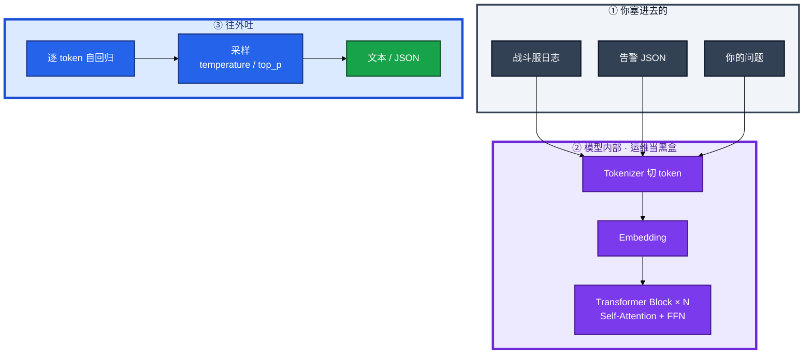
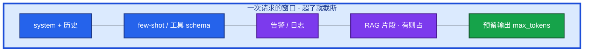
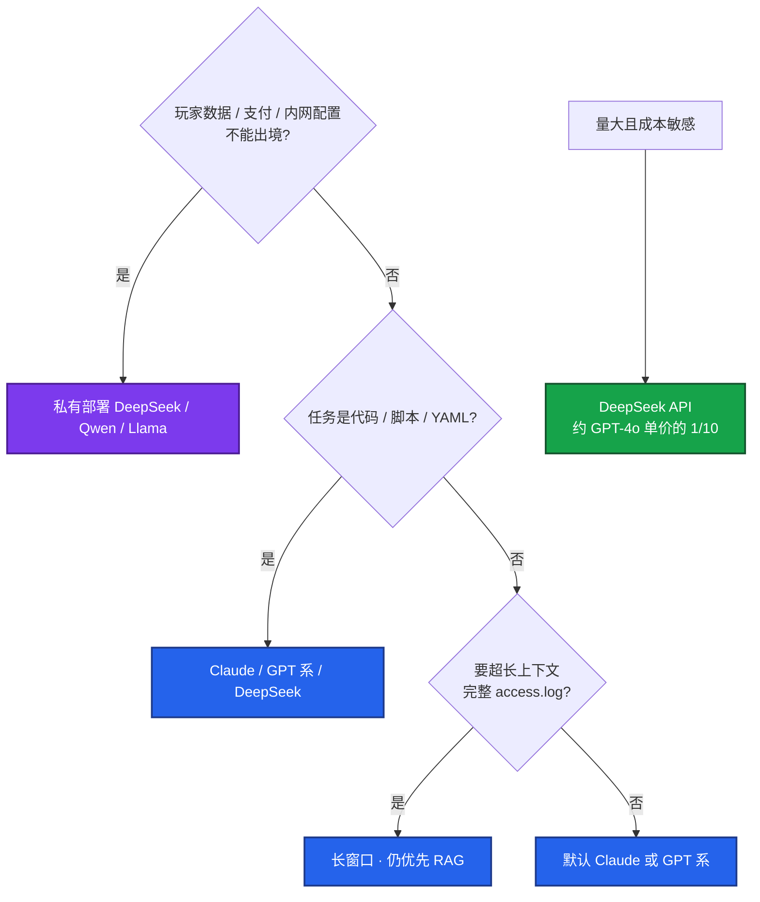
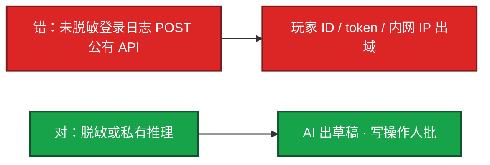
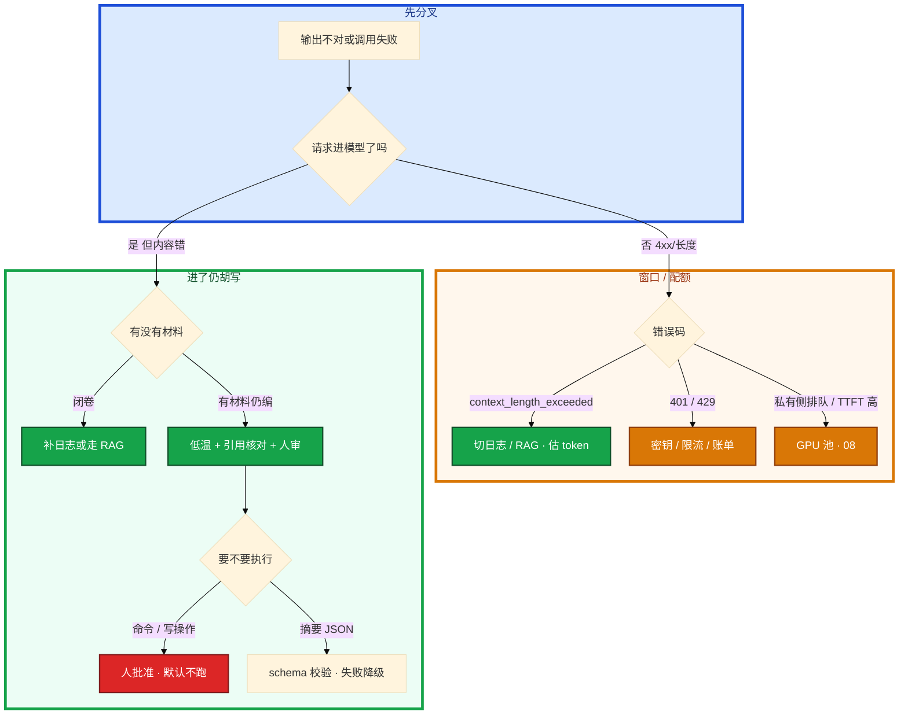

# LLM 与 Transformer 基础


活动高峰，有人把 `kubectl describe` 整段丢进公有云对话框，模型回了一条 `-o wide-events`。群里另有人要把玩家 UID 和付费流水一起贴上去。

先别动手。这一章后半全是你会用的：**怎么估窗口、怎么设温度、幻觉怎么挡、数据和密钥怎么不出域。** 前面的概念和原理，是为了让你动手时不把「像那么回事」当成真相。

**读完你能：** 白板上画出 tokenize → 堆叠块 → 采样；窗口超了能分清拒请求、截尾巴、输出写一半；排障 JSON 用低温但仍要人审；开闭源先问出境，不先问「哪个最强」。

## 本章目录

缩进 = 上下级。3 下面才是 3.1。

想钉在**正文左边**跟着滚：菜单 **查看 → 打开视图 → 大纲**。Markdown 预览做不到独立左栏，目录只能写在文章开头。

- [1. 基本概念](#1-基本概念)
- [2. 架构图](#2-架构图)
- [3. 原理](#3-原理)
  - [3.1 自回归](#31-自回归每次只预测下一个-token)
  - [3.2 上下文窗口](#32-上下文窗口输入--输出一起算)
  - [3.3 采样](#33-采样temperature--top_p)
  - [3.4 幻觉](#34-幻觉自信的错误不是搜错)
- [4. 落地选型](#4-落地选型)
  - [4.1 开源 / 闭源](#41-开源--闭源怎么选)
  - [4.2 API / 私有](#42-api-调用还是私有部署)
- [5. 核心配置](#5-核心配置)
- [6. 常用做法](#6-常用做法)
- [7. 常用操作](#7-常用操作)
  - [7.1 告警摘要](#71-告警摘要草稿不是silence)
  - [7.2 排障助手](#72-排障助手缩小范围不是替值班)
  - [7.3 写草稿](#73-脚本与文档草稿)
- [8. 生产排障](#8-生产排障)
- [9. 必会 · 常考](#9-必会--常考)
- [合上书](#合上书问自己)

**本章不讲：** 结构化 prompt、few-shot、注入 → [02 Prompt 工程](../02-Prompt工程/)；手册/复盘防幻觉、向量库 → [03 RAG](../03-RAG检索增强/)；调 Prometheus / 只读 kubectl → [04 Function Calling](../04-Function-Calling与Tool-Use/)；工具标准化 → [05 MCP](../05-MCP协议/)；多步自主排查 → [06 Agent](../06-Agent智能体/)；Cursor / Vibe Coding → [07](../07-AI工具实战与Vibe-Coding/)；Ollama、vLLM、GPU、TTFT → [08](../08-GPU与推理服务运维/)；告警降噪、不能自动修 → [09 AIOps](../09-AIOps落地/)。本模块是加分项，不是过关生死线。

---

## 1. 基本概念

LLM（Large Language Model）不是搜文档，也不是规则引擎。它把文本切成 **token**，过一层层 Transformer，**每次只预测下一个 token**。运维用它，是因为它读得懂自然语言和代码；翻车也在同一处——它不查真相，只拟合「像不像」。

在值班场景里，它不是 Prometheus，也不是 Runbook 引擎。它是一个 **闭卷续写器**：你塞进去的材料，才是它这一次「看见」的世界。

| 它会做 | 它不会做 |
|--------|----------|
| 把日志、告警 JSON、你的问题切成 token 再续写 | ssh 进节点、查 Prometheus、打开 Confluence |
| 按训练分布写出「像 kubectl」的句子 | 跑 `kubectl --help`、核对集群真实 flag |
| 低温时把输出收成稳定 JSON | 保证字段是事实；低温 ≠ 事实模式 |
| 长窗口里塞更多材料 | 记住上次对话窗口外的 wiki；无状态 |

三个角色不要混：

| 角色 | 干什么 |
|------|--------|
| **LLM** | 按概率吐下一个 token；没有检索、没有执行器时只会闭卷 |
| **你的程序** | Tokenizer 之外：截断策略、schema 校验、脱敏、人审闸门 |
| **人** | 对命令、对引用、对出域；值班责任不在模型 |

LLM 提供的能力和运维实际用到的：

| LLM 能力 | 运维怎么用 |
|----------|------------|
| 读自然语言 / 代码 | 告警摘要草稿、排障方向、脚本/YAML 草稿 |
| 上下文窗口 | 一次请求能塞多少日志 + 还留多少给答案 |
| 采样（temperature） | 进流水线就压随机性；不能当「事实开关」 |
| 指令遵循 | system 里写红线；挡不住幻觉，只是更像 SRE |

> **记住**：草稿可以信手，命令必须人审。模型会幻觉；玩家 UID、支付流水、token、kubeconfig **不出域**。AI 默认只出草稿和只读分析，写操作必须人批准。不要把 AI 吹成能替值班。

---

## 2. 架构图

先把整张图钉住。后面窗口、采样、选型、排障都对着这张图说话。



图上三条线：

1. **计费、窗口、截断都卡在 Tokenizer。** 不是「一个汉字」也不是「一个英文单词」。
2. **Attention / FFN 运维不调。** 你能稳定改变行为的，是采样和角色约束。
3. **下一 token 是概率，不是查询。** 没有检索、没有执行器时，它会把「像那么回事」的命令写得很自信。这就是幻觉。

三种使用形态（选的时候数据面不一样，挂的时候责任面也不一样）：

```mermaid
%%{init: {"flowchart": {"padding": 16, "nodeSpacing": 36, "rankSpacing": 48}, "theme": "base"}}%%
flowchart TB
    subgraph chat ["纯聊天 · 闭卷"]
        u1[人贴日志] --> m1[模型续写]
        m1 --> d1[草稿 / 可能幻觉]
    end

    subgraph api ["公有 API"]
        u2[脱敏后的请求] --> vendor[厂商]
        vendor --> m2[闭源模型]
        you2[你] -.->|完整 prompt 出域| vendor
    end

    subgraph priv ["私有部署"]
        u3[内网请求] --> gpu[你的 GPU / vLLM]
        gpu --> m3[开源权重]
        you3[你] --> ops[驱动 / 显存 / 排队]
    end

    classDef node fill:#334155,stroke:#0F172A,stroke-width:2px,color:#fff
    classDef model fill:#7C3AED,stroke:#4C1D95,stroke-width:2px,color:#fff
    classDef api fill:#2563EB,stroke:#1E3A8A,stroke-width:2px,color:#fff
    classDef warn fill:#D97706,stroke:#92400E,stroke-width:2px,color:#fff
    class u1,u2,u3,you2,you3,ops node
    class m1,m2,m3 model
    class vendor,gpu api
    class d1 warn

    style chat fill:#F1F5F9,stroke:#334155,stroke-width:4px,color:#0F172A
    style api fill:#DBEAFE,stroke:#1D4ED8,stroke-width:4px,color:#1E3A8A
    style priv fill:#EDE9FE,stroke:#6D28D9,stroke-width:4px,color:#4C1D95
```



纯聊天：最快上手，幻觉最高，命令绝不能直接跑。公有 API：效果新、少维护，厂商看见完整 prompt。私有：数据留 VPC，空闲卡时也烧钱，活动日和 GM 问答抢卡。细节在 08。

---

## 3. 原理

原理只保留动手和面试会用到的：它在算什么、窗口怎么爆、温度改什么、幻觉从哪来。

**本节 4 块：** 3.1 自回归 · 3.2 窗口 · 3.3 采样 · 3.4 幻觉

### 3.1 自回归：每次只预测下一个 token


1. **Tokenizer**：文本 → token。英文大约 4 个字符 1 个 token，中文大约 1 个字 1～1.5 个 token。计费、限流、能不能塞进一次请求，全按这个数。
2. **Embedding**：token → 向量。
3. **Transformer Block × N**：Self-Attention 看上下文谁相关，FFN 做非线性变换。运维当黑盒，不考 Attention 公式，不训模型。
4. **自回归**：每吐一个 token，就把它拼回输入再算下一个，直到结束符或碰到 `max_tokens`。

没有检索、没有执行器时，它只拟合「像不像正确答案」。所以会写出看起来合法、集群里没有的 kubectl flag。开卷要靠 RAG（03），执行要靠工具调用（04），都不是这张图自带的能力。

### 3.2 上下文窗口：输入 + 输出一起算

上下文窗口（context window）是 **一次请求里输入 + 输出的总和**。GPT-4o 一类大约 128K，Claude 长窗口大约 200K，Gemini 1.5 Pro 宣称到 1M。数字每年会变，选型看的是「这次任务塞不塞得下」，不要背型号当答案。

一次告警摘要把窗口走一遍。你要把 80 条告警 JSON、system 角色、输出 schema 一次丢进去：



Tokenizer 先把整段切成 token。超窗口的部分要么被 API 拒，要么从尾巴截掉。被截掉的那截，对模型等于不存在——它不会报「我没读完」。

| 你眼睛看到 | 窗口里实际发生了什么 |
|------------|----------------------|
| `context_length_exceeded` / `prompt is too long` | 请求根本没进模型 |
| 摘要漏了支付超时 | 支付那几条在输入尾巴，被切了 |
| 摘要写到一半，`finish_reason=length` | 输出预算 `max_tokens` 不够 |
| 多轮越聊越傻、早期约束消失 | 历史把窗口占满，旧 system / 红线被挤掉 |
| 中间某段手册「没看见」 | 超长上下文中间段落易被稀释（lost in the middle） |

卡住先看哪：

1. **先估再贴。** 1 万汉字大约 1.5 万 token。128K 窗口看起来很大，扣掉 system、历史、工具 schema、输出预留，能塞的日志没那么多。
2. **超长日志不要整文件硬塞。** 先按时间窗切（故障前后 5 分钟）、按关键字滤，仍不够就走 RAG（03），不要赌大窗口。
3. **输出也占窗口。** 让它写完整 Ansible / Terraform 时把 `max_tokens` 调大，同时给输入留余量。
4. **多轮要预算。** 工具回喂、RAG 片段、对话历史都算输入。排障助手开了 Function Calling（04）之后，窗口比「贴一段日志」紧得多。

```bash
# 粗算中文 token，只求数量级，不求精确
python3 -c "print(len(open('battle-oom.log').read()) * 1.5)"
# 128K 窗口 ≈ 中文 8 万字量级，再扣 system 和输出预留
```

预算口算（排障一次请求）：

| 槽位 | 先留多少 | 挤掉会怎样 |
|------|----------|------------|
| system 红线 | 0.5K～2K | 角色和「不给写命令」先没 |
| 工具 schema | 按工具数 | 描述糊、调错工具 |
| 日志 / 告警 | 能剩多少算多少 | 关键行在尾巴就被切 |
| RAG 片段 | 3～5 条，见 03 | 开卷材料没了，变闭卷 |
| 输出 | 摘要 0.5K；长脚本 2K～8K | `finish_reason=length`，JSON 残缺 |

常见误判：把「模型读过这份 wiki」当成「这次请求里它还记得」。无状态，窗口外的内容等于不存在。另一误判：Gemini 1M 就能替代知识库——超长上下文贵、慢、中间段落容易被稀释，运维手册更新仍该走 RAG。长窗口偶尔贴一份大配置可以；「战斗服 OOM 上次怎么收的」不要把半年复盘全文贴进去。那是错误检索，走 03，不是把窗口当硬盘。

> **记住**：窗口是输入 + 输出一起算的。日志塞满了，答案会被截掉；答案预留不够，结论写一半。截断不会鸣笛。

### 3.3 采样：temperature / top_p

模型内部的 Attention 不用调。你能稳定改变行为的，是采样和角色约束。告警摘要要进流水线，必须低温 + 死格式；同一段 OOM 日志拿去开脑洞，才把温度拉开。

每个位置模型先算出词表上的概率分布，temperature 把分布压尖或抹平，再采样一个 token。温度低，几乎每次都走最高概率那条路；温度高，冷门 token 也有机会。

| 参数 | 是什么 | 运维怎么用 |
|------|--------|------------|
| **temperature** | 随机性。0 更确定，1 更发散 | 自动化、脚本、JSON 用 **0～0.2**；排障分析 0.2～0.4；创意才往上拉 |
| **top_p** | 核采样，限制候选集合 | 固定 `top_p=1`，让 temperature 单独生效，少两头一起拧 |
| **max_tokens** | 最大输出长度 | 长脚本调大；分类 / 一句结论调小，防止它扯远 |
| **system prompt** | 角色和硬规则 | 「你是 SRE；只基于给定材料；不确定就说不确定；不给会改集群的命令」 |
| **seed** | 随机种子 | 同一入参要可复现时再开；不是所有厂商都保证 |

同一段 OOM 日志 / 同一组 80 条告警：

- `temperature=0` → 几乎每次都指向 limit / 泄漏，摘要字段稳定，便于进流水线
- `temperature=0.8` → 每次多几个「也可能是」的故事，值班对答案，不进程序

低温时告警摘要的 `severity` / `category` 两次调用对得上；高温时同一批告警，一次说登录、一次说网关，JSON 还夹 markdown。`finish_reason=length` 是 `max_tokens` 不够，不是模型「懒」。

要进程序的输出（告警分类 JSON、工单字段）**低温 + schema**，不要靠「再写一遍 prompt 求它听话」。写法在 02。需要复盘「当时模型说了什么」时，把 temperature、模型名、seed、原始 prompt 记进审计，否则不可复现。

常见误判：把 temperature=0 当成「事实模式」。它只是更爱走概率最高的那个 token，训练数据里的错法也会被高置信复述。低温不是零幻觉。温度只压随机性，编造的 API 名照样能出现。防幻觉靠引用材料和人审，见下一节和 03。

### 3.4 幻觉：自信的错误，不是搜错

幻觉是模型 **自信地输出错误信息**。开服夜它长这样：你把 `gw-1` 的 Events 贴进去，问「怎么看重启原因」。模型回了 `kubectl get po gw-1 -o wide-events`，还配了一段「根据第 12 行」。集群没有这个 flag，日志里也没有第 12 行。

训练语料里「kubectl」「-o wide」「events」经常挨着出现，模型把它们拼成一个从未存在的 flag。它没有 kube-apiserver，也不会跑 `kubectl --help`。


| 表现 | 现场后果 |
|------|----------|
| 命令 / flag 看起来对，集群没有 | 粘贴执行失败，或走到错误排查路径 |
| 命令能跑、参数指错 namespace | 不是报错，是误操作 |
| 编造监控指标名、工单 API | 脚本上线才爆 |
| 把 K8s 1.28 以前的写法当成现状 | 新集群上行为不对 |
| 训练截止日期之后的故障手册它没见过 | 给出过时止血步骤 |
| 引用行号对不上原文 | 正在编；「请引用文档」不够 |

按层叠防，不要只写一句「注意幻觉」：

1. **材料约束。** 「根据下面日志回答，不要臆测；信息不足就列出还缺什么。」
2. **强制不确定。** 「不确定请说不确定」，比逼它给结论更安全。
3. **结构化 + 校验。** JSON schema、程序 `json.loads`，非法就重试或降级。
4. **关键命令人审。** 删除、重启、改副本、改注册表，模型可以起草，**人批准才执行**。
5. **私有/最新知识走 RAG（03）。** 手册会改，模型权重不会跟着重训。合服步骤三个月前作废，闭卷一定编。

游戏支付日志、玩家 UID、token、kubeconfig **不出域**。脱敏或私有部署之前，不要把原文打到公有云 API。模型会幻觉，**写操作必须人批准**；AI 默认只出草稿和只读分析。

常见误判：觉得「我让它引用文档了就不会错」。它仍可能引用不存在的行号。把引用片段展示给值班看，人核对原文。角色写成「严谨 SRE」同样会编命令——角色是锦上添花，约束、格式、人审才是底。

> **记住**：幻觉不是「搜错了文档」，是续写走了训练分布里像那么回事的路。低温、角色、引用声明都降不掉这件事；材料 + 校验 + 人审 + RAG 才是栈。

---

## 4. 落地选型

### 4.1 开源 / 闭源怎么选

先问数据能不能出境、任务是不是代码、窗口够不够、钱是否敏感。不要从「哪个模型最强」开场。开服这三件事选型不一样：告警摘要可以走低成本 API；错误检索要读内网复盘，数据不能出境；GPU 上的推理服务是另一套账，细节在 08。



| 场景 | 怎么选 | 原因 |
|------|--------|------|
| 写 Shell / Python / YAML | Claude / GPT 系 / DeepSeek | 指令遵循和代码质量够用 |
| 分析超长日志、大段配置 | 长窗口模型 | 少切几次，但超长仍优先 RAG |
| 国内合规、用户数据 | Qwen / DeepSeek 私有化 | 数据留在域内 |
| 低成本批量分类、摘要 | DeepSeek API | 单价低 |
| IDE 里写运维工具 | Cursor + 强代码模型，见 07 | 要的是改文件，不是聊天 |
| 要调监控 / 只读命令 | 工具调用能力强的模型，见 04 | 纯聊天接不上 Prometheus |

开源不是「免费且更安全」：你要承担 GPU、漏洞补丁、越狱和提示注入。闭源不是「把生产交给别人」：合同、数据处理地域、是否用于训练、子处理器、日志留存，要法务和安全点头。技术选型过了，法务没过也不能上。

日常开发用闭源 API 提速，**碰玩家和密钥的自动化走私有部署**，这是游戏公司最常见的组合。

常见误判：为了一个「最强」把战斗服日志原文打到境外；或者反过来，所有聊天都上 70B 本地卡，成本被空闲 GPU 吃掉，活动日再和 GM 问答抢卡。选型是场景题，不是信仰题。

### 4.2 API 调用还是私有部署

告警摘要 bot 每分钟几十次、入参已脱敏，走公有 API 往往更省。错误检索要读未脱敏的复盘和支付应急 SOP，必须私有或专区。GPU 打满是第三种账：私有推理的卡时是你的，空闲也烧钱，见 08。

| 维度 | 公有 API | 私有部署 |
|------|----------|----------|
| 数据 | 出域风险，要脱敏 / 合同 | 留本地 / VPC |
| 成本 | 按 token | 卡时 + 电 + 人，空闲也烧钱 |
| 效果 | 往往更新、更强 | 受卡和模型版本限制 |
| 延迟 | 公网 / 专线 | 内网可控 |
| 维护 | 厂商的 SLA | 驱动、显存、扩容是你的，见 08 |

私有部署名字只记两个入口，细节全部在 08：**Ollama** 适合个人和小团队本地试模型；**vLLM** 适合生产高并发。LM Studio、Xinference 是同一类「把模型变成 HTTP」的工具，选型仍按并发和 SLA，不要按 GUI 好不好看。

公有 API 是 HTTPS 出域，厂商看到完整 prompt。私有部署是权重加载进显存，请求走内网；卡被 GM 问答打满时，你的告警摘要也会排队，TTFT 从几百毫秒变成数秒——那不是「模型变笨」，是推理池过载。

你眼睛看到什么：公有侧是 401/429/`context_length_exceeded`、账单上的 token。私有侧是 `nvidia-smi` 利用率、显存、网关排队。不要用「模型不聪明了」当第一判断。



卡住先看哪：数据能不能出境 → 延迟 SLA 够不够 → 量是按 token 便宜还是按卡时便宜。活动日 GPU 打满，先限流和排队，不要先怪模型。

编码工具只记定位：GitHub Copilot 是补全；Cursor 是 AI-first 编辑器；Codex / Claude Code 是终端 Agent。怎么操在 07。界面不是选型本身：用了 Cursor，背后仍要选模型、决定数据是否出域、是否允许 Agent 跑命令。

---

## 5. 核心配置

只动有证据的项。进流水线的请求把参数写进模板版本，和 prompt 一起审计。

| 参数 | 默认直觉 | 生产怎么用 | 改错会怎样 |
|------|----------|------------|------------|
| temperature | 聊天随便 0.7 | 自动化 / JSON **0～0.2**；排障 0.2～0.4 | 过高字段漂移、夹 markdown；当事实开关则幻觉照旧 |
| top_p | 有人拧 0.9 | 固定 **1**，只拧温度 | 两头一起拧，行为不可复现 |
| max_tokens | 越大越好 | 按输出类型留；给输入留余量 | 太大费钱；太小 `finish_reason=length`，JSON 残缺 |
| context 预算 | 窗口标称值 | 先扣 system / 历史 / 输出，再贴日志 | 尾巴被切，模型「没看见」关键行 |
| seed | 关 | 同一入参要可复现再开 | 不是所有厂商保证；不记则复盘对不上 |
| system prompt | 「你是专家」 | SRE；只基于材料；不确定就说；不给写命令 | 角色 alone 挡不住幻觉和注入（02） |

> **记住**：temperature=0 不是事实模式。窗口标称 128K 不是你能贴 128K 日志。合同里的数据地域和是否用于再训练，和技术参数一起过。

---

## 6. 常用做法

用 AI 提效就三块，别吹成「我们有智能运维大脑」。考察时问「你怎么用 AI」，答工具链 + 一个具体故事 + 边界（幻觉、不出域、不自动改生产）。问「生成的脚本直接跑吗」——**不跑。** 问 MCP / Agent 就指到 05、06，本章不展开。

| 目的 | 做法 | 看什么 |
|------|------|--------|
| 估能否贴 | 中文 × 1.5；先扣 system 和输出 | 数量级对上再 POST |
| 贴日志 | 故障前后 5 分钟 + 关键字；仍长走 RAG | 不要整份 `access.log` |
| 进程序 | 低温 + schema + `json.loads` | 非法就重试或降级，见 02 |
| 复盘模型当时说了什么 | 记模型名、temperature、seed、原始 prompt 和材料 | 不记就不可复现 |
| 对话里拆开讲 | 摘要 / 检索 / GPU 三件事分开 | 不要混成「我们用了大模型」 |

值班先记住这四句：

```text
窗口 = 输入 + 输出；超了截尾巴，不会鸣笛
自动化 temperature 0～0.2；低温 ≠ 不幻觉
命令人审；UID / 支付 / kubeconfig 不出域
长窗口不替代知识库；过期 SOP 走 RAG 下架
```

对话里把三件事拆开讲：

| 场景 | 口径 |
|------|------|
| 告警摘要 | 低温 JSON，规则层先去重，模型只收束，不能自动 silence（09） |
| 错误检索 | RAG 开卷，闭卷必幻觉；过期 SOP 要下架（03） |
| GPU 打满 | 先看排队和显存，不先删业务 Deployment（08） |

---

## 7. 常用操作

开服夜对应三件事：告警摘要是草稿、错误检索是缩小范围、写巡检脚本是 Cursor 里改（07）。GPU 池本身是 08 的活，不是「再换一个更聪明的模型」。**AI 不能替值班**：它没有变更权、没有现场责任、没有「我看过集群」这回事（除非走 04 的只读工具，且工具结果仍要人认）。

### 7.1 告警摘要：草稿，不是 silence

规则层先按 fingerprint 去重，模型只把 80 条收成一条给人看的摘要 + 给程序的字段。temperature 0～0.2，只输出 JSON，程序再校验。

**不要：** 让模型自动 silence、自动 ack、自动转 P0。摘要错了最多吵一嘴；silence 错了是漏告警。边界在 09。

### 7.2 排障助手：缩小范围，不是替值班

贴过滤后的日志和近期变更，要排查方向和只读命令，自己执行只读命令验证。故事可以讲：活动中 OOM，把 describe + 内存曲线摘要贴给模型，它给出「limit 贴满 / 泄漏」两条假设和 `kubectl top`、看 limit 的只读命令。人验证后走变更单调 limit。没有让它执行任何写操作。

**不要：** 把「模型建议重启」转发成已经执行；不要让它替你担责。局限：幻觉、训练截止、窗口有限、不能替你签字。解决方案：RAG、人审、只读工具（04）。

### 7.3 脚本与文档草稿

1. **写草稿：** Shell / Python / YAML，Cursor 里改，人 review 再跑。流程在 07。
2. **文档草稿：** RCA、Runbook、故障通告，事实以外标「待补充」。玩家通告另写一版，不泄漏组件名。

终端 Agent（Codex / Claude Code）默认只读和草稿，写操作人批准。不能直接 apply 生产。

---

## 8. 生产排障

和别的章同一套三问：请求进没进模型？进了看见了什么？输出能不能当命令？

**模型答得差 = 先看窗口和材料，不是立刻换「更强」的模型。** 已有业务进程、已有告警规则通常还在。AI 挂了不该重启逻辑服。



现场顺序：

1. 看 HTTP / `finish_reason`：拒请求、length、还是正常 stop。
2. 估这次输入 token，对一下窗口预算。
3. 有没有脱敏；有没有把 UID / kubeconfig 打出去。
4. 输出当不当命令：不当。人审。
5. 私有侧先看排队和显存，不先删业务 Deployment。

| 现象 | 先做什么 | 不要做什么 |
|------|----------|------------|
| `context_length_exceeded` | 切时间窗 / 关键字；仍长走 RAG | 赌 1M 窗口替代知识库 |
| 后半段像没看见 10:32 报错 | 当截尾巴；重贴关键段到前部 | 怪模型「不认真」 |
| 同一告警两次标签不同 | 查 temperature 是不是被改成 0.8 | 再写一遍「请稳定」 |
| 编造 `-o wide-events` | 人审；材料约束；RAG | 直接粘贴执行 |
| 写了「请引用」仍对不上行号 | 把引用片段展示给人 | 相信声明 |
| TTFT 从 300ms 到 8s | 推理池排队 / 显存（08） | 「模型变笨了」先换模型 |
| 未脱敏日志已 POST 公有 API | 当出域事件；切密钥/合同 | 假装模型会自动忘掉 |

活动高峰有人要把玩家流水丢给公有云「智能分析」。正确处理：停这次调用 → 确认出域范围 → 改脱敏或私有 → 摘要继续只做草稿。不要为了「AI 提效」把支付日志打出去。

---

## 9. 必会 · 常考

白板和追问高频，能一口回：

| 说法 | 对错 | 口径 |
|------|:----:|------|
| LLM 是把手册检索了一遍 | 错 | 下一个 token 的概率预测，不是查库 |
| 运维要会推 Attention 公式 | 错 | tokenize、窗口、采样、幻觉四件事 |
| 窗口只算输入 | 错 | 输入 + 输出；输出预留不够会写一半 |
| 超窗口模型会提示「我没读完」 | 错 | 拒请求或截尾巴，截掉的等于不存在 |
| 128K 就能塞整本 wiki 替代 RAG | 错 | 贵、慢、中间稀释；手册更新走 RAG |
| temperature=0 就不会幻觉 | 错 | 只压随机性，不是事实模式 |
| 低温 + 角色「严谨 SRE」可直接跑命令 | 错 | 命令人审；AI 默认草稿和只读 |
| 写了「请引用日志」就不会编行号 | 错 | 仍会编；片段给人核对 |
| 开源 = 免费且更安全 | 错 | 你运维 GPU、补丁、越狱和注入 |
| 玩家数据可以打到最强闭源 API | 错 | 先问出境；碰用户数据和密钥走私有化 |
| 用了 Cursor 就不用管开闭源 | 错 | 界面背后仍要选模型和出域策略 |
| 私有 70B 24 小时空转更稳 | 错 | 成本在利用率；活动日和 GM 抢卡 |
| TTFT 变高说明模型变笨 | 错 | 先看排队和显存 |
| 告警摘要可以自动 silence | 错 | 只收束；silence 是漏告警 |
| AI 可以替值班做变更决策 | 错 | 无变更权、无现场责任；人担责 |

数字：中文约 **1～1.5 token/字**，英文约 **4 字符/token**；128K ≈ 中文 **8 万字**再扣 system 和输出；自动化 temperature **0～0.2**；DeepSeek API 单价约 GPT-4o 的 **1/10** 量级；长窗口 Claude **200K** / Gemini **1M** 量级，仍优先 RAG。

易混：截断 vs 幻觉（前者没看见，后者看见了还编）；低温 vs 事实；长窗口 vs 知识库；公有 API 效果 vs 出域；Ollama 试模型 vs vLLM 生产；Copilot 补全 vs Cursor 整仓 vs 终端 Agent；模型答得慢 vs GPU 池过载。

---

## 合上书，问自己

1. LLM 在算什么？和搜文档、规则引擎差在哪？
2. 窗口里哪几段加起来？超了三种表现？128K 大概能塞多少中文？
3. 排障 JSON 的 temperature 怎么设？设 0 还会幻觉吗？
4. `-o wide-events` 这种命令直接跑吗？幻觉五层怎么叠？
5. 开闭源、API / 私有，第一问是什么？玩家数据呢？
6. 告警摘要、排障助手各能做什么、不能做什么？AI 能不能替值班？

六题都能口述，这一章就过了。下一章把 Prompt 写成规格书：角色、分隔符、注入、JSON 怎么焊死。
